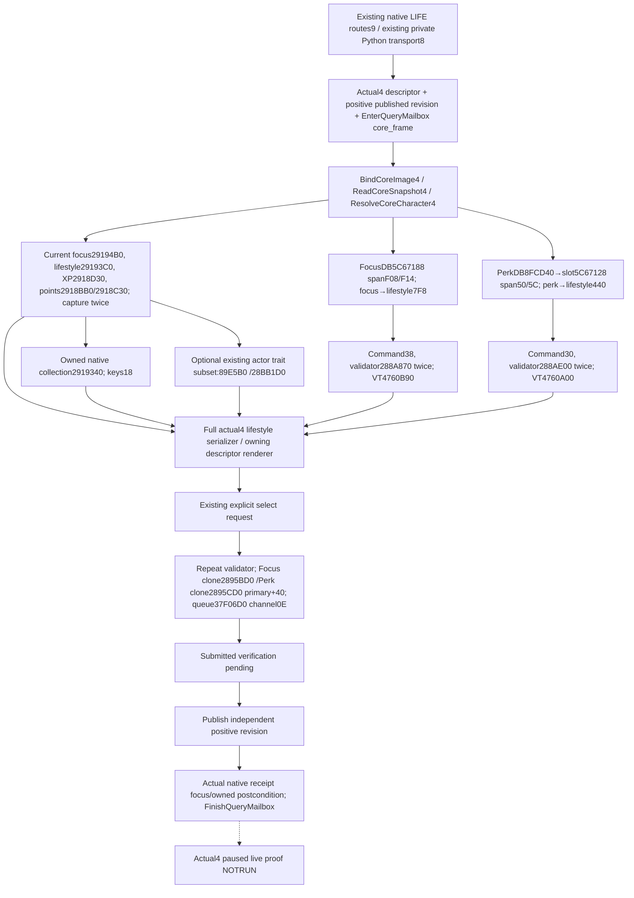

# Lifestyle native binding migration for 1.20.0.4
SOURCE_PREPARED, 2026-10-07 / 2026-W41. Frozen actual version1.20.0.4, Steam25734779, SHA98702f88a547cde2eaf29a85f93b85f68ee4cf8148336a4f7afaeb75319dd518. Runtime FIRST/build/tests/live NOTRUN. Supplied base caa4adc3d1278e324cf4ec19774028e9b9138e28; no child Git or hash reread.



The exact window-refresh source-use body1445E40 closes the FocusDB and PerkDB layout witness but is never called by the windowless observer. Twelve owned complete function/leaf spans and two selected120-byte virtual tables compare frozen .3/.4 bytes; nonrelative immediates, member operands and local control topology are retained. Owned collection and PerkDB getter proofs are reused from the Faith owner; actual4 core/command identities and layouts are entry-owned. No shared depot regeneration or trait/perk definition reread was needed.

| Input or stage | Actual4 binding | Accounting |
| --- | --- | --- |
| Core played Character identity and clock | Actual4 core bundle | Entry proof reused; positive real published revision |
| Current focus/lifestyle |29194B0 /29193C0; fallback5D1E308 | Complete finite native leaf proof |
| XP /unused /used points |2918D30 /2918BB0 /2918C30; per-level130 | Complete finite body proof; zero retained |
| Owned perks |2919340; countC /pointer stride8 | Faith owned source proof reused |
| Optional actor traits |89E5B0 /28BB1D0; existing32-key subset | Complete body proof; unavailable remains separate |
| Focus target final legality | DB5C67188 F08/F14, validator288A870, primary4760B90 /secondary4760B60 | Original target/key/Character ID checks and two validator calls retained |
| Perk target final legality | DB8FCD40 /slot5C67128 span50/5C, validator288AE00, primary4760A00 /secondary47609D0 | Original policy-scoped target subset retained |
| Command clone /queue |2895BD0 /2895CD0, primary+40; queue37F06D0, manager5CC1240,channel0E | Selected slot proof; central command helperd2ced923 |
| Observer versus action outcome |Full snapshot readiness /pending ACK /later receipt | No ACK as applied outcome; no actual4 live claim |

The shared played-character DWORD source has an existing actual4 instruction witness at `0xCF5801`, reading four bytes from global `0x54DBC00`. The sole mapper supplied its precise metadata locator: `Z:/ck3_mod_rewrite_process_assets/g2-parallel-20261007/battle-pursuit/migration-steam25734779/actual4-domain/diplomacy-map/ROOT-DELIVERY.json`, field `shared_played_id_source`, backed by `first01/war_resolution_context-DETAIL.json` in the same directory. Lifestyle reuses this source proof without rereading the body/cache or claiming runtime execution.

## Source integration recipe

SOURCE_PREPARED only. No build, tests, project imports, game, SDK, Git, hashes or FIRST were executed.

# Actual 1.20.0.4 lifestyle integration recipe
SOURCE_PREPARED only. No build, tests, project imports, game, SDK, Git, hashes or FIRST were executed.

Dependencies: supplied caa4adc3d1278e324cf4ec19774028e9b9138e28; entry clock c2191cec915e8fc70a5057b2a20cddb6a5be2f75; descriptor4 mailbox Envelope6ba4132fa7a16d4a8c3af44716cf11c895e5a5b5; actual4 command foundation d2ced9237c25e758f9380637eaf76e4f02891452. Parent integrates dependency source; this package does not copy shared core/header/adapter files.

Copy only candidate manifest files. Add `include(cmake/lifestyle_12004.cmake)` after xar_ck3_12002_runtime and xar_bridge_protocol exist. Existing ON flag remains XAR_CK3_ENABLE_G2_PLAYER_LIFESTYLE_FORMAL_WIRE_PRIVATE_V1; no new switch or typed MCP tool. Own leaf adds eight actual4 runtime translation units and one focused FIRST target.

In actual4 adapter creation compose this software bundle:
```cpp
auto lifestyle4 = xar::ck3_12004::lifestyle::BindPlayerLifestyleImage12004(
    module_base, actual_executable_sha256);
```
Pass the actual descriptor SHA, never the old Crozier alias. Bundle factory selects actual4 native callbacks and reuses actual4 CoreBindings. It contains no capturer for another domain.

Register `&xar::ck3_12004::lifestyle::ExecutePlayerLifestyleMailbox12004` in the actual4 owning executor list passed to BindThreadRuntimeImage/InstallCoreFrame12004. The context owns QueryMailboxEnvelope, sets envelope.game=&actual4 adapter, expected_snapshot_revision to the positive provider-published revision, typed_context=context, comparison core_frame. Enter/Finish are existing shared functions. Character-state reader uses actual4 ReadCoreSnapshot and ResolveCoreCharacter; it never unwraps NativeAdapter12002.

Add the explicit actual4 branch to the existing native LIFE route before the legacy handler, under the existing flag:
```cpp
if (xar::game::IsCk3_12004Descriptor(game.descriptor()) &&
    xar::ck3_12004::lifestyle::AcceptsPlayerLifestyleStep12004(step)) {
  auto response = xar::ck3_12004::lifestyle::HandlePlayerLifestyle12004(
      lifestyle_transport4, request_id, step, incoming.payload, game,
      lifestyle4, *previous_snapshot, state_revision,
      g_main_thread_query_mailbox_v1);
  connected = write_frame(pipe, response);
  if (connected &&
      xar::ck3_12004::lifestyle::PlayerLifestyleNeedsPostSubmitSnapshot12004(
          lifestyle_transport4, request_id)) {
    previous_snapshot.reset();
    connected = PublishSnapshot(pipe, game, previous_snapshot, state_revision,
                               checkpoint_submission, published_checkpoint_sequence);
  }
}
```
Retain the old unavailable-previous_snapshot response before dereferencing it. The transport state is provider-owned per connection; reset it with the same previous lifecycle boundary as existing private LIFE state. Do not route an actual4 descriptor through the old handler.

Actual native step names (nine): formal, current-state, stock-focus, professional-workforce, diplomacy-targets, martial-authority query strings; select perk, select stock-focus; receipt. Exact constants remain ck3_11906::kPlayerLifestyleFormalPrivate*V1 software route lineage. Full output uses RenderPlayerLifestyle12004→actual SerializePlayerLifestyleSnapshot12004V1 and game::Render12004BuildIdentity(descriptor). DTO private key/source names are retained.

Capabilities: preserve existing private_build:true / advertised:false route behavior and the same flag-controlled accept list. The registered ck3_execute_step tool has no dedicated lifestyle tool. Existing generic service forwards to driver; generic driver primitive requires an advertised action_steps entry. Private Python transport contains eight explicit methods and does not expose professional-workforce. This migration adds no Python method, no action_steps entry, no new policy target. Python leaf has no old version/SHA literal needing a domain edit; central actual4 identity pair remains entry-owned.

FIRST build target: xar_ck3_12004_lifestyle_first_v1_test. Exact executable argv: --wire-dir <fresh-output-directory>. Test name xar_ck3_12004_lifestyle_first_v1. Root may build only this target then invoke its binary directly once; no ctest-all or old-family rerun is included. Four cases use synthetic frame/source inputs and actual production reader/full serializer/descriptor renderer. They do not invoke mapped callbacks, validators, clone, queue, mailbox pump or CK3. Actual4 live validation of those routines remains Root's future owning-thread paused acceptance.

Expected generated files: 01-no-current-focus.json; 02-current-focus-progress.json; 03-native-sample-drift.json; 04-old-sha-rejected.json; each also has -snapshot.json raw production serializer output. Synthetic fixture progress is 12345678 total raw /2345678 within raw /1000 per-level /2 unspent /3 used; owned cutting_corners_perk. No focus is legitimate absence and zero owned perks. Legal candidates remain unavailable; partial candidate readiness is not reported as a full formal-action proof. Drift and old SHA are unavailable errors and do not produce an available action context.

True remaining: parent copy and shared hook integration; first compiler/link/runtime fixture; actual4 paused producer/validator/command receipt live qualification. All current methods NOTRUN. This package is source preparation, not static GREEN or live capability.

Exact previous-image rejection case uses frozen 1.20.0.3 SHA 94B55397ABB687A3DCD436805A5D885E6BE90FA6C693FEB44A9E3BBEEADE02A6; the source's historical 1.20.0.2 helper names remain only software lineage.

## Source attachment correction
2026-10-07 source-only correction before parent copy: TrySubmitMainThreadQueryV1 passes executor_context=&owner.envelope and envelope.typed_context=&owner. ExecutePlayerLifestyleMailbox12004 casts its opaque pointer to QueryMailboxEnvelope*, obtains the typed owner, and calls EnterQueryMailbox / FinishQueryMailbox on that same envelope. Enter owns the actual selected mailbox slot.

The transport's before/completion reads use the selected adapter's ReadCk3_12002TimelineCoreSnapshot dispatch and the exact eight fields used by shared QuerySnapshotComparison12002::core_frame: date_raw, speed, paused, player_id, map_ready, has_played_character, played_character_id, played_character_alive. Completion also requires the owning-thread FinishQueryMailbox frame_stable result. It does not compare unrelated borrowed full-snapshot fields. This corrects a concrete envelope attachment failure and keeps the existing actual4 core observation semantics. Native FIRST/build/import/tests remain NOTRUN.

## Whole current-state private consumer

The actual `mcp_server.py` registers no separate Lifestyle, focus or perk closure. The existing generic `ck3_execute_step` registration does not grant this private family an advertised action step. `NativeHeadlessGameplayDriver.query_player_lifestyle_formal_private_v1` explicitly remains outside public steps/MCP; the existing current-state query is `query_player_lifestyle_current_state_private_v1`, which calls the unchanged private transport with its current-state step. The four whole native fixture results are current-state results and must retain that step.

The separately named `tests/test_lifestyle_whole_service_12004.py` provides one method, `LifestyleWholeService12004Tests.test_four_native_current_state_wholes_keep_private_driver_and_service_observer_contract`. It consumes the four original whole files through the actual private Driver query and its production normalizer, then supplies that actual query result to `GameplayBridgeService._observe_opening_lifestyle_perks_v1`. Synthetic hello, paused frame and transport correlation are fixture inputs. No native result or serialized snapshot is rewritten, and no private route is promoted to a public tool. Available no-focus/progress observations retain legal zero/absence, raw XP and perk state; legal focus/perk candidate readiness stays false. Native sample drift and old-SHA rejection remain unavailable. The private Service observer therefore retains its actual blocked outcome instead of treating a current-state snapshot as formal candidate/action proof.

This source-only compound closes the missing four-whole current-state consumer recipe. It does not exercise the other private routes, native professional-workforce handler, mapped validators, command clone/queue, focus/perk submission, independent applied receipt or a paused CK3 process. Root owns the first fresh native producer and one invocation of the final sole consumer. Consumer imports, build, tests and FIRST remain NOTRUN here.
