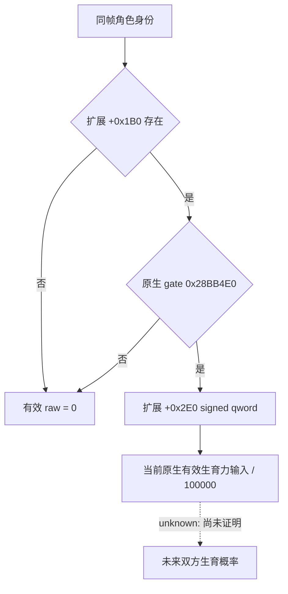

# 1.20.0.2 婚配有效生育力原生读取

状态为 **static-ready**。只读取冻结 EXE，没有访问 CK3 进程、管道、桌面、用户目录或存档；本页不提供新的 live 资格。

Exact build：CK3 **1.20.0.2**，EXE SHA-256 `AE1BA6FF060BA603842F6F4A2DED0AF4B7D3666B3DD271F75FB01B0DA8E81B2D`。来源为迁移冻结 EXE。旧版对照来自 `46ca368cebfaff64cf09c29dd6d8b0de206c661c` 的 `marriage_character_fertility_v1.hpp`。

## 可用于施工的读取入口

| 绑定 | 1.20.0.2 | 原生证据 |
| --- | --- | --- |
| 有效值 getter | `0x28C6360`，`std::int64_t* (*)(void* character, std::int64_t* out)` | RCX 为角色，RDX 为输出 qword；RAX 返回同一输出指针 |
| 生育资格 gate | `0x28BB4E0`，`bool (*)(void* character)` | getter 在 `0x28C637A` 调用 |
| 角色扩展指针 | `Character + 0x1B0` | getter、两处 UI 消费者及原生调整计算一致 |
| 扩展有效生育力 | 扩展 `+0x2E0` 的 signed qword | getter 在 `0x28C638A` 读取；资格不成立或扩展不存在时写零 |

Getter 在 `0x28C636A` 检查扩展存在，在 `0x28C637A` 调用 gate；成功分支的 `0x28C6383/0x28C638A/0x28C6394` 依次读取扩展、数值、写入输出；`0x28C63A2` 写合法零。正式代码可直接调用此 getter，沿用既有 exact-build 绑定及角色身份校验。

原生 UI 消费者 `0xDC34BF–0xDC34E7` 和 `0x1376C5C–0x1376C84` 独立复现相同 gate、`+0x1B0`、`+0x2E0`、零回退。原生属性包装器 `0x28CFE20` 在 `0x28CFE37` 调用 getter，在 `0x28CFE42` 将结果交给原生数值装箱。没有把基础数值或未过资格的缓存值当作有效值。

## 数值语义与边界

原生调整后的 childbearing 输入计算 `0x2B951F0` 同样读取 gated effective qword，再参与 signed fixed-point 运算。其 `0x2B9536E–0x2B95383` 使用 magic `0x29F16B11C6D1E109`、高位乘积、右移 14 和负数修正，对应除以 **100000**；慢路径 `0x2B953AD` 显式以 `0x186A0 = 100000` 重建商的残差。Verifier 用 14 个 signed 整数向量互证该分母。

因此可以保留 `effective_raw` 并标注固定点分母 100000。这个值是当前单角色的原生婚配输入，不是未来婚姻日期的生育力，也不是双方生育概率或保证子女。Gate 内具体年龄修正和 trait flag 的命名未在本包展开；策略直接消费原生最终结果。宗教保持现有范围，没有新增通用宗教投影。



## 可复现证据

Fixture：`ck3_autonomous_player/native_bridge/research/fixtures/ck3_12002_family_fertility_abi.json`。Verifier：`ck3_autonomous_player/native_bridge/research/verify_ck3_12002_family_fertility.py`。它冻结 8 个唯一签名、36 条指令、6 个源码跨度和 13 项实际原生绑定关系。

```cmd
Z:\ck3_mod_rewrite\tools\.venv\Scripts\python.exe ck3_autonomous_player\native_bridge\research\verify_ck3_12002_family_fertility.py --exe Z:\ck3_mod_rewrite\artifacts\migrations\2026-09-30\post-update-1.20.0.2\installation\binaries\ck3.exe --result Z:\ck3_mod_rewrite\artifacts\nonwar\2026-10-01\ck3-12002-family-fertility-abi-result.json
```

新版 provider 已在 `ck3_12002_family_value.hpp/.cpp` 接入与 stock getter 相同的资格 gate 和缓存值读取分支，保留扩展存在、gate 是否采样及其实际结果等元数据；MSVC `/W4 /WX` 编译和离线 fake-memory/function binding fixture 已通过。集成与验收边界见[家族价值观测迁移](ck3-1.20.0.2-family-value-observation.md)。剩余项是 paused 同帧双方读取的实机验收；源码与离线 ABI 完成不替代新的实机结果。
