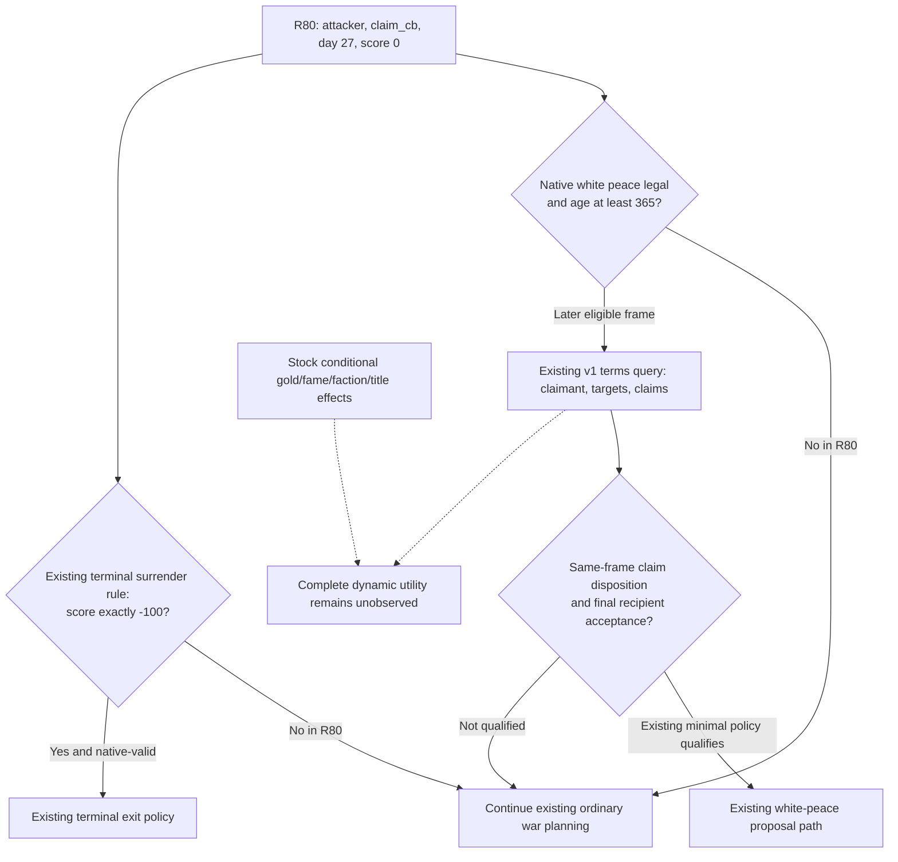

# R80 claim-CB terms and ordinary continuation on CK3 1.20.0.4

The retained R80 options response does not expose a complete settlement forecast. It also does not show a missing actual4 claim-reader binding. The existing separate `ck3_query_war_termination_terms` publishes the claimant, ordered target titles, current claims and the narrow claim-disposition result. At the observed attacker day 27 and warscore 0, ordinary continuation needs no new observer or policy change: white peace is native-invalid and below the existing 365-day policy threshold; legal, automatically accepted surrender is not itself a reason to select surrender.

## Frozen evidence and current boundary

This source review uses integration commit `0a66e23db77d989304dfb3a90359df1b3c79d3f0`. The retained R80 launch metadata separately identifies SDK source `dac47ba428d524ff201c7aeff295c58243cfa820` and native source `45ce81348ab7fcdde6900dfa95b9e5fbf546c927`; the review commit is not claimed as the loaded DLL. The adopted exact-build identity is CK3 1.20.0.4, Steam build 25734779, EXE SHA-256 `98702F88A547CDE2EAF29A85F93B85F68EE4CF8148336A4F7AFAEB75319DD518`. These are reused source/receipt identities, with no new EXE read or hash.

Original response: `Z:/ck3_mod_rewrite_process_assets/g2-background-20261008/managed-full-h9715-r80-abi42restore01/operator/gameplay-responses/008-r80-ordinary-auto02.json` (64,820 bytes). It was read once into `g2-background-20261009/r80-claim-cb-terms/R80-008-THIN.json`. The following literal pointers are in that retained response:

| Pointer under `/result/structured_content` | Observed value |
|---|---|
| `/selected_step` | `query-war-termination-options-100663329` |
| `/result/queried_revision`, `/result/queried_native_revision` | public 3, native 2 |
| `/result/war_termination_options/player_side` | `attacker` |
| `/result/war_termination_options/war_duration_days` | 27 |
| `/result/war_termination_options/active_casus_belli_identity/database_index` | 11 |
| `/result/war_termination_options/options/{surrender,white_peace,victory}/available` | true, false, false |
| The same options' `/terms_observable` | false for all three |
| The same options' `/terms/reason` | `cb_specific_terms_not_observable` |

`/result/is_error` is false. Root supplied the remaining actual summary values separately: `claim_cb`, warscore 0; white-peace AI score -30, victory -99, surrender 901; surrender `auto_accept=true`. The thin artifact distinguishes those supplied values from literal-pointer extraction. Final recipient acceptance is unavailable in the retained options body. No settlement, resource change, additional day, save or completed OODA is credited by this review.

## Stock result tree and what it can establish

The local primary text is `Z:/ck3_mod_rewrite/Crusader Kings III/game/common/casus_belli_types/00_claim.txt`, with helpers in `common/scripted_effects/00_war_effects.txt` and `00_casus_belli_effects.txt`. The [actual4 Battle/War migration topic](ck3-1.20.0.4-battle-war-domain-migration.md) retains the earlier claim-script pin because the frozen game-data depot manifests were equal. The older .2 EXE pin remains historical; it is not the current R80 executable identity. This work reuses that source relationship without hashing or requalifying it.

| Stock callback | Source-established result | Current binding still needed to calculate the complete outcome |
|---|---|---|
| Attacker victory, `00_claim.txt:375–599` | Orders targets; resolves `conquest_claim` for the claimant with `add_claim_on_loss=yes` (`468–483`). Administrative primary-title cases can expand targets (`450–461`); ceremonial and claimant-vassalization branches are conditional (`485–558`). | Actual target/claimant identities, titles and lieges; government and ceremonial conditions; engine-resolved title/vassal changes. |
| White peace, `612–688` | No title-change object; weak claims on declared targets become strong (`624–633`). Attacker fame/prestige, trait-dependent stress, truce and other helper effects are distinct from title disposition. | Current claim rows, traits, contribution/helper values and truce conditions. No current white-peace legality is inferred from this script. |
| Attacker defeat, `709–789` | Removes claimant claims on declared targets (`724–730`); invokes reparations and defender-win helpers. The loser faction helper adds **25** targeting-faction discontent (`779–782`; `00_war_effects.txt:1057–1065`). | The actual claimant/targets and income/culture/helper inputs; current resource and faction state. |

Reparations pass `GOLD_VALUE=3`. The helper uses a conditional culture multiplier and either a `medium_gold_value` branch or `pay_short_term_gold` with `yearly_income=yes`. This is not evidence for “three months of income”, a numeric R80 debit or a zero-cost surrender. Victory/defeat also contain conditional legitimacy, influence, merit, Mandala piety and contribution effects; landless-adventurer payout tooltips do not alone prove a payment executed. The stock rules explain direction and dependencies, not the complete current result. The full branch/source ledger is the external `stock/SOURCE-TREE.json`.

## Existing actual4 observer and ordinary consumption

The generic placeholder is explicit in `native_bridge/src/bridge.cpp:4331` and `include/xar_bridge/game_contract.hpp:1857`. It is not the separate claim-terms DTO at `game_contract.hpp:2054`. The actual4 adapter advertises the v1 terms capability (`src/ck3_12004_adapter.cpp:166`) and supplies `ck3_12004::BindClaimTermsImage` with actual4 Core/World/Province inputs (`:242`). The callback is the proved `0x2B9ECB0` getter with claim vtable `0x44F17E8`; no old-hash binder substitutes for actual4.

The registered existing method is `ck3_query_war_termination_terms(war_id, expected_revision)` (`src/xar_autoplayer/bridge/mcp_server.py:4004`; Service `:4843`). Its terms body includes `/war_termination_terms/{war_id,casus_belli,claimant_character_id,target_title_ids,claims,outcomes,readiness,provenance}`. Outcomes cover transfer-to-claimant, retained/strengthened claims and defeat claim removal. They exclude a complete gold/prestige/piety/legitimacy forecast, resolved vassal results, truce and prisoner outcomes.

`strategy.py:9242–9257` already ingests v1 rows by full WarID and `:9346–9349` attaches them to war summaries. The minimal claim-CB white-peace prerequisite (`:6391–6435`) requires the primary attacker, score 0–99, age at least 365, native legality and final acceptance. Only after that prerequisite is eligible does the strategy request missing v1 terms (`:9647–9677`) and check matching claimant, ordered targets and claims (`:6971–7013`). The terminal surrender rule requires score exactly -100 (`:6496–6540`). The emergency no-safe-route exit is the different `individual_county_de_jure_cb` slice. The diagnostic `automatic_termination_enabled=false` describes full-campaign expected utility, not removal of these existing minimal policies.

If a later decision actually needs current claim disposition, Root can use the existing method with `/war_id=100663329` only while that war is still active and `/expected_revision` selected from the fresh current public frame. Archived public 3/native 2 and earlier claimant/title observations are not future arguments. The current day-27 continuation does not require an extra query. The disabled v2 full exit preview and its retained access-violation history remain unchanged; this review neither reopens it nor adds a replacement gate.

Result: **NO_NEW_WORK for the observed ordinary decision**. Dynamic full-settlement utility remains a quality gap with named stock inputs; it is not a blocker to Root's normal war priority. There is no new policy/schema/capability, fixture, FIRST run, forced surrender or live action. Native, stock and ordinary-consumer receipts are under `Z:/ck3_mod_rewrite_process_assets/g2-background-20261009/r80-claim-cb-terms/`; shared reports and README are untouched.
