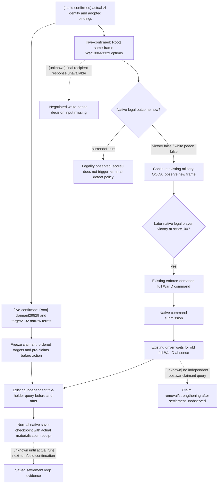

# Claim-CB settlement and saved continuation, actual 1.20.0.4

Recorded at 2026-10-07 12:20 Asia/Shanghai. This source-only work package is
based on `23c3c4bc7fdf261f46174d35db12732808523463`. It follows the
[native research workflow](README.md#原生-ai-研究工作流), the retained
[war end-condition tree](war-end-conditions-1.20.0.3-2026-10-03.md), and the
[actual .4 adopted War migration](ck3-1.20.0.4-battle-war-domain-migration.md).
No policy, native binding, shared consumer or test was changed.

The exact build is CK3 **1.20.0.4**, Steam **25734779**, EXE SHA-256
`98702F88A547CDE2EAF29A85F93B85F68EE4CF8148336A4F7AFAEB75319DD518`.
That identity and the existing finite ABI proofs are reused; this package
does not reread or hash the game EXE. Root owns build, SDK and game execution.

## Actual observation reused from Root

The small [dispatch05 qualification ledger](Z:/ck3_mod_rewrite_process_assets/g2-background-20261007/upstream-build-migration/actual4-entry-checkpoints/dispatch05-first-domain-review/QUALIFIER-LEDGER-FIELDS.json)
records successful actual paused options and claim-disposition queries.
Its source attribution is Root-reported `c070`; scene is Robert **29829**,
WarID **100663329**, date **53288256**, native revision **2** and public
revision **3**. The options query observed surrender's final native validator
true and white peace/victory false. Its material option terms and final
recipient-response object remain unavailable. The terms query observed
`claim_cb_claim_disposition`, claimant **29829**, target titles **[2132]**,
`status=available` and `readiness.ready=true`.

These are **production-live read-only primitives** from Root's original
evidence. The ledger explicitly records **no peace/settlement action**.
This package did not read the large raw responses or generate new live evidence.
The task dispatch's later runtime baseline is R0061/G110-r11/entry12, same
raw date, saved normal days **5997**, natural successions **0**, G2 **5/8**,
enemy leader **31050**, claim CB and player score **0**. Those later fields
are coordinator-supplied status, not a newly sampled frame in this package.

## Sealed source tree and current action limits

The actual .4 [claim binder](../../ck3_autonomous_player/native_bridge/src/ck3_12004_war_cash_claim_terms.cpp)
uses the caller's actual Core/World/Province profiles and .4 getter
`0x2B9ECB0`/claim vtable `0x44F17E8`. It reuses the finite
[claim reader](../../ck3_autonomous_player/native_bridge/src/ck3_12002_claim_terms.cpp),
which resolves active full-generation CWar before reading claimant and ordered
targets. The shared [strict terms contract](../../ck3_autonomous_player/src/xar_autoplayer/bridge/war_contract.py)
retains three narrow dispositions:

| Physical outcome | Declared title direction | Declared target claim direction |
| --- | --- | --- |
| Attacker victory | Transfer via `conquest_claim` | Resolve with `add_claim_on_loss` |
| White peace | Unchanged | Retain and strengthen weak claims |
| Attacker defeat | Unchanged | Remove declared target claims |

The actual .4 migration topic binds these stock clauses through the retained
equal game-data depot manifest. The narrow terms slice does not observe total
gold, prestige, truce, custody, vassal changes or all callback effects. The old
loaded-effect v2 query remains OFF after its retained real access violation;
this work does not reopen that path or require a generic preview to fight.

The existing `strategy.py::_claim_cb_white_peace_candidate` requires the
actual final available `recipient_response.would_accept_now=true` as well as
native legality, primary-attacker role, score below100 and age at least365.
Its terms predicate also binds the same frame, exact CB/index, current player
claimant and ordered present target claims. Current white-peace false and
unavailable final reply therefore do not justify a policy repair. Similarly,
legal surrender at score0 does not satisfy the existing terminal -100 defeat
rule. Neither raw acceptance sign nor auto-accept substitutes for a strategic
decision to concede.

## Existing independent lifecycle and saving paths

[Native driver](../../ck3_autonomous_player/src/xar_autoplayer/bridge/native_driver.py)
lines13446–13479 execute `enforce-demands-W`, then wait for a newly published
snapshot where **that full WarID** is absent. `war_action/war_victory` is an
observed terminal-war result; it does not itself prove every stock callback.
No new driver gate is necessary for the present frame.

[Native runner](../../ck3_autonomous_player/src/xar_autoplayer/native_auto_run.py)
already distinguishes typed `applied` and `submitted_pending` white-peace and
surrender receipts from independently published active-war presence. For a
pending receipt, its existing lines2670–2776 save immediately and
`_verify_pending_war_termination_checkpoint` binds the preceding action and
save history anchors, same date, episode and full WarID. `_materialize_checkpoint`
and `_verify_checkpoint_result` consume actual native save metadata, filesystem
size, SHA-256 and materialized snapshot. These existing paths are reused;
no extra WAL, schema, hash or safety mechanism is introduced.

The independent [title-holder v1 contract](../../ck3_autonomous_player/src/xar_autoplayer/bridge/title_holder_contract.py)
and [actual .4 binder](../../ck3_autonomous_player/native_bridge/src/ck3_12004_title_holder.cpp)
accept TitleID without active WarID. `ck3_query_title_holder_v1` or the existing
`ck3_execute_step(step="query-title-holder-v1-2132", expected_revision=R)`
observes holder, immediate/top liege and player-realm membership. It can be
used after this war disappears. This package proves source availability only;
new actual .4 title-holder qualification belongs to Root.

## Concrete remaining dependency and Root execution

`ReadWarTerminationTerms` returns `war_not_found` immediately when its full
WarID cannot resolve. Therefore it cannot reread claimant29829's title2132 claim after
that war has ended. The available title-holder query resolves ownership and
lieges, not claimant claim presence/strong/implicit flags. This source boundary
is directly reachable after any completed claim war; it is not a hypothetical
safety issue and is not a prerequisite to continuing combat or enforcing a
native legal victory.

If G2 acceptance requires independently proven **claim removal or
strengthening**, the minimal next capability is a paused player-claim query
over frozen claimant **29829** and ordered TitleIDs **[2132]**, independent of
CWar. Its existing exact-build input is `ReadClaimRow` and actual .4 getter,
optional0x20 layout and present-only destructor contract; use actual
Core/Province full-ID resolvers and publish its own postframe. Add a caller
for this leaf and a strict consumer only when that material milestone is the
active work package. No generic settlement reader is required for this leaf.

Root can continue the current route/combat OODA and, when a fresh paused frame
actually permits a chosen exit, perform this finite sequence:

1. Freeze the current full WarID, side/CB, claimant and ordered targets; reuse
   current qualified options/terms and collect only the needed pre-holder rows.
2. Submit the existing native legal chosen action. Keep ACK/pending distinct
   from independently observed old-WarID absence. Existing pending-save
   handling remains applicable to white peace/surrender.
3. Observe exact old-WarID absence and independent title2132 holder/lieges;
   classify the achieved terminal/title result at its actual scope. For a
   claim-state claim, collect the independent query above once implemented.
4. Save the normal postwar checkpoint and retain its real materialization
   receipt. Continue a subsequent planner turn and, when required by the
   milestone, restore that normal save and observe the persisted post-state.

This package's readiness is **research / source dependency ledger**. Existing
Root options and claim-disposition credit stay production-live primitive.
There is no new settlement action, postwar observation, saved continuation,
G2 increment or completed migration acceptance in this package. New builds,
tests, production imports, SDK/game/process operations and EXE hashes: **0**.
