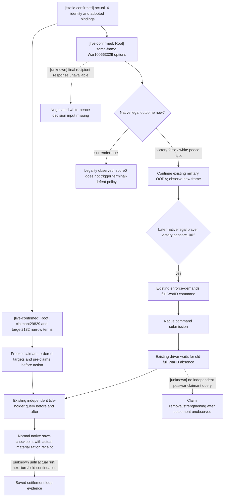

# Claim-CB settlement and saved continuation, actual 1.20.0.4

Recorded at 2026-10-07 12:20 Asia/Shanghai. This source-only work package is
based on `23c3c4bc7fdf261f46174d35db12732808523463`. It follows the
[native research workflow](README.md#原生-ai-研究工作流), the retained
[war end-condition tree](war-end-conditions-1.20.0.3-2026-10-03.md), and the
[actual .4 adopted War migration](ck3-1.20.0.4-battle-war-domain-migration.md).
No policy, native binding, shared consumer or test was changed.

The exact build is CK3 **1.20.0.4**, Steam **25734779**, EXE SHA-256
`98702F88A547CDE2EAF29A85F93B85F68EE4CF8148336A4F7AFAEB75319DD518`.
That identity and the existing finite ABI proofs are reused; this package
does not reread or hash the game EXE. Root owns build, SDK and game execution.

## Actual observation reused from Root

The small [dispatch05 qualification ledger](Z:/ck3_mod_rewrite_process_assets/g2-background-20261007/upstream-build-migration/actual4-entry-checkpoints/dispatch05-first-domain-review/QUALIFIER-LEDGER-FIELDS.json)
records successful actual paused options and claim-disposition queries.
Its source attribution is Root-reported `c070`; scene is Robert **29829**,
WarID **100663329**, date **53288256**, native revision **2** and public
revision **3**. The options query observed surrender's final native validator
true and white peace/victory false. Its material option terms and final
recipient-response object remain unavailable. The terms query observed
`claim_cb_claim_disposition`, claimant **29829**, target titles **[2132]**,
`status=available` and `readiness.ready=true`.

These are **production-live read-only primitives** from Root's original
evidence. The ledger explicitly records **no peace/settlement action**.
This package did not read the large raw responses or generate new live evidence.
The task dispatch's later runtime baseline is R0061/G110-r11/entry12, same
raw date, saved normal days **5997**, natural successions **0**, G2 **5/8**,
enemy leader **31050**, claim CB and player score **0**. Those later fields
are coordinator-supplied status, not a newly sampled frame in this package.

## Sealed source tree and current action limits

The actual .4 [claim binder](../../ck3_autonomous_player/native_bridge/src/ck3_12004_war_cash_claim_terms.cpp)
uses the caller's actual Core/World/Province profiles and .4 getter
`0x2B9ECB0`/claim vtable `0x44F17E8`. It reuses the finite
[claim reader](../../ck3_autonomous_player/native_bridge/src/ck3_12002_claim_terms.cpp),
which resolves active full-generation CWar before reading claimant and ordered
targets. The shared [strict terms contract](../../ck3_autonomous_player/src/xar_autoplayer/bridge/war_contract.py)
retains three narrow dispositions:

| Physical outcome | Declared title direction | Declared target claim direction |
| --- | --- | --- |
| Attacker victory | Transfer via `conquest_claim` | Resolve with `add_claim_on_loss` |
| White peace | Unchanged | Retain and strengthen weak claims |
| Attacker defeat | Unchanged | Remove declared target claims |

The actual .4 migration topic binds these stock clauses through the retained
equal game-data depot manifest. The narrow terms slice does not observe total
gold, prestige, truce, custody, vassal changes or all callback effects. The old
loaded-effect v2 query remains OFF after its retained real access violation;
this work does not reopen that path or require a generic preview to fight.

The existing `strategy.py::_claim_cb_white_peace_candidate` requires the
actual final available `recipient_response.would_accept_now=true` as well as
native legality, primary-attacker role, score below100 and age at least365.
Its terms predicate also binds the same frame, exact CB/index, current player
claimant and ordered present target claims. Current white-peace false and
unavailable final reply therefore do not justify a policy repair. Similarly,
legal surrender at score0 does not satisfy the existing terminal -100 defeat
rule. Neither raw acceptance sign nor auto-accept substitutes for a strategic
decision to concede.

## Existing independent lifecycle and saving paths

[Native driver](../../ck3_autonomous_player/src/xar_autoplayer/bridge/native_driver.py)
lines13446–13479 execute `enforce-demands-W`, then wait for a newly published
snapshot where **that full WarID** is absent. `war_action/war_victory` is an
observed terminal-war result; it does not itself prove every stock callback.
No new driver gate is necessary for the present frame.

[Native runner](../../ck3_autonomous_player/src/xar_autoplayer/native_auto_run.py)
already distinguishes typed `applied` and `submitted_pending` white-peace and
surrender receipts from independently published active-war presence. For a
pending receipt, its existing lines2670–2776 save immediately and
`_verify_pending_war_termination_checkpoint` binds the preceding action and
save history anchors, same date, episode and full WarID. `_materialize_checkpoint`
and `_verify_checkpoint_result` consume actual native save metadata, filesystem
size, SHA-256 and materialized snapshot. These existing paths are reused;
no extra WAL, schema, hash or safety mechanism is introduced.

The independent [title-holder v1 contract](../../ck3_autonomous_player/src/xar_autoplayer/bridge/title_holder_contract.py)
and [actual .4 binder](../../ck3_autonomous_player/native_bridge/src/ck3_12004_title_holder.cpp)
accept TitleID without active WarID. `ck3_query_title_holder_v1` or the existing
`ck3_execute_step(step="query-title-holder-v1-2132", expected_revision=R)`
observes holder, immediate/top liege and player-realm membership. It can be
used after this war disappears. This package proves source availability only;
new actual .4 title-holder qualification belongs to Root.

## Concrete remaining dependency and Root execution

`ReadWarTerminationTerms` returns `war_not_found` immediately when its full
WarID cannot resolve. Therefore it cannot reread claimant29829's title2132 claim after
that war has ended. The available title-holder query resolves ownership and
lieges, not claimant claim presence/strong/implicit flags. This source boundary
is directly reachable after any completed claim war; it is not a hypothetical
safety issue and is not a prerequisite to continuing combat or enforcing a
native legal victory.

If G2 acceptance requires independently proven **claim removal or
strengthening**, the minimal next capability is a paused player-claim query
over frozen claimant **29829** and ordered TitleIDs **[2132]**, independent of
CWar. Its existing exact-build input is `ReadClaimRow` and actual .4 getter,
optional0x20 layout and present-only destructor contract; use actual
Core/Province full-ID resolvers and publish its own postframe. Add a caller
for this leaf and a strict consumer only when that material milestone is the
active work package. No generic settlement reader is required for this leaf.

Root can continue the current route/combat OODA and, when a fresh paused frame
actually permits a chosen exit, perform this finite sequence:

1. Freeze the current full WarID, side/CB, claimant and ordered targets; reuse
   current qualified options/terms and collect only the needed pre-holder rows.
2. Submit the existing native legal chosen action. Keep ACK/pending distinct
   from independently observed old-WarID absence. Existing pending-save
   handling remains applicable to white peace/surrender.
3. Observe exact old-WarID absence and independent title2132 holder/lieges;
   classify the achieved terminal/title result at its actual scope. For a
   claim-state claim, collect the independent query above once implemented.
4. Save the normal postwar checkpoint and retain its real materialization
   receipt. Continue a subsequent planner turn and, when required by the
   milestone, restore that normal save and observe the persisted post-state.

This package's readiness is **research / source dependency ledger**. Existing
Root options and claim-disposition credit stay production-live primitive.
There is no new settlement action, postwar observation, saved continuation,
G2 increment or completed migration acceptance in this package. New builds,
tests, production imports, SDK/game/process operations and EXE hashes: **0**.

## 2026-10-08: independent current-player claim rows source candidate

An external candidate based on `33cd47bf6eb3baaa146225b4f66be64e4610885c`
implements `ck3_query_player_claims_v1(title_ids=[2132], expected_revision=R)`
and `query-player-claims-v1-2132` for exact CK3 1.20.0.4/build25734779.
The request takes 1..4096 unique ordered full non-negative int32 TitleIDs;
ID0 is legal. It takes no WarID or claimant argument. The actor is the current
living played character in the paused ready map; after succession this query
observes the new player, never a former claimant. A settlement consumer must
therefore bind the observed actor to its retained pre-action actor.

The candidate extracts the existing finite optional claim decoder into
`character_claim_row_v1.hpp`. Getter `0x2B9ECB0`, vtable `0x44F17E8`, optional
0x20 layout, full TitleID check and present-only stack destruction with
delete_flags0 retain the existing actual4 source qualification. New bindings
contain only Core/Province/getter/vtable; no CWar or World resolver is used.
The new owning-thread reader resolves full player/title IDs, reads requested
rows twice, and requires equal row contents, unchanged pointers and matching
before/after actual4 Core frames. Existing owner mailbox and full snapshot
admission/completion remain the execution boundary.

`xar.ck3.player-claims.v1` publishes only actual claim presence/state and
strong/implicit flags in request order. Legal absent optional rows carry
state=absent and null flags; unavailable reads carry null claims plus a
reason. Native serializer uses the exact4 identity directly. Python driver
and service validate exact build, current actor, ordered full IDs, nested and
outer date/native revision, read_only and envelope fields; driver rechecks
its paused owner frame. No CB disposition, truce, material settlement preview
or counter-policy change is included.

Readiness is **source candidate, native unbuilt, not live qualified**.
Eight new contract/AST-extracted production consumer tests passed; after a
source review fixed new outer-envelope checks, only two changed-method tests
(12 rejection cells and two successful calls) were run. These use in-memory
post-termination snapshots with no active CWar and do not import or connect
the runtime bridge. No native compilation, old-suite replay, EXE read,
game/pipe/SDK/desktop action or G2 milestone was performed.

Root may later build the new TUs and affected adapter/owner/bridge consumers,
run a focused native optional/full-ID/two-frame fixture, and qualify one actual
paused pre/post-termination player-claim observation on ordinary Robert29829.
Those steps uniquely validate this newly introduced route; the prior Source6
DLLs cannot expose it. Existing frozen Source6 and live product acceptance stay
unchanged. Actual removal/strengthening, save persistence and subsequent
planner continuation remain unproven until their own observed results exist.

### Candidate relocated onto current parallel source, 2026-10-08

The same claims source candidate is now rebased externally onto fixed
`55bf586496b30f0f5794684172304cd959d699e3`; this is source hunk relocation,
not a Git merge or a change to master/frozen Source6. Current supply service
and contract additions and phase-event-role bindings are preserved. The only
native relocation appends the claims binding after the existing phase-role
field. Reversing just claims additions in a proof copy restores all 23 touched
files to current-base bytes; 6425 unrelated base files are unchanged.

Independent Python review found and closed two new-interface issues: revision
now uses `Annotated[int, Field(strict=True, ge=0)]` at the registered MCP
boundary, and the dynamic claims capability/template/prefix is excluded from
automatic planner action literals. Actual `MCPServer.call_tool` rejected
string3/float3/boolTrue with zero service calls; integer3 preserved ordered
full IDs [2132,0,2147483647]. The actual action enumerator no longer emits
`query-player-claims-v1-IDS` or an unrequested concrete query token. Those
checks were local Python definition/registration calls without a native
driver instance, endpoint, pipe or game. Prior 8+2 checks are reused through
identical new claim contract/consumer-method bytes and AST; no old suite was
replayed. This candidate supports native-headless; configured hybrid fallback
has no new claims route and remains unsupported for it.

Readiness remains source-only, native unbuilt and not live qualified. No new
native temporary/owner execution, post-termination claim effect, saved
continuation or G2 milestone has been observed.

Root subsequently reviewed and applied the exact current55 claims hunks on
`b0b1e6a4178b024e96559e01e5c87f6e6f84af93` on 2026-10-08. The intervening
commit changed only RMTM production and progress documentation. Patch check,
application and whitespace check returned zero; the active Source6 runtime
remains frozen. [The source packet](C:/workspace/ck3-upgrade-20261007/g2-posttermination-player-claims-source-candidate-02/G2-PLAYER-CLAIMS-RELOCATED-SOURCE-FINAL-02.json)
and [independent Python review](C:/workspace/ck3-upgrade-20261007/g2-player-claims-python-review-01/INDEPENDENT-PYTHON-SOURCE-REVIEW-FINAL-02.md)
retain the focused source verification. This adopts source only; compilation,
native fixture and actual paused observations are still pending.

## 2026-10-08：current-player claims 独立 native 叶级夹具实际通过

新 `xar_ck3_12004_player_claims_v1_test` 已在本机外置独立 source/build 以 x64 MSVC 实际配置、编译、链接并运行一次：**110 checks、21 scenarios、17 synthetic production-serializer wires，exit0**。目标只有新夹具、生产 `ck3_12004_player_claims_v1.cpp`、生产 `player_claims_v1_serializer.cpp`、实际4 core ABI profile、保留的 full-ID province/title resolver 五个 TU；实际 argv 保留 `/W4 /WX /Gy /UNDEBUG` 与 CMake `-std:c++20`。已有项目构建 hook 对新 EXE 精确路径取得管理员 WMI 新鲜实际 `verified` 读回，未把旧目录排除或 ACK 当作成功。

实际首个 link 证明 `/Gy` 加 `/OPT:REF` 没有清除省份 TU 内另外两项 army helper 引用，返回 LNK2019；该 source01/build01/stdio/input index 原样保全。仅在新夹具补 `BindArmyImage` 与 `ResolveInternalArmy` 两个调用即报错 `abort` 的链接桩，保持五 TU，任何 claims 路径触及它们即失败，不返回伪造军队数据。新的 source02/build02 独立保留；4095 项逐文件比较确认只有这份夹具改变，4094 项和生产算法/header/CMake 均原字节。最终 link0 和一次21场景运行0证明所测 claims 路径未调用链接桩。执行前 Python 命令门禁误仅接受 `/std:c++20`，对实际 `-std:c++20` 在 EXE 运行前拒绝；原脚本与纠正回执保全，native 总运行仍为一次。

实证只覆盖 caller-owned synthetic components/getter 下的生产当前玩家读取、完整 ID 解析、ordered parser、optional 生命周期、两次 rows/core-frame guard 与 serializer。未执行新 actual getter/destructor 机器码，未资格 owning-thread mailbox/semantic worker 的请求与完成路由、runtime DLL/managed bridge、实机战后 claims、Save/Load continuation 或 G2 milestone；没有重跑旧 Python8+2、全矩阵或其他 target，没有 CK3/Steam/SDK/pipe/screen/注入动作。

最终证据：`C:/workspace/ck3-upgrade-20261007/g2-player-claims-focused-native-validation-01/G2-PLAYER-CLAIMS-FOCUSED-NATIVE-ACTUAL-FINAL-03.json`（16236 B，SHA-256 `e90daefd7e903fc792554a8c0488a1855bc1fa888a991ec457d8bdd0a886fea9`）；唯一补丁 `FOCUSED-FIXTURE-LINK-CLOSURE-ONLY-03.diff`（1310 B，SHA-256 `48c0747bf12a362096b81ca710e4b32592b0758e5afafd631ffca3020efd9071`）。实际 run receipt SHA-256 `a0d214e7feba9612cc0a13cad7878a02f9adad15f7b55076981967142a7ad1d5`；新 EXE 121344 B，SHA-256 `0a1b7280f98ae89136b290a719d478701b8cf89c0e5d80cd7988262008efbbf3`；Defender actual receipt SHA-256 `01c4c9cd0c0689180c4df65b9fa476cdf94e9078ac068ba722ba2317d7c3fafa`。

## 2026-10-08 — current1.20.0.4 full claims bridge DLL incremental build

The new player-claims source API now has an actual full x64 bridge DLL built from frozen master `5d1b736f9279fd9f9e10d6623e2f1e3d1b01adb3`. This also preserves concurrent mainline source changes. The qualified Source6 parent graph contains551 objects; the actual new CMake graph contains566 (344 runtime archive +222 bridge direct). Exact source/VALID project-header dependency and FLAGS/DEFINES/normalized INCLUDES checks reused204 SHA-qualified parent objects, naturally recompiled347 existing objects affected by changed interfaces/headers and compiled15 new production TUs. There are362 unique actual C++ compile lines, all exit0 at12 jobs. The full original CMake archive/link object list, flags and libraries then linked the standalone DLL with exit0; no five-TU fixture was substituted for the runtime.

The earlier focused03 five source TUs were unchanged, but actual include closure had three changed headers (`game_contract.hpp`, `ck3_12002_adapter.hpp`, `ck3_12002_army.hpp`). A necessary five-TU current-header build and one run passed110 checks /21 scenarios /17 synthetic wires, with exact new EXE Defender administrator fresh WMI `verified` readback. No old matrices or suites were replayed.

External final packet: `C:/workspace/ck3-upgrade-20261007/g2-player-claims-current4-native-incremental-01/G2-PLAYER-CLAIMS-CURRENT4-INCREMENTAL-DLL-BUILD-FINAL-13.json` (393830 B, SHA `71a9a543d735b3b7f0bda9b071340b68bdf5c56cb862532ba40cd0d6eb9e3355`). DLL: `C:/workspace/ck3-upgrade-20261007/g2-player-claims-current4-native-incremental-01/build-01/xar_ck3_bridge.dll` (8846848 B, SHA `0d27130de9fdd0a5c74d6bb58929424749f9462bd3fe60c6a397ee761fb334cc`). Source index SHA `19da4451594636c9c23382b386c69b4b8de7820944975834807cd11ba2f0dc16`. Actual build receipt SHA `026faf85ccc6a2ad4d0e134effaf553039a9e649814add5354179df8d75b7e16`.

These are source/build and synthetic fixture results only. Actual owning-thread route dispatch, real claim getter/optional destructor, live posttermination readback and save continuation remain pending. No G2 milestone credit, CK3/native pipe/SDK/desktop/lease/injection or live DLL replacement. Original Source6 builds/indices/runtime evidence and all failed attempts remain intact.
Root当前补充：native source index03仅含4126项原生构建输入，frozen14是DLL不可变副本；这不授予Python runtime冻结、owning-thread实机路由或G2里程碑信用。
