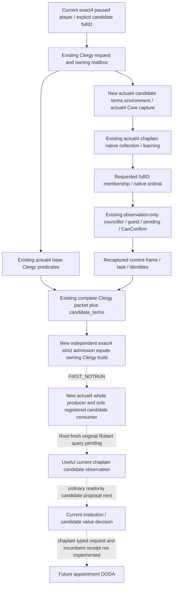

# Actual4 clergy candidate terms: current-source closure and M6 value

2026-10-08 / ISO2026-W41: **SOURCE_READY / FIRST_NOTRUN**. Exact target is
CK3 **1.20.0.4 / Steam25734779**, executable SHA
`98702F88A547CDE2EAF29A85F93B85F68EE4CF8148336A4F7AFAEB75319DD518`.
The independent source package starts from current adopted source
`6ee7dea1b4d2fa4ecb05223f12c66b7afe72ac2d`, copied to
`Z:/gbs-faith-m6-clergy`. Root's canonical33 source is
`92064850f2e3d57fa1bf27093ab8b7a217e4c24c`, with mixed compiled production
parent `d2e27ad63185f6e7ede3e50b48f4deb9ece0daf8`; its qualification is reused.
The running game remains Native32. This source is separate from Native34 Stop
and does not reopen the accepted existing-tool migration scope.

## Concrete missing seam

The [adopted actual4 base Clergy/county migration](religion-clergy-appointment-12004-migration.md)
explicitly excluded the previously unadopted candidate terms. In current source,
the `.4` handler initializes base appointment and county environments, while
`candidate_terms_environment` is only initialized for `.3`. Its owning capture
also reads the legacy core. The Python candidate-terms leaf independently
accepts only the exact `.3` identity although its outer clergy transport admits
`.4`. Thus the current build cannot return and consume the candidate-specific
native membership/learning/final-term sibling. This is a source interface gap;
no failed live attempt is invented.

Existing `.4` Council candidate and observation-only gates already supply all
needed native providers. No new executable capture, scan, hash, mapper run or
unmapped native leaf is required. The package closes the software assembly and
strict admission rather than reading the same qualified functions again.

## Native inputs before policy

The [realm-priest tree](religion-realm-priest-council-native-ai-12003.md) and
[independent Clergy tree](religion-clergy-council-native-ai-12003.md) retain the
stock appointment authority and role/task ledger. Same **Rite**, clergy gender,
character/position validity, fixed or ruler appointment, once/time conditions,
vacancy, CanReassign and CanFire are distinct native inputs. The current build's
compiled predicate providers read the actual loaded rules; this source does
not rewrite historical stock triggers in Python or claim a new stock file hash.

| Reused actual4 provider | Value supplied to this candidate query |
| --- | --- |
| Candidate producer `2C47EA0`; position lookup `2684EE0` | Current owner/task/position-specific native collection in GUI mode, full-generation candidate membership and native order. |
| Initializer `98B8C0`, release `855830`, vtable `452D0B8`, fallback `54DEDE0` | Existing allocator-owned 24-byte vector lifecycle; copied public rows outlive no native temporary allocation. |
| Chaplain composition profile `learning / Character+E8` | Actual candidate learning, independent from stewardship/diplomacy/intrigue. Learning is not a complete native AI utility or task yield. |
| Gates `2917540 /1A8F760 /115CA80 /2A30790 /11604A0` | Actual councillor/guest/pending/confirmation terms through the existing **observation-only** chaplain profile. This does not extend the assignment evaluator. |
| Existing actual4 base Clergy predicates `31BCEB0 /31BCF70 /31B4960 /2C477C0` | Position validity, candidate validity, task CanReassign and current-incumbent CanFire remain separate base-query outputs. |
| Existing actual4 Core and Council full-ID/frame readers | Current owner, active task/incumbent, paused owning epoch, revisions/date and candidate identity. Old image factories are not used. |

Cached Council proof and exact typed operands are retained in the external
`m6-clergy-next/native-frontier` ledger. Previously qualified base, county,
Council, Holy32 and accepted migration results are not rerun. Shared proof
physical costs are not counted again as new work.

## Minimal implementation

`ck3_12004_clergy_candidate_terms.hpp/.cpp` defines an independent exact4
Environment and Request, binding the current Council candidates and gates.
The actual4 reader reuses the held candidate-membership algorithm and software
Observation/Failure DTO, but calls only the actual4 read/capture/resolve/gates
providers. The old exact3 factory and reader remain independent. The existing
software codec is rendered by the production actual4 renderer; no consumer
repairs the resulting native packet.

The existing mailbox receives a separate optional actual4 environment, an
actual4 Core/candidate capture callback, actual4 execution/serialization and
handler initialization. The request and public API are unchanged. Positive
public revision enables the optional sibling as before. The existing Python
leaf admits `.3` and `.4` independently and still requires the sibling's exact
identity to equal its normalized owning Clergy observation. Membership/order,
legal zero, available false, unavailable null, vacancy confirmation null and
`action_eligibility_complete=false` preserve their existing meanings.

## Ordinary value, action and receipt boundaries

The existing private chaplain **composition** query can discover current
candidates and learning. Its final-gates request has a different step and does
not acquire chaplain admission automatically. The normal Council selector and
Python assignment request/applied receipt remain Steward/Chancellor only.
Native observation coverage does not add a chaplain action or result contract.

The next narrow normal-policy seam is after existing S/C work in
`GameplayBridgeService._plan_private_council_normal_v1`, when the plan still
selects `life-advance`: attach a separate readonly current chaplain composition
and explicit candidate terms proposal, retaining current-war/action priority.
Compare observed candidate learning with the current incumbent only as a
visible input, retaining the actual independent CanReassign/CanFire/CanConfirm
results; do not infer appointment from a learning maximum or archived56513.
This package closes the missing current-build observation, not that policy or
the later typed chaplain request/incumbent receipt.

The already migrated `.4` county sibling has actual evaluated monthly rates,
target Rite/Faith/value inputs, final task dispatch and typed task submit with
independent assignment result. Root can reuse it for a current useful task
choice. Task assignment is not a replaced incumbent or completed county
conversion. ReligiousRelations current piety/opinion contribution and an
alternative candidate's evaluated task yield remain specific future inputs;
historical stock formulas or total player income do not supply them. Holy-order
institution/hire/patronage observations retain their own route and do not grant
chaplain authority.

## Root next and honest qualification

The package adds one production TU and changes the owning mailbox/header plus
the strict Python leaf. Root must select actual dependent objects for that
header, adopt this package in a separate increment after Native34 Stop, then
run only its new whole candidate producer and sole registered consumption.
The new producer and consumer are authored but **NOTRUN**. Synthetic frame and
callbacks are declared; complete packets come from the production owning query
and serializer. The consumer uses the existing registered
`ck3_query_player_clergy_appointment_v1`, actual driver/transport/protocol state
and current strict parent/child readers. The public query still forwards
directly to NativeDriver, without a new Service convenience method.

Root's later paused observation uses original Robert29829's current chaplain
collection and one genuine current candidate fullID, keeping CK3 minimized.
Retain membership, learning and independent terms; then continue the ordinary
plan. No appointment, task change or new war is submitted by this package.
Source readiness adds **0game days /0M6 material /0G2 credit**. The unique FIRST
recipe, aggregate source pin and Oct8/W41 merge fields are external; workers
do not edit Root7 shared reports or operate Game/SDK/build/tests/EXE.
