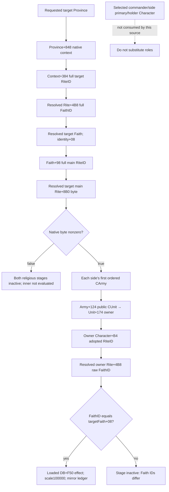

# 战斗 constructor 的 Faith / Rite 输入关系（1.20.0.3）

本页于 **2026-10-04** 交付原生 input ledger 与最小可施工入口。状态为 **research / static-confirmed native relations**；同帧 v2 optional provider、focused 验证和实际采样由对应 owner 交付，本页不提前授予其 readiness。本包新增 actual、游戏动作、原生执行、SDK、窗口、build/test、Git 均为 **0**。

exact build 是 **1.20.0.3 / Steam 25652598**，EXE SHA `94B55397ABB687A3DCD436805A5D885E6BE90FA6C693FEB44A9E3BBEEADE02A6`。复用已有身份、宗教 getters 的 .3 ABI 与保存证据，没有重哈希或重扫 EXE。只读源码 `Z:/g49`，冻结 HEAD `9772958a55e5182ef78562c74e43d72ba3f2302e`。

外置证据包为 `Z:/ck3_mod_rewrite_process_assets/g2-resume-20261003/combat-context-religion-v47/faith-rite-context/`：`SOURCE-FREEZE.json` 的 14 个稳定副本，后补 exact outer leaf 的 `SOURCE-SUPPLEMENT.json`，`INPUT-LEDGER.json`、`EXISTING-QUERY-RECIPE.json` 和 `REPORT-FIELDS.json`。constructor actual body / predicate 由同轮 `constructor/` lane 冻结；loaded source key/points 由 `modifier-dispatch/` lane维护。历史 .2 文档保留其当时状态，战争与宗教已按 2026-10-03/02 最新授权全面开放。

## 实际消费对象

两项 `unreformed_faith_0/1` constructor stage 的对象既不是 selected commander，也不是“省份 holder 的个人宗教”。exact .3 constructor `0x2586ED0..0x25870A1` 从目标省份上下文解析 Faith，读取该 **Faith 的 main Rite unreformed byte**；仅当外层成立时，inner `0x2587930..0x2587A90` 比较各侧 **第一支军队 owner 的 Rite 中的 FaithID**。

| 角色/对象 | 本来源是否消费 | exact 路径与边界 |
|---|---|---|
| 第一支军队的 owner Character | 是 | side 有序 Army data `+0x10/count+0x1C` 第一项 → CArmy `+0x124` public CUnitID → CUnit `+0x174` owner → Character `+0xB4` RiteID |
| owner adopted Rite | 是 | full-generation resolve Rite；比较其 `uint32 +0x4B8` raw FaithID |
| owner Faith 对象 / main Rite | 否 | inner 不解析 owner Faith，也不读取 owner main Rite；不新增这些验证条件 |
| side primary participant | 否 | 现有 side `+0x70` 发布值可作角色来源对照，不假定它恒等于本 stage 第一 Army owner |
| selected commander | 否 | side `+0x74` 由 coalition selection 决定；可与 owner 不同，不能替换此 stage 输入 |
| Province holder Character | 否 | 本宗教分支没有 holder Character lookup；不以 holder.GetFaith 替换下面的原生路径 |
| target adopted Rite / Faith | 是 | Combat `+0x6B8` Province → pointer `Province+0x848` → 其 `uint32 +0x384` RiteID → resolved Rite `+0x4B8` FaithID → resolved Faith `+0x08` full identity |
| target Faith main Rite | 是 | Faith `+0x98` full RiteID → resolved main Rite → byte `+0x8B0` 外层 predicate |

`Province+0x848` 所指 context 的完整 C++ 类名，本包未独立证明；字段消费链已有 exact 指令，不需要凭类名扩张读取。它不能改名为一个已经解析的 holder Character。Rite、Faith 与 Faith main Rite 必须保留各自完整身份；同 Faith 不等于同 Rite，更不等于 owner/main Rite 相等。

## Exact outer / inner predicate

`0x2BD8960` 的完整 **86B leaf** 没有 call 或 write：读取 target Faith `+0x98`，从 Rite storage 解析其 main Rite，返回 main Rite `+0x8B0` byte；外层 constructor `test al,al`，因此以 **非零**为 true。不能直接读 target adopted Rite 的 `+0x8B0`，也不能用 owner adopted/main Rite 的 flag 代替。

`0x2587930` 的完整 **352B** inner 从每侧第一 CArmy 解析 unit、owner、owner Rite，最终执行：

```text
uint32(ownerRite + 0x4B8) == uint32(targetFaith + 0x08)
```

该比较没有调用 `Character.GetFaith` 或 `Rite.GetFaith` 来解析 owner Faith 对象。相等时从 loaded rule database `+0xF50` 取 effect，并以 scale raw **100000** 调 mutating append `0x2586C90`。只读查询镜像该来源顺序、选择及现有 ledger 数学，不调用完整 constructor、inner wrapper 或 append。loaded effect 的 raw points `+0x40` 为权威，stock 文本 points 只能作映射/研究参考。



## 现成 getter 与 .3 绑定入口

已存在 [Faith 身份专题](religion-native-ai-faith-identity-12003.md) 和 [context reader](../../ck3_autonomous_player/native_bridge/src/ck3_12002_religion_context.cpp)；header 为 [religion_context.hpp](../../ck3_autonomous_player/native_bridge/include/xar_bridge/ck3_12002_religion_context.hpp)。实际 C++ pointer type是：

```cpp
using ObjectGetter = void* (*)(void*);
```

| 入口 | exact RVA | 本阶段用途 |
|---|---|---|
| Character.GetRite | `0x28D2F90` | 可复用 owner `+B4` 的原生 Rite resolver |
| Rite.GetFaith | `0x24FC560` | 可复用 target Rite→Faith；owner inner 不需要此 getter |
| Faith.GetMainRite | `0x2444360` | 可复用 target outer 的 main Rite resolver |
| Character.GetFaith | `0x289E750` | 现有能力盘点；本 stage 不调用它来增加 owner Faith 对象 gate |
| Target Faith unreformed | `0x2BD8960` | 新闭合纯 byte/bool leaf，或镜像 main Rite identity 与 `+8B0` |

现行 `.3` religion mailbox 已使用：

```cpp
BindReligionContextImage12002(
    module_base, ReviewedCrozierAbiSha256(adapter.descriptor()));
```

`12002` 是真实复用源名；`.3` adapter 用 exact descriptor 检验后，映射到已经审阅的 ABI。直接将 `.3` SHA 传给原 `.2` binder 会被原 gate 拒绝，不能把它误报为 `.3` 宗教能力不存在。无需调用 `ReadPlayedReligionContext12002`：它固定 current played actor，还读 fervor、Fulfillment 等本 stage 不消费的资源；新 provider 只复用所需 getter 字段或已闭合的 inline resolver。

组织计数、成员列表、doctrines/tenets、religion ID/key 与资源 getter 都已有独立专题，本来源没有消费它们，故不拉入战斗 schema。

## 身份、合法 absence 与最小发布值

Rite storage pointer slot 是 module `+0x5D1E2F8`，Faith storage pointer slot为 `+0x5D1E300`。两者用 storage `+0x2C` count、`+0x20` slots，按 masked index 选 **16B** slot 的 `+8` pointer，再检查对象 `+0x08 == full uint32 ref`。mask 只用于索引，wire 不截断 generation。

`0xFFFFFFFF` 是合法 absent ref；**0 仍可能是合法 ref**。原生代码会选用 native NullRite pointer slot `+0x5C67670`、NullFaith pointer slot `+0x5D1E2E0`；不能将其悄悄换成 nullptr 并编造 false predicate。内部保留 native raw/fallback 语义，wire 发布 nullable uint32 identities与明确 `absent / not_evaluated / unavailable` 状态。非 absent ref 的真实读取/代际失败不能冒充“不同 Faith”。

当 outer target flag 为 false，inner owner comparison 原本不执行；owner输入可以记为 `not_evaluated`，而两条 stage 的 inactive 结果已经确定。这不是决策所需字段长期缺失，也不要求为了这一帧 inactive 来源多读 owner Faith 对象。

最小 native fragment包括 source stage/side、first public CUnitID/native CArmyID、owner Character/Rite/raw FaithID、target Province/Rite/Faith/main RiteID、main Rite byte/native target bool、Faith equality、selected/scale与 loaded source key/points。全部来源于现有 **同一 v2 paused owning frame**，不返回 native pointers。

## 现有 query 的真实范围与施工入口

当前 `ck3_query_player_religion_context_v1` 无任意 actor 参数，只能读取实际 current played Character。现成 hostility query 可读取显式 target Rite，但其 owner 仍是 current played actor，而且独立查询有独立 pump epoch；组合这些 packet 不能冒充两个战斗 owner 与 target 的同帧输入。已保存的 .3 primitives 原样复用，本包不请求重复采样。

D lane 的最小施工入口是现有 `ck3_query_combat_simulation_inputs` 的 optional constructor religion sibling：复用 route-owner fresh target/entry 与 ordered A/D public CUnitIDs，现有 environment 已解析的 first Army/unit/owner与 requested Province；按上面的 outer→conditional inner读取和 ledger顺序补上两个来源。不新增通用任意人物/世界宗教枚举，不另造 game action或玩家总 gate。

当前只是宗教 constructor 输入闭合；**full encounter、whole battle resume 和新 live 均不据此变 true**。它解锁实际 fragment 后的 readiness/新 paused值由 D/Root receipt更新。本页继续保留 .3 完整战争授权，未将 absence、旧文件 private cap名称或尚无实际 player battle当作停止玩法的理由。

本包只有文件读取/知识交付，**未运行检查、测试或重新验证历史 ABI/fixture**。后续 D只对新增 provider/consumer路径做其已协调的 focused验收，Root在真实普通 Robert战役 frame读取最终同一v2查询。本页没有新增实测信用，日报与周报字段于当日真实时间同步交协调者。
