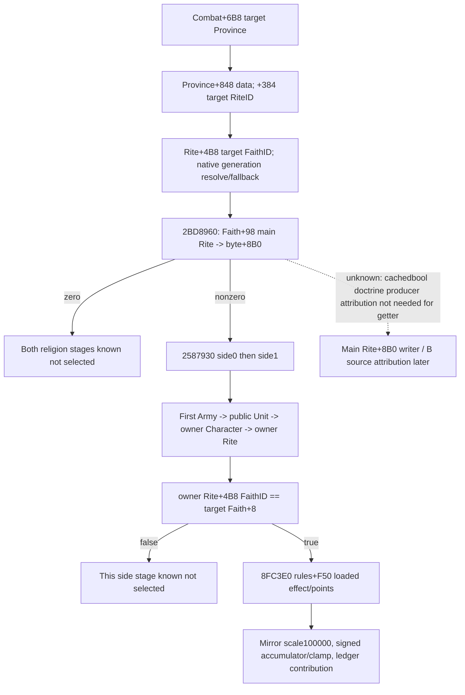

# Current .3 combat constructor religion source chain

Build: CK3 1.20.0.3 / Steam25652598, EXE SHA94B55397ABB687A3DCD436805A5D885E6BE90FA6C693FEB44A9E3BBEEADE02A6. Source read-only Z:/g49 HEAD9772958a55e5182ef78562c74e43d72ba3f2302e. Reuse existing exact installation identity, no full EXE rehash, native calls, SDK/window or tests. actual=0.

The religion stage is the final stage in `0x2586ED0..0x25870A1`, after debt `0x2587570`. It resolves target Province `Combat+0x6B8`, then Province data pointer `+0x848` and data `+0x384` full RiteID through storage `0x5D1E2F8`. Target Rite `+0x4B8` full FaithID resolves through storage `0x5D1E300`. These are .3 objects, not old holding/Faith offsets. The native generation check uses mask0xFFFFFF, storage bound/count, nonnull slot and fullID+8 equality; invalid/storagemissing paths use canonical fallback Rite pointer at `0x5C67670` or Faith pointer at `0x5D1E2E0`. Target Province/data pointers themselves are dereferenced by this constructor; it does not define a no-data zero-value path.

Faith predicate `bool 0x2BD8960(Faith* RCX)` is a complete 86-byte leaf through `0x2BD89B6`, no .pdata entry, no calls/writes. It generation-resolves Faith `+0x98` main Rite through the same Rite storage (or canonical fallback) and returns the byte at main Rite `+0x8B0`. This is the final cached native condition consumed by the constructor. It is not the target actor Rite flag, and the old `0x304D` parameter getter is not part of this current call chain. This lane does not reconstruct or name its doctrine producer.

Only when the returned byte is nonzero does constructor create stack context `{Combat* +0, target Faith* +8}` and invoke `void 0x2587930(ctx* RCX,int32 side EDX)` for side0 then side1, at callsites `0x2587072/0x2587081`.

Inner helper `0x2587930..0x2587A90` takes the first internal ArmyID of the requested side vector at `Combat+0x30+side*0x348` (count +0x0C), uses native empty-array -1 fallback, then generation-resolves:

`CArmy +0x124 public CUnitID -> CUnit +0x174 owner CharacterID -> Character +0xB4 RiteID -> owner Rite`.

Its actual comparison is **owner Rite `+0x4B8` full FaithID == target Faith `+0x08` full ID** (`0x2587A59..0x2587A66`). It does not compare Rite IDs/pointers, resolve owner Faith, compare main Rite, inspect selected commander or call relation predicates. This allows distinct Rites belonging to the same Faith to match.

When matched, the helper reads loaded rules via `0x8FC3E0`, gets effect pointer `Rules+0xF50`, and calls mutating `0x2586C90(Combat* RCX,effect* RDX,int64 scale R8=100000,int32 side R9)` at `0x2587A80`. Installed stock stable key `unreformed_faith_province` is supplied by B; **actual effect points remain the loaded int32 effect+0x40**. Inner helper does not suppress zero points: scale is nonzero, so a selected zero-point effect still produces a zero-contribution ledger row. The owning query must mirror this predicate and existing Append; it must not call the mutating helper/wrapper.

Append `0x2586C90..0x2586ECD`: scale0 no-op; otherwise compute Q100000 signed product, add for side0/subtract for side1, clamp each stage to [-10000000,10000000], and append 16-byte `{effect pointer, contribution_raw before side sign}` to that side's ledger. This agrees with the existing .2 nonreligious Append contract. Do not store scale as the second ledger field or omit a selected zero contribution.

Production entrance is existing `BuildNonReligiousAdvantagePlan` last two placeholders, `phase_advantage.cpp:393..400`, with side owner objects already collected in `Contexts`. D attaches new .3 fields in the .3 adapter, rather than assuming new RVAs were proved on .2. C supplies current owner/target identity readers. Known false predicates and legitimate native fallback produce available data; failed required reads make the new schema2 contextual sibling unavailable while existing v2 composition remains usable. Complete new input reads permit publication of all15 constructor rows and both religion ledger contributions. This is the agreed D contract, not an extra status or gameplay gate. This package alone does not publish full encounter readiness, MC, fullfaith source attribution or a new live result.

Stable exact artifacts: `constructor-stages.json`, `faith-source-predicate.json`, `faith-unreformed-leaf-complete.json`, `append-effect.json`. Initial `faith-unreformed-leaf.json` covers only the first return path and is retained extraction history, not the full predicate proof. `FAITH-FIRST-EXTRACTION-RED.json` retains the no-.pdata extractor failure; no native scene was executed.

## Published boundary and records

This is research closure of current constructor inputs, not new production-live. Full constructor publication and new schema2 contextual consumer belong to D; existing v2 composition is unchanged. Reuse v46 context and previous GREEN as their original scopes, with no new tests or game samples here. Parent topics: [phase advantage migration](ck3-1.20.0.2-phase-advantage.md), [combat simulation inputs](combat-simulation-inputs.md), [current faith identity](religion-native-ai-faith-identity-12003.md).

Records are under `Z:/ck3_mod_rewrite_process_assets/g2-resume-20261003/combat-context-religion-v47/constructor/`: `INPUT-LEDGER.json`, `native-plan.json`, `native-tree.graph.md`, `EVIDENCE-PINS.json`, `REPORT-FIELDS.json`, and `ROOT-DELIVERY.json`. Source copies are immutable files under `evidence/`; byte identity and record checks do not alone prove live behavior.
