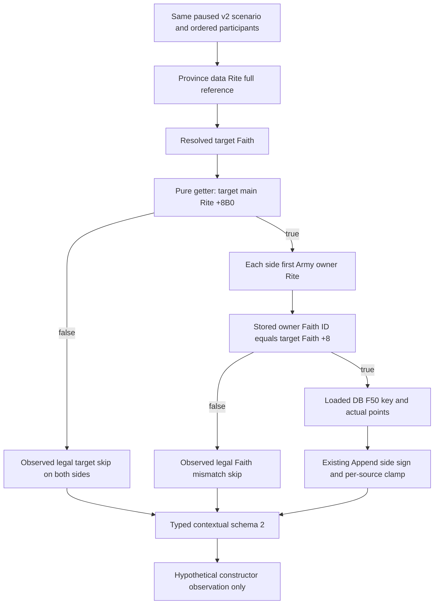

# Exact 1.20.0.3 religious constructor context query

The existing `ck3_query_combat_simulation_inputs` v2 query now exposes its two closed religious constructor sources in the optional `contextual_advantage` fragment. The fragment uses schema 2 and scope `hypothetical_constructor_context`. It observes a caller-owned zero-roll constructor context; `complete_encounter_advantage_ready` remains false, and full v3 is not advertised.

Exact game: 1.20.0.3, Steam 25652598, EXE SHA `94B55397ABB687A3DCD436805A5D885E6BE90FA6C693FEB44A9E3BBEEADE02A6`. The delta is based on g49 HEAD `9772958a55e5182ef78562c74e43d72ba3f2302e` plus the reviewed v46 seven-file patch, already adopted by Root at `c456abaff1bcf764612199ab43550296616bb355`. Apply additive hunks over subsequent Root changes; do not replace whole files from these earlier preimages.

The [implementation input ledger](Z:/ck3_mod_rewrite_process_assets/g2-resume-20261003/combat-context-religion-v47/query-closure/NATIVE-INPUT-LEDGER.md), [exact constructor research tree](Z:/ck3_mod_rewrite_process_assets/g2-resume-20261003/combat-context-religion-v47/constructor/NATIVE-TREE.md), [faith/Rite ledger](Z:/ck3_mod_rewrite_process_assets/g2-resume-20261003/combat-context-religion-v47/faith-rite-context/INPUT-LEDGER.json), and [loaded effect source ledger](Z:/ck3_mod_rewrite_process_assets/g2-resume-20261003/combat-context-religion-v47/modifier-sources/INPUT-LEDGER.json) were frozen before provider implementation.

## Native decision tree

The target is Province `+0x848` data object's `+0x384` Rite full reference, not the holder Character's faith. Resolve that Rite and its Faith `+0x4B8`. The pure `0x2BD8960` getter reads the target Faith's main Rite `+0x98`, generation-resolves it with native canonical fallback, and returns main Rite `+0x8B0`. The getter is a complete 86-byte leaf with no calls or persistent writes.

Only when this target predicate is true does each side's first Army owner participate. The exact `0x2587930` body follows first CArmy `+0x124` public CUnit, CUnit `+0x174` owner Character, Character `+0xB4` Rite, then compares that Rite's stored Faith full reference `+0x4B8` with target Faith object's full identity `+8`. It neither selects the commander's faith nor resolves an owner Faith object nor compares Rite identities. Different Rites sharing the same Faith match.

Matching selects `AdvantageBindings.get_rules()` at `0x8FC3E0`, loaded effect database `+0xF50`, key `unreformed_faith_province`. Signed points are read from current effect `+0x40`, with effect identity magic `+0x38` and loaded CString key validation. Stock +10 is a reference value only. Native calls append with scale 100000, side 0 then side 1. Loaded zero points still select, apply and append a zero ledger entry.

## Provider and wire meaning

`BuildNonReligiousAdvantagePlan` keeps its original 13 sources and two deferred placeholders. The contextual reader alone invokes `CompleteConstructorReligionPlan` to replace those placeholders, using the existing `Append` arithmetic, global append order, side sign and per-source clamp. Other phase/full-v3 callers retain the default nonreligious entry. New storage, NullObject and pure predicate bindings are installed only by the exact .3 adapter; no unproven .2 religious ABI claim is added.

`base_nonreligious_accumulator_raw` retains the v46 pre-religion meaning. `base_constructor_accumulator_raw` is the actual local shell base after both religious stages. `synthetic_zero_roll_total_raw` uses that completed constructor base and local dynamic components. Its helper equality proves only this local arithmetic.

Two typed religious source rows preserve first public CUnit and owner identities, target Rite/Faith/main Rite IDs, the target predicate, whether owner Rite was observed, nullable owner Faith comparison, loaded key and points, selected/applied flags, scale, signed contribution, accumulator before/after, append order and legitimate skip reason. Full reference zero is valid. `UINT32_MAX` becomes typed null while the native canonical NullObjects still provide the original operands. Target false leaves owner relation not evaluated. A generation read failure produces schema 2 scoped unavailable, preserving the existing v2 parent composition/readiness; it does not silently fall back to schema 1. Old schema 1 and older v2 with no fragment remain consumable.

Constructor `missing_domains` becomes empty only for a successfully observed complete constructor source set. This does not grant actual battle advantage or complete encounter readiness.

## Verification and readiness

The sole new focused fixture was compiled once with `/O2 /W4 /WX /DNDEBUG`, nine translation units, and executed once: **4/4 GREEN**, 10.555 seconds, no native harness RED. It exercises `ReadContextualAdvantageInputs` → new constructor plan → allocated native side ledger → production serializer. Cases cover first Army owner rather than selected commander, ID zero, non-stock loaded points, per-source clamp (`9750000` old base → `9300000` new base), target false short-circuit, distinct Rite with same Faith, matched zero-point append, mismatched owner, and stale target Rite scoped unavailable.

The corresponding four actual serializer outputs passed the existing registered Service/FastMCP consumer once with `-B -O`: **4/4 GREEN**, 3.15 seconds. No old v46 fixture or matrix was repeated. See the [native receipt](Z:/ck3_mod_rewrite_process_assets/g2-resume-20261003/combat-context-religion-v47/query-closure/fixture/results/NATIVE-FOCUSED-RESULT.json) and [registered consumer receipt](Z:/ck3_mod_rewrite_process_assets/g2-resume-20261003/combat-context-religion-v47/query-closure/wire-python/RELIGION-REGISTERED-MCP-RESULT.json).

Readiness is **static-ready, actual 0**. The native fixture injects reviewed binding callbacks into fixture-owned objects; the exact .3 adapter installation awaits Root's combined full DLL build and one real paused source capture. No game action, time advance, window operation, shared-source write, Git action, SDK discovery or full DLL build occurred in this work package. Root owns those remaining integration/live steps. No win probability, Monte Carlo, actual Combat resolved total or new complete OODA loop is claimed.
