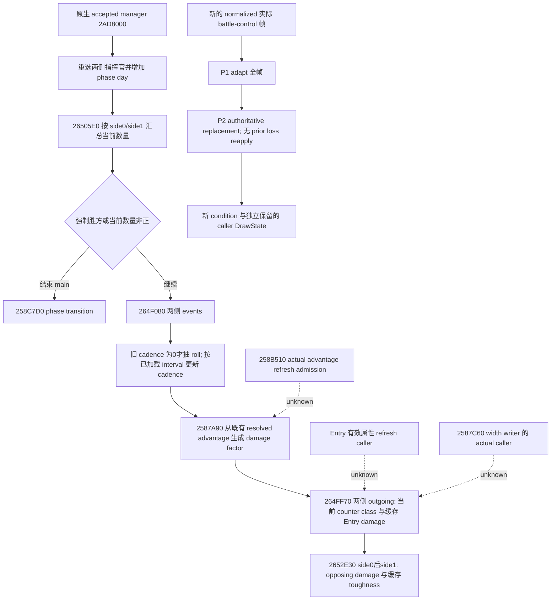

# 当前战斗帧的显式动态刷新

本专题绑定 CK3 **1.20.0.3 / Steam 25652598**，EXE SHA-256
`94B55397ABB687A3DCD436805A5D885E6BE90FA6C693FEB44A9E3BBEEADE02A6`。
原生输入树先封盘，再实现消费者。原生证据分别为
`Z:/ck3_mod_rewrite_process_assets/g2-resume-20261004/battle-current-dynamic-refresh-v57/effective-native/ROOT-DELIVERY.json`
及同目录的 `advantage-native/ROOT-DELIVERY.json`；两者复用既有 exact-build 缓存，不新增实机采样。

新增 `simulation/battle_current_refresh.py` 的
`refresh_current_battle_condition(carried, normalized_snapshot, *, active_resume_inputs=None,
contextual_advantage_inputs=None, battle_control_source=None,
backing_components_by_regiment_id=None, levy_damage_raw_by_side=None)`
消费完整的新 normalized 实际 battle-control 帧，通过 P1 adapter 和 P2 的权威 replacement
分支形成 `DynamicRefreshContext`。新帧的有效属性、人数、储存顺序、主参战者、指挥官、counter census、
loss inputs、width、base/resolved advantage 和 roll/cadence 覆盖此前 forecast carry；旧预测损失不再扣一次。
caller `DrawState` 独立保留，refresh 自身不抽签。返回的 ledger 将 source observed、caller carried
和 fresh observed 分列，整数 backing components、Q100000 兵力与同一损失的 owner hard attribution
仍为独立视图。合法零、读取失败的 null 和缺失 optional leaf 保留原义。

`26505E0` 只把 levy 当前值汇总到 side+A0，并把 levy+MAA 当前值汇总到 side+98；它没有刷新
damage/toughness/pursuit/screen 或 counter。原生 outgoing 内的 counter class 依赖实际主参战者和当时的
有序 MAA entries。Entry 步长为 **0x60（96 bytes）**，target row 步长为 **0x10（16 bytes）**；
Entry+18 为 signed64 Q100000 当前量，不能先取整到 soldiers 再恢复。当前 `.3` producer 尚未填充已有
`active_counter_inputs_v1` optional schema；本消费者接受新完整 census，但缺失时明确保留缺失。
`effective-native/CURRENT-COUNTER-PRODUCER-SEAM.json` 给出补这一现有 MCP leaf 的施工入口，
不新增全局 gameplay gate。synthetic fixture 的 counter 数值不代表该 producer 已完成实机观测。

实际 `battle_control_snapshot_v1` 读取真实 CCombat 已储存的 base+6C8、resolved+710、roll+6D0/+6D4、
cadence+6E4。第二个现有只读工具 `ck3_query_combat_simulation_inputs` 的
`combat_simulation_inputs.contextual_advantage` 属于 query-owned local shell，schema2 scope 为
`hypothetical_constructor_context`。调用者可以额外提供其完整 registered envelope 与 source，
用于独立解释七个有序 commander stages、helper1 的 directed personal Rite/Religion 分支和 helper2 的
full CultureID/category1 pillar 分支；它们不在 actual control leaf 中。

两 query 的 source/date/native revision、target、selected commanders 和 ordered participants 作为诊断
保留；相符也不能证明 hypothetical shell 就是真实 CCombat 的 non-roll cache。没有 control source 时，
本地叶无法比较 native frame identity，ledger 会明确记录。contextual commander rows 是
`commander_dynamic_raw` 的归因，不与该 subtotal 再相加；schema2 constructor base 已含 religion rows。
实际 base/resolved、contextual totals 和 caller sampled rolls 始终分别记账，不推断 actual future factor。

focused fixture 仅执行新 `test_battle_current_refresh.py` 的两个 production-shaped 连续帧 case，
复用旧 P1 builder/P2 carry 而不运行旧测试。第一例的独立手算 counter retention 为 55000，
fresh outgoing 为 `[756000, 100000]`；第二例保留合法0、null、缺失 census，验证有序 entry count 从2到3
以及 fresh owner hard total 600000。具体首轮结果与代码 SHA 留在
`focused-fixture/attempt-01-GREEN.json` 和 `focused-fixture/ROOT-DELIVERY.json`。

Readiness 为 **static-ready**。本包没有 SDK/game/pipe/window 动作，不新增自然日或 live credit，
不闭合 outer calendar admission、原生有效属性/width/advantage refresh 调度、事件反馈或完整 phase transition；
不声称 native RNG replay、完整 Monte Carlo 或胜率。下一步实际新帧 qualification 与缺失 counter producer
由 native publisher/Root 在既有普通战役上执行，source unknown 不阻止已有功能继续游玩。
