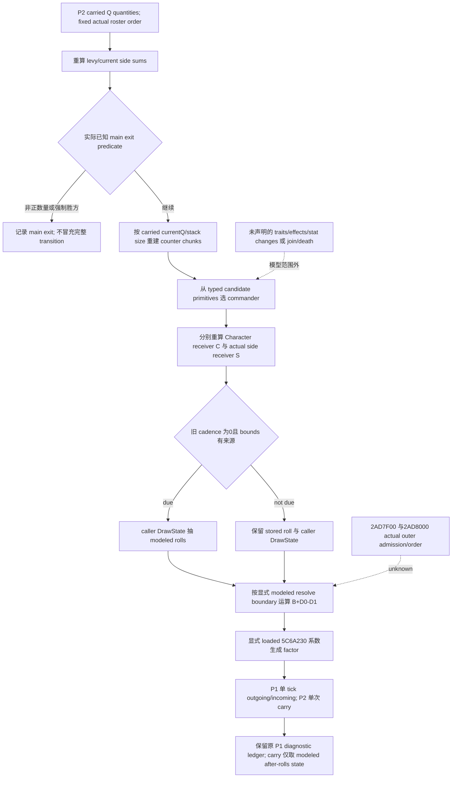

# 固定 roster 的 conditional future main refresh

本专题绑定 CK3 **1.20.0.3 / Steam 25652598**，EXE SHA-256
`94B55397ABB687A3DCD436805A5D885E6BE90FA6C693FEB44A9E3BBEEADE02A6`。
原生 source-first 账本位于
`Z:/ck3_mod_rewrite_process_assets/g2-resume-20261004/battle-current-future-refresh-v58/effective-native/ROOT-DELIVERY.json`
和同包 `counter-terrain-native/ROOT-DELIVERY.json`。本包复用封存来源，不新增 CK3 输入或实机采样。

`battle_current_future_refresh.py` 提供
`build_conditional_future_main_condition(carried, *, inputs: FutureMainRefreshInputs)`，
以及 `run_conditional_future_main_tick(carried, *, inputs)`。它们在显式固定 roster、无 join、
无 phase events、无 character deaths、固定 target/terrain 和声明的稳定输入范围内，使用 P2 carried
Q100000 数量构造下一次纯模型 main 输入。当前人数、counter chunks/classes、candidate/side 组件、
roll/cadence 和已提供系数的 damage factor 重新运算；没有把此前 final retention、candidate score 或
factor 当成 future 常数。原始 normalized snapshot、native 日期与 revision 仍作为原始观测保存。

原生 `2AD7F00 -> 258B510` 在 event scheduling 前刷新两个 side contexts，再经
`2651070 -> 2657AC0 -> 26344C0`，按 levy 后 MAA 顺序写入六个 cached effective attributes。
Entry stride 为 **0x60（96 bytes）**。该 schedule manager 与 phase manager `2AD8000` 的 outer
admission/order 尚未闭合；phase manager 会重新选择 commander 并增加 phase day。
continuing main 则刷新当前数量、检查 early exit、执行两侧 events、按旧 cadence 判断是否抽 roll，
最后从当时储存的 resolved+710 生成 factor。不能因为 modeled roll 改变就声称原生同日自动 resolve。

每侧 `D_i = roll_i*100000 + C_i + S_i`；null-tooltip `258A470` 没有另一个 residual 项。
`C_i` 由 martial、两个声明的 opaque context leaves、Army gate、primary identity、gathering rule 和
Character receiver 的 relation sum 依原生顺序组成。`S_i` 是独立实际 side receiver 的七项 sum，
不能与 Character receiver 混合。primitive rows 与已经完整的 subtotal 是替代表示，不能重复相加。
counter 在 `.3` outgoing 中消费当时的有序 current Q；`current_chunk_raw` 从 carried current Q 与
已知 integer stack size 运算，不能先把 fractional soldiers 取整后恢复。属性和 opaque leaf context
仅在调用者明确声明稳定时沿用；变化而未提供下一 operand 时必须记录 conditional 缺口。
retention 复用现有 kernel 的 ratio-for-max 200000 和 max-reduction 90000；这是显式 conditional
系数来源，不是本包重新读出的 `.3` loaded rules。counter helper 的 eligibility-filtered outgoing 总量
不用于 `.3` MAA fire；这里只复用其 class retention，再依当前所有 retained rows 运算 outgoing。

`2587A90` 的加载系数为 **signed64 Q100000 slot 5C6A230**，与 outgoing damage scaling
**5C69B90** 不同。原生普通范围公式为
`q = mulQ(abs(resolved_raw), loaded_advantage_scaling_raw)`，
`factor = 100000 + trunc0(q*100000/10000000)`；先后两层 fixed-point 运算必须保留。
正 resolved 时 side0 使用 factor，否则 side1 使用；另一侧为 100000。
本消费者要求显式系数和来源，不使用 core 默认 5，也不从旧缓存 factor 反推系数。
`counter-terrain-native/FACTOR-SOURCE-CONTRACT.json` 保留 exact body、signed fast/slow paths 与
现有 `current_loss_inputs_v1` 增加 optional `runtime_advantage_scaling_raw` 的最小只读 producer 入口。
缺失、null 与合法 0 保持区别；这里没有替 native publisher 实现或实测该观测口。

width 更新必须有显式 participant-update admission 和已提供的 terrain multiplier、base ratio、minimum
width；不能因 casualty 改变就自动断言原生运行了 width writer。`2587C60` 用平均 current Q 和 loaded
ratio 生成 candidate，但 base 为 `max(previous_base,1,candidate)`，是历史最大值；final 再应用 terrain
和 loaded minimum。固定 roster、兵力递减、同 terrain/系数时，base 不随 casualty 缩小。未给出新的
admitted update 时保留这些条件并使用原缓存。模型 resolve boundary 也必须显式声明；fixture 的
`after_modeled_due_rolls` 是 caller 的
conditional schedule，不是对 native calendar/event feedback 的结论。

wrapper 区分 `draw_state_before_rolls` 和 `draw_state_after_rolls`。旧 cadence 4 在 loaded interval 5
下，本 tick 不抽签而在末尾 wrap 成 0；P1 对新条件的 diagnostic 可以因 cadence 0 产生另一组抽签。
这些 raw diagnostics 保留原样，wrapper 交给 P2 后显式用 modeled after-rolls state 作 caller carry，
避免把 diagnostic 再扣进 RNG 账本。它不声称这些 caller rolls 是 CK3 下一次实际 RNG。

唯一新 focused fixture 为 `test_battle_current_future_refresh.py` 的两个 cases，具体首轮结果和 SHA 在
`focused-fixture/attempt-01-GREEN.json`、`focused-fixture/ROOT-DELIVERY.json`。第一例 carried 当前量
为 1000000/450000，下一 counter retention 为 **79750/10000**；martial 1/0、actual base -100000、
modeled roll 4/2 给出 resolved 200000，显式 synthetic loaded coefficient 200000 给出 factor **104000**，
future outgoing 为 **829400/0**。第二例验证 cadence 4→0 的 diagnostic 13→15 被排除于 caller
carry（保持 13），并保持合法 damage 0、无 levy 所需 getter 的 null，以及缺失 candidate/coefficient
和 resolve boundary 的 conditional 状态。系数与 candidate 数值是 synthetic fixture observations，
不冒充生产实机字段。

Readiness 为 **static-ready，conditional fixed-roster main scope**。本包没有旧矩阵、native build、
SDK/game/pipe/window/Git 动作，没有新增自然日或 live credit。它没有完整 traits/events/knight death/join
反馈、实际 full candidate census、outer calendar parity、完整 phase transition、完整 Monte Carlo 或胜率。
下一步是 Root 的实际帧 qualification 和现有 MCP missing operands 补采；这些 source gaps 不形成新的
游戏执行禁令。
