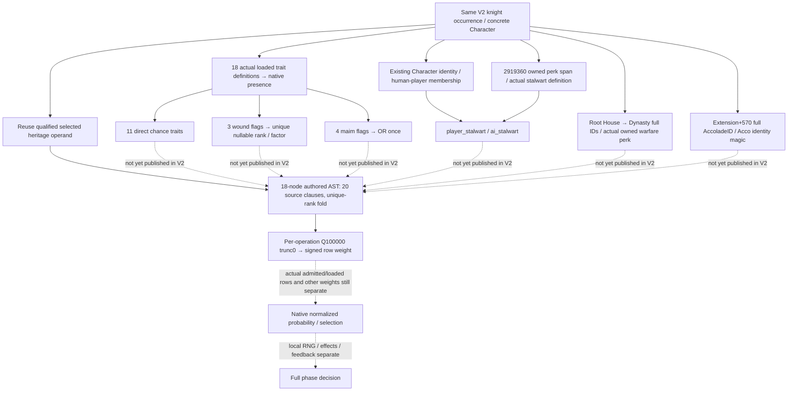
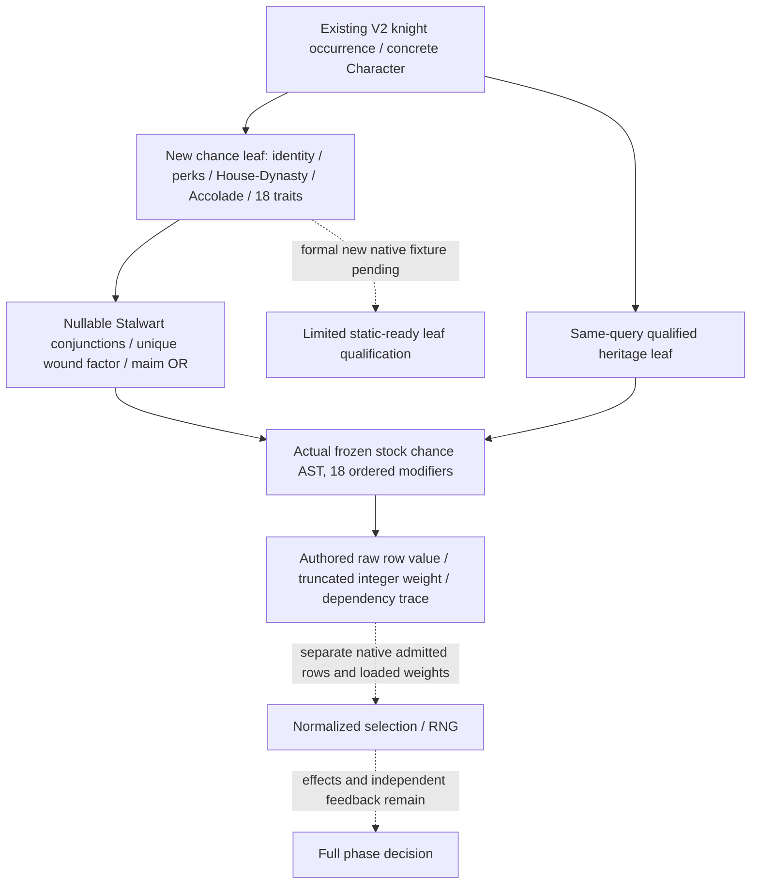

# Knight berserker chance inputs — CK3 1.20.0.3

The [berserker validity leaf](combat-phase-berserker-validity-inputs-12003.md) is limited static-ready. The original source-only package below closes the inputs to the same knight occurrence's authored `chance` expression. The same-query V2 chance leaf now publishes those operands and calculates the authored row value; its FIRST production Python case, formal native fixture and FIRST genuine compiled-wire consumer are GREEN. Qualification is **limited static-ready for the new chance leaf only**. The input seams already have exact `.3` cached compatibility proof; implementation required no EXE read. No current game probability is claimed.

The plan was sealed before this research at `C:/codex-ck3-background/packets/phase-berserker-chance-source-20261006/SOURCE-PLAN.json`. Source base is `c19c8fd8bdae5c0c27dbbe0537a1fc8576915cdd`. Target remains CK3 **1.20.0.3 Crozier / Steam 25652598**, with the previously frozen EXE SHA `94B55397ABB687A3DCD436805A5D885E6BE90FA6C693FEB44A9E3BBEEADE02A6`. No executable was opened or rehashed.

## Actual source and modifier order

The current frozen stock AST is `ck3_1_20_0_3_stock_combat_phase_events.json`, file SHA `0bb56e3e14d481eccf69949266367df21eef8aa6ac4a606e1cb15d061f55c0b0`. The cached current source body is in the earlier exact-build stock `SURVEY.json`; its chance excerpt is now frozen in `AUTHORED-CHANCE-SOURCE.txt`. The source-closure ledger pins this row to `common/combat_phase_events/00_knight_phase_events.txt:184–384`, with chance compact SHA `40FD8F75C52EF41E5968DAA614CD0D13D9BE31B0870D79CE51039FCCD747A241`. The `.3` source chance is unchanged in that comparison; its historical validity/effect qualifications are not reused as new live credit.

The source contains **20 ordered modifier clauses**, starting at base **30 / Q100000 raw 3,000,000**. The current AST has **18 modifier nodes** because it folds the three wounded-rank clauses into one derived rank factor. All other factors keep their source order.

| Source clause | Condition on this knight root | Factor | Current AST node |
| --- | --- | --- | --- |
| 1 | `stalwart_leader_perk` and `is_ai = no` | 1.5 | 1: `derived.root_player_stalwart` |
| 2 | `stalwart_leader_perk` and `is_ai = yes` | 1.15 | 2: `derived.root_ai_stalwart` |
| 3 | `is_acclaimed = yes` | 1.25 | 3 |
| 4 | `dynasty ?= { has_dynasty_perk = warfare_legacy_3 }` | 1.25 | 4 |
| 5 | wrathful | 5 | 5 |
| 6 | giant | 5 | 6 |
| 7 | impatient | 3 | 7 |
| 8 | sadistic | 2 | 8 |
| 9 | brave | 2 | 9 |
| 10 | ambitious | 2 | 10 |
| 11 | North Germanic selected heritage | 2 | 11 |
| 12 | content | 0.5 | 12 |
| 13 | compassionate | 0.25 | 13 |
| 14 | temperate | 0.25 | 14 |
| 15 | lazy | 0.25 | 15 |
| 16 | patient | 0.25 | 16 |
| 17 | wounded rank 1 | 0.5 | folded into 17 |
| 18 | wounded rank 2 | 0.5 | folded into 17 |
| 19 | wounded rank 3 | 0.25 | folded into 17 |
| 20 | one_legged OR disfigured OR one_eyed OR maimed | 0.5 once | 18 |

There is **no prowess factor and no external wound script value in this chance**. Prowess is already available in V2 and is used by other effect/opponent branches; it cannot replace a missing trait, rank or perk condition here. The maim OR applies one factor even if several injury traits are present.

For a uniquely observed wounded rank, derive `root_is_wounded = rank in {1,2,3}` and wound factor `50,000` for rank 1/2, `25,000` for rank 3, `100,000` for no wound. The existing phase-character reader rejects multiple loaded wound ranks; the existing named-person DTO also retains a nullable rank. Preserve the three actual presence operands and a rank-resolution reason. Do not choose rank 3 or rank 0 when the actual presence data cannot establish one rank. The source20→AST18 compression is an authored projection for a known unique rank, not proof that a synthetic unknown rank is a real zero.

The AST specifies Q100000 truncation toward zero **after each applied operation**, followed by signed raw/100000 truncation to the row's integer weight. [The exact `.3` native selector tree](combat-phase-events-12003.md) then skips nonpositive weights and performs a weighted draw over its trigger-valid loaded rows. Thus this row's base 30, final raw chance value or integer weight is **not a percentage**. A normalized probability additionally needs the admitted row set, other weights, actual loaded overrides and native selection context; local RNG and eventual effects remain separate.

## Same-query values and minimum source seams

The root is the concrete knight occurrence already resolved by `ReadCombatKnights`: public Army, source Regiment, Character and member index. Its employer/effectiveness-context Character, Army owner or played Robert identity cannot substitute for the root. Default values in an unavailable V3 DTO and a separate named-current-person query are not observations in this V2 frame.

| Required raw input | Present in same V2 knight query | Source-closed minimum read |
| --- | --- | --- |
| Occurrence attribution | Yes | Existing knight row and full Character identity |
| North Germanic heritage | Optional qualified validity leaf | Reuse `phase_berserker_validity_inputs_v1.culture.heritage_north_germanic` and its reason; no repeat Core/Culture binary research |
| Player/AI identity | No | Existing `phase_character` identity seam / `IsHumanPlayerCharacter 2BAA710`, full CharacterID, actual GameData player-ID array `+22358/+22364`; preserve the existing identity reader's alive/AI semantics |
| Stalwart perk | No | Loaded CharacterPerk DB `5C67128`, rows `+50/+5C`, unique actual key `stalwart_leader_perk`; `CharacterPerks 2919360` returns this root's pointer span `data+0/count+C`; pointer membership |
| Warfare legacy perk | No | Root `Character+158` full HouseID → House identity `+10` → `House+2C` full DynastyID → Dynasty identity `+10`; loaded DynastyPerk DB `5D1FC00`, actual `warfare_legacy_3` definition; owned pointer span `Dynasty+178/+184` |
| Acclaimed identity | No | `Character+1B0` extension → `+570` full AccoladeID; storage `5D1ECA0`, fallback `5D1EC40`; resolved `+8` identity and `+C == 4163636F` (Acco) |
| Eleven direct chance traits | No | Same initialized TraitDB and real unique-definition/presence helpers already used by validity; keys wrathful, giant, impatient, sadistic, brave, ambitious, content, compassionate, temperate, lazy, patient |
| Wound rank | No | Three more actual keys wounded_1, wounded_2, wounded_3 through the same presence seam; derive unique rank/null independently |
| Maim OR | No | Four more actual keys one_legged, disfigured, one_eyed, maimed through the same presence seam |

These are **18 additional named trait presence values**, plus independent identity, Stalwart, Dynasty and accolade domains. The existing validity leaf still supplies only craven/berserker/calm and heritage; it does not claim the additional traits have been observed. The separately available named-person injury DTO is useful source reuse, but its response cannot be spliced into the same-query occurrence as if it came from this V2 frame.

The narrow source extracts are in the already implemented `ck3_12002_phase_character.cpp`, `ck3_12002_phase_culture.cpp` and `ck3_12002_phase_misc.cpp`. Reuse their real getters and loaded pointer/key lookup, not the broad outer readers' unrelated XP, traditions, innovations, court variables or accolade attributes. Normal legal absence remains distinct from failed full-generation resolution. The existing Dynasty reader reports no owned warfare perk for an absent Dynasty; keep House/Dynasty identity and absence provenance alongside that authored operand. Missing definition, stale identity, malformed/unavailable span or failed key copy remains nullable with its own reason. Do not replace membership with numeric perk IDs or an acclaimed vtable Boolean call: the reviewed build's primary accolade vtable has no Boolean slot at `+8`.

## Exact `.3` cached native proof

The cached `.3` reuse manifest and core comparison explicitly record all three required contracts **UNCHANGED / GREEN**. The comparison identifies the target version/EXE and the baseline contract hashes. This is target static source proof, with `target_live_verified: false`; earlier `.2` fixtures do not become `.3` live evidence.

| Contract | Pinned manifest SHA | Cached comparison checks |
| --- | --- | --- |
| phase_character | `f350f5fed5e7287e6b3f0f5ab8c0e76fb63f29881e7b700a34440271c5ded623` | 10 signatures, 1 vtable prefix, 25 instructions, 18 constants |
| phase_culture | `6c32d06c336f3fc57e73789433eaa620ae7cb2de6eca1aa212d954abe165f7d3` | 16 signatures, 53 instructions, 36 constants |
| phase_misc | `5e66a6a791a22a1484a20b59d4177832eb7898db2b7927587d6aa9f69f2a5daf` | 11 signatures, 53 instructions, 22 constants |

For Dynasty, cached direct source includes `has_dynasty_perk 2B203C0`, House/Dynasty scopes and the new owned span offsets. For Stalwart, it includes the actual `2919360` lifestyle getter and definition DB layout. For acclaimed, it includes `CIsAcclaimedTrigger 2AFB700`, extension/full ID source and final magic/full-ID checks at `2AFB791/2AFB79A`. These existing native edges close the smallest observer branch; no new class search, RTTI discovery, binary function read or fallback audit is necessary.

## Immediate implementation handoff and boundary

The next minimum implementation is a knight-only optional `phase_berserker_chance_inputs_v1` beside the qualified validity leaf. It must read the above inputs from the same concrete Character during the existing query. Each trait and each identity/perk/accolade domain retains an independent nullable value/reason; preserve raw full refs, resolved IDs and legal zero where those domains need them. Do not run the broad V3 producer to obtain the leaf, require its overall success, or change commander/V3/overall readiness.

The pure consumer can join this leaf with the qualified heritage operand by the same occurrence, derive player/AI Stalwart, known unique wound rank/factor and maim OR, then consume this event's actual frozen chance AST in source order. Its output must identify authored raw row value and integer weight, with an operation trace and explicit unknown dependencies. Validity, native admission/order and loaded context remain independently attributed; a valid authored expression and a known row weight do not establish native selection or an executed effect. Use one new focused production normalizer → adapter → actual AST compound case; Root owns the first exact native fixture/build/CTest and genuine new-wire consumption. No old validity/Core/Boolean case is needed.

This source-only packet is **research / source-confirmed immediately implementable chance observer handoff**. It newly identifies a publication dependency and closes its required native families through cached proof; it introduces no provider, strategy, tests, native builds or game operations. Selected inputs use **1,287,192 unique bytes of cached JSON** (current AST, `.3` reuse/comparison, two required manifests, stock closure and cached survey), not new executable bytes. EXE reads/hashes, native execution, old test/sample repeats and local CK3/Steam/process/SDK/pipe/UI/live-memory operations are zero. The machine-readable modifier/input ledgers, cached pins, minimum handoff and Oct6/W41 fields are in the external packet; Root owns shared report integration and push.

## Same-query candidate and first Python qualification — 2026-10-06

Implementation plan was sealed before edits at `C:/codex-ck3-background/packets/phase-berserker-chance-implementation-20261006/IMPLEMENTATION-PLAN.json`. The candidate adds the optional knight-only `phase_berserker_chance_inputs_v1` to the existing V2 query, collector and serializer. The exact `.3` binder reuses the cached-compatible Character identity/trait family and extracts only the reviewed perk, House/Dynasty and Accolade seams. It does not invoke the broad V3 Culture/Misc producers or depend on their aggregate success. Real `ck3_12002_phase_character.cpp` supplies identity, unique-definition lookup and native trait presence; no stubs replace those linked helpers.

The leaf contains 18 individually nullable trait values/reasons, independently nullable AI identity and Stalwart membership, raw/resolved full House/Dynasty and Accolade IDs, resolution classifications and nullable warfare/acclaimed operands. Actual legal absence is known false when its relevant loaded definition is available. Definition failure, stale full generation, native fallback identity or wrong object kind retains a domain reason; legal zero full IDs survive normalization. Failure in one domain preserves other observed inputs.

The new occurrence adapter joins only the same knight's qualified heritage leaf. It derives the two Stalwart conjunctions, unique wound rank/factor and maim OR using three-state logic. The pure consumer evaluates the actual frozen 18-node chance AST in source order, returns `raw_value`, truncated `integer_weight`, an operation trace and only the dependencies needed by that calculation. A known false conjunction or true maim OR can make another unavailable operand irrelevant. Multiple wound flags retain an explicit unresolved-rank reason rather than choosing a factor.

The **FIRST new Python compound case** passed once at **04:25:18.244520–04:25:19.329080 UTC** (12:25 Asia/Shanghai): **1 unittest method / 17 actual stock chance evaluations**, unittest time **0.014 s**, outer time **1.0845429 s**. It exercises the production V2 normalizer, same-query occurrence adapter and actual stock chance AST against the independent 20-clause source order, including per-operation truncation, all direct trait factors, all three wound ranks, once-only multi-maim, unknown needed/unneeded operands and full-generation zero IDs. The input remains unchanged and existing aggregate Monte Carlo readiness remains false. Example authored results are raw **87,890,625 / weight 878** for the synthetic player/Stalwart/warfare/acclaimed/wrathful/giant/patient/North Germanic case, and raw **1,347,656 / weight 13** for synthetic AI/Stalwart/warfare/acclaimed/wound2/multiple-maim. These are row values, not percentages.

The receipt and stdout/stderr are under `first-python/attempt01/`; no RED attempt occurred. Existing encounter/Core/heritage constructors are explicitly synthetic context. No previous validity/Core/Boolean method, sample or native test was rerun. No executable bytes, native build/CTest or game operation were performed in this candidate package.

The new genuine native fixture is `native_bridge/tests/phase_berserker_chance_12003_test.cpp`; proposed target/CTest is `xar_ck3_12003_phase_berserker_chance_inputs_test`. It will emit **one JSON / ten new leaf samples** at `ck3_12003_phase_berserker_chance_inputs_wire.json`, using the real provider/helper/inline serializer over fake memory. Root owns the formal target, full DLL build and FIRST native/compiled-wire consumer. Until those pass this is **candidate / Python-qualified**, not native-qualified static-ready. Candidate validity, native row admission/ordering, other loaded weights, normalized selection probability, RNG, effects and full phase readiness remain separate.

## FIRST exact compiled-wire qualification — 2026-10-06

Root's formal source is immutable `C:/codex-ck3-background/phase-chance-rule43-batch/g89-fix02` at **`aff6d9f2165e7cd54af079b599f0a5953e3ca51f`**. Its strict02 full DLL/runtime plus two new fixture targets passed in **119.043374 s**, from **04:39:40.708561 to 04:41:39.751935 UTC**. The FIRST two new CTests passed at **04:42:19 UTC**; this package's `xar_ck3_12003_phase_berserker_chance_inputs_test` took **0.100229 s**. The joint CTest run has **2/2 GREEN**, reported real total **0.24 s**, outer **0.2896776 s**; the second test belongs to the independent Rule43 package and contributes no chance-leaf sample credit. Root receipts are `strict02/BUILD-RESULT.json`, `strict02/FIRST-TWO-READONLY-CTESTS.json` and its JUnit XML.

The central strict01 configure/build attempt is retained as **RED**, **6.722241 s**, exact source `d8edebb915edf6cfec362a4ac2b3b0a5cf0702db`; no new CTest or compiled consumer was counted in that failed attempt. Root corrected the central build and ran the fresh strict02 source above. This qualification did not rerun an old test or erase the RED archive.

The genuine emitted chance wire is `strict02/cache-observers/ck3_12003_phase_berserker_chance_inputs_wire/ck3_12003_phase_berserker_chance_inputs_wire.json`: **21,160 bytes**, SHA-256 **`76d5ac5bb987bd4b737ac651bd6eb544ae03c9789e06c38a21b445378edd20f8`**. It contains **one JSON file / ten newly compiled native leaf samples**. FIRST production consumption passed once at **04:42:40.686378–04:42:42.382599 UTC** (12:42 Asia/Shanghai), **1.6962199 s**, with **ten actual stock chance AST evaluations / ninety checks**. The frozen production V2 normalizer, same-occurrence adapter and actual stock AST were imported from that exact compiled tree. No consumer RED occurred. Receipt, source/wire pins, case results, command and stdout/stderr are frozen at `C:/codex-ck3-background/packets/phase-berserker-chance-implementation-20261006/first-compiled-consumer/attempt01/`.

The native samples cover empty observed domains, player/AI Stalwart, loaded warfare/acclaimed bonuses, actual wound and multiple-maim operands, full-generation zero IDs, legal missing sources, one unresolved perk definition, one unresolved trait definition, stale House generation/wrong Accolade kind, multiple wound flags and unavailable identity with the remaining domains preserved. Their new provider/serializer bytes are genuinely compiled. The surrounding encounter, old Core and heritage wrappers remain **explicitly synthetic context**; this test neither reruns nor newly qualifies those historical capabilities. Heritage remains a separately qualified same-query operand whose current frame must actually publish it.

Readiness changes only to **limited static-ready chance observation and authored row-value calculation**. Known complete operands yield raw row value and truncated integer weight; relevant missing operands remain nullable with reasons. This is not current-game observation, normalized selection probability, candidate admission, RNG, an applied event effect, production-live primitive/loop or complete phase decision. Commander/V3/overall readiness and the separate validity predicate are unchanged. No local CK3/Steam/process/SDK/pipe/UI/live-memory operations, new EXE reads/hashes, old methods/wires or child native builds/CTests occurred during this FIRST consumer.
