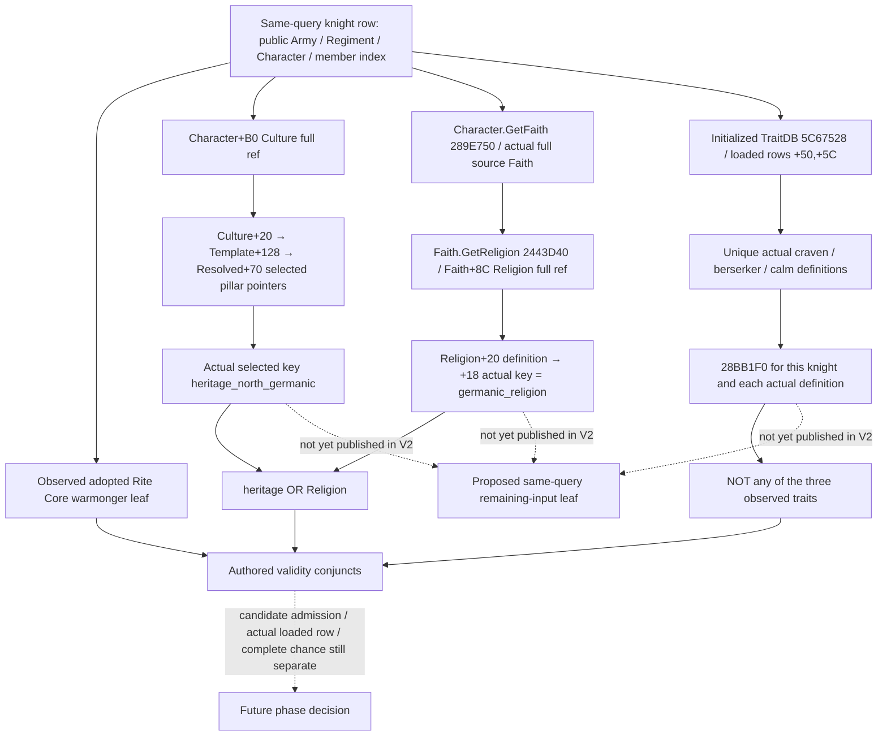

# Knight berserker validity inputs — CK3 1.20.0.3

This source-only packet continues the already qualified warmonger Core leaf. Its scope is the remaining stock knight occurrence conjuncts: North Germanic heritage or germanic Religion, and the absence of craven, berserker and calm. Warmonger alone does not make the complete event row ready.

The source plan was sealed before this research at `C:/codex-ck3-background/packets/phase-berserker-validity-source-20261006/SOURCE-PLAN.json`. First reuse the stock AST, current V2 role fields, canonical native research and cached getter/definition pins. No provider, strategy or readiness change, test, build, binary scan or local runtime operation is part of this packet. Any actual missing native operand requires a concrete bounded source plan before new binary reads.

## Exact source and authored tree

The target is CK3 **1.20.0.3 Crozier**, Steam build **25652598**, with the previously frozen EXE SHA-256 `94B55397ABB687A3DCD436805A5D885E6BE90FA6C693FEB44A9E3BBEEADE02A6`. No EXE was opened or hashed in this packet. The source lane begins at `72a27e74053aa66cb0ee02477ba0762e85962b51`; the stock AST and native ABI metadata below are taken from the current Root source tree.

The installed source previously frozen by the [warmonger packet](combat-phase-warmonger-predicate-12003.md) is `common/combat_phase_events/00_knight_phase_events.txt:184–200`. Its current stock AST is `ck3_autonomous_player/src/xar_autoplayer/simulation/data/ck3_1_20_0_3_stock_combat_phase_events.json`, SHA-256 `0bb56e3e14d481eccf69949266367df21eef8aa6ac4a606e1cb15d061f55c0b0`. The event is a **knight** row, with authored base weight 30. The exact validity AST has three conjuncts:

```text
root.rite.tenets.warmonger
AND (root.culture.heritage_north_germanic OR root.religion.germanic)
AND NOT (root.traits.craven OR root.traits.berserker OR root.traits.calm)
```

The root is the concrete knight occurrence. The associated effectiveness-context Character can be its employer or liege and cannot replace this root. Base weight 30 is not a percentage or the final chance. This packet does not research the separate modifier sequence, selection, effect or native candidate admission/order.



## Reused native proof

The `.2` source names are backed by an explicit `.3` compatibility result, not by an assumed patch similarity. The current reuse manifest `research/ck3_1_20_0_3_abi_reuse.json` pins the `.3` target and these two baseline contracts. The cached `artifacts/migrations/2026-10-02/abi-comparison/core-comparison.json`, SHA-256 `5bd80588c3021bf300edda12a63b8d96fbefdb484f0d869ee129d0fc5a81876d`, records both as **UNCHANGED/GREEN**:

| Reused contract | Pinned manifest SHA-256 | Existing comparison scope |
| --- | --- | --- |
| `phase_character` | `f350f5fed5e7287e6b3f0f5ab8c0e76fb63f29881e7b700a34440271c5ded623` | 10 signature records, one vtable prefix, 25 instruction records, 18 source constants |
| `phase_culture` | `6c32d06c336f3fc57e73789433eaa620ae7cb2de6eca1aa212d954abe165f7d3` | 16 signature records, 53 instruction records, 36 source constants |

The cached comparison did not execute the target native functions or claim target live verification. Historical `.2` culture fixtures retain their own version and are not new `.3` live evidence. The actual `.3` adapter reuses the reviewed `.2` bindings only after its exact descriptor SHA matches, as documented by the existing migration comparison. No verifier or comparison was rerun here.

**Traits.** `ck3_12002_phase_character.hpp/.cpp` already provide public `FindUniqueTraitDefinition(database, key)` and `ReadTraitPresence(bindings, character, concrete_definitions, out)`. The loaded TraitDatabase is at initialized slot `5C67528`, with pointer rows `+50`, signed count `+5C`, and definition CString key `+18`. The cached native `CharacterHasTrait` signature at `28BB1F0` reads the actual definition's ordinal at `+10`, then this Character's trait IDs at `+F8` and count at `+104`. All three exact keys are already in the existing 56-key phase collection. Resolve the three actual loaded definitions and call this existing concrete-definition presence seam; no trait-ID table, scholar alias or broad trait-catalogue observation is needed. A missing/ambiguous definition is unavailable, not observed trait absence. The initialized slot avoids needing the database getter's documented initialization branch; this is an existing source location, not another observer protocol.

**Culture.** The cached `compiled_has_pillar` source at `2B12490` resolves a kind-26 Culture full ref through storage `5D1E2F0`, with low-24-bit indexing and object identity at `+10`; its failed-reference path uses fallback `5D1E2E8`. The RHS definition's category byte is **`+1520`**, and category 5 is a separate missing-pillar branch. For a normal category the actual comparison is the selected pointer at `Culture+20 → Template+128 → Resolved+70 → category*8` against the RHS definition pointer. This is not the old inline Culture pillar layout, and no numeric category is guessed to mean heritage. The existing `ReadPhaseCharacterCultureRelations` observes all five selected pointers and copies their actual `+18` keys, deriving `heritage_north_germanic` from the exact selected key. Its relevant source checks are `2B124FA`, `2B124FE`, `2B12505`, `2B124E0` and `2B124E7`; Character Culture ref `+B0` is independently pinned at `C6E0FB`. Extract only this existing pillar-reading portion for the proposed V2 operand. A future implementation must retain the difference between exact normal Culture observation and a native fallback. This packet does not assign false to an unobserved fallback Culture or invent a loaded target category.

**Religion.** [The current Religion identity topic](religion-native-ai-faith-identity-12003.md) already closes `Character.GetFaith 289E750`, source Faith identity, `Faith.GetReligion 2443D40`, `Faith+8C` full Religion ref, and `Religion+20 → definition+18` stable CString key. Compare the observed actual key to **`germanic_religion`**. Do not use Faith ID, a translated name, adopted/main Rite equality, directed hostility or the integer reflection getter as this operand. Reuse the closed internal identity/key copier on the concrete knight; the outer played-actor Religion query is not a query for arbitrary knights and cannot lend its live credit to this proposed leaf. No Faith/Rite native body was reread.

## Present values and actual transport gap

| Required input | Current same V2 query | Existing source seam | Remaining work |
| --- | --- | --- | --- |
| Exact knight occurrence | `character_id`, `source_regiment_id`, native CArmyID and public Army wrapper; native member row order | Existing `ReadCombatKnights` | Reuse; do not substitute the effectiveness-context Character |
| Warmonger Core membership | Optional `phase_warmonger_core_v1`; limited static-ready | Already qualified `.3` Core leaf | Reuse; do not reread its source or run old tests |
| North Germanic heritage | **Not published in the V2 knight row** | Reviewed Culture selected-pillar reader | Extract minimal actual selected-pillar observation |
| Germanic Religion | **Not published in the V2 knight row**; Boolean leaf's source Faith ID is not a Religion key | Closed current identity/key copier | Add exact source Religion identity/key to this same occurrence |
| Craven, berserker, calm | **Not published in the V2 knight row** | Public named definition/presence functions | Read only the three required concrete definitions |

The legacy V3 path calls `ReadPhaseCharacterIdentityTraits` and `ReadPhaseCharacterCultureRelations` on its candidate Character objects. It can internally fill these nonreligious values, but the outer phase producer still reports pending Religion/Rite implementation. Default false DTO members and the static manifest's list of exact-ref names do not establish current V2 observations. Copying that unavailable V3 response, or combining independent player/candidate MCP epochs, is not the missing V2 connection.

## Minimum observer handoff

The immediately implementable seam is a small optional **knight-only remaining-validity input leaf** in the existing V2 query, next to the already qualified Core leaf. A proposed name is `phase_berserker_validity_inputs_v1`; it is a handoff name, not a registered capability or implemented schema. Preserve the same public Army/Regiment/Character/member-index attribution used by the Core adapter.

The leaf needs only source Character identity, raw and resolved Culture identity, the five actual selected pillar keys or their directly observed North Germanic result, source Faith/Religion full identities plus actual Religion key, and the three named trait-presence results. Keep each domain's observation status/reason and nullable value independent: failure to copy a Religion key must not discard a successfully observed exclusion trait, and missing definition must not become false. Legal reference zero and full-generation DWORD bits survive. Absent/stale/fallback Culture or unresolved source Faith/Religion requires the real resolution classification and a null value unless the actual fallback operand has been independently observed.

Use `FindUniqueTraitDefinition` and `ReadTraitPresence` directly for the three traits. The broad outer trait reader also needs dozens of unrelated definitions and XP tracks; the broad Culture reader additionally reads House/Dynasty, perks, innovations, traditions and parameters. Those unrelated domains are unnecessary for this stock validity clause. Reuse/extract the closed narrow portions rather than requiring the broad readers to succeed. Source Culture fallback truth and actual loaded overrides remain explicit boundaries; this observer does not silently emulate them with a default false.

No final `event_valid`, `phase_ready` or selection output belongs in this leaf. The future pure consumer can join the published inputs to the qualified warmonger source and the existing stock validity AST. Native candidate admission/order, actual loaded row overrides, chance modifiers, selection/RNG/effects, V3 and full forecast readiness remain separate. This packet changes none of those behaviors and contains no provider or counter-policy implementation.

## Cost, readiness and next step

The source-only packet reuses **1,059,521 bytes of existing JSON input**: `.3` reuse metadata 769,751; cached core comparison 21,878; phase-character contract 11,812; phase-culture contract 29,088; frozen current stock AST 226,992. Native code byte patterns in the cached manifests are reused metadata, not a new EXE read. New EXE bytes, new hash/section/RTTI scans, tests, native builds and local CK3/Steam/process/SDK/pipe/UI operations are all **zero**.

Readiness is **research / source-confirmed remaining-input observer handoff**. The source gap is now a concrete V2 publication dependency, with an immediately reusable three-trait seam and normal Culture/Religion read portions. There is no new live capability or full berserker readiness claim. Root owns the shared Oct6/W41 report merge; plan, selected AST/native evidence records, exact input pins and a machine-readable handoff are under `C:/codex-ck3-background/packets/phase-berserker-validity-source-20261006/`. The next bounded implementation can fill this leaf without another EXE read for its source-closed normal paths; any later attempt to claim fallback truth must use its actual source/observed operand.
