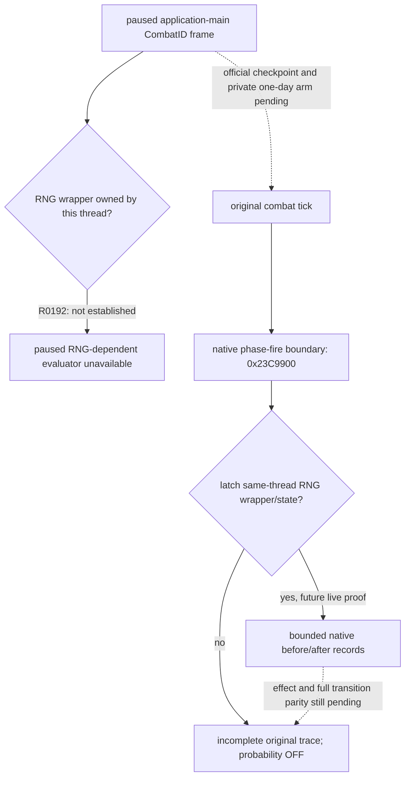
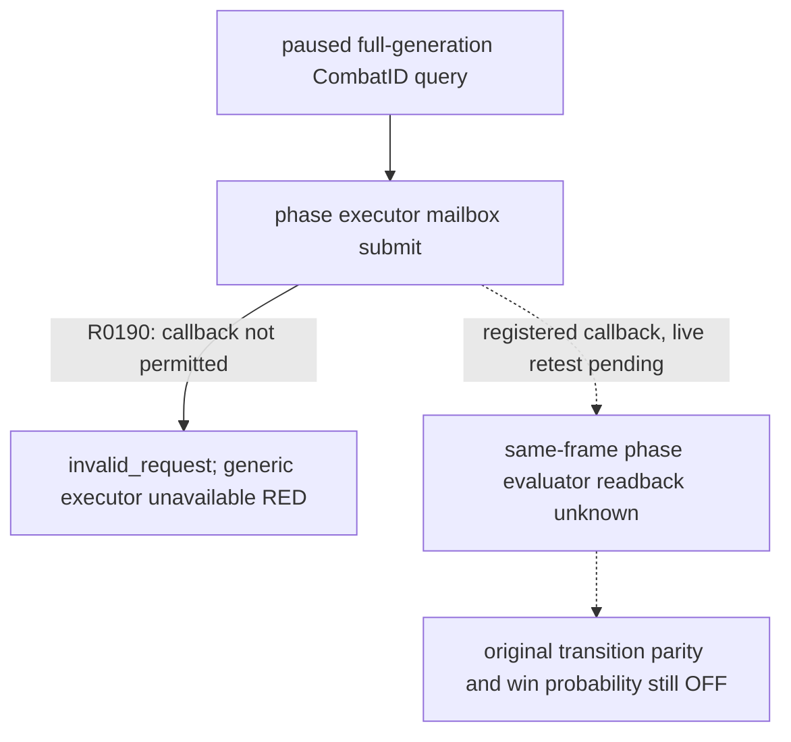
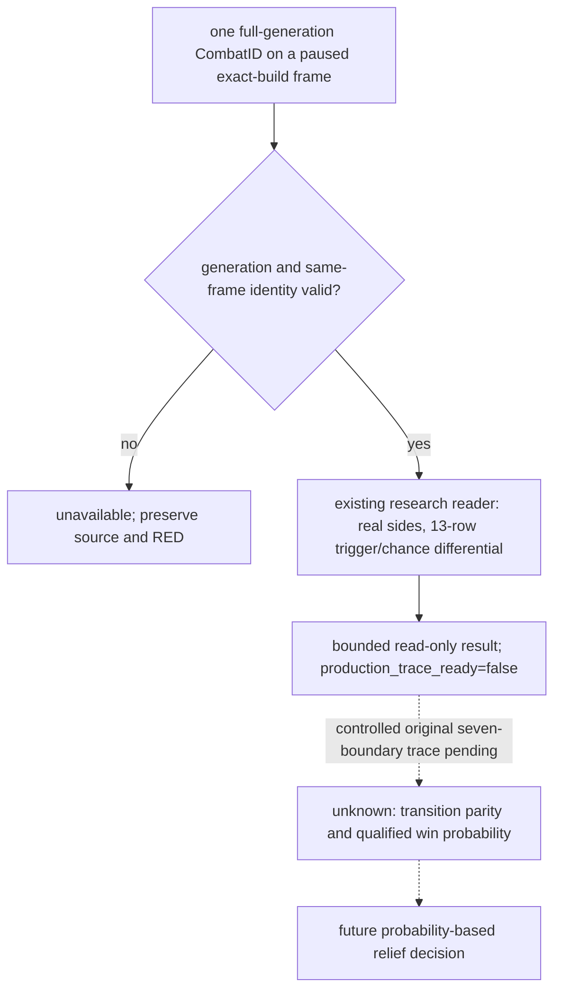
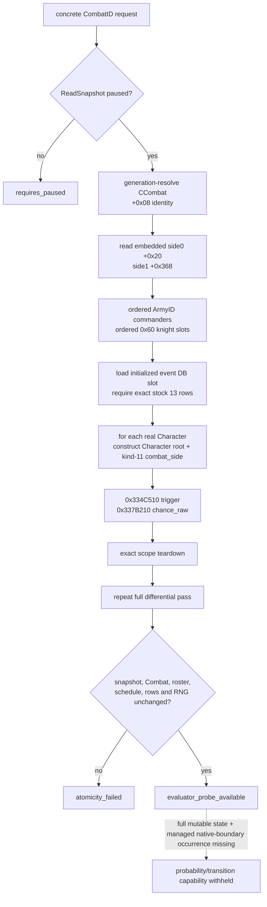
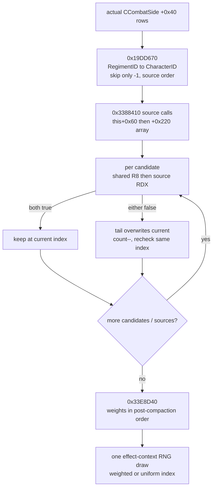
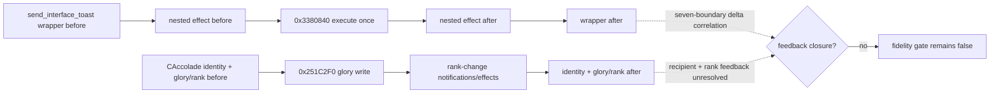
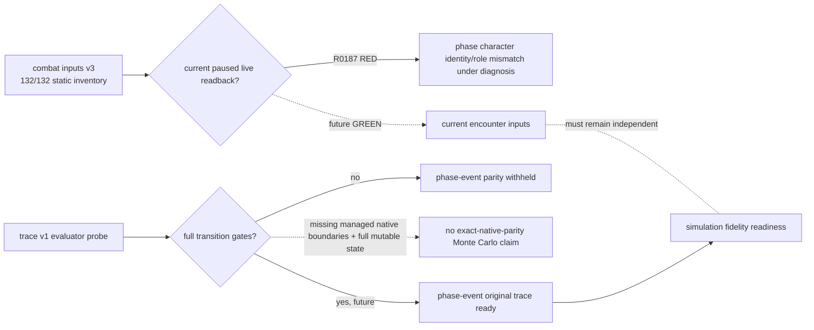
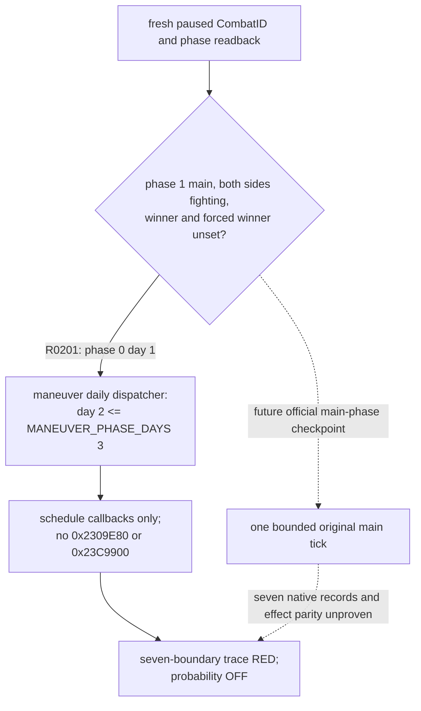
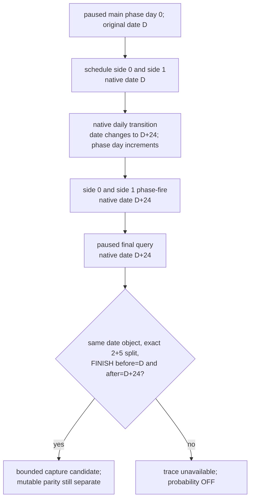

# ongoing combat phase-event trace v1

## 2026-09-25 第 26 日选中行实机回读

独立 Release 构建的七边界 attempt-017 将原生日程中的事件对象指针在暂停 arm 时与同进程已载入的 13 行表绑定；原生 tick hook 只记录身份，drain 后才序列化为 `native_event_load_index`。目标 `33437`／兵团 `65` 在边界 1–6 的索引均为 `11`，原版 manifest 对应 `knight_killed`。边界 4→5 追加击杀战报，边界 6 观察到死亡与退出；采集失败标志为 0。来源字节与桥接 DLL 见[选中行报告](../../ck3_autonomous_player/src/xar_autoplayer/simulation/data/ck3_1_19_0_6_episode01_messina_selected_phase_event_row.json)（SHA-256 `BEA95DDF36C0B8F1E5D4B6E01364BF8E35C3C3A7F676B10B038880A94CB5321D`）。这是该同源回放的事件行身份，不是内部随机抽签或全效果写集证明；整场胜率与智能体 planner 仍关闭。

该回放的两次 phase-fire 还隔离出原生全局 RNG counter `421195→421196→421197`。从原生 salt `3812344717` 及 exact-build 算法推导出 side 0/1 draw `753992024`／`816083018`，side 1 第一个骑士效果 seed `1111439774`；详见[draw 投影](../../ck3_autonomous_player/src/xar_autoplayer/simulation/data/ck3_1_19_0_6_episode01_messina_phase_fire_draw_projection.json)（SHA-256 `5EC7EE43064603B913305EEEF7403D8315C0BB7EC67BFD0AE7BAD01EB3BFC5AD`）。effect-local 抽签没有直接记录，不能与人工可达路径混同。

attempt-018 的研究钩子只在原生 phase-fire 同步调用期间，对与 13 行载入表匹配的 compiled effect root 读取 `node+0x38` hash 和 context RNG 前后 `counter/salt`；容量上限 64，失败标志进入同一七边界门禁。目标行 11 的[原生根节点回读](../../ck3_autonomous_player/src/xar_autoplayer/simulation/data/ck3_1_19_0_6_episode01_messina_effect_root_observation.json)（SHA-256 `D4C914DEAF00D827AF1DFD7AFE3E9374C72E5348307E50381944F3C37A735A00`）显示 `node_hash=3689483501`，RNG `2708350930→2708350931, salt=0`，与静态 seed 初始化一致。后续需在内部节点范围捕获实际选择 draw 与写回，当前报告不能被提升为胜率输入。

研究钩子的下一步已准备好 exact-build `0x33E8D40` 骑士候选索引选择入口：在同一 effect root 作用域内只读候选数、返回索引、选中候选的两词原始 token 及局部 RNG 前后状态，最多 64 条；Release 编译及五项离线 trace 测试通过。**这只是待实机验证的采集能力**，尚无原生运行回执，不能把选中项、draw 或写回写成已对拍结论。按用户当前安排，先制作已确认机制的视频，再继续此项研究。

## R0192 paused RNG scope and original tick boundary

- [production-live RED] R0192 used master `6240e7b` and an officially recovered copy of the old R0168 `h1251/raw53192304` battle. The fresh paused frame retained CombatID `738197508` and native revision `3`; the phase query was accepted but returned `evaluator_probe_ready=false`, `unavailable_reason=global_rng_state_unavailable`. It made no typed action or date advance and stopped under control. Immutable index: `Z:\ck3_mod_rewrite_process_assets\g2-r0168-phase-trace-R0192-global-rng-red-frozen-20260923\R0192-raw-freeze.json`, SHA-256 `87E0167EFB33A73C3BE12F7EB618531E37B26CF5B39FAE1B7C9F397041E9ED27`. The response does not distinguish a null slot, wrapper or state.
- [production-live + exact-build source] The pre-query mailbox observed application-main `owner_tid=153828` but global RNG `rng_owner_tid=156012`. This is a different scoped owner, not a valid combat RNG state for that paused application-main query. `ReadGlobalRng` currently requires `module+0x4FEB1C8 -> wrapper+0` to be non-null before evaluating rows. Existing mailbox admission deliberately excludes this diagnostic RNG owner. On frozen EXE SHA-256 `2D00FF3101EF70B566F2FCBAE292F09263199C80E9DC8F139B82D7D96F83DB86`, `0x356A0A0` loads that wrapper and checks the current thread ID before drawing; `0x23C9900` invokes it at the original phase fire. No paused, non-consuming, correctly owned RNG route is established by R0192.
- [implementation gap] The previous managed capture-plan builder required a non-null paused wrapper/state and the seven-boundary ring pinned those addresses before arming. This would reproduce the R0192 scope failure before original tick capture. This research patch arms without borrowing another thread's RNG. On an original hook, it latches the first state whose owner matches that hook thread; each non-null later state must match, while nullable schedule/final records remain explicit. Both phase-fire entry and exit require a valid state. If either is null, the trace remains incomplete; the next evidence point would be an original RNG-draw callback inside `0x23C9900`, not an assertion that the battle has no RNG. `production_trace_ready=false` and qualified win probability remain unavailable. One-day live capture still needs a fresh official checkpoint pair and its bounded no-launch gate.
- [exact-build source] `0x23C9900+0x57` calls RNG draw `0x356A0A0` before the function establishes any local RNG wrapper. Its caller invokes phase fire for both sides at `0x2309EF2/FA`. The draw checks the wrapper state's owner against the current thread. This supports a surrounding native tick scope, but does not prove the state is still visible after either phase-fire return; the DTO must report actual entry/exit reads.
- [research-only comparison] R0188 Robert h2127 v3 base input (friendly 2327, enemy 1488) fed the existing phase-events-disabled kernel with seed `0xC0319A06`, 4096 runs and horizon 120: 4096 wins, 0 losses, 0 unresolved. Artifact `Z:\ck3_mod_rewrite_process_assets\g2-robert-r0188-phase-disabled-research-20260923\R0188-research-only.json`, SHA-256 `1ED8B91F62808D54A5987CD88E9C6ED18DB296AAF577B3010239C2639BBA1555`. This kernel has `planner_usable=false`; the output is neither a qualified probability nor move authorization.
- [policy boundary] `strategy.py::_primary_defender_siege_relief_assessment` currently uses friendly headcount and base power each at least twice the hostile value as a conservative fallback for relief admission. This ratio is not a win probability. Once a same-frame, qualified simulation probability and risk contract are available, the relief decision must consume that result instead of letting this fallback override it. R0192 does not qualify such a result and this package does not change the active war strategy.

The default DLL remains read-only. A separate CMake option admits only the
research `experimental-combat-phase-event-trace-begin-v1` and `-finish-v1`
command pair through dedicated application-main mailbox permit slots 51/52.
The external bounded runner checks the official no-launch index and a fresh
battle-control CombatID before making a materialized checkpoint. Begin arms the
ring; exact-day map controls are the only steps admitted until finish drains
and removes detours. A short day, overshoot, missing hook, foreign-thread RNG,
or incomplete DTO stays RED and requires controlled stop. This is a single
research transition from a disposable official restore; it is not a gameplay
strategy, probability source, or authority to reuse the advanced research save.



## R0190 production mailbox RED（exact build 1.19.0.6）

- [production-live RED] R0190 从旧 R0168 `h1251/raw53192304` 的官方配对冷恢复，在新的暂停帧确认 CombatID `738197508`、`native_revision=3` 后，`query-combat-phase-event-trace-v1-738197508` 返回 `application-main combat phase-event executor is unavailable`。只读请求之前的 battle-control 成功；本轮 0 typed 动作、0 日期推进，受控停止且进程及 owner 均已回收。冻结索引：`Z:\ck3_mod_rewrite_process_assets\g2-r0168-phase-trace-R0190-native-executor-red-frozen-20260923\R0190-raw-freeze.json`，SHA-256 `B100DC51DB8C9EA62FDCBC833DD36B80520BF7DAE0DE3C0610A2AB55CC13E739`；原始 MCP 错误 SHA-256 `FBEDFAC34E5CAACE42042738FBF2D022CF44E4002A7173D40FA79F333478F262`。
- [source-confirmed] `bridge.cpp` 的 phase query 通过 `TrySubmitMainThreadQueryV1` 送 `ExecuteCombatPhaseEventTraceV1MailboxQuery`；同一文件的 `MainThreadQueryMailboxInstaller` 未将该 callback 加入固定许可槽。`main_thread_query_mailbox_v1.cpp` 在有许可槽且 callback 不匹配时返回 `invalid_request`，bridge 将所有非 `submitted` 结果折叠成上述通用错误。R0190 的 mailbox diagnostics 已显示安装、paused owner 与 submission readiness，故此缺失与真实故障吻合；底层 submit enum 未在 R0190 响应中单独暴露。
- [repair boundary] 只为此已存在的只读 executor 增加独立固定许可槽并做 mailbox 提交回归；不更改 CombatID 身份、paused 条件、reader、原生 effect 或胜率门。新 DLL 经同版本实机重新读回前，此 RED 保持未关闭。



## 结论与边界

本页冻结只读观测口 `query-combat-phase-event-trace-v1-{CombatID}` 的 exact-build
设计、native reader 与有界受管查询。它解决的不是 hypothetical pre-contact：请求必须携带 storage 中仍然存在的完整
generation `CombatID`，并且只在暂停帧读取真实 `CCombat`、两个 embedded `CCombatSide`、真实 Character root
与 kind-11 `scope:combat_side`。单帧 probe 与后续 managed before/after 七边界合同是两个独立 gate。

- [implementation-confirmed] DTO 与 paused reader 已分别落在
  [`combat_phase_event_trace_v1.hpp`](../../ck3_autonomous_player/native_bridge/include/xar_bridge/combat_phase_event_trace_v1.hpp)
  和
  [`combat_phase_event_trace_v1.cpp`](../../ck3_autonomous_player/native_bridge/src/combat_phase_event_trace_v1.cpp)。
- [implementation-confirmed] ABI ledger 是
  [`combat_phase_event_trace_v1_abi.json`](../../ck3_autonomous_player/native_bridge/research/combat_phase_event_trace_v1_abi.json)；
  offline source fixture 是
  [`combat_phase_event_trace_v1_source_contract.json`](../../ck3_autonomous_player/native_bridge/research/fixtures/combat_phase_event_trace_v1_source_contract.json)。
- [implementation-confirmed] 七边界固定宽度 capture transport 已落在
  [`combat_phase_event_trace_ring_v1.hpp`](../../ck3_autonomous_player/native_bridge/include/xar_bridge/combat_phase_event_trace_ring_v1.hpp)
  与
  [`combat_phase_event_trace_ring_v1.cpp`](../../ck3_autonomous_player/native_bridge/src/combat_phase_event_trace_ring_v1.cpp)；
  source contract 是
  [`combat_phase_event_trace_ring_v1_source_contract.json`](../../ck3_autonomous_player/native_bridge/research/fixtures/combat_phase_event_trace_ring_v1_source_contract.json)。
  当前完成的是无分配 capture ABI、原 helper wrapper、exact-build detour installer、受 900 KiB 上限约束的 drain wire serializer，
  以及离线七记录/delta/fail-closed 测试；detour 源码已编进 production DLL，但尚未由 paused managed driver 安装，也未广告 capability。
- [implementation-confirmed] 有界 paused `CombatID` evaluator 查询已接 bridge、driver、service 与 MCP，
  能返回 `evaluator_probe_available` 和直接的 13 行 trigger/chance differential。查询 capability 的广告
  只说明可以提出只读请求；`production_trace_ready=false`，仍不能作为 planner 的合格胜率输入。
- [static-confirmed] 当前 reader 不调用 `0x2E1C570` selector、`0x23C8750` schedule builder、
  `0x23C9900` fire、`0x3380310` effect executor、`0x356A0A0/0x356B770` RNG draw，也不调用会 lazy-init
  singleton 的 `0x23CEB10`。
- [static-confirmed] `random_side_knight` 的实际 materialize/filter/select 顺序已闭合为
  `ccombat_side_knight_source_then_tail_swap_remove_v1`；reader 只读它的 pre-limit source vector，不调用 selector。
- [implementation-confirmed] `CCombat+0x708` 对应 Battle-result 的 retained `BattleEvent` storage 已有 generation-safe
  纯读 reader；单帧只把它称为 generic battle ledger，不伪造 phase-event origin。
- [not-live-tested] 本项 evaluator 查询已通过静态编译与聚焦合同测试，尚无真实 paused CombatID
  的同版本读回；历史 CombatID 只能作为官方恢复后的候选。managed daily transition 更未通过实机。
  本包静态验证没有启动、注入、暂停、恢复或操作 CK3。

绑定版本仍是 CK3 `1.19.0.6`，`ck3.exe` SHA-256
`2D00FF3101EF70B566F2FCBAE292F09263199C80E9DC8F139B82D7D96F83DB86`。

## R0185 后的最小只读入口与历史实战来源

- [production-live read-only] R0185 在 `h2120/raw53215920` 的罗贝尔主线只确认了
  省 `2628` 的围城、路线、一天 contact horizon 和双方军力；没有发生接战，也没有
  `combat-simulation-inputs-v3` 的当前场景读回。人数、AI base power 和原版
  deterministic combat-prediction ratio 都不能填作胜率。
- [production-live read-only RED] R0187 从 R0186 加点后的 `h2127/raw53215920` 新 PID
  冷恢复，M4 HasPerk、援围 preview 与 h1 route 查询成功；随后 v3 假设接战输入在
  `production phase character identity or role mismatch` 校验处 RED。原始响应见
  `Z:\ck3_mod_rewrite_process_assets\g2-robert-r0186-combat-v3-readonly-R0187-20260923\combat-v3-inputs-mcp-result.json`
  （SHA-256 `5771D8FEDD3F212BA35A1624450FF68A07D3EB3FE02E7556EE5F44DF9240FE9E`）。
  这不影响此页独立的真实 CombatID evaluator 施工，也不把 v3 `132/132` 静态库存
  冒充 R0187 live 可用。
- [implementation-confirmed] 此页的 `ReadCombatPhaseEventTraceV1Probe` 已能在暂停帧对
  **真实、仍 generation-valid 的一个 CombatID** 读取双方 side、ordered participant、
  13 行 loaded event 的 trigger/chance differential、retained schedule 和 generic
  BattleEvent ledger。结果只证明 `evaluator_probe_ready`；它不调用 selector、effect
  或 RNG，不产生 Monte Carlo 分布。
- [historical source candidate] 旧 R0168 `h1251/raw53192304` 的同帧 battle-control
  查询曾观测 Army `83886367` 与敌 Army `50331863` 在省 `2638` 的
  CombatID `738197508`，maneuver day 1。历史 ID 仅用于定位独立研究 save；未来
  必须经官方配对冷恢复并在**新 paused 帧**重新验证该 CombatID 仍有效。不得把
  该历史战斗与 R0185 的将来省 `2628` 接战视为同一场战斗，也不得污染主线。
- [construction boundary] 首个接线只发布有界 paused one-CombatID evaluator 查询，
  返回当前同帧原始 differential 与缺失的 transition readers；
  `production_trace_ready=false`、`original_trace_ready=false` 和 qualified
  `win_probability=unavailable` 保持。受控 one-day 七边界 capture、15 类 effect
  feedback、模拟器 original-trace parity 和策略 admission 是后续独立门。





## 原生事件表与 differential

[static-confirmed] `0x23CEB10` 是 phase-event database getter；singleton 为空时它会构造数据库，因此只读查询
禁止调用它。reader 只加载已经初始化的 `module+0x57C7930`。数据库 `+0x68/+0x74` 是 event pointer data/count。
为了不把 mod-added row 悄悄排除在 selector 之外，本 v1 要求 loaded 表正好是冻结的 13 行、原 load order、稳定 key、
type 与 empty-effect flag 全匹配；否则返回 `event_table_mismatch`，而不是把 stock 13 行冒充完整 loaded selector。

每个 event 的 ABI 是：

| field | exact-build location |
|---|---|
| stable key | `event+0x18`，MSVC `std::string` |
| compiled trigger | inline object `event+0x38` |
| compiled chance | inline object `event+0x118` |
| compiled effect | inline object `event+0x178`，本查询绝不调用 |
| empty effect | `event+0x1C4 == 0` |
| event type | `event+0x1D8`：commander `0`，knight `1` |

[implementation-confirmed] 对每个观测到的 Character，DTO 固定发布全部 13 行：`trigger_valid`、signed Q100000
`chance_raw`、signed `/100000` 向零截断后的 `int_weight`。此外明确保留：

- `selector_role_applicable`：该 Character 是当前 side selected commander，或是 ordered knight；
- `selector_would_evaluate_chance`：原 selector 的 type/trigger short-circuit 是否会走到 chance；
- `chance_evaluated_for_differential`：为了逐行对拍，本 probe 即使在原 selector 会 short-circuit 时仍纯读求值；
- `selector_eligible`：role applicable、trigger true 且 weight positive 同时成立。

因此 differential 的“某 invalid row 仍有 chance_raw”不会被误读成原 selector 实际消费了该 row；reader 本身不做
weighted selection，也不消费 selection draw。

## 真实 kind-11 combat_side scope

[static-confirmed] selector `0x2E1C570` 的 scope 构造已逐指令复刻：

1. 在 query-owned、16-byte aligned 的 `0x168` byte storage 调 `0x81F190(scope)`；
2. root 写 kind `4`，`scope+0x08` 写 zero-extended full CharacterID；
3. 从 `side+0xB8` 取真实 parent `CCombat*`，并要求它仍等于请求解析到的 Combat；
4. named token 写 kind `11`，subtype 为 side0 `0` / side1 `1`，payload 为 sign-extended `CCombat+0x08`
   CombatID；
5. 从 `module+0x57EB630` 读取 exact `combat_side` key ID，调用
   `0x3358160(scope+0x18,key_id,&token)`；
6. 对同一个 scope 的 13 行分别调用 `0x334C510(event+0x38,scope)` 与
   `0x337B210(event+0x118,&raw,scope)`。

清理必须按 selector 的原顺序，不能把 query-owned native allocation 留给 CK3：

1. `0x81E900(scope+0x118)`；该 helper 内部先清 `+0x30` 的 `0x48`-stride rows，再清 `+0x10` 的
   `0x20`-stride rows；
2. `scope+0x100` 有 data 时先 `0x81E980(scope+0x100)`，再用 `scope+0x110` allocator 的 vtable
   `+0x10(allocator,data,8)` 释放并清 data/capacity/count；
3. `scope+0x18` named rows 是 selector 原版的 trivial-row teardown：不调 element destructor，直接用
   `scope+0x28` allocator 的同一 deallocator 释放并清字段。

任一 scope 未完整 teardown 都返回 `scope_teardown_failed`；它不能被降级成一行 unknown。

## `random_side_knight` 的真实 candidate 顺序

[static-confirmed] RTTI 将目标类钉死为
`CScriptedListEffect<CRandomInScriptedListEffect,CCombatSideKnightListBuilder>`，vtable RVA `0x41DE5C0`。
`vtable+0xD0 -> 0x19F4880` 从已解析的 `CCombatSide+0x4C` 读上界；`vtable+0xD8 -> 0x19F4760`
负责 materialize 与 limit；`vtable+0xE0/+0xE8 -> 0x33E87E0/0x33E8890` 进入选择与 effect 路径。

`0x19DD670` 的 source materializer 先经 `0x2011090` 把 scope token 解析成**实际** `CCombatSide`，随后严格按
`side+0x40/+0x4C`、stride `0x60` 枚举。每行 `+0x08` 是 RegimentID，经
`module+0x57BF4C8` store（fallback `module+0x57BF4C0`）、`CRegiment+0x10` generation identity 后读取
`CRegiment+0x148` CharacterID；只跳过 `-1`，不做 alive filter，并按该 stored order append kind-4 target。

两层 predicate 的 receiver 与次序也已逐指令闭合：

1. `0x3388410(this,effect_context,out_vector)` 首先以 source predicate `this+0x60` 调一次 vtable `+0xD8`；
2. 再按 `this+0x220` pointer array、`this+0x22C` count 为每个额外 source predicate 重复调用；
3. 每次 `0x19F4760` 收到 `RCX=this`、`RDX=本次 source predicate`、`R8=this+0x140` shared predicate、
   `R9=effect_context`，stack argument 是同一个 output vector；
4. 某 candidate 需要过滤时，`0x334C600` 固定先求 R8 shared predicate，再求 RDX source predicate；空 trigger
   按 true。任一为 false 都不是 stable erase：把**当前尾项覆盖失败项**、count/end 减一，并在同一 index 重试。

因此 post-limit order 是 deterministic tail-swap-remove 的结果，不能把 source list 做 stable filter。随后
`0x33E8D40` 按这个当前 vector order 调 `0x337B310` 求 candidate weight。signed Q100000 weight 先向零除
`100000`，仅正数且有余数时再 `+1`，然后存 low int32；每行包括 zero/negative 都不 clamp、不跳过，signed total
以 int32 two's-complement wrap 累加。positive total 时一次 effect-context draw 后做 `draw31 % total`，再按序做
signed subtract（负 weight 会增大 remainder），首次为负即选中；遍历无命中回退 index `0`。total `<=0` 或无
weight expression 时也消费一次 draw，再做 `draw31 % candidate_count`。



[implementation-confirmed] trace-v1 的 `ordered_knight_character_ids` 直接来自这个 pre-limit `CCombatSide` vector。
production combat-inputs v3 也已改为从 stock `0x23C9100` 构造出的 query-owned local `CCombatSide` 直接重读两侧
commander/knight source rows，并在 available 前把每一行
`role/source_army_id/source_regiment_id/character_id` 与 v3 raw expectation **逐项相等**；另外发布包含 side index 的
uppercase SHA-256 sequence digest，helper 全部结束后再重读一次 native vector。digest 不能代替逐项 gate。
因此 native `combat_inputs_v3_source_vector_equivalence_ready=true`；Python AST admission 仍必须实际消费并验证同一个
`candidate_source_proof` 后才可把 materialization-input gate 置 true，不能仅凭本页声明。

offline source fixture 另冻结四个 executable vector：interior reject 后 `[101,102,103,104] -> [101,104,103]`、shared
predicate false 时不求 source predicate、`[2,-1,2]` 不 clamp 的 weighted selection，以及 signed total `0` 时的 uniform
fallback。C++ source-contract test 会实际重放这些 vector，不只搜索文档字面量。

## Combat、roster 与 mutable core

[static-confirmed] live core 读取：`CCombat+0x6B0/+0x6B4/+0x6E0` 分别是 phase、phase day、winner；phase
枚举 `0/1/2/3` 对应 maneuver/main/pursuit/done，winner `-1` 未定、`0/1` 是 winner side。

两侧 roster 保留原容器顺序：

- commander：`side+0x10/+0x1C` 的 CArmyID array，generation-resolve CArmy 后读 `+0x120` CharacterID；
- knight：`side+0x40/+0x4C`、stride `0x60` 的 row，row `+0x08` 是 CRegimentID，resolve 后读
  `CRegiment+0x148` CharacterID；
- selected commander：`side+0x74`；
- 每个 CArmy 还必须以 `+0x128` CombatID 回指当前 Combat，每个 side 必须以 `+0xB8` 回指当前 Combat。

合法“无 commander / 当前 regiment 已无 knight”用 `{present:false}` tagged ID 表示，不使用 JSON null 或伪造 `-1`
当真实 CharacterID。当前 mutable core 已读并在第二遍重验：Character generation identity、native-valid、death marker、
alive、martial/learning/prowess、current regiment 与 `CRegiment+0x148` back-reference。

这还不是 effect transition 所需的完整 mutable bundle。production gate 明确要求继续接入：wounded rank、
one-legged/disfigured/one-eyed/maimed/incapable/berserker、blademaster XP/rank、accolade progress、13 个 attribute
unlock variables，以及 participant detach/membership。现阶段 DTO 把
`transition_state_complete=false` 和对应 `missing_production_readers` 写实，不用一串 null 冒充已经观测。

## effect wrapper 与 glory feedback 账本

[static-confirmed] `send_interface_toast` 的 ASCII key 在 `module+0x4439F90`，注册 xref `0x5C3831` 构造
`CEffectEntry<CSendInterfaceMessageEffect<1>>`，effect vtable 是 `module+0x443A420`；payload class vtable 是
`module+0x443A518`，execute slot `+0xB0 -> 0x2E7A4B0`。`0x2E7A9A1..0x2E7A9EE` 在建立消息局部 scope/RNG 后，
经对象 vtable `+0x58` 调 `0x3380840` **恰一次**执行 nested effect，随后才继续消息容器处理。它提供了 wrapper-before、
inner-before/after、wrapper-after 四个可施工边界；但在七记录 native delta 证明前，不能先断言 toast 除 inner effect 外
不写 combat state，也不能据此提高 feedback gate。

[static-confirmed] `CAddGloryEffect` execute `0x2E5B6F0` 通过 `0x9698B0` 求 signed Q100000 delta，解析 kind
`0x24` CAccolade（store `module+0x57BF1E0`、fallback `module+0x57BF198`、identity `CAccolade+0x08`），然后
tail-jump `0x251C2F0(CAccolade*, int64 delta_raw)`。后者在写入前后调用 rank helper `0x251B780`；正 delta 先乘
`100000 + owner modifier enum 0x238`（含原生 fixed-point overflow branch），再写 `CAccolade+0xB0`，负结果 clamp 为
0。`0x251B780` 对 `module+0x4F62B98/+0x4F62BA4` 的全局 threshold vector descending 匹配：低于全部返回 1，
否则返回最高命中 index+1。rank change 后续从 `0x251C724` 进入通知与 scripted-effect 路径。

因此 ring 已新增 typed before/after row：arm 从 v3 participant 的非 null full AccoladeID 出发，generation-resolve 后按
ID 排序，并冻结 owner、`CCharacter+0x1A8 -> link+0x568` acclaimed-knight 关联；同时复制
`module+0x4F62B98/+0x4F62BA4` threshold data/count。hook 每个边界重验对象、participant link 和全部 threshold，直读
`CAccolade+0xB0 glory_raw`，在 ring 内镜像 `0x251B780` descending scan，绝不调 rank helper。
这使 `typed_accolade_glory_rank_reader_ready=true`，但 event scope 实际选择的 recipient AccoladeID 与该 row 的归因、
`lifetime_glory` on_action 以及 rank-change event/memory feedback 尚未闭合；ring 仍明确保持
`full_mutable_transition_bundle_complete=false`。



## 五日 cadence 与 global RNG

[static-confirmed] schedule builder `0x23C8750` 从 `module+0x570E068 -> object+0x08` 读 date raw，计算：

```text
day_index = signed(date_raw - 0x029C55A8) / 24, truncation toward zero
due = uint32(CharacterID + day_index) % *(uint32*)(module+0x570EF9C) == 0
```

本 build 的 `COMBAT_EVENT_DAYS` 必须实读为 `5`；不是把 5 写成永远正确的 schema 常量。phase event fire 只在 main
tick，side order 固定 `0 -> 1`；每次 `0x23C9900(side)` 在入口无条件消费一个 global RNG draw，所以 phase-event
fire 本身每个 main tick 固定贡献两个 draw。

[static-confirmed] `0x356A0A0` 使用 `module+0x4FEB1C8` 的 thread wrapper；`*(void**)wrapper` 是 state，
`state+0x08/+0x0C/+0x10` 是 uint32 counter/salt/owner-thread token。probe 只读这些字段并离线计算下一值：

```text
x = salt - counter * 0x4AD685B3          // uint32 wrap
x ^= x >> 8
x += 0x68E31DA4
x ^= x << 8
x *= 0x1B56C4E9
x ^= x >> 8
x *= 0x92D68CA2
x ^= x >> 8
next_draw31 = x & 0x7fffffff
```

它不调 RNG。两遍 evaluator 前后 wrapper/state identity、counter、salt、owner token 与派生 next draw 必须全等；
否则整帧 `atomicity_failed`。

## retained schedule 与 retained BattleEvent 都不单独等于 phase occurrence

[static-confirmed] knight scheduled rows 位于 `side+0xD8/+0xE4`，stride `0x10`，内容是
`{event*, CRegimentID}`；commander pointer 位于 `side+0xF0`。`commander_none/knight_none` 的 empty effect 会被
selector 投影成 `module+0x57C7940` sentinel。更关键的是，`0x23C9900` fire 之后**不清空**这些容器；下一次
`0x23C8750` 才覆盖/清 count。

因此单个 paused snapshot 只能说“这是 retained non-empty schedule row”，不能诚实地说它仍 pending 或已经 occurred。
本 reader 的每行固定 `lifecycle_state=retained_row_occurrence_requires_managed_before_after`，而不是猜一个布尔值。

[static-confirmed + implementation-confirmed] `CBattleEventEffect` 的 vtable 是 `module+0x444F498`，execute
`0x2EB4330` 从真实 side 反查 parent Combat，取 `CCombat+0x708` 的 full-generation Battle-result ID，经
`module+0x57C0328` storage（fallback `module+0x57C0320`）解析对象，最终调用
`0x130A660(battle_result+0x188,row)` append。trace reader 只复制既有 rows，绝不调用 effect 或 append helper。

| retained BattleEvent field | exact-build location |
|---|---|
| container | Battle result `+0x188`：data `+0`、capacity `+8`、count `+0xC`、allocator `+0x10` |
| row identity | stride `0x38`；vtable `module+0x41461A0` |
| portraits | left/right CharacterID `+0x08/+0x0C`，非 `-1` 时逐个 generation-resolve |
| stable key | row `+0x10` MSVC `std::string` |
| outcome | signed `type_raw` at `+0x30`；pursuit 下 effect 会把 native type `3` 投影为 retained `4` |
| side/target | side0 bool `+0x34`，target_right bool `+0x35` |

这个 reader 已闭合 Battle-result/CharacterID association，并在 evaluator 第二遍要求整份 retained ledger 不变；所以它是
单帧已有战报的有效观测口。不过 storage 会同时容纳非 phase-event 产生的 battle rows，单行没有原生 provenance tag。
因此每行固定 `phase_event_origin=unclassified_without_managed_boundary_delta`：需要受管原生边界前后的 append delta 与
schedule/root 对拍后，才能归因到某个 13-row phase event。

```mermaid
sequenceDiagram
    participant B as managed trace driver
    participant Q as query-owned capture ring
    participant S0 as CCombatSide 0
    participant S1 as CCombatSide 1
    participant R as read-only trace reader
    B->>Q: 0x27FB58F before side0 schedule
    B->>S0: 0x23C8750 schedule side0
    B->>S1: 0x23C8750 schedule side1
    B->>Q: 0x27FB5AC after side1 schedule
    B->>S0: 0x23CA2F0 refresh side0
    S0->>Q: 0x23C9900 entry, return site 0x2309EF7
    S0-->>Q: 0x2309EF7 after side0 fire
    B->>S1: 0x23CA2F0 refresh side1
    S1->>Q: 0x23C9900 entry, return site 0x2309EFF
    S1-->>Q: 0x2309EFF after side1 fire
    B->>R: paused_next_day_stable_query
    Q-->>R: six native-boundary records for the same Combat/day token
    R-->>B: compare schedule/local RNG/global RNG/BattleEvent/mutable state/membership/strength
    Note over Q: bounded copies only; never pause or re-enter bridge on the CK3 call stack
    Note over R: only this seven-record chain may label occurred/no-op/pending
```

这七个 record 名称已经冻结成 `native_daily_phase_event_boundaries_v1` contract；前六个是 native call-boundary capture，
只有最后一个是正常 paused query。排程与 fire 并不在同一个函数里：[static-confirmed] `0x27FB4D0` 按 manager stored
CombatID order 调 side0 `0x27FB58F -> 0x23C8750`、side1 `0x27FB5A7 -> 0x23C8750`，而 `0x27FB5AC`
仍在同一 Combat 迭代、尚未推进 iterator；相邻 daily dispatcher `0x27FB5D0` 之后才在 `0x27FB683/0x27FB6A2`
更新两侧、`0x27FB6C6` 递增 phase day，并于 `0x27FB6FD` 调 `0x2309E80`。

[static-confirmed] `0x2309E80` 先在 `0x2309E92/0x2309EA1` 用 `0x23CB840` 汇总双方 total，再从
`0x2309EF2/0x2309EFA` 分别进入 `0x23CA2F0`。后者先 `0x23CBC20` refresh、维护 participant rows，最后
tail-call `0x23C9900`。因此真正能隔离 effect 的 before 点是 `0x23C9900` 入口：实际 side pointer 加返回地址
`0x2309EF7` 唯一标识 side0，加返回地址 `0x2309EFF` 唯一标识 side1；两个返回点分别位于 side1 refresh 前和
commander rolls 前。只在 `0x2309EF2` 前取样会把 refresh 与 effect 混进同一个 delta，不能作为 effect parity 证据。

hook 必须只向预分配的 query-owned ring buffer 做有界只读复制并立即返回；严禁在 CK3 调用栈内暂停游戏、调用
`ReadSnapshot`、走 CK3 allocator，或重入 bridge/service。七个 record 必须以同一 full-generation CombatID、loaded
phase-event table、native date 和 managed daily sequence token 关联；phase day 的预期递增要逐点记录，不能错误要求它
全程相等。对拍域包括 retained schedule、schedule-local RNG state/counter、BattleEvent、global RNG、full mutable
character state、participant membership、side strength 和 advantage。

[implementation-confirmed] 当前 ring source 已实现以下**不等于生产完成**的部分：

- `0x23C8750` wrapper 以原 caller return address 识别 side0 `0x27FB594` / side1 `0x27FB5AC`；side0 调原 helper
  前复制第一条，side1 原 helper 返回后复制第二条。`RDX` 指向的两个 uint32 暂按 `opaque word0/word1` 原样复制，
  不提前猜 native 类型名；
- `0x23CA2F0` 尾跳保持 `0x2309EF7/0x2309EFF`，所以 `0x23C9900` wrapper 能以实际 side pointer + return site
  唯一识别两侧，并在 exact original trampoline 前后各复制一条；
- paused managed reader 必须在 arm 前提供 Combat/side/date/event table/global RNG/Battle result identity，以及按 full ID
  严格升序的 Army/Regiment/Character pointer map。hook 只做有界 binary search 和 generation revalidation，不访问
  component store；
- 每个 record 有界复制 roster/membership、retained schedule、BattleEvent（key 最大 128 bytes，超出整环失败）、
  Character core、participant Accolade glory/rank、side `+0x98/+0xA0`、Combat advantage/rolls、local/global RNG。任何 reentry、乱序、identity replacement、
  memory fault、容器不一致或容量超限都原子 fail closed，绝不截断；
- 离线 fixture 已重放七记录 delta，并覆盖乱序、CombatID 变化和容量溢出；source scan 禁止 heap、`ReadSnapshot`、
  RNG draw、trigger/value evaluator 与 bridge/service token。

exact-build detour installer 已实现并编进 production DLL：它逐字节验证 `0x23C8750` / `0x23C9900` 的 15-byte 完整指令
prologue、四个原 caller 和 `0x23CA34E` tail-jump，随后用 14-byte absolute jump 加一个 NOP 改写入口；原 15 bytes
复制到 29-byte RX trampoline 后跳回 `entry+15`。安装和卸载只允许在 application-main paused-quiescence 证明成立、
且 ring 未 armed 时执行；任一目标失败会恢复成成对状态，不留下半安装/半卸载入口。它不会自行 arm ring、恢复游戏或广告查询。

drain wire serializer 同样已落地：它序列化七条边界中的稳定 ID、RNG、roster/schedule、character core、BattleEvent、
accolade glory/rank 和 readiness gate；不会发布可复用的 native object/code address。schedule event pointer 只作为
`process-local-0x...` opaque correlation token，且 fragment 超过 900 KiB 时在进入 1 MiB bridge frame 前 fail closed。

application-main typed begin/finish executor、full-generation capture-plan builder 与 managed checkpoint DTO 已落地并编进
production DLL。begin 只在已验证 paused mailbox slot 上、且外部已创建 recoverable checkpoint 时安装 detour 并 arm；
finish 要求同 token、同 application-main thread、`after.date_raw=before.date_raw+24`，随后 capture 第七条、drain 并卸载
detour。两者本身都不改变速度或推进日期；离线 fixture 已闭合 before/after checkpoint、七记录、wire 与卸载恢复。

尚未实现的是 one-day trace 的共享 mailbox typed union dispatch、bridge/service/MCP 接线、外部可恢复 one-day driver 和 paused live 同
Combat fixture；完整 trait/track/variable/accolade mutable bundle 也仍缺。因此 ring 可令
`bounded_ring_source_ready/detour_installer_ready/bounded_wire_serializer_ready/capture_plan_builder_ready/typed_begin_finish_executor_ready=true`；
`same_combat_live_fixture_ready/full_mutable_transition_bundle_ready/production_trace_ready` 仍为 false。
UI date 轮询仍不能提供六个中间点 provenance，generic BattleEvent reader 也不解除该门；
合格胜率与 transition parity 继续不广告。

## readiness 与现有 132/132 observation 的分离

phase-event trace 的 fidelity gate 与 combat-simulation-inputs v3 `132/132` **静态字段库存**
是两个独立结论。R0187 当前场景的 v3 live 查询仍 RED；前者将用于 Monte Carlo 的
original-transition parity，后者在修复实机字段错配后才能声称当前帧确定性输入可用。



生产广告的必要条件是：

1. live paused CombatID fixture 通过两遍 `0x334C510/0x337B210` differential、真实 side scope 与完整 teardown；
2. retained schedule、date cadence、RNG state/counter 在同帧对拍；
3. full mutable state bundle 完成且无长期 null；
4. 已闭合的 generic BattleEvent storage/identity reader，加上受管逐日 native-boundary delta，能区分 no-op、实际 effect、
   跳过、phase origin 和关联角色；
5. side0 effect 后、side1 refresh/effect 后的 participant/strength/advantage recompute original trace 通过；
6. capability、concrete request parser、serializer、driver cache、service 与 MCP fail-closed 接线完成；capability template 本身
   永远不得成为 concrete action step，generic fallback 也不得把查询前缀转成 life-advance。

## R0198 bounded trace timeline RED (2026-09-23)

The exact CK3 build 1.19.0.6-steam23530548, original R0168 h1251 pair,
Python commit 949c8b7, and separately pinned native DLL A0A32609...AA3AD4
reached a playable paused frame. Same-CombatID 738197508 battle-control readback
and same-day checkpoint h1255 succeeded. Map commands h1257 resume-map and
h1258 pause-map returned submitted acknowledgements. Only h1259 yielded an
independent paused=true postcondition, with date still raw 53192304. No exact
one-day original trace was proven. The immutable R0198 raw-freeze index has
SHA-256 93F8B84E3DCB3779754A629AF83BBB5A0DEFDD0B4F03AA385227E1A1EBDA0CF9.

The bounded research runner treated an old paused frame immediately after the
resume acknowledgement as a stop condition, then required a paused frame
immediately after the pause acknowledgement. Its focused fix waits for an
actual same-episode running frame, the first date change, and an actual paused
postcondition. Missing or overshooting the one-day boundary remains RED and
requires controlled stop. The native driver already has asynchronous map-control
postcondition waiting for its formal life-advance path. R0200 replayed this
runner fix from a new official R0168 h1251 pair; production trace, win
probability, and formal war actions remain OFF.

## R0200 bounded trace result is RED (2026-09-23)

R0200 used Python commit 68e11c3 and the separately pinned native DLL from
3e5e92f on exact CK3 build 1.19.0.6-steam23530548. It reached the playable
paused frame, proved the post-ready application-main pump, read the same
CombatID 738197508, and saved a same-day research checkpoint at history 1255.
The derived driver records one set-speed request, one resume-map request, and
one pause-map request at histories 1256–1258. The bounded runner then raised
`original trace did not produce one exact bounded day`; controlled stop
reclaimed CK3 and its owner. The immutable R0200 freeze index SHA-256 is
81DC6B4BDD6B435B3AD66328C86C6339FBDC027D42B1DD69AE6A293C8FCAB34A.

The runner discarded its ending raw date and full private finish response at
the failure branch. Thus R0200 does not prove whether the observed day was
short, overshot, or whether native finish rejected an exact day. The next
bounded research run records those two observations before the same RED
decision. This diagnostic does not change the one-day limit or submit another
map-control command. Original transition fidelity and production probability
remain unproven.

## R0201 maneuver-stage admission RED (2026-09-23)

R0201 used a fresh official copy of the original R0168 h1251 pair, Python
commit 4e6a7fb, and the separately pinned native DLL from 3e5e92f on exact
CK3 build 1.19.0.6-steam23530548 (EXE SHA-256
2D00FF3101EF70B566F2FCBAE292F09263199C80E9DC8F139B82D7D96F83DB86).
The terminal receipt proves exactly one date increment,
53192304 → 53192328, and an accepted native FINISH. It also proves only two
successful schedule records, no phase-fire record, `failure_flags=1032`
(`sequence` 8 + `final_query` 1024), `record_count=2`, and
`production_trace_ready=false`. Controlled stop reclaimed CK3 and its owner.
The immutable freeze index is
`Z:\ck3_mod_rewrite_process_assets\g2-r0168-managed-day-R0201-two-boundary-red-frozen-20260923\R0201-final-frozen-pair\R0201-raw-freeze.json`,
SHA-256 `50A30CC84B614F4DD7BF984618F6E4B893F07CF53831506E360589FA192F60E8`;
the terminal receipt SHA-256 is
`B67C1E3C9766F63A33F1E94BE44C478B7CC988ED4D07E5C4B3C57691A5DAB843`.
This is research RED, not a Robert-mainline date or qualified battle forecast.

The fresh battle-control and both schedule records bind CombatID 738197508
to `phase_raw=0` (maneuver), `phase_day=1`, with no winner or forced winner.
The exact-build dispatcher `0x27FB5D0` increments `CCombat+0x6B4`; while
phase is 0 and `CCombat+0x700=-1`, it compares the new day with
`MANEUVER_PHASE_DAYS=3` at `0x27FB704`. An increment from day 1 to day 2
does not call main tick `0x2309E80`; only that tick calls `0x23CA2F0`, which
tail-jumps to phase fire `0x23C9900`. Thus an otherwise complete first day
cannot produce the four fire boundaries. The two observed schedule callbacks
and successful transactional uninstall rule out a failed initial detour
installation as the explanation. The terminal DTO does not independently
prove whether the pause occurred before or after that day's dispatcher, but
either order leaves this maneuver-stage frame ineligible for a seven-boundary
one-day capture. The final query then encounters boundary index 2 rather than
6 and correctly fails its sequence gate; it must not relabel schedule records
as phase-fire records.



For the original h1251 `phase 0/day 1` battle, three **completed and
independently observed** daily dispatches would nominally give maneuver day 2,
day 3, then main phase day 0. A date change alone is insufficient evidence of
completed dispatch. A separate research preparation run may use existing
managed map-control primitives for at most three individual +24 raw-day
windows; after each it must read the same CombatID, actor, episode, phase/day,
winner/forced winner, both sides' fighting totals, and active-event signal.
An unexpected phase, missing identity, event, date overshoot, or winner stops
the run without another day. Only a fresh paused main-phase frame may receive
a materialized official checkpoint and later **separate** cold-restored
seven-boundary attempt. The R0201 derived state is not that source pair.

## R0203 main-phase checkpoint and R0204 native date split (2026-09-23)

[production-live] R0203 restored the immutable R0168 h1251 pair and advanced
three individually observed +24 raw-day windows, with the same actor, episode,
and CombatID `738197508`. The paused battle-control phases were maneuver
day 2, maneuver day 3, then main day 0. The official checkpoint at raw
`53192376` has save SHA-256
`05117EBB6694978D7F29E2F9E1DE6150902BC33482137FF88CF33C149554CA75`
and driver SHA-256
`5882893DF2BC14AB15584BA229D3812573789526178A28F1D61BCAE36898E661`;
its 1267-command history ends at that save, with no pending action. The
immutable pair index is
`Z:\ck3_mod_rewrite_process_assets\g2-r0168-mainphase-R0203-green-frozen-20260923\R0203-final-frozen-pair\R0203-raw-freeze.json`
(SHA-256 `0C37965DB22665552419B4B42719B34549BA7CC763920C702CB2E2E6588C10CD`).
This is a research checkpoint, not a Robert mainline war result.

[production-live] R0204 officially cold-restored a new candidate from that
pair. A fresh paused battle-control query admitted the same undecided
main-phase combat, and the managed one-day trace reached raw `53192400`.
BEGIN/FINISH and controlled stop succeeded; the original seven capture
records all have CombatID `738197508`, exact boundary order, and
`capture_failure_flags=0`. Their **unmodified** native date and phase labels
are:

| Boundaries | Native date | Phase/day |
| --- | ---: | --- |
| before side 0 schedule, after side 1 schedule | `53192376` | main/0 |
| four side 0/1 fire boundaries, paused final query | `53192400` | main/1 |

The frozen RED index is
`Z:\ck3_mod_rewrite_process_assets\g2-r0204-phase1-trace-date-red-frozen-20260923\R0204-final-frozen-pair\R0204-raw-freeze.json`
(SHA-256 `1DC8549065B0739B4CDAA26634B02CCE2B4D9449F7BB573A9DDF17781B1BF29A`).
The old ring demanded one equal date across all seven records, so
`same_native_date=false` made `bounded_capture_complete=false` despite the
seven original boundaries. `full_mutable_transition_bundle_complete=false`
also remains a separate production parity gap.

[static-confirmed] On the frozen 1.19.0.6 EXE SHA-256
`2D00FF3101EF70B566F2FCBAE292F09263199C80E9DC8F139B82D7D96F83DB86`,
`0x27FB4D0` calls the two schedule helpers at `0x27FB58F/0x27FB5A7`.
The distinct `0x27FB5D0` daily dispatcher increments `CCombat+0x6B4`
at `0x27FB6C6` and, in main phase, calls `0x2309E80` at `0x27FB6FD`;
the main tick reaches side fire `0x23C9900`. The ring reads
`module+0x570E068 -> date object+0x08` independently at every boundary,
verifies the same date object against its capture plan, and reported zero
capture failures in R0204. The exact global date writer between these
independent manager calls has not been statically located; the captured
old-date schedule and next-date fire order is direct live evidence, not a
synthetic DTO label.



The minimum corrected readiness compares the first two raw dates with
FINISH's before date and the remaining five with its after date, requiring
exactly +24 and the same date-object identity. Preserve
`same_native_date=false` as a diagnostic of the old all-equal predicate;
do not rewrite the seven records. This gate only admits a bounded **research**
capture. The full mutable transition bundle, effect parity, and production
win probability remain unavailable.

## R0215 empty-effect original main tick (2026-09-24)

[production-live, read-only] R0215 independently cold-restored the original
R0203 pair and captured the same CombatID `738197508` through seven native
boundaries, raw date `53192376 -> 53192400`. The immutable
[live freeze](Z:/ck3_mod_rewrite_process_assets/g2-combat-outgoing-r0203-f022-research-on-no-launch-20260923/checks/R0215-LIVE-FREEZE.json)
has SHA-256 `577A65146231BB10C1CEA261CBAB2A9AD1E998FFD06735039A7A6542E8DB6075`;
the bounded original tick JSON has SHA-256
`FED232DE6304FB447DE9FC502CFAFF40E1C9C6FA5D1948C834055F45E21B488E`.
The [focused evidence index](Z:/ck3_mod_rewrite_process_assets/g2-combat-phase-empty-r0215-20260924/R0215-EMPTY-EFFECT-INDEX.json)
has SHA-256 `269E65AC6F205E8A6556D57CFC6CE797C2E7E6FCFA64AEF1CD9E8518A447C0CD`.

At the schedule boundary, exact-build
`day_index = (53192376 - 0x029C55A8) / 24 = 391350`; the four due knights, in stored side order,
were CharacterIDs `43550`, `33435`, `32440`, `43700`. Neither commander was
due. The schedule-local RNG word advanced `656603130 -> 656603134`, while
both sides retained zero executable scheduled knight rows. Side 0 fire then
advanced the global RNG counter `1901999 -> 1902000`; side 1 advanced it
`1902000 -> 1902001`. Across each fire boundary, the captured side records,
17 character cores, zero BattleEvent rows, and zero accolade rows were
field-for-field equal. This establishes an **empty-effect tick in the captured
domains** and confirms that each side fire still consumes one global draw.

No nonempty phase-event AST effect occurred in this tick, so it cannot
validate the research feedback kernel's wounded/maimed/death transitions or
subsequent five-day weights against original execution. The trace itself has
`full_mutable_transition_bundle_complete=false`; unrecorded state is not
asserted unchanged. The next useful parity sample needs a naturally selected
nonempty row, its loaded event identity and effect draw path, plus the
affected mutable before/after fields at the same original boundaries.
`original_trace_ready`, qualified win probability, and attack permission
remain false.

## 离线复现入口

本页结论可用仓库内只读工具复核：

```text
"tools/.venv/Scripts/python.exe" ck3_autonomous_player/native_bridge/research/disasm_ck3.py 0x2E1C570 --size 0x380
"tools/.venv/Scripts/python.exe" ck3_autonomous_player/native_bridge/research/disasm_ck3.py 0x19DD670 --size 0x260
"tools/.venv/Scripts/python.exe" ck3_autonomous_player/native_bridge/research/disasm_ck3.py 0x19F4760 --size 0x120
"tools/.venv/Scripts/python.exe" ck3_autonomous_player/native_bridge/research/disasm_ck3.py 0x3388410 --size 0xA0
"tools/.venv/Scripts/python.exe" ck3_autonomous_player/native_bridge/research/disasm_ck3.py 0x33E8D40 --size 0x310
"tools/.venv/Scripts/python.exe" ck3_autonomous_player/native_bridge/research/disasm_ck3.py 0x27FB4D0 --size 0x100
"tools/.venv/Scripts/python.exe" ck3_autonomous_player/native_bridge/research/disasm_ck3.py 0x27FB5D0 --size 0x160
"tools/.venv/Scripts/python.exe" ck3_autonomous_player/native_bridge/research/disasm_ck3.py 0x2309E80 --size 0x120
"tools/.venv/Scripts/python.exe" ck3_autonomous_player/native_bridge/research/disasm_ck3.py 0x23CA2F0 --size 0x70
"tools/.venv/Scripts/python.exe" ck3_autonomous_player/native_bridge/research/disasm_ck3.py 0x23C8750 --size 0x2C0
"tools/.venv/Scripts/python.exe" ck3_autonomous_player/native_bridge/research/disasm_ck3.py 0x23C9900 --size 0x390
"tools/.venv/Scripts/python.exe" ck3_autonomous_player/native_bridge/research/disasm_ck3.py 0x2EB4330 --size 0x280
"tools/.venv/Scripts/python.exe" ck3_autonomous_player/native_bridge/research/disasm_ck3.py 0x130A660 --size 0x150
"tools/.venv/Scripts/python.exe" ck3_autonomous_player/native_bridge/research/disasm_ck3.py 0x81E860 --size 0x180
"tools/.venv/Scripts/python.exe" ck3_autonomous_player/native_bridge/research/disasm_ck3.py 0x81F190 --size 0xC0
"tools/.venv/Scripts/python.exe" ck3_autonomous_player/native_bridge/research/disasm_ck3.py 0x356A0A0 --size 0x60
"tools/.venv/Scripts/python.exe" ck3_autonomous_player/native_bridge/research/disasm_ck3.py 0x356B770 --size 0x90
```

这里的 offline fixture 只冻结 source contract，明确不含 fake CombatID、fake RNG state 或 fake effect transition；真正
available golden 必须从后续 paused live fixture 产生。
