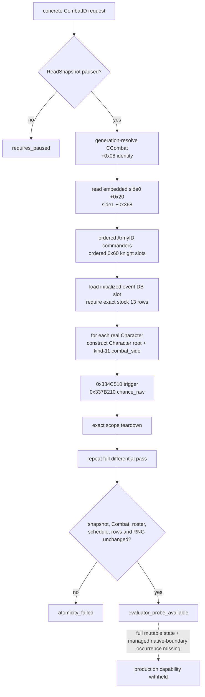
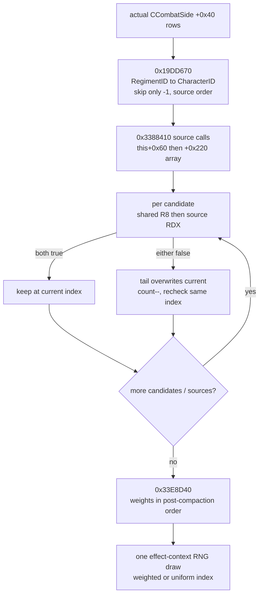
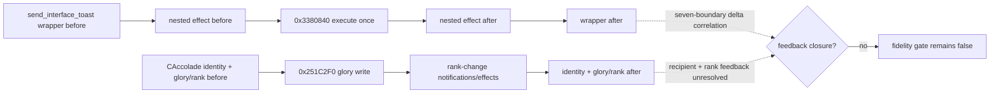
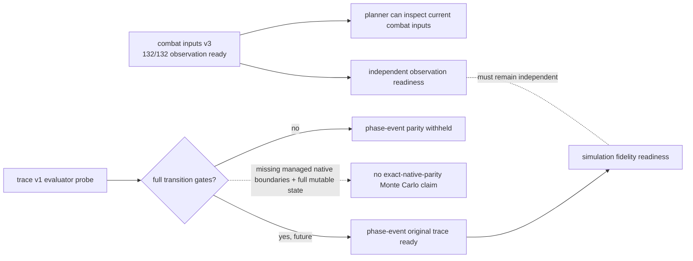

# ongoing combat phase-event trace v1

## 结论与边界

本页冻结下一项只读观测口 `query-combat-phase-event-trace-v1-{CombatID}` 的 exact-build
设计与第一阶段 native reader。它解决的不是 hypothetical pre-contact：请求必须携带 storage 中仍然存在的完整
generation `CombatID`，并且只在暂停帧读取真实 `CCombat`、两个 embedded `CCombatSide`、真实 Character root
与 kind-11 `scope:combat_side`。单帧 probe 与后续 managed before/after 七边界合同是两个独立 gate。

- [implementation-confirmed] DTO 与 research-only reader 已分别落在
  [`combat_phase_event_trace_v1.hpp`](../../ck3_autonomous_player/native_bridge/include/xar_bridge/combat_phase_event_trace_v1.hpp)
  和
  [`combat_phase_event_trace_v1.cpp`](../../ck3_autonomous_player/native_bridge/src/combat_phase_event_trace_v1.cpp)。
- [implementation-confirmed] ABI ledger 是
  [`combat_phase_event_trace_v1_abi.json`](../../ck3_autonomous_player/native_bridge/research/combat_phase_event_trace_v1_abi.json)；
  offline source fixture 是
  [`combat_phase_event_trace_v1_source_contract.json`](../../ck3_autonomous_player/native_bridge/research/fixtures/combat_phase_event_trace_v1_source_contract.json)。
- [implementation-confirmed] 七边界固定宽度 capture transport 已落在
  [`combat_phase_event_trace_ring_v1.hpp`](../../ck3_autonomous_player/native_bridge/include/xar_bridge/combat_phase_event_trace_ring_v1.hpp)
  与
  [`combat_phase_event_trace_ring_v1.cpp`](../../ck3_autonomous_player/native_bridge/src/combat_phase_event_trace_ring_v1.cpp)；
  source contract 是
  [`combat_phase_event_trace_ring_v1_source_contract.json`](../../ck3_autonomous_player/native_bridge/research/fixtures/combat_phase_event_trace_ring_v1_source_contract.json)。
  当前完成的是无分配 capture ABI、原 helper wrapper、exact-build detour installer、受 900 KiB 上限约束的 drain wire serializer，
  以及离线七记录/delta/fail-closed 测试；detour 源码已编进 production DLL，但尚未由 paused managed driver 安装，也未广告 capability。
- [implementation-confirmed] 当前只发布内部状态 `evaluator_probe_available`，production capability 常量明确
  `advertised=false`，也没有接 bridge、driver、service 或 MCP。它不是可以被 planner 调用的完成口。
- [static-confirmed] 当前 reader 不调用 `0x2E1C570` selector、`0x23C8750` schedule builder、
  `0x23C9900` fire、`0x3380310` effect executor、`0x356A0A0/0x356B770` RNG draw，也不调用会 lazy-init
  singleton 的 `0x23CEB10`。
- [static-confirmed] `random_side_knight` 的实际 materialize/filter/select 顺序已闭合为
  `ccombat_side_knight_source_then_tail_swap_remove_v1`；reader 只读它的 pre-limit source vector，不调用 selector。
- [implementation-confirmed] `CCombat+0x708` 对应 Battle-result 的 retained `BattleEvent` storage 已有 generation-safe
  纯读 reader；单帧只把它称为 generic battle ledger，不伪造 phase-event origin。
- [not-live-tested] 本轮只读原版 EXE 并构建源码，没有启动、注入、暂停、恢复或操作 CK3。实机 paused
  snapshot 与 managed daily transition 仍须在部署窗口完成。

绑定版本仍是 CK3 `1.19.0.6`，`ck3.exe` SHA-256
`2D00FF3101EF70B566F2FCBAE292F09263199C80E9DC8F139B82D7D96F83DB86`。



## 原生事件表与 differential

[static-confirmed] `0x23CEB10` 是 phase-event database getter；singleton 为空时它会构造数据库，因此只读查询
禁止调用它。reader 只加载已经初始化的 `module+0x57C7930`。数据库 `+0x68/+0x74` 是 event pointer data/count。
为了不把 mod-added row 悄悄排除在 selector 之外，本 v1 要求 loaded 表正好是冻结的 13 行、原 load order、稳定 key、
type 与 empty-effect flag 全匹配；否则返回 `event_table_mismatch`，而不是把 stock 13 行冒充完整 loaded selector。

每个 event 的 ABI 是：

| field | exact-build location |
|---|---|
| stable key | `event+0x18`，MSVC `std::string` |
| compiled trigger | inline object `event+0x38` |
| compiled chance | inline object `event+0x118` |
| compiled effect | inline object `event+0x178`，本查询绝不调用 |
| empty effect | `event+0x1C4 == 0` |
| event type | `event+0x1D8`：commander `0`，knight `1` |

[implementation-confirmed] 对每个观测到的 Character，DTO 固定发布全部 13 行：`trigger_valid`、signed Q100000
`chance_raw`、signed `/100000` 向零截断后的 `int_weight`。此外明确保留：

- `selector_role_applicable`：该 Character 是当前 side selected commander，或是 ordered knight；
- `selector_would_evaluate_chance`：原 selector 的 type/trigger short-circuit 是否会走到 chance；
- `chance_evaluated_for_differential`：为了逐行对拍，本 probe 即使在原 selector 会 short-circuit 时仍纯读求值；
- `selector_eligible`：role applicable、trigger true 且 weight positive 同时成立。

因此 differential 的“某 invalid row 仍有 chance_raw”不会被误读成原 selector 实际消费了该 row；reader 本身不做
weighted selection，也不消费 selection draw。

## 真实 kind-11 combat_side scope

[static-confirmed] selector `0x2E1C570` 的 scope 构造已逐指令复刻：

1. 在 query-owned、16-byte aligned 的 `0x168` byte storage 调 `0x81F190(scope)`；
2. root 写 kind `4`，`scope+0x08` 写 zero-extended full CharacterID；
3. 从 `side+0xB8` 取真实 parent `CCombat*`，并要求它仍等于请求解析到的 Combat；
4. named token 写 kind `11`，subtype 为 side0 `0` / side1 `1`，payload 为 sign-extended `CCombat+0x08`
   CombatID；
5. 从 `module+0x57EB630` 读取 exact `combat_side` key ID，调用
   `0x3358160(scope+0x18,key_id,&token)`；
6. 对同一个 scope 的 13 行分别调用 `0x334C510(event+0x38,scope)` 与
   `0x337B210(event+0x118,&raw,scope)`。

清理必须按 selector 的原顺序，不能把 query-owned native allocation 留给 CK3：

1. `0x81E900(scope+0x118)`；该 helper 内部先清 `+0x30` 的 `0x48`-stride rows，再清 `+0x10` 的
   `0x20`-stride rows；
2. `scope+0x100` 有 data 时先 `0x81E980(scope+0x100)`，再用 `scope+0x110` allocator 的 vtable
   `+0x10(allocator,data,8)` 释放并清 data/capacity/count；
3. `scope+0x18` named rows 是 selector 原版的 trivial-row teardown：不调 element destructor，直接用
   `scope+0x28` allocator 的同一 deallocator 释放并清字段。

任一 scope 未完整 teardown 都返回 `scope_teardown_failed`；它不能被降级成一行 unknown。

## `random_side_knight` 的真实 candidate 顺序

[static-confirmed] RTTI 将目标类钉死为
`CScriptedListEffect<CRandomInScriptedListEffect,CCombatSideKnightListBuilder>`，vtable RVA `0x41DE5C0`。
`vtable+0xD0 -> 0x19F4880` 从已解析的 `CCombatSide+0x4C` 读上界；`vtable+0xD8 -> 0x19F4760`
负责 materialize 与 limit；`vtable+0xE0/+0xE8 -> 0x33E87E0/0x33E8890` 进入选择与 effect 路径。

`0x19DD670` 的 source materializer 先经 `0x2011090` 把 scope token 解析成**实际** `CCombatSide`，随后严格按
`side+0x40/+0x4C`、stride `0x60` 枚举。每行 `+0x08` 是 RegimentID，经
`module+0x57BF4C8` store（fallback `module+0x57BF4C0`）、`CRegiment+0x10` generation identity 后读取
`CRegiment+0x148` CharacterID；只跳过 `-1`，不做 alive filter，并按该 stored order append kind-4 target。

两层 predicate 的 receiver 与次序也已逐指令闭合：

1. `0x3388410(this,effect_context,out_vector)` 首先以 source predicate `this+0x60` 调一次 vtable `+0xD8`；
2. 再按 `this+0x220` pointer array、`this+0x22C` count 为每个额外 source predicate 重复调用；
3. 每次 `0x19F4760` 收到 `RCX=this`、`RDX=本次 source predicate`、`R8=this+0x140` shared predicate、
   `R9=effect_context`，stack argument 是同一个 output vector；
4. 某 candidate 需要过滤时，`0x334C600` 固定先求 R8 shared predicate，再求 RDX source predicate；空 trigger
   按 true。任一为 false 都不是 stable erase：把**当前尾项覆盖失败项**、count/end 减一，并在同一 index 重试。

因此 post-limit order 是 deterministic tail-swap-remove 的结果，不能把 source list 做 stable filter。随后
`0x33E8D40` 按这个当前 vector order 调 `0x337B310` 求 candidate weight。signed Q100000 weight 先向零除
`100000`，仅正数且有余数时再 `+1`，然后存 low int32；每行包括 zero/negative 都不 clamp、不跳过，signed total
以 int32 two's-complement wrap 累加。positive total 时一次 effect-context draw 后做 `draw31 % total`，再按序做
signed subtract（负 weight 会增大 remainder），首次为负即选中；遍历无命中回退 index `0`。total `<=0` 或无
weight expression 时也消费一次 draw，再做 `draw31 % candidate_count`。



[implementation-confirmed] trace-v1 的 `ordered_knight_character_ids` 直接来自这个 pre-limit `CCombatSide` vector。
production combat-inputs v3 也已改为从 stock `0x23C9100` 构造出的 query-owned local `CCombatSide` 直接重读两侧
commander/knight source rows，并在 available 前把每一行
`role/source_army_id/source_regiment_id/character_id` 与 v3 raw expectation **逐项相等**；另外发布包含 side index 的
uppercase SHA-256 sequence digest，helper 全部结束后再重读一次 native vector。digest 不能代替逐项 gate。
因此 native `combat_inputs_v3_source_vector_equivalence_ready=true`；Python AST admission 仍必须实际消费并验证同一个
`candidate_source_proof` 后才可把 materialization-input gate 置 true，不能仅凭本页声明。

offline source fixture 另冻结四个 executable vector：interior reject 后 `[101,102,103,104] -> [101,104,103]`、shared
predicate false 时不求 source predicate、`[2,-1,2]` 不 clamp 的 weighted selection，以及 signed total `0` 时的 uniform
fallback。C++ source-contract test 会实际重放这些 vector，不只搜索文档字面量。

## Combat、roster 与 mutable core

[static-confirmed] live core 读取：`CCombat+0x6B0/+0x6B4/+0x6E0` 分别是 phase、phase day、winner；phase
枚举 `0/1/2/3` 对应 maneuver/main/pursuit/done，winner `-1` 未定、`0/1` 是 winner side。

两侧 roster 保留原容器顺序：

- commander：`side+0x10/+0x1C` 的 CArmyID array，generation-resolve CArmy 后读 `+0x120` CharacterID；
- knight：`side+0x40/+0x4C`、stride `0x60` 的 row，row `+0x08` 是 CRegimentID，resolve 后读
  `CRegiment+0x148` CharacterID；
- selected commander：`side+0x74`；
- 每个 CArmy 还必须以 `+0x128` CombatID 回指当前 Combat，每个 side 必须以 `+0xB8` 回指当前 Combat。

合法“无 commander / 当前 regiment 已无 knight”用 `{present:false}` tagged ID 表示，不使用 JSON null 或伪造 `-1`
当真实 CharacterID。当前 mutable core 已读并在第二遍重验：Character generation identity、native-valid、death marker、
alive、martial/learning/prowess、current regiment 与 `CRegiment+0x148` back-reference。

这还不是 effect transition 所需的完整 mutable bundle。production gate 明确要求继续接入：wounded rank、
one-legged/disfigured/one-eyed/maimed/incapable/berserker、blademaster XP/rank、accolade progress、13 个 attribute
unlock variables，以及 participant detach/membership。现阶段 DTO 把
`transition_state_complete=false` 和对应 `missing_production_readers` 写实，不用一串 null 冒充已经观测。

## effect wrapper 与 glory feedback 账本

[static-confirmed] `send_interface_toast` 的 ASCII key 在 `module+0x4439F90`，注册 xref `0x5C3831` 构造
`CEffectEntry<CSendInterfaceMessageEffect<1>>`，effect vtable 是 `module+0x443A420`；payload class vtable 是
`module+0x443A518`，execute slot `+0xB0 -> 0x2E7A4B0`。`0x2E7A9A1..0x2E7A9EE` 在建立消息局部 scope/RNG 后，
经对象 vtable `+0x58` 调 `0x3380840` **恰一次**执行 nested effect，随后才继续消息容器处理。它提供了 wrapper-before、
inner-before/after、wrapper-after 四个可施工边界；但在七记录 native delta 证明前，不能先断言 toast 除 inner effect 外
不写 combat state，也不能据此提高 feedback gate。

[static-confirmed] `CAddGloryEffect` execute `0x2E5B6F0` 通过 `0x9698B0` 求 signed Q100000 delta，解析 kind
`0x24` CAccolade（store `module+0x57BF1E0`、fallback `module+0x57BF198`、identity `CAccolade+0x08`），然后
tail-jump `0x251C2F0(CAccolade*, int64 delta_raw)`。后者在写入前后调用 rank helper `0x251B780`；正 delta 先乘
`100000 + owner modifier enum 0x238`（含原生 fixed-point overflow branch），再写 `CAccolade+0xB0`，负结果 clamp 为
0。`0x251B780` 对 `module+0x4F62B98/+0x4F62BA4` 的全局 threshold vector descending 匹配：低于全部返回 1，
否则返回最高命中 index+1。rank change 后续从 `0x251C724` 进入通知与 scripted-effect 路径。

因此 ring 已新增 typed before/after row：arm 从 v3 participant 的非 null full AccoladeID 出发，generation-resolve 后按
ID 排序，并冻结 owner、`CCharacter+0x1A8 -> link+0x568` acclaimed-knight 关联；同时复制
`module+0x4F62B98/+0x4F62BA4` threshold data/count。hook 每个边界重验对象、participant link 和全部 threshold，直读
`CAccolade+0xB0 glory_raw`，在 ring 内镜像 `0x251B780` descending scan，绝不调 rank helper。
这使 `typed_accolade_glory_rank_reader_ready=true`，但 event scope 实际选择的 recipient AccoladeID 与该 row 的归因、
`lifetime_glory` on_action 以及 rank-change event/memory feedback 尚未闭合；ring 仍明确保持
`full_mutable_transition_bundle_complete=false`。



## 五日 cadence 与 global RNG

[static-confirmed] schedule builder `0x23C8750` 从 `module+0x570E068 -> object+0x08` 读 date raw，计算：

```text
day_index = signed(date_raw - 0x029C55A8) / 24, truncation toward zero
due = uint32(CharacterID + day_index) % *(uint32*)(module+0x570EF9C) == 0
```

本 build 的 `COMBAT_EVENT_DAYS` 必须实读为 `5`；不是把 5 写成永远正确的 schema 常量。phase event fire 只在 main
tick，side order 固定 `0 -> 1`；每次 `0x23C9900(side)` 在入口无条件消费一个 global RNG draw，所以 phase-event
fire 本身每个 main tick 固定贡献两个 draw。

[static-confirmed] `0x356A0A0` 使用 `module+0x4FEB1C8` 的 thread wrapper；`*(void**)wrapper` 是 state，
`state+0x08/+0x0C/+0x10` 是 uint32 counter/salt/owner-thread token。probe 只读这些字段并离线计算下一值：

```text
x = salt - counter * 0x4AD685B3          // uint32 wrap
x ^= x >> 8
x += 0x68E31DA4
x ^= x << 8
x *= 0x1B56C4E9
x ^= x >> 8
x *= 0x92D68CA2
x ^= x >> 8
next_draw31 = x & 0x7fffffff
```

它不调 RNG。两遍 evaluator 前后 wrapper/state identity、counter、salt、owner token 与派生 next draw 必须全等；
否则整帧 `atomicity_failed`。

## retained schedule 与 retained BattleEvent 都不单独等于 phase occurrence

[static-confirmed] knight scheduled rows 位于 `side+0xD8/+0xE4`，stride `0x10`，内容是
`{event*, CRegimentID}`；commander pointer 位于 `side+0xF0`。`commander_none/knight_none` 的 empty effect 会被
selector 投影成 `module+0x57C7940` sentinel。更关键的是，`0x23C9900` fire 之后**不清空**这些容器；下一次
`0x23C8750` 才覆盖/清 count。

因此单个 paused snapshot 只能说“这是 retained non-empty schedule row”，不能诚实地说它仍 pending 或已经 occurred。
本 reader 的每行固定 `lifecycle_state=retained_row_occurrence_requires_managed_before_after`，而不是猜一个布尔值。

[static-confirmed + implementation-confirmed] `CBattleEventEffect` 的 vtable 是 `module+0x444F498`，execute
`0x2EB4330` 从真实 side 反查 parent Combat，取 `CCombat+0x708` 的 full-generation Battle-result ID，经
`module+0x57C0328` storage（fallback `module+0x57C0320`）解析对象，最终调用
`0x130A660(battle_result+0x188,row)` append。trace reader 只复制既有 rows，绝不调用 effect 或 append helper。

| retained BattleEvent field | exact-build location |
|---|---|
| container | Battle result `+0x188`：data `+0`、capacity `+8`、count `+0xC`、allocator `+0x10` |
| row identity | stride `0x38`；vtable `module+0x41461A0` |
| portraits | left/right CharacterID `+0x08/+0x0C`，非 `-1` 时逐个 generation-resolve |
| stable key | row `+0x10` MSVC `std::string` |
| outcome | signed `type_raw` at `+0x30`；pursuit 下 effect 会把 native type `3` 投影为 retained `4` |
| side/target | side0 bool `+0x34`，target_right bool `+0x35` |

这个 reader 已闭合 Battle-result/CharacterID association，并在 evaluator 第二遍要求整份 retained ledger 不变；所以它是
单帧已有战报的有效观测口。不过 storage 会同时容纳非 phase-event 产生的 battle rows，单行没有原生 provenance tag。
因此每行固定 `phase_event_origin=unclassified_without_managed_boundary_delta`：需要受管原生边界前后的 append delta 与
schedule/root 对拍后，才能归因到某个 13-row phase event。

```mermaid
sequenceDiagram
    participant B as managed trace driver
    participant Q as query-owned capture ring
    participant S0 as CCombatSide 0
    participant S1 as CCombatSide 1
    participant R as read-only trace reader
    B->>Q: 0x27FB58F before side0 schedule
    B->>S0: 0x23C8750 schedule side0
    B->>S1: 0x23C8750 schedule side1
    B->>Q: 0x27FB5AC after side1 schedule
    B->>S0: 0x23CA2F0 refresh side0
    S0->>Q: 0x23C9900 entry, return site 0x2309EF7
    S0-->>Q: 0x2309EF7 after side0 fire
    B->>S1: 0x23CA2F0 refresh side1
    S1->>Q: 0x23C9900 entry, return site 0x2309EFF
    S1-->>Q: 0x2309EFF after side1 fire
    B->>R: paused_next_day_stable_query
    Q-->>R: six native-boundary records for the same Combat/day token
    R-->>B: compare schedule/local RNG/global RNG/BattleEvent/mutable state/membership/strength
    Note over Q: bounded copies only; never pause or re-enter bridge on the CK3 call stack
    Note over R: only this seven-record chain may label occurred/no-op/pending
```

这七个 record 名称已经冻结成 `native_daily_phase_event_boundaries_v1` contract；前六个是 native call-boundary capture，
只有最后一个是正常 paused query。排程与 fire 并不在同一个函数里：[static-confirmed] `0x27FB4D0` 按 manager stored
CombatID order 调 side0 `0x27FB58F -> 0x23C8750`、side1 `0x27FB5A7 -> 0x23C8750`，而 `0x27FB5AC`
仍在同一 Combat 迭代、尚未推进 iterator；相邻 daily dispatcher `0x27FB5D0` 之后才在 `0x27FB683/0x27FB6A2`
更新两侧、`0x27FB6C6` 递增 phase day，并于 `0x27FB6FD` 调 `0x2309E80`。

[static-confirmed] `0x2309E80` 先在 `0x2309E92/0x2309EA1` 用 `0x23CB840` 汇总双方 total，再从
`0x2309EF2/0x2309EFA` 分别进入 `0x23CA2F0`。后者先 `0x23CBC20` refresh、维护 participant rows，最后
tail-call `0x23C9900`。因此真正能隔离 effect 的 before 点是 `0x23C9900` 入口：实际 side pointer 加返回地址
`0x2309EF7` 唯一标识 side0，加返回地址 `0x2309EFF` 唯一标识 side1；两个返回点分别位于 side1 refresh 前和
commander rolls 前。只在 `0x2309EF2` 前取样会把 refresh 与 effect 混进同一个 delta，不能作为 effect parity 证据。

hook 必须只向预分配的 query-owned ring buffer 做有界只读复制并立即返回；严禁在 CK3 调用栈内暂停游戏、调用
`ReadSnapshot`、走 CK3 allocator，或重入 bridge/service。七个 record 必须以同一 full-generation CombatID、loaded
phase-event table、native date 和 managed daily sequence token 关联；phase day 的预期递增要逐点记录，不能错误要求它
全程相等。对拍域包括 retained schedule、schedule-local RNG state/counter、BattleEvent、global RNG、full mutable
character state、participant membership、side strength 和 advantage。

[implementation-confirmed] 当前 ring source 已实现以下**不等于生产完成**的部分：

- `0x23C8750` wrapper 以原 caller return address 识别 side0 `0x27FB594` / side1 `0x27FB5AC`；side0 调原 helper
  前复制第一条，side1 原 helper 返回后复制第二条。`RDX` 指向的两个 uint32 暂按 `opaque word0/word1` 原样复制，
  不提前猜 native 类型名；
- `0x23CA2F0` 尾跳保持 `0x2309EF7/0x2309EFF`，所以 `0x23C9900` wrapper 能以实际 side pointer + return site
  唯一识别两侧，并在 exact original trampoline 前后各复制一条；
- paused managed reader 必须在 arm 前提供 Combat/side/date/event table/global RNG/Battle result identity，以及按 full ID
  严格升序的 Army/Regiment/Character pointer map。hook 只做有界 binary search 和 generation revalidation，不访问
  component store；
- 每个 record 有界复制 roster/membership、retained schedule、BattleEvent（key 最大 128 bytes，超出整环失败）、
  Character core、participant Accolade glory/rank、side `+0x98/+0xA0`、Combat advantage/rolls、local/global RNG。任何 reentry、乱序、identity replacement、
  memory fault、容器不一致或容量超限都原子 fail closed，绝不截断；
- 离线 fixture 已重放七记录 delta，并覆盖乱序、CombatID 变化和容量溢出；source scan 禁止 heap、`ReadSnapshot`、
  RNG draw、trigger/value evaluator 与 bridge/service token。

exact-build detour installer 已实现并编进 production DLL：它逐字节验证 `0x23C8750` / `0x23C9900` 的 15-byte 完整指令
prologue、四个原 caller 和 `0x23CA34E` tail-jump，随后用 14-byte absolute jump 加一个 NOP 改写入口；原 15 bytes
复制到 29-byte RX trampoline 后跳回 `entry+15`。安装和卸载只允许在 application-main paused-quiescence 证明成立、
且 ring 未 armed 时执行；任一目标失败会恢复成成对状态，不留下半安装/半卸载入口。它不会自行 arm ring、恢复游戏或广告查询。

drain wire serializer 同样已落地：它序列化七条边界中的稳定 ID、RNG、roster/schedule、character core、BattleEvent、
accolade glory/rank 和 readiness gate；不会发布可复用的 native object/code address。schedule event pointer 只作为
`process-local-0x...` opaque correlation token，且 fragment 超过 900 KiB 时在进入 1 MiB bridge frame 前 fail closed。

application-main typed begin/finish executor、full-generation capture-plan builder 与 managed checkpoint DTO 已落地并编进
production DLL。begin 只在已验证 paused mailbox slot 上、且外部已创建 recoverable checkpoint 时安装 detour 并 arm；
finish 要求同 token、同 application-main thread、`after.date_raw=before.date_raw+24`，随后 capture 第七条、drain 并卸载
detour。两者本身都不改变速度或推进日期；离线 fixture 已闭合 before/after checkpoint、七记录、wire 与卸载恢复。

尚未实现的是共享 mailbox 的 typed union dispatch、bridge/service/MCP 接线、外部可恢复 one-day driver 和 paused live 同
Combat fixture；完整 trait/track/variable/accolade mutable bundle 也仍缺。因此 ring 可令
`bounded_ring_source_ready/detour_installer_ready/bounded_wire_serializer_ready/capture_plan_builder_ready/typed_begin_finish_executor_ready=true`；
`same_combat_live_fixture_ready/full_mutable_transition_bundle_ready/production_trace_ready` 仍为 false。
UI date 轮询仍不能提供六个中间点 provenance，generic BattleEvent reader 也不解除该门；capability 继续不广告。

## readiness 与现有 132/132 observation 的分离

phase-event trace 的 fidelity gate 不能反向让已经完整的 combat-simulation-inputs v3 `132/132` observation 变成
unavailable。前者用于 Monte Carlo 的 original-transition parity；后者用于当前帧确定性输入。



生产广告的必要条件是：

1. live paused CombatID fixture 通过两遍 `0x334C510/0x337B210` differential、真实 side scope 与完整 teardown；
2. retained schedule、date cadence、RNG state/counter 在同帧对拍；
3. full mutable state bundle 完成且无长期 null；
4. 已闭合的 generic BattleEvent storage/identity reader，加上受管逐日 native-boundary delta，能区分 no-op、实际 effect、
   跳过、phase origin 和关联角色；
5. side0 effect 后、side1 refresh/effect 后的 participant/strength/advantage recompute original trace 通过；
6. capability、concrete request parser、serializer、driver cache、service 与 MCP fail-closed 接线完成；capability template 本身
   永远不得成为 concrete action step，generic fallback 也不得把查询前缀转成 life-advance。

## 离线复现入口

本页结论可用仓库内只读工具复核：

```powershell
& "tools/.venv/Scripts/python.exe" ck3_autonomous_player/native_bridge/research/disasm_ck3.py 0x2E1C570 --size 0x380
& "tools/.venv/Scripts/python.exe" ck3_autonomous_player/native_bridge/research/disasm_ck3.py 0x19DD670 --size 0x260
& "tools/.venv/Scripts/python.exe" ck3_autonomous_player/native_bridge/research/disasm_ck3.py 0x19F4760 --size 0x120
& "tools/.venv/Scripts/python.exe" ck3_autonomous_player/native_bridge/research/disasm_ck3.py 0x3388410 --size 0xA0
& "tools/.venv/Scripts/python.exe" ck3_autonomous_player/native_bridge/research/disasm_ck3.py 0x33E8D40 --size 0x310
& "tools/.venv/Scripts/python.exe" ck3_autonomous_player/native_bridge/research/disasm_ck3.py 0x27FB4D0 --size 0x100
& "tools/.venv/Scripts/python.exe" ck3_autonomous_player/native_bridge/research/disasm_ck3.py 0x27FB5D0 --size 0x160
& "tools/.venv/Scripts/python.exe" ck3_autonomous_player/native_bridge/research/disasm_ck3.py 0x2309E80 --size 0x120
& "tools/.venv/Scripts/python.exe" ck3_autonomous_player/native_bridge/research/disasm_ck3.py 0x23CA2F0 --size 0x70
& "tools/.venv/Scripts/python.exe" ck3_autonomous_player/native_bridge/research/disasm_ck3.py 0x23C8750 --size 0x2C0
& "tools/.venv/Scripts/python.exe" ck3_autonomous_player/native_bridge/research/disasm_ck3.py 0x23C9900 --size 0x390
& "tools/.venv/Scripts/python.exe" ck3_autonomous_player/native_bridge/research/disasm_ck3.py 0x2EB4330 --size 0x280
& "tools/.venv/Scripts/python.exe" ck3_autonomous_player/native_bridge/research/disasm_ck3.py 0x130A660 --size 0x150
& "tools/.venv/Scripts/python.exe" ck3_autonomous_player/native_bridge/research/disasm_ck3.py 0x81E860 --size 0x180
& "tools/.venv/Scripts/python.exe" ck3_autonomous_player/native_bridge/research/disasm_ck3.py 0x81F190 --size 0xC0
& "tools/.venv/Scripts/python.exe" ck3_autonomous_player/native_bridge/research/disasm_ck3.py 0x356A0A0 --size 0x60
& "tools/.venv/Scripts/python.exe" ck3_autonomous_player/native_bridge/research/disasm_ck3.py 0x356B770 --size 0x90
```

这里的 offline fixture 只冻结 source contract，明确不含 fake CombatID、fake RNG state 或 fake effect transition；真正
available golden 必须从后续 paused live fixture 产生。
