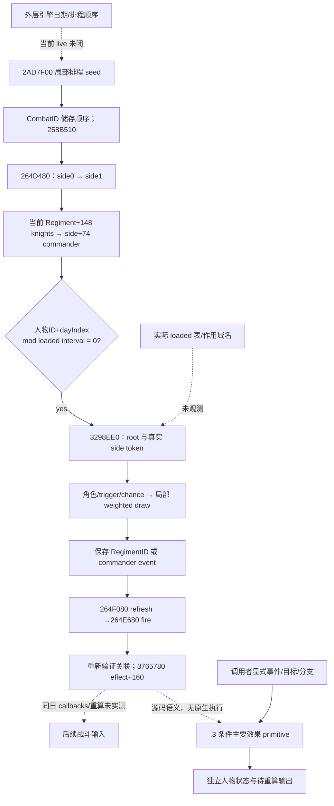

# CK3 1.20.0.3：阶段事件与条件效果转移

2026-10-04，本专题绑定 **CK3 1.20.0.3 / Steam build 25652598 / EXE SHA-256 `94B55397ABB687A3DCD436805A5D885E6BE90FA6C693FEB44A9E3BBEEADE02A6`**。研究、实现和测试均在进程外完成，没有 SDK、游戏、前台或 Git 操作，也没有推进普通战役日期。

本次交付可调用的 `execute_selected_phase_event_12003`：调用者给定一个已选事件、当前人物条件及脚本分支/目标，它把已支持的主要人物效果写入独立状态，返回伤势、特质、死亡、武勇、参与者列表和待重算字段。它目前是 **static-ready 的条件效果 primitive**；实际 loaded 表、原生选择结果及同日完整回写尚未实测。

## 当前原生树与版本差异

旧 [phase 专题](combat-phase-events.md)、旧 manifest 和旧原生 trace 继续保留其 1.19.0.6 版本绑定。本次只读取新版本所需的十个原生片段，共 **3460 B**，没有重扫 EXE 或重跑旧矩阵。

| 当前 .3 锚点 | 已闭合静态语义 |
|---|---|
| `0x2AD7F00` | 对储存顺序的 CombatIDs 调 `0x258B510`，以同一局部 draw state 先排 side 0 再排 side 1；seed 为 `avalanche32(0x5EA6BA9F - update_seed * 0x4AD685B3)` |
| `0x264D480` | 日期从 `0x5C68C50 -> +8` 读取；`dayIndex=trunc0((date.low32-0x029C55A8)/24)`；按 `(uint32 FullCharacterID + dayIndex) % loadedUint32(0x5C69B4C) == 0` 排程 |
| `0x3298EE0` | Character root 与 named kind-11 CombatSide token；按 loaded source 顺序检查角色、trigger、chance，再选择候选 |
| `0x3FAAB70` | 跳过非正权重；chance 的 signed Q100000 向零截断为 int32 weight；有 trigger-valid 行时消费一枚局部 draw，没有时不消费 |
| `0x264E680` | 先取一次 global draw，再按已排程 knights 顺序及 commander 执行；重新验证 Regiment/CArmy 的 CombatID 关联并读取当时 CharacterID |

当前 loaded 表入口为 `0x5D27B90 -> +0x50/+0x5C`；事件角色在 `+0x1B0`、trigger 在 `+0x40`、chance 在 `+0x110`、empty-effect count 在 `+0x19C`，编译效果在 **`+0x160`**。旧 `+0x178` 不适用于 .3。当前 trigger/chance evaluator 为 `0x372DF30/0x37616A0`，效果执行器为 `0x3765780`。named scope key 来自 `0x5D4BD6C`；其实际 loaded name 和 runtime side resolution 尚未读取。

排程保存 `RegimentID`，不是当时的 CharacterID：side 的 `+0xD8/+0xE4` 为 stride-16 排程行，commander 保存于 `+0xF0`。fire 会重新解析人物；跳过关联不符的行不增加已执行 ordinal。fire 不清空保留的排程容器，因此 paused 排程行不能单独证明某事件尚待执行。stock interval 为五日，**本次未读实际 loaded interval**，也没有闭合外层引擎日期顺序。



## 新版 stock 数据与支持范围

新增 [独立 .3 数据](../../ck3_autonomous_player/src/xar_autoplayer/simulation/data/ck3_1_20_0_3_stock_combat_phase_events.json)，canonical SHA-256 为 **`38BB943E208F53D106B90A2F6B895189ECA6471ED7B9888AC5A8454E7CD60240`**。外部 stock 投影文件 SHA-256 为 `86842C676D27D5862A85719F0698CF9660547D4E03809440D4846A93A8F082FD`。十一份相关 stock 文件各有实际当前 SHA 与真实旧 snapshot 的精确比较；旧 snapshot 的十一份字节逐一吻合旧 manifest。十四个相关 helper 块有十二个未变、两个改变，不能因顶层事件相似而默认全部脚本相同。

十三行的顺序、角色与 base weight 均不变，仍为四个 commander、九个 knight。当前 source 的 faith→rite、可选 accolade scope、cranial trophy 与冷却 variable 等差异有单独账本。该清单是 **stock source pin**，没有冒充实际 playset loaded override 表。

七个 selected-event 主效果已支持：`commander_none`、`commander_wounded`、`commander_maimed`、`commander_killed`、`knight_none`、`knight_wounded`、`knight_maimed`。其余六行保留 inventory 与明确 sentinel：`knight_berserker_attack`、`knight_become_berserker`、`knight_shieldmaiden_attack`、`knight_becomes_incapable`、`knight_killed`、`knight_qualify_for_accolade`；调用这些效果仍明确返回未支持。

主要伤害按当前 `increase_wounds_effect` 投影：原伤势低于三级时递增并封顶，脆骨分支按当前 helper 条件处理；原伤势三级时 `death_fight` **没有显式 killer**。新版 wound 与 maim 子调用均修正旧 evaluator 把已选敌骑士归为 killer 的投影错误。这是当前源码与旧代码之间的语义差别，不能声称其为版本新增。maim 分支按 source 顺序为 one-legged/disfigured/one-eyed/maimed，已有对应特质的分支不可选；被选敌骑士的 prowess 成长可写回 `+100000`，或按当前 blademaster 分支增加特质/XP。

死亡输出只更新独立 state 的 alive、membership、commander 与待 detach/recompute 标记。治疗、piety/stress、延后 health、impressive-knight 维护、资源/glory/house/trophy/memory、native death callbacks、替补 commander 和实际战力重算仍单独列入 `feedback_pending`；不把这些字段缺失升级为新的游戏执行禁令。

## 可调用接口与验证

[新模块](../../ck3_autonomous_player/src/xar_autoplayer/simulation/battle_phase_events_12003.py) 提供：

```python
stock = load_stock_phase_events_12003()
result = execute_selected_phase_event_12003(
    context,
    event_key="commander_wounded",
    script_outcomes=explicit_outcomes,
    manifest=stock,
)
```

`PhaseEventScriptOutcome12003` 按执行顺序明确提供 `purpose` 与 `branch_index` 或 `character_id`。上下文保留规范化人物 refs 的形状，但由调用者提供条件；旧 `candidate_source_proof` 不被当作 .3 原生观测证明。模块不调用旧强绑版本的 public evaluator/manifest loader，不制造 native proof，不产生 draw31，也不推断事件选择概率。`event_key=None` 与空 outcomes 提供状态不变的显式无事件步骤。

唯一新 [focused unit](../../ck3_autonomous_player/tests/unit/test_battle_phase_events_12003.py) 首次运行 **GREEN：4 methods、0 failures、0 errors、0 skipped，0.0275898 秒**。独立当前 source 期望覆盖伤势一→二、敌骑士 prowess `+100000`、三级伤害及 maim branch-0 的无 killer 死亡、commander/participant 移除、输入不变、无事件零变化及新旧 manifest 独立。没有重跑旧测试矩阵，也没有 actual paused phase-event 验收。打包 attempt 1 因 aggregator 多设了 LF 要求出现 harness RED；已保留该 attempt，仅修打包器以保留原始 UTF-8 字节，不影响 source/module 或首次 GREEN fixture。

冻结证据根目录：`Z:/ck3_mod_rewrite_process_assets/g2-resume-20261004/battle-phase-events-12003/`。`stock/SOURCE-CLOSURE.json` SHA `76F752C0A794346D4FDCD29FB8721B1A878ED6108B6C2DBA226CFDDD3D797E58`；`feedback-leaves/FEEDBACK-CLOSED-LEAVES.json` SHA `AC7BC5B9D2928E191B0EDCE8AAA9F4C2E645EBC162B7DC8D3869BB1419DBDB9E`；`native-schedule/SOURCE-SCHEDULE.json` SHA `7E251A48A879DBE97BAE472C977CC3EC72DCB183628BB4D7482FB2E291DB9D5B`；测试原始回执在 `fixture/RUN-01-RESULT.json`。

下一项可施工观测入口为当前 `0x5D27B90` 的 loaded rows、`0x5D4BD6C` 的 named side scope、当前 phase interval 与所需 context refs；采用只读 .3 bridge/MCP 发布后，用实际 paused battle snapshot 验收。随后再闭合 `0x2AD7F00/0x2AD8000` 的原生日期顺序与 `0x264F080/0x264E680/0x3765780` 的同日 feedback。当前交付不增加自然继承、普通日期、G2/NW 总项或完整 forecast 完成数，不能声称完整 Monte Carlo 或战斗胜率。
