# CK3 1.19.0.6 战斗阶段事件：原生表、状态转移与模拟契约

## 证据与加载边界

本文只绑定 `ck3.exe` 1.19.0.6、SHA-256
`2D00FF3101EF70B566F2FCBAE292F09263199C80E9DC8F139B82D7D96F83DB86`。RVA 均以模块基址为零点。
原版安装包中的候选 stock 规则如下；它们是可复现的静态证据，但**不是当前播放集已经加载这些文件且没有覆盖**的
实机证明。正式模拟前仍须枚举实际 playset 的覆盖顺序并生成 deterministic manifest。

| 文件 | SHA-256 |
|---|---|
| `game/common/combat_phase_events/_combat_phase_events.info` | `48A25D3567762DD8A44A7C80AB01E59E4307C4FBEB245D2AA3A67330792E64BE` |
| `game/common/combat_phase_events/00_commander_phase_events.txt` | `0CC4675971279397F692512E334CE13B9498C2F02C08C29576961CD31080BFF1` |
| `game/common/combat_phase_events/00_knight_phase_events.txt` | `E8F8E4978BB1AF130D74AA6ED72EE41F014B09C9F324608EBFB0E87D56A5EDB1` |
| `game/common/scripted_effects/00_commander_effects.txt` | `7999F7731F56A63A5E6E615EF1805F6382101D958A5AD4967F9C68CF3E8EE6F6` |
| `game/common/scripted_effects/20_health_effects.txt` | `6D7DEF1245D899DE4DEBC42136815BC7F4D14F6A467A8320355507AD03528F12` |
| `game/common/scripted_effects/00_death_management_effects.txt` | `921F06A614CA254EEAD3F57B4EB57F569F0B16B90369575A020461CE1877C397` |
| `game/common/scripted_triggers/04_ep2_accolade_triggers.txt` | `0C91C57E6A296257D20E7A8E835FDF4471C6BBA2848F481233D4DA5435D62B3C` |
| `game/common/script_values/04_ep2_accolade_values.txt` | `62BE56D4FC84E7673A1BB6BA8B2BA60C5E865C92090F2DFE0EA69429A2A83567` |
| `game/common/script_values/00_basic_values.txt` | `9268A54F0E425D409D9D0F20D884E0A3D0A89DF85A0B6644D56133C0C4CB0096` |
| `game/common/script_values/02_religion_values.txt` | `A7A36F9EEE27B8B32085139058BB99E39D3DB207445646A82031722597D28206` |
| `game/common/traits/00_traits.txt` | `079F0AB5C4224C505AB9F25BCA80D8DF296E5899BFAB26049CE5FE794DC0B042` |

[static-confirmed] 当前仓库两个 mod 源树没有 `common/combat_phase_events` 覆盖；这只能排除仓库内这两个源树，不能
排除用户播放集中的其它 mod。manifest 编译器遇到覆盖文件、未知 opcode 或未能解析的 scripted effect 时必须
`unavailable`，不能悄悄退回本文 stock 表。

## 原生选择与执行 ABI

phase event 的 selector、五日排程和主阶段 draw 顺序详见
[battle-simulation.md](battle-simulation.md#随机性phase-event-与-prng)。与 loaded 表直接相关的 exact-build ABI 为：

```cpp
const CCombatPhaseEventType* select_phase_event_1_19_0_6(
    PhaseEventDatabaseContext* database, // +0x68 candidate**; +0x74 count
    int32_t type,                        // 0 commander; 1 knight
    CCombatSide* side,
    int32_t character_id,                // full CharacterID
    DrawState* state);                   // {uint32 counter,uint32 salt}
// RVA 0x2E1C570
```

[static-confirmed] candidate 按 database load order 扫描。`event+0x1D8` 是 type，`event+0x38` 是 compiled
`is_valid`，`event+0x118` 是 compiled `chance`，`event+0x178` 是 compiled effect；`event+0x1C4==0`
表示 empty effect。selector 构造 Character root + `scope:combat_side` 上下文，然后：

```cpp
bool evaluate_trigger(void* compiled_trigger, void* event_target_scope);
// RVA 0x334C510; caller passes event+0x38 and its stack scope context

FixedPoint* evaluate_value(void* compiled_value, FixedPoint* out,
                           void* event_target_scope);
// RVA 0x337B210; caller passes event+0x118, caller-owned out, same scope context
```

`chance_raw` 是 signed Q100000；selector 对它做 signed `/100000` 向零截断得到 `int32 weight`。只要至少一个
trigger-valid candidate，就恰好消费一个 selection draw；总正权重为零也消费，只有完全没有 trigger-valid row
才不消费。`0x3BB6DD0` 忽略 `weight<=0`，按 load order 选择首个覆盖 target 的正权重 row。

[static-confirmed] `0x23C9900(CCombatSide*)` 执行 scheduled rows。它重新解析 frozen `CRegimentID`，确认该
regiment 的 CArmy 仍关联当前 CCombat，再从 `CRegiment+0x148` 读取**当前** CharacterID；这一层没有独立的
Character alive gate。因此“角色已死”本身不能被描述成 row 必然在 dispatcher 层跳过；具体 effect 内的
`is_alive` 条件以及死亡后 regiment/army 关联何时更新，必须由状态转移 fixture 决定。

[static-confirmed] 标准 compiled effect 经 `0x3380310 -> 0x3380A00` 执行。root executor 从 effect context
`+0x28` 的 local draw state 取一 draw，把 `effect_node+0x38` 的稳定节点号与 draw 混合后，以
`avalanche32(0x5EA6BA9F - mixed*0x4AD685B3)` 派生 child state。这个细节约束 seed-exact effect trace；独立
Monte Carlo distribution 不需要复现当前 timeline seed，但仍必须等价实现每个条件 draw、候选顺序和权重。

## Stock candidate 事件表

表内 `base` 是源文件的 base chance，不是最终 weight。`validity` 和 `weight dependencies` 是模拟器输入依赖摘要；
权威公式仍是 manifest 中的 normalized AST，不能只按此人读摘要重写。

| load index | key / type | base | validity 摘要 | 立即或后续战斗状态转移 |
|---:|---|---:|---|---|
| 0 | `commander_none` / commander | 1000 | 无显式 trigger | no-op；empty effect 被 selector 投影成 null |
| 1 | `commander_wounded` / commander | 25 | root 存在；wounded rank `<=3` | self `increase_wounds_effect`；可选敌方 knight 获得 prowess/blademaster 机会 |
| 2 | `commander_maimed` / commander | 10 | 不是同时拥有 one-legged、disfigured、one-eyed、maimed 四项 | self `maimed_in_battle_effect`；可选敌方 knight 获得 prowess/blademaster 机会 |
| 3 | `commander_killed` / commander | 5 | 已受伤，或 martial/prowess 都不高于 `low_skill_rating`；排除玩家 very-easy 与 extreme-conqueror 保护 | self death；可选敌方 knight 获得 prowess/blademaster 机会 |
| 0 | `knight_none` / knight | 2000 | 无显式 trigger | no-op；empty effect 被投影成 null |
| 1 | `knight_berserker_attack` / knight | 30 | berserker；存在 alive 且 prowess 不高于阈值的敌方 knight | weighted enemy knight death；攻击者可增加 prowess/blademaster |
| 2 | `knight_become_berserker` / knight | 30 | warmonger；north-Germanic 或 Germanic religion；非 craven/berserker/calm | 添加 berserker；若选到且双方 alive，同时杀死敌方 knight并可增加 prowess/blademaster |
| 3 | `knight_shieldmaiden_attack` / knight | 30 | shieldmaiden；存在 alive 且 prowess 不高于阈值的敌方 knight | weighted enemy knight death；攻击者可增加 prowess/blademaster |
| 4 | `knight_becomes_incapable` / knight | 1 | 当前不是 incapable | alive 时添加 incapable |
| 5 | `knight_wounded` / knight | 100 | wounded rank 不是 3 | self `increase_wounds_effect`；可选敌方 knight 获得 prowess/blademaster 机会 |
| 6 | `knight_maimed` / knight | 40 | 不是同时拥有四项 maim injury | self `maimed_in_battle_effect`；可选敌方 knight 获得 prowess/blademaster 机会 |
| 7 | `knight_killed` / knight | 30 | 无显式 trigger | self death；可选敌方 knight 获得 prowess/blademaster 机会 |
| 8 | `knight_qualify_for_accolade` / knight | 5 | army 有 MAA、可被 acclaimed、prowess 达阈值 | 重置 liege accolade progress，并按军种/敌对信仰/兵力条件解锁一个 attribute variable；不是直接伤害 |

最终 weight 的依赖至少包括：root alive/traits 与 trait rank/xp、prowess/martial/learning、AI/player 与 difficulty、
extreme conqueror、faith doctrine、culture parameters/pillars、dynasty legacy、perk、court position、house/liege、
acclaimed/accolade parameters、双方 `side_strength` 与 `vastly_outnumbered_combat_side_threshold`、同侧
commander/knight 集合、敌方 knight eligibility、army MAA composition，以及 accolade progress/attribute unlock
state。缺其中任一参与当前 valid/weight 的字段时，不能用 base chance 代替最终 weight。

[static-confirmed] 这 13 个顶层 effect 都不直接 append advantage source，也不直接写 `CCombat` advantage raw。
它们对 advantage/damage 的影响是**角色状态与 participant 集合的间接回流**：

| event family | 直接 mutation | 需要重算的战斗输入 | 已知/未知边界 |
|---|---|---|---|
| `*_none` | none | none | empty effect 明确 no-op |
| commander/knight wounded、maimed | wound/injury trait rank；rank 3 再受伤可 death | effective stats、knight contribution、commander eligibility | mutation 已闭合；何时刷新 cached contribution 仍需 original trace |
| commander/knight killed | Character death | participant membership、commander roll/advantage、side strength、knight contribution | death effect 已闭合；detach、replacement 与同日/次日刷新仍 unknown |
| berserker/shieldmaiden attack | enemy knight death；可修改 root prowess/blademaster | victim detach、双方 knight contribution；下次五日 weight | kill/prowess transition 已闭合；候选抽样与同日 detach 仍 unknown |
| become berserker / incapable | add trait；可能同时杀敌 | root effective stats、victim membership、后续 event validity | trait/death mutation 已闭合；stat refresh 时点仍 unknown |
| qualify accolade | liege progress/attribute unlock | 后续同 row validity/weight 与 accolade modifier | 本日无 direct damage/advantage；后续回流不能当叙事 no-op |

## 战斗相关 scripted effect 转移

### wound、maim 与 death

- [static-confirmed] `increase_wounds_effect`：wounded rank `<3` 时进入
  `increase_wounds_no_death_effect`；rank `==3` 时以 fight 原因死亡。
- [static-confirmed] `increase_wounds_no_death_effect`：`fragile_bones` xp `>=50` 增加 3 ranks、仅有该 trait
  增加 2 ranks、否则增加 1 rank，均 clamp 到 rank 3。30--60 日 infection 与 2--3 日 treatment/epilepsy
  event 不改变本次战斗当日直接伤亡，但若模拟 horizon 跨到其触发日，不能继续忽略。
- [static-confirmed] `maimed_in_battle_effect` 是按源顺序的 valid-weight random list：one-legged `4`、
  disfigured `2`、one-eyed `4`、maimed `4`；已有对应 injury 的 branch 无效。前三个 branch 随后调用
  `increase_wounds_effect`，最后一个添加 maimed 与一年 `recently_maimed_modifier`。
- [static-confirmed] commander/knight killed 以及 wound rank 3 再受伤都写 Character death；死亡原因、killer、
  prestige、memory、toast 和 battle log 不是兵数伤害，但其状态只有在 dependency graph 证明后续 phase rule、
  commander/knight eligibility 与 effective stats 都不读取时才可从战斗 sampler 裁掉。

### enemy knight 与 prowess 转移

- [static-confirmed] berserker/shieldmaiden 攻击先从符合 prowess threshold 的 alive enemy knights 中选择；显式
  weight 以 `100` 为 base，acclaimed、stalwart leader 和 warfare legacy 各自乘 `0.75`。各自后续 death-reason
  random list 的所有有效 branch 都杀死已选 victim。
- [static-confirmed] `knight_become_berserker` 有 victim 时仅在双方仍 alive 时添加 berserker 并杀 victim；没有
  qualifying victim 时，root alive 仍会添加 berserker。源文件选择分支并非每处都带同一 alive filter，不能把
  三个 kill event 合成一个不带条件的共同模板。
- [static-confirmed] wound/maim/death 的“归因敌方 knight”选择使用相反的 prowess 比较（敌方 prowess 不低于
  root threshold）；找到者可执行 `knight_increase_prowess_chance_effect`。
- [static-confirmed] `knight_increase_prowess_chance_effect` 的顶层 random-list 顺序为 no-op `60`、
  `+1 prowess` `30`、blademaster rank-up `10`；第一和第三 branch 另有 learning、education、trait、culture、
  已满 rank 等 modifier。prowess/trait 改变会影响后续五日 event weight 与 knight contribution，必须写回 trial state。
- [static-confirmed] berserker death-reason 表有八个固定 weight `10` branch，加一个 base `1` 的 fear branch；
  fear 对 brave victim 无效，对 craven victim `+99`。shieldmaiden 表是五个等权 `10` branch。death reason 若不
  参与后续 loaded combat rules，可归并为同一个 `kill_enemy_knight` battle transition，同时单独保留尾部统计标签。

### accolade 与其它副作用

`knight_qualify_for_accolade` 本身不直接改变本日兵数、damage 或 toughness，但它重置 liege progress 并写 attribute
unlock variables；这些值可改变后续相同事件的 eligibility/weight。simulator 只有在 manifest dependency analysis
证明某 mutation 不会在 battle horizon 内回流到 trigger/chance/effective stats 时，才允许标为 `observational_only`；
否则必须建模或 fail closed。相同规则适用于 glory、prestige、memory、house relation 与延迟 event。

## 已落地的 stock manifest 与独立 golden

[implementation-confirmed] 机器可消费的 stock 安装包清单已落在
[`ck3_1_19_0_6_stock_combat_phase_events.json`](../../ck3_autonomous_player/src/xar_autoplayer/simulation/data/ck3_1_19_0_6_stock_combat_phase_events.json)，
canonical SHA-256 为
`91EDCEEDC634C5ACDCFAC8B02F53FE74C4E7A2E1768AAFC12CD0D976E874F2AC`。它按 commander 文件、knight 文件的
source order 冻结 13 个 row，并为每个 row 保存 `global_load_index`、type 内 `type_load_index`、base、
`validity_ast`、`chance_ast`、`effect_ast`、transition tags 与完整 state dependency 集合。所有 fixed-point 常量均为
Q100000 raw；`modifier_sequence` 明确逐操作向零截断，final weight 明确做 signed `/100000` 向零截断。

此文件故意声明 `rules_source = stock-installation-static-manifest`，不是 loaded-playset 清单；其
`loaded_playset_verified`、`ast_evaluator_ready`、`original_trace_ready` 都是 `false`。它不把 unsupported effect、
候选顺序或同日 detach 猜成 `no_op`。独立期望在
[`ck3_1_19_0_6_stock_golden.json`](../../ck3_autonomous_player/tests/fixtures/combat_phase_events/ck3_1_19_0_6_stock_golden.json)，
由源文件/RE 手工冻结 row order、selector、wound/maim/prowess 与当前 roster vectors，不由模拟器自产 expected；
[`test_combat_phase_event_manifest.py`](../../ck3_autonomous_player/tests/unit/test_combat_phase_event_manifest.py)
校验 canonical hash、11 个源文件 hash、源文件顶层 row 顺序、AST 形状与 golden。

[implementation-confirmed] production v3 service 已把这一门改成独立、逐请求的
`loaded_playset_proof`，而不是修改静态 manifest。proof 同时绑定当前 `episode_run_id`、snapshot/public/native
revision、live native hello PID/session generation、受管 launch nonce/creation time、environment fingerprint 与
`dlc_load.json` bytes；后者必须逐对象等于 `enabled_mods=["mod/xar_autoplayer.mod"], disabled_dlcs=[]`，且外层
descriptor 必须仍指向同一隔离 production tree。production tree 会重新计算完整 tree hash，并以 Windows
case-insensitive 路径检查 11 个 manifest source 都没有同路径覆盖；内层 descriptor 的每个 `replace_path` 也不得
等于或覆盖这些 source 的祖先路径。最后逐文件读取 `game/<relative_path>`，重算 SHA-256 并与 canonical manifest
load order 的 11 行逐一相等。proof 排除自身 `proof_sha256` 后做 sorted compact JSON SHA-256；episode、frame、
environment、PID、`dlc_load`、mod tree、descriptor 或 stock bytes 任一变化，旧 proof 复验都会失败。
service 在完成文件哈希后还会再次读取 snapshot；只有 `paused/episode_run_id/snapshot_id/revision/native_revision` 与开始绑定逐项
相等才返回 verified proof，期间跨帧则降级为 `snapshot_changed_during_loaded_playset_proof`。集成测试使用真实 proof builder 的
11-file fixture 同时冻结 same-frame GREEN 与 hash 期间 revision 漂移的 unavailable 结果。

[environment-confirmed] 2026-08-25 当前受管 state 的 episode `native-29829-ee172aa720db`、live PID `54908` 已通过
environment/singleton-mod/production-no-overlay/11-stock-SHA 的只读 substrate 审计；正式
`loaded_playset_verified=true` 仍只允许在 official v3 MCP 用真实同帧 snapshot binding 生成后声明，不能把离线填入的
revision 冒充 live proof。静态 manifest 内的 `loaded_playset_verified=false` 继续保留；运行期 proof 只关闭这一门，
本次 v3 payload 的 strict evaluator 当前只能证明 13/13/13 structural coverage，不能关闭 `ast_evaluator_ready`；
`original_trace_ready` 也仍为 false，所以 transition fidelity gate 不会随之打开。

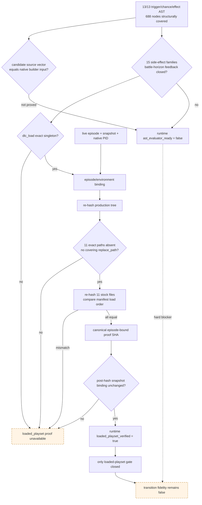
```mermaid
flowchart TD
    E["managed environment fingerprint"] --> D{"dlc_load exact singleton?"}
    S["live episode + snapshot + native PID"] --> B["episode/environment binding"]
    D -->|no| U["loaded_playset proof unavailable"]
    D -->|yes| B
    B --> T["re-hash production tree"]
    T --> O{"11 exact paths absent<br/>no covering replace_path?"}
    O -->|no| U
    O -->|yes| H["re-hash 11 stock files<br/>compare manifest load order"]
    H -->|mismatch| U
    H -->|all equal| P["canonical episode-bound proof SHA"]
    P --> Q{"post-hash snapshot binding unchanged?"}
    Q -->|no| U
    Q -->|yes| L["runtime loaded_playset_verified = true"]
    A["13/13 trigger/chance/effect AST<br/>688 nodes structurally covered"] --> C{"candidate source vector<br/>equals native builder input?"}
    C -->|not proved| V["runtime ast_evaluator_ready = false"]
    A --> E{"15 side-effect families<br/>battle-horizon feedback closed?"}
    E -->|no| V
    L --> F["only loaded-playset gate closed"]
    V -. "hard blocker" .-> X["transition fidelity remains false"]
    F --> X
    classDef unknown stroke-dasharray: 6 4,fill:#fff4e5,stroke:#b36b00;
    class U,X unknown;
```

normalized AST 当前使用的表达式节点是 `const_bool/const_fixed/state_ref/all/any/not/compare`、
`add/subtract/multiply/divide/floor/ceiling`、source-order `modifier_sequence`、`if/sequence`、
`select_side_knight` 与 `random_list`。transition 通过稳定 `call_transition.key` 表示；candidate builder 算法及 production proof 已接入，但 participant
detach/recompute、delayed scheduler 和 loaded override 仍需在各自 fidelity 层处理。immutable loader 本身只读取和审计
manifest，不能单独把 `ast_evaluator_ready` 改成 `true`；该 gate 由下节独立 evaluator 的 structural audit、candidate input equality、
battle-horizon feedback closure 与原生 trace 证据共同约束。

## 已落地的 strict AST evaluator 与状态转移 kernel

[implementation-confirmed] 独立模块
[`phase_event_evaluator.py`](../../ck3_autonomous_player/src/xar_autoplayer/simulation/phase_event_evaluator.py)
冻结 evaluator 版本 `ck3-1.19.0.6-stock-phase-event-ast-v3` 与 canonical SHA-256
`29C1B1B01E23F7CF37266D075D33E6BB5EAB75480FDF0B0E53D7BAAFB41CA62B`。它不是通用 Paradox 脚本解释器：
value node、effect node 和 `call_transition` 各有 exact-key schema 白名单，未知 opcode、额外字段、未知 observational effect、
缺 state ref、错误类型、除零、int64 越界或 draw tape 不足都会使本次 payload/effect fail closed。canonical audit 覆盖
4 个 commander row、9 个 knight row、688 个 AST node，trigger/chance/effect 分别为 `13/13/13`，direct/internal transition
分别为 `12/3`，unsupported 列表必须为空。

求值严格使用 selector 实际创建的 Character `root` 与唯一 named `combat_side`；`scope:owner` 固定 absent，尤其不会把
owner 猜成 root、liege 或 army owner。row 与 `random_list` 保留 source order；`random_side_knight` 的**算法**已按下段原生链执行，
production v3 还必须提供与 side index、army/character/regiment roster 绑定的 actual `CCombatSide` candidate-source proof。
所有 chance 和 effect weight 都是 signed Q100000，乘除每一步向零截断；顶层 event weight 再做 signed `/100000` 向零截断。

[static-confirmed] `random_side_knight` 的原生链与 v3 input equality proof 现均已闭合：RTTI
`CScriptedListEffect<CRandomInScriptedListEffect,CCombatSideKnightListBuilder>` vtable 是 RVA `0x41DE5C0`；builder
`0x19DD670` 按实际 `CCombatSide+0x40/+0x4C`、stride `0x60` 扫描，row `+0x08` RegimentID 经
`CRegiment+0x148` 取 CharacterID，只跳过 `-1` 并按 source order append。limit/compaction `0x19F4760` 对新增段逐项求值；
拒绝项由当前 vector 最后一项覆盖并 `count--`，同一 index 重试，所以是 deterministic tail-swap-remove，不是 stable erase。
`0x3388410` 先把 source predicate `effect+0x60`，再把 `effect+0x220[0..count)` 的每个 predicate 交给
`0x19F4760`；每轮都与 shared predicate `effect+0x140` 配对。某 predicate 有 compiled trigger 时，接收器固定先求 shared、
再求 source，空 trigger 为 true；任一 false 都执行上述 tail-swap-remove。selector `0x33E87E0→0x33E8D40` 对 compaction
后顺序用 `0x337B310` 求 signed Q100000 weight：先向零取 64-bit 商，仅对正数非零余数 `+1`，再存低 int32；单项不 clamp、
不跳过，`add esi,ebx` 的 total 也按 int32 二补码回绕。total `>0` 时消费 `draw31 % total`，逐项 signed-int32 减权，
第一次结果为负即命中（遍历未命中回 index 0）；total `<=0` 或没有 weight expression 时，只要候选非空仍消费一次 draw，
取 `draw31 % candidate_count`。冻结 policy tag 为 `ccombat_side_knight_source_then_tail_swap_remove_v1`，evaluator 的四候选
golden 特意让 stable-filter 得到 `B,D`、原生 tail-swap 得到 `D,B`，并冻结负/零权与 int32 wrap。production side 现发布
`candidate_source_proof`，policy 为 `ccombat_side_commanders_then_knights_native_source_equivalence_v1`：ordered rows 固定先
commander 后 knight，commander RegimentID 为 null、knight RegimentID 为正 full ID。digest preimage 是 native key order 的 compact JSON
`policy,side_index,ordered_sources(role,source_army_id,source_regiment_id,character_id)`。strict normalizer 不仅重算 uppercase SHA-256，
还逐行要求 army 属于该 side、commander/knight subsequence 与 side roster 完全相等，并唯一匹配 character 的 role/army/regiment。
因此正式 available payload 得到 `algorithm_ready=true`、`materialization_input_ready=true` 与组合 gate true；静态 audit 没有 payload 时
仍保持 input false，不能把一次 proof 升级成全局事实。

离线 trial state 会写回 root/selected knight 的 prowess、blademaster trait/XP、berserker/incapable、wounded rank、四类 maim、
alive/death；death 会从对应 side membership 和 enemy-knight roster 移除角色，commander death 同时移除 commander identity 与
其已知 dynamic advantage contribution，并从 static accumulator 与两侧新 total 重算离线 resolved advantage。liege
`accolade_progress` 与 13 个 attribute-unlock variable 也按 source-order branch 写回。character stats、side strength、participant
detach 与 advantage refresh 都留下显式 recompute 集；延迟和纯观测副作用只进入 typed ledger，不会被悄悄改成 no-op。

“进入 typed ledger”不等于证明对战斗无反馈。当前逐项 battle-horizon ledger 如下；没有一项仅凭名称被裁掉：

| effect | 已有静态事实 | 未闭合反馈 / 结论 |
|---|---|---|
| `accolade_eligibility_interface_message` | unlock variable 写入后调用 interface effect | engine callback 未 trace；unresolved |
| `battle_death_variables` | 同步写死亡 metadata variables | remaining-battle consumers 未闭合；unresolved |
| `battle_event` | 同步调用 native battle-event effect | before/after 与 callback 未 trace；unresolved |
| `battle_location_variable` | 新 memory 同步写 location variable | memory-variable consumers 未闭合；unresolved |
| `cranial_trophy` | `knight_killed` 条件分支同步执行 | resulting trait/modifier/stat 未建模；unresolved |
| `delayed_epilepsy_risk` | `20_health_effects.txt:1055-1063` 最短 30 日 | battle 无 `<30日` 上界；不能排除 horizon 内触发 |
| `delayed_infection_or_treatment` | `20_health_effects.txt:1159-1167` 最短 2 日 | battle 无 `<2日` 上界；不能排除 horizon 内触发 |
| `glory` | `add_glory` 同步改变 accolade | rank/parameter/knight-effectiveness/advantage 回流未闭合；unresolved |
| `hold_court_delayed_event` | variables 同步移除，`hold_court.8053` 延迟 1 日 | 1 日明确在可能 battle horizon 内；unresolved |
| `house_relation` | `change_house_relation_effect` 同步 mutation | 后续 predicate/stat 回流未闭合；unresolved |
| `memory` | 同步 `create_character_memory` | callbacks 与 horizon consumers 未 trace；unresolved |
| `mongol_beheaded_variables` | 条件分支写 beheading variables | consumers 未闭合；unresolved |
| `prestige` | `add_prestige` 同步 mutation | callback/derived combat feedback 未 trace；unresolved |
| `slain_list` | 同步写 slain-character list | later battle-stage consumers 未闭合；unresolved |
| `toast` | native toast block 包围/携带即时 gameplay effects | 独立 engine callback 未 trace；unresolved |

### `add_glory` 同步写回与 rank feedback exact-build 链

[static-confirmed] stock `add_glory` 不是只显示通知的观测副作用。`CAddGloryEffect` 的 execute
slot 是 RVA `0x2E5B6F0`：它先用 `0x9698B0` 求 signed Q100000 amount，再把 kind `0x24`
scope generation-resolve 为 `CAccolade*`，最后 tail-call
`0x251C2F0(CAccolade *accolade, int64_t delta_raw)`。`CAccolade` 仍必须经
`module+0x57BF1E0` store（fallback `module+0x57BF198`）解析并以 `+0x08` full ID 回读；
任何 fallback、generation 或 identity 漂移都使该次反馈对拍失败。

`0x251C2F0` 的原生顺序已经闭合：

1. 调 `0x251B780(accolade)` 取得写前 rank；
2. positive delta 乘以 accolade owner 的 `accolade_glory_gain_mult`（modifier enum `0x238`），
   使用原版 overflow-aware Q100000 乘法；non-positive delta 不走这个增益倍率；
3. 将结果加到 `CAccolade+0xB0` 的 signed Q100000 glory，并把负结果 clamp 为 `0`；
4. 同步触发 `on_accolade_glory_change`，stock on_action 把本次实际变化写入/累加
   `lifetime_glory` variable；
5. 再调 `0x251B780`；rank 改变时同步触发 `on_accolade_rank_change`，scope
   `positive` 表示升/降级，stock 分支还会触发 owner event 与首次 rank-up memory。

rank helper `0x251B780` 直接读取 `CAccolade+0xB0`，并按
`module+0x4F62B98` threshold vector / `module+0x4F62BA4` count 从高到低匹配；返回
`1` 或最高命中下标 `+1`。stock `NAccolade.ACCOLADE_GLORY_LEVELS` 是
`[100, 300, 600, 1000, 1500, 2100]` points，即 Q100000 raw
`[10000000, 30000000, 60000000, 100000000, 150000000, 210000000]`。
因此 trace/readback 的最小 typed 状态是
`{accolade_id, glory_raw_before, glory_raw_after, rank_before, rank_after}`；只记录 effect 名或输入
delta 不足以闭合反馈。

这条链目前仍是 fidelity 硬门：rank-change on_action、嘉奖参数、骑士 effectiveness 与 resolved
advantage 的同 battle-horizon 重算时点尚待 7-record original trace 逐项证明。不得因为 glory/rank
leaf 已可读，就把 `glory.feedback_closed` 或总 `ast_evaluator_ready` 提升为 `true`。

[stock-static-confirmed] 当前 sealed stock `common/on_action/accolade_on_actions.txt` 中，
`on_accolade_glory_change` 的 gameplay write 仅是初始化/累加 `lifetime_glory` variable；
`on_accolade_rank_change` 的 stock 分支只触发 owner 的 hidden notification event，并在首次升 rank 时为
acclaimed knight 创建 `accolade_ranked_up` memory。`accolade.0001/.0002` 的 immediate 也只物化
interface message。它们没有另一条显式 combat-stat writer；战斗内可能变化的参数来自当前 glory/rank
被 `0x251CB60(CAccolade*, parameter_id)` 等 getter 立即重新求值。当前 11-file phase-manifest
playset proof **尚未**包含 `accolade_on_actions.txt` 与 `accolade_events.txt`；提升这一 family 的
feedback gate 前必须把这两份 exact stock SHA/overlay coverage 纳入依赖闭包，不能把静态读取外推到覆盖了
on_action/event 的 mod playset。exact build `1.19.0.6` 当前原版字节哈希已经冻结为：

- `common/on_action/accolade_on_actions.txt`：
  `E41BB5D345F319C2B889E42CB578599E1763C57B89782566859679100340AAE5`；
- `events/accolade_events.txt`：
  `0E5ED632DF2ADE40EBFAE687BA61518447397E10D59BC1FFF8F5D9B44A5AFDCF`。

loaded-playset proof 必须同时验证这两个路径的原版 hash、production overlay absence 与
`replace_path` absence，才能把该依赖闭包判为当前 playset 已加载；只核对磁盘原版文件仍不够。
production trace 仍须证明一次 effect 后的 parameter rows、knight
contribution 与 advantage 何时刷新。


```mermaid
flowchart LR
    E["CAddGloryEffect<br/>0x2E5B6F0"] --> V["0x9698B0<br/>signed Q100000 delta"]
    V --> A["CAccolade generation resolve"]
    A --> B["rank_before = 0x251B780"]
    B --> M{"delta > 0?"}
    M -->|yes| G["multiply 1 + owner modifier 0x238"]
    M -->|no| W["use signed delta"]
    G --> C["CAccolade+0xB0 += delta<br/>clamp minimum 0"]
    W --> C
    C --> O["on_accolade_glory_change"]
    O --> R["rank_after = 0x251B780"]
    R --> Q{"rank changed?"}
    Q -->|yes| N["on_accolade_rank_change<br/>event/memory/parameter feedback"]
    Q -->|no| Z["no rank-change callback"]
    N -. "original 7-record trace pending" .-> U["feedback unresolved"]
    classDef unknown stroke-dasharray: 6 4,fill:#fff4e5,stroke:#b36b00;
    class U unknown;
```

### `send_interface_toast` 不是纯 UI：nested effect exact execution boundary

[static-confirmed] `send_interface_toast` 的注册字符串位于 RVA `0x4439F90`，注册点
`0x5C3831` 构造 `CEffectEntry<CSendInterfaceMessageEffect<1>>`（entry vtable
`0x443A420`）；loaded payload class vtable 是 `0x443A518`，execute slot `+0xB0`
为 `0x2E7A4B0`。该函数先构造本地 message scope、变量容器与 effect-local RNG，然后在
`0x2E7A9A1..0x2E7A9EE` 从**同一 loaded object** 的 vtable `+0x58` 取回原生
effect traversal，并恰好调用一次。调用返回后才继续把 message variables / portraits / text
交给 interface-message container。

因此 phase manifest 中 toast 内携带的 gameplay effect 不能裁成 UI no-op；即使测试环境不显示
toast，nested effect 仍已在 toast execute 返回前同步发生。7-record trace 对这一 family 的最小
判定是：side fire 前后 mutable state 差异必须等于 nested effect AST 的差异，且同一 toast 只出现
一次 traversal；在 original trace 尚未证明前，`toast.feedback_closed=false` 保持不变。

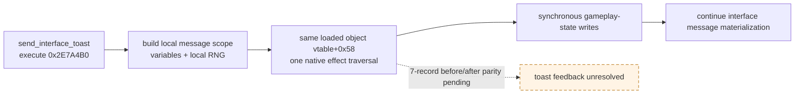
```mermaid
flowchart LR
    T["send_interface_toast<br/>execute 0x2E7A4B0"] --> C["build local message scope<br/>variables + local RNG"]
    C --> E["same loaded object vtable+0x58<br/>one native effect traversal"]
    E --> S["synchronous gameplay-state writes"]
    S --> M["continue interface message materialization"]
    E -. "7-record before/after parity pending" .-> U["toast feedback unresolved"]
    classDef unknown stroke-dasharray: 6 4,fill:#fff4e5,stroke:#b36b00;
    class U unknown;
```

### `battle_event` exact retained-ledger writer

[static-confirmed] `battle_event` 对应 `CBattleEventEffect`（RTTI vtable RVA
`0x444F498`），execute slot `+0xB0` 是 `0x2EB4330`。它从真实
`CCombatSide` scope 经 `0x2011090` 取得所属 `CCombat*`，读取
`CCombat+0x708` full `BattleResultID`，严格 generation-resolve 到 Battle-result store，随后把
caller-owned `0x38`-byte row 交给 `0x130A660(BattleResult+0x188, row)` 追加。当前已闭合并由
trace ring 复制的 retained row 是：

```text
+0x08 int32 left_character_id
+0x0C int32 right_character_id
+0x10 MSVC string stable_key
+0x30 int32 type_raw
+0x34 uint8 side_index
+0x35 uint8 target_right
stride = 0x38
```

写入是同步的，且原生 effect 在 append 前还会根据 side/combat phase 规范化 `type_raw`；因此离线
kernel 必须对拍 append 后的 native row，而不是只对拍脚本输入。`0x130A660` 另有两个 native caller
`0x1303765/0x13056B6`，所以 retained ledger 也不能假设只包含 phase-script rows。当前 7-record ring
对 `BattleResult+0x188` 做全数组双遍复制与 stable-key 边界检查；在后续 battle-stage consumer 图仍未
闭合前，这一 family 继续保持 `battle_event.feedback_closed=false`。


```mermaid
flowchart LR
    E["CBattleEventEffect<br/>0x2EB4330"] --> S["resolve real CCombatSide"]
    S --> C["CCombat+0x708<br/>full BattleResultID"]
    C --> R["generation-resolve BattleResult"]
    R --> N["normalize phase/type/side fields"]
    N --> A["0x130A660 append<br/>BattleResult+0x188"]
    A --> T["7-record retained-ledger copy"]
    T -. "later consumer graph pending" .-> U["battle_event feedback unresolved"]
    classDef unknown stroke-dasharray: 6 4,fill:#fff4e5,stroke:#b36b00;
    class U unknown;
```

机器 ledger 对每一行还冻结 `direct_132_ref_intersection` 与 `required_closure_evidence`。其中 `glory` 明确与 side/selected-knight
accolade parameter tiers 及 knight contribution/advantage 相交；wound delayed event 与 wounded/alive/effective stats 相交；
cranial trophy 与 character trait/modifier/effective stats 相交。`prestige`、house relation、memory、death metadata/list/interface
行即使当前 direct 132 intersection 为空，也仍因 engine callback 或 remaining-battle consumer graph 未闭合而保持 false；“交集为空”
不是自动裁掉规则。三个 delayed family 分别要求 battle-horizon 上界或实际 day-scheduler transition model，不能用最短延迟替代证明。

独立 golden
[`v3_ast_evaluator_family_golden.json`](../../ck3_autonomous_player/tests/fixtures/combat_phase_events/v3_ast_evaluator_family_golden.json)
冻结每个 family 的三棵 AST hash/node count 和确定性 draw 场景；测试另覆盖 wound-rank-3 death、maim valid-weight、
prowess/blademaster 写回、death detach、commander advantage removal、accolade source-order、原生 side-knight tail-swap/int32
selector 以及 unknown node/effect 拒绝。
production v3 只在当前 payload 的 132 refs ready 且 audit 的 `event_row_count=13`、三类 covered 都为 13、unsupported
都为空时得到 `structural_ready=true`。native candidate materialization/order 已由当前 payload 的 strict proof 关闭；上述 15 项
feedback 仍未关闭，所以生产结果明确返回 `ast_evaluator_ready=false`。

即便后续关闭 feedback 门也仍不等于 original native trace parity：effect-local seed 派生、死亡后同日
participant/contribution/commander replacement refresh 时点仍需 ongoing-combat original trace 对拍。因此
`original_trace_ready=false`、`transition_fidelity_gate=false`、`planner_usable=false`、`active_attack_allowed=false` 保持不变。

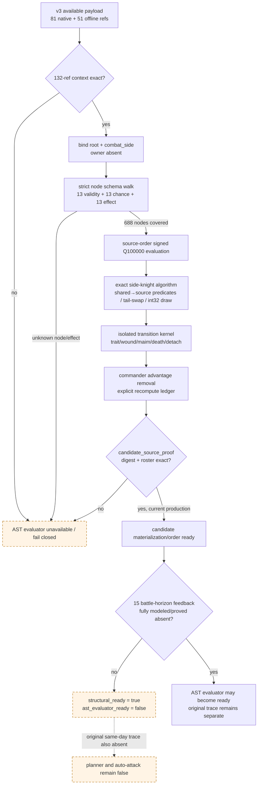
```mermaid
flowchart TD
    P["v3 available payload<br/>81 native + 51 offline refs"] --> C{"132-ref context exact?"}
    C -->|no| U["AST evaluator unavailable / fail closed"]
    C -->|yes| S["bind root + combat_side<br/>owner absent"]
    S --> V["strict node schema walk<br/>13 validity + 13 chance + 13 effect"]
    V -->|unknown node/effect| U
    V -->|688 nodes covered| W["source-order signed Q100000 evaluation"]
    W --> T["exact side-knight algorithm<br/>shared→source predicates / tail-swap / int32 draw"]
    T --> K["isolated transition kernel<br/>trait/wound/maim/death/detach"]
    K --> A["commander advantage removal<br/>explicit recompute ledger"]
    A --> N{"candidate_source_proof<br/>digest + roster exact?"}
    N -->|no| U
    N -->|yes, current production| M["candidate materialization/order ready"]
    M --> B{"15 battle-horizon feedback<br/>fully modeled/proved absent?"}
    B -->|no| R
    B -->|yes| E["AST evaluator may become ready<br/>original trace remains separate"]
    R["structural_ready = true<br/>ast_evaluator_ready = false"]
    R -. "original same-day trace also absent" .-> F["planner and auto-attack remain false"]
    classDef unknown stroke-dasharray: 6 4,fill:#fff4e5,stroke:#b36b00;
    class U,R,F unknown;
```

## v3 `phase_event_inputs`：缺字段即补 MCP

v2 的 contact observation 已给出军队 composition、commanders、knights、effective prowess/damage/toughness 与
terrain/crossing/holding，但 stock phase rows 还读取 martial、learning、trait rank/xp、doctrine/culture、
accolade、side ratio 等状态。因此 v2 不能把 13-row AST 的 required refs 填满，不能开放 exact Monte Carlo gate。

### Required-field matrix

“脚本来源”是上述 stock 文件中的 exact expression；“native 读取”只在已经定位 ABI 时填写地址。没有地址的行是
v3 逆向施工清单，不允许长期返回 `null` 后宣称 capability 完成。

| v3 域 | 每个对象必须发布的 raw 字段 | stock 使用者 / exact 脚本来源 | exact-build native 读取状态 |
|---|---|---|---|
| identity / role | full CharacterID、source army/regiment、attacker/defender、commander/knight、alive、`is_ai` | 所有 root/side iterator、effect alive gate | [static-confirmed] Character store `module+0x570C130`、identity `+0x18`；alive 是 validity vfunc 且 `+0x1C8==null`；`is_ai` 复用 `0x28BCEB0` 的 human-player ID membership 后取反；role/army membership 复用 v2 exact traversal |
| skills | martial、prowess、learning；三者都是 signed int32 point，`scale=1` | `commander_killed.is_valid`；全部 injury chance；`knight_increase_prowess_chance_effect` | [static-confirmed] 六技能数组从 `CCharacter+0xD4` 开始，enum `diplomacy/martial/stewardship/intrigue/learning/prowess = 0..5`；故三项分别为 `+0xD8/+0xE8/+0xE4` |
| wound / injury | wounded rank、fragile-bones present/xp、one-legged、disfigured、one-eyed、maimed、incapable | commander/knight valid/chance；`increase_wounds_effect`、`maimed_in_battle_effect` | [static-confirmed] stable-key Trait DB、`0x260F740` membership、`0x260F640` track span、`0x2CAFFD0` track-key index 已闭合；wounded rank 由 concrete `wounded_1/2/3` 唯一命中归一化 |
| combat/personality traits | berserker、shieldmaiden、brave、craven、wrathful、giant、calm、impatient、sadistic、ambitious、content、compassionate、temperate、lazy、patient，以及 accolade unlock 所需 trait/group 与 tourney XP | special attack valid/chance、injury/death chance、13 个 accolade random branch | [static-confirmed] concrete trait 继续使用 stable-key resolver 与 `0x260F740`；`physique_good` 等 group alias 必须经 `0x2CB33A0` descriptor + `0x261A730 > 0`，不能伪装成 concrete trait；tourney `bow/foot/horse` 复用 exact track span |
| perk / dynasty / difficulty | stalwart leader、warfare legacy 3、acclaimed、extreme-conqueror bonus、easy/very-easy | commander/knight none 与所有主要 chance modifier | [static-confirmed] Character→House→Dynasty perk、Character perk、Character→Accolade identity 与 current selected game-rule token membership 已分别闭合 `warfare_legacy_3`、`stalwart_leader_perk`、`is_acclaimed`、`easy_difficulty`、`very_easy_difficulty`；`conqueror` variable 与 loaded Character-modifier pointer membership 也已闭合 extreme bonus 的离线判定 |
| faith / culture | death-is-glory、warmonger、Germanic religion、north-Germanic heritage、knights-prone-to-injury、敌我 faith hostility、accolade 所需 innovation/tradition/parameter | injury chance、become-berserker、accolade fanatic/MAA branches | [static-confirmed] Character→Faith/Culture/Religion full-ID reader、doctrine/parameter reader、precontact request-order participant container、`0x24EDB20` directional faith-hostility、innovation `0x282CE90` mirror 与 tradition `0x282D990` mirror 均已闭合 |
| house / liege / accolade | root/liege house IDs、liege ID、can-be-acclaimed、accolade progress、root/side accolade parameter tiers、unlock variables、current accolade `men_at_arms` category | family protection、hostile-knight death tier、qualification valid/chance/effect | [static-confirmed] `0x2613480(CCharacter*)` 读取 liege，`CCharacter+0x150` 读取 full HouseID，`0x28A4870(character,null,null)` 读取当前 `can_be_acclaimed`；Character variable context、liege progress、source-order parameter roster 与 `0x2819960` category mirror 已闭合；13 个 branch-validity 由这些 raw leaves 离线组装 |
| side context | source-order commander/knight IDs、primary participant、side strength raw、side army size raw、敌方对应值 | side-knight iterator、outnumbering、5x immunity、valiant branch | [implementation-confirmed] v2 roster、request-order primary、`0x23CC340` strength、army-size mirror 与 accolade-parameter rows 已接入 production fixture；paused-live 待验收 |
| army MAA | regiment count、按 skirmisher/archer/crossbow/pike/heavy infantry/light cavalry/heavy cavalry/camel/elephant/horse archer/gunpowder 分类的 count | `knight_qualify_for_accolade` valid 与 13 个 random-list branches | [static-confirmed] `knight_army`、原版 total/base-type/exact-type 三条计数链与 11 个 family raw 已闭合；不能用 v2 `kind` 或 `CRegiment+0x118` 替代；完整 accolade branch AST 已在后文闭合 |
| current row differential | 对每个 Character/type/row 发布 `valid/chance_raw/int_weight` | selector `event+0x38/+0x118` | 仅真实 `CCombatSide`：`0x334C510`、`0x337B210` 已闭合；hypothetical precontact 明确 unsupported |
| advantage / dynamic effects | 每 army supply state；每 side first-army recently-disembarked、owner/debt selection、unreformed-faith；holding defender；source-order `CCombatEffect* + scale_raw` rows；constructor signed/clamped total；dynamic resolved raw；original raw advantage | phase damage 前的 advantage pipeline；不能只用 terrain/crossing/holding 与 commander generic points | [implementation-confirmed] constructor/source order、`0x2307CB0/0x2307680/0x2307230` zero-roll decomposition、canonical battle commander、无注册临时 context、teardown 与 original-total runtime equality gate 已接入 production；paused-live 待验收 |

### 132-ref quantitative closure ledger

该计数绑定 manifest `required_state_refs` 的 `count=132` 与 SHA-256
`2B5E8445EFD14DC65D8BA4046242BBC37A0226C2BCD971D805D9A6F0064A1DD0`。这里严格区分
“exact-build leaf reader ABI 已闭合”“production machine contract/fixture 已完成”与“production MCP 已实机验收”：
前两者已经 `132/132`，paused-live 仍是 `0/132`。capability 已正式广告，但不得把机器合同冒充 live evidence。
132 项中有 105 项 raw/container ref 与 27 项 derived ref；derived 只能由 raw leaves
在进程外按 manifest 计算，不应再造一个 native `derived.*` reader。

| 域 | manifest refs | exact leaf-backed refs | exact offline derived/container | 仍缺 | 边界 |
|---|---:|---:|---:|---:|---|
| character / relation | 79 | 59 | 20 | 0 | identity/alive/is_ai、三技能、trait-or-group membership/XP、house/liege/employer、dynasty/character perk、faith/culture/religion、innovation/tradition/parameter、government flag、`is_acclaimed/can_be_acclaimed`、current accolade category、variable、extreme-conqueror 与 Garuda leaf 已闭合；关系、blademaster、bounded variables、extreme bonus 与 accolade unlock container/13 branch-validity 离线组装 |
| army composition | 13 | 12 | 1 | 0 | `knight_army` 与原版 total/base-type/exact-type 计数链已闭合；11 个 family 是 leaf，`maa_counts` container 离线组装 |
| side | 10 | 8 | 2 | 0 | roster/commander/primary/strength/army-size、precontact request-order owner→FaithID 与 commander/knight accolade-parameter containers 已闭合 |
| global | 3 | 2 | 1 | 0 | easy/very-easy 是 current selected-token leaf；`game_rules` 是离线 container |
| derived | 27 | 0 | 27 | 0 | 所有 derived 均由已闭合 leaf/container 在进程外计算 |
| **总计** | **132** | **81** | **51** | **0** | ABI + production fixture `132/132`；paused-live 仍 `0/132` |

当前 51 项 exact offline derived/container 是：`root.house_and_liege_relations`、
`root.knight_army.maa_counts`、`game_rules`、`root.traits_and_culture_for_blademaster`、
`selected_enemy_knight.traits_and_culture_for_blademaster`、`root.variables`、`root.employer.variables`、
`root.ai_should_get_extreme_conqueror_bonuses`、`combat_side.enemy_faiths`、
`combat_side.ordered_commanders_and_knights_with_accolade_parameters`、`root.accolade_unlocks` 与它的 13 个
`*.valid`，以及
以下 27 项 explicit derived：`accolade_qualification_wound_factor_raw`、
`become_berserker_wound_factor_raw`、三项 candidate/root prowess threshold、
`enemy_alive_knight_at_or_below_root_opponent_threshold_exists`、`outnumbering_injury_factor_raw`、
`own_side_more_than_five_times_enemy`、`own_side_stronger`、`qualifying_enemy_knight_exists`、
`root_has_any_maim_injury`、`root_has_any_wounded_rank_1_2_3`、`root_injury_factor_30_raw`、
`root_is_wounded`、`root_wounded_rank_3`、`root_ai_stalwart`、`root_player_stalwart` 与
`root_injury_factor_{30,40}_with_garuda_raw`、`enemy_hostile_knight_death_accolade_{any_tier,factor_raw}` 与
`same_house_defends_family_{any_tier,factor_raw,tier_high,tier_low_only,tier_medium_only}`。它们的输入现均来自 exact roster/skills/traits/side raw，不能由
native 重复发布一个可能漂移的结果。`stock_enemy_knight_selection_weight_raw` 也已由 candidate 的 exact
`is_acclaimed`、stalwart perk 与 warfare legacy 三个 leaf 按 stock source order 离线闭合。

ABI-level 已没有缺失 ref。这里的 `132/132` 只表示每个 manifest state ref 都有 exact-build raw reader 或确定的
offline AST；它不表示相应 native DTO、serializer、MCP、fixture 与 paused-live 已经完成。尤其不能把
attribute-unlock variable presence 或 MAA count 单独冒充 `*.valid`；完整 13-branch AST 在后文冻结。

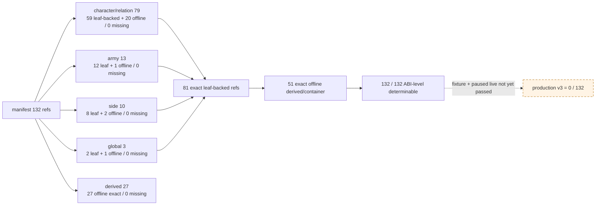
```mermaid
flowchart LR
    M["manifest 132 refs"] --> C["character/relation 79<br/>59 leaf-backed + 20 offline / 0 missing"]
    M --> A["army 13<br/>12 leaf + 1 offline / 0 missing"]
    M --> S["side 10<br/>8 leaf + 2 offline / 0 missing"]
    M --> G["global 3<br/>2 leaf + 1 offline / 0 missing"]
    M --> D["derived 27<br/>27 offline exact / 0 missing"]
    C --> R["81 exact leaf-backed refs"]
    A --> R
    S --> R
    G --> R
    R --> O["51 exact offline derived/container"]
    O --> K["132 / 132 ABI-level determinable"]
    K -. "fixture + paused live not yet passed" .-> P["production v3 = 0 / 132"]
    classDef unknown stroke-dasharray: 6 4,fill:#fff4e5,stroke:#b36b00;
    class P unknown;
```

### Character skill / alive / trait exact-build reader ABI

[static-confirmed] 这组 reader 只依赖已经由 full-generation CharacterID 解析出的 `CCharacter*` 与 loaded Trait DB，
不需要 `CCombatID`、不构造 scope token、不抽 RNG，也不写游戏状态。技能数组的原版注册链
`0xD02160..0xD02310` 把六个名字绑定到 enum `0..5`；通用消费者 `0xD0EAA1/0x1905238`
先验证 enum `<6`，再读 `CCharacter+0xD4+4*enum`。因此 combat 所需字段为：

```cpp
enum class SkillKind : int32_t {
    diplomacy = 0, martial = 1, stewardship = 2,
    intrigue = 3, learning = 4, prowess = 5,
};

// CCharacter + 0xD4: int32_t skill_points[6]
// martial +0xD8; learning +0xE4; prowess +0xE8
// wire scale is 1, not Q100000.
```

alive 与 `is_ai` 的原版 compiled evaluator 分别位于 vtable `0x43B6810/0x43B6640` 的 `+0xD8` slot，
实现为 `0x2893970/0x288D4F0`。native 不调用这两个需要 compiled-object/scope 的入口，而是镜像其已经闭合的
leaf 语义：

```cpp
bool character_alive = character_validity_vfunc_plus_8(character + 0x10)
                    && *reinterpret_cast<void**>(character + 0x1C8) == nullptr;

bool is_human_player_character(int32_t full_character_id); // RVA 0x28BCEB0
bool character_is_ai = character_alive
                     ? !is_human_player_character(full_character_id)
                     : true;
```

`0x28BCEB0` 只读搜索当前 human-player CharacterID 集合；其 root 是
`module+0x570E068 -> +0xA0`，数组 data/count 在该对象 `+0x1D560/+0x1D56C`。这与原版 `is_ai`
evaluator 对 invalid/dead character 返回 `true` 的边界一致。query row 仍必须先通过 full-generation identity gate；
不得把 sentinel Character 当作一个可用 AI participant。

Trait 读取链为：

```cpp
TraitDbContext* trait_database();                                  // RVA 0x8318F0
const CTrait* resolve_trait_id(TraitDbContext*, int32_t trait_id); // RVA 0xBDC1D0
bool character_has_trait(CCharacter*, const CTrait*);              // RVA 0x260F740

struct TraitTrackSpan { const int64_t* data; int32_t count; /* pad */ };
TraitTrackSpan* character_trait_tracks(
    CCharacter*, TraitTrackSpan* out, const CTrait*);               // RVA 0x260F640
int32_t trait_track_index(
    const CTrait*, const std::string* stable_track_key);            // RVA 0x2CAFFD0

// Initializer 0x28803C0 first obtains the Trait DB with 0x8318F0,
// then resolves a stable script key to a concrete-trait-or-group descriptor.
const TraitOrGroupDescriptor* resolve_trait_or_group(
    TraitDbContext*, const StringView* stable_key);                  // RVA 0x2CB33A0
int32_t character_trait_or_group_rank(
    CCharacter*, const TraitOrGroupDescriptor*);                    // RVA 0x261A730
```

- Trait DB 的 pointer array/count 在 context `+0x68/+0x74`；`CTrait+0x10` 是 full trait ID，stable key
  `std::string` 在 `+0x18`（length `+0x28`、capacity `+0x30`、capacity `<16` 时 SSO）。native 按 manifest
  required stable keys 枚举并要求唯一命中，不能硬编码本次进程的 trait ID 或 pointer。
- `0x260F740` 取 `CTrait+0x10`，在 `CCharacter+0xF0/+0xFC` 的升序 int32 trait-ID array 做 exact
  lower-bound。required key 缺失/重复、array 非法/失序/重复都使整个 `phase_event_inputs` unavailable。
- 原 `has_trait` literal 在 RVA `0x4298FA8`，注册函数始于 `0x54D280`；constant evaluator
  `0x2880700` 对 compiled object `+0x108` 的 descriptor 调 `0x261A730`，返回值 `>0` 才是 true。
  descriptor 的 concrete `CTrait*` child array 位于 `+0x08`，signed count 位于 `+0x14`；helper 以
  `count-1 .. 0` 顺序读取 child `CTrait+0x10` full ID 并搜索 Character trait-ID span，返回一基 child rank，
  无命中返回 `0`。因此 `physique_good`（`physique_good_1/2/3` 的 group）必须走该 helper；把 group 名送入
  `0x260F740` 或硬猜一个 concrete ID 都是错误实现。所有 direct trait 也可统一走 descriptor helper，前提是
  descriptor/key/child 列表经 exact round-trip 且结构合法。
- wounded rank 不调用未闭合的 generic group-rank helper；只允许 concrete keys `wounded_1/2/3` 中零个或一个
  命中，映射为 rank `0..3`。多个 wounded key 同时命中是 malformed snapshot，必须原子失败。
- `CTrait+0x288/+0x294` 是 track descriptor array/count，stride `0x650`；每个 descriptor `+0x00`
  是 stable track-key string。`0x260F640` 返回 `CCharacter+0x138/+0x144` 所对应的 flat qword span；raw 是
  Q100000。`0xBD5A7B/0xBD5AD2` 以 `0x989680` 表示 100 points，形成独立 scale 互证。
- 脚本省略 `track` 时只在该 trait 恰有一个 track 时取 index 0；显式 `track=fragile_bones` 必须由
  `0x2CAFFD0` exact-key 命中。原版 `has_trait_xp` evaluator `0x287D800` 在 `0x260F640` 成功返回
  `span.count==0` 时于 `0x287D895` 明确输出 raw `0`，所以 absent trait / canonical empty span 是 exact `0 XP`。
  只有 track index `-1`、nonempty span index 越界、DB/descriptor malformed 或 helper ABI 失败才是 whole-v3
  unavailable。
- accolade trigger 的 `tourney_participant` 先经 `0x2CB33A0` 解析；production reader 必须确认该 descriptor
  唯一指向一个 concrete `CTrait`，再对同一 Character 调 `0x260F640`，并以 `0x2CAFFD0` exact-key 解析
  `bow`、`foot`、`horse` 三个 track。wire 均为 signed Q100000；脚本阈值 `30` 即 raw `3000000`。
  absent trait/canonical empty span 是原生确定的 `0`，但 descriptor 多 child、track key missing/OOB、span malformed
  或 generation/revision 漂移必须使 whole v3 unavailable。

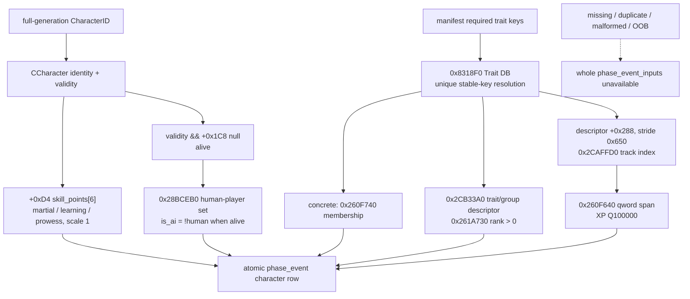
```mermaid
flowchart TD
    I["full-generation CharacterID"] --> C["CCharacter identity + validity"]
    C --> S["+0xD4 skill_points[6]<br/>martial / learning / prowess, scale 1"]
    C --> L["validity && +0x1C8 null<br/>alive"]
    L --> A["0x28BCEB0 human-player set<br/>is_ai = !human when alive"]
    M["manifest required trait keys"] --> D["0x8318F0 Trait DB<br/>unique stable-key resolution"]
    D --> H["concrete: 0x260F740 membership"]
    D --> G["0x2CB33A0 trait/group descriptor<br/>0x261A730 rank > 0"]
    D --> X["descriptor +0x288, stride 0x650<br/>0x2CAFFD0 track index"]
    X --> P["0x260F640 qword span<br/>XP Q100000"]
    S --> O["atomic phase_event character row"]
    A --> O
    H --> O
    G --> O
    P --> O
    E["missing / duplicate / malformed / OOB"] -.-> U["whole phase_event_inputs unavailable"]
```

### Blademaster transition input container

[static-confirmed] `root.traits_and_culture_for_blademaster` 与
`selected_enemy_knight.traits_and_culture_for_blademaster` 不是新的原生状态对象；它们是
`knight_increase_prowess_chance_effect` 对既有 Character trait/XP 与 Culture parameter leaf 的离线分组。
原版来源为 `00_commander_effects.txt` 的 source-order modifiers；其中
`has_education_martial_trigger` 已在 `00_scripted_triggers.txt` 展开为
`education_martial_1..5` 的 OR，`trait_third_level` 在 `00_trait_values.txt` 固定为 100 points，
对应现有 wire 的 Q100000 raw `10000000`。因此 native 不发布一个不透明 bool，也不执行 scripted effect；它扩展
本节既有 Trait DB 唯一 stable-key lookup、concrete `0x260F740` membership、trait/group descriptor
`0x2CB33A0` + `0x261A730`、`0x260F640` XP 与 Culture parameter reader：

```cpp
struct BlademasterTransitionLeaves {
  bool education_martial[5];          // education_martial_1..5
  bool education_martial_prowess[4];  // education_martial_prowess_1..4
  bool lifestyle_blademaster;
  bool shrewd;
  bool physique_good;                 // trait group rank > 0, not a concrete key
  bool intellect_good[3];              // intellect_good_1..3
  bool culture_more_common;            // blademaster_traits_more_common
  std::int64_t lifestyle_blademaster_xp_raw; // Q100000
};
```

离线 transition 严格保留原版顺序：10-weight branch 依次加 `+5`（任一 martial education）、
`+4/+8/+12/+16`（martial prowess education 1..4）、`+15`（lifestyle blademaster）、
`+10`（shrewd）、`+10`（physique_good）、`+5/+15/+30`（intellect 1..3）；随后 culture parameter
命中时乘 `3`；最后当 lifestyle blademaster 存在且 XP `>=10000000` 时乘 `0`。不能把多个命中的
education/intellect trait 擅自归一为最高 rank：原脚本是逐 modifier 累加；若游戏状态允许多个 key 同时存在，就按
原 source order 全部应用。60-weight branch 的 learning 修正与 dynasty factor、30-weight prowess 分支仍读取各自已经
闭合的 leaf，不属于这个容器。

```json
{
  "traits_and_culture_for_blademaster": {
    "education_martial": [false, false, false, false, true],
    "education_martial_prowess": [false, false, false, true],
    "lifestyle_blademaster": true,
    "lifestyle_blademaster_xp_raw": 10000000,
    "shrewd": false,
    "physique_good": false,
    "intellect_good": [false, false, true],
    "culture_blademaster_traits_more_common": true
  }
}
```

所有 required trait/parameter key 必须在 loaded DB/identifier registry 中唯一命中并 exact round-trip；任一 key
缺失/重复、Character/Culture generation 改变、trait span 非法或 XP track 越界，均使整个
`phase_event_inputs` 原子 unavailable，不能只把单项填 `false/null`。fixture 至少覆盖：各 additive modifier、多个
trait 同时命中、culture 乘法位于 additive 后、level-3 XP 零化、absent lifestyle trait 的 canonical XP=0，及
root/selected-enemy 相同 CharacterID 得到相同容器。由此两项 manifest container 已可从 exact leaves 离线组装，
无需新增 native derived reader；production fixture 与 paused-live 仍未通过。

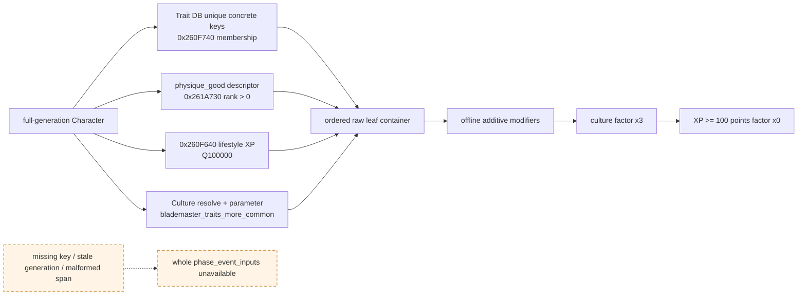
```mermaid
flowchart LR
    C["full-generation Character"] --> T["Trait DB unique concrete keys<br/>0x260F740 membership"]
    C --> TG["physique_good descriptor<br/>0x261A730 rank > 0"]
    C --> X["0x260F640 lifestyle XP<br/>Q100000"]
    C --> U["Culture resolve + parameter<br/>blademaster_traits_more_common"]
    T --> B["ordered raw leaf container"]
    TG --> B
    X --> B
    U --> B
    B --> A["offline additive modifiers"]
    A --> M["culture factor x3"]
    M --> Z["XP >= 100 points factor x0"]
    E["missing key / stale generation / malformed span"] -.-> F["whole phase_event_inputs unavailable"]
    classDef unknown stroke-dasharray: 6 4,fill:#fff4e5,stroke:#b36b00;
    class E,F unknown;
```

### House / liege exact-build reader ABI

[static-confirmed] 这组关系 leaf 可在 hypothetical precontact 中直接从已通过 full-generation gate 的
`CCharacter*` 读取，不依赖 `CCombatID`、scope token 或临时 combat。原版 `liege` scope 的最终 vtable
为 `0x41D4CF8`，`+0x20` evaluator `0x19D4380` 在解析 Character token 后调用以下只读 helper：

```cpp
// 返回当前 liege；无 liege 时返回原版 canonical Character fallback。
const CCharacter* character_liege(const CCharacter* character); // RVA 0x2613480

// CCharacter identity: full CharacterID at +0x18
// CCharacter house: full HouseID at +0x150
// Character store/fallback: module+0x570C130 / module+0x570C138
// House store/fallback:     module+0x570C408 / module+0x570C400
// CHouse identity: full HouseID at +0x10
```

原版 `house` scope evaluator `0x19D75B0` 直接读取 `CCharacter+0x150` 并发出 kind `0x14`
的 House token，因此 bridge 应发布 full HouseID，而不是 house pointer、低位 slot 或本次进程内索引。
读取边界固定如下：

- 输入 CharacterID 必须先经 `module+0x570C130` full-generation resolve，并由 `CCharacter+0x18`
  回读同一 ID；调用前后都要做 generation/identity revalidation。
- `0x2613480` 返回 canonical Character fallback 且其 ID 为 `-1` 时，liege 是可确定的
  `absent`，不是 `unavailable`；不得继续发布 fallback 对象的 house/skills/traits。
- 非 fallback 返回值必须从 `+0x18` 取得 full CharacterID，再经 Character store 回解到同一 pointer，
  并通过 validity gate；fallback 不匹配、回解不一致或 snapshot 中途变化都令整个 v3 原子失败。
- `CCharacter+0x150 == -1` 表示 house `absent`。其它值必须经 House store full-generation resolve，
  并由 `CHouse+0x10` 回读一致；相同规则同时应用于 root 和已验证 liege。
- `root.house_and_liege_relations` 不设 native reader：仅当 root house、liege 和 liege house 三个状态都
  `available` 时，在进程外比较两个 full HouseID；任一关系为 `absent` 时结果严格为 `false`。

建议 wire 保留“关系缺席”和“读取失败”的差别：

```json
{
  "relations": {
    "house": {"status": "available|absent", "house_id": 123},
    "liege": {
      "status": "available|absent",
      "character_id": 456,
      "house": {"status": "available|absent", "house_id": 123}
    }
  }
}
```

当 `status=absent` 时对应 ID 必须为 `null`；`unavailable` 不允许伪装成 `absent` row，而是沿
`phase_event_inputs` 原子失败路径返回。由此在 ABI 层闭合四项 manifest ref：`root.house_id`、
`root.liege`、`root.liege.house_id` 与离线 container `root.house_and_liege_relations`。fixture 至少覆盖
无 liege、liege 无 house、同 house、不同 house、stale-generation 以及非 canonical fallback；paused-live
通过前 production 计数仍为零。

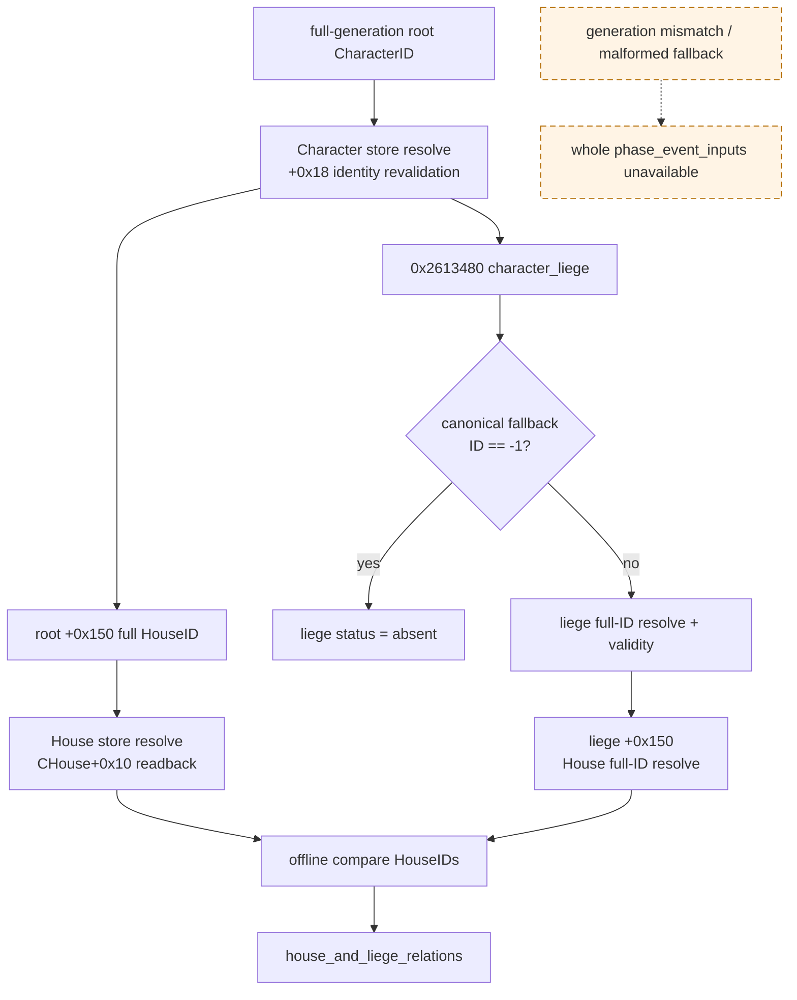
```mermaid
flowchart TD
    I["full-generation root CharacterID"] --> R["Character store resolve<br/>+0x18 identity revalidation"]
    R --> H["root +0x150 full HouseID"]
    R --> L["0x2613480 character_liege"]
    H --> HS["House store resolve<br/>CHouse+0x10 readback"]
    L --> F{"canonical fallback<br/>ID == -1?"}
    F -->|yes| A["liege status = absent"]
    F -->|no| LC["liege full-ID resolve + validity"]
    LC --> LH["liege +0x150<br/>House full-ID resolve"]
    HS --> E["offline compare HouseIDs"]
    LH --> E
    E --> O["house_and_liege_relations"]
    X["generation mismatch / malformed fallback"] -.-> U["whole phase_event_inputs unavailable"]
    classDef unknown stroke-dasharray: 6 4,fill:#fff4e5,stroke:#b36b00;
    class X,U unknown;
```

### Dynasty perk exact-build reader ABI

[static-confirmed] stock phase rules 的 `dynasty ?= { has_dynasty_perk = warfare_legacy_3 }`
可以完全拆成 Character→House→Dynasty 的 generation-safe leaf 与 loaded DynastyPerk DB 的 pointer membership，
不需要执行 compiled trigger，也不需要伪造 scope token。原版 Character `dynasty` scope evaluator
`0x19D7330` 先解析 kind `4` Character，读取 `CCharacter+0x150` HouseID，解析 House 后读取
`CHouse+0x2C` full DynastyID，并发出 kind `0x13` Dynasty token。

```cpp
struct DynastyPerkDb;
struct CDynasty;
struct DynastyPerk;

DynastyPerkDb* dynasty_perk_database(); // RVA 0xC8CF40

// Exact pointer-membership helper used by has_dynasty_perk evaluator 0x283ADD0.
// Return value == end means absent; otherwise it points at the matching slot.
DynastyPerk** find_dynasty_perk_pointer(
    DynastyPerk** begin,
    DynastyPerk** end,
    DynastyPerk* const* needle);          // RVA 0x9A3E60

// Character +0x150: full HouseID
// CHouse    +0x10: full HouseID identity
// CHouse    +0x2C: full DynastyID
// CDynasty  +0x10: full DynastyID identity
// CDynasty  +0x170/+0x17C: DynastyPerk** data / int32 count
// Dynasty store/fallback: module+0x570C748 / module+0x570C700
```

loaded perk definition 的稳定解析链也已闭合：`0xC8CF40()` 返回的 DB 在 `+0x68/+0x74` 保存
`DynastyPerk** data / int32 count`；每个 `DynastyPerk+0x18` 是 stable-key `std::string`
（length `+0x28`、capacity `+0x30`、capacity `<16` 时 SSO）。原版 compiled-object 初始化
`0x283C430` 会把脚本 key 解析到同一 perk pointer 并存于 object `+0x70`；其 evaluator
`0x283ADD0` 随后对 `CDynasty+0x170/+0x17C` 调 `0x9A3E60`。bridge 不必构造 compiled object：
它按 manifest 固定 key 枚举 loaded DB，要求 `warfare_legacy_3` **唯一**命中，再调用同一 membership helper。

严格边界如下：

- Character、House、Dynasty 每一层都用 full ID resolve、对象 identity readback 和 query 前后 generation
  revalidation；不得把低 24-bit slot 当成 ID。
- Character house 为 `-1`，或已验证 House 的 dynasty 为 `-1`，表示 `dynasty.status=absent`；脚本的
  optional scope 在该 Character 上严格得到 `warfare_legacy_3=false`，不是 `unavailable`。
- loaded DB key 缺失/重复、DB/perk-list count 非法、fallback 混入、pointer span 溢出或任一层 generation
  不一致，都令整个 `phase_event_inputs` 原子失败，不能把它们降级成“没有 perk”。
- native 只发布 raw dynasty identity 与稳定 key membership；root/candidate/selected-enemy 三处 AST 引用
  都复用同一 schema，不分别执行 trigger。

```json
{
  "dynasty": {
    "status": "available|absent",
    "dynasty_id": 123,
    "perks": {"warfare_legacy_3": true}
  }
}
```

`status=absent` 时 `dynasty_id=null` 且 membership 固定 `false`。这个 slice 在 ABI 层同时闭合
`root.dynasty.perks.warfare_legacy_3`、`candidate.dynasty.perks.warfare_legacy_3` 与
`selected_enemy_knight.dynasty.perks.warfare_legacy_3` 三项 manifest ref。fixture 至少覆盖 perk present、
valid dynasty without perk、no house、no dynasty、missing/duplicate loaded key、stale House/Dynasty generation、
malformed pointer span；paused-live 通过前 production 计数仍为零。

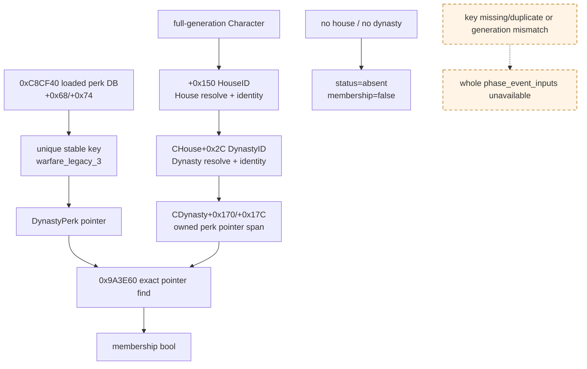
```mermaid
flowchart TD
    C["full-generation Character"] --> H["+0x150 HouseID<br/>House resolve + identity"]
    H --> D["CHouse+0x2C DynastyID<br/>Dynasty resolve + identity"]
    DB["0xC8CF40 loaded perk DB<br/>+0x68/+0x74"] --> K["unique stable key<br/>warfare_legacy_3"]
    K --> P["DynastyPerk pointer"]
    D --> A["CDynasty+0x170/+0x17C<br/>owned perk pointer span"]
    P --> F["0x9A3E60 exact pointer find"]
    A --> F
    F --> B["membership bool"]
    N["no house / no dynasty"] --> Z["status=absent<br/>membership=false"]
    X["key missing/duplicate or generation mismatch"] -.-> U["whole phase_event_inputs unavailable"]
    classDef unknown stroke-dasharray: 6 4,fill:#fff4e5,stroke:#b36b00;
    class X,U unknown;
```

### Character perk exact-build reader ABI

[static-confirmed] `has_perk = stalwart_leader_perk` 与 dynasty perk 是两个不同的原生数据库和 ownership
span，不能把 lifestyle perk 当成 trait 或 dynasty pointer。trigger 注册字符串 `has_perk` 位于
`0x438FE18`；其 factory `0x28681C0` 生成 final vtable `0x4390550` 的 compiled object，evaluator
`0x2867940` 在解析 kind `4` Character 后使用以下两条 getter：

```cpp
struct CharacterPerkSpan {
    CharacterPerk** data;  // +0x00
    // +0x08 padding/implementation state
    int32_t count;         // +0x0C
};

// If CCharacter+0x1A8 exists, returns
//   reinterpret_cast<CharacterPerkSpan*>(*(character+0x1A8) + 0x220).
// Otherwise returns the canonical empty span at RVA 0x4FF33B8.
CharacterPerkSpan* character_perks(const CCharacter* character); // RVA 0x2669170

// Exact pointer membership used by the compiled has_perk evaluator.
bool character_perk_span_contains(
    const CharacterPerkSpan* span,
    CharacterPerk* const* needle);                            // RVA 0x9A3C20

CharacterPerkDb* character_perk_database();                   // RVA 0x88EC20
```

`0x88EC20()` 返回的 loaded CharacterPerk DB 同样在 `+0x68/+0x74` 保存 pointer array/count；
枚举 caller `0xE702D2..0xE70306` 逐项把 `CharacterPerk+0x18` 当作 stable-key string 使用，确认其
length/capacity 位于 `+0x28/+0x30`。compiled-object initializer `0x2867FD0` 用字符串 hash 经
`0xC90500` 取得同一 pointer；bridge 为拒绝 hash collision/fallback，直接枚举 loaded DB 并要求
`stalwart_leader_perk` 唯一命中，再把 pointer 交给原版 `0x9A3C20`。

严格边界：

- 输入 Character 仍须通过 full-generation identity/validity gate；`CCharacter+0x1A8==null` 时原版
  `0x2669170` 返回 canonical empty span，因此 membership 是可确定的 `false`，不是读取失败。
- DB key 缺失/重复、pointer/count span 非法、fallback pointer 混入、membership helper ABI 异常或
  Character generation 在调用前后改变，都令整个 v3 原子失败。
- wire 使用 manifest 语义名 `perks.stalwart_leader`，但必须同时保留 source key
  `stalwart_leader_perk`；不得与同名 trait、modifier 或 commander effect 混用。

```json
{
  "perks": {
    "stalwart_leader": {
      "source_key": "stalwart_leader_perk",
      "present": true
    }
  }
}
```

这个 slice 在 ABI 层同时闭合 root、candidate、selected-enemy-knight 三项
`perks.stalwart_leader` raw ref，并使 `root_ai_stalwart = present && is_ai`、
`root_player_stalwart = present && !is_ai` 两项 derived ref 可在进程外 exact 计算。fixture 至少覆盖
present、valid character without perk、canonical empty span、missing/duplicate DB key、malformed count、
stale generation；paused-live 通过前 production 计数仍为零。

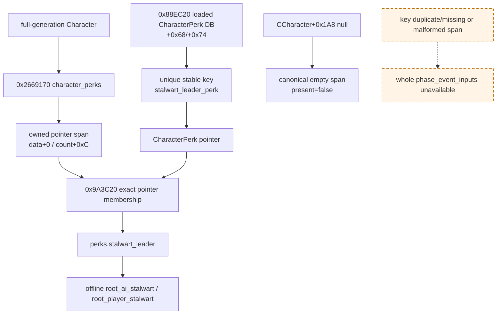
```mermaid
flowchart TD
    C["full-generation Character"] --> G["0x2669170 character_perks"]
    G --> S["owned pointer span<br/>data+0 / count+0xC"]
    DB["0x88EC20 loaded CharacterPerk DB<br/>+0x68/+0x74"] --> K["unique stable key<br/>stalwart_leader_perk"]
    K --> P["CharacterPerk pointer"]
    S --> M["0x9A3C20 exact pointer membership"]
    P --> M
    M --> B["perks.stalwart_leader"]
    B --> D["offline root_ai_stalwart / root_player_stalwart"]
    E["CCharacter+0x1A8 null"] --> Z["canonical empty span<br/>present=false"]
    X["key duplicate/missing or malformed span"] -.-> U["whole phase_event_inputs unavailable"]
    classDef unknown stroke-dasharray: 6 4,fill:#fff4e5,stroke:#b36b00;
    class X,U unknown;
```

### Faith / culture / religion exact-build reader ABI

[static-confirmed] stock phase-event 中的五个 root 条件，以及 selected enemy knight 的 current faith，均可从
已经通过 full-generation gate 的 `CCharacter*` 只读闭合；它们不依赖真实 `CCombatID`，也不需要执行
compiled trigger。原版 scope 转换器 `0x19D3DC0..0x19D403F` 先用
`0x2011E60(EventTarget*)` 解析 kind `4` Character，随后分别读取 `CCharacter+0xB0` 的 full
CultureID 与 `+0xB4` 的 full FaithID。`+0xB8` 是 secret-faith ID，不能替代 current faith。

| leaf | exact receiver / storage / original helper | wire 语义 |
|---|---|---|
| current culture | `CCharacter+0xB0` full ID；Culture store/fallback `module+0x570CB80/+0x570CB78`；`CCulture+0x10` identity | `culture_id` 是 generation-bearing signed int32 |
| current faith | `CCharacter+0xB4` full ID；Faith store/fallback `module+0x570C728/+0x570C238`；`CFaith+0x08` identity | `faith_id`；selected enemy knight 也发布该 raw ID |
| religion | `CFaith+0x1C` full ReligionID；Religion store/fallback `module+0x570C760/+0x570C6E0`；`CReligion+0x08` identity | `religion_id`；stable script key 是 `std::string CReligion+0x58`，length/capacity `+0x68/+0x70` |
| cultural pillar | `CCulture+0x190` 指向五个 selected pillar pointer；category `0..4`；`CCulturePillar+0x18` stable key，length/capacity `+0x28/+0x30` | 枚举五个 slot，exact byte compare `heritage_north_germanic` |
| cultural parameter | `bool 0x22C5800(const CCulture*, int32 parameter_identifier_id)` | `knights_slightly_more_prone_to_injury` |
| doctrine | `CFaith+0x278` resolved-doctrine container；`bool 0x24ECFA0(container*, const SDoctrineType**)`；pointer data/count `+0x08/+0x14`；`SDoctrineType+0x18` stable key | exact membership `tenet_warmonger` |
| doctrine parameter | `void* 0x24EE100(container_at_faith_plus_0x278, int32 parameter_identifier_id)`；返回 row 的 bool 在 `+0x08` | `death_is_glory = row != null && row+0x08 != 0` |

原 compiled evaluators 也提供了独立交叉证据：`has_cultural_pillar` 是 `0x282D900`，
`has_cultural_parameter` 是 `0x282DBD0`，`has_doctrine` 是 `0x2843720`，
`has_doctrine_parameter` 是 `0x2843870`，`has_religion` 是 `0x2845600`。其中 pillar evaluator
从 compiled object `+0x70` 取得目标 `CCulturePillar*`，再用 `pillar+0x1610` 的 category 选择
`CCulture+0x190` 对应 slot；bridge 以五个 selected pointer 的 stable key 镜像同一结果，不能把所有
loaded pillars 中“存在某 key”误当作该文化已选择它。

两项 parameter 不能调用会插入全局表的 identifier interner `0x3B58330`。只读 ABI 固定为：

```cpp
struct StringRef { const char* data; std::int64_t size; };

// Lookup only: does not insert. Missing key returns sentinel 12.
std::int32_t lookup_script_identifier(const StringRef* key); // RVA 0x3B588E0

// Borrowed engine string for strict lookup round-trip.
const std::string* script_identifier_name(std::int32_t id);  // RVA 0x3B58970
```

native 对 `death_is_glory` 与 `knights_slightly_more_prone_to_injury` 先调用 `0x3B588E0`，拒绝 sentinel
`12`，再用 `0x3B58970` exact byte round-trip，最后才把 ID 交给原 helper。所有 Character、Culture、Faith、
Religion、pillar、doctrine 与 returned name pointer 都是 engine-owned borrowed pointer，仅在同一 paused
snapshot/query 调用栈中有效；literal `StringRef` 是 caller-owned。每层 full ID 都必须 resolve 后读回 identity，
并在整批调用前后复验 generation。

```json
{
  "faith_culture": {
    "culture_id": 123,
    "faith_id": 456,
    "religion_id": 789,
    "checks": {
      "heritage_north_germanic": false,
      "knights_slightly_more_prone_to_injury": false,
      "death_is_glory": false,
      "tenet_warmonger": false,
      "germanic_religion": false
    }
  }
}
```

`checks` 只对 manifest 需要求值的 event root 发布；其它 commander/knight 至少发布三个 raw full ID，供
`selected_enemy_knight.faith` 与后续 offline AST 使用。合法的“未选 pillar/doctrine/parameter”是
`false`；identifier 缺失或 round-trip 不等、loaded stable key 缺失/重复、任一 span/pointer/count 非法、
fallback 混入、identity/generation 不一致，则整个 `phase_event_inputs` 原子 `unavailable`，不得把故障降级为
`false`。fixture 至少覆盖五个 true/false 对照、current/secret faith 不同、lookup sentinel/round-trip mismatch、
pillar category 越界、doctrine span malformed 与 stale generation；paused-live 通过前 production 仍为
`0/132`。

这批在 ABI 层闭合六项 manifest leaf：root 的两项 culture、两项 faith、一个 religion check，以及
`selected_enemy_knight.faith`。precontact `combat_side.enemy_faiths` 的 participant source-order mirror 已在下一节
独立闭合；它复用这里的 `CCharacter+0xB4` FaithID 与 strict Faith store reader，但不能跳过 participant
first-seen order，也不能伪造 CombatID。

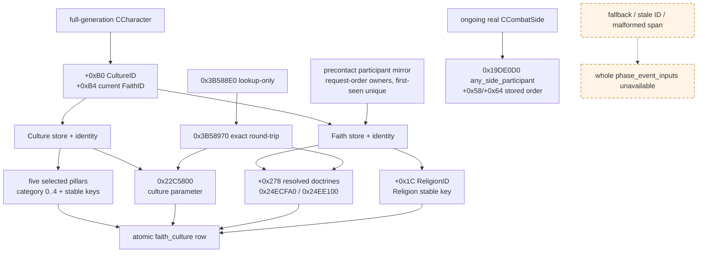
```mermaid
flowchart TD
    C["full-generation CCharacter"] --> CI["+0xB0 CultureID<br/>+0xB4 current FaithID"]
    CI --> CU["Culture store + identity"]
    CI --> F["Faith store + identity"]
    CU --> P["five selected pillars<br/>category 0..4 + stable keys"]
    CU --> CP["0x22C5800<br/>culture parameter"]
    F --> D["+0x278 resolved doctrines<br/>0x24ECFA0 / 0x24EE100"]
    F --> R["+0x1C ReligionID<br/>Religion stable key"]
    I["0x3B588E0 lookup-only"] --> RT["0x3B58970 exact round-trip"]
    RT --> CP
    RT --> D
    P --> O["atomic faith_culture row"]
    CP --> O
    D --> O
    R --> O
    PF["precontact participant mirror<br/>request-order owners, first-seen unique"] --> F
    RS["ongoing real CCombatSide"] --> AP["0x19DE0D0 any_side_participant<br/>+0x58/+0x64 stored order"]
    X["fallback / stale ID / malformed span"] -.-> FAI["whole phase_event_inputs unavailable"]
    classDef unknown stroke-dasharray: 6 4,fill:#fff4e5,stroke:#b36b00;
    class X,FAI unknown;
```

### Precontact participant / enemy-faith container exact-build reader ABI

[static-confirmed] `combat_side.enemy_faiths` 不需要构造或注册 CombatID。原 battle contact 先由唯一 caller
`0x23C8A51` tail-jump 到：

```cpp
void build_weighted_side_owners(CCombatSide* side,
                                CProvince* target); // RVA 0x23CB8D0
```

`0x23CB8D0` 清空 `side+0xF8/count+0x104`，严格按 `side+0x10/count+0x1C` 的 CArmyID insertion order
逐军处理。它遍历 regiment、以 `0x239CAE0(regiment,out,target)` 求 contact weight；然后
`0x23CBA5C..0x23CBAA0` 沿 `CArmy+0x124` full CUnitID → CUnit store/identity →
`CUnit+0x174` owner full CharacterID，每军向 `+0xF8` 追加一条 `0x18`-byte row：CharacterID 在
`+0x08`、至少为 `1` 的 signed weight 在 `+0x0C`、associated qword 在 `+0x10`。这一步**一军一 row、
不去重**。

每日 main tick 的 callers `0x2309EF2/0x2309EFA` 调 `0x23CA2F0(CCombatSide*)`；它先调用
`0x23CBC20` 维护 primary，再按 `+0xF8/+0x104` stored order 对每行调用：

```cpp
void find_or_append_side_participant(CCombatSide* side,
                                     std::int32_t full_character_id); // RVA 0x23C9C90
```

`0x23C9C90` 在 `side+0x58/count+0x64` 的 `0x18`-byte rows 中查找 `row+0x08` full CharacterID；首次
出现才 append，因此最终 participant order 是 army insertion order 的 **first-seen unique owner**。此后才
tail-call `0x23C9900` 发 phase events。compiled `any_side_participant` evaluator `0x19DE0D0` 正是按这个
`+0x58/+0x64` order 逐行取 `+0x08` CharacterID、做 generation/validity resolve，再建立真实 Character root。

hypothetical v3 已显式冻结各侧 request/insertion order，所以可以不调用上述 mutating builder，而在 caller-owned
DTO 中严格镜像其 participant identity 结果：对每侧 request-order ArmyID，逐军 strict resolve CArmy，沿
`CArmy+0x124` strict resolve CUnit，读取 `CUnit+0x174` owner；以 full CharacterID first-seen 去重，随后 strict
resolve Character，读取 `CCharacter+0xB4` current FaithID 并经 Faith store/fallback/identity reader得到 ordered
FaithID row。多个 army 同 owner 只保留第一项；不同 owner 即使 faith 相同仍保留两条 participant row，
`enemy_faiths` container 可另以 first-seen FaithID 去重用于 `any`，但必须保留 owner→faith rows供 fixture/诊断。
这与真实 contact 的 owner order 一致，不声称复现 `+0xF8` contact weight，也不调用 `0x239CAE0`、
`0x23CA2F0`、phase fire 或 RNG。

```json
{
  "participants": [
    {"source_army_id": 357, "owner_character_id": 36108, "faith_id": 12},
    {"source_army_id": 33554657, "owner_character_id": 28180, "faith_id": 34}
  ],
  "enemy_faiths": [12, 34],
  "participant_policy": "request_order_first_seen_unique_owner"
}
```

数字仅展示类型。任一 Army/CUnit/Character/Faith full-generation resolve、fallback rejection、identity readback、
array/count/stride/checked append 或 query 前后 generation/revision 失败，整个 v3 原子 unavailable；合法 empty side
产生 empty rows，不能凭玩家/战争 owner 推断一个 faith。fixture 至少覆盖 single owner、多 army 同 owner、mixed
owner 同 faith、mixed owner 不同 faith、request order 交换、stale Army/Unit/Character/Faith ID、fallback 与
mid-query owner/faith change；ongoing fixture 还要把 mirror owner order 与真实 `side+0x58/+0x64` 逐项对拍。
该 exact offline container 单独只闭合 `combat_side.enemy_faiths`；它与后文已闭合的 directional faith-hostility leaf、
selector named-scope 证据及完整 `fanatic_attribute_trigger = no` AST 合并后，才得到 fanatic branch validity。

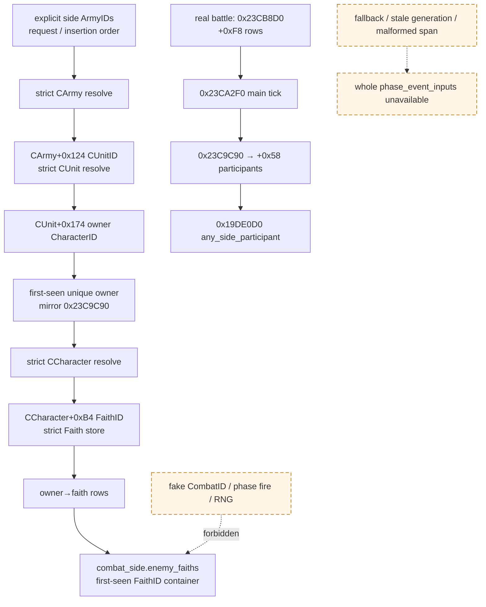
```mermaid
flowchart TD
    A["explicit side ArmyIDs<br/>request / insertion order"] --> AR["strict CArmy resolve"]
    AR --> U["CArmy+0x124 CUnitID<br/>strict CUnit resolve"]
    U --> O["CUnit+0x174 owner CharacterID"]
    O --> D["first-seen unique owner<br/>mirror 0x23C9C90"]
    D --> C["strict CCharacter resolve"]
    C --> F["CCharacter+0xB4 FaithID<br/>strict Faith store"]
    F --> R["owner→faith rows"]
    R --> E["combat_side.enemy_faiths<br/>first-seen FaithID container"]
    B["real battle: 0x23CB8D0 +0xF8 rows"] --> T["0x23CA2F0 main tick"]
    T --> P["0x23C9C90 → +0x58 participants"]
    P --> Q["0x19DE0D0 any_side_participant"]
    X["fake CombatID / phase fire / RNG"] -. "forbidden" .-> E
    Y["fallback / stale generation / malformed span"] -.-> Z["whole phase_event_inputs unavailable"]
    classDef unknown stroke-dasharray: 6 4,fill:#fff4e5,stroke:#b36b00;
    class X,Y,Z unknown;
```

### Knight-army MAA family count exact-build reader ABI

[static-confirmed] stock knight phase events 对 `root.knight_army` 使用的三类数值对象已经闭合：
`army_number_maa_regiments`、`army_number_maa_regiments_of_base_type:*` 与
`army_number_maa_regiments_of_type:*`。它们的注册字符串分别位于 RVA `0x4379A30`、`0x43799D0`、
`0x4379B60`，最终 compiled vtable 分别为 `0x437ABD8`、`0x437ACE8`、`0x437ADF8`；共同的
Q100000 adapter `0x9A3310` 调用 vtable `+0x100` leaf，把返回的 signed `int32` count 符号扩展后乘
`100000`。三个 leaf 是：

```cpp
std::int32_t army_number_maa_regiments(CArmy*);                    // RVA 0x284D450
std::int32_t army_number_maa_regiments_of_base_type(
    CArmy*, std::int32_t compiled_base_type_enum);                  // RVA 0x284D370
std::int32_t army_number_maa_regiments_of_type(
    CArmy*, const CRegimentType* compiled_exact_type);              // RVA 0x284D280
```

三者都从真实 kind `0x1B` Army token 得到 full CArmyID，经
`module+0x570C730` store resolve，并拒绝 `module+0x570C720` fallback；`CArmy+0x10` 必须回读同一
full-generation ID。随后按 `CArmy+0x38` data / `+0x44` signed count 遍历 full CRegimentID，经
`module+0x57BF4C8` resolve、拒绝 `module+0x57BF4C0` fallback，并由 `CRegiment+0x10` 回读 identity。
每个 regiment 的 inner combat type 是 `T = *(CRegiment+0x18)`：

- total leaf `0x284D450` 仅在 `T->vtable[0](T)` 返回 true 时加一。这里特意**不**复用 v2
  `kind == men_at_arms`：v2 classifier 还允许 `is_special_combat_regiment`，而原版 total numeric 不允许；
- base-type leaf `0x284D370` 比较 `*(int32_t*)(T+0x270)` 与 compiled object `+0x158` 保存的 enum；
- exact-type leaf `0x284D280` 比较 `T` 与 compiled object 在 `+0x20C == 2` 时由 `+0x200` 保存的
  resolved type pointer。诊断器 `0x284CB80` 又从该 target 的 `std::string +0x18` 读取 stable key
  （length/capacity `+0x28/+0x30`），因此 bridge 可以用同一 exact key 做只读镜像；
  `CRegiment+0x118` 的另一个 MAA-type 句柄不是这个 `T`，禁止替代。

base-type 字符串到 enum 的原生 loaded registry 也已闭合。`0x82DC40()` 是 singleton getter，slot 位于
`module+0x570C120`；它在 null 时会 lazy-init，所以只读 query 必须直接读 slot，null 即原子失败，不能调用
getter 产生状态。registry rows 在 context `+0xF08` data / `+0xF14` count，stride `0x58`；row `+0x00`
是 signed enum，stable `std::string` 从 `+0x08` 开始，length/capacity 在 row `+0x18/+0x20`。
原 parser `0x284CF70` 正是遍历此表并把命中 enum 写入 compiled object `+0x158`。native 必须唯一解析：
`skirmishers`、`archers`、`pikemen`、`heavy_infantry`、`light_cavalry`、`heavy_cavalry`、
`camel_cavalry`、`elephant_cavalry`、`archer_cavalry`、`gunpowder`。

`knight_army` 本身不能由请求 army 随意指定。原 scope relation 注册为 `knight_army`，最终 evaluator
`0x19DA780` 从 root `CCharacter+0x1B0` 取得 link，再读 link `+0xF8` full CRegimentID，经上述 strict
regiment resolve 后读 `CRegiment+0x140` full CArmyID，再 strict resolve 到 `CArmy*`。v3 还必须验证该
ArmyID 等于 root 的 v2 `source_army_id`，且 source regiment 属于该 army；null、`-1`、fallback、membership
不一致或 generation 改变都使整段 `phase_event_inputs` unavailable，不能退回 root 所在 side 的第一支军队。

wire 固定使用 signed Q100000；合法的零命中发布 `0`，不是 unavailable：

```json
{
  "knight_army": {
    "army_id": 357,
    "maa_regiment_count_raw": 500000,
    "maa_counts": {
      "skirmishers_raw": 100000,
      "pikemen_raw": 0,
      "heavy_infantry_raw": 0,
      "light_cavalry_raw": 0,
      "heavy_cavalry_raw": 0,
      "camel_cavalry_raw": 0,
      "elephant_cavalry_raw": 0,
      "archer_cavalry_raw": 0,
      "gunpowder_raw": 0,
      "crossbow_family_raw": 300000,
      "non_crossbow_archers_raw": 100000,
      "scale": 100000
    }
  }
}
```

九个 direct family 是对应 base-type count 乘 `100000`。其余两个严格为：

```text
crossbow_family_raw =
    (exact("crossbowmen") + exact("shenbigong")
     + exact("accolade_maa_crossbowers")) * 100000

non_crossbow_archers_raw =
    (base("archers") - exact("crossbowmen") - exact("shenbigong")
     - exact("accolade_maa_crossbowers")) * 100000
```

所有 pointer 都是 engine-owned、仅在同一次 paused snapshot/query 栈中借用；native 对 Army/Regiment/type
span、registry row/string、identity 与 generation 做前后验证。required stable key 缺失/重复、type key
malformed、fallback 混入、count/span 非法、helper 与镜像结果不等、signed int32 累加或 signed int64 scale
溢出均使整个 `phase_event_inputs` 原子 unavailable。差值保留 signed 语义，不因 loaded data 异常而把负数
夹成零。fixture 最少覆盖十个 base family、三个 crossbow exact key、mixed archer subtraction、零命中、
`T->vtable[0]==false` 但 v2 判作 special 的 regiment、stale/fallback/malformed registry、knight-army mismatch
与溢出。该 ABI 闭合 11 个 family leaf，并把 `root.knight_army.maa_counts` 作为 exact offline container；
production named-key fixture 与 strict normalizer 已通过；paused-live 尚未执行，所以 live-confirmed 计数仍是 `0/132`。

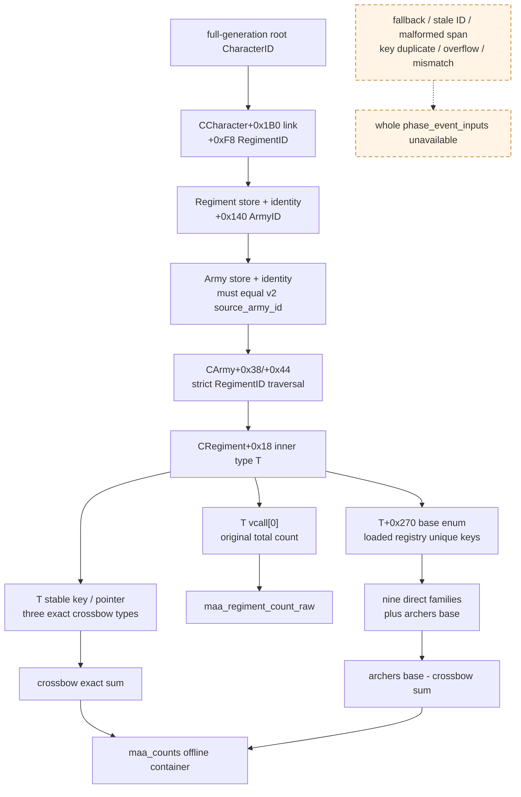
```mermaid
flowchart TD
    R["full-generation root CharacterID"] --> L["CCharacter+0x1B0 link<br/>+0xF8 RegimentID"]
    L --> RG["Regiment store + identity<br/>+0x140 ArmyID"]
    RG --> A["Army store + identity<br/>must equal v2 source_army_id"]
    A --> IT["CArmy+0x38/+0x44<br/>strict RegimentID traversal"]
    IT --> T["CRegiment+0x18 inner type T"]
    T --> V["T vcall[0]<br/>original total count"]
    T --> B["T+0x270 base enum<br/>loaded registry unique keys"]
    T --> E["T stable key / pointer<br/>three exact crossbow types"]
    V --> O["maa_regiment_count_raw"]
    B --> F["nine direct families<br/>plus archers base"]
    E --> C["crossbow exact sum"]
    F --> N["archers base - crossbow sum"]
    C --> M["maa_counts offline container"]
    N --> M
    X["fallback / stale ID / malformed span<br/>key duplicate / overflow / mismatch"] -.-> U["whole phase_event_inputs unavailable"]
    classDef unknown stroke-dasharray: 6 4,fill:#fff4e5,stroke:#b36b00;
    class X,U unknown;
```

### Current game-rule selection exact-build reader ABI

[static-confirmed] stock commander phase events 的 `has_game_rule = easy_difficulty` 与
`has_game_rule = very_easy_difficulty` 不需要 Character、side 或真实 `CCombatID`。字符串
`has_game_rule` 位于 RVA `0x44BCA18`，factory 注册链是 `0x66EEC0..0x66EF53`；concrete
`CGameRuleSettingTrigger` vtable 是 `0x44BD2A8`，其 `+0xC8` leaf 为：

```cpp
bool game_rule_setting_trigger_is_selected(
    const CGameRuleSettingTrigger* trigger); // RVA 0x329E580

// Trigger layout used by the leaf:
// +0x50 std::string requested_setting_key (len/cap +0x60/+0x68)
// +0x70 const RuleSettingToken* resolved_token
```

原 resolver `0x329F830` 先对 `trigger+0x50` 的 exact bytes 调 `0x3B8B000`，再把 signed 32-bit
hash 交给 `0x32A3350`，将返回 token 写入 `+0x70`。production reader 不需要构造/注册 trigger，固定对
两个 manifest key 镜像同一 lookup：

```cpp
// Existing loaded registry only. Directly read this slot; null is failure.
RuleSettingTokenRegistry* const registry = *(module + 0x57D3CE8);

std::int32_t rule_setting_key_hash(
    RuleSettingTokenRegistry*, const char* bytes, std::uint32_t size); // RVA 0x3B8B000
const RuleSettingToken* lookup_rule_setting_token(
    RuleSettingTokenRegistry*, std::int32_t hash);                    // RVA 0x32A3350

// lookup miss returns *(module + 0x57D7430), which must be rejected.
// RuleSettingToken stable key: std::string +0x18, len/cap +0x28/+0x30.
```

`0x3B8B000` 是原调用链使用的 Murmur-style pure hash；`0x32A3350` 只在 already-loaded table
`registry+0x198` / mask `+0x1A4` 中查找并用内部 reader lock 保护，不插入 key。bridge 仍须用返回 token
`+0x18` 的 stable string 对 `easy_difficulty` / `very_easy_difficulty` 做 exact byte round-trip，避免仅凭
32-bit hash 接受 collision。不得调用会创建全局 registry 的 `0x2CFB610` null 分支，也不得调用脚本 identifier
interner `0x3B58330`。

原 leaf `0x329E580` 的 current-state 读取链为：

```cpp
IGameRuleSelectionService* const service = *(module + 0x5754B48);
SelectedRuleSettingSet* selected = service->vcall_plus_0x10();

// selected +0x08: const RuleSettingToken** data
// selected +0x14: signed int32 count
// stride: 0x08
const RuleSettingToken** find_exact_token(
    const RuleSettingToken** begin,
    const RuleSettingToken** end,
    const RuleSettingToken* const* needle);                         // RVA 0x9A3E60
```

`0x9A3E60` 只做 qword pointer equality 的线性查找，返回命中位置或 end；因此两个 bool 是“当前存档实际
selected-token set 是否含 exact loaded token”，不是启动器 preset 推断，也不是玩家 modifier 反推。原版
`00_game_rules.txt` 把两项都定义在同一个 `difficulty` rule 下，故 sealed playset 中合法 snapshot 最多一个为
true；二者都 false 表示 normal/hard/very-hard 等其它 difficulty，并非 unavailable。

```json
{
  "game_rules": {
    "easy_difficulty": false,
    "very_easy_difficulty": false
  }
}
```

`game_rules.easy_difficulty` 与 `game_rules.very_easy_difficulty` 是两个 exact leaf；父级 `game_rules` 只是在
进程外组装的 exact container，不再新增 native reader。registry/service/selected 为 engine-owned borrowed
pointer，仅在同一 paused query 中有效。registry/service/result null、fallback token、key round-trip mismatch、
span pointer/count/乘法越界、重复目标 token、两个 difficulty token 同时 selected，或 query 前后 selection
span identity/count 改变，都使整个 `phase_event_inputs` 原子 unavailable；绝不能回退读取
`player/game_rules/presets.txt`。fixture 至少覆盖 normal、easy、very-easy、hash-collision round-trip、fallback、
service/result null、malformed span、重复/双选与 mid-query change。production complete-key fixture 已接入；
paused-live 通过前 live-confirmed 仍是 `0/132`。

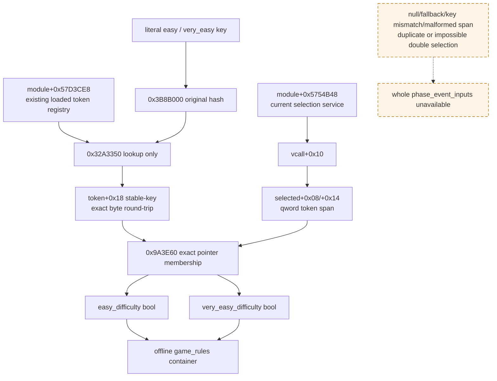
```mermaid
flowchart TD
    K["literal easy / very_easy key"] --> H["0x3B8B000 original hash"]
    R["module+0x57D3CE8<br/>existing loaded token registry"] --> L["0x32A3350 lookup only"]
    H --> L
    L --> RT["token+0x18 stable-key<br/>exact byte round-trip"]
    S["module+0x5754B48<br/>current selection service"] --> V["vcall+0x10"]
    V --> A["selected+0x08/+0x14<br/>qword token span"]
    RT --> F["0x9A3E60 exact pointer membership"]
    A --> F
    F --> E["easy_difficulty bool"]
    F --> VE["very_easy_difficulty bool"]
    E --> C["offline game_rules container"]
    VE --> C
    X["null/fallback/key mismatch/malformed span<br/>duplicate or impossible double selection"] -.-> U["whole phase_event_inputs unavailable"]
    classDef unknown stroke-dasharray: 6 4,fill:#fff4e5,stroke:#b36b00;
    class X,U unknown;
```

### Character acclaimed / acclaim eligibility exact-build reader ABI

[static-confirmed] `candidate.is_acclaimed`、`root.is_acclaimed`、
`selected_enemy_knight.is_acclaimed` 与 `root.can_be_acclaimed` 已闭合成不依赖真实 `CCombatID` 的 Character
reader。两个 script trigger 的注册与 compiled leaf 分别是：

| trigger | literal / factory | compiled vtable | actual-state leaf |
|---|---|---|---|
| `is_acclaimed` | RVA `0x434FAB8`；`0x52C0E0..0x52C169`；factory vtable `0x43506D0` / creator `0x281A610` | `0x4350BE0` | vtable `+0xD8 = 0x28190C0` |
| `can_be_acclaimed` | RVA `0x434FB90`；`0x52C220..0x52C2B3`；factory vtable `0x4350750` / creator `0x281A6F0` | `0x4350DB0` | vtable `+0xD8 = 0x2819200` |

`0x28190C0` 先从真实 kind-4 Character scope 取 full CharacterID，再经
`module+0x570C130` 解析并以 `CCharacter+0x18` 回读 generation；原 fallback 是
`module+0x570C138`。实际 acclaimed 链如下：

```cpp
// All pointers are engine-owned and borrowed for one paused query.
void* accolade_link = *(void**)(character + 0x1A8);
std::int32_t accolade_id = *(std::int32_t*)(accolade_link + 0x568);

// Existing CAccolade component store / fallback.
auto* store = *(void**)(module + 0x57BF1E0);
auto* fallback = *(CAccolade**)(module + 0x57BF198);
// Resolved CAccolade identity is full ID at +0x08.
// Normal CAccolade vtable 0x4314698, vcall +0x08 = 0x10495A0.
bool is_acclaimed = accolade->vcall_plus_0x08();
```

因此 wire 语义不是“有某个 accolade modifier”，而是原 leaf 所指的 active full-generation CAccolade identity
predicate。`accolade_link == nullptr` 或 `accolade_id == -1` 是合法 `false`；非 sentinel ID 若 store 未初始化、
解析到 fallback、`CAccolade+0x08` 回读不等或 identity predicate 调用失败，则整个 `phase_event_inputs`
原子 `unavailable`，不得把 stale ID 降级为 `false`。native 可以严格镜像上述链，并用同一 Character scope 对
`0x28190C0` 做 fixture equality；production 不需要构造 accolade scope token。

`0x2819200` 同样严格解析 kind-4 Character，随后固定：

```cpp
bool can_be_acclaimed_current(
    CCharacter* character,
    void* optional_result_or_failure_rows,
    void* optional_diagnostic_sink); // RVA 0x28A4870

bool value = can_be_acclaimed_current(character, nullptr, nullptr);
```

这里只冻结原 compiled leaf 与 GUI getter `0x251D440..0x251D46D` 都实际采用的两个 null optional 参数形式；
不得猜测两个 optional receiver 的结构或传入自造对象。`0x28A4870` 检查 Character validity/alive、当前可用的
accolade 条件与候选，并在栈/临时 heap scratch 中组装、销毁候选；该 null-output 路径不创建 accolade、不注册
ID、不抽 RNG，也不要求 Combat/CombatSide scope。native 必须在 paused main-thread adapter 内调用，调用前后复核
Character full ID/generation；异常、辅助服务缺失、scratch 构造/析构失败或 revision 改变均使整个 v3 原子失败。
helper 返回的 `false` 本身是合法当前状态，不能标 unavailable。

每个 v3 Character row 发布两个非空 bool；即使 manifest 当前只在 knight root 上读取 eligibility，统一发布可以
避免同一角色在 candidate/root 角色切换时补值漂移：

```json
{
  "accolade_state": {
    "is_acclaimed": false,
    "can_be_acclaimed": true
  }
}
```

fixture 至少覆盖：无 link、`-1` sentinel、真实 acclaimed identity、stale/nonmatching AccoladeID、store/fallback
故障、eligibility true/false、相同角色在 candidate/root/selected 三种引用下结果一致，以及 direct helper 与
compiled Character-scope leaf 对拍。该批闭合 4 个 manifest leaf，并使
`stock_enemy_knight_selection_weight_raw` 可由 acclaimed、stalwart 与 warfare-legacy 三个 exact leaf 按
stock modifier source order 离线求出。本小节闭合的字段已经计入顶部当前账本
`81 leaf + 51 offline = 132/132`；production fixture/normalizer 已通过，paused-live 尚未执行。

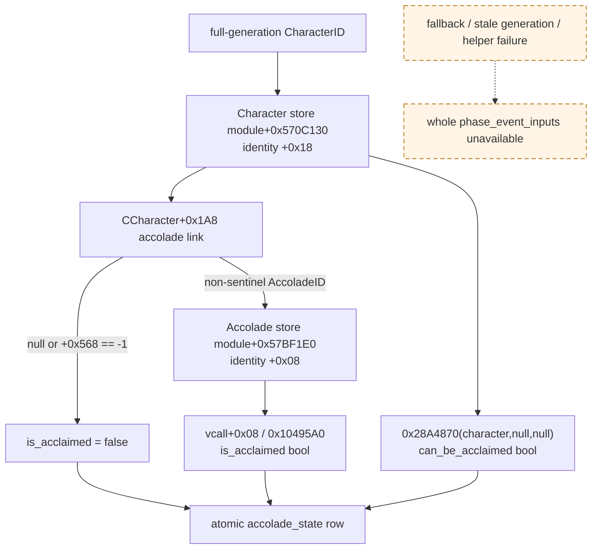
```mermaid
flowchart TD
    ID["full-generation CharacterID"] --> C["Character store module+0x570C130<br/>identity +0x18"]
    C --> L["CCharacter+0x1A8 accolade link"]
    L -->|"null or +0x568 == -1"| F["is_acclaimed = false"]
    L -->|"non-sentinel AccoladeID"| AS["Accolade store module+0x57BF1E0<br/>identity +0x08"]
    AS --> P["vcall+0x08 / 0x10495A0<br/>is_acclaimed bool"]
    C --> E["0x28A4870(character,null,null)<br/>can_be_acclaimed bool"]
    F --> O["atomic accolade_state row"]
    P --> O
    E --> O
    X["fallback / stale generation / helper failure"] -.-> U["whole phase_event_inputs unavailable"]
    classDef unknown stroke-dasharray: 6 4,fill:#fff4e5,stroke:#b36b00;
    class X,U unknown;
```

### Side commander/knight accolade-parameter exact-build reader ABI

[static-confirmed] `combat_side.ordered_commanders_and_knights_with_accolade_parameters` 已闭合到原
`any_side_commander` / `any_side_knight` roster 与 `has_accolade_parameter` leaf。trigger literal RVA
`0x434F9A8`、注册链 `0x52C7C0..0x52C853`、factory vtable `0x4351718` / creator `0x281AA30`，最终
`CHasAccoladeParameter` vtable `0x4350A20` 的 `+0xC8` evaluator 是 `0x2819DC0`：它要求 kind `0x24`
Accolade scope，按 full CAccoladeID 经 `module+0x57BF1E0` store 解析、拒绝
`module+0x57BF198` fallback、回读 `CAccolade+0x08` identity，然后把 compiled object `+0x50` 的
parameter identifier ID 传给：

```cpp
bool accolade_has_parameter(const CAccolade* accolade,
                            std::int32_t parameter_identifier_id); // RVA 0x251CB60
```

`0x251CB60` 是只读 helper：先以 `0x251C200(accolade)` 验证 `CAccolade+0x58/count+0x64` 的
`0x18`-byte attribute rows；随后按 row order，以
`0x28A32A0(*(int32_t*)(row+0x08), *(void**)(row+0x10)+0x400)` 解析当前 rank/type data，并对 resolved data `+0x5E0`
的 int32 parameter-ID span 调 `0x975B50(span,&id)`。`0x975B50` 的 span 是 data `+0x00`、signed count
`+0x0C`、stride `4`，只做 exact int32 membership。该链不抽 RNG、不创建 accolade、不改变 glory/rank；
production 可以在 paused main thread 对已严格解析的 borrowed `CAccolade*` 调用，并在整批前后复核 identity。

六个 stock combat parameter key 都通过既有 script-identifier lookup-only ABI `0x3B588E0` 解析，并用
`0x3B58970` exact byte round-trip；不得 interning 新 key：

- `accolade_defends_family_low/medium/high`；
- `accolade_increase_hostile_knight_death_low/medium/high`。

Character→Accolade 复用 `is_acclaimed` 已闭合的 state chain：`CCharacter+0x1A8` optional link，
`link+0x568` full CAccoladeID。null link 或 `-1` 是合法“无 accolade”，六项均为 false；非 sentinel ID 必须
通过上述 store/fallback/identity gate。这里不要求 `is_acclaimed=true` 才调用 parameter helper：原脚本访问的是
optional `accolade ?=` scope，是否存在与 `is_acclaimed` leaf 是两条不同的原生语义。

roster 顺序同样不需要 fake kind-11 scope：

- `0x19DD750` 是 real-side commander builder；它按 `CCombatSide+0x10/count+0x1C` ArmyID stored order，
  strict resolve CArmy、读取 `CArmy+0x120` commander full CharacterID，把每个非 `-1` ID append 成 kind-4
  Character target，**不去重**；
- `0x19DD670` 是 real-side knight builder；它按 `CCombatSide+0x40/count+0x4C` 的 `0x60`-byte entry order，
  strict resolve entry `+0x08` CRegimentID、读取 `CRegiment+0x148` knight full CharacterID，每个非 `-1`
  ID同样 append；
- hypothetical v3 按显式 request-order armies 重放同一 materializer order：每军 commander 先保留其 army
  source index；knight 按该军原生 `CArmy+0x38/+0x44` RegimentID order 与 side-entry bucket order发布。
  同一 Character 若指挥两军或也作为 knight，保留多行及各自 role/source；不能复用一个按 ID 排序/去重的
  public presentation list冒充 script iterator order。

```json
{
  "ordered_commanders_and_knights_with_accolade_parameters": [
    {
      "role": "commander",
      "source_army_id": 357,
      "source_regiment_id": null,
      "character_id": 36108,
      "accolade_id": null,
      "parameters": {
        "defends_family_low": false,
        "defends_family_medium": false,
        "defends_family_high": false,
        "increase_hostile_knight_death_low": false,
        "increase_hostile_knight_death_medium": false,
        "increase_hostile_knight_death_high": false
      }
    }
  ]
}
```

该 container 使 7 个 derived ref 全部离线闭合。对本侧 `defends_family`，只有 root/liege 都有 HouseID 且相等
时才选最高存在 tier：high→factor `25000`，否则 medium→`50000`，否则 low→`75000`；无 tier 时
`any_tier=false`、no-op factor `100000`。相应 bool 为 `tier_high`、`tier_medium_only`、`tier_low_only`。
对**敌侧** `increase_hostile_knight_death` 同样只取最高 tier：high→`175000`，medium→`150000`，
low→`125000`，无 tier时 `any_tier=false`、factor `100000`。这些常量来自 sealed stock
`04_ep2_accolade_values.txt` 的 `actual_* = 1 + base`；production observation 会发布原始 leaf，静态 manifest 仍标记
`loaded_playset_verified=false`。只有当前 episode 的独立 runtime proof 可关闭这一门；proof 未通过前不得把离线
derivation 当作 simulation fidelity-ready。

任一 roster Army/Regiment/Character/Accolade full-generation resolve、fallback rejection、parameter key round-trip、
span/count/stride、attribute validity call或 query 前后 identity/revision 失败，整个 v3 原子 unavailable；helper 对合法
active accolade 返回 false 是真实“不含该 parameter”，不能标 unknown。fixture 至少覆盖 no accolade、每个单 tier、
同角色 low+high（最高 tier胜出）、commander/knight overlap、同 commander 多 army、mixed role/source order、
stale AccoladeID、fallback、malformed attribute/parameter span、key mismatch 与 helper/direct-membership 对拍。

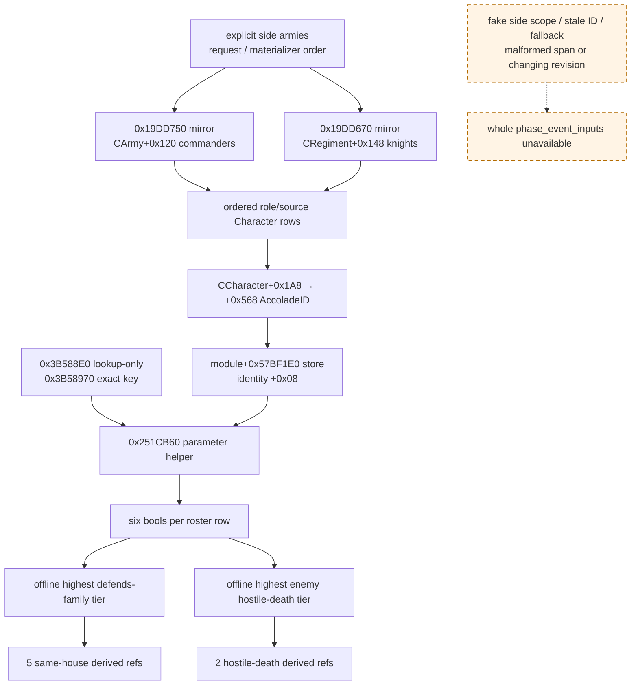
```mermaid
flowchart TD
    A["explicit side armies<br/>request / materializer order"] --> C["0x19DD750 mirror<br/>CArmy+0x120 commanders"]
    A --> K["0x19DD670 mirror<br/>CRegiment+0x148 knights"]
    C --> R["ordered role/source Character rows"]
    K --> R
    R --> L["CCharacter+0x1A8 → +0x568 AccoladeID"]
    L --> S["module+0x57BF1E0 store<br/>identity +0x08"]
    I["0x3B588E0 lookup-only<br/>0x3B58970 exact key"] --> H["0x251CB60 parameter helper"]
    S --> H
    H --> P["six bools per roster row"]
    P --> F["offline highest defends-family tier"]
    P --> D["offline highest enemy hostile-death tier"]
    F --> O["5 same-house derived refs"]
    D --> O2["2 hostile-death derived refs"]
    X["fake side scope / stale ID / fallback<br/>malformed span or changing revision"] -.-> U["whole phase_event_inputs unavailable"]
    classDef unknown stroke-dasharray: 6 4,fill:#fff4e5,stroke:#b36b00;
    class X,U unknown;
```

### Character variable / employer / extreme-conqueror exact-build reader ABI

[static-confirmed] `has_variable` 并不要求真实 `CCombatID`。literal 位于 RVA `0x44D5C58`，注册链为
`0x6BB2E0..0x6BB373`，factory vtable `0x44D6758` / creator `0x33BFB80`，最终 compiled vtable
`0x44D6CB8` 的 actual evaluator 是 `0x33C2DB0`。它从传入 holder 的第一个 qword 取得真实
`CJominiEventTarget*`，经 `0x3329A40(const CJominiEventTarget*)` 取得该 scope 的 variable context，最后调用：

```cpp
struct CJominiEventTarget16 {
    std::uint16_t kind;       // +0x00; Character = 4, numeric CFixedPoint = 1
    std::uint8_t reserved[6];
    std::int64_t payload;     // +0x08; full CharacterID or signed Q100000
};
static_assert(sizeof(CJominiEventTarget16) == 0x10);

// Int32Span: data +0x00, signed count +0x0C.
bool has_any_variable(void* variable_context,
                      const Int32Span* requested_key_ids);          // RVA 0x33BA580
void* variable_context_for_scope(
    const CJominiEventTarget16* real_scope);                         // RVA 0x3329A40
```

`0x33BA580` 的 scan 可以安全地在 bridge 内镜像：variable-context 的 entry data 在 `+0x10`、signed count
在 `+0x1C`、stride `0x20`；每项 key identifier 是 `entry+0x08` 的 signed int32，value 是
`entry+0x10` 的 inline `CJominiEventTarget16`。helper 依次遍历 requested IDs，再遍历 context rows，只做
key-ID equality；所以 `has_variable` 的语义是 **key 存在**，与 value truthiness/type 无关。v3 为了后续 effect
还要读取 value，必须复制 typed union；不得把 Character target 的 payload 当 Q100000，也不得把仅有 key
presence 当成 unlock trigger 的完整结果。

key 只通过已加载 script-identifier table 解析：`0x3B971A0()` 取得 table，lookup-only wrapper
`0x3B97020(table,&id,&NativeStringView)`，再用 `0x3B97090(table,id)` 回取 stable bytes 做 exact round-trip。
禁止调用 insert path `0x3B96E50`。本批的 sealed-stock bounded key set 是：

- presence：`conqueror` 与 13 个
  `skirmisher/archer/crossbowmen/pike/vanguard/outrider/lancer/camelry/elephantry/horse_archer/gunpowder/fanatic/valiant_attribute_unlock`；
- Character target：root 的 `hold_court_8050_knight`、employer 的 `hold_court_8050_promise`；两者比较采用
  full CharacterID，不比较解析后的裸指针；
- numeric Q100000：root liege 的 `accolade_progress`；`00_combat_values.txt` 的 stock script value 对 absent
  返回 `0`，present 时从 `0` 加该 numeric variable，再应用 `max = 20` 的上界，故
  `accolade_progress_raw = min(variable_raw, 2'000'000)`；不能臆造下界 clamp。

`root.variables` / `root.employer.variables` 在 manifest 中是 effect 的 bounded observational container，而非
“枚举角色的任意 mod variable”。当前 stock effect 实际读取 root `hold_court_8050_knight` 与 employer
`hold_court_8050_promise`；`save_died_in_battle_variables_effect` 会覆盖写入 battle-death 三项，因此旧值不是输入。
Mongol severed-head 分支读取 root liege 的 `beheaded_warrior` 与一个 character flag；该分支仍属于 effect-only
观测边界，若 simulator 将来要精确执行该分支，必须另增 liege variable/flag reader，不能把本 bounded container
外推成任意 effect-state 全闭合。

employer 关系本身也已闭合：RTTI `CEmployerLink` 的 simple scope evaluator 是 `0x19D5430`；直接 leaf 为
`CCharacter+0x1B0` optional relation pointer，非空时 employer full CharacterID 位于 `relation+0xC8`。
null 是合法 absent；任何非 sentinel ID 必须经 Character store `module+0x570C130` 解析、回读
`CCharacter+0x18` 并在 query 前后复核 generation。它输出的仍是 kind-4 real Character target，可传给
`0x3329A40`，无需伪造 Combat/CombatSide scope。

extreme-conqueror 的第二个叶子是 Character modifier pointer membership。`has_character_modifier` literal
RVA `0x41A87D8`，注册链 `0x31A800..0x31A893`，compiled vtable `0x41A8998`，Character-scope evaluator
`+0xC8 = 0x1947180`。精确链为：

```cpp
// Resolve the stable key ai_extreme_conqueror_modifier uniquely first.
void* loaded_modifier_db = get_character_modifier_database();       // RVA 0x88F370
// DB pointer array: db+0x1210 data, +0x121C signed count, qword stride.
// CCharacterModifier stable std::string: +0x38, length/capacity +0x48/+0x50.

void* modifier_state = *(void**)(character + 0x1A8);
// null => legitimate false
// active rows: modifier_state+0x188 data, +0x194 signed count,
// stride 0x48; first qword of each row is CCharacterModifier*.
```

原 initializer `0x1946B10` 用 `0x3B8B000` hash 与 `0xA41F10` 从 loaded DB 解析 key，并把目标 pointer
写到 compiled object `+0x70`；原 evaluator `0x1947180` 对 active rows 只做 pointer equality。bridge 应枚举
`db+0x1210` 并以 `modifier+0x38` stable bytes 唯一解析 `ai_extreme_conqueror_modifier`，随后严格镜像 membership；
不得只信 32-bit hash。于是 stock scripted trigger 可离线精确组装：

```text
root.ai_should_get_extreme_conqueror_bonuses =
    root.variable("conqueror").present
    AND root.has_modifier("ai_extreme_conqueror_modifier")
```

建议 native row 只发布 typed state，不泄露 engine pointer：

```json
{
  "variable_state": {
    "conqueror_present": true,
    "attribute_unlock_presence": {
      "skirmisher": false,
      "archer": false
    },
    "hold_court_8050_knight_character_id": null
  },
  "employer": {
    "character_id": 123,
    "hold_court_8050_promise_character_id": null
  },
  "liege": {
    "accolade_progress_raw": 0,
    "accolade_progress_scale": 100000
  },
  "modifier_state": {
    "ai_extreme_conqueror_modifier": true
  },
  "ai_should_get_extreme_conqueror_bonuses": true
}
```

上面的 13-key map 在正式 schema 必须全部列出；JSON 只缩写展示两项。缺少请求 key 是合法
`present=false`；但 valid Character 得到 null variable context、key round-trip/expected value kind 不符、duplicate
key/loaded modifier、malformed pointer/count/stride、fallback、stale relation/CharacterID 或 query 中 generation/revision
变化，都使整个 `phase_event_inputs` 原子 unavailable。fixture 至少覆盖 absent/present numeric/Character 三类
variable、negative/超过 20 的 accolade progress、employer absent/stale、modifier absent/present、hash collision、
duplicate loaded key、wrong value kind 与 mid-query generation change。该批闭合 1 个 leaf-backed ref
`root.liege.accolade_progress_raw`，并离线闭合 `root.variables`、`root.employer.variables`、
`root.ai_should_get_extreme_conqueror_bonuses`。本小节本身不把 13 个 `root.accolade_unlocks.*.valid` 简化成
variable presence；后文把 tournament track XP、trait/group、innovation/tradition/culture parameter、accolade
category、government flag 与 directional faith hostility 全部合并后才闭合完整 AST。

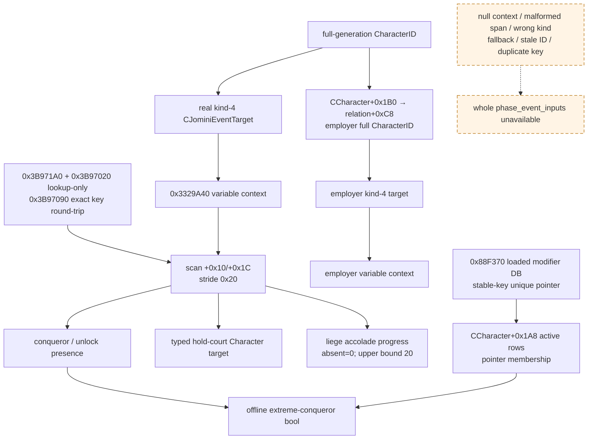
```mermaid
flowchart TD
    C["full-generation CharacterID"] --> T["real kind-4 CJominiEventTarget"]
    T --> V["0x3329A40 variable context"]
    K["0x3B971A0 + 0x3B97020 lookup-only<br/>0x3B97090 exact key round-trip"] --> S["scan +0x10/+0x1C<br/>stride 0x20"]
    V --> S
    S --> P["conqueror / unlock presence"]
    S --> H["typed hold-court Character target"]
    S --> AP["liege accolade progress<br/>absent=0; upper bound 20"]
    C --> E["CCharacter+0x1B0 → relation+0xC8<br/>employer full CharacterID"]
    E --> T2["employer kind-4 target"]
    T2 --> V2["employer variable context"]
    DB["0x88F370 loaded modifier DB<br/>stable-key unique pointer"] --> M["CCharacter+0x1A8 active rows<br/>pointer membership"]
    P --> X["offline extreme-conqueror bool"]
    M --> X
    U["null context / malformed span / wrong kind<br/>fallback / stale ID / duplicate key"] -.-> F["whole phase_event_inputs unavailable"]
    classDef unknown stroke-dasharray: 6 4,fill:#fff4e5,stroke:#b36b00;
    class U,F unknown;
```

### Garuda court-position exact-build reader ABI

[static-confirmed] `root.court_positions.garuda` 已闭合到原 `has_court_position = garuda_court_position`
Character leaf。trigger literal RVA `0x435AE20`、注册链 `0x530620..0x5306B3`，factory vtable
`0x435C7F8` / creator `0x2826AD0`，最终 compiled vtable `0x435C558` 的 `+0xC8` evaluator 是
`0x2825600`。其 ABI 近似：

```cpp
bool compiled_has_court_position(
    const CHasCourtPositionTrigger* compiled, // target CCourtPositionType* at +0x70
    const ScopeHolder* holder);               // holder[0] -> real kind-4 Character target
                                                // RVA 0x2825600
```

production reader 不需要构造 compiled trigger，也不得调用 factory。它先以 pure hash
`0x3B8B000("garuda_court_position", 21)` 在已经加载的 `CCourtPositionTypesDatabase` 中解析目标 type：数据库
pointer 位于 `module+0x570BFE0`，hash lookup 是 `0x997A70(db,hash)`，missing fallback 位于
`module+0x570C618`。`0x88C400()` 只是带 lazy-init 的 getter；bridge 若发现全局 pointer 为 null 必须失败，
不能为一次 query 初始化全局数据库。返回的 `CCourtPositionType+0x18` 是 stable-key `std::string`：
`0x2C6619A..0x2C661CF` 在 type lifecycle 中正从该 offset 取 bytes/length、调用同一个 `0x3B8B000`。
因此 bridge 必须拒绝 fallback，并把 `+0x18` exact byte-round-trip 到 `garuda_court_position`；不能只信 hash。

`0x2825600` 解析 Character 后实际只遍历以下结构：

```cpp
void* relation_state = *(void**)(character + 0x1B0);

// null relation_state uses the engine's all-zero empty header at RVA 0x4FF2D18.
// Otherwise the character's held-court-position ID span begins at +0xD0.
const std::int32_t* ids = *(const std::int32_t**)(relation_state + 0xD0);
std::int32_t count = *(const std::int32_t*)(relation_state + 0xDC);

// Full CCourtPositionID store/fallback.
void* store = *(void**)(module + 0x570C5F8);
void* fallback = *(void**)(module + 0x570C5F0);
// resolved CCourtPosition identity at +0x08
// CCourtPositionType* at +0x110
bool garuda = any(resolved_position->type_at_0x110 == garuda_type);
```

每个 ID 以 low 24-bit index 进入 store `+0x20/+0x2C`，slot stride `0x10`、object pointer 在 slot `+0x08`；
非空对象必须以 `CCourtPosition+0x08` 回读完整 generation-bearing ID。原 leaf 最终仅比较
`CCourtPosition+0x110` 与 compiled `+0x70` 的 type pointer。null relation/empty span/没有命中都是合法
`false`；非 sentinel ID 解析失败、命中 fallback、identity 回读不等、malformed span、target type missing/fallback/
key mismatch 或 query 前后 Character/relation span identity/count/generation 改变，则整个
`phase_event_inputs` 原子 unavailable。该 direct mirror 不创建 court position、不注册 ID、不抽 RNG，也不需要
Combat/CombatSide token。

```json
{
  "court_positions": {
    "garuda": false
  }
}
```

fixture 至少覆盖 null relation、empty span、仅非 Garuda position、Garuda 命中、mixed positions、stale/full-ID
generation mismatch、position store fallback、type DB missing/fallback/hash round-trip mismatch、negative/overflow
count 与 mid-query span change，并用真实 kind-4 scope 下的 `0x2825600` 与 direct mirror 对拍。该 leaf 使下面两项
无需新增 native reader即可按 stock script value 离线闭合；`garuda_prowess_svalue = 8`，每一步仍用 signed
Q100000、向零截断：

```text
root_injury_factor_40_with_garuda_raw =
    max(trunc0(((40 - prowess + (garuda ? 8 : 0)) * 100000) / 40), 10000)

root_injury_factor_30_with_garuda_raw =
    max(trunc0(((30 - prowess + (garuda ? 8 : 0)) * 100000) / 30), 10000)
```

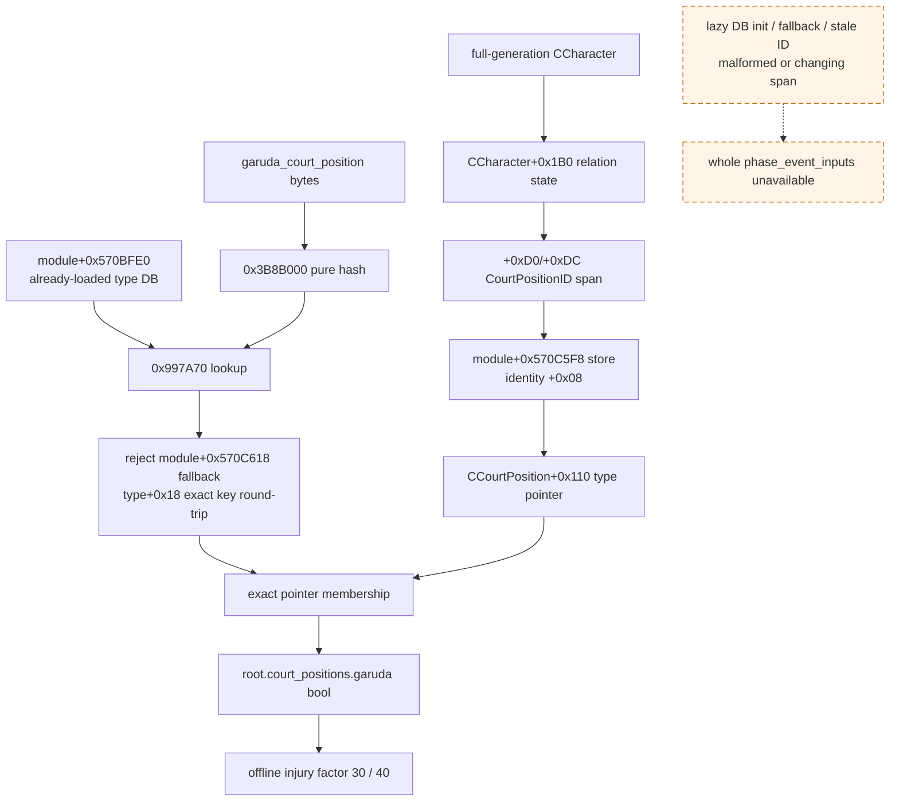
```mermaid
flowchart TD
    K["garuda_court_position bytes"] --> H["0x3B8B000 pure hash"]
    DB["module+0x570BFE0<br/>already-loaded type DB"] --> L["0x997A70 lookup"]
    H --> L
    L --> RT["reject module+0x570C618 fallback<br/>type+0x18 exact key round-trip"]
    C["full-generation CCharacter"] --> R["CCharacter+0x1B0 relation state"]
    R --> A["+0xD0/+0xDC CourtPositionID span"]
    A --> S["module+0x570C5F8 store<br/>identity +0x08"]
    S --> T["CCourtPosition+0x110 type pointer"]
    RT --> EQ["exact pointer membership"]
    T --> EQ
    EQ --> G["root.court_positions.garuda bool"]
    G --> D["offline injury factor 30 / 40"]
    U["lazy DB init / fallback / stale ID<br/>malformed or changing span"] -.-> F["whole phase_event_inputs unavailable"]
    classDef unknown stroke-dasharray: 6 4,fill:#fff4e5,stroke:#b36b00;
    class U,F unknown;
```

### Accolade unlock 13-branch exact-build reader 与离线 AST

[static-confirmed] manifest 的 `root.accolade_unlocks.<key>.valid` 表示
`knight_qualify_for_accolade` 内对应 **random-list branch 的完整 trigger 是否通过**，不是同名
`*_attribute_trigger` 本身。原规则来自已冻结 hash 的 `04_ep2_accolade_triggers.txt` 与
`00_knight_phase_events.txt`；`skill_accolade_acceptable_value = decent_skill_rating = 12`，
`faith_evil_level = 3`，tourney track 阈值 `30` 是 Q100000 raw `3000000`。native 只发布下面的 raw leaves，
`root.accolade_unlocks` container 与 13 个 `valid` 由进程外 normalized AST 组装；不得在 native 再发布一套
可能与 manifest 漂移的 derived bool。

#### Trait/group 与 tourney track leaves

这 13 条 trigger 新增的 trait-or-group stable keys 为：

```text
zealous, holy_warrior, reckless, forest_fighter, winter_soldier,
jungle_stalker, rough_terrain_expert, open_terrain_expert, strong,
athletic, physique_good, aggressive_attacker, cautious_leader,
desert_warrior, flexible_leader, nomadic_philosophy, scholar,
brave, berserker
```

它们统一走本章前述 `0x2CB33A0` descriptor 与 `0x261A730 > 0`；其中 `physique_good` 已由
`00_traits.txt` 证实是 `physique_good_1/2/3` 的 group，不能调用 concrete-only `0x260F740` 假装解析。
`tourney_participant` descriptor 必须唯一落到一个 concrete `CTrait`，再由 `0x260F640` 与
`0x2CAFFD0` 读取 `bow/foot/horse` 三个 Q100000 track。direct trait absent 与 canonical empty XP span 分别是
合法 `false/0`；descriptor/child/key 重复、track key missing/OOB 或 span malformed 是 whole-v3 failure。

#### Culture innovation / tradition 与 government flag leaves

原 compiled readers 与 production direct mirror 如下。所有对象都是同一 paused query 内的 borrowed pointer；
Character→Culture、CharacterID 与 CultureID 的 full-generation resolve/identity gate 复用前文合同。

```cpp
// Original compiled evaluators; production mirrors their state leaves instead
// of constructing compiled triggers or scope tokens.
bool compiled_has_innovation(/* compiled, kind-0x1A Culture scope */); // RVA 0x282CE90
bool compiled_has_cultural_tradition(/* compiled, Culture scope */);  // RVA 0x282D990

void* innovation_database(); // RVA 0x9A6690; global module+0x570C7A8
void* tradition_database();  // RVA 0x9A66F0; global module+0x570C7A0
CCultureInnovationType* lookup_innovation(void* db, std::uint64_t hash); // RVA 0xE71070
CCultureTradition* lookup_tradition(void* db, std::uint64_t hash);       // RVA 0xC8FC40

// Innovation ownership: CCulture+0x758 data / +0x764 signed count;
// pointer membership helper RVA 0x9A3C20.
// Tradition ownership: CCulture+0x178 data / +0x184 signed count;
// pointer membership helper RVA 0x9A3E60.
```

两种 definition 的 stable-key `std::string` 都在 `+0x18`。innovation 必须拒绝
`module+0x57C04E0` fallback，tradition 必须拒绝 `module+0x57BF050` fallback，并对
`0x3B8B000` hash lookup 的返回对象做 exact byte round-trip；tradition 还必须通过原 evaluator 所用的 resolved-object
validity path。required key 未加载、重复、hash collision/fallback、Culture span malformed 或 membership helper
失败都使整个 v3 unavailable；对象与 span 均合法但未持有该 key 才是 observed `false`。

所需 innovation keys 是：

```text
innovation_quilted_armor, innovation_sarawit, innovation_legionnaires,
innovation_arched_saddle, innovation_valets, innovation_tiefutu,
innovation_advanced_bowmaking, innovation_repeating_crossbow,
innovation_war_camels, innovation_elephantry,
innovation_gunpowder, innovation_fire_medicine
```

所需 tradition keys 是：

```text
tradition_fp1_coastal_warriors, tradition_hird, tradition_futuwaa,
tradition_druzhina, tradition_khadga_puja, tradition_garuda_warriors,
tradition_himalayan_settlers, tradition_mubarizuns,
tradition_burman_royal_army, tradition_mountaineer_ruralism,
tradition_caucasian_wolves, tradition_roman_legacy,
tradition_ep3_audacious_cadets, tradition_ep3_imperial_tagmata
```

已有 `0x22C5800` Culture-parameter reader 再增加以下 stable identifiers：
`unlock_zhanmadao`、`unlock_burenjia`、`unlock_maa_cataphract_archers`、
`unlock_maa_black_armor_cavalry`、`unlock_maa_horse_archers`、`unlock_maa_mangudai`、
`unlock_emishi_horse_archers_units`、`unlock_mounted_samurai_units`。stock horse-archer trigger 在 source 中
把 `unlock_maa_cataphract_archers` 写了两次；offline AST 保留该 source provenance，布尔结果只需一次 exact leaf。

`government_has_flag = government_is_nomadic` 的原 evaluator 是 `0x2839340`；它从 kind-4 Character 调
canonical read-only resolver：

```cpp
CGovernment* character_government(CCharacter*); // RVA 0x26165B0

// alive landed:     *(character+0x1B8) + 0x3F0
// alive unlanded:   character+0x1B0 relation -> +0xC8 CharacterID,
//                   then recursively resolve liege/employer government
// dead:             *(character+0x1C8) + 0x88
// invalid/no-government: canonical object module+0x570CB50

// CGovernment+0x48 is a sorted int32 identifier span (data +0, count +0x0C).
bool int32_span_contains(/* government+0x48, &flag_id */); // RVA 0xB1C4A0
```

flag ID 必须由 lookup-only `0x3B588E0("government_is_nomadic")` 解析并由 `0x3B58970` exact name
round-trip；禁止调用会 intern 新 identifier 的 `0x3B58330`。expected Character resolve/generation 失败或 flag span
malformed 是 whole-v3 failure；**valid Character 合法解析到 canonical null-government 且其空 span 合法时，原
evaluator 得到 observed `false`，不是 unavailable**。

#### Current accolade category leaf

`single_maa_attribute_allowance` 需要分开观测“当前 accolade 是否存在”与“该 accolade 是否已有
`men_at_arms` category”。前者复用 `CCharacter+0x1A8 -> +0x568` 的 optional full CAccoladeID；后者镜像
`has_accolade_category` 的原 evaluator `0x2819960`：

```cpp
// CAccolade store/fallback: module+0x57BF1E0 / module+0x57BF198
// identity: CAccolade+0x08; validity helper: 0x251C200(CAccolade*)
// attribute rows: CAccolade+0x58 data / +0x64 count, stride 0x18
// row+0x10 -> attribute/type object; its sorted category-ID span is +0x3E8
bool int32_span_contains(/* attribute+0x3E8, &category_id */); // RVA 0x975B50
```

category ID 同样使用 `0x3B588E0("men_at_arms")` + `0x3B58970`，不能 intern。合法 absent accolade 表示
`status=absent`，offline allowance 为 true，且不调用 Accolade receiver；合法 existing accolade 的 empty rows/no hit
是 `has_men_at_arms_category=false`。stale/fallback ID、`0x251C200` failure、malformed rows/category span、key
round-trip failure 或 mid-query identity change 均使 whole v3 unavailable。

#### Directional faith-hostility 与 selector scope

fanatic 外层条件使用 **enemy participant Faith 作为 receiver/source、root Faith 作为 target**；hostility 可能不对称，
不得反转参数：

```cpp
int32_t faith_hostility_level(
    void* receiver_hostility_state, // receiver CFaith + 0x278
    CFaith* receiver,
    CFaith* target);                // RVA 0x24EDB20; expected enum 0..3
```

每侧 request-order ArmyID → `CArmy+0x124` CUnitID → `CUnit+0x174` owner CharacterID 的 first-seen unique
participant roster 已在前文闭合；对每个 owner 严格读取 `CCharacter+0xB4` FaithID，再求
`hostility(enemy_faith, root_faith)`。任一 Faith generation/store/fallback/identity 失败或 helper 返回 `[0,3]`
以外的值，整个 v3 unavailable；合法空 enemy roster 的 `any` 为 false。

这里还有一个必须保留的原版 scope 边界。selector `0x2E1C570` 在 `0x2E1C5A6` 构造 kind-4 Character root，
随后只在 `0x2E1C5EB..0x2E1C5F6` 调一次 `0x3358160` 插入 kind-11 named scope。该 key 的全局
`module+0x57EB630` 由 initializer `0x8AC0` 从 RVA `0x4095170`、length `0x0B` 的 exact 字符串
`combat_side` 初始化；没有第二个 named-scope insertion，也没有 `scope:owner`。因此 stock
`fanatic_attribute_trigger` 的第一项 `scope:owner.faith ?= faith` 在这个 fresh phase-event context 中走 optional
absent，整个 attribute trigger 为 false；它后面的 unlock variable/zealous/holy-warrior OR 在此调用点不改变结果。
不得凭名字把 `owner` 猜成 root、liege、army owner 或 primary participant。于是 phase-event specialization 中：

```text
fanatic_attribute_trigger = false
fanatic.valid = any(hostility(enemy_participant_faith -> root_faith) >= 3)
```

#### 完整 13-branch 公式

定义 `U(x)` 为对应 `x_attribute_unlock` variable presence；`T(x)` 为 trait/group present；
`XP(track)` 为 tourney Q100000 raw；`Allow = !accolade_exists || !has_men_at_arms_category`；
`M(x)` 为前文 exact MAA-family raw count。每个 `Attr(x)` 严格按原 trigger 定义，最终 branch
`valid` 再做外层条件与 `NOT Attr(x)`：

| branch | `Attr(x)`（原 attribute trigger） | manifest `root.accolade_unlocks.x.valid` |
|---|---|---|
| skirmisher | `(U || XP(bow)>=3000000 || XP(foot)>=3000000 || winter_soldier || jungle_stalker) && Allow` | `M(skirmishers)>0 && !Attr` |
| archer | `(U || XP(bow)>=3000000 || forest_fighter) && Allow` | `M(non_crossbow_archers)>0 && !Attr` |
| crossbowmen | `(U || XP(bow)>=3000000 || cautious_leader) && CultureAny(advanced_bowmaking,repeating_crossbow) && Allow` | `M(crossbow_family)>0 && !Attr` |
| pike | `(U || XP(foot)>=3000000 || rough_terrain_expert) && Allow` | `M(pikemen)>0 && !Attr` |
| vanguard | `(U || strong || athletic || physique_good || XP(foot)>=3000000) && CultureAny(vanguard 3 innovations, 10 traditions, 2 parameters) && Allow` | `M(heavy_infantry)>0 && !Attr` |
| outrider | `(U || XP(horse)>=3000000 || open_terrain_expert) && Allow` | `M(light_cavalry)>0 && !Attr` |
| lancer | `(U || XP(horse)>=3000000 || aggressive_attacker) && CultureAny(lancer 3 innovations, 4 traditions, 2 parameters) && Allow` | `M(heavy_cavalry)>0 && !Attr` |
| camelry | `(U || XP(horse)>=3000000 || desert_warrior) && CultureHas(innovation_war_camels) && Allow` | `M(camel_cavalry)>0 && !Attr` |
| elephantry | `(U || XP(horse)>=3000000 || jungle_stalker) && CultureHas(innovation_elephantry) && Allow` | `M(elephant_cavalry)>0 && !Attr` |
| horse_archer | `(U || XP(horse)>=3000000 || XP(bow)>=3000000 || flexible_leader) && (CultureAny(5 horse-archer parameters) || government_is_nomadic || nomadic_philosophy) && Allow` | `M(archer_cavalry)>0 && !Attr` |
| gunpowder | `(U || scholar || learning>=12) && CultureAny(gunpowder,fire_medicine) && Allow` | `M(gunpowder)>0 && !Attr` |
| fanatic | selector specialization 固定 `false`，见上节 | `AnyEnemyFaithHostilityToRoot>=3` |
| valiant | `U || brave || berserker || reckless` | `own_side_army_size_raw >= trunc0(enemy_side_army_size_raw * 66000 / 100000) && !Attr` |

`CultureAny` 在 Character 没有合法 Culture scope 时按 optional-scope 语义为 false；合法 Culture 但没有任一 key
也是 false。`Allow` 是 **Attr 的一部分**，不是 branch 的额外正向 gate：原脚本写的是
`*_attribute_trigger = no`，因此不能把公式错误改成 `M>0 && !eligibility && Allow`。同理 fanatic/valiant 没有
MAA-existence outer condition；它们的 random weight 另取 `maa_regiment_count_raw / 2`，即使 trigger true 也可能因
最终 integer weight 非正而不被抽到。

建议 raw wire 与离线结果冻结为：

```json
{
  "accolade_unlock_inputs": {
    "attribute_unlock_present_by_key": {
      "skirmisher": false, "archer": false, "crossbowmen": false,
      "pike": false, "vanguard": false, "outrider": false,
      "lancer": false, "camelry": false, "elephantry": false,
      "horse_archer": false, "gunpowder": false,
      "fanatic": false, "valiant": false
    },
    "trait_or_group_present_by_key": {
      "physique_good": false, "forest_fighter": false
    },
    "tourney_participant_track_xp": {
      "bow_raw": 0, "foot_raw": 0, "horse_raw": 0, "scale": 100000
    },
    "culture": {
      "status": "available",
      "innovation_present_by_key": {},
      "tradition_present_by_key": {},
      "parameter_present_by_key": {}
    },
    "government_flags": {"government_is_nomadic": false},
    "current_accolade": {
      "status": "absent",
      "accolade_id": null,
      "has_men_at_arms_category": false
    }
  },
  "enemy_participant_faith_hostility_to_root": [
    {
      "owner_character_id": 123,
      "faith_id": 456,
      "root_faith_id": 789,
      "hostility_level_raw": 3,
      "scale": 1
    }
  ],
  "accolade_unlocks": {
    "skirmisher": {"valid": true},
    "fanatic": {"valid": true},
    "valiant": {"valid": false}
  }
}
```

JSON 中缩写的 trait/culture maps 在正式 schema 必须枚举上述完整 required-key 集，不能以 missing key 代表 false。
`accolade_unlocks` 是 admission 后的 offline-normalized container，不是 native input。任一 DB/key/store/fallback/
generation/identity/vcall/span failure、hash/key round-trip mismatch 或 query 中 revision 改变，都使整段
`phase_event_inputs` 原子 unavailable；合法对象上的未命中、absent optional accolade/culture/trait 与 canonical
null-government 则按上文各自语义产生确定的 false/zero。

fixture 至少覆盖：tourney XP raw `2999999/3000000`、learning `11/12`、`physique_good_1/2/3` 各自命中与全无、
每个 MAA count `0/>0`、每类 Culture OR 的单 key 命中与全无、canonical null-government/nomadic、accolade
absent/存在但非 MAA/已有 MAA category、enemy→root hostility `2/3` 及反向值不同、重复 enemy Faith、fresh selector
没有 `owner`、valiant threshold 正下方/恰好相等、以及每种 malformed/fallback/mid-query 失败。ongoing real
Combat fixture 还应把 offline 13 bool 与 `0x334C510` 对拍；precontact 仍禁止伪造 CombatID。

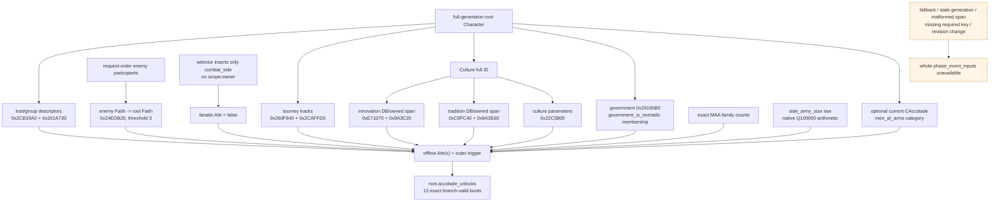
```mermaid
flowchart TD
    C["full-generation root Character"] --> T["trait/group descriptors<br/>0x2CB33A0 + 0x261A730"]
    C --> X["tourney tracks<br/>0x260F640 + 0x2CAFFD0"]
    C --> CU["Culture full ID"]
    CU --> I["innovation DB/owned span<br/>0xE71070 + 0x9A3C20"]
    CU --> TR["tradition DB/owned span<br/>0xC8FC40 + 0x9A3E60"]
    CU --> CP["culture parameters<br/>0x22C5800"]
    C --> G["government 0x26165B0<br/>government_is_nomadic membership"]
    C --> AC["optional current CAccolade<br/>men_at_arms category"]
    S["request-order enemy participants"] --> FH["enemy Faith -> root Faith<br/>0x24EDB20, threshold 3"]
    M["exact MAA family counts"] --> A["offline Attr(x) + outer trigger"]
    T --> A
    X --> A
    I --> A
    TR --> A
    CP --> A
    G --> A
    AC --> A
    FH --> A
    SZ["side_army_size raw<br/>native Q100000 arithmetic"] --> A
    A --> O["root.accolade_unlocks<br/>13 exact branch-valid bools"]
    NS["selector inserts only combat_side<br/>no scope:owner"] --> FA["fanatic Attr = false"]
    FA --> A
    U["fallback / stale generation / malformed span<br/>missing required key / revision change"] -.-> F["whole phase_event_inputs unavailable"]
    classDef unknown stroke-dasharray: 6 4,fill:#fff4e5,stroke:#b36b00;
    class U,F unknown;
```

### Side primary / strength / army-size exact-build reader ABI

[static-confirmed] stock phase-event 的 `side_strength` 与 `side_army_size` 不是 army-strength-v1 的
`base_power_raw`，也不是胜率。两个 compiled numeric object 的最终 vtable 分别是 `0x437BBD8` 与
`0x437DC88`；它们的 `+0xD8` fixed-value adapter 分别为 `0x9A35F0` 与 `0x9A3310`，实际 leaf 在
vtable `+0x100`。hypothetical precontact 不调用会把 kind-11 scope token 解析成已注册 CCombat 的
`0x2011090`，而是复用下面已闭合的 leaf helper / 严格镜像：

```cpp
// Original side_strength leaf used after the compiled scope resolver.
// Reads only side entry arrays +0x28/+0x34 and +0x40/+0x4C.
int32_t combat_side_strength(CCombatSide* side); // RVA 0x23CC340

// Per-entry leaf called by 0x23CC340. SideMaaEntry60 has stride 0x60.
int32_t combat_entry_strength(const SideMaaEntry60* entry); // RVA 0x23D2D70

// Original side_army_size compiled leaf. Do not call this entry from
// hypothetical code because it first resolves a real kind-11 scope token.
int32_t compiled_side_army_size(void* compiled_object,
                                const ScopeToken* side_scope); // RVA 0x284FE10
```

`0x23CC340` 以 source order 遍历 `side+0x28/count+0x34`，再遍历
`side+0x40/count+0x4C`，对每个 `0x60`-byte entry 调 `0x23D2D70` 并以 signed int32 累加。
`0x23D2D70` 只读 `entry+0x18` main-phase current soldiers Q100000，以及已 materialize 的
`entry+0x40/+0x48` target-effective damage/toughness Q100000，执行两次原版 fixed-point 向零除法：

```text
entry_strength_raw = trunc0(
    trunc0(current_main_raw * (damage_raw + toughness_raw) / 100000)
    / 100000)
side_strength_raw = sum_in_native_bucket_and_entry_order(entry_strength_raw)
```

这正是 stock `side_strength` numeric adapter 发布的 signed raw 值；adapter `0x9A35F0` 不再乘
`100000`。wire 仍把它标成原版 numeric `scale=100000`，以便 normalized AST 原样做 side-to-side
比较、除法与 `×5`，但**绝不能**把 `raw/100000` 命名成士兵数、AI power 或胜率。native 应对已经由
v2 安全 local-side constructor/materializer 形成的、caller-owned 且未注册的 side 直接调用
`0x23CC340`，并用同一 rows 的离线镜像做 fixture equality；任一 entry/stat 未闭合则 whole v3
`unavailable`。

`side_army_size` 的 `0x284FE10` 则遍历 `CCombatSide+0x10/count+0x1C` 的 full CArmyID，依次经
`base+0x570C730` 解析并回读 `CArmy+0x10`，再遍历 `CArmy+0x38/count+0x44` 的 full
CRegimentID；每个 regiment 必须经 `base+0x57BF4C8` 解析、回读 `CRegiment+0x10`，并通过
`CRegiment+0x08` vtable `+0x08` 的 identity-initialized predicate `0x10495A0`，随后累加
`CRegiment+0x38` current soldiers。原 evaluator 的 fixed-value adapter `0x9A3310` 最后把该 signed
int32 soldier count 乘 `100000`；因此 wire 的 `side_army_size_raw` 是
`checked_sum_current_soldiers * 100000`、`scale=100000`。bridge 禁止接受两个 engine fallback，数组非法、
generation 回读不等、identity predicate 调用失败或 checked sum 超出 int32 时整个 v3 原子失败。

primary participant 是 side-wide **owner CharacterID**，不是 battle commander。`0x23C9361..0x23C93E7`
在 `CCombatSide+0x70==-1` 或旧 primary 已不再拥有 side 中任一 army 时，取当前 side army array 的第一项，
沿 `CArmy+0x124` full CUnitID → `CUnit+0x174` owner CharacterID 写入 `side+0x70`；
`bool 0x23C9600(CCombatSide*, int32 primary_owner_id)` 只要还能找到同 owner army 就保留它。对 v3
explicit hypothetical contact，conditional primary 固定为每侧显式 request/insertion order 第一军的 owner，
并发布该 source ArmyID；这不声称等于真实 route-arrival/stored order。

```json
{
  "primary_participant_character_id": 123,
  "primary_source_army_id": 357,
  "primary_selection_policy": "first_inserted_army_owner_with_native_preservation",
  "side_strength_raw": 123456,
  "side_strength_scale": 100000,
  "side_army_size_raw": 180100000,
  "side_army_size_scale": 100000
}
```

上面数字只展示类型，不是 live fixture。production fixture 必须分别覆盖两种 entry bucket、非 main-phase
entry（其 `+0x18==0`）、多 army/mixed owner、identity-invalid regiment、fallback 拒绝，以及 request order
交换后 primary 随之交换；paused live acceptance 还必须验证 `side_army_size_raw/100000` 与同 revision 各
regiment current-soldier 严格和相等。

```mermaid
flowchart LR
    Q["explicit hypothetical side<br/>ordered full ArmyIDs"] --> P["first army → CUnit owner<br/>conditional primary participant"]
    Q --> B["safe unregistered local side<br/>0x23C7D30 + 0x23C9100"]
    B --> E["two Entry60 buckets<br/>current-main + effective damage/toughness"]
    E --> H["0x23D2D70 per entry<br/>two trunc0 fixed divisions"]
    H --> S["0x23CC340<br/>side_strength_raw"]
    Q --> A["strict CArmy/CRegiment generation traversal"]
    A --> I["0x10495A0 identity initialized<br/>sum CRegiment+0x38"]
    I --> Z["×100000<br/>side_army_size_raw"]
    F["fake kind-11 CombatID/scope token"] -. "forbidden" .-> X["0x2011090 compiled resolver"]
    P --> O["atomic v3 side row"]
    S --> O
    Z --> O
    classDef forbidden stroke-dasharray: 6 4,fill:#fff4e5,stroke:#b36b00;
    class F,X forbidden;
```

### Advantage constructor exact source order

[static-confirmed] `0x2304830` 的 constructor append 顺序固定为：side0 supply → side1 supply → holding
defender → side0 first-army recently-disembarked → side1 first-army recently-disembarked → side0 debt → side1 debt →
side0 unreformed faith → side1 unreformed faith。v3 必须按该顺序发布每个实际 append 的 source row，不能把同名 points
预先求和后丢失顺序；完整证据表另见
[combat-simulation-inputs.md](combat-simulation-inputs.md#v3-advantage-constructor-source-trace)。

```cpp
void append_advantage_source(
    CCombat* combat, const CCombatEffect* effect,
    int64_t scale_raw, int32_t side_index); // RVA 0x23045F0
// effect points: int32 effect+0x38
// contribution = fp_mul(points * 100000, scale_raw)
// side0 adds, side1 subtracts; clamp aggregate after every append to
// [-10'000'000, +10'000'000] raw == [-100,+100]
// side0 rows: CCombat+0x98, count +0xA4, stride 16 {effect*,scale_raw}
// side1 rows: CCombat+0x3E0, count +0x3EC, same stride
```

- [static-confirmed] `0x23049E0(PdxArrayHeader<int32 full_CArmyID>*)` 遍历 `data+0/count+0xC`，只按当前
  eligible soldiers 计算严格多数 supply category；每 army supply raw 来自 `CArmy+0x180` Q100000 后转整数。
  `supplied > 50%` 才是 supplied；否则 `supplied + running_low > 50%` 才是 running-low，平票落入更坏类别；
  返回 DB singleton `+0xF38/+0xF48/+0xF58`。
- [static-confirmed] recently-disembarked 只看各 side request/source-order 第一支 army 的 `CArmy+0x5C != 0`，
  effect singleton 是 `+0xF18`。这不是“任一 army recently disembarked”。
- [static-confirmed] `0x2304EC0` 从 first army 到 `CUnit+0x174` owner；`0x28DBB70(owner,0)` 与
  `0x28DBB70(owner,3)` 选择 debt effect，数组分别为 singleton `+0xFE8/count+0xFF4`、
  `+0x1090/count+0x109C`，selector 越界均回退 `+0xF78` no-income。v3 应发布 selected source identity 与 raw
  contribution，不把它压成自定义 debt tier 名称。
- [static-confirmed] `0x2305290` 按每 side first-army owner/faith 与 target 判断 unreformed-faith source，effect
  singleton 是 `+0xF68`。
- [static-confirmed] 当前真正用于伤害的 resolved 值满足
  `CCombat+0x710 = CCombat+0x6C8 + 0x2307CB0(side0) - 0x2307CB0(side1)`。`0x2307CB0` 的 roll、
  target-condition residual、canonical battle commander (`0x23C8A60` + `0x2307680`) 与 side aggregator
  (`0x2307230`) decomposition 已闭合；precontact wrapper 只能使用 caller-owned、unregistered、zeroed `0x718`
  local shell，不能调用会注册 combat 或写 `CUnit+0x168` 的 constructor。production source/ledger fixture 与
  runtime original-helper equality gate 已接入；paused-live 尚未执行。任一帧 equality 不成立时整段 unavailable，
  仍不得拿 v2 `generic_advantage_points` 代替。

current revision 4 的 combined defensive fixture 冻结了 3 commanders + 25 knights；v3 必须对下列每个 ID 发布上表
适用字段，且 `(character_id, source_army_id, phase_role)` 唯一，不能只补玩家侧：

| army / encounter role | commander | knights（source order） |
|---|---:|---|
| `357` / attacker | `36108` | `32381, 29274, 30629, 33011, 59445, 59442` |
| `33554657` / attacker | `28180` | `43433, 33297, 56793, 43429, 35345, 33707, 30773` |
| `83886341` / defender | `29829` | `32440, 33433, 32716, 43706, 34333, 33437, 57582, 33435, 33888, 34867, 30784, 35637` |

### v3 最小 DTO 与 precontact 限制

v3 保留 v2 的 explicit target/entry/attacker IDs/defender IDs，并新增以下 observation slice。

[implementation-confirmed] production exact-build 合同现已接入：capability
`game.command.query-combat-simulation-inputs-v3-N`、正式 literal parser/adapter/bridge dispatch、Python strict
normalizer/driver/service/MCP，以及 C++ DTO/reader/serializer 位于 `native_bridge/include/xar_bridge/combat_v3.hpp`、
`native_bridge/src/combat_v3.cpp` 与 `combat_v3_serializer.cpp`。available/unavailable command-result goldens 位于
`native_bridge/research/fixtures/combat_simulation_inputs_v3_production_*.json`，均逐键通过 strict normalizer。
coverage 是 `81` 个 exact native leaf + `51` 个 offline-derived/container contract = ABI-level `132/132`，missing `0`；
这会打开 observation readiness；同一 payload 的 132 refs 还会经过 13/13/13 strict audit，并逐 side 验证
`candidate_source_proof` 的 compact-JSON digest 与 commander/knight/army/character/regiment roster；candidate materialization/order
因此已对该 production payload 闭合。15 项 battle-horizon feedback 仍未闭合，所以
`ast_evaluator_ready=false`。`loaded_playset_verified` 只由 episode-bound proof 按本帧决定，`original_trace_ready` 仍关闭；本轮
没有新增 paused-live acceptance。side primary、`side_strength_raw` 与 `side_army_size_raw` 是 typed side 字段，并与 closed state refs
交叉校验；任一 side helper/generation/materialization/equality 失败时保留完整 v2 `base_inputs`，但整段
`phase_event_inputs` 原子 `unavailable`，不发布 partial raw/advantage。

```json
{
  "phase_event_inputs": {
    "status": "available",
    "rules_manifest_sha256": "91EDCEEDC634C5ACDCFAC8B02F53FE74C4E7A2E1768AAFC12CD0D976E874F2AC",
    "scope_mode": "hypothetical_precontact_offline_ast",
    "characters": [
      {
        "character_id": 36108,
        "source_army_id": 357,
        "source_regiment_id": null,
        "encounter_role": "attacker",
        "phase_roles": ["commander"],
        "alive": true,
        "is_ai": true,
        "skills_raw": {"martial": 0, "prowess": 0, "learning": 0, "scale": 1},
        "traits": {
          "present_by_key": {"brave": false, "wounded_1": false},
          "wounded_rank_raw": 0,
          "track_xp": {
            "fragile_bones/fragile_bones": {"raw": 0, "scale": 100000},
            "lifestyle_blademaster/<single_default>": {"raw": 0, "scale": 100000}
          }
        },
        "faith_culture": {
          "culture_id": 0,
          "faith_id": 0,
          "religion_id": 0,
          "checks": {
            "heritage_north_germanic": false,
            "knights_slightly_more_prone_to_injury": false,
            "death_is_glory": false,
            "tenet_warmonger": false,
            "germanic_religion": false
          }
        },
        "house_liege_accolade": {}
      }
    ],
    "armies": [
      {
        "army_id": 357,
        "supply_state": "normal",
        "owner_debt_tier": "none",
        "recently_disembarked": false
      }
    ],
    "sides": [
      {
        "encounter_role": "attacker",
        "ordered_commander_ids": [36108, 28180],
        "ordered_knight_ids": [],
        "primary_participant_character_id": 0,
        "primary_source_army_id": 357,
        "primary_selection_policy": "first_inserted_army_owner_with_native_preservation",
        "side_strength_raw": 0,
        "side_strength_scale": 100000,
        "side_army_size_raw": 0,
        "side_army_size_scale": 100000,
        "advantage": {
          "constructor_order_policy": "native_0x2304830_source_order",
          "constructor_sources": [],
          "constructor_clamped_sum_raw": 0,
          "dynamic_resolved_raw": 0,
          "original_advantage_raw": 0,
          "scale": 100000
        }
      }
    ],
    "row_evaluations": {
      "status": "unsupported",
      "reason": "hypothetical_precontact_has_no_real_combat_side"
    }
  }
}
```

上例中的 `0`、空对象与空数组仅展示类型，**不是当前 live 值，也不是可接受的 fixture**。precontact 场景没有
真实 `CCombat`/`CCombatSide`，不得创建 fake CombatID 或把任意 side 指针塞进 compiled evaluator；native 只发布
raw character/army/side/province facts，由进程外 manifest AST 在 hypothetical side 上求值。只有 ongoing 真实战斗
能附带 real CombatID/side identity，并调用 `0x334C510/0x337B210` 发布 differential；该 differential 仍只验证当前
snapshot，不能冻结给多日 trial。

### v3 production acceptance

同一 paused revision 必须同时覆盖 single/combined × defensive/offensive 四个 query；每个 query 保持完整 army ID
集合、active-war/enmity、target/entry 与角色归属 gate。验收要求：

1. 每个 CharacterID/army/encounter role/phase role 唯一，3 commanders 与 25 knights 不漏不重；
2. 当前适用的所有 manifest `state_dependencies` 都能由 raw DTO 确定，不能为 `null`；
3. 三支 army 的 supply、两侧 first-army disembark/debt/faith 与 holding 都在同 revision；constructor rows 严格按
   `0x2304830` 顺序逐项用 `0x23045F0` 规则 signed-add/clamp，等于发布的 constructor total；resolved/raw
   advantage 另通过 `0x2307CB0` decomposition 对拍，terrain/crossing/holding 单独保留来源标签；
4. hypothetical precontact 的 differential 必须明确 `unsupported` 且没有 fake CombatID；ongoing differential 只接受
   native 验证过的真实 Combat/side；
5. 任一 required ref、identity、revision 或 source-sum gate 不满足时，当帧整个 v3 phase observation
   `unavailable`；production capability 保持广告，使调用者能在下一 paused frame 重试。v2 capability 继续兼容。

```mermaid
flowchart TD
    V2["[live-confirmed] v2 explicit hypothetical contact<br/>target + entry + A/D armies + roster"] --> R["[counter-policy] v3 raw character/army/side fields<br/>all manifest refs non-null"]
    R --> A{"[counter-policy] offline AST admission<br/>source hashes + revision + identities + sums pass?"}
    A -->|yes| H["[counter-policy] hypothetical precontact phase weights<br/>no fake CombatID"]
    A -->|no| U["[implementation-confirmed] phase_event_inputs unavailable<br/>base_inputs preserved; retry next paused frame"]
    U -. "query again after state stabilizes" .-> R
    O["[static-confirmed] ongoing real CCombatSide"] --> D["[static-confirmed] compiled trigger/chance differential<br/>0x334C510 / 0x337B210"]
    H --> T["[counter-policy] Monte Carlo trial mutation"]
    D --> C["[counter-policy] current-frame AST differential check"]
    C --> T
    T -. "[unknown] participant detach / same-day recompute trace" .-> N["next five-day weights and damage"]
```

## 同日状态可见性

[static-confirmed] 主阶段日内调用顺序是 side0 refresh → side0 event effects → side1 refresh → side1 event effects →
conditional commander rolls → advantage/damage。`0x23CA2F0` 先调用 `0x23CBC20(side)`，再 tail-call
`0x23C9900(side)`；main tick 对 side0 完成整条链后才进入 side1。

因此 side0 杀死 side1 knight 发生在 side1 refresh 之前；side1 杀死 side0 knight 则发生在 side0 当日 refresh
之后。调用顺序是静态事实，但“缓存的 knight contribution 在本日还是次日移除”的最终数值效果尚需 original
trace 互证，不能仅凭顺序猜测。

```mermaid
flowchart LR
    S0R["[static-confirmed] side0 refresh<br/>0x23CBC20"] --> S0E["[static-confirmed] side0 events<br/>0x23C9900"]
    S0E --> S1R["[static-confirmed] side1 refresh<br/>0x23CBC20"]
    S1R --> S1E["[static-confirmed] side1 events<br/>0x23C9900"]
    S1E --> R["[static-confirmed] conditional rolls"]
    R --> D["[static-confirmed] advantage and outgoing damage"]
    S0E -. "[unknown] victim contribution removed before this refresh?" .-> S1R
    S1E -. "[unknown] side0 cached contribution survives this day?" .-> D
```

## Golden vectors

这些 vectors 锁定 stock candidate row order 与已闭合 selector，不是当前 playset live acceptance：

| vector | frozen state | expected |
|---|---|---|
| commander rows | wounded rank 1、prowess 0、martial 高于 low threshold、双方等强、无其它 modifier | weights `[1000,25,10,5]`；sum `1040` |
| commander select | 上一 weights，`random31=0x226BC740` | target `279`；选择 index `0` `commander_none` |
| knight rows | alive、prowess 0、非 incapable/伤残/特殊 trait、无 accolade qualification、双方等强、无其它 modifier | weights `[2000,0,0,0,1,100,40,30,0]`；sum `2171` |
| knight select | 上一 weights，`random31=0x226BC740` | target `583`；选择 index `0` `knight_none` |
| maim branch | 四种 injury 均无；weights `[4,2,4,4]`；同一 draw | target `3`；选择 one-legged branch |
| prowess branch | learning/traits/culture 均无；weights `[60,30,10]`；同一 draw | target `26`；选择 no-op |
| prowess `+1` | 同一 weights，`random31=0x50000000` | target `62`；选择 `+1 prowess` |
| last-positive | 任一上述正权重表，`random31=0x7FFFFFFF` | 选择最后一个正权重 branch |

original-trace fixture 还必须覆盖：wound rank `3 -> death`、fragile-bones `+1/+2/+3`、已有 injury 时 maim branch
重分配、side0 kill side1 与反向 kill 的同日 contribution、selected victim 在 effect 执行前死亡、commander death
后的 roll/advantage、以及 accolade/prowess mutation 后下一次五日求值。

## Readiness 结论

[implementation-confirmed] stock candidate 的 13 个顶层 row、主要 combat-state transition、selector/PRNG 与日内
调用顺序已有 canonical manifest、独立 golden 和 production-source test；这比“phase events 不可知”更具体。但下列
门尚未通过，所以
`monte_carlo_ready` 仍必须是 `false`：

1. episode/frame-bound loaded-playset proof 与变更拒绝合同已经落地；每次 payload 仍须用本帧 environment、DLC load、
   singleton mod、production overlay 与 11 个 stock SHA 重新证明，不能把一次离线或历史成功升级成全局 true；
2. v3 的 character、faith/culture/religion、accolade/variable/Garuda、participant/hostility、game-rule、MAA-family、
   13 个 accolade unlock AST 所需 raw leaf 已全部接入 production，完整 named-key fixture 与 offline AST admission
   已通过；strict evaluator 现已覆盖 13/13 trigger/chance/effect AST（688 nodes），并由 production
   `candidate_source_proof` 逐 payload 闭合 actual side builder source-vector equality。15 类 side effect 的
   battle-horizon feedback 仍未闭合，所以 `ast_evaluator_ready` 保持 false。ongoing real-combat
   `0x334C510/0x337B210` differential fixtures 尚未完成；
   hypothetical precontact 不允许 fake CombatID；
3. effect-local `random_side_knight` 候选顺序/抽样和 trait/wound/maim/death/detach/advantage removal 等离线 mutation
   已在隔离 kernel 与 family golden 中实现；它们的原生 draw parity、死亡后同日 participant/contribution/commander
   replacement refresh 时点仍未通过 original trace；
4. advantage constructor source-order/append、temporary-shell teardown、zero-roll dynamic decomposition 与
   runtime original-helper equality gate 已接入 production；paused-live equality 尚未执行，且永远不能用 generic
   advantage 代替；
5. battle-end result envelope、validator 与静态顺序 core 已闭合；loaded result effects、AI retreat policy、simulator 与
   original trace 仍是独立 transition gate。

这些缺口不是把 phase input 长期留 null 的许可。下一观测口是对 ongoing、generation-valid 的真实 `CCombat`/
`CCombatSide` 接入 `0x334C510/0x337B210` differential trace、phase fire cadence、PRNG state/draw counter 与
before/after 角色状态快照；随后做 v3 四场 paused acceptance 和 evaluator/original effect trace 对拍，最后把已验证的
状态转移接入已冻结的 battle-end/retreat core。在该 trace gate 闭合前，planner 与主动攻击继续禁用。
