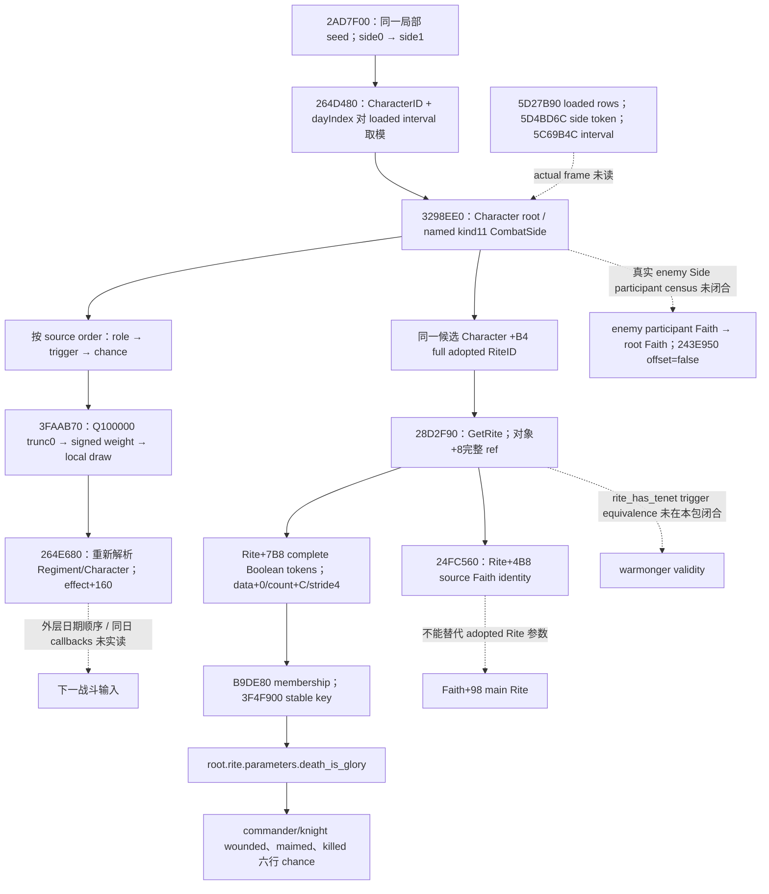

# CK3 1.20.0.3：phase 候选角色 Rite 参数的最小只读施工包

2026-10-06，状态 **research / 原生来源 static-confirmed**；本轮交付输入合同与施工方案，尚未实现新 provider，不增加 `static-ready` 或 live 能力数。冻结游戏为 CK3 1.20.0.3 Crozier / Steam build 25652598，EXE SHA-256 `94B55397ABB687A3DCD436805A5D885E6BE90FA6C693FEB44A9E3BBEEADE02A6`。源码基线 `57e8386d249723839bbb9dec532d352db07b46c9`；复用现有专题、生产源码与封存 native 片段，本轮新 EXE 读取、测试、build、游戏操作均为零。

本机用户当前只允许后台工作；没有启动、连接或查询 CK3。本专题不恢复旧宗教或非战限制，也不改变执行授权。当前 bounded V2 planner 仍可独立推进；本包针对更完整 forecast 的真实缺输入。

## 已有链与当前缺口

[ReadCombatPhaseInputs](../../ck3_autonomous_player/native_bridge/src/ck3_12002_phase.cpp) 先读非宗教 operands，再无条件写 `available=false`，返回 `phase_inputs_unavailable`。非宗教读取成功时 reason 为 `phase_religion_and_rites_implementation_pending`。候选角色循环已解析同一 Character 的 traits、culture、misc、MAA 输入，但没有填角色 Faith/Religion、Rite 参数、Tenet 与敌方参与者 Faith hostility。旧 DTO 的三个默认 false 字段不能证明这些值被读过。

现有 V2 `contextual_advantage` 已有独立的构造阶段宗教输入，包括选中 commander 的 adopted Rite hostility；[构造阶段 Faith/Rite 专题](combat-constructor-faith-rite-context-12003.md) 已闭合来源。它不覆盖 phase 的所有 commander/knight root，也不证明 phase 脚本中的 `Faith` hostility。不得为本任务重新研究它，或把它当成 phase 已完成。

`.3` 的 [当前 phase 源树](combat-phase-events-12003.md) 已封存调度与选择调用链；[当前人物 effects 投影](battle-phase-leaf-effect-fidelity-12003-2026-10-05.md) 已支持十三行 selected-event authored requests。当前 manifest 和旧 V3 producer 的 current-build AST/provenance 接线仍是不同层，十三行 effects 覆盖不自动填补输入、实际 loaded overrides、调度顺序或 callbacks。

## 原生输入树

实线为已封存 source 合同；虚线保留尚未闭合或未实读的分支。这里只声明图内列出的边。

当前 schedule/function RVAs、event 布局与 effects `+160` 来自旧封存 `.3` native-schedule 包，不是新 EXE 检索。stock 五日 interval 不能代替 `0x5C69B4C` 的 actual loaded DWORD。

## 最小工作包与实际收益

优先实施 **phase candidate adopted Rite complete Boolean parameters**。它用已存在的 native getters 与参数 copier，覆盖六个常见伤害/死亡行的 `root.rite.parameters.death_is_glory`；当前 stock 对该条件依 source order 乘 `1.1`，保持每步 Q100000 向零截断。它还提供 `knight_killed` 已选敌骑士的 `killing_bestows_heads` 与 `decapitation_steals_prestige_as_piety` 所需同源布尔参数，后者仍有 personal Tenet、人物资源及其他独立 dependencies。

选择这一包的必要性是确定的生产缺字段与六行 source consumer；无需闭合全部世界宗教、再次扫描 EXE、调用脚本 executor 或发明未来宗教状态。单独完成该包只解除相应 operand 的缺失；完整 V3、事件概率、native schedule、post-effect final stats 与未来 forecast readiness 仍按各自实际输入判断。

| 输入/入口 | 已有 exact `.3` 来源与最小读取 |
| --- | --- |
| 候选身份 | existing combat 的 commander / knight `character_id`；保留 source Army、source Regiment、role occurrence，不以相同 CharacterID 合并 provenance |
| adopted Rite | `Character+0xB4` full DWORD；`Character.GetRite 0x28D2F90`；raw ref 与返回对象 `+8` 对应，保留 full generation |
| source Faith | `Rite+0x4B8` full ref；`Rite.GetFaith 0x24FC560`，需要时复用 `Character.GetFaith 0x289E750`；不读取额外 fervor 等无消费者资源 |
| complete effective Boolean set | `Rite+0x7B8` 的 data `+0`、signed count `+0xC`、signed token stride4；`0xB9DE80` membership 与 `0x3F4F900` token stable-key copier |
| false / absent / unavailable | 同一 complete 集合中无 key 为 false；已确认 raw `0xFFFFFFFF` 为 adopted-Rite absent；合法 ref `0` 保留。缺 pointer、key 或不完整集合为 unavailable，不能写 false |

上述 `.3` 复用边界见 [当前宗教身份专题](religion-native-ai-faith-identity-12003.md) 的 getter/source/live 账本。既有 reader 仅接受实际 played actor；本包必须在已有 combat 查询中重用其内部已闭合的 Rite copy 逻辑，不能对 phase root 调玩家专用 query 或拼接独立 MCP epoch。它是新 candidate provider，不能继承玩家 getter 的 live 资格。

## 最短实施路线与 consumer

1. 增加一个独立 candidate Rite source helper 与专属 DTO/serializer 子块，消费已有 combat query 内已解析的 Character。复用 `religion_doctrine12002_tenet.cpp` 的 `ReadRite` 逻辑；它目前是 private helper，所以需小幅抽出 copier或局部复用，不能直接调用 `ReadPlayedTenetParameters12002` 换 root。
2. 首选在已有 **V2 combat query** 的 commander、knight 观察行各加 optional `phase_rite_parameters_v1`。该行的身份与 Army/Regiment provenance 已存在；叶子保留 `status`、`source_character_id`、raw adopted Rite ref、resolved `rite_id` / `faith_id`、`boolean_parameters_complete`、完整 stable keys、独立 reason。V3 candidate loop 可以复用同一 helper，并按其 native source-proof occurrence join 取值；V2 roster leaf自身不声称原生 candidate admission/order。
3. 现有 `combat_contract.py` 严格 normalizer 消费 optional 叶子；source-shaped adapter 将 complete 已观测集合映射到当前 manifest 的 `root.rite.parameters.*`。adapter 需按 actor/source occurrence 选叶子，不复用 Faith main Rite、不默认缺失 false，也不输出 native event selection。后续 `selected_enemy_knight` 使用同一角色叶子；当前已支持 effects 仍遵守其其余 dependencies。
4. 一个新必要 offline fixture 覆盖同源 complete true、已观测无 key、adopted/main 不同、合法 ref0、真实 unavailable，并让实际 C++ serializer wire 经生产 normalizer/adapter 消费。这里只列下一包的验收条件，本轮没有运行 fixture、编译或修改这些文件。

把 optional 输入放在当前可用 V2 查询，避免只补一个无法通过 advertisement 访问的 V3 私有诊断字段。完整 `ReadCombatPhaseInputs.available` 仍不因该单叶完成而变 true。当前旧 V3 diagnostic serializer 的 pending/AST 标记只能在各依赖真实接通后更新；不用新增权限门禁替代缺字段。

## 明确剩余依赖与实际帧请求

`knight_become_berserker` 的 validity 用 `root.rite.tenets.warmonger`、`root.religion.germanic`。已有 `24F88A0` 是五档 effective Tenet status，已有 Rite `+758` 是 Core collection；本包未获得 `rite_has_tenet` 的实际 predicate 合同，不能猜成 status 大于零/等于4或把个人 Tenet 当 Rite Core。下一源入口是已登记 `rite_has_tenet` trigger 的 Evaluate→actual predicate、同一 `.3` loaded Tenet definition 的 `tenet_warmonger` stable-key resolver；本轮不展开新查找。Religion identity/key 的 `2443D40` 与 `Religion+20 → definition+18` 已闭合，可在该独立 validity 包复用。

`knight_qualify_for_accolade` 的 enemy-participant条件保留**方向**：enemy participant 的 Faith → root Faith，`243E950(sourceFaith,targetFaith,false)`；不是 root adopted Rite→enemy Rite，也不是双方最大值。需先闭合真实 `any_side_participant` census（Army owners列表是否同构），再生成定向 pair ledger。现有 selected commander Rite hostility 不满足此 consumer。

最终 actual-frame资格需后续在获准机器/窗口由协调者读取；本轮到这条分支即停，没有采集或运行准备：

| 精确数据请求 | 用途与资格边界 |
| --- | --- |
| 当前 `.3` exact descriptor、source HEAD/DLL SHA、paused played Robert29829 普通战役 snapshot/native revision、requested full ProvinceID、同一 combat query occurrence | 绑定新 source leaf 的生产读取；日期相同的独立 religion query 不合并成 atomic epoch |
| 至少一个真实 commander 和一个真实 knight 的 Army/Regiment/Character provenance、raw adopted Rite ref、resolved full Rite/Faith IDs、完整 Boolean keys / completeness / reason | 证明新 candidate provider 实读；无需为测试改变人物宗教。参数合法空/absent、main/adopted不同与失败分支由专属 offline fixture覆盖 |
| `5D27B90` 实际 loaded source-order rows的 key、role+1B0、trigger+40、chance+110、effect+160 provenance；`5C69B4C` actual interval；`5D4BD6C` loaded named-side key及实际 Side scope | 完整 phase selection 的额外输入；不能用 stock manifest或default5补上，也不调用 executor `3765780` |
| 实际 CCombatSide ordered participant census及每个 participant Faith fullID、定向 Faith getter0..3结果/4 sentinel | 单独闭合 hostility consumer；不把假设的 unique Army owners当完整 census |

外层日期/局部RNG/full feedback是独立 engine-transition 依赖；paused source leaf不会证明 schedule尚待执行或下一 tick 的宗教状态。本轮 source-only包没有新的 live artifact、测试通过数或 forecast完整能力。

## 封存与报告

外置包：[phase-input-readonly-frontier](Z:/ck3_mod_rewrite_process_assets/g2-background-round6-20261006/phase-input-readonly-frontier/)。`CACHED-OPERAND-INVENTORY.json` 逐行列当前 manifest 的实际 refs；文件 SHA-256 `0bb56e3e14d481eccf69949266367df21eef8aa6ac4a606e1cb15d061f55c0b0`，与 [v7 effects](battle-phase-leaf-effect-fidelity-12003-2026-10-05.md) 的 canonical payload SHA属于不同哈希口径。`SOURCE-EVIDENCE.json` 保留读取片段、原路径和字节哈希；`RESEARCH-PLAN.json` / `MINIMUM-CONTRACT.json` / `FRAME-DATA-REQUEST.json` 将图与后续施工、实际帧依赖分开。

Oct6 / W41：已完成 source-only最小输入包、Mermaid、六行具体 consumer与 exact RVA施工入口；候选宗教 provider实现与资格未完成，原因是本轮只授权 source计划且本机禁止游戏连接。下一步为独立 helper/optional V2 leaf与一个新 serializer→normalizer→source adapter fixture；live资格等待获准窗口。Root统一合并日报/周报字段，不编辑共享报告。
