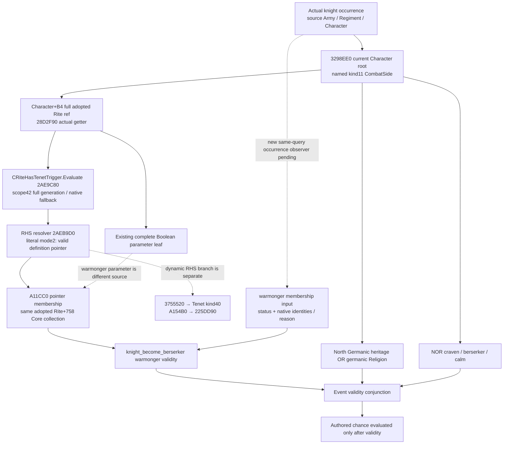

# CK3 1.20.0.3：phase 骑士 warmonger Tenet 谓词

2026-10-06 Asia/Shanghai，**native predicate source-confirmed；新 occurrence observer 尚未实现**。冻结 CK3 1.20.0.3 Crozier / Steam build25652598，复用 EXE SHA-256 `94B55397ABB687A3DCD436805A5D885E6BE90FA6C693FEB44A9E3BBEEADE02A6`；源码基线 `8961bc245eccf12b3508b8d5b11f92f15d7993eb`。此包只拥有本专题与外置 source packet，不修改当前 Rite 参数 helper/provider、策略、CMake 或共享报告，不运行游戏、进程查询、SDK、pipe、构建或测试。

## 实际 consumer 与来源

当前 [phase 输入 frontier](combat-phase-readonly-input-frontier-12003.md) 的独立剩余 validity 是 `knight_become_berserker`。安装源码 `common/combat_phase_events/00_knight_phase_events.txt:184–200` 明确 `type=knight`，先在当前 Character 的 `rite` scope 检查 `rite_has_tenet=tenet_warmonger`，再要求 North Germanic heritage 或 `religion:germanic_religion`，并排除 craven/berserker/calm。`_combat_phase_events.info:1–7` 明确 root 为当前 Character、named combat_side 为其实际 combat side。本包的 warmonger consumer 是 knight occurrence；commander 同角色并不能获得这条 event 的资格。

原生 schedule/selector 链复用封存的 [当前 phase 源树](combat-phase-events-12003.md) 与 `native-schedule/SOURCE-SCHEDULE.json`：`2AD7F00 → 264D480 → 3298EE0` 按实际角色/source order 求 validity，然后求 chance；当前 stock weight 或 Boolean leaf 不能证明 loaded row admission、选择或未来执行。

`common/religion/tenet_types/00_tenet_types.txt:3462–3541` 的 definition key 是 `tenet_warmonger`。其中 `parameters={warmonger ...}`（3504–3511）、`special_parameters.warmonger=yes`（3513–3515）和 personal `clergy_can_fight_personal`（3523–3525）各有独立来源。phase 使用的是 **Tenet predicate**，未证明它等价于参数 `warmonger`、当前个人持有、main-Rite Core 列表或任意五档 status 比较，因此不替换为这些输入。`_tenet_types.info` 的旧 Faith scope 说明不能补全实际 Rite trigger 的实现。

## 实际 `.3` predicate 与右侧 definition

先复用已有宗教 cache metadata 的 **`.2` locator 邻域**，它只决定有界查找范围，不作为 `.3` ABI 或 threshold 证据。当前 `.3` RTTI 字符串确认为 `CRiteHasTenetTrigger`，type descriptor `5A35948`；实际 COL `4E4BC18` 的 signature1、self RVA、type descriptor 和 offset0相符，vtable `4785B68` slot25 指向 `2AE9C80`。邻近已捕获的 `CRiteHasDoctrineTrigger` / `CRiteHasParameterTrigger` 各保持独立，未把其它 trigger 的 Evaluate代入。

完整 Evaluate 的唯一 `.pdata` extent 是 **`[2AE9C80,2AE9D06)`，134B，unwind flags0**：

1. 从当前 TopScope root 读取 scope kind；只有 kind42 才取 `+8` 的 Rite full ref，否则使用 `FFFFFFFF`。`5D1E2F8` storage按 ref低24位索引，再比较对象 `+8` 的 **完整 ref**。无 storage、槽越界/null或 generation不符使用实际 fallback pointer slot `5C67670`。
2. 调 `2AEB9D0`，传 trigger RHS object `+40`、原 TopScope，以及 trigger `+10` evaluation context；获得实际 Tenet definition pointer。
3. `2AE9CEA` 取 **同一 resolved Rite `+758`**，`2AE9CFB` 调 `A11CC0(collection,&definition)`，返回其 pointer membership Boolean。

此 body 没有 `24F88A0`、Faith/main Rite getter、`+7B8` Boolean 参数或 Character personal collection。所以 `rite_has_tenet` 的这里这条条件是 **adopted Rite 自身 Core pointer membership**，不是“effective status非零/Permitted/Core阈值”。其它 Rite mainness、许可与个人状态仍有其自身消费者，不能把此结论外推给所有 Tenet triggers。

直接 RHS resolver 的唯一 `.pdata` extent 是 **`[2AEB9D0,2AEBA45)`，117B，unwind flags0**。RHS object `+AC` 为 mode2 时取 `+A0` definition pointer；该 definition `+38` magic 为 `0x4744624F` 时直接返回。否则进入 `3755520` 动态 target 求值：只接受返回 kind40与非`-1` definition ref，经 `A154B0` database getter、`225DD90` resolver；失败返回 default definition slot `5D1F6C0`。本包封存这个分支边界，没有展开这些已非当前字面常量所需的 callbacks，也没有假装已观察 actual loaded trigger 的 mode或 target pointer。

当前 stock RHS 是字面 key `tenet_warmonger`。未来 observer需在同一 capture 解析 **actual loaded definition**，不能用源文件行号、数值 trait/Tenet ID或空缺 definition代替。已有来源可复用 [Tenet source header](../../ck3_autonomous_player/native_bridge/include/xar_bridge/religion_reform12002_tenet_sources.hpp) 的 initialized DB slot `5D1DEB8`、actual definition array `+EF0` / count `+EFC` / pointer stride8；[公开 key copier](../../ck3_autonomous_player/native_bridge/src/religion_doctrine12002_tenet_rows.cpp) 从 definition `+18` 复制 stable CString并核对 `+38` magic。这些当前构建来源与 `.3` reuse边界见 [当前宗教身份专题](religion-native-ai-faith-identity-12003.md)，不重读其 closed getters或 membership body。寻找 named definition只为这个 predicate，不新增全世界或任意玩家的宗教枚举。

## 最小必要 occurrence observer handoff

已有 optional `phase_rite_parameters_v1` 发布完整 Boolean keys，不能回答这条 Core Tenet membership。既有 player-only tenet query不接任意 phase root；跨独立 query的同日期也不能补成同一次 combat capture。实际缺口已缩到 **一个 knight occurrence的 named Core membership**。

建议在现成 combat V2 commander/knight collector的已解析 Character入口复用内部 identity/key copier。实际消费者只选 **knight** occurrence，并保留 role、source public Army、source Regiment、Character full identity和该行位置；同Character跨Army/role不合并。普通 query中只读解析当前 adopted Rite与 loaded `tenet_warmonger` definition，再按 Evaluate同源 collection调用已有 `A11CC0`；无需调用 trigger executor、native event selector或draft UI。

| 最小发布输入 | 来源 / 用途 |
| --- | --- |
| occurrence role / source Army / Regiment / Character | 当前同一 combat query已存在的行；避免把commander观测充作knight或将重复来源合并 |
| raw adopted Rite full ref、resolved Rite full identity、resolution来源 | `Character+B4`、现成 `28D2F90`；完整 generation /合法 ref0保留。普通 resolved对象和 native fallback明确区分 |
| target definition key与实际解析结果 | 同capture loaded `tenet_warmonger` definition，复制实际 key；pointer不输出、不编造definition full-generation ID |
| nullable warmonger Core membership、status / reason | 实际 adopted Rite `+758` pointer set和resolved target；可读合法空集合为观测false，不使用Boolean参数或status阈值 |

若继续采用 copier /纯 membership输入而非 native contains callback，需复制**完整当前 Core集合**（data0、signed countC、stride8），保留 source order/duplicates和实际 keys后再取 named membership；不能把截断列表中没看到 key当false。若使用原生 callback，则可只发布这一 named predicate Boolean及其 identities/reason，不扩张其它Tenet状态表。

Evaluate的缺ref/错generation走 actual fallback，不保证“缺Rite总为false”。未来 helper必须读取/区分实际 fallback collection，或保持该叶 unavailable/明确reason；不得把现有 Boolean helper的 `absent`标签改写为已计算false。未加载/未解析的 target definition同样不能凭 stock存在而冒充已读结果。完整 phase的 overall available、loaded row/override provenance、selection、hostility、未来反馈和 forecast资格保持各自来源边界。

后续只需一组 new provider/production normalizer的 focused case：普通 Core命中；同Boolean参数存在但Core无该definition；完整空Core false；当前/main/personal来源不同；合法 ref0/full generation；读取失败与真实fallback分开。此为handoff验收条件，本包不实施或运行它。

## 读取成本、暂停与交付边界

外置包 `Z:/ck3_mod_rewrite_process_assets/g2-background-round6-20261006/phase-warmonger-source/` 先冻结 `RESEARCH-PLAN.json` / `STOCK-SOURCE-PINS.json` / `locator-01/LOCATOR-PLAN.json`。第一次有界定位捕获 **103,936B metadata**，命中 exact class但到64个COL上限即停止；原未找到attempt保留，不推断global absence。Root报告用户本机启动问题时立刻暂停新读取；本代理没有游戏、Steam、进程或DLL操作，后续按Root恢复指令复用这些缓存，没有重复读取。

恢复后只新增下一 actual COL /相关 `.pdata` /unwind与缺失函数：Evaluate **196B metadata+134B code**，RHS **52B metadata+117B code**。累计新 EXE读取为 **104,184B metadata +251B code =104,435B**，无 wholeEXE/section/text扫描、wholeEXE hash或 closed native body重读。`.3` PE timestamp `6ABE3CA2` 与冻结身份复用；stock和源码片段各有独立 text pins。

状态仅是 **warmonger predicate source-confirmed / research**。没有新 observer implementation、native/Python测试、compiled DLL、paused observation、实际 event选择或future人物效果。本包消除了 predicate语义unknown并留下可直接施工的同查询数据入口，不升级完整phase readiness，也不增加新策略/权限门禁。Root合并外置Oct6/W41字段和共享索引；本代理只提交本页。

## 后续最小实施计划（2026-10-06，source先封存）

Root已采用上述源树 `accf65a2`，本轮实现基线 `01d98c73ca42b91b5e39c827e32a07b1afe51479`。空间原因使用 C盘 sparse lane。只在现成V2 knight行新增 optional `phase_warmonger_core_v1`；commander、V3、overall/selection/forecast readiness与advertisement不改。新helper解析同一已验证Character、实际adopted Rite、initialized TenetDB与实际key，再按native source调用Core pointer membership。既有 key copier只抽到共享inline header，旧调用委托同一算法，无语义更改。

真实fallback由getter返回值与actual fallback global `5C67670`一致来辨认；本轮不扩展读取fallback Core，保留membership null及具体reason。loaded target未解析同样为null。新strict normalizer和只读 occurrence adapter保留public source Army、Regiment、Character及member index，以实际行位置消费，不能合并重复来源。adapter只返回这一个validity operand，不生成事件选择或完整chance。

先完成源树与本计划，再实施一个new Python focused compound（full V2 normalizer→exact knight occurrence adapter）。新native fixture只运行实际helper与serializer，首个配置/构建/CTest由Root执行；本代理不运行native或旧Boolean测试，不操作本机游戏/进程/SDK/pipe。当前计划与结果分开，资格待首次实际结果追加。

## 同查询最小实现与首次 Python 资格（2026-10-06）

现成V2骑士采集在同一Character occurrence上发布 `phase_warmonger_core_v1`。新增reader只从 actual adopted Rite Core `+758`和实际loaded `tenet_warmonger` definition运行 `A11CC0`；没有读取Boolean `+7B8`、status、Faith main Rite或personal Tenet来代替这个predicate。bindings只绑定 exact `.3`，旧构建省略optional leaf。actual fallback、definition/key未解析或Core读取失败保留null和具体原因，合法Core空集合是false，Rite full generation及零值保留。

新normalizer与 `PhaseWarmongerKnightOccurrence12003` adapter通过public Army、Regiment、Character与native member index定位具体骑士行。现有V2本来就拒绝同查询重复knight CharacterID/RegimentID，本轮保持该合同；测试中的同Character不同Army是两个独立合法query fixture，不能据此声称同帧重复骑士可接纳。一个可用leaf只解锁 `root.rite.tenets.warmonger`，未关闭heritage/religion、trait NOR、chance、phase selection、RNG/effects或完整事件执行。

唯一新compound Python method首次实际执行GREEN：8个operand场景，full production V2 normalizer→exact occurrence adapter，测试用时0.003秒；harness全程1.532692秒。它覆盖Core true/false、合法Rite零值/full generation、actual fallback reason、loaded target/key/Core unavailable，以及legacy缺leaf；全部保留原completeness/forecast边界。测试只消费synthetic Python payload，既有Boolean carrier是独立的对照输入，不能当成真实当前同帧身份互证。attempt01在actual method开始前因sparse checkout缺既有 `tools/build_release.py` import而RED，0个warmonger checks；补齐既有tools源码后的attempt02是第一次实际case，旧tests未运行。失败与成功日志均在外置packet保留。

新增native candidate `tests/phase_warmonger_core_12003_test.cpp` 待Root首编译/CTest：7个source-shaped samples、1个JSON wire，运行实际header reader及production leaf serializer，明确断言实际Core receiver/loaded RHS pointer与fallback不被转为false。CMake recipe仅交Root，尚未编译、未消费genuine native wire、未实机采集。当前是**source-closed observer implementation candidate + FIRST Python focused GREEN**，不是native qualified/static-ready、fixture-live或production-live，也不提升V3/whole-phase readiness。外置packet为 `C:/codex-ck3-background/packets/phase-warmonger-implementation-20261006/`，包含plan、attempt01/02、Root recipe与Oct6/W41字段。此实现新增EXE读取、native build与本机runtime操作均为0。
