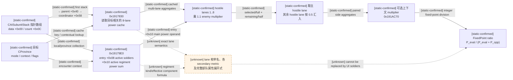
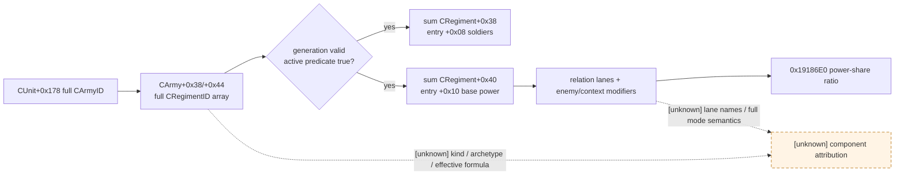
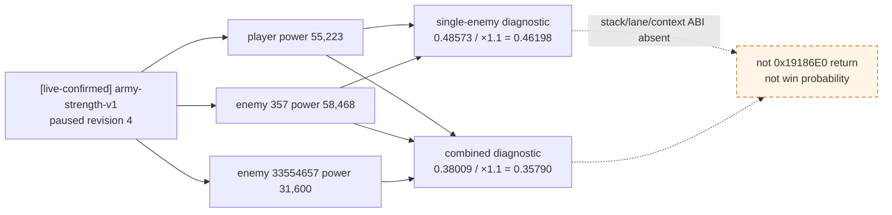
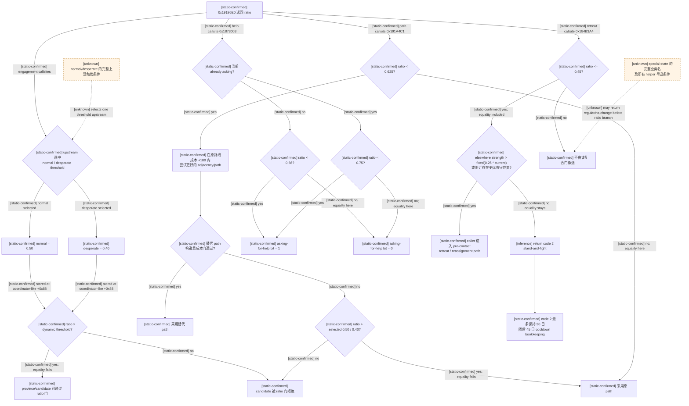
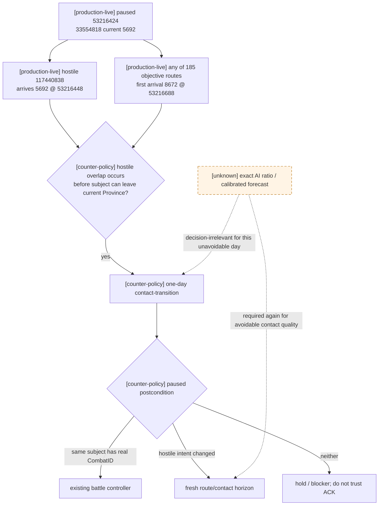
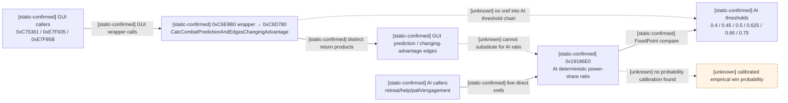
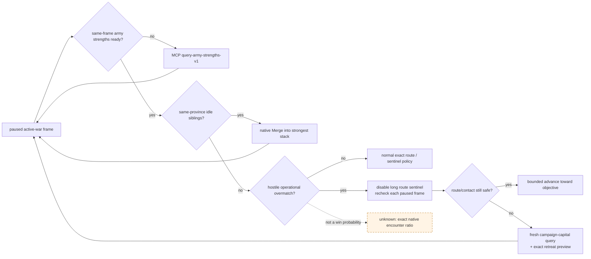
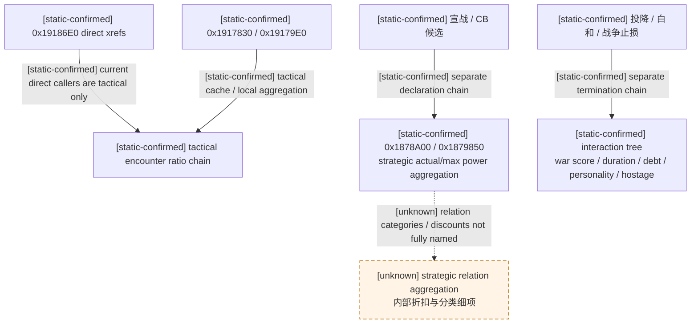

# CK3 原生 AI 战斗预测与接战门槛

## 结论与版本边界

- [static-confirmed] 本文只绑定 CK3 `1.19.0.6` 的
  `Crusader Kings III/binaries/ck3.exe`，SHA-256 为
  `2D00FF3101EF70B566F2FCBAE292F09263199C80E9DC8F139B82D7D96F83DB86`；文中地址均为 RVA。
- [static-confirmed] 原生 AI 的核心返回值不是“胜率”，而是经过关系分组、敌方保守倍率和上下文修正后的
  **己方估算战力占比**。主计算是一次确定性的定点聚合，没有抽样，没有战斗轮循环，也没有构造并推进
  `CCombat` 沙盒。
- [static-confirmed] 因而 `combat prediction ratio != win probability`。`0.66` 不能解释为 66% 胜率，
  也不能拿 UI 士兵数比例、GUI 战斗预测等级或自制 Monte Carlo 结果替代它。
- [static-confirmed] AI 主预测器位于 RVA `0x19186E0`。EXE 内找到的全部 direct `E8` xref 为
  `0x184B3A4`、`0x1873003`、`0x1919C69`、`0x191A076`、`0x191A4C1`。
- [static-confirmed] 本轮 exact ABI 结论来自 pinned EXE 的静态反汇编、RTTI 和同一安装包原版数据；
  [live-confirmed] 独立 `army-strength-v1` 只读 MCP 随后在 paused revision `4` 验收了同源 base aggregate。
- [static-confirmed] `0x19179E0` 的两遍 CArmy regiment 聚合已经进一步闭合：entry `+0x08` 是 active
  regiment 的 current soldiers 总数，entry `+0x10` 是 active regiment 的 `CRegiment+0x40` power qword
  总和。它们可以作为第一只读 MCP 的 base aggregate，但仍不是完整 encounter ratio。
- [unknown] 预测器是否能由 bridge worker 在 paused world 中安全调用、其所有 mode/flag 位的业务命名、
  每个关系 lane 的枚举名以及底层每种部队的完整 power 公式尚未闭合，不得直接发布 native query capability。

下文把 `0x19186E0` 暂记作研究别名 `CalcAICombatPredictionRatio`。这不是 EXE 中恢复出的原生符号名。

## 它计算的是什么

### 确定性聚合主链



### ABI 与特殊返回

[static-confirmed] Windows x64 机器形状如下；参数名中带问号的部分只是为阅读方便而起的研究名：

```cpp
CFixedPoint* __fastcall CalcAICombatPredictionRatio(
    CFixedPoint* out,                                      // RCX
    const CPdxArray<const CAISubunitStack*, int>& stacks,  // RDX
    const CProvince* target,                               // R8
    int mode,                                               // R9D
    const CProvince* context_or_null,                       // stack arg 5
    uint8_t flags                                           // stack arg 6
);
```

| 项目 | 证据 | 结论 |
|---|---|---|
| 输出 | [static-confirmed] `RCX` 被保存为输出地址，结束前写入 qword 并在 `RAX` 返回 | 返回的是 scale `100000` 的 `CFixedPoint` |
| stack array | [static-confirmed] `RDX+0x00` 为 data，`RDX+0x0C` 为 count | 元素是 `const CAISubunitStack*` |
| target | [static-confirmed] `R8` 经过虚调用验证并参与 province/cache 查询 | 是目标/接触省份上下文 |
| `mode` | [static-confirmed] 位于 `R9D`，各 caller 传入值不同 | [unknown] 业务枚举名未恢复 |
| arg 5 | [static-confirmed] 位于 Windows x64 第五参数槽，可为 province-like 指针或 null | [unknown] 每种 caller 下的准确业务名未恢复 |
| `flags` | [static-confirmed] 第六参数低字节；至少 bit `0x04` 会使 `0x19197C6` 调用 `0x191AC70` | [unknown] 全部 bit 名称及组合语义未恢复 |
| 空数组 | [static-confirmed] `0x1918725..0x1918734` | count 为 `0` 时输出 raw `0` |
| 无 hostile aggregate | [static-confirmed] `0x1919917..0x191992A` | 输出 `100000`，即 `1.0` |
| 异常零分母 guard | [static-confirmed] `0x1919961..0x191996B` | 机器分支写 raw `-1`；[unknown] 合法非空世界状态是否可达 |

[static-confirmed] stack 元素类型还由 allocator RTTI 独立闭合：
`CPdxTypedNewDeleteAllocator<const CAISubunitStack*>` 的 type descriptor RVA 为 `0x52F9580`、vtable RVA
为 `0x41917B8`、allocator global RVA 为 `0x4FEF110`。

### power/quality 聚合的已知边界

- [static-confirmed] RVA `0x1917830` 从 coordinator、目标省份和 mode 解析缓存的多 lane summary；direct xref
  为 `0x184FAB4`、`0x1918AC2`、`0x1918AE9`。它调用 `0x18510B0` 查询 `coordinator+0xB60`，检查
  cache `+0x21E` 的 enabled byte，并遍历 8 个 lane（跳过 1、3 两个 cache lane）。
- [static-confirmed] `0x1917830` 输出包含 `out+lane*4` 的 count/strength-like dword、
  `out+0x28+lane*8` 的主 power-like qword，以及 `out+0x70/+0xB8+lane*8` 的 secondary qword。
  lane 0、2 会合并成对的 cache source。
- [unknown] 上一条的 lane 业务枚举名、被跳过 lane 的原因，以及两个 secondary qword 的业务名称尚未恢复。
- [static-confirmed] RVA `0x19179E0` 收集本地/目标省份单位条目；direct xref 为 `0x184FC12`、
  `0x1872EFD`、`0x1918DDB`。其输入机器位置为 `RCX=coordinator/context`、`RDX=CProvince*`、
  `R8B/R9B=options`、第五参数为输出数组。
- [static-confirmed] RTTI 把输出 allocator 闭合为
  `CPdxTypedNewDeleteAllocator<SAIPowerAndStrengthEntry>`：type descriptor RVA `0x52F97B0`、vtable RVA
  `0x4191BA0`、allocator global RVA `0x4FEF1A0`。记录大小是 `0x38`。
- [static-confirmed] `0x1917C89..0x1917CD4` 从候选 `CUnit+0x178` generation-resolve `CArmy`；
  `CArmy+0x38/+0x44` 是 4-byte full CRegimentID array data/count。每个 ID 经 storage
  `base+0x57BF4C8` 解析并以 `CRegiment+0x10` 回读完整 generation；原程序失配时走
  `base+0x57BF4C0` fallback，bridge query 不得把 fallback 当成真实数据。
- [static-confirmed] 第一遍 `0x1917CEB..0x1917D54` 对每个 generation-resolved regiment 调用
  `CRegiment+0x08` subobject vtable slot `+0x08` 的 active predicate，只在 true 时把
  `CRegiment+0x38` current soldiers 累加到 dword。第二遍 `0x1917D80..0x1917DCD` 做相同验证与 predicate，
  把 `CRegiment+0x40` qword 累加为主 power operand。
- [static-confirmed] `SAIPowerAndStrengthEntry` 的机器布局至少包括：`+0x00` 单位指针、`+0x08` active current
  soldiers dword、`+0x10` active regiment base-power qword、`+0x18/+0x20/+0x28` secondary metrics、
  `+0x30` side/relation-like byte。`0x1917F83..0x1917FA5` 写入这些字段；预测器在
  `0x1918F28..0x1918F38` 把 `+0x10` 加入关系 power lane。
- [static-confirmed] `00_defines.txt:613-624` 明说 simple base power 用于 AI 评估军事实力，按 regiment 的
  power/toughness 与 troop count 聚合；骑士按默认 `10` prowess、`50` damage/点、`10` toughness/点，
  因而默认每名骑士是 `1100` power。
- [static-confirmed] `09_mpo_interactions.txt:3201-3202` 也把 military power 描述为按 regiment attack 和
  toughness 缩放。故该指标至少在基础层面是 quality-weighted power，绝不是裸士兵数。
- [unknown] regiment kind、MAA/levy/knight 细项如何生成 `CRegiment+0x40`，以及补给、反制、将领、骑士实值、
  地形、优势、登陆、债务等因素中哪些进入 `0x1917830/0x19179E0` 的 secondary 字段、先后顺序及舍入点，
  尚未逐项闭合。不能因为它们是战斗规则输入，就推定它们全部进入 AI ratio。



因此可安全拆成两期：第一期 [combat-simulation-inputs.md](combat-simulation-inputs.md) 定义的
`game.command.query-army-strengths-v1` 已发布并 live-confirmed current/max/base power；完整 predictor 继续 fail closed。后者的输入是
`CAISubunitStack*` 数组，不是 CUnit/CArmy 指针。当前尚未证明玩家军队必有可复用 AI stack，也尚未闭合从
当前 war 双方构造 relation lanes、mode/context/flags 以及 worker 临时 allocator 生命周期；禁止为凑 ABI
伪造 stack 或把两边 base-power 比例冒充原生返回值。

### paused live base-power 诊断（不是 predictor return）

- [live-confirmed] revision `4`：player ArmyID `83886341` 为 `1482/2243` soldiers、base power `55,223`；
  enemy `33554657` 为 `1011/1011`、`31,600`；enemy `357` 为 `1801/3751`、`58,468`。raw 字段实际为上述
  显示量乘 `100000`；两敌合计 power `90,068`。
- [inference] 若只把这几个 base aggregate 代入最简二方 share，player vs `357` 是 `0.48573`；player vs
  两敌合流是 `0.38009`。只再施加本页已证 enemy multiplier `1.1`，分别得到 `0.46198`、`0.35790`。
  这仍没有合法 `CAISubunitStack`、relation lane、target/mode/context/flags 与 secondary multiplier，必须命名为
  `base-power diagnostic share`，不能声称等于 `0x19186E0` 输出。
- [counter-policy] 两个 participant set 必须生成不同 context/hash。若 `33554657` 可能在 forecast horizon
  内加入 `357`，单敌 share 不得复用于合流场景；join ETA 未观测时 planner 继续按不安全接战处理。



### 对手聚合与闭式公式

[static-confirmed] `0x19196DC` 读取 RVA `0x570DCE8` 的
`ENEMY_COMBAT_POWER_MULTIPLIER=1.1`。循环索引为 `1..8`，非零 hostile/relation lane 在进入选择逻辑前
都乘此倍率；lane `0` 不走该分支。

[static-confirmed] `0x19197DD..0x191983E` 在经过修正的 hostile lane 中选择主 lane，
`0x1919850..0x1919908` 把其余非零、非主、非 lane-0 的 hostile lane 乘 `0.5` 后累加。设：

- `P_eval` 为与主 hostile lane 配对的 evaluated-side power；
- `P_main` 为主 hostile lane 经上下文修正后的 power；
- `P_other` 为其余 hostile lane 经修正后各自 power 的和。

则 `0x1919942..0x1919A2E` 的正常返回路径是：

```text
P_opp = P_main + 0.5 * P_other
ratio_raw = floor_fixed(P_eval * 100000 / (P_eval + P_opp))
ratio = ratio_raw / 100000
```

- [static-confirmed] 上式的多段 `imul/idiv` 是防溢出的等价定点路径，不是多次试验。
- [static-confirmed] 若没有 hostile aggregate，前置分支直接返回 `1.0`；若双方估算 power 相等且没有额外
  hostile lane，数学结果为 `0.5`。
- [static-confirmed] `0x191AC70` 可对 paired-side aggregate 再施加由 `0x191AAC0` 产生的确定性 multiplier；
  direct xref 为 `0x184FE16`、`0x1850307`、`0x19197C6`。
- [unknown] `0x191AAC0/0x191AC70` 所用 secondary metric 的正式名称仍未恢复，因此不能把它擅自命名为
  terrain、advantage、quality 或 supply modifier。

这也给出一个只用于读懂阈值的数学换算：若 `r = P_eval/(P_eval+P_opp)`，则修正后战力比为
`P_eval/P_opp = r/(1-r)`。它仍然不是胜率。

| ratio 阈值 | 对应修正后 `P_eval/P_opp` | 若全部敌方 power 仅额外乘 `1.1`，对应原始 self/enemy | 用途 |
|---:|---:|---:|---|
| `0.40` | `0.6667` | `0.7333` | desperate 接战门 |
| `0.45` | `0.8182` | `0.9000` | 低 ratio 撤退门 |
| `0.50` | `1.0000` | `1.1000` | normal 接战门 |
| `0.625` | `1.6667` | `1.8333` | bad-adjacency 绕路门 |
| `0.66` | `1.9412` | `2.1353` | 开始求援门 |
| `0.75` | `3.0000` | `3.3000` | 停止求援门 |

- [inference] 第三列只是把已证公式与单一 `1.1` multiplier 做代数换算，帮助审阅保守程度；真实调用还会
  受 lane 选择、半权重 secondary hostile lanes、flags 和上下文 multiplier 影响，不能拿第三列从 UI
  soldiers 反算原生返回值。

## AI 如何消费 ratio

### 接战、绕路、求援与撤退决策树



### 接战阈值和等号语义

- [static-confirmed] `00_ai.txt:1190-1202` 定义 normal `0.5`、desperate `0.4`。RVA
  `0x185A2F4..0x185A309` 在二者中选择一个并存入 coordinator-like 对象 `+0x88`。
- [unknown] 令选择结果进入 desperate 分支的完整上游条件尚未闭合；原版变量名只能证明阈值用途，不能替代
  对触发条件的反汇编。
- [static-confirmed] `0x1919C69` 后的 `0x1919C85 setg`、`0x191A076` 后的对应 `setg`，以及
  `0x191A4C1` 后 `0x191A6C5 cmp / 0x191A6CA jle reject` 都证明接战有效条件是严格
  `ratio > selected threshold`。等于 `0.5` 或 `0.4` 时不通过该门。
- [static-confirmed] `0x191A4C6` 读取 `AVOID_BAD_ADJACENCY_COMBAT_PREDICTION_RATIO=0.625`；
  `ratio < 0.625` 才进入寻找替代路径的分支，`ratio >= 0.625` 不因这个门另找路。
- [static-confirmed] `0x191A4D8..0x191A668` 在低于 `0.625` 时以原路线成本加
  `AVOID_BAD_ADJACENCY_MAX_PATHFIND_EXTRA_COST=180.0` 建立替代 pathfinder 上限，`0x191A687` 再调用
  `0x23C33D0` 构造替代 route。替代 route 构造成功且附加成本门通过时，`0x191A6B5` 采用它；若构造失败或
  超过成本门，`0x191A6BE..0x191A6CA` 回到 coordinator-like `+0x88` 的 normal/desperate 阈值：只有
  `ratio > 0.50/0.40` 才保留原路线，等于或低于阈值时拒绝 candidate。`ratio >=0.625` 则在
  `0x191A4D2 -> 0x191A6CC` 直接保留原路线。
- [static-confirmed] 这条 `bad adjacency` 分支只证明原生会为**目标前的坏邻接**寻找成本受限的替代 path；它
  不是我方 `route-contact-horizon` 的整条路线、双向 edge 与逐日 arrival 碰撞矩阵。不能把“原生没换 adjacency”
  写成“整条路线没有未来接触”。
- [static-confirmed] ratio 门只是候选验证的一部分；通过它不等于一定移动或一定接战，路径有效性、order 状态
  和其它候选筛选仍可否决。

### 求援滞回

- [static-confirmed] `0x1872E07` 读取 unit-stack state `+0x50 bit 0` 作为当前 asking 状态；
  `0x1873003` 调用主预测器。
- [static-confirmed] `0x1873027..0x187303E` 在“尚未求援”时选择 `0.66`，在“已经求援”时通过
  `cmovne` 选择 `0.75`，最后用 `setl`：

  - 未求援：仅 `ratio < 0.66` 开始求援，等于 `0.66` 不开始；
  - 已求援：仅 `ratio < 0.75` 继续求援，`ratio >= 0.75` 停止。

- [static-confirmed] 这是显式滞回区间 `[0.66, 0.75)`，避免 ratio 在单一阈值附近反复切换。
- [static-confirmed] 另一个附近 unit-stack 是否介入的 helper 位于 `0x1848570`：普通门使用
  `ASK_FOR_HELP_OTHER_STACK_TROOPS_RATIO=1.5`；siege progress 达到 `0.6` 后用更保守的 break-siege
  ratio `1.7`（`0x1848665..0x184867D`）；其唯一 direct caller 是 `0x184684D`。
- [unknown] `0x1848570` 中每个 strength operand 的完整业务名和所有前置过滤尚未闭合，因此本文不把
  `1.5/1.7` 擅自改写成某个 soldiers 公式。

### 撤退复合门

- [static-confirmed] 撤退判定 helper 从 RVA `0x184B170` 开始，唯一 direct caller 为 `0x184AFCF`；
  它在 `0x184B3A4` 调用主预测器。
- [static-confirmed] `0x184B3A9..0x184B3B8` 读取 `RETREAT_COMBAT_PREDICTION_RATIO=0.45`，
  并以 `jg` 跳过低 ratio 分支。因此二进制的精确低 ratio 条件是 `ratio <= 0.45`，等号包含在内。
- [static-confirmed] 低 ratio 后还不够：`0x184B446..0x184B51D` 计算当前 stack strength、总 strength 与
  elsewhere difference，再比较定点 `0.25 * current`。机器分支是
  `elsewhere > fixed(0.25 * current)`；相等时继续检查地形，而不是立即以“别处兵力”理由撤退。
- [static-confirmed] 若兵力条件未通过，`0x184B526` 开始用 `0x19151B0/0x1915160` 检查更优防守候选；
  原版 define 把搜索距离冻结为 `RETREAT_TO_BETTER_TERRAIN_DISTANCE=2`。
- [static-confirmed] 满足“低 ratio + elsewhere strength 严格大于 `0.25 * current`”或“低 ratio + 两省内
  防守候选严格优于当前位置”时，helper 返回 `0`；caller `0x184B016..0x184B14E` 随后取得新的防守目标并重置
  subunit assignment。这是接战前 unit-stack 的战略退让/重派，不是 active `CCombat` 的第 15 日 retreat command。
- [static-confirmed] 若 `ratio <=0.45`，但 elsewhere strength 不严格越过 `0.25` 且附近没有严格更优防守点，
  `0x184B566` 返回 code `2`。唯一 caller `0x184AFDB..0x184B018` 对 code `2` 递增 unit-stack `+0x7C`，并按
  `STAND_AND_FIGHT_DAYS=30` 保持/退出该分支；原版 define 同时冻结退出后的
  `STAND_AND_FIGHT_COOLDOWN_DAYS=45` bookkeeping。
- [inference] 原版 define 注释把该状态描述为留在可防守位置等待对方接触，且 `30/45` 与 caller 的两组计数
  完全对应，因此 code `2` 的最强解释是 stand-and-fight：最多保持 30 日，随后恢复普通 order 并进入 45 日
  cooldown。raw code 的正式枚举名尚未恢复，故不把这个关联升级成 static ABI，也不据此实现 active-battle action。
- [static-confirmed] helper 返回 `1` 或由前置 special-state guard 早退时不进入上述退让或 stand-and-fight
  mutation。三个 raw code 的正式 C++ 枚举符号名、所有 guard 的业务名与完整状态对象生命周期仍 unknown；本文只
  冻结已经由 caller 和原版 define 双重支持的行为极性。

### 2026-08-28 production blocker：接触早于任何 exact objective route 的首跳

- [production-live] 一代长跑 `20260827T221605Z-one-generation-f02c81cb` 在 paused
  `date_raw=53216424`、snapshot `native:382` 遇到 `native_war_no_safe_exact_route`。报告 SHA-256 为
  `231FAF47A6F6F4B29EE5F508D36F50D0B6EAF0DED426614E051C274C9963A924`，`first-blocker.json` SHA-256 为
  `4B93EE56EC680C130F1D28351598E2D5AB842C5EBA75A2B0CFE3967756AADED4`；角色 `29829` 存活、cleanup 全绿，
  durable checkpoint 为 `date_raw=53216400 / history=3661 / 26298014...4383`。
- [production-live] 玩家 canonical CUnit `33554818` 位于 Province `5692`。其已提交 target `3610` 的 fresh
  subject timeline 要到 `53216688` 才完成首跳 `8672`；敌 CUnit `117440838` 却在 `53216448`，即下一日闭区间
  末端到达 `5692`。history `3666` 因而返回 `one_day_contact_free=false` 与一条 exact
  `same_province(117440838,5692,[53216448,53216448])`。敌 `83886265` 又在 `53216472` 到达同省，故若首场
  combat 建立，它是下一日可能加入的动态 participant，而不是可忽略的远方兵力。
- [production-live] planner 随后完成 `185` 个其余 exact objective preview + horizon；全部 route 的首跳都是
  `8672`、首个 arrival 都是 `53216688`，并且全部 horizon 都先在 `53216448` 命中同一个
  `117440838@5692` same-province conflict。远方敌 `117440646` 的反向 route 还与这些路线的
  `8672 -> 951 -> 950 -> 8668 -> 947 -> 8665` 走廊产生 vertex/opposite-edge 交叉，但它不是下一日阻塞的根因。
- [counter-policy] 该帧的最小解除不需要新增 native API，也不需要先算胜率：在当前合法 exact-objective
  action set 中，敌军到达比玩家任何首跳早 `240` raw hours（10 游戏日），所以 strength/forecast 不能改变“下一个
  日界会接触”。复用现有 timed horizon，允许一个 bounded one-day **contact-transition**，随后只接受两种 paused
  后置结果：同一 subject 出现真实 `CombatID`/actual-contact scope，或 hostile intent 已变化且重新取得 fresh horizon。
  ACK 或日期推进本身不算成功；若仍无上述后置状态则继续 hold/block。
- [counter-policy] 只有接触仍可避免、或必须在多个可行接战方案之间选优时，strength/forecast 才重新成为前置。
  现有 `query-army-strengths-v1` 可在同 revision 给 `current/max/base power`，v3 combat-input query 可给 regiment、
  commander、terrain、crossing、holding defender 与零-roll advantage；但 direct `0x19186E0` ratio 仍因 mode/flag/lane
  与 worker 调用边界未闭合而未发布，`monte_carlo_ready` 也仍为 false。不得把 base-power share、人数或 v3 raw
  observation 冒充原生 ratio/胜率。对本帧下一步而言，这些缺口不改变 contact-transition；对战后撤退/增援质量则
  继续由真实 battle frame、逐日 participant requery 与既有 active-retreat gate 处理。



### 2026-08-28 端点实机修正：日期已跨日但当日结算尚未完整发布

- [production-live] `b5865f3` 的冷恢复 canary
  `20260827T225828Z-one-generation-e74fb9df` 已证明窄分支不会再枚举 185 个目标：它从
  `53216400` 安全推进到 `53216424`，重新取得 fresh exact horizon，再只推进到
  `53216448`。runner 随后因未观测到 combat、retreat、war/episode transition 或
  hostile state change 而主动 RED；cleanup 全绿。`report.json` SHA-256 为
  `0CAA13221A470D71496ACE49B6C1C43E0260F002C13ACAB510C05F64EF06791E`，
  `first-blocker.json` SHA-256 为
  `A4EE8434F37293F8C96F9DB1C69C7CEF8866EBCC4CB45EB3EDE440F01F62925A`。
- [production-live] RED 前的最后一条 fresh query 绑定 `date_raw=53216424`、snapshot
  `native:7`、revision `8` / native revision `7`；唯一冲突仍为
  `same_province(117440838,5692,[53216448,53216448])`。失败 command 的 ending semantic
  snapshot 没有写入 report 或 driver history，因此当前 artifact 不能断言敌军在末帧已经进入
  `5692`，也不能把闭区间 ETA 端点本身冒充已发生接触。
- [static-ready] 后置验证的实际代码缺口是：原比较包含 move target、route、army state、combat
  与 retreat，却没有验证 proof 中的 conflict hostile 是否从异省实际进入 contact Province。
  最小修正只接受更强的直接观测：subject 起止均留在 proof Province；被同一 proof conflict
  点名的 hostile 起点不在该省、终点已在该省；终点仍 paused 且日期不超过 exact one-day
  envelope。该结果记为 `hostile_entered_contact_province`，日期推进或 ACK 本身仍不算成功。
- [static-ready] 通用 `hostile_intent_changed` 只比较本次 proof 的 conflict hostile IDs；远处敌军
  的普通改道不能替本地接触完成后置验证。旧 proof 仍绑定 date、snapshot、revision、native
  revision、connection generation、episode 与完整 hostile scope；一天结束后必须重新查询，
  同一敌军已经在 contact Province 时也不能第二次满足“新进入”条件。
- [pending-live] 必须从同一 `53216400` checkpoint 冷恢复复测。若末帧直接给出
  `hostile_entered_contact_province` 或真实 CombatID，现有 battle-control OODA 接管；若仍无直接
  状态变化，则继续保留 RED，并优先把 ending semantic snapshot/war progress 写入失败 artifact
  后再判断是否需要 exact daily-tick final-stage hook。
- [production-live] 上述 hostile-entry 修正随 `9b7d254` 再次从相同 checkpoint 冷恢复；run
  `20260827T231856Z-one-generation-2318df2a` 仍在 `53216448` 给出同一后置 RED。其
  `report.json` SHA-256 为
  `5E67925F38D85D068131914254495603480156F4FCB2F7ED899313471DA4A079`，
  `first-blocker.json` SHA-256 为
  `F495A83251BD346C96481668C6E007C5C90D753D0121492E59146FEB4536B7EED`。
  因此“最后已发布帧中敌军已经进入 `5692`”的假设被实机否定；闭区间 endpoint 只证明预测边界，
  不能证明 movement/contact lifecycle 已完成。
- [static-confirmed] exact-build 日循环先在 stage 1 写入新 `date_raw`，随后 stage 2 才运行当日
  managers/tasks，最后进入 `CDailyTickCommand` final stage `RVA 0x26D3E80`。当前 Python
  exact-day 事务一看到日期增加就请求暂停，故它可能在新日期的较早阶段取得 paused frame；这与两次
  `53216448` RED 一致，但还不是对某个具体 CK3 task 顺序的动态证明。
- [static-ready] 最小观测修复不新增 native API，也不再推进游戏时间：首个 paused 后置状态仍为空时，
  只提交一次幂等 `pause-map`。GEN-015 exact DLL 的 `already_paused` 分支会清空缓存并强制重新
  `ReadSnapshot`/发布状态；Python 只接受同 date、speed、episode、local player、bridge PID 与
  connection generation，且 public/native revision 都严格增长的新帧，再重跑原后置条件。若仍为空，
  action 保持 RED；失败 history 与 `first-blocker` 同时保留 ending date、完整 `war_progress_after`、
  refresh ACK/revision 和 action 列表。该方案仅修正实际出现的 stale/early projection，不宣称
  `53216448` 必然已经形成战斗。
- [production-live] `76cae78` 的正式 `50000 turns / 604800 seconds` run
  `20260827T234150Z-one-generation-46069983` 已执行上述刷新：第二个幂等 pause 返回
  `already_paused`，同日 frame 从 public/native revision `10/9` 严格增长到 `11/10`，owner 与
  episode 均未漂移；刷新后的 `war_progress_after` 仍显示 subject `33554818@5692` moving、
  hostile `117440838@5693` moving，双方均非 combat/retreat。run 因而继续诚实 RED，cleanup 全绿；
  `report.json` SHA-256 为
  `4D21FD1662906C094544E80D15B840B7B31BB745EF8F1F9DBDD974054B64085C`，
  `first-blocker.json` SHA-256 为
  `39CA98290B6B595800CB51FD7D67045DDBD4B7D69C5DF0B6BC8E0309D0BDDE66`。
  这排除了“只因 endpoint 缓存陈旧而漏看已发生接触”，并把缺口收窄为闭区间 prediction boundary
  早于实际 movement/contact state 落盘。
- [static-ready] 下一步只允许一次相邻日 follow-up：首日必须是所有 conflict 都恰好落在
  `horizon_end == ending_date == starting_date + 24` 的 point overlap，subject 在起止帧均留在同一
  contact Province 且首跳晚于该端点；marker 绑定 episode、subject、Province 与相邻日期。第二日
  只能接受 episode terminal、active-war set change、subject army removed、active combat 或 retreat。
  `83886265` 在 `53216472` 入省或任何 hostile intent/位置变化均不能冒充成功；到该日仍无强状态就
  必须 RED，禁止第三日。完整 Python 回归为 `1394 passed, 2 skipped, 928 subtests passed`；其中
  province drift、敌军 ID 替换、跨 restore marker 与第二敌只入省的负例都已覆盖，实机续行前不写
  production-live。

## 与 GUI 战斗预测严格分离



- [static-confirmed] EXE RTTI/符号字符串恢复出独立函数
  `CalcCombatPredictionAndEdgesChangingAdvantage`，RVA `0xC6D780`，唯一 direct caller 是 `0xC6EA5C`；
  wrapper `0xC6E9B0` 的 direct callers 是 `0xC75361`、`0xE7F935`、`0xE7F95B`。
- [static-confirmed] GUI 函数 ABI 包含两组 `CPdxArray<TPdxRef<CArmy>,int>`、`CProvince` 和
  `CPdxArray<SCombatPredictionEdge,int>` 输出；它与 AI 的 `CAISubunitStack`/relation-lane ABI 不同。
- [static-confirmed] 没有找到 AI 五个 direct callsite 跳到 GUI predictor，也没有找到 GUI wrapper 进入
  AI 阈值比较链。`NCombatPrediction` 显示等级和 `NCombatInterface` 士兵质量等级只能解释 UI。
- [unknown] GUI predictor 自身是否做完整战斗仿真不属于本文已闭合范围；即使未来闭合，也不能未经校准就把
  它的等级或 advantage edge 当作概率。

## 2026-09-20 罗贝尔连续录制：宗教战争联军风险

- [production-live] 宣传片连续录制 R22 在原版、空 mod 列表、零 OCR、零键鼠输入下，由官方 MCP 动态比较全部合法目标。宣战前
  `query-war-entry-assessments` 对 CharacterID `31549` 给出 actor base
  `3904000000`、target base/total `1332000000`、network contribution `0`；按这份宣战前战略读数，这是全部候选中风险最低的一项。
- [production-live] `minor_religious_war` 建立后，paused active-war frame 随后物化为 **5 支 allied CUnit 对 7 支 enemy CUnit**。
  这证明单一目标统治者的宣战前战略 power 不能代表战争建立后的完整参战军队集合；对宗教战争尤其不能把
  `target_network_contribution_raw=0` 解释成“不会出现共同防守者”。
- [production-live] R22 的 route preview 与首次 contact horizon 都合法，但 committed-route sentinel 的既有证据明确写着
  `hostile_route_change_detection=not_watched_until_combat_id_transition`。军队在这段盲区继续向唯一目标推进，第一次战斗失败，最终战分
  `-100`；MCP 在同一终局帧提交 `surrender-war-6`，得到 explicit `attacker_defeat`。录像位于
  `artifacts/project-causality/2026-09-20-robert-mcp-streak-r22/robert-1066-mcp-streak-continuous.mkv`，
  SHA-256 `761EB96E52FE65B427FDB8174D87065E9D6AB81D6ABD3B5D5BD19AE4D1804328`。这是失败路径证据，不是宣传片胜场。
- [counter-policy, static-ready] 每个 paused、非 gathering/combat/retreat 的 active-war frame，在提交或继续进攻路线前消费
  `query-army-strengths-v1`。只把双方 materialized CUnit 的 current/max soldiers 与 base power 总量命名为
  `operational_routing_risk_not_battle_win_odds`；任何字段都不得冒充 `0x19186E0` ratio 或胜率。
- [counter-policy, static-ready] 选择任何进攻路线前，若多支可控军队仍在同一省且都 idle，先把 strength query 证明的最强 stack 与
  一支 sibling 做原生 Merge，逐 turn 合并，不再让主力单独出发而把可用兵力留在集结点。当敌方 current soldiers 或 base power
  超过友方总量 25% 时，再关闭长段 committed-route sentinel，时间推进退化为逐 paused frame 重查。若 exact route/contact 变为 unsafe，则先查询 fresh
  campaign capital、预览精确回撤路线，再在可达时回撤/驻留；敌军路线重新开放目标后才恢复进攻。该策略是对 R22 盲区的最小修复，
  尚待下一条完整胜负实机录像升级为 production-live loop。



## 可复用的 native 锚点

宣战与战争终止的后续审计已经完成：看到 “military strength” 文字不等于调用了本页的战术接战 ratio；
[war-declaration.md](war-declaration.md) 和 [war-termination.md](war-termination.md) 分别记录其独立调用链。

| RVA | 研究用途 | direct xref | 可复用程度 |
|---:|---|---|---|
| `0x19186E0` | [static-confirmed] AI encounter power-share ratio | `0x184B3A4`, `0x1873003`, `0x1919C69`, `0x191A076`, `0x191A4C1` | 战术接战、求援、撤退的 canonical 调用点 |
| `0x1917830` | [static-confirmed] target/mode keyed cached multi-lane summary | `0x184FAB4`, `0x1918AC2`, `0x1918AE9` | 战术 controller 的共享 power cache；未见宣战/终止 direct reuse |
| `0x19179E0` | [static-confirmed] province-local `SAIPowerAndStrengthEntry` collection | `0x184FC12`, `0x1872EFD`, `0x1918DDB` | 追踪 unit→power 聚合入口 |
| `0x27BD9E0` | [static-confirmed] active regiment current-soldier sum | GUI wrapper `0x1244B40` 及其它 callers | `army-strength-v1` current aggregate；canonical flags=`0` |
| `0x226F350` | [static-confirmed] CArmy maximum-soldier sum | GUI wrapper `0x1244B90` | `army-strength-v1` max aggregate |
| `0x191AC70` | [static-confirmed] paired aggregate contextual multiplier | `0x184FE16`, `0x1850307`, `0x19197C6` | 追踪 secondary metric；名称仍 unknown |
| `0x1848570` | [static-confirmed] other-stack help / break-siege gate | `0x184684D` | 求援协调，不是 ratio 本身 |
| `0x184B170` | [static-confirmed] retreat composite decision | `0x184AFCF` | 追踪撤退与 stand-and-fight 状态 |
| `0xC6D780` | [static-confirmed] GUI combat prediction core | `0xC6EA5C` | 仅 UI 对照，禁止混入 AI ratio |

### 复用边界图



- [static-confirmed] `find_xrefs.py` 找到的 `0x19186E0` direct callers 全在战术 controller 附近；宣战另走
  `0x1878A00` / `0x1879850` 的 strategic power 聚合与 actual/max ratio，终止另走 interaction 的战分、时长、
  债务、人格与人质树。两者都没有已证的 `0x19186E0` direct reuse。
- [unknown] `0x1879850` 内部每种关系军力的分类、折扣与聚合顺序尚未全部命名；这个局部未知不再意味着
  “宣战 power chain 未定位”，也不允许把 tactical ratio 偷换成宣战概率或终止效用。

## 复现命令与检查点

以下命令只读取磁盘文件，不启动或附加 CK3：

```text
py tools/file_sha256.py "Crusader Kings III/binaries/ck3.exe"

'tools\.venv\Scripts\python.exe' 'ck3_autonomous_player\native_bridge\research\find_xrefs.py' 0x19186E0 0x1917830 0x19179E0 0x191AC70 0xC6D780 0xC6E9B0

'tools\.venv\Scripts\python.exe' 'ck3_autonomous_player\native_bridge\research\disasm_ck3.py' 0x19186E0 --size 0x13A0

'tools\.venv\Scripts\python.exe' 'ck3_autonomous_player\native_bridge\research\disasm_ck3.py' 0x19179E0 --size 0x720

'tools\.venv\Scripts\python.exe' 'ck3_autonomous_player\native_bridge\research\disasm_ck3.py' 0x1919CE0 --size 0xA20

'tools\.venv\Scripts\python.exe' 'ck3_autonomous_player\native_bridge\research\disasm_ck3.py' 0x184AF50 --size 0x650

'tools\.venv\Scripts\python.exe' 'ck3_autonomous_player\native_bridge\research\find_xrefs.py' 0x1919CE0 0x184AF50 0x184B170

'tools\.venv\Scripts\python.exe' 'ck3_autonomous_player\native_bridge\research\disasm_ck3.py' 0x27BD9E0 --size 0xD0

'tools\.venv\Scripts\python.exe' 'ck3_autonomous_player\native_bridge\research\disasm_ck3.py' 0x226F350 --size 0x80

'tools\.venv\Scripts\python.exe' 'ck3_autonomous_player\native_bridge\research\find_rtti.py' 'CAISubunitStack|SAIPowerAndStrengthEntry'

rg -a -b -o 'CalcCombatPredictionAndEdgesChangingAdvantage' 'Crusader Kings III\binaries\ck3.exe'
```

[static-confirmed] 关键复核区间：

| 区间 | 应看到的事实 |
|---|---|
| `0x1918725..0x1918734` | 空 stack array 返回 raw `0` |
| `0x1917C89..0x1917D54` | CUnit→CArmy→CRegiment generation chain 与 active current-soldier sum |
| `0x1917D80..0x1917DCD` | 相同 active filter 后累加 `CRegiment+0x40` power qword |
| `0x1917F83..0x1917FA5` | entry `+0x08/+0x10/+0x18/+0x20/+0x28/+0x30` 写入 |
| `0x27BD9F5..0x27BDAA9` | flags=`0` current-soldier helper 的 array/generation/active/sum/return |
| `0x226F354..0x226F3CC` | max-soldier helper 的 CArmy array/generation/`+0x3C` sum |
| `0x19196DC..0x1919776` | hostile lane 读取 `1.1` 并做定点乘法 |
| `0x19197DD..0x1919908` | 选择主 hostile lane，剩余 lane 乘 `0.5` 汇入 |
| `0x1919917..0x1919A2E` | 无 hostile 返回 `1.0`；正常路径执行占比除法 |
| `0x1873027..0x187303E` | 求援 `0.66/0.75` 滞回与 strict `<` |
| `0x1919C69..0x1919C89` | ratio 与 dynamic threshold 的 strict `>` |
| `0x191A4C1..0x191A6CA` | bad-adjacency `0.625`、额外 path cost `180`、替代 route 与原 route 的最终 strict `>` fallback |
| `0x184AFDB..0x184B018` | return code `2` 的 30/45 日计数与退出/cooldown caller；stand-and-fight 名称仍为 inference |
| `0x184B3A4..0x184B566` | 撤退 `<=0.45`、别处兵力、更好防守地形及无退路时 code `2` 分支 |

## 未闭合清单

### 2026-09-20 R25：联军物化后的兵力重查与不可读路线

- [production-live] R25 在 `minor_religious_war` 建立后，MCP 同帧强度查询读到玩家四军
  `1245 + 250 + 250 + 250 = 1995`，敌方三军 `329 + 1169 + 1905 = 3403`。第三支敌军是在主力已经
  出发后才进入 active-war 敌军集合，因此“只在发现敌军压倒时合并”仍然太晚；出征前同省 idle 军队必须无条件先原生合并，
  再预览进攻路线。
- [production-live] 对敌军 ArmyID `70` 的 `query-route-contact-horizon` 返回
  `CK3 route arrival timeline is unavailable (role=hostile, path=hostile_active, stage=route_duration_read)`。
  这是原生只读时间线不可用，不是 CK3 崩溃，也不能用 OCR 猜测到达时间。失败命令保留在 driver history index `105`；
  后续策略必须在同帧禁止重问，并将受影响路线按不可精确验证处理，转而检查其他目标或回撤路线。
- [production-live] 录像位于
  `artifacts/project-causality/2026-09-20-robert-mcp-streak-r25/robert-1066-mcp-streak-continuous.mkv`，SHA-256
  `775E2369FD158780480BC3F7A6B9D56B08BBB08C0769C6BD5659F4BEB40CD413`；`report.json` SHA-256
  `1FF550D1669B9B1C78DE78E0E41CD29858D58EB1C8282C0BA215D6096D2A27EB`。该 run 为 capability RED，
  仅证明上述动态联军与查询失败边界，不算宣传片胜场。
- [static-ready] 反制策略现为：同帧军力查询 → 同省多军先逐次合并到最强 stack → 才允许进攻；路线时间线查询失败时，
  录制器保留 MCP 错误原文并继续取新快照，策略消费失败历史、拒绝原路线，绝不切换 OCR/鼠标/键盘，也不伪造 ETA。
- [production-live] R26 动态评估 7 个合法目标后选择 CharacterID `33422`；actor base `4010000000`，目标保守军力
  `1290000000`，风险类为 `preferred_3_to_2_overmatch`。战争物化后出现一支在外主力 ArmyID `107` 与三支仍在首都
  `2619` 的可控军队；策略正确要求 `preview-move-army-107-to-2619`，但 driver 的 capital-regroup concrete capability
  仍仅覆盖旧的“单军、399 对 400 围城”形态，连续三次保持 paused/blocked 后由录制器停止。该 run 的录像 SHA-256
  `C9DC5049778A1DC02EEDCCFE5BC2D069B80BDD2FBD77D5DCF75CEBCB5C7187B3`，报告 SHA-256
  `41401F1CEF59C46A3D684A0F3DFBB04F33D9E39FD76739E11C3E06F6A72C0A8E`；仍为 capability RED。
- [static-ready] capital-regroup concrete capability 现同时覆盖一个严格的新形态：恰好一支非首都、非 combat/retreat 的
  `regular/moving/sieging` 主体，其他全部可控军队均为首都 idle 驻军。driver 只发布到同帧原生 campaign-root capital 的
  preview/move/contact-query literals；是否真正撤回仍由同帧军力压制与 unsafe route 的策略门判断。
- [production-live] R27 进入 CombatID `33554435`。连续原生帧显示：`maneuver day 1` 时双方 CUnit 为
  `51` 对 `62`；`main day 0` 时敌方 `16777235` 加入；`main day 12` 时双方 derived current fighting raw 为
  `81993619` 对 `244957`；6 日 exact battle sentinel 后，同一 CombatID 的敌方 CUnit `61` 新加入，主战阶段日重置为
  `main day 1`，双方为 `80008067` 对 `21378343`，winner 仍为 `none`。旧校验把同阶段 `12 -> 1` 一律当作回退，
  因而 paused RED；这不是战败。录像 SHA-256
  `7D832D69B8399C9C7E6E85D3EE59B198AFA7CC45EF437A1D432EBB98E22F4274`，报告 SHA-256
  `C570A742B1F957DD027003ABBA14DD52991070BA6FBA3F8B4EA58F7D492901D2`。
- [static-ready] 同 CombatID 的主战阶段日重置现在只在以下合取下合法：exact multi-day sentinel 完整闭合、双方旧 CUnit
  集合分别是新集合的子集且至少一侧严格新增、没有任何旧 CUnit 消失、winner/forced winner 均仍为 `none`、重置后的
  phase day 不超过本次实耗日数。该转移记为 `same_combat_reopened`；没有严格增援证据的同阶段回退继续判 invalid。
- [production-live] R28 仅物化一支在外的可控整军 ArmyID `57`。敌军路线变化后，策略在 overmatch 与 unsafe objective
  合取下请求 `preview-move-army-57-to-2619`；driver 仍把 `len(controlled)==1` 全部送入旧的“sieging 399/400”特例，
  因而未发布动作并 paused RED。录像 SHA-256
  `5B305E29B30C5777814B7DE6463F3381B865838509744548B4B2F293C536471E`，报告 SHA-256
  `9F2963E940BA06B4AC907AF9EF7EEBDAD8ABAD247B3D1C2D0169370E543E699A`。
- [static-ready] 单支非首都 `regular/moving` 军队现与多军形态共用 coalition-regroup concrete capability projection；
  单支 `sieging` 军队仍保留旧的精确围城特例。能力发布只让策略能够预览/移动到同帧原生首都，实际选择仍要求同帧军力
  overmatch 与已拒绝的进攻路线。
- [production-live] R29 的主力 ArmyID `16777258` 推进到 Province `2627` 后，目标 `2638` 的继续路线与首都
  `2619` 的回撤路线都必须经过 `2633`；四支敌军已在 `2633`，第五支敌军也以 `2633` 为目标，因此两条路线均被
  exact route audit 否决。策略没有冒险穿越，但旧实现只能 paused blocked，不能主动取消已经提交的进攻路线。
  录像 SHA-256 `180FBFDCE1AE0CADF4E0CACA68817727489C688CCA1490CB423F0EEC9A1F92F6`，报告 SHA-256
  `DA9ED9A48829937B0F93C147E6AA18B190CBFA2C4639ADA25CBC69F76C91A7A4`。
- [static-ready] 当进攻与首都回撤均不安全且主力仍有 committed route 时，策略先提交原生
  `move-army-<id>-to-<current Province>` 清路并原地驻留；这不是时间推进。下一 paused 帧若主力已 stationary、当前位置
  没有敌军、没有 stationary threat 且敌方仍为 operational overmatch，则只推进一日并重新查询兵力和全部路线；敌军进入
  接触范围时仍由 contact/battle OODA 接管。该 hold 不允许跨日哨兵，也不推断胜率。

- [production-live loop] R30 在纯原版、`enabled_mods=[]` 环境中从可见的 1066 罗贝尔选人界面开始，前端进入游戏、
  开局状态绑定、合法宣战集合、逐目标军力评估、宣战、集结、行军、战斗、围城与执行要求全部走 native bridge/MCP；
  `uses_ocr=false`、`uses_keyboard=false`、`uses_mouse=false`、`fixed_coordinates=false`。动态排序选择 CharacterID `31549`
  的 WarID `6`（objective ProvinceID `2638`），并在母带约 `00:06:38` 取得 `attacker_victory`；这闭合了一条真实的
  “观察 → 评估全部合法目标 → 选择 → 宣战 → 作战 → 胜利核验”进攻 production-live loop，不要求预设对手。
- [production-live continuation] 首胜同帧自动出现防御 WarID `23`。智能体接管新战争并继续运行约二十分钟，读到玩家相对分数约 `-44`，
  其中 occupation 约 `+94`（进攻方）与 ticking 约 `-50`（防守方），但当前 bridge 只发布主目标 `2638`，没有发布
  该战争全部被占省份集合，因此无法诚实规划逐省收复。该 run 在操作员边界被中止：它记录“智能体继续游玩”，但不把
  尚未结束的战争计算为胜负。补齐全量占领观测后，可继续延长这条多战争实机。
- [production-live evidence] R30 连续母带 `robert-1066-mcp-streak-continuous.mkv` 时长 `00:27:18.666`，SHA-256
  `FECD2972DA7305EAF138BEFF6184ED94F804227278E035066973E68F58636D46`；用于宣传片的连续源区间
  `robert-mcp-showcase-continuous-6m25s.mp4` 时长 `00:06:24.967`，SHA-256
  `08C5A46300641CC0141AD1FDDD6BC22F93C61A8C92147E5036A8BDB65F469245`。该区间从罗贝尔选人画面连续前进到
  首胜及后续防御战，没有源时间跳切、倒序或重排。`report.json`、`target-evaluations.jsonl`、`war-ledger.jsonl`
  的 SHA-256 分别为 `2E85F101459099F457313C5DE800C383A9984AF7F542BEF7CBA3A0C127503E1D`、
  `AFBD289069DCCF98AFFE3B188CF1225DB997E89C12D83235E1C960C3A2C292DD`、
  `27E11359BD320FC66B8CAC3A635C62F04ACD792D82E1B671BD588C73AB909F6C`。

- [unknown] `0x19186E0` 的原生函数名、`mode` 枚举、arg 5 业务名及全部 flag bit。
- [unknown] 八个 cache lane、九个 relation lane、selected lane 和 secondary metric 的正式枚举/字段名。
- [unknown] `SAIPowerAndStrengthEntry +0x18/+0x20/+0x28/+0x30` 的完整业务语义；`+0x08` 已闭合为
  active current soldiers。
- [unknown] levy、MAA、骑士、将领、补给、terrain、counter、advantage 与各种 modifier 对主 power qword 的
  exact 展开式、clamp 与舍入顺序。
- [unknown] normal/desperate 的完整上游触发条件，及接战 candidate 通过 ratio 门后的全部排序/否决条件。
- [unknown] retreat helper 三个 raw code 的正式 C++ 枚举名、special-state 早退业务名与完整状态对象生命周期；
  code `0` pre-contact retreat/reassignment 与 code `2` 的 30/45 日 caller bookkeeping 已静态闭合，code `2` 到
  stand-and-fight 名称的映射仍为 inference。
- [unknown] 从 paused bridge worker 直接调用 predictor 的线程所有权、临时 allocator 生命周期、锁和重入边界。
- [unknown] AI ratio 与真实战斗结果之间的经验校准函数；在校准前它必须始终命名为 `ratio`，绝不能输出为
  `probability`。

## 2026-09-23 追加：normal/desperate 真实上游已定位

[战争影片补研](war-film-retreat-policy-2026-09-23.md)已追到 `0x186B310` raw 谓词、power/score cache producer 与 `bit4 → +0x88` 阈值写入。完整 raw 分支已归档；分数方向与原版注释存在待裁决差异，不能直接改写成“败势进入绝境”。本轮零实机，不提升为 live-confirmed。
