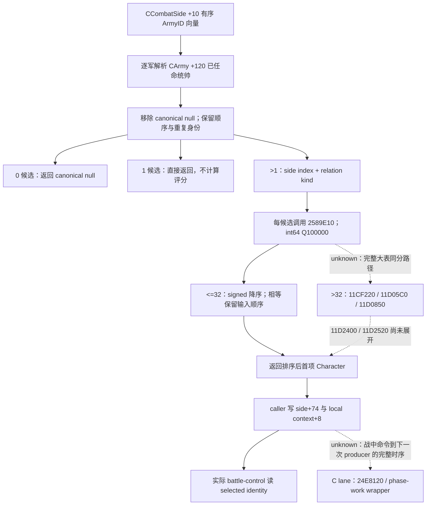

# 战斗一侧的统帅选择（CK3 1.20.0.3）

本包闭合真实战斗侧的候选来源、上下文评分与小联军同分顺序。它属于 **research**；新实机查询、动作、推进天数、测试均为 **0**。既有军队任命 GREEN 与选定统帅 next-roll reader 的 focused GREEN 直接复用，未重跑。资料目录为 `Z:/ck3_mod_rewrite_process_assets/g2-resume-20261003/combat-commander-quality-v46/side-selection/`，配套 `native-plan.json`、`native-tree.graph.md`、`EVIDENCE-PINS.json` 与 `MINIMUM-QUERY-RECIPE.json`。

精确构建为 **1.20.0.3 / Steam 25652598**，实际安装 EXE SHA-256 `94B55397ABB687A3DCD436805A5D885E6BE90FA6C693FEB44A9E3BBEEADE02A6`。只读源树 `Z:/g38` 的读取基线 HEAD 为 `56d8031cc211ff9be2ceb13bd66e722da6233947`；各源合同另有冻结副本和实际文件哈希，后续源码修改不改变本包证据。旧 1.19 的 `0x23C8A60` 只保留为历史语义对照，本包新结论绑定当前 `0x264D790`。

## 原生最小树

`0x264D790..0x264DD17` 的 primary `.pdata` 函数循环 `side+0x10` 的 internal CArmyID 向量（count `+0x1C`），按各 `CArmy+0x120` 解析 Character。它先收集，再去除 canonical null pointer；没有去重操作，因此一名角色在多军重复时仍有多个候选项。无候选或单候选分支均不进入评分循环。这不等于原生 AI 的军队任命候选池：AI 任命收集未任命人物的 `0x2C11C10`、mode 2 基础质量与玩家 mode 1 资格，仍以既有专题为准。

多个候选时，以 `side+0xB8` 取得 parent combat，比较 `parent+0x20==side` 得到 index 0/1；`0x2589810(combat,index)` 给 relation kind。每个候选原样调用 `0x2589E10(combat,out,character,index,relation,null)`，最后两个是 Win64 stack 参数。这里的分数是原生 encounter contribution，不能由通用 advantage、军队人数或候选列表质量替代。

小联军（候选数不超过 32）使用 `0x11CF130..0x11CF212` 的逻辑函数，包含 chained unwind pieces。`0x11CF184/0x11CF188`、`0x11CF1A9/0x11CF1AD` 与 `0x11CF1C8/0x11CF1CC` 的 signed `jle/jg` 证明：分值大者前移，只有严格更大才跨过已有项，相等项保持原始顺序。因索引数组先填 `0..n-1`，同分优先的是当前 side army vector 中较早出现的有效候选，不能把请求顺序当成真实未来 coalition 插入顺序。大表顶层、叶块与部分 merge 的相等分支已冻结，但 `0x11D2400/0x11D2520` 未展开，本包不推广完整大表 tie 结论。

## 评分输入与主导人物权重

`0x2589E10..0x258A1BD` 的完整 primary 函数有如下确定输入。各 modifier 人类名与本次 loaded 值未发布时保留 raw enum，不从数值碰巧相等的对象偏移猜名。

| 输入 | 当前 exact 入口 | 已闭合边界 |
|---|---|---|
| 有效 martial | Character `+0xDC * 100000`，`0x2589E48` | `.2` phase-character 合同与 `.3` 已有 `0x28B16B0(owner,1)` 相符；是评分的起始值 |
| 对侧 primary participant | index0 取 Combat `+0x3D8`，index1 取 `+0x90`，交 `0x2589020` | 这是对侧 `side+0x70`，不是 selected `+0x74`；其下游语义由 contextual lane 持续闭合 |
| 目标原始上下文输入（类型未确认） | Combat `+0x6B8` Province → `+0x848` data → `+0x388` raw context operand，交 `0x25893F0` | 该 raw operand 的业务类型未闭合；实际 TerrainFinal 为独立 getter 输入，不能互相替代 |
| modifier `0x1AE` | `0x28C3AE0` aggregator；Character `+0x1B8` Army link，generation resolve 后 `0x24DFB70` gate | 条件分支通过才加入该有效 modifier；名字和 gate 业务名未闭合 |
| 本侧 primary 身份条件 | CharacterID 等于 Combat `+index*0x348+0x90` | 等于本侧 `side+0x70` 才经 `0x2C4D550` 加 modifier `0x1B1`（index0）或 `0x1B0`（index1）；没有无条件 primary 胜出规则 |
| gathering 条件 | Combat `+index*0x348+0x364` = actual `side+0x344` | gathering=true 且 aggregator 缺 flag `0x1A5` 时加 DB `+0xEF0→+0x40 *100000`；该字段不是 holding flag |
| relation/side aggregator | `0x25899C0(combat,out,character aggregator,index,relation,null)` | 原生组合结果参与评分；不声称 full faith/constructor sources 已发布 |

selector 自身没有独立的 army-size、war-leader 固定奖金或所有 primary 优先条款。primary 身份条件只是上述原生贡献的一部分，能否改变首选取决于整项 signed 分数。特质图标、旧版注释掉的 stock advantage 与我方手工启发式均不构成该分数。

## 写入与消费时点

本轮直接 call locator 经 containing `.pdata` 起点解码确认四处调用，保存在 `selection-call-sites.json`：构造分支 `0x247A8C2/0x247A8E4` 与 phase-work wrapper `0x2AD80B4/0x2AD80D3`。两处 caller 均读取返回 Character `+0x18`，写真实 Combat `+0x94/+0x3DC`（分别是两侧 `+0x74`）及 side local-context `+8`。phase-work wrapper 有效 Combat 分支先 reselect，再递增 `+0x6B4`、按 phase `+0x6B0` 调用 `0x258C640/0x258CA60`。这些静态调用位置不证明 runtime tick 频率；完整换将→producer→draw 时序由 in-battle-assignment lane 承接。

既有 `ReadNativeCombatPhase` query-owned shell 在构造、按请求顺序 populate 与写 gathering 之后执行 selector，再写选定身份并读取 primary。source contract 的 `phase.cpp:850..891` 已冻结；static source ledger 与目标 holding 的镜像发生在后续 source stage。实际 `0x258B510` resolve 的两个 `0x2650A80` 调用是 strength/accolade cache 刷新，完整逻辑 body 没有 selector 或 side `+0x74` 写入，不能称它隐式重选统帅。

同一军队任命者与一侧实际选定统帅是不同事实。已有 battle-control reader 独立读取实际 side `+0x74` 与 Combat `+0x6B8` 的下一轮范围，原 focused GREEN 不重复；新 paused 证据仍为 0。父协调者提供的当前基线为罗贝尔 29829、军队 83886367 移动至 2640、2259 人，新军 167772189 gathering，4025 天/R22，尚无玩家 actual battle；这是父输入，不是本包采样。

## 下一项可施工入口

当前 hypothetical v2 返回各军队已任命者的目标最终输入，尚不单凭它宣称完整 side ranking 已成为生产观测。B lane 的最小 provider 可复用 `ReadNativeCombatPhase` 的同步 query-owned shell，发布 selected ID、relation、原生 commander/side dynamic 输出；不广告完整 v3、MC 或 full faith sources。真实战斗则复用 `ck3_query_battle_control_snapshot_v1` 的 actual selected 字段。本包的 recipe 只声明 Root future capture 条件，没有新增执行。

若策略确需逐候选排序账本，下一施工应在同一 shell/native helper 闭包内读取有序候选 CharacterID 与 `0x2589E10` 返回 signed raw 分数，并保留真实 side 输入顺序；不能先凭通用质量选人再补 native 数据。完整大联军 tie 的具体入口为 `0x11D2400/0x11D2520`；primary 身份 producer 的入口为 populate `0x264DE30`；modifier 名字/来源归因入口为 `0x28C3AE0/0x2C4D550` 和 exact loaded definition lookup。它们不阻止已发布的最终输入被独立使用。

父专题：[有效战斗输入](commander-effective-combat-inputs-12003.md)、[战斗模拟输入](combat-simulation-inputs.md)、[指挥官任命](commander-candidates-and-assignment-12003.md)。新日报/周报字段由 `REPORT-FIELDS.json` 提供给父协调者合并，Git 由 Root 收口。

### 2026-10-04：v54 同 contextual MCP 的 commander 输入与部分来源

v54 在既有每侧 context 中新增可选 `commander_source_inputs`（17 项输入）
与 `commander_sources`（七个原生调用阶段、每行 14 字段）。Python 只改
`combat_contract.py`，保留 v53 side 来源与 missing/null 兼容。signed32 martial
及 EF0 effect points、uint32 province 位模式、uint8 gathering、实际 1AE 缓存／
gate／canonical null Army、primary 1B1/B0 身份输入，以及 signed64 Q100000
贡献均按原值传递。空 loaded key 保持空字符串；ID sentinel 的 null 不抹去
canonical null Character 其余已读输入。

阶段 1/2 的 opaque helper 输出未捕获，保持 `unavailable`、null contribution
与真实 provenance；后续未知 accumulator 不由旧总数差值倒填。这里不重调用
未知 helper，不猜 modifier 人类名称；部分来源和部分 sum 不新增 readiness
gate，原 totals、schema、参数、MC=false 保留。已有 R26 hypo2619 的 commander
21/41 仍未因果归因；R26 的 side dynamic 为零，当前游戏仍是旧 g57，不能把
该帧或静态夹具冒充 v53/v54 live。背景推进继续，不等待这些部分观察。

native fixture 是唯一 producer／真实 serializer 产包者，Python 最后仅串接
一次原注册 MCP→service→driver→候选 normalizer 的 `-O` 显式检查，不重跑
旧 suite 或首次 snapshot 修复。能力界限与后续入口回链
[同 MCP 来源说明](battle-contextual-source-explanation-12003-2026-10-04.md)。

Python `registered-chain-01` 首次运行 GREEN：三份原 producer context 与旧
missing/null 外壳在同一次运行中共五次消费，原生值／来源顺序／provenance
均保持，且原调用体与候选 normalizer 执行路径已钉。signed32 −1、uint32
0xFFFFFFFF、null Character、null Army 的实际 gate 与 −125001 贡献、false
gate 的零贡献及 opaque 输出／后续 accumulator 的 null 均保真。这里只达到
`static-ready`，零 SDK、游戏日、窗口、State、共享源码或完整 DLL 操作。

## 2026-10-04 opposing-primary source helper2589020

Saved bounded `.2` archive body2589020..ret25893E9 is reusable for exact `.3`
SHA94B55397... through the already saved Oct2 complete runtime byte comparison;
only four unrelated functions changed. No new EXE capture/census/live call was
made. This helper sets signed64*out0 and reads real numeric effective Character
modifiers **1A0/1A1**; both0 returns directly.

1A0 uses **selected commander's personal Rite -> opposing primary Character's
personal Rite**, calling existing directed final Rite getter2591CE0 if both
native Rites are valid, else native sentinel4. Loaded count5451D34 and signed64
factor array pointer5451D28 select the multiplier; outside-count factor0.
The cached1A0 and factor use native signed Q100000 multiplication/truncation
towards0. 1A1 resolves each Rite+4B8 Faith and compares each Faith+8C Religion
reference; equality directly adds its cached qword. This is same Religion,
not same Faith/Rite, and native fallback-reference equality is preserved.
Tooltip-only evaluators do not replace actual cached source values.

The same contextual MCP can add these real enums, personal Rite/Faith/Religion
operands, directed byte and actual loaded factor, plus their two ordered raw
contributions. Registration names/individual authored provenance and loaded
define key remain dotted unknown. Stock HOSTILITY_COMBAT_MOD_MULT0/0/0.5/1 is
an authoring reference; actual loaded raw factor must be observed. R26
hypothetical commander21/41 is necessity evidence, not causal attribution.
Readiness remains research and the unobserved opaque subtotal remains null.

Owned source tree/receipt/contract:
`Z:/ck3_mod_rewrite_process_assets/g2-resume-20261004/battle-contextual-opaque-helpers-research-v55/opposing-primary/ROOT-DELIVERY.json`.

### 2026-10-04 v55：province raw helper 的真实消费类型与1AF条件

只读复用 v54 caller、既有 `.2` bounded archive 和 `.2→.3` byte-comparison receipt；`25893F0..2589593 ret` 未落在四个 changed functions/ranges 中，未重新提取 EXE 或运行 census。helper 先读取选定 Character aggregator 的 cached enum`1AF`；缺项或 signed64值为0返回0。否则从 typed Culture storage`5D1E2F0`解 Character+B0 与目标`Province+848/data+388`的full ID，保持full generation检查和canonical Culture fallback`5D1E2E8`。这使目标 raw32 的**消费类型闭合为 CultureID位模式**，逻辑 C++ signedness仍不由mov r8d猜定。

真实条件是两 Culture`+20 template→+128 resolved→+70 pillar span`的category1（span+8）指针相等，而非两CultureID相等；相等就返回cached1AF原始signed64 qword，不相等返回0。tooltip=null路径不调用`2C4D550`；nonnulltooltip虽求显示值，实际贡献仍是缓存值。category1的人类名称及1AF具名来源未闭合，不称heritage／ethos／某特质奖金。原输入字段与source kind名称不在本research中改动。

下一同 MCP 最小实现是既有`ReadCommanderSources` stage2：复用cache helper读1AF与现有culture bindings，读取native fallback和内部pillar1 equality，按真实分支填现有modifier／guard／contribution字段；不重调opaque，不从21/41总数差倒填accumulator，不新增schema或gate。树／pin／完整分支账见`Z:/ck3_mod_rewrite_process_assets/g2-resume-20261004/battle-contextual-opaque-helpers-research-v55/province-context/`；最初caller-only缺档结论保存在initial-contract-only，由另一lane提供具体既有archive后已修正。状态 **research**，零代码／getter／SDK／测试／DLL／actual/cache读取／游戏／窗口／Git，未改或重测v54，Root R27运行继续。

### 2026-10-04 v55：commander stage 1/2 的同口只读详情

本增量复用施工前已落盘的 [v55 source ledger](Z:/ck3_mod_rewrite_process_assets/g2-resume-20261004/v55-opaque-command-source-implementation/SOURCE-LEDGER.json) 与两份 exact-build 原生树，扩展现有 contextual commander sources，不新增 MCP、schema、flag 或 readiness gate。详细源树与证据边界沿本专题前文，相关来源观察入口回链 [战斗 context 来源说明](battle-contextual-source-explanation-12003-2026-10-04.md)。

Stage 1 的 cached `1A0` 使用选定指挥官个人 Rite → 敌方 primary Character 个人 Rite 的定向 native hostility byte（含原生 sentinel 4）与实际加载的 count/倍率，再按 Q100000 有符号乘法向零截断；cached `1A1` 使用双方个人 Rite → Faith → Religion 原始引用相等，包括 native fallback。它不等价于同 Faith。Stage 2 的 cached `1AF` 使用 Character Culture 与 province raw32 所消费的 CultureID 位模式，经完整 generation 检查及 canonical fallback 后比较 category 1 pillar 指针；不同 CultureID 也可通过，贡献保留 cached signed64 原值。category 1 的人类名称、加载 modifier 名称及倍率 define key 仍未查明。

Python 投影仅保留原生发布的 optional detail、原始符号、null/合法零、顺序和 provenance；已有七行 commander sources 的 stage 1/2 贡献和后续累积由 producer 的实际读值决定，不从总数差倒填。新 `opposing_primary_details` / `province_details` 缺字段时保持 missing、null 时保持 null；旧 g58 inputs17/七行原14键契约不变。现有 context totals、partial readiness、MCfalse 保持。

唯一 focused fixture owner 的 producer → serializer → 原 registered MCP `-O` 链已通过三个原生上下文及仅新增详情的 missing/null，五次实际消费的业务 equality/readiness/trace 全 GREEN。本 Python lane 仅 AST/投影元数据，零注册执行。原 `registered-chain-01` 最后写回执时错误引用 `endpoint.requests` 导致 harness RED；原失败保留，修复只使用既有 `query_count` 恢复计数元数据，复用已通过的输出/trace，没有重复注册消费。最终小结果见 [CHECK-RESULT.json](Z:/ck3_mod_rewrite_process_assets/g2-resume-20261004/v55-opaque-command-source-implementation/focused-fixture/registered-chain-01-receipt-repair/CHECK-RESULT.json)，SHA `1e133e70982950d6d69f0045c07ae6e2037c1f71a67a31f68f415234db709bcf`。

状态与验证结果见 [Python delivery](Z:/ck3_mod_rewrite_process_assets/g2-resume-20261004/v55-opaque-command-source-implementation/python-contract/ROOT-DELIVERY.json)。v55 新详情的静态生产路径 fixture 不代表新字段已在当前游戏部署或完成 live 归因。

最新既有字段边界由 terrain 唯一 owner 转述：R27/g58/source39b 的 actualCombat1291845646@2669/native105/pub2/raw53250360，v53 side/v54 commander 取得首份 limited actual 资格。Robert martial23 + relation aggregate10 → observed subtotal33，对方 martial11 + relation aggregate10 → subtotal21；同帧 opaque stage1/2 仍 null，不能推断为0。原记录见 [ACTUAL-CRITICAL-CACHED.json](Z:/ck3_mod_rewrite_process_assets/g2-resume-20261004/battle-contextual-actual-next-v54/actual-combat1291845646/ACTUAL-CRITICAL-CACHED.json)，本 lane 没有读取它或重读 live/raw。v55 新 detail 仍待 Root 部署及 paused 实机验收。

更早的 R26 hypothetical2619/native12/pub2/date53248944，commander raw2100000/4100000、side/residual0，只是另一帧的历史必要性证据；它不与 R27 actual33/21 混合，也不用于反推 stage1/2 来源。
