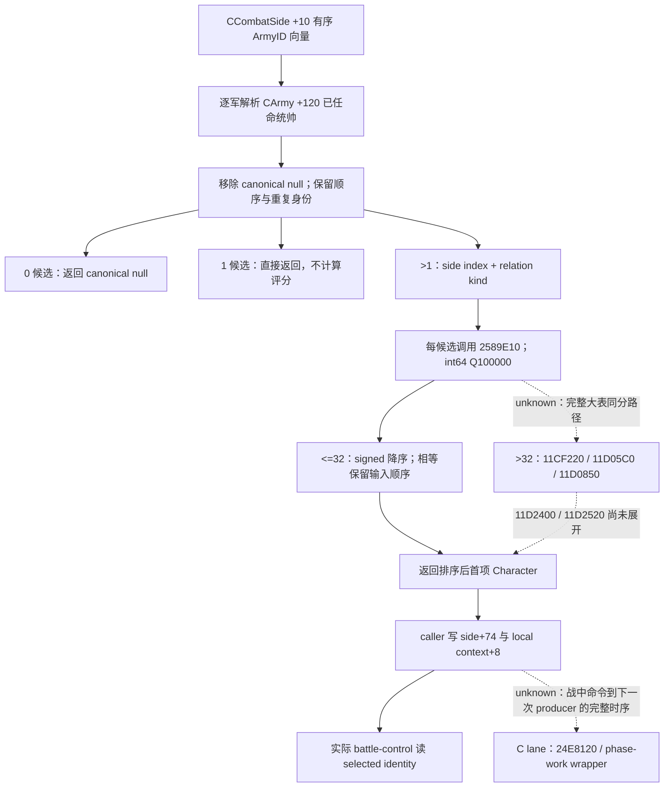

# 战斗一侧的统帅选择（CK3 1.20.0.3）

本包闭合真实战斗侧的候选来源、上下文评分与小联军同分顺序。它属于 **research**；新实机查询、动作、推进天数、测试均为 **0**。既有军队任命 GREEN 与选定统帅 next-roll reader 的 focused GREEN 直接复用，未重跑。资料目录为 `Z:/ck3_mod_rewrite_process_assets/g2-resume-20261003/combat-commander-quality-v46/side-selection/`，配套 `native-plan.json`、`native-tree.graph.md`、`EVIDENCE-PINS.json` 与 `MINIMUM-QUERY-RECIPE.json`。

精确构建为 **1.20.0.3 / Steam 25652598**，实际安装 EXE SHA-256 `94B55397ABB687A3DCD436805A5D885E6BE90FA6C693FEB44A9E3BBEEADE02A6`。只读源树 `Z:/g38` 的读取基线 HEAD 为 `56d8031cc211ff9be2ceb13bd66e722da6233947`；各源合同另有冻结副本和实际文件哈希，后续源码修改不改变本包证据。旧 1.19 的 `0x23C8A60` 只保留为历史语义对照，本包新结论绑定当前 `0x264D790`。

## 原生最小树

`0x264D790..0x264DD17` 的 primary `.pdata` 函数循环 `side+0x10` 的 internal CArmyID 向量（count `+0x1C`），按各 `CArmy+0x120` 解析 Character。它先收集，再去除 canonical null pointer；没有去重操作，因此一名角色在多军重复时仍有多个候选项。无候选或单候选分支均不进入评分循环。这不等于原生 AI 的军队任命候选池：AI 任命收集未任命人物的 `0x2C11C10`、mode 2 基础质量与玩家 mode 1 资格，仍以既有专题为准。

多个候选时，以 `side+0xB8` 取得 parent combat，比较 `parent+0x20==side` 得到 index 0/1；`0x2589810(combat,index)` 给 relation kind。每个候选原样调用 `0x2589E10(combat,out,character,index,relation,null)`，最后两个是 Win64 stack 参数。这里的分数是原生 encounter contribution，不能由通用 advantage、军队人数或候选列表质量替代。

小联军（候选数不超过 32）使用 `0x11CF130..0x11CF212` 的逻辑函数，包含 chained unwind pieces。`0x11CF184/0x11CF188`、`0x11CF1A9/0x11CF1AD` 与 `0x11CF1C8/0x11CF1CC` 的 signed `jle/jg` 证明：分值大者前移，只有严格更大才跨过已有项，相等项保持原始顺序。因索引数组先填 `0..n-1`，同分优先的是当前 side army vector 中较早出现的有效候选，不能把请求顺序当成真实未来 coalition 插入顺序。大表顶层、叶块与部分 merge 的相等分支已冻结，但 `0x11D2400/0x11D2520` 未展开，本包不推广完整大表 tie 结论。

## 评分输入与主导人物权重

`0x2589E10..0x258A1BD` 的完整 primary 函数有如下确定输入。各 modifier 人类名与本次 loaded 值未发布时保留 raw enum，不从数值碰巧相等的对象偏移猜名。

| 输入 | 当前 exact 入口 | 已闭合边界 |
|---|---|---|
| 有效 martial | Character `+0xDC * 100000`，`0x2589E48` | `.2` phase-character 合同与 `.3` 已有 `0x28B16B0(owner,1)` 相符；是评分的起始值 |
| 对侧 primary participant | index0 取 Combat `+0x3D8`，index1 取 `+0x90`，交 `0x2589020` | 这是对侧 `side+0x70`，不是 selected `+0x74`；其下游语义由 contextual lane 持续闭合 |
| 目标原始上下文输入（类型未确认） | Combat `+0x6B8` Province → `+0x848` data → `+0x388` raw context operand，交 `0x25893F0` | 该 raw operand 的业务类型未闭合；实际 TerrainFinal 为独立 getter 输入，不能互相替代 |
| modifier `0x1AE` | `0x28C3AE0` aggregator；Character `+0x1B8` Army link，generation resolve 后 `0x24DFB70` gate | 条件分支通过才加入该有效 modifier；名字和 gate 业务名未闭合 |
| 本侧 primary 身份条件 | CharacterID 等于 Combat `+index*0x348+0x90` | 等于本侧 `side+0x70` 才经 `0x2C4D550` 加 modifier `0x1B1`（index0）或 `0x1B0`（index1）；没有无条件 primary 胜出规则 |
| gathering 条件 | Combat `+index*0x348+0x364` = actual `side+0x344` | gathering=true 且 aggregator 缺 flag `0x1A5` 时加 DB `+0xEF0→+0x40 *100000`；该字段不是 holding flag |
| relation/side aggregator | `0x25899C0(combat,out,character aggregator,index,relation,null)` | 原生组合结果参与评分；不声称 full faith/constructor sources 已发布 |

selector 自身没有独立的 army-size、war-leader 固定奖金或所有 primary 优先条款。primary 身份条件只是上述原生贡献的一部分，能否改变首选取决于整项 signed 分数。特质图标、旧版注释掉的 stock advantage 与我方手工启发式均不构成该分数。

## 写入与消费时点

本轮直接 call locator 经 containing `.pdata` 起点解码确认四处调用，保存在 `selection-call-sites.json`：构造分支 `0x247A8C2/0x247A8E4` 与 phase-work wrapper `0x2AD80B4/0x2AD80D3`。两处 caller 均读取返回 Character `+0x18`，写真实 Combat `+0x94/+0x3DC`（分别是两侧 `+0x74`）及 side local-context `+8`。phase-work wrapper 有效 Combat 分支先 reselect，再递增 `+0x6B4`、按 phase `+0x6B0` 调用 `0x258C640/0x258CA60`。这些静态调用位置不证明 runtime tick 频率；完整换将→producer→draw 时序由 in-battle-assignment lane 承接。

既有 `ReadNativeCombatPhase` query-owned shell 在构造、按请求顺序 populate 与写 gathering 之后执行 selector，再写选定身份并读取 primary。source contract 的 `phase.cpp:850..891` 已冻结；static source ledger 与目标 holding 的镜像发生在后续 source stage。实际 `0x258B510` resolve 的两个 `0x2650A80` 调用是 strength/accolade cache 刷新，完整逻辑 body 没有 selector 或 side `+0x74` 写入，不能称它隐式重选统帅。

同一军队任命者与一侧实际选定统帅是不同事实。已有 battle-control reader 独立读取实际 side `+0x74` 与 Combat `+0x6B8` 的下一轮范围，原 focused GREEN 不重复；新 paused 证据仍为 0。父协调者提供的当前基线为罗贝尔 29829、军队 83886367 移动至 2640、2259 人，新军 167772189 gathering，4025 天/R22，尚无玩家 actual battle；这是父输入，不是本包采样。

## 下一项可施工入口

当前 hypothetical v2 返回各军队已任命者的目标最终输入，尚不单凭它宣称完整 side ranking 已成为生产观测。B lane 的最小 provider 可复用 `ReadNativeCombatPhase` 的同步 query-owned shell，发布 selected ID、relation、原生 commander/side dynamic 输出；不广告完整 v3、MC 或 full faith sources。真实战斗则复用 `ck3_query_battle_control_snapshot_v1` 的 actual selected 字段。本包的 recipe 只声明 Root future capture 条件，没有新增执行。

若策略确需逐候选排序账本，下一施工应在同一 shell/native helper 闭包内读取有序候选 CharacterID 与 `0x2589E10` 返回 signed raw 分数，并保留真实 side 输入顺序；不能先凭通用质量选人再补 native 数据。完整大联军 tie 的具体入口为 `0x11D2400/0x11D2520`；primary 身份 producer 的入口为 populate `0x264DE30`；modifier 名字/来源归因入口为 `0x28C3AE0/0x2C4D550` 和 exact loaded definition lookup。它们不阻止已发布的最终输入被独立使用。

父专题：[有效战斗输入](commander-effective-combat-inputs-12003.md)、[战斗模拟输入](combat-simulation-inputs.md)、[指挥官任命](commander-candidates-and-assignment-12003.md)。新日报/周报字段由 `REPORT-FIELDS.json` 提供给父协调者合并，Git 由 Root 收口。
