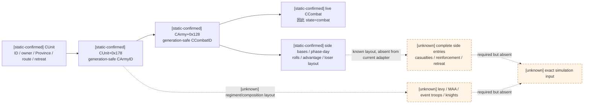
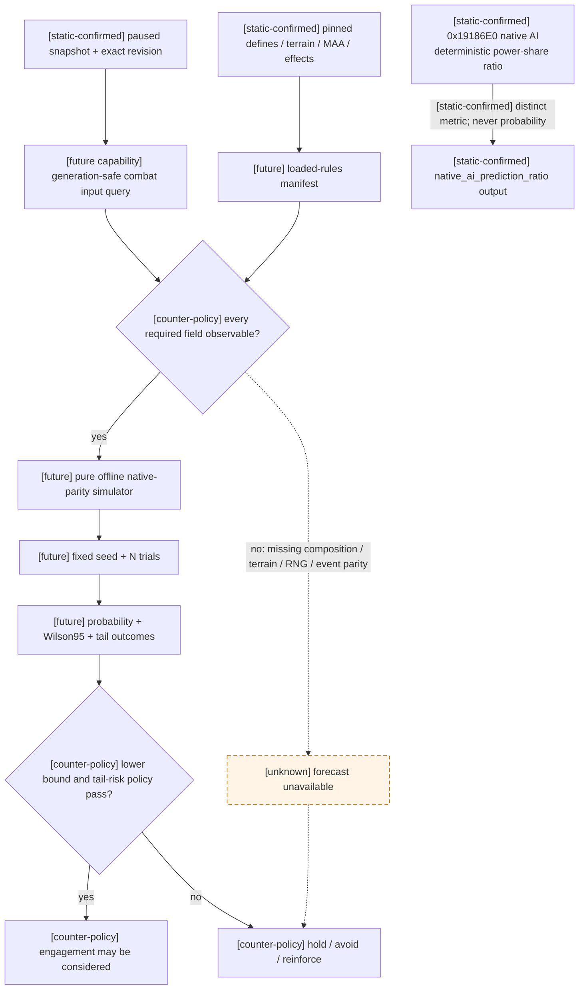

# 原生战斗模拟输入与可观测性契约（草案）

## 结论与版本边界

- [static-confirmed] 本文只绑定 CK3 `1.19.0.6`，`ck3.exe` SHA-256 为
  `2D00FF3101EF70B566F2FCBAE292F09263199C80E9DC8F139B82D7D96F83DB86`。
- [static-confirmed] 当前 native bridge **不能计算当前战局的玩家胜率**。它能确认军队的身份、位置、路线、
  `combat` / `retreating` 状态，但没有发布原生士兵总数，更没有兵团构成、有效战斗属性、将领、骑士、地形、
  优势、战斗阶段或随机状态。
- [static-confirmed] `ArmySnapshot` 没有 `soldiers` 字段；native JSON 序列化同样没有输出该字段。
  Python 规范化层接受 `soldiers` / 旧名 `soldier_count` 只是为了兼容早期夹具，不能把可选输入误认为当前
  exact-build adapter 已支持的实机字段。
- [static-confirmed] 原版 AI 使用的 `combat prediction ratio`、画面兵数比例和 Monte Carlo
  `win_probability` 是三个不同量。[combat-prediction.md](combat-prediction.md) 已把 exact-build 主计算闭合为确定性的
  `P_eval / (P_eval + P_opp)` power-share ratio；它不是抽样或战斗沙盒，也不允许被线性解释为胜率。
- [unknown] 虽然 [battle-simulation.md](battle-simulation.md) 已闭合 phase dispatcher、roll、advantage、
  loser 与部分 damage 外壳，但在伤亡整数分配、参战者/增援/撤退顺序、PRNG 消费和所有胜负相关事件闭合前，
  即使读取到兵数，也只能得到未经验证的近似模型；本文要求该分支 `fail closed`，不得据此主动接战。

## 当前 native 可观测性

现有实现证据来自
`ck3_autonomous_player/native_bridge/include/xar_bridge/game_contract.hpp`、
`ck3_autonomous_player/native_bridge/src/ck3_11906.cpp`、
`ck3_autonomous_player/native_bridge/src/bridge.cpp` 与
`ck3_autonomous_player/native_bridge/research/README.md`。

| 子域 | 当前稳定字段或静态锚点 | 胜率模拟所需状态 | 结论 |
|---|---|---|---|
| CUnit / 公共 Army | [static-confirmed] full-generation `army_id`、owner、current Province、paused full route、move target、九态 state、combat、retreat | 这些字段全部保留 | 已支持，但只够定位与状态机判断 |
| CUnit → CArmy | [static-confirmed] `CUnit+0x178` 是 generation-bearing CArmy ID | 兵团容器、当前/最大兵员、补员和单位来源 | 只有链接已证；未发布 |
| CArmy | [static-confirmed] `+0x10` ID、`+0x120` owner、`+0x124` CUnit ID、`+0x128` CCombat ID；`+0x5C` gathering count | regiment 数组、levy/MAA/event troop/knight 构成、有效 modifiers | 布局仅闭合到身份和 combat 关联 |
| CCombat | [static-confirmed] storage 在 `base+0x570C758`，`CCombat+0x08` 回读 full ID；两侧 base、phase/day、roll、advantage、loser 与 roll cadence 布局已闭合，详见 [battle-simulation.md](battle-simulation.md) | 已知布局的原子发布，以及完整 side entries、伤亡、增援、撤退与仍在作战状态 | 当前 adapter 只用它证明 `in_combat`，未发布已知 rich 字段；剩余 side/lifecycle ABI 未闭合 |
| 士兵总数 | [static-confirmed] GUI 名称存在：`Army.GetSoldierCount`、`ArmyComposition.GetCurrentNumberOfSoldiers` / `GetMaxNumberOfSoldiers` | 每军 current/max，以及各兵团 current/max | adapter 明确 unsupported；callback 与 receiver 未闭合 |
| 兵团 / levy | [static-confirmed] split-half validator 已证明内部存在至少两个 live/nonempty regiment 的门槛；GUI 有 `RegimentReorgEntry.GetSoldierCount` | 每个兵团的种类、当前/上限、hard/soft casualties、是否主阶段作战 | 只有存在性锚点；布局与聚合未知 |
| MAA | [static-confirmed] 原版 `men_at_arms_types` 数据给出 base damage/toughness/pursuit/screen、stack、terrain bonus、counter | live type、current strength、驻扎/owner/army modifiers 后的有效四维属性、实际 counter reduction | 原版数据可读；live 兵团与有效值未发布 |
| Knights | [static-confirmed] 原版 define 给出每 prowess 的 damage/toughness；GUI 有 knight entry 与 combat knight count | 每位参战骑士的 CharacterID、prowess、有效性、伤病/死亡状态及阶段事件资格 | 未发布 |
| Commander | [static-confirmed] GUI 有 `Army.GetCommander`、`Character.GetCommanderAdvantage`、`CombatWindow.GetLeft/RightRoll` | commander ID、martial/prowess、min/max roll、traits、动态 advantage/effects、是否亲征 | 仅 GUI 名称锚点；callback / ABI 未闭合 |
| Terrain | [static-confirmed] `Province.GetTerrain` GUI 路径和原版 terrain 数据存在 | encounter Province 的 resolved terrain、战宽、攻守 modifiers、河流/大河/海峡 adjacency | 当前只有 ProvinceID；terrain 与入场边未发布 |
| Supply / debt / disembark | [static-confirmed] 原版 combat effects 定义 supplied/running-low/starving、recently disembarked、debt 等 advantage | 每一侧实际命中的 supply state、登陆惩罚剩余天数、债务层级与其它动态效果 | 未发布 |
| Advantage | [static-confirmed] active combat GUI 有 `CombatWindow.GetAdvantage` 和 breakdown | 开战时静态 advantage、每轮双方 roll、最终差值及每个来源 | 未发布 |
| CombatSide | [static-confirmed] GUI 有 composition、current fighting men、soft casualties、still fighting | side participant 集、attacker/defender、current/hard/soft casualties、reinforcement join/leave | 未发布 |
| active combat MAA | [static-confirmed] GUI 有 `CombatMaaItem.GetStat/GetCurrentStrength/GetMaxStrength/GetCountered/GetTerrainBonus` | 每类 MAA 的聚合有效值与 counter 分配 | 很强的后续 RE 锚点；callback / receiver 未闭合 |
| 原生 AI prediction | [static-confirmed] [combat-prediction.md](combat-prediction.md) 已闭合 RVA `0x19186E0` 的输入 ABI、direct xrefs 与确定性 power-share 主公式 | 对一个明确 encounter 与 participant set 的 exact 原生返回值，以及 paused worker 的只读线程安全性 | adapter 未实现；不得从 soldiers 反推，也不得命名为胜率 |
| RNG / phase events | [static-confirmed] combat roll 每 3 日，commander/knight phase event 每 5 日；事件是带脚本 trigger/chance/effect 的加权随机表 | 原程序 RNG、抽样顺序、脚本求值、伤/残/死造成的后续战力变化 | 未闭合 |

### 已证对象链只回答“是否在战斗”



## 原版数据中可稳定冻结的参数

以下文件来自与 pinned EXE 同一安装包；SHA 用于本次审计复现。正式模拟输入还必须对**实际加载后的全部相关
数据库和覆盖文件**生成 deterministic manifest，不能只检查这里列出的 stock 文件。

| 文件 | SHA-256 |
|---|---|
| `game/common/defines/00_defines.txt` | `C1ECA141C71EC1E741CA5336E01BB538EEFAEC05B0684EDEC477CFC9053C3807` |
| `game/common/defines/ai/00_ai.txt` | `C78F9CD8DF9938CC9F38E817BCB6E32CD13720B5BD9DE077B85E3E1C6F030293` |
| `game/common/men_at_arms_types/_men_at_arms_types.info` | `ADF6304B8540B6936B1AF28B001B1A0F4B14CDD40E376B35F583EF3926368660` |
| `game/common/terrain_types/_terrains.info` | `9A4A3BEE16AACDBA8EBBCD681519E261957C979BE83052616F9290AE5348C1E4` |
| `game/common/terrain_types/00_terrains.txt` | `39D79AD120BF85B49D6EE8D96FE4D94EDBBABC190A41662DBA8ECA8DE0ACE64E` |
| `game/common/combat_effects/00_combat_effects.txt` | `2D99752F002DCD58FDA3F2E3968D6A06BFFAFE76F89714EDBB0CEC10609571CF` |
| `game/common/combat_phase_events/00_commander_phase_events.txt` | `0CC4675971279397F692512E334CE13B9498C2F02C08C29576961CD31080BFF1` |
| `game/common/combat_phase_events/00_knight_phase_events.txt` | `E8F8E4978BB1AF130D74AA6ED72EE41F014B09C9F324608EBFB0E87D56A5EDB1` |

### NCombat 静态常量

| [static-confirmed] 参数 | 1.19.0.6 值 | 已知语义 |
|---|---:|---|
| `COMBAT_ROLL_DAYS` | 3 | 两次 combat roll 的间隔 |
| `COMBAT_EVENT_DAYS` | 5 | commander / knight phase event 求值间隔 |
| `MANEUVER_PHASE_DAYS` | 3 | maneuver 阶段长度 |
| `LEVY_ATTACK` / `LEVY_TOUGHNESS` | 10 / 10 | 每名 levy 的基础 attack / toughness |
| `LEVY_PURSUIT` / `LEVY_SCREEN` | 0 / 0 | levy 的基础 pursuit / screen |
| `DAMAGE_SCALING_FACTOR` | 0.03 | 主战斗伤害缩放 |
| `BASE_RATIO_CASUALTIES_CONVERSION` | 0.3 | 主阶段 soft casualty 转 hard casualty 的基础比例 |
| `PURSUIT_PHASE_DAYS` | 3 | pursuit 阶段长度 |
| `ADVANTAGE_DAMAGE_SCALING_FACTOR` | 5 | advantage 对伤害的缩放参数 |
| `BASE_WIDTH_RATIO` | 1 | defender size 到基础 combat width 的倍率 |
| `MINIMUM_COMBAT_WIDTH` | 100 | 战宽下限 |
| `COMMANDER_MIN_ROLL` / `MAX_ROLL` | 0 / 10 | 默认 commander roll 区间 |
| `MEN_AT_ARMS_MAX_COUNTER` | 0.9 | 达到最大 counter 时的伤害减幅 |
| `RATIO_FOR_MAX_COUNTER` | 2.0 | 达到最大 counter 所需 effective chunk 比 |
| `BASE_RATIO_CASUALTIES_CONVERSION_PURSUIT` | 1 | pursuit hard casualty 转换参数 |
| `PURSUIT_STAT_TO_PURSUIT_DAMAGE` | 0.5 | pursuit stat 到伤害的倍率 |
| `BASE_TOUGHNESS_TO_PURSUIT` | 0.05 | 无 pursuit/screen 差时的基础 pursuit 损失 |
| `MINIMUM_PURSUIT_DAMAGE` | 0.01 | pursuit 损失下限 |
| `KNIGHT_DAMAGE_PER_PROWESS` | 50 | 每点 prowess 的 knight damage |
| `KNIGHT_TOUGHNESS_PER_PROWESS` | 10 | 每点 prowess 的 knight toughness |
| `MIN_DAYS_BEFORE_MANUAL_RETREAT` | 14 | 可手动撤退前的最少天数 |

### Terrain、adjacency 与状态效果

- [static-confirmed] 默认 terrain `combat_width=1`；hills/terraced hills `0.8`，mountains/desert mountains
  `0.5`，jungle `0.7`，forest `0.9`，taiga `0.8`，wetlands `0.6`，floodplains `0.75`。
- [static-confirmed] 对 defender 的 terrain advantage：hills/terraced hills `+5`，mountains/desert mountains
  `+12`，jungle `+6`，forest `+3`，taiga `+4`，wetlands `+5`。
- [static-confirmed] wetlands 还给攻守双方 `hard_casualty_modifier=+0.2`、`retreat_losses=+0.25`；
  desert mountains 给 defender `retreat_losses=-0.3`。
- [static-confirmed] river / large river / strait 给 defender 的 adjacency advantage 分别是 `+10/+20/+30`。
- [static-confirmed] running low / starving 的 supply advantage 是 `-10/-25`，recently disembarked 是 `-30`；
  debt combat effect 从 `-5` 逐级到 `-100`，gathering army 为 `-5`。
- [static-confirmed] 每个 MAA type 的原版数据库至少声明 base damage、toughness、pursuit、screen、
  `fights_in_main_phase`、stack、terrain bonuses 和 counters；owner、stationing、buildings、culture、traits、
  accolades 等仍会改变 live 有效值。

这些文件证明“原版有哪些参数”，不证明下列硬编码步骤：counter 的全局分配顺序、战宽内兵员选择、每轮伤害与
伤亡的定点舍入/截断点、败退与追击切换、reinforcement 的加入时机、同日 roll/event 的先后顺序，以及 RNG
stream 的消费顺序。上述任一项未闭合时不得标记 `exact-native-parity`。

## 建议的 exact-build 查询边界

战斗输入体积大、只能在 paused world 上做 generation-safe 原子读取，而且 Monte Carlo 不应阻塞 heartbeat。
因此建议新增显式只读 capability，而不是把完整构成塞进每 250 ms 的 `game.state.snapshot`：

- `game.command.query-combat-simulation-inputs`：枚举当前 paused revision 中可明确构造的 encounter Province、
  玩家 ArmyID 集与 hostile ArmyID 集，并返回 immutable input snapshots；不调用战斗 apply/update，不推进 CK3 RNG。
- `game.command.query-native-combat-predictions`：exact-build 输入 ABI 和 power-share 主公式已在
  [combat-prediction.md](combat-prediction.md) 静态闭合；只有剩余 mode/flag/lane 语义和 worker-thread 只读性也被 static + offline
  fixture 证明后才广告。它返回 AI ratio，绝不命名为 probability。
- `game.forecast.combat-monte-carlo-v1`：进程外纯函数，消费前一个输入和 pinned rules manifest；不读取活世界。

### 输入 schema 草案

```json
{
  "schema_version": 1,
  "status": "available",
  "source": {
    "game_version": "1.19.0.6",
    "executable_sha256": "...",
    "loaded_combat_rules_sha256": "...",
    "snapshot_id": "native:N",
    "revision": 0,
    "date_raw": 0,
    "paused": true
  },
  "encounter": {
    "province_id": 1,
    "terrain_key": "hills",
    "combat_width_multiplier": { "raw": 80000, "scale": 100000 },
    "adjacency_kind": "none",
    "participant_policy": "fixed_at_contact"
  },
  "sides": [
    {
      "side": "player",
      "is_attacker": true,
      "army_ids": [1],
      "commander": {
        "character_id": 1,
        "martial": 0,
        "prowess": 0,
        "min_roll": 0,
        "max_roll": 10,
        "base_advantage": { "raw": 0, "scale": 100000 }
      },
      "supply_state": "supplied",
      "recently_disembarked_days_left": 0,
      "debt_effect_key": null,
      "regiments": [
        {
          "input_index": 0,
          "kind": "levy",
          "maa_type_key": null,
          "archetype_key": null,
          "current_soldiers": 100,
          "maximum_soldiers": 100,
          "fights_in_main_phase": true,
          "is_event_troops": false,
          "effective_damage": { "raw": 1000000, "scale": 100000 },
          "effective_toughness": { "raw": 1000000, "scale": 100000 },
          "effective_pursuit": { "raw": 0, "scale": 100000 },
          "effective_screen": { "raw": 0, "scale": 100000 },
          "counters": []
        }
      ],
      "knights": []
    }
  ],
  "ongoing_combat": null,
  "phase_event_model": {
    "status": "exact",
    "rules_sha256": "..."
  },
  "completeness": {
    "all_required_inputs_observable": true,
    "unknown_fields": []
  },
  "input_sha256": "sha256-of-canonical-json-without-this-field"
}
```

契约要求：

1. [counter-policy] 只能在 paused 同一 revision 内解析全部 full-generation Army/Character/Province 关系；
   任一对象消失、generation 不符、数组越界或 subdomain 不可读，整个查询返回 `status=unavailable`。
2. [counter-policy] `effective_*` 必须来自已闭合的原版聚合调用链，不能让进程外代码从少量 raw modifier 猜总和。
3. [counter-policy] pre-contact scenario 必须冻结 attacker/defender、入场 adjacency、terrain 和参与军队集合。
   可能在模拟战斗期加入但 ETA 未知的增援，使整个安全预测不可用；不能把它悄悄排除。
4. [counter-policy] ongoing combat 另需 `phase`、phase/day offset、当前 roll、advantage、current fighting men、
   hard/soft casualties、still-fighting、已入场/待入场 participant 及其 ETA。未开始战斗时这些值必须是 `null`，
   不能伪造零。
5. [counter-policy] 如果 phase events 尚未达到原版 parity，可以生成明确标记的研究性
   `bounded_core_only` 结果，但 planner 必须把它视为 unavailable；不得用其下界授权主动接战。

### 输出 schema 草案

```json
{
  "schema_version": 1,
  "status": "available",
  "model_fidelity": "exact-native-parity",
  "input_sha256": "...",
  "simulator_build": "...",
  "native_ai_prediction_ratio": {
    "status": "unavailable",
    "value": null
  },
  "monte_carlo": {
    "prng": "exact-engine-rng-or-explicit-independent-sampler",
    "seed_u64": "123456789",
    "sample_count": 100000,
    "player_wins": 0,
    "player_losses": 0,
    "no_resolution": 0,
    "player_win_probability": 0.0,
    "player_win_wilson95": [0.0, 0.0]
  },
  "outcomes": {
    "battle_days": { "mean": 0.0, "p10": 0, "p50": 0, "p90": 0 },
    "player_hard_casualties": { "mean": 0.0, "p10": 0, "p50": 0, "p90": 0 },
    "enemy_hard_casualties": { "mean": 0.0, "p10": 0, "p50": 0, "p90": 0 },
    "player_stack_wipe_probability": 0.0,
    "commander_or_knight_death_probability": 0.0
  }
}
```

- [counter-policy] 默认固定 `100000` 个样本并记录 64-bit seed；相同 canonical input、simulator build、seed 和
  sample count 必须逐字节复现同一摘要。若原版 RNG 尚未闭合，输出必须写明使用独立 sampler，不能称为对当前
  CK3 时间线的唯一确定预言。
- [counter-policy] 95% Wilson 区间只描述 Monte Carlo 抽样误差，不包含模型错误。`model_fidelity` 不是
  `exact-native-parity` 时，区间不能包装成“可信的原版胜率”。
- [counter-policy] 策略至少使用胜率区间下界、stack-wipe 尾险、玩家/关键人物损失尾险和未建模增援共同判定；
  不能只看点估计。

## 数据流与 fail-closed 门



## 离线 fixture 设计

建议目录：`ck3_autonomous_player/native_bridge/tests/fixtures/combat/`。所有 expected 值必须来自已审计的原程序
trace 或逐指令闭合结果，不能用自编模拟器生成自己的“真值”。

1. `input_generation_and_atomicity`：valid/stale CUnit、CArmy、CCombat、Character、Province generation；任一
   必需链接失效时整个 input unavailable，且未知不变成零。
2. `equal_levies_main_round`：纯 levy、无 modifier、无 terrain bonus 的单轮输入；锁定 combat width、damage、
   soft/hard casualty、fixed-point rounding 的原生 golden trace。
3. `commander_roll_bounds`：默认 `0..10` 以及 min/max modifier 后的边界、3 日重掷节拍和同日求值顺序。
4. `terrain_and_adjacency`：hills/mountains/wetlands 加 river/strait；锁定 combat width、advantage、retreat loss
   与 hard casualty modifier。
5. `maa_counter_allocation`：单兵种、一对多、多对一、混合 depleted regiment；锁定 chunk、counter cap、分配
   次序与定点舍入。
6. `knight_effectiveness`：不同 prowess、knight effectiveness 与伤病；锁定每名 knight 的有效 damage/toughness
   及死亡后从 side strength 移除的时点。
7. `pursuit_and_screen`：双方 pursuit/screen 高低组合；锁定 pursuit 三日、minimum damage、soft→hard 转换。
8. `phase_event_rng`：commander/knight none/wound/maim/death 的 trigger、weight、随机选择、RNG 消费与后续战力
   变化。未通过前不得宣称完整胜率。
9. `ongoing_combat_resume`：maneuver/main/pursuit 各阶段快照继续模拟，与原程序后续逐日 trace 对齐。
10. `reinforcement_join`：同日与跨日到达、多个 owner/army、退场/撤退；未闭合 join policy 时安全预测 unavailable。
11. `monte_carlo_reproducibility`：固定 input hash、simulator build、seed、N 的摘要逐字节一致；改变任一 provenance
    字段必须生成新 forecast ID。

## 战略可赢性与止损的最小追加指标

单场胜率不等于战争可赢。要让宣战、继续战争、白和、投降与止损决策可审计，snapshot 至少还需：

| 指标组 | 最小字段 | 当前状态 |
|---|---|---|
| 双方已动员战力 | 每个 war side 的 raised army composition/effective power、位置、路线、补给、到达各 objective 的 ETA | 只有 ArmyID/owner/位置/路线；战力缺失 |
| 双方可动员储备 | current/max levy、MAA、horde/event troops、补员速度、raise point 与完整动员时间 | 缺失 |
| 盟军 | 已参战 participant、尚可召盟友、各自承诺/可用军力、是否已被其它战争牵制、加入 ETA | 只能按当前 war participant 分类已出现的 CUnit；其它缺失 |
| 财政续航 | treasury、monthly income、raised maintenance、reinforcement cost、debt tier/advantage penalty、可雇佣 mercenary/holy order 与货币 | 缺失 |
| 战争分构成 | total、battle、occupation、objective ticking、prisoner/war-leader 分、单战 battle cap 与剩余可得分 | 只有 `player_relative_war_score` total |
| 战争目标 | targeted titles、objective Provinces、occupation、fort/garrison/siege/assault、ticking controller | 前半部分已支持；ticking 与完整 score breakdown 缺失 |
| 接战矩阵 | 所有可能接触的 player × hostile/allied reinforcement scenario 的 exact forecast、terrain、ETA 与尾险 | 缺失 |
| 战争终止 | enforce/surrender/white-peace 当前 native validation、AI acceptance score/阈值/冷却、强制胜利条件 | enforce command 存在；决策与 acceptance 未发布 |
| 宣战成本/收益 | CB cost 各货币、目标价值、盟友调用成本、预期占领/战斗损失、战后 truce/派系/财政机会成本 | declaration choices 只含 CB key/config/claimant/titles；成本与收益缺失 |
| 止损预算 | 最大可接受 hard casualties、stack-wipe、关键 commander/knight/玩家死亡或被俘概率、gold runway 与时间上限 | 缺失 |

在这些指标未闭合时，可以继续执行确定性低风险目标和一日观察，但不能把“当前战争分为正”或“可见兵数较多”
当作战争最终可赢、继续消耗合理或单场接战安全的证明。

## 未闭合清单

- [unknown] soldier / ArmyComposition reflection callback、receiver 类型和 live aggregation ABI。
- [unknown] CArmy regiment 容器、regiment kind/current/max、levy/MAA/event/knight 的 exact layout 与生命周期。
- [unknown] Province terrain、入场 edge 的 river/large-river/strait 与 attacker/defender 判定 ABI。
- [unknown] commander、knight、effective stat、supply、debt、recently disembarked 和动态 modifier 聚合入口。
- [static-confirmed] CCombat 两侧 base、phase/day、roll、advantage、loser 与 roll cadence 布局，以及每日
  phase dispatcher 已闭合；当前 adapter 尚未发布这些字段，详见 [battle-simulation.md](battle-simulation.md)。
- [unknown] CombatSide 完整 entry 语义、伤亡整数分配、reinforcement、retreat/forced-result 的先后顺序与
  全部生命周期 ABI。
- [static-confirmed] AI combat prediction helper RVA `0x19186E0` 的输入 ABI、direct xrefs、敌方 `1.1` 修正和
  `P_eval / (P_eval + P_opp)` 主公式；详见 [combat-prediction.md](combat-prediction.md)。
- [unknown] AI predictor 的 mode/flag/lane 完整业务语义、paused worker 只读线程边界，以及当前 bridge 未发布的
  encounter participant 输入。
- [unknown] 战宽、counter 与 damage 的部分外壳已经闭合，但其完整分配、casualty、追击、撤退调用链及全部
  clamp/round 顺序尚未达到 exact-native parity。
- [unknown] 原程序 RNG 算法/seed/stream、roll 与 phase event 的消费次序、脚本事件对后续 combat state 的反馈。
- [unknown] 多军中途加入、离开、第三方敌对关系与同日到达的完整 participant policy。
