# 原生战斗模拟输入与可观测性契约（v2 / v3）

## 结论与版本边界

- [static-confirmed] 本文只绑定 CK3 `1.19.0.6`，`ck3.exe` SHA-256 为
  `2D00FF3101EF70B566F2FCBAE292F09263199C80E9DC8F139B82D7D96F83DB86`。
- [live-confirmed] 当前 native bridge **仍不能计算当前战局的玩家胜率**，但两层只读观测都已通过 paused
  实机验收：`ck3_query_army_strengths` 返回 current/max soldiers、regiment count 与 AI base-power raw；
  `ck3_query_combat_simulation_inputs` 已按显式 target/entry/A-D partitions 返回兵团类型、target-effective stats、
  counter、将领、骑士、地形、crossing/roles/holding 与 contact width。`input_observation_ready=true` 只证明输入
  原子可读；它不能把 aggregate 改名为胜率，也不能跳过尚未通过 fixture 的 transition simulator。
- [static-confirmed] 高频 `game.state.snapshot` 的 `ArmySnapshot` 仍没有 `soldiers` 字段；其 Python 规范化层
  接受 `soldiers` / 旧名 `soldier_count` 只是兼容早期夹具。实机人数来自独立按需
  `query-army-strengths-v1` response，不能把两种 schema 混为一谈。
- [live-confirmed] pinned EXE 的只读聚合与 encounter-context 路径都已落成生产 bridge/MCP。paused revision `4`
  已先验收玩家与两支 active-war enemy 的 army strength，再在 date raw `53175816`、snapshot native `3` 上验收
  五个 v2 场景（敌攻玩家三种 partition、玩家主动攻击两种 partition）；每次都返回 `status=available`、
  `input_observation_ready=true`，且未要求军队预先移动或接战。
- [live-blocker] 已废止的 v1 prototype 只有 target 与未分 side ArmyID 列表，native admission 还要求一侧已在
  target、另一侧已有从相邻 origin 指向 target 的 move/route。当前暂停现场玩家 `83886341@2596`、两敌
  `357/33554657@2581` 无法为三军构造同一个满足该 gate 的 contact，因此 v1 会在读取 composition 前返回
  `invalid_encounter`。这不是“战斗信息不可知”，而是查询合同错误；v1 已 superseded，既不广告也不 dispatch。
- [live-confirmed] v2 由调用者显式给出 target、attacker final-edge entry 与有序 A/D 分区，完全不依赖已有
  move、current position 或 route。`[357,33554657]` attacker、`[83886341]` defender、target `2596`、entry
  `2597` 已取得 production paused live response；单敌 `357`、单敌 `33554657` 与两敌合流三个 context 均独立
  available，证明 participant set 没有被跨场景缓存复用。
- [static + production-fixture-confirmed] exact adapter 现已正式广告
  `game.command.query-combat-simulation-inputs-v3-N`，Python/MCP 正式口为
  `ck3_query_combat_simulation_inputs_v3`。一次 paused、same-frame 查询原子组合 v2 `base_inputs`、81 个
  exact native leaves、51 个 exact offline derivations 和原生 temporary-shell advantage 对拍；两份 production
  command-result golden 已逐键通过 strict normalizer。这个结论还不是 paused CK3 live acceptance，更不是胜率；
  `phase_event_inputs_ready=true` 与 transition fidelity / `monte_carlo_ready` 是互不替代的门。
- [static-confirmed] 原版 AI 使用的 `combat prediction ratio`、画面兵数比例和 Monte Carlo
  `win_probability` 是三个不同量。[combat-prediction.md](combat-prediction.md) 已把 exact-build 主计算闭合为确定性的
  `P_eval / (P_eval + P_opp)` power-share ratio；它不是抽样或战斗沙盒，也不允许被线性解释为胜率。
- [static-confirmed] [battle-simulation.md](battle-simulation.md) 已闭合 phase dispatcher、roll、advantage、
  **winner**、main casualty、pursuit、phase-event selection/schedule、核心 PRNG 以及 battle-end/manual retreat/
  forced-result 的原生核心顺序；但在 loaded event effect 的战斗状态转移、AI 的实际撤退 policy、相应 simulator
  与 original-trace fixture 闭合前，
  即使读取到兵数，也只能得到未经验证的近似模型；本文要求该分支 `fail closed`，不得据此主动接战。

## 当前 native 可观测性

现有实现证据来自
`ck3_autonomous_player/native_bridge/include/xar_bridge/game_contract.hpp`、
`ck3_autonomous_player/native_bridge/src/ck3_11906.cpp`、
`ck3_autonomous_player/native_bridge/src/bridge.cpp` 与
`ck3_autonomous_player/native_bridge/research/README.md`。

| 子域 | 当前稳定字段或静态锚点 | 胜率模拟所需状态 | 结论 |
|---|---|---|---|
| CUnit / 公共 Army | [static-confirmed] full-generation `army_id`、owner、current Province、paused full route、move target、九态 state、combat、retreat | 这些字段全部保留 | 已支持，但只够定位与状态机判断 |
| CUnit → CArmy | [live-confirmed] `CUnit+0x178` generation-bearing CArmy ID 已由 `army-strength-v1` production query 实机走通 | 兵团构成、补员和单位来源 | identity 与 aggregate 已发布；detail 留给下一口 |
| CArmy | [live-confirmed] `+0x10` ID、`+0x38` regiment ID array data、`+0x44` count 的只读聚合已由 paused live query 验收；[static-confirmed] `+0x120` commander CharacterID、`+0x124` CUnit ID、`+0x128` CCombat ID；contact advantage builder 把 `+0x5C!=0` 作为 recently-disembarked predicate | levy/MAA/event troop/knight 构成、有效 modifiers | regiment count/current/max/base power 已发布；`+0x5C` 只可发布 raw/predicate，不能猜剩余天数 |
| CCombat | [static-confirmed] storage 在 `base+0x570C758`，`CCombat+0x08` 回读 full ID；`+0x6B8` 是 encounter Province；phase/day、base/final width、roll、advantage、**winner** 与 roll cadence 布局已闭合，详见 [battle-simulation.md](battle-simulation.md) | 已知布局的原子发布，以及完整 side entries、伤亡、增援、撤退与仍在作战状态 | 这些字段只在 live CCombat 存在；pre-contact 场景不得伪造 phase/width/roll |
| 士兵总数 | [live-confirmed] `army-strength-v1` 已发布 per-army current/max；[static-confirmed] canonical helpers 是 `0x27BD9E0(array,flags=0)` / `0x226F350(CArmy*)` | 每个 regiment current/max | aggregate 与 v2 per-regiment detail 均已 paused 实机验收 |
| 兵团 / levy | [static-confirmed] CArmy `+0x38/+0x44` 是 4-byte full CRegimentID 数组；CRegiment `+0x10` 回读 full ID，`+0x38/+0x3C` 是 current/max，`+0x40` 是 AI 收集器累加的 power qword；combat type 取 `CRegiment+0x18`，原生 `0x23C9100` 用其 validity 与 `0x239CEB0` 把每个 CRegiment 唯一分流到 levy/MAA；type `+0xA0A` 是主阶段资格 | 每个兵团的可靠 kind、hard/soft casualties、是否主阶段作战、live effective 属性 | kind 与主阶段资格 ABI 已闭合；CRegiment 没有 knight bucket，骑士来自独立 character participant 链 |
| MAA | [static-confirmed] 原版 `men_at_arms_types` 数据给出 base damage/toughness/pursuit/screen、stack、terrain bonus、counter；exact helper `0x239CAE0(CRegiment*,Stats38*,CProvince*)` 计算目标 Province 下的 live effective stats | live type、current strength、驻扎/owner/army/terrain modifiers 后的有效四维属性、实际 counter reduction | [live-confirmed] 四维与 counter operand 已随五个 v2 场景原子返回；transition 消费仍受 simulator fixture 门限制 |
| Knights | [static-confirmed] `0x19DD670` 从 `CRegiment+0x148` full CharacterID 构造 combat-side knight list；`0x239CAE0/0x28FDBC0` 给出 effective prowess/effectiveness/damage/toughness | traits/health 对阶段事件资格与受伤/死亡后的移除时点 | [live-confirmed] identity、membership 与有效数值已随五个 v2 场景返回；loaded phase-event feedback 仍未验收 |
| Commander | [static-confirmed] `CArmy+0x120` 是 full CharacterID；`0x23CBFA0` 闭合 battle-side commander 的 character/terrain modifier roll endpoints | traits、动态 advantage/effects、是否亲征 | paused query 可镜像 effective roll bounds；不得调用会消费 RNG 的 roll helper |
| Terrain | [static-confirmed] `0x220D940(CProvince*)` 返回 terrain；contact constructor 闭合 adjacency kind、side role 与首次 width，holding 用 `0x2900BB0` | 其它动态攻守 effect | [live-confirmed] hills、无 crossing、攻守/holding 与 absolute pre-contact width 已在 defensive/offensive 五个 v2 场景验收 |
| Supply / debt / disembark | [static-confirmed] `0x23049E0/0x2304830/0x2304EC0` 已闭合 exact selector、first-army 语义与 constructor order | 每一侧命中的 supply effect、`+0x5C` raw predicate、owner/treasury debt selector 与 loaded effect value | v3 production reader 与完整 15-stage golden 已发布；paused-live acceptance 仍待执行 |
| Advantage | [static-confirmed] `0x23045F0` 的逐来源 Q100000、side sign、clamp 与 ledger 已闭合；`0x2308D50` 证明 resolved=`base+side0-side1`；`0x2307CB0/0x2307680/0x2307230` 的 zero-roll dynamic decomposition 与无注册 local-shell lifecycle 也已闭合 | constructor source ledger、每轮 roll、commander/side dynamic contributors | production temporary-shell reader、original-total equality 门、serializer 与 available/unavailable goldens 已闭合；live equality 待验收，transition fidelity 仍关闭 |
| CombatSide | [static-confirmed] GUI 有 composition、current fighting men、soft casualties、still fighting | side participant 集、attacker/defender、current/hard/soft casualties、reinforcement join/leave | 未发布 |
| active combat MAA | [static-confirmed] GUI 有 `CombatMaaItem.GetStat/GetCurrentStrength/GetMaxStrength/GetCountered/GetTerrainBonus` | 每类 MAA 的聚合有效值与 counter 分配 | 很强的后续 RE 锚点；callback / receiver 未闭合 |
| 原生 AI prediction | [static-confirmed] [combat-prediction.md](combat-prediction.md) 已闭合 RVA `0x19186E0` 的输入 ABI、direct xrefs 与确定性 power-share 主公式；`0x19179E0` 的 `entry+0x08/+0x10` 已闭合为 identity-valid regiment 的 current soldiers / power sum | 对一个明确 encounter 与 participant set 的 exact 原生返回值，以及 paused worker 的只读线程安全性 | base aggregate 可先发布；完整 predictor 仍缺合法 `CAISubunitStack` 构造、mode/flags/lane 与 worker 生命周期，不得从 soldiers 反推，也不得命名为胜率 |
| RNG / phase events | [static-confirmed] `0x356B770` draw31、`0x2E1C570` selector、五日 schedule、effect seed；stock candidate 13-row 表及主要伤/残/死/prowess 转移已整理 | actual playset manifest、normalized AST/evaluator、effect-local knight 抽样和死亡后同日 recompute original trace | 核心 RNG/排程与 stock 可施工表已闭合；详见 [combat-phase-events.md](combat-phase-events.md)，MC 仍未 ready |

### 第一观测切片与余下缺口

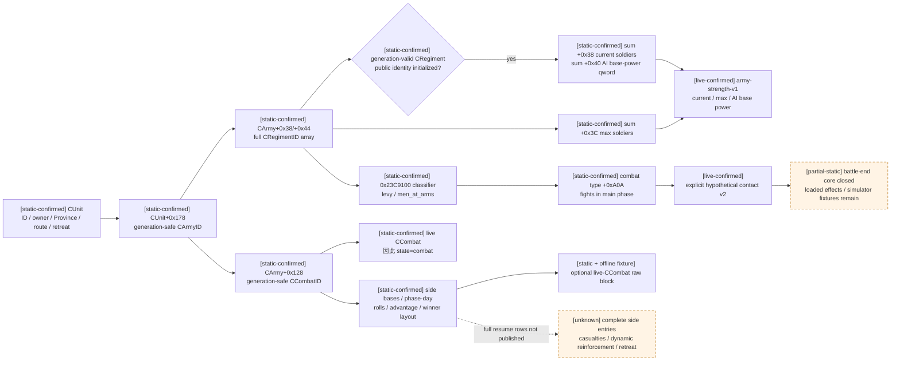

## 原版数据中可稳定冻结的参数

以下文件来自与 pinned EXE 同一安装包；SHA 用于本次审计复现。正式模拟输入还必须对**实际加载后的全部相关
数据库和覆盖文件**生成 deterministic manifest，不能只检查这里列出的 stock 文件。

| 文件 | SHA-256 |
|---|---|
| `game/common/defines/00_defines.txt` | `C1ECA141C71EC1E741CA5336E01BB538EEFAEC05B0684EDEC477CFC9053C3807` |
| `game/common/defines/ai/00_ai.txt` | `C78F9CD8DF9938CC9F38E817BCB6E32CD13720B5BD9DE077B85E3E1C6F030293` |
| `game/common/men_at_arms_types/_men_at_arms_types.info` | `ADF6304B8540B6936B1AF28B001B1A0F4B14CDD40E376B35F583EF3926368660` |
| `game/common/terrain_types/_terrains.info` | `9A4A3BEE16AACDBA8EBBCD681519E261957C979BE83052616F9290AE5348C1E4` |
| `game/common/terrain_types/00_terrains.txt` | `39D79AD120BF85B49D6EE8D96FE4D94EDBBABC190A41662DBA8ECA8DE0ACE64E` |
| `game/common/combat_effects/00_combat_effects.txt` | `2D99752F002DCD58FDA3F2E3968D6A06BFFAFE76F89714EDBB0CEC10609571CF` |
| `game/common/combat_phase_events/00_commander_phase_events.txt` | `0CC4675971279397F692512E334CE13B9498C2F02C08C29576961CD31080BFF1` |
| `game/common/combat_phase_events/00_knight_phase_events.txt` | `E8F8E4978BB1AF130D74AA6ED72EE41F014B09C9F324608EBFB0E87D56A5EDB1` |

### NCombat 静态常量

| [static-confirmed] 参数 | 1.19.0.6 值 | 已知语义 |
|---|---:|---|
| `COMBAT_ROLL_DAYS` | 3 | 两次 combat roll 的间隔 |
| `COMBAT_EVENT_DAYS` | 5 | commander / knight phase event 求值间隔 |
| `MANEUVER_PHASE_DAYS` | 3 | maneuver 阶段长度 |
| `LEVY_ATTACK` / `LEVY_TOUGHNESS` | 10 / 10 | 每名 levy 的基础 attack / toughness |
| `LEVY_PURSUIT` / `LEVY_SCREEN` | 0 / 0 | levy 的基础 pursuit / screen |
| `DAMAGE_SCALING_FACTOR` | 0.03 | 主战斗伤害缩放 |
| `BASE_RATIO_CASUALTIES_CONVERSION` | 0.3 | 主阶段 soft casualty 转 hard casualty 的基础比例 |
| `PURSUIT_PHASE_DAYS` | 3 | pursuit 阶段长度 |
| `ADVANTAGE_DAMAGE_SCALING_FACTOR` | 5 | advantage 对伤害的缩放参数 |
| `BASE_WIDTH_RATIO` | 1 | defender size 到基础 combat width 的倍率 |
| `MINIMUM_COMBAT_WIDTH` | 100 | 战宽下限 |
| `COMMANDER_MIN_ROLL` / `MAX_ROLL` | 0 / 10 | 默认 commander roll 区间 |
| `MEN_AT_ARMS_MAX_COUNTER` | 0.9 | 达到最大 counter 时的伤害减幅 |
| `RATIO_FOR_MAX_COUNTER` | 2.0 | 达到最大 counter 所需 effective chunk 比 |
| `BASE_RATIO_CASUALTIES_CONVERSION_PURSUIT` | 1 | pursuit hard casualty 转换参数 |
| `PURSUIT_STAT_TO_PURSUIT_DAMAGE` | 0.5 | pursuit stat 到伤害的倍率 |
| `BASE_TOUGHNESS_TO_PURSUIT` | 0.05 | 无 pursuit/screen 差时的基础 pursuit 损失 |
| `MINIMUM_PURSUIT_DAMAGE` | 0.01 | pursuit 损失下限 |
| `KNIGHT_DAMAGE_PER_PROWESS` | 50 | 每点 prowess 的 knight damage |
| `KNIGHT_TOUGHNESS_PER_PROWESS` | 10 | 每点 prowess 的 knight toughness |
| `MIN_DAYS_BEFORE_MANUAL_RETREAT` | 14 | 可手动撤退前的最少天数 |

### Terrain、adjacency 与状态效果

- [static-confirmed] 默认 terrain `combat_width=1`；hills/terraced hills `0.8`，mountains/desert mountains
  `0.5`，jungle `0.7`，forest `0.9`，taiga `0.8`，wetlands `0.6`，floodplains `0.75`。
- [static-confirmed] 对 defender 的 terrain advantage：hills/terraced hills `+5`，mountains/desert mountains
  `+12`，jungle `+6`，forest `+3`，taiga `+4`，wetlands `+5`。
- [static-confirmed] wetlands 还给攻守双方 `hard_casualty_modifier=+0.2`、`retreat_losses=+0.25`；
  desert mountains 给 defender `retreat_losses=-0.3`。
- [static-confirmed] river / large river / strait 给 defender 的 adjacency advantage 分别是 `+10/+20/+30`。
- [static-confirmed] running low / starving 的 supply advantage 是 `-10/-25`，recently disembarked 是 `-30`；
  debt combat effect 从 `-5` 逐级到 `-100`，gathering army 为 `-5`。
- [static-confirmed] 每个 MAA type 的原版数据库至少声明 base damage、toughness、pursuit、screen、
  `fights_in_main_phase`、stack、terrain bonuses 和 counters；owner、stationing、buildings、culture、traits、
  accolades 等仍会改变 live 有效值。

这些文件本身只证明“原版有哪些参数”；exact EXE RE 已另外闭合 counter、首次战宽、main damage/casualty、
pursuit、同日 roll/phase-event 顺序和核心 draw31。stock candidate 13-row event 表及主要伤/残/死/prowess 转移
见 [combat-phase-events.md](combat-phase-events.md)；battle-end/manual retreat/forced-result 的原生核心顺序也已闭合。
尚未闭合的是 actual playset manifest/evaluator 与同日 recompute original trace、AI 的实际撤退 policy，以及
dynamic route-timeline 的 reinforcement/leave 顺序。
相应 simulator 与 original-trace fixture 未通过时仍不得标记 `exact-native-parity`。

## 已冻结的 exact-build 查询边界

战斗输入体积大、只能在 paused world 上做 generation-safe 原子读取，而且 Monte Carlo 不应阻塞 heartbeat。
因此采用显式只读 capability，而不是把完整构成塞进每 250 ms 的 `game.state.snapshot`：

- **已发布第一层** `game.command.query-army-strengths-v1`，对应 MCP tool
  `ck3_query_army_strengths(army_ids, expected_revision)`。native execute step 固定为无参
  `query-army-strengths-v1`：一次 paused query 原子冻结当前 snapshot 的全部 `player_armies` 与
  `active_wars[*].allied_armies/enemy_armies`；MCP 外层再在同一 revision 上验证并过滤调用者显式请求的
  public ArmyIDs。它发布每军 current/max soldiers、原生 AI regiment base-power raw 和 regiment count，
  不要求军队正在交战，也不得输出 terrain-adjusted strength、prediction ratio 或 probability。
- **已施工第二层** parameterized capability `game.command.query-combat-simulation-inputs-v2-N`；它只接受 literal native
  step `query-combat-simulation-inputs-v2-<target>-<attacker_entry>-a-<Acount>-<A...>-d-<Dcount>-<D...>`，对应 MCP tool
  `ck3_query_combat_simulation_inputs(target_province_id, attacker_entry_province_id, attacker_army_ids,
  defender_army_ids, expected_revision)`。两侧非空、合计至多 `64` 个互异的正 full-generation ArmyID；target 与
  final-edge entry 也是互异正 ProvinceID。native 在同一个 paused revision 对显式条件场景原子冻结 regiment detail、
  effective stats、commander、terrain 与可选 live-CCombat block；它是只读输入观测，不调用 combat apply/update，
  不推进日期或 CK3 RNG。旧 v1 target-first/未分 side literal 已 superseded，既不广告也不 dispatch。
- `game.command.query-native-combat-predictions`：exact-build 输入 ABI 和 power-share 主公式已在
  [combat-prediction.md](combat-prediction.md) 静态闭合；只有剩余 mode/flag/lane 语义和 worker-thread 只读性也被 static + offline
  fixture 证明后才广告。它返回 AI ratio，绝不命名为 probability。
- `game.forecast.combat-monte-carlo-v1`：进程外纯函数，消费前一个输入和 pinned rules manifest；不读取活世界。

### `army-strength-v1` exact ABI

[static-confirmed] 以下只绑定本文页首的 exact build。reflection registration 只用于恢复 canonical 路径；正式
adapter 应从已 generation-validated 的 CUnit/CArmy 出发，不能依赖某个 GUI widget/receiver 仍然存在。

| 层 | exact-build 锚点 | 已闭合语义 |
|---|---|---|
| public CUnit resolve | storage slot `base+0x570CC80`；storage `slots+0x20`、`capacity+0x2C`、slot stride `0x10`、object `+0x08`；回读 `CUnit+0x10` | public `army_id` 是 full-generation CUnitID；低 24-bit slot 与完整回读都必须匹配 |
| CUnit → internal CArmy | `CUnit+0x178` full CArmyID；storage slot `base+0x570C730`，engine fallback `base+0x570C720`；回读 `CArmy+0x10` | 复用同一 component-storage shape；bridge 必须拒绝 fallback/default |
| ArmyComposition current | registration `0x1B8370`，reflection thunk `0x124B4B0`，core wrapper `0x1244B40` | wrapper 从 receiver `+0xF8` 取 full CArmyID，经 storage `base+0x570C730` 解析；对 `CArmy+0x38` 以 flags `0` tailcall `0x27BD9E0` |
| ArmyComposition max | registration `0x1B8500`，reflection thunk `0x124B4F0`，core wrapper `0x1244B90` | 同一 CArmy 解析后 tailcall `0x226F350(CArmy*)` |
| CArmy regiment container | `CArmy+0x38` / `+0x44` | `data` / signed `count`；元素宽度 4 bytes，元素是 full CRegimentID |
| CRegiment resolve | storage `base+0x57BF4C8`，fallback `base+0x57BF4C0`，回读 `CRegiment+0x10` | 低 24-bit slot 与高 generation 都必须匹配；adapter 不能把原版 fallback default 当成有效 regiment |
| public-ID initialized predicate | `RCX=CRegiment+0x08`，virtual call `[vtable+0x08]`；exact target `0x10495A0` | 逐指令语义只是 `CRegiment+0x10 != -1`。旧稿称它为 active predicate 是误名；它不证明 regiment 当前有兵或正在参战 |
| current soldiers | `int32 0x27BD9E0(array*, uint8 flags)`；canonical flags=`0` | 遍历 generation-resolved、public-ID initialized regiment，累加 `CRegiment+0x38` 到 int32 |
| maximum soldiers | `int32 0x226F350(CArmy*)` | 遍历 generation-resolved regiment，累加 `CRegiment+0x3C` 到 int32；该 helper 不调用 identity predicate |
| AI base power | `0x19179E0` 的 `0x1917D80..0x1917DCD` | 对 generation-resolved、public-ID initialized regiment 累加 qword `CRegiment+0x40`，写入 `SAIPowerAndStrengthEntry+0x10`；预测器随后把它加入 relation power lane |

`0x19179E0` 的第一遍循环还在 `0x1917CEB..0x1917D54` 以相同 identity predicate 累加
`CRegiment+0x38`，并在 `0x1917F83..0x1917F91` 把 current soldiers 与 power 分别写入 entry `+0x08/+0x10`。
这给第一查询口提供了与 AI 自身输入同源的交叉校验，不等于已经闭合完整的 encounter prediction。

建议的 typed response 是：

```json
{
  "schema_version": 1,
  "status": "available",
  "scope": "player-and-active-war-participants",
  "source": {
    "game_version": "1.19.0.6",
    "executable_sha256": "2D00FF3101EF70B566F2FCBAE292F09263199C80E9DC8F139B82D7D96F83DB86",
    "snapshot_id": "native:N",
    "revision": 0,
    "date_raw": 0,
    "paused": true
  },
  "army_strengths": [
    {
      "status": "available",
      "army_id": 1,
      "native_carmy_id": 1,
      "scope_role": "player",
      "war_ids": [16777290],
      "regiment_count": 3,
      "current_soldiers": 1200,
      "maximum_soldiers": 1500,
      "ai_base_power_raw": 180000000,
      "ai_base_power_scale": 100000,
      "unavailable_reason": null
    }
  ]
}
```

这里的 `army_id` 是调用者看到的 public CUnit full ID；`native_carmy_id` 是由 `CUnit+0x178` 解析出的内部
full ID。`ai_base_power_raw` 是 public-ID initialized `CRegiment+0x40` 的 signed int64 qword 定点聚合；
`ai_base_power_scale` 对 available/unavailable row 都固定为 `100000`。字段名故意保留 `base`，禁止把它改名为
terrain-adjusted combat strength、ratio 或 win probability。`regiment_count` 是 CArmy 数组总 count；current 与
base power 只聚合 identity-initialized entries，而 maximum helper 聚合全部 generation-valid entries。

查询契约必须满足：

1. [counter-policy] native step 无 ArmyID 参数，只能在 paused 且请求绑定的 revision 精确匹配时执行。scope
   固定取同一次 native snapshot 的 `player_armies`，随后按每场 `active_wars[*].allied_armies`、
   `enemy_armies` 的稳定遍历顺序追加，按 public full `army_id` 首次出现去重。`scope_role` 是 admission
   provenance：`player` 优先，其后为 `active_war_ally` / `active_war_enemy`；逐场真实阵营仍以 war snapshot 为准。
2. [counter-policy] MCP `army_ids` 是 1..64 个正的 full-generation int32，必填、非空、不得重复；外层先取得
   native 完整结果，再在**同一 revision**验证每个 ID 都属于允许 scope，并按请求顺序过滤。空、重复、域外、
   stale 请求整体拒绝，绝不能把任意内存 ID 透传给 native resolver。
3. [counter-policy] 每行 `war_ids` 扫描同一 snapshot 的全部 active wars：该 public `army_id` 出现在该 war 的
   `allied_armies` 或 `enemy_armies` 即加入，保持 active-wars 稳定顺序并去重。故无战争的 raised player army
   合法返回 `war_ids=[]`；同一敌军参加多场战争仍只有一行，但列出全部相关 WarID。
4. [counter-policy] paused/revision/snapshot/scope 枚举任一全局 gate 失败，顶层整体 `unavailable`；scope 成功但
   至少一军解析失败时，成功行保留、失败行标 `unavailable`，顶层为 `partial`。顶层只有在每行都 available
   时才为 `available`。MCP 过滤后按请求子集重算 status；`partial` 只供诊断，planner 对这次双方比较仍按
   整体 unavailable 处理。合法空 native scope 返回 `available + []`，但 MCP 不允许空请求。
5. [counter-policy] 对 CUnit、CArmy 和**每个** CRegiment 做 full-generation 回读验证，并为数组 count 设定
   明确上界；null storage、负数/超界 count、不可读 data、fallback 或 predicate 调用失败，都使该 army
   `status=unavailable`；只有 CArmy resolve 本身失败时 `native_carmy_id=null`，若 CArmy 已 full-generation
   验证则保留该 identity。无论如何，`regiment_count/current/maximum/ai_base_power_raw` 必须全部为 null 并给出
   `unavailable_reason`，不能发布一行半真 strength 数据。
6. [counter-policy] 合法的零兵或空数组可以返回数值 `0`；尚未读取或校验失败必须返回
   `null + reason`。current/max 先用 checked accumulator 求和并校验输出范围；base power 用 checked signed
   int64 raw 求和。零、溢出和未知不可互换。
7. [counter-policy] 可以在预验证后调用原生 `0x27BD9E0/0x226F350`，也可以逐指令镜像同一只读循环；两条实现
   都必须以原函数 fixture 对齐。不得调用 apply/update、不得推进日期或 RNG。
8. [live-confirmed] capability 已在 exact-build offline fixture 后通过 paused revision `4` live snapshot 并广告；
   后续 EXE hash 不匹配或任一 fixture 回归失败时仍必须撤销广告、fail closed。

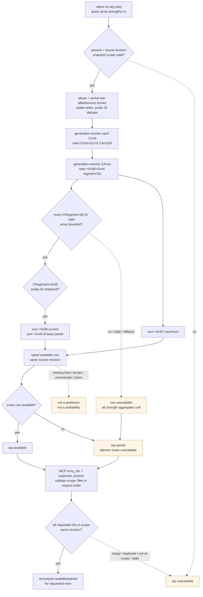

### `army-strength-v1` paused live acceptance（revision 4）

- [live-confirmed] MCP `ck3_query_army_strengths` 在 paused snapshot revision `4` 成功查询 public ArmyIDs
  `[83886341,33554657,357]`。玩家 `83886341` 返回 current/max `1482/2243`、regiment count `38`、
  `ai_base_power_raw=5522300000`、scale `100000`，即诊断显示量 `55,223`。
- [live-confirmed] active-war enemies：`33554657` 返回 `1011/1011` soldiers、`22` regiments、base power
  `31,600`；`357` 返回 `1801/3751` soldiers、`23` regiments、base power `58,468`。敌军合计 current/max
  `2812/4762`、base power `90,068`。
- [inference] 仅把 live base-power raw 代入已静态闭合的**简化诊断**，玩家对敌军合计的 raw share 是
  `55223/(55223+90068)=0.38009`；若只施加 predictor 中已证的 enemy lane `×1.1`，则为 `0.35790`。
  分别对 `357` 是 `0.48573` / `0.46198`，对 `33554657` 是约 `0.6360` / `0.6136`。这些计算没有构造合法
  `CAISubunitStack`、relation lanes、terrain/commander/MAA encounter context，因此只能标
  `base-power diagnostic share`，**不是** exact predictor return，更不是 win probability。
- [counter-policy] 此现场中敌军合计 current soldiers 是玩家约 `1.90×`，base power 是玩家约 `1.63×`；敌军
  `357` 单独的 base power 也略高于玩家。它是“不得轻易主动接战”的实际风险证据，但不能证明数学上必败。
  v2 paused live acceptance 现已完成，但 Monte Carlo transition/fixture gate 仍未闭合；策略继续 hold/避战/寻求会师，
  不得把任一 share 或 `input_observation_ready=true` 当成攻击阈值。

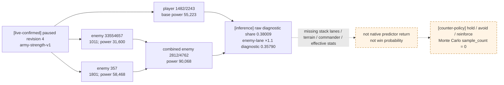

### 最小实现依赖与后续字段顺序

`army-strength-v1` 的 production Bindings、native DTO/JSON、driver/service/MCP、offline fixtures 与 paused 双方
snapshot live acceptance 已落地。后续回归仍需保持：同 revision 连续查询稳定、current/max 与原版
ArmyComposition 显示一致、base power 与 `0x19179E0` entry `+0x10` 一致、查询前后日期/RNG/army state 不变。

第二批按可施工依赖推进，而不是把缺口长期留成 `unknown`。本轮已把前两项中的**可独立读取部分**闭合；
crossing、最终 encounter 聚合与 effective stats 继续进入下一口：

1. terrain/入场边：`Province.GetTerrain` callback `0x220D940`、terrain key 与 width multiplier 已闭合；下一口沿
   origin→target adjacency resolver 闭合 river/large-river/strait、defender/holding 与 contact-time absolute width。
2. commander：`Army.GetCommander` core `0x2278F70` 与 `Character.GetCommanderAdvantage` canonical helper
   `0xBC5410(character,-1,false)` 已闭合；下一口继续闭合 battle-side commander、effective min/max roll、traits、
   knights 与完整 advantage contribution，不能用 generic points 冒充 encounter resolved advantage。
3. MAA/regiment detail：combat-side constructor 与 main-phase consumer 已把 canonical combat type 闭合为
   `*(CRegiment+0x18)`；原生 classifier、type key、`fights_in_main_phase` 与 live effective
   damage/toughness/pursuit/screen/counter aggregation 均已有 exact-build ABI。原版数据库只提供 base 数据，
   不能替代 encounter-context effective values。
4. 只有前三批、relation lane、合法 `CAISubunitStack`/player-stack 构造、mode/flags 和 paused worker 生命周期都
   闭合后，才施工 `query-native-combat-predictions`。不能用 CUnit/CArmy 指针伪造 `CAISubunitStack*`。

### `combat-simulation-inputs-v2` 已施工 ABI

这一版的目标不是提前返回一个假的概率，而是一次把**未接战时确实存在**的 composition/context 读出来，并把
只有 live `CCombat` 才存在的字段分开。以下地址均为本文 exact build 的 RVA：

| 输出域 | exact-build 入口 / layout | paused pre-contact 语义 |
|---|---|---|
| Province resolve | `game_state+0xA0 → game_data`；`game_data+0x140` pointer array、`+0x14C` count；以正 `province_id` 索引并回读 `CProvince+0x10` | 可从同 revision 的 current Province、route 与 enemy current Province 生成受限候选集；不需要已有战斗 |
| terrain object | reflection 名 `Province.GetTerrain` RVA `0x42F6418`；registration `0x492550`；callback thunk `0x2210FE0`；core `0x220D940(CProvince*) = [[province+0x20]+0xB8]` | 可读；null/不可读为该 Province unavailable |
| terrain key / width | `CTerrainType` RTTI `0x50CD9D8`、vtable `0x44088C0`；stable key string 在 `+0x18`；`0x2305749..0x2305758` 从 live combat Province 重走同一 terrain chain 并读取 `CTerrainType+0x58` | `+0x58` 是 signed qword CFixedPoint，scale `100000`；这是 terrain multiplier，不是绝对 combat width |
| combat regiment type | `CRegiment` RTTI `0x54A21A0`、ctor `0x23933F0`、serializer `0x2393510`；canonical live consumer `0x23091D7/0x2309253` 与 side builder `0x23C9242` 都取 `T=*(void**)(CRegiment+0x18)`；`T` validity 是 vtable slot `+0x00`，stable key 在 `T+0x18` | 对 MAA 发布 key；validity=false 并不单独等于 levy，必须走下一行的原生二条件 classifier |
| regiment kind | `bool 0x239CEB0(CRegiment*)`；`0x23C9242..0x23C9320` 先取 `type_valid=T->vcall[0]()`，再按 `!type_valid && !0x239CEB0(reg)` 插入 `CCombatSide+0x28`，其它插入 `+0x40` | `levy` 当且仅当两个条件都为 false；否则 `men_at_arms`。这是 pre-contact 可调用的同步只读 ABI；不存在第三个 CRegiment `knight` bucket |
| main-phase eligibility | `uint8 T+0xA0A`；`0x23091D7/0x2309253` 在两个 side bucket 上逐项读取；`0x2C8A375` 的 false 分支绑定 `MAA_DOES_NOT_FIGHT_IN_MAIN_PHASE` | `fights_in_main_phase = (byte != 0)`；对 levy 与 MAA 都读同一字段，不从数据库 key 猜默认值 |
| regiment strength | generation-safe CRegiment ID、public-ID initialized predicate 与 `+0x38/+0x3C`，见上节 | 每个 regiment current/max 可读；identity predicate 不等于 active/参战资格，这仍不是 effective damage/toughness |
| raised-army commander | reflection 名 `Army.GetCommander` RVA `0x42FAA18`；registration `0x49CB70`；core `0x2278F70(CArmy*)` 读 `CArmy+0x120` full CharacterID，经 `base+0x570C130` storage 解析并回读 `CCharacter+0x18` | `-1`/canonical null 为 `absent`；非空却 generation/fallback 失配为 `unavailable`；不得返回 engine fallback character |
| generic commander advantage | reflection 名 `Character.GetCommanderAdvantage` RVA `0x40CFDA8`；callback `0xBE01E0` 固定调用 `int32 0xBC5410(CCharacter*,-1,false)` | 可读 int32 advantage points，但仅是 canonical generic character contribution；不是 terrain/crossing/roll 合成后的 encounter advantage |
| encounter-effective regiment stats | `Stats38* 0x239CAE0(CRegiment*,Stats38* out,CProvince* encounter)`；`Stats38 +0x18/+0x20/+0x28/+0x30` | 可在 paused、尚无 CCombat 时把显式 target Province 作为 encounter 参数，得到 damage/toughness/pursuit/screen；详见下节 |
| MAA counter operands/result | `0x23D2B90` current chunk；inner regiment type `+0x270/+0x2B8/+0x2C4`；`0x2946B50` owner counter modifier；`0x23CF1B0` 双 side wrapper | 对显式固定 participant set 可构造只读 synthetic side entries，并输出 per-counter-class damage-retention multiplier；不需要 live CCombat |
| ongoing combat context | `CArmy+0x128` full CCombatID、storage `base+0x570C758`、回读 `CCombat+0x08`；encounter Province `+0x6B8`；phase/day `+0x6B0/+0x6B4`；base/final width `+0x6C0/+0x6C4`；rolls `+0x6D0/+0x6D4`；base/resolved advantage `+0x6C8/+0x710` | **只有 generation-valid CCombat 存在时**发布；未接战时整个 block 为 `null`，不能把上述字段填零 |

`0x2305580..0x2305824` 进一步互证 terrain width 的 scale：它先计算并保存 `CCombat+0x6C0` base width，
再把该值乘 `CTerrainType+0x58`，clamp 到 `MINIMUM_COMBAT_WIDTH` 后写 `+0x6C4`。因此 pre-contact 能发布
terrain multiplier，却不能仅凭它发布 final width；后者还依赖 participant fighting totals 与 contact-time
构造/历史状态。

### `combat-simulation-inputs-v2` paused live acceptance（revision 4）

[live-confirmed] production MCP 已在同一暂停现场执行五个互不复用 participant set/role 的 v2 query。source date raw
为 `53175816`，snapshot native sequence 为 `3`，revision 为 `4`；五次都返回
`status=available`、`input_observation_ready=true`、terrain `hills`、terrain width multiplier `80000`
（Q100000，即 `0.8`）与 crossing `none`。defensive 组使用 target `2596`、attacker entry `2597`，敌军 attacker、
玩家 army `83886341` defender；offensive 组使用 target `2581`、player entry `2587`，玩家 attacker、敌军 defender：

| scenario | target / entry | attacker army IDs | defender army IDs | observed result |
|---|---:|---|---|---|
| enemy `357` attacks player | `2596 / 2597` | `[357]` | `[83886341]` | available；player defender；`holding=false` |
| enemy `33554657` attacks player | `2596 / 2597` | `[33554657]` | `[83886341]` | available；独立 composition/counter/commander/knight context；`holding=false` |
| combined enemies attack player | `2596 / 2597` | `[357,33554657]` | `[83886341]` | available；request-order mixed-owner attacker；base width `2147`、final width `1717`；`holding=false` |
| player attacks enemy `357` | `2581 / 2587` | `[83886341]` | `[357]` | available；enemy defender；`holding=true`；final width `1312` |
| player attacks combined enemies | `2581 / 2587` | `[83886341]` | `[357,33554657]` | available；request-order mixed-owner defender；`holding=true`；final width `1717` |

同一组 response 中的军队级交叉检查为：

| ArmyID | current / max | main-phase soldiers | generic commander advantage | roll bounds | knights / total prowess |
|---:|---:|---:|---:|---:|---:|
| player `83886341` | `1482 / 2243` | `1472` | `35` | `0..10` | `12 / 85` |
| enemy `357` | `1801 / 3751` | `1783` | `14` | `0..10` | `6 / 64` |
| enemy `33554657` | `1011 / 1011` | `1001` | `28` | `0..10` | `7 / 72` |

`source.game_version` 在这批 response 中是 `null`，原因是 hello payload 没有发送这两个可选 source key；bridge
已经用 hello 的 exact-build identity 完成严格匹配，这个可选展示字段缺失不使验收降级，也不得被解释成未绑定
版本。前三个 defensive 原始全量 response 保留在 driver history 的 query sequence `1..3`，offensive responses
也保留在同一 driver history；上表只摘录可人工复核的边界，不能
代替原始 regiment/effective/counter rows。

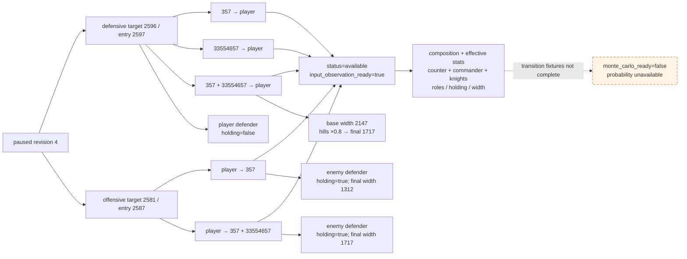

这次验收关闭的是“能否在未接战 paused 状态取得单敌/合流敌军、攻守两个方向的真实原生输入”，不是“已经
计算出胜率”。尤其是 live response 已证明主动攻击 `2581` 时敌 defender 获得 `holding=true`，而敌攻玩家
`2596` 时玩家 defender 的 holding 为 false；主动开战决策必须把这项额外敌方防御条件带入 simulator，不能只
交换 participant IDs 后复用防守结果。
三种 participant set 必须继续作为三份 canonical experiment input；不能拿单敌结果补齐合流场景，也不能把
`input_observation_ready=true` 改写成 `monte_carlo_ready=true`。

### v3：开战时 advantage constructor source trace

[static-confirmed] v2 发布的 `generic_advantage_points` 不是接战时的 resolved advantage。v3 必须在同一个
explicit hypothetical contact 中发布原版实际选择的 supply、holding、recently-disembarked、debt、faith、
adjacency 与 terrain effect，并保留原版的**跨 side 调用顺序**。本节只绑定页首 exact build；尚未完成
production fixture 与 paused live acceptance 前，不能把它写成 `[live-confirmed]`。

原版 contact builder 的顺序由 `0x220999D..0x2209BDF` 和 `0x2304830..0x23049B1` 闭合为：

1. `0x2305580` 初始化 width；
2. adjacency attacker、adjacency defender、terrain attacker、terrain defender，四次候选 append 的 call site
   依次为 `0x2209A82`、`0x2209B46`、`0x2209B75`、`0x2209BA7`；river 的 defender 候选仍先执行已经闭合的
   `no_water_crossing_penalty` 检查；
3. `0x23CBCE0` 依次刷新 side0、side1；
4. `0x2304830(CCombat*)` 内严格执行 supply side0、supply side1、holding defender、recently-disembarked
   side0、side1、debt side0（owner 后 optional treasury）、debt side1（同序）、unreformed-faith side0、side1；
5. `0x23CC2B0` 依次用 target Province 刷新两侧 terrain operands。它影响后续动态 side contribution，不能
   被误记成新的 `CCombatEffect` append。

所有 constructor effect 共用以下 mutating helper；query **只镜像它的数学与顺序，不得调用它**：

```cpp
void append_combat_advantage_effect(       // RVA 0x23045F0
    CCombat* combat,                       // RCX
    const CCombatEffect* effect,           // RDX; signed points at +0x38
    int64_t scale_raw,                     // R8; Q100000
    int32_t side_index);                   // R9; 0 attacker, 1 defender
```

`scale_raw==0` 时 helper 完全 no-op；否则
`delta_raw=fp_mul(int64(effect->advantage_points)*100000,scale_raw)`，attacker 加、defender 减，并在**每次来源后**
把 `CCombat+0x6C8` clamp 到 `[-10000000,+10000000]`，即 `[-100,+100]`。随后它把
`{effect*,scale_raw}` 以 16-byte stride append 到 attacker `CCombat+0x98/count+0xA4` 或 defender
`CCombat+0x3E0/count+0x3EC`，再调用 `0x23053B0` 刷新 damage multiplier。`fp_mul` 沿用原生
CFixedPoint 的逐次向零截断与 overflow-aware slow path；不能先把多项 points 求和再乘 scale，也不能只在末尾 clamp。

`CombatRuleDatabase* 0x88E320()` 返回本轮 loaded combat-effect database。v3 必须读 live object 的
`int32 +0x38`，不能把 stock 文本值硬编码成当前 playset 真值。已闭合 selector 如下：

| stage | exact selector / operand | 原版 source key / 边界 |
|---|---|---|
| adjacency | database `+0xF88[kind]` attacker、`+0xFB8[kind]` defender | kind 来自显式 entry→target；原生数组次序与 side 次序见上文 crossing 契约 |
| terrain | `CTerrainType+0x40` attacker effect、`+0x48` defender effect | output key 用 `terrain:<terrain_key>:attacker|defender`；embedded effect 不得伪造数据库 stable key |
| supply | `const CCombatEffect* 0x23049E0(PdxArrayHeader<int32 full_CArmyID>* side_armies)`；header data `+0x00`、count `+0x0C` | 返回 database `+0xF38/+0xF48/+0xF58`，对应 `supply_state_supplied_advantage` / `running_low` / `starving` |
| holding | 已闭合的 `0x2900BB0(first_defender_owner,target)`，再镜像 `0x2304D10` 的 dynamic scale | database `+0xF28`，`holding_defender_advantage`；只对 defender，effect points 是 multiplier，实际 points 取决于 scale |
| recently disembarked | 每侧仅取 request/insertion order 第一 CArmy；原生 predicate 是 `int32 CArmy+0x5C != 0` | database `+0xF18`，`recently_disembarked_advantage`；`+0x5C` 只发布 raw 与 bool，不猜“剩余天数” |
| owner debt | 第一 CArmy→`CArmy+0x124` CUnit→`CUnit+0x174` owner；`int32 0x28DBB70(CCharacter*,0)` | pointer array `db+0xFE8`、count `+0xFF4`；`0<=i<count` 为 `combat_debt_level_i`，`i==count` 为 `db+0xF78 combat_debt_level_no_income`，其它值 fail closed |
| treasury debt | `0x23050D4..0x230516B` 的 owner/live-realm/treasury-valid 且 treasury raw `+0x440<0` gate 后，`0x28DBB70(owner,3)` | pointer array `db+0x1090`、count `+0x109C`；index 与 no-income 规则同上；资格链任一对象或 generation 不可读时不能悄悄省略该来源 |
| unreformed faith | `0x2305290` 的每侧第一军 owner-faith 与 target Province holding-faith equality predicate | database `+0xF68`，`unreformed_faith_province`；query 镜像 predicate，不能调用最终会进入 `0x23045F0` 的 wrapper |

`0x23049E0` 对每军读取 `CArmy+0x180` Q100000 supply operand，向零除以 `100000` 后走 loaded threshold
array；权重不是“军队数”，而是该 helper 自己筛出的 current soldiers。令 `S` 为 supplied 权重、`R` 为
running-low 权重、`T` 为总权重，则 `T<=0` 或 `S>fp_mul(T,50000)` 选 supplied；否则
`S+R>fp_mul(T,50000)` 选 running-low；其余选 starving。两个比较均为严格 `>`，恰好 50% 必须落到更差状态。
supplied 的 stock points 为 `0`，caller 因检查 `effect+0x38!=0` 不 append；v3 仍要保留一行
`selected=true, applied=false, skip_reason=zero_effect_not_appended`，否则无法区分“已证 supplied”与“没读到 supply”。

stock `00_combat_effects.txt` 的 owner/treasury tiers 实际是
`-5,-10,-15,-20,-25,-30,-40,-50,-75,-100`，no-income 是 `-100`；文档和代码不得截成“只到 -40”。
这些值只作为 text-side fixture，wire 上仍以 loaded effect `+0x38` 为权威。

#### dynamic advantage 的无注册临时上下文 ABI

[static-confirmed] pre-contact 不需要伪造 generation-valid `CCombatID`。完整 `CCombat` constructor
`0x2303CF0` 会取得 debug component ID、连接 Province battle manager 并进入真实 combat registry 路径，query **禁止
调用**。但以下被裁剪的 caller-owned shell 已闭合为只写临时内存、只读世界对象的调用闭包：

| 层 | exact-build ABI / layout | query 约束 |
|---|---|---|
| shell | caller-owned、先清零的 `0x718` bytes；attacker side=`shell+0x20`，defender side=`shell+0x368`，每侧 `0x348` bytes | `shell+0x08=-1`；不注册、不取得 CombatID，不把 shell 指针交给任何异步或 storage resolver |
| side constructor | `CCombatSide* 0x23C7D30(CCombatSide* RCX, CCombat* parent RDX)` | 调用前先读 exact global byte RVA `0x4F3CF81`；非零会使 constructor 分配 debug ID，因此本口必须整体 unavailable，不能继续调用 |
| local population context | 每侧另有 caller-owned zeroed auxiliary object；`+0x38` 是 `Entry50` vector header，`+0x48` allocator 取该侧已初始化的 `CCombatSide+0x50` allocator；`CCombatSide+0xC8=&local_ctx` | `Entry50` stride `0x50`；buffer 仅由本 query 的 allocator 分配，结束时经同一 allocator `vtable+0x10(...,buffer,8)` 释放；不得借用 Province battle-manager object |
| side population | `void 0x23C9100(CCombatSide* RCX, CArmy* RDX)` | 只按 request order 逐军调用这个 direct helper；禁止调用会写 `CUnit+0x168` 的 `0x23043F0/0x23044F0` live-join wrappers |
| target flags | `shell+0x6B8=target`；`shell+0x6FD=0xBC24E0(target)`；`shell+0x6FC=1`；`shell+0x6D0/+0x6D4=0` | `+0x6D0/+0x6D4` 是两侧 roll points，不是 Q100000；query 固定零，Monte Carlo 在进程外按已发布 bounds 抽样 |
| battle commander selector | `CCharacter* 0x23C8A60(CCombatSide* RCX)`；返回对象的 full CharacterID 在 `+0x18` | 原 builder `0x220994D/0x2209973` 对两侧各调用一次并写 `CCombatSide+0x74`；helper 从 `side+0x10` ArmyID 顺序逐军取 `CArmy+0x120` commander，并用 `0x2307680` 的 encounter contribution 选择，不能简化成首军 commander |
| gathering flag | 每侧 request/insertion order 第一军的 `int32 CArmy+0x1D0 > 0` 写 `CCombatSide+0x340` | 这是 `0x2303F52..0x2304002` 的真实 constructor 语义；与 `CArmy+0x5C` recently-disembarked 完全不同 |
| resolved total | `void 0x2308D50(CCombat*)` | 只刷新两个 local side aggregator/terrain operand，调用两次 `0x2307CB0` 并写 local `shell+0x710`；已闭合闭包不读 CombatID、不抽 RNG、不写 world |
| side dynamic | `int64* 0x2307CB0(CCombat* RCX, int64* out RDX, int32 side R8D, Breakdown* optional R9)` | `side=0/1`；`optional=nullptr`，同步返回 caller-owned `out`；原式从该侧 roll 开始，再加 target conditional、commander 与 side aggregator |
| commander component | `int64* 0x2307680(CCombat*,int64* out,CCharacter*,int32 side,int32 relation_kind,Breakdown*)` | 后两个参数是 Win64 stack args；`relation_kind=0x2307080(shell,side)`，`Breakdown*=nullptr` |
| side component | `int64* 0x2307230(CCombat*,int64* out,ModifierAggregator*,int32 side,int32 relation_kind,Breakdown*)` | aggregator 是 `CCombatSide+0x110`；同样只允许 null breakdown |
| destructor | `void 0x2303B00(CCombatSide*)` | reverse construction order 析构所有成功构造的 local side；随后释放 auxiliary `Entry50` buffer。每个 failure edge 都必须走 constructed-mask cleanup |

原版 commander selection 发生在 static advantage ledger 与 holding flag 建成**之前**。因此 wrapper 必须先保持
`shell+0x6C8=0`、两侧 effect ledger 为空、`shell+0x6FE=0`，写 target、`+0x6FD` 与 gathering 后调用
`0x23C8A60`；随后才按上一节顺序镜像 static source、设置 holding，并把每条实际 append 的
`{CCombatEffect*,scale_raw}` 写入对应 side `+0x78/count+0x84` 的 local 16-byte ledger。这样既复现 selector 的
原始时点，又让 `0x2306E10` 在最终 dynamic evaluation 中读到原版相同的 source flags `effect+0x80/+0x81`。
`0x23045F0` 不必调用：base accumulator、逐来源 clamp 和 local ledger 都由 query 镜像；任何 real combat 或
Province battle-manager 对象都不被修改。

最终调用 `0x2308D50(shell)`，并用下列独立 component calls 做同次一致性断言：

```text
side_total_raw = 0x2307CB0(shell, side)
commander_raw  = 0x2307680(shell, selected_commander, side, relation_kind, null)
side_mod_raw   = 0x2307230(shell, side+0x110, side, relation_kind, null)
target_conditionals_residual_raw =
    checked_sub(side_total_raw, roll_raw, commander_raw, side_mod_raw)

resolved_advantage_at_zero_roll_raw =
    base_static_accumulator_raw + attacker.side_total_raw - defender.side_total_raw
```

`target_conditionals_residual_raw` 是对 exact total 的可核验算术分解，不冒充单个原生 helper。所有加减都做
checked `int64`；`shell+0x710` 必须等于最后一式，否则整份 `advantage_model` unavailable。上述 call graph 只允许
同步、paused、same-revision 使用；不得缓存任何 `CCharacter*`、`CArmy*`、effect pointer 或 local shell 地址。

v3 production capability 已冻结并广告为 `game.command.query-combat-simulation-inputs-v3-N`，literal step 保持 v2 的显式
scenario 语法，仅替换版本：
`query-combat-simulation-inputs-v3-<target>-<attacker_entry>-a-<Acount>-<A...>-d-<Dcount>-<D...>`。
paused、same revision、full-generation、opposite-coalition、1..64 distinct total ArmyIDs 与 request-order
条件语义全部继承 v2；MCP 仍显式传 target、entry、A/D arrays 与 `expected_revision`。capability 模板本身
不得进入 `action_steps`；Hybrid 对该 prefix 只走 native，能力缺失或 literal 非 canonical 时直接拒绝，禁止转交
data/visual fallback 或 `life-advance`。production payload 固定为
`schema_version=3`、`contract_stage=production_exact_132_refs`；81/51/132/0 coverage 与三组 path-set SHA
逐字冻结在 serializer 和 strict Python contract 中。输出新增：

```json
{
  "advantage_model": {
    "status": "available",
    "scale": 100000,
    "scenario_policy": "explicit_hypothetical_fixed_at_contact_no_reinforcements",
    "side_inputs": [
      {
        "side": "attacker",
        "primary_army_id": 83886341,
        "supply": {
          "selected_key": "supply_state_running_low_advantage",
          "selected_effect_points": -10
        },
        "primary_army_recently_disembarked_raw": 0,
        "owner_character_id": 1,
        "owner_debt_selector_raw": 0,
        "treasury_debt_selector_raw": null
      }
    ],
    "constructor_sources": [
      {
        "stage_order": 0,
        "append_order": 0,
        "stage": "defender_adjacency",
        "side": "defender",
        "source_key": "defender_river",
        "effect_advantage_points": 10,
        "scale_raw": 100000,
        "signed_contribution_raw": -1000000,
        "accumulator_before_raw": 0,
        "accumulator_after_raw": -1000000,
        "selected": true,
        "applied": true,
        "skip_reason": null
      }
    ],
    "base_static_accumulator_raw": -1000000,
    "resolved_dynamic": {
      "status": "available",
      "helper_status": "original_helpers_matched",
      "context_mode": "temporary_unregistered_local_context",
      "roll_policy": "zero_in_query_sampled_offline",
      "sides": [
        {
          "side": "attacker",
          "battle_commander_character_id": 1001,
          "battle_commander_selected": true,
          "battle_commander_selection": "native_0x23C8A60",
          "primary_army_gathering_raw": 0,
          "gathering": false,
          "relation_kind_raw": 0,
          "roll_points": 0,
          "roll_raw": 0,
          "target_conditionals_residual_raw": 0,
          "commander_dynamic_raw": 3500000,
          "side_dynamic_raw": 0,
          "side_total_raw": 3500000,
          "contribution_to_resolved_raw": 3500000
        },
        {
          "side": "defender",
          "battle_commander_character_id": null,
          "battle_commander_selected": false,
          "battle_commander_selection": "native_0x23C8A60",
          "primary_army_gathering_raw": 0,
          "gathering": false,
          "relation_kind_raw": 0,
          "roll_points": 0,
          "roll_raw": 0,
          "target_conditionals_residual_raw": 0,
          "commander_dynamic_raw": 0,
          "side_dynamic_raw": 0,
          "side_total_raw": 0,
          "contribution_to_resolved_raw": 0
        }
      ],
      "side_0_dynamic_raw": 3500000,
      "side_1_dynamic_raw": 0,
      "resolved_advantage_at_zero_roll_raw": 2500000,
      "original_total_helper_raw": 2500000,
      "original_total_helper_match": true
    }
  }
}
```

`constructor_sources` 是一条全局 ordered ledger，不能只按 side 分组后丢掉原生交错顺序；未命中的固定 stage
也保留 `selected=false/applied=false` 行，`append_order=null`。任一 effect object、primary-army owner、treasury
eligibility、selector index、fixed-point overflow 或 source ordering 无法验证，整个 `advantage_model` unavailable，
并使 v3 `phase_event_inputs_ready=false`；已成功的 v2 `base_inputs` 仍原子返回供诊断，但 planner 不得使用半套
phase/advantage 数据。

resolved advantage 的原生公式由 `0x2308D50` 闭合为
`CCombat+0x710 = CCombat+0x6C8 + 0x2307CB0(side0) - 0x2307CB0(side1)`；上面的 temporary-context
contract 已经关闭“必须有真实 CombatID”这一错误前提。production reader、source scanner、完整 named-key fixture、
original-helper equality gate 与正式 serializer 已闭合并开始广告；任一帧无法满足这些门时只返回原子的
`phase_event_inputs.status=unavailable`，绝不返回 `resolved_dynamic=null` 冒充成功。paused live equality 仍待验收。
即使该观测返回 available，零 roll 结果也只是 Monte Carlo 的确定性初始输入；phase-event、
casualty/pursuit 与 battle-end transition gate 仍使 `monte_carlo_ready=false`。

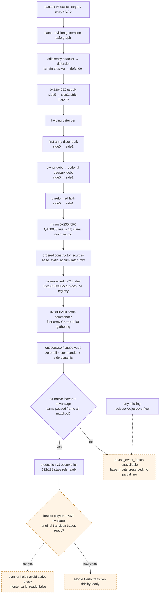

### Regiment kind 与主阶段资格 exact ABI

[static-confirmed] 这条 ABI 来自原生 combat-side population，而不是由 `maa_type_key`、兵数或 `+0x118`
空值反推：

```text
T = *(void**)(regiment + 0x18)
type_valid = (*(bool (__fastcall **)(void*))(*(void**)T))[0](T)
special_maa_like = ((bool (__fastcall *)(CRegiment*))base+0x239CEB0)(regiment)

kind = "levy"        if !type_valid && !special_maa_like
     = "men_at_arms" otherwise

fights_in_main_phase = *(uint8_t*)(T + 0xA0A) != 0
```

- `0x23C9100(CCombatSide* side, CArmy* army)` 遍历 `CArmy+0x38/+0x44` 的原始 CRegimentID
  顺序。`0x23C9242..0x23C92E3` 对 levy 分支插入 `side+0x28/count+0x34`；
  `0x23C92EC..0x23C9325` 对其它分支插入 `side+0x40/count+0x4C`。两个数组的 entry stride 都是
  `0x60`。因此 classifier 的 receiver、方向和结果 bucket 均由 live constructor 互证。
- `0x239CEB0(CRegiment*)` 是同步 bool helper；它检查 `CRegiment+0x148` 的 generation-bearing
  CharacterID 所指对象的原生资格 predicate。native query 应直接复用 helper，不能把 `+0x148 != -1`
  自己简化成等价条件。
- `0x23091D7` 与 `0x2309253` 在 main-phase resolution 对 levy/MAA 两个 entry array 执行相同的
  `T+0xA0A` 读取。flag 为 `0` 时原生把 entry `starting +0x10` 路由到 `soft +0x20`；非零时把
  `current +0x18` 路由。UI consumer `0x2C8A375` 的零分支发出
  `MAA_DOES_NOT_FIGHT_IN_MAIN_PHASE`，固定了字段命名而不只是偏移。
- `0x2C84B10` 的 `CMenAtArmsType` constructor 把 `dword +0xA08` 初始化为 `0x01010000`；小端下
  `+0xA0A=1`，即默认参战。query 仍必须读取 live type，不得硬编码默认值。
- `(CRegiment+0x08)->vtable[1]` 的 exact target `0x10495A0` 只执行
  `CRegiment+0x10 != -1`。它是 identity-initialized predicate，不是 active/current/main-phase
  predicate；schema 若保留旧字段名 `active`，必须迁移为 `identity_valid`，否则会误导模拟器。
- CRegiment 的分类域只有 `levy|men_at_arms`。knight 是 `CRegiment+0x148` 指向的 Character participant，
  由本文后面的独立 `knights.members[]` 发布；不得给同一 CRegiment 再造 `kind=knight`。

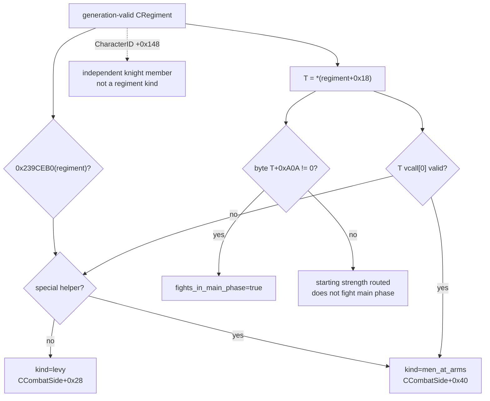

最小 frozen fixture 必须有三行：`type_valid=false/special=false → levy`；
`type_valid=true/special=false → men_at_arms`；`type_valid=false/special=true → men_at_arms`。
每行再分别覆盖 `+0xA0A=0/1`，并断言 `identity_valid` 只随 `CRegiment+0x10==-1` 改变，不能替代
kind 或主阶段资格。

### Participant join / ETA：dynamic forecast 的下一条独立观测口

[static-confirmed] participant 的**实际加入**入口已定位，但抵达 ETA 仍未闭合。它不阻塞 v2 明确声明的
`explicit_hypothetical_fixed_at_contact_no_reinforcements` 条件情景，也不得被误解为 v2 已预测真实路线增援：

- `void 0x23040A0(CCombat* RCX, CArmy* RDX)` 是现有战斗加入军队的 central dispatcher；direct caller
  只有 `0x2208641`。caller 在 Province/contact tick 中扫描候选 CCombat，完成 full-generation CCombatID 与
  incoming `CUnit+0x178 → CArmy` 解析后调用它。
- `0x23040A0` 以 relation helper `0x2900470` 对 incoming owner 和两侧 representative owner 做方向判定；
  defender 分支调用 `0x23044F0(CCombat*,CArmy*)`，attacker 分支调用
  `0x23043F0(CCombat*,CArmy*)`。两个 wrapper 分别把 `CCombatSide*` 设为
  `combat+0x368` / `combat+0x20`，随后共同调用 `0x23C9100(side,army)`；所以前述 regiment
  bucket 与加入 participant 使用的是同一 canonical constructor。
- 加入后原生写 `CArmy+0x128 = CCombat+0x08`，重算两侧 `0x23CB840` fighting totals；若当前 phase
  为 pursuit (`CCombat+0x6B0==2`)，它把 phase 重开为 main 并清 `winner +0x6E0=-1`。已有 base width 时还会
  调 `0x2305580` 走原生 width history/update。这些都是 join transition，不能在 paused query 中调用。
- dynamic route-timeline port 的下一 RE 队列固定从 `0x220842F..0x2208646` 向上追 contact tick 的 CUnit 候选数组、route
  arrival date 与同日迭代顺序，再以 `0x23040A0` 为 golden transition endpoint。仅知道军队当前 route 或直线距离
  不能填 `participant_join_eta`。

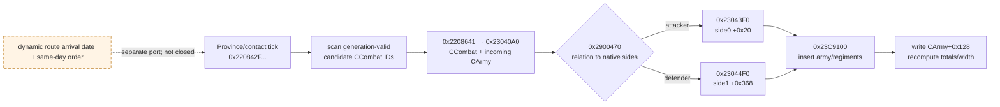

### Encounter-effective regiment stats 与 counter exact ABI

本节给出 native 可以直接施工的同步、只读调用边界。地址只绑定页首 exact build；所有指针必须在同一 paused
snapshot 内 generation/preflight 验证，helper 返回后不得保留任何 CK3 object pointer。

| 层 | exact-build ABI / layout | 闭合语义 |
|---|---|---|
| effective evaluator | `Stats38* 0x239CAE0(CRegiment* RCX, Stats38* out RDX, CProvince* encounter R8)` | caller-owned `out`，同步返回同一指针；显式 target Province 可在 pre-contact 调用。它走原版 regiment subtype、owner/stationing 与 Province 条件聚合，不是 base type 表 |
| `Stats38` | `+0x00` vptr；`+0x08` int32 max；`+0x10` int64 siege；`+0x18` damage；`+0x20` toughness；`+0x28` pursuit；`+0x30` screen | siege 与四维均为 signed Q100000；`max` 是 int32、无定点 scale。parser `0x23C2D60` 的 identifier 分别闭合为 `max/siege_value/damage/toughness/pursuit/screen` |
| live-side materializer | `0x23D2CE0(SideMaaEntry60*, CProvince*)` | generation-resolve entry `+0x08` 的 full CRegimentID，调用 `0x239CAE0`，把 `Stats38 +0x08/+0x10/+0x18/+0x20/+0x28/+0x30` 复制到 entry `+0x30/+0x38/+0x40/+0x48/+0x50/+0x58` |
| synthetic counter entry | stride `0x60`；`+0x08` full CRegimentID；`+0x18` current soldiers Q100000 | `0x23CF1B0` 及其被调 helper 对 synthetic pre-contact row 只读取这两个字段；remaining bytes 可清零，但 ID 对应 live regiment 必须仍 generation-valid |
| current chunk | `int64* 0x23D2B90(SideMaaEntry60*, int64* out)` | 以 entry current 除以 `(*(void**)(CRegiment+0x18))+0x68` 的 stack size，返回 full-regiment-equivalent chunk Q100000；stack size 为零时返回 `-1`，不得改写成零 |
| counter class / targets | inner regiment type `T=*(void**)(CRegiment+0x18)`；`T+0x270` signed class index；`T+0x2B8` data、`T+0x2C4` count、stride `0x10`，entry `+0x00` int32 target class、`+0x08` effectiveness Q100000 | 这是原版实际 counter operand；不能只从 `maa_type_key` 或 stock 文件另建一份可能漏 override 的表 |
| owner modifier set | pre-contact owner chain `CArmy+0x124` full CUnitID → `CUnit+0x174` full owner CharacterID；`0x26172C0(CCharacter*)` 返回 modifier set | 不能再把 `CArmy+0x120` 叫 owner；它是 commander。live `CCombatSide+0x70` 的构造路径同样写入由 CUnit `+0x174` 得到的 owner |
| counter context scale | `int64* 0x2946B50(int64* out, ModifierSet* countered, ModifierSet* countering)` | `max(0,1-resistance[0x107]) * (1+efficiency[0x106])`，Q100000；binary modifier metadata 把 `MOD_COMBAT_COUNTER_EFFICIENCY` / `RESISTANCE` 固定到 enum `0x106/0x107` |
| counter wrapper | `void 0x23CF1B0(PdxArrayHeader<Entry60>* countered RCX, ...* countering RDX, PdxArrayHeader<int64>* out_by_class R8, int64 context_scale R9)` | **RCX 是被克制侧，RDX 是实施克制侧**；先聚合 countering target pressure，再按 countered type class 输出 damage-retention multiplier |
| class count / defines | `*(int32*)(0x82DC40()+0xF14)`；`base+0x570F548`=`RATIO_FOR_MAX_COUNTER`；`base+0x570F550`=`MEN_AT_ARMS_MAX_COUNTER` | exact build 值分别为 class count、`200000` 与 `90000`；后两者均为 Q100000 |

`PdxArrayHeader` 的最小布局是 `+0x00 data`、`+0x08 int32 capacity`、`+0x0C int32 count`。direct wrapper
必须给 `out_by_class` 预分配 `class_count` 个 caller-owned int64，并把 capacity/count 都先置为 class count，避免进入
`0xAF4BF0` 的 engine resize/allocator 路径。两个输入按调用者显式 army 顺序、再按各 CArmy 原始 regiment 顺序
拼接；entry current 使用 checked `int64(current_soldiers) * 100000`。helper 是同步消费，不得把 synthetic header、
row 或 output buffer 地址缓存到下一 revision。

对 countered class `a`，逐指令闭合的 fixed-point 关系是：

```text
pressure[a] = sum_over_countering_entries_and_targets(
                  fixed_mul(fixed_mul(current_chunk, target_effectiveness),
                            max(0, context_scale)))
own_chunks[a] = sum_over_countered_entries_with_class_a(current_chunk)

retention[a] = 100000                                      if own_chunks[a] <= 0
             = 100000 - fixed_mul(
                   min(100000,
                       fixed_div(fixed_div(pressure[a], own_chunks[a]), 200000)),
                   90000)                                  otherwise
```

这里 `retention` 是 MAA damage retention，`100000` 表示未减伤，理论最低为 `10000`。`0x23CAE70` 随后按
countered regiment 的 `T+0x270` 取该数组元素并乘其 `entry+0x40` effective damage，互证它不是“克制概率”或
soldier multiplier。对一个固定 encounter 要调用两次：enemy counter player，以及 player counter enemy。

多军合并 side 的 v2 原子边界为：所有 selected ArmyID 必须在同一 active war 中由调用者显式分成 attacker 与
defender 两个相反 coalition。单 owner coalition 直接使用该 owner。mixed-owner side 的原生 primary-participant
规则已闭合：`0x23C9361..0x23C93E7` 令 `CCombatSide+0x70` 保留首个插入 CArmy 的 owner，holding 与 side-wide
counter context 都取该首军 owner。v2 是**条件假想场景**，所以两侧显式数组本身就是 synthetic CCombatSide insertion
order；`defender_insertion_order_policy=explicit_request_order_hypothetical`，不能把它冒充真实 arrival order。
因此“玩家单军 vs `33554657` + `357`”能够按调用者冻结的 defender request order 发布最终 defender multiplier，
而不是因 mixed owner 返回 null。若要预测实际自动接战，原版 builder 则按 target Province `+0x748/+0x754`
stored order 形成 opponents；真实 order 另需观测，不得拿 v2 request order 外推。

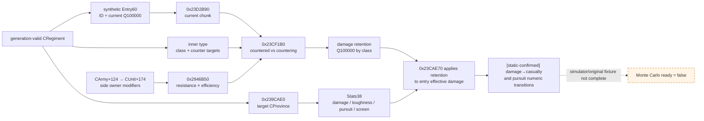

下列字段仍**没有**足够 ABI，必须显式 unavailable 并成为下一观测口：

| 字段 | v2 状态 | 下一 exact-build 入口 |
|---|---|---|
| `archetype/event subtype` | combat kind 已精确闭合为 `levy|men_at_arms`；更细数据库 archetype/event subtype 尚未独立发布 | 若模拟规则确实依赖更细 subtype，沿 `T+0x270/+0x2B8` 与 loaded type key manifest 增量补口；不得破坏已闭合的 combat bucket |
| mixed-owner side 的最终 counter multiplier | [live-confirmed] v2 exact ABI/adapter 与 mixed-owner combined scenario 已验收 | conditional side 按显式 ArmyID request order 的首军 owner，亦即 synthetic `CCombatSide+0x70`；真实接战则另按 target Province stored order，不得混为一谈 |
| knights | [live-confirmed] 五个场景均返回 identity/membership/effective rows | `0x19DD670` 的真实 list source 是 `CRegiment+0x148` full CharacterID；`0x23DB1C0` 只是 type/variant contribution ledger helper，不能枚举骑士 |
| effective commander roll bounds / battle commander | [live-confirmed] 五个场景均返回 `0..10` 与各军 commander contribution | `0x23CBFA0` 证明 modifier/terrain bounds 与 RNG 入口；paused query 只镜像 bounds，绝不调用该随机 helper |
| crossing / defender / holding | [live-confirmed] 五个场景均为 explicit edge kind `none`；defensive player holding=false、offensive enemy holding=true | conditional mixed-owner defender 按显式 request order 首军 owner调 `0x2900BB0`；实际接战顺序另记 |
| pre-contact absolute combat width | [live-confirmed] combined scenario 返回 base `2147`、hills final `1717` | active contact entries 的双方 Q100000 sums、`BASE_WIDTH_RATIO`、terrain multiplier 与两次向零截断均已闭合 |

### v2 native / MCP schema 与原子边界

capability 固定为 `game.command.query-combat-simulation-inputs-v2-N`；literal execute step 模板固定为
`query-combat-simulation-inputs-v2-<target>-<attacker_entry>-a-<Acount>-<A...>-d-<Dcount>-<D...>`。所有 token
必须是 canonical ASCII 正 int32；两侧 exact count 均为 `1..63`，合计不超过 `64`，target 不得等于 entry，且
所有 public full-generation ArmyID 跨两侧互异。旧 v1 literal 已 superseded，不接受无参别名、缺失 side partition、
前导零、全角数字、符号、空 token、count/list 不符、前导/尾随垃圾或超量列表。

MCP `ck3_query_combat_simulation_inputs(target_province_id,attacker_entry_province_id,attacker_army_ids,
defender_army_ids,expected_revision)` 把同一显式参数编码进 step。native 在该次 paused snapshot 内重新验证 revision、
允许 scope、两个 Province 与每个 CUnit/CArmy/CRegiment full generation；所有军队必须共享一个 active WarID，
且两数组必须是相反 coalition。当前 Province/route 只是可选观测，不参与假想场景 admission：攻击者条件性固定在
final-edge entry，防守者固定在 target；entry→target 必须存在唯一合法 adjacency。域外、重复、stale、跨 war、
同 coalition 分到两侧或 side 关系不唯一的请求整体拒绝，绝不能把任意 numeric ID 当作未经 scope 验证的 memory
probe。所有有效四维只对显式 target 求值，因此不存在“native 先返回一堆 Province，MCP 后换 target”的
revision/语义窗口。

production v2 wire 的权威完整 fixture 是
[`combat_simulation_inputs_v2_available.json`](../../ck3_autonomous_player/native_bridge/research/fixtures/combat_simulation_inputs_v2_available.json)。
其顶层与条件场景合同固定如下；`armies` 按 attackers 后 defenders 输出，两个数组内部都保留 request order：

```json
{
  "target_province_id": 20,
  "participant_policy": "explicit_hypothetical_fixed_at_contact_no_reinforcements",
  "scenario": {
    "kind": "explicit_hypothetical_contact",
    "attacker_entry_province_id": 10,
    "attacker_army_ids": [1],
    "defender_army_ids": [357, 33554657],
    "attacker_side": "player_or_allied",
    "defender_side": "enemy",
    "attacker_position_policy": "fixed_at_entry_hypothetical",
    "defender_position_policy": "fixed_at_target_hypothetical",
    "defender_insertion_order_policy": "explicit_request_order_hypothetical",
    "actual_route_dependency": false
  },
  "armies": [],
  "target_province": {},
  "ongoing_combats": [],
  "counter_resolutions": [],
  "completeness": {
    "observation_slice": "precontact-composition-context-v2",
    "input_observation_ready": true,
    "monte_carlo_ready": false
  }
}
```

下面的长例用于集中解释逐字段含义，是文档级展开图，不是可直接校验的 wire fixture；其中 `source` 与
`encounter` 是说明性 envelope，生产 parser 只接受上面链接的 v2 exact object：

```json
{
  "schema_version": 1,
  "status": "available",
  "source": {
    "game_version": "1.19.0.6",
    "executable_sha256": "2D00FF3101EF70B566F2FCBAE292F09263199C80E9DC8F139B82D7D96F83DB86",
    "snapshot_id": "native:N",
    "revision": 0,
    "date_raw": 0,
    "paused": true
  },
  "encounter": {
    "target_province_id": 20,
    "player_or_allied_army_ids": [1],
    "enemy_army_ids": [2],
    "participant_policy": "explicit_hypothetical_fixed_at_contact_no_reinforcements",
    "context_sha256": "sha256-of-canonical-source-and-encounter",
    "counter_resolutions": [
      {
        "status": "available",
        "countered_side": "player_or_ally",
        "countering_side": "enemy",
        "countered_modifier_owner_character_id": 7,
        "countering_modifier_owner_character_id": 8,
        "context_scale_raw": 100000,
        "class_count": 2,
        "damage_retention_by_class_raw": [100000, 55000],
        "scale": 100000,
        "unavailable_reason": null
      },
      {
        "status": "available",
        "countered_side": "enemy",
        "countering_side": "player_or_ally",
        "countered_modifier_owner_character_id": 8,
        "countering_modifier_owner_character_id": 7,
        "context_scale_raw": 100000,
        "class_count": 2,
        "damage_retention_by_class_raw": [100000, 100000],
        "scale": 100000,
        "unavailable_reason": null
      }
    ]
  },
  "armies": [
    {
      "status": "available",
      "army_id": 1,
      "native_carmy_id": 16777217,
      "scope_role": "player",
      "war_ids": [16777290],
      "current_province_id": 10,
      "owner": {
        "status": "available",
        "character_id": 7,
        "counter_efficiency_raw": 0,
        "counter_resistance_raw": 0,
        "scale": 100000,
        "unavailable_reason": null
      },
      "commander": {
        "status": "available",
        "character_id": 42,
        "generic_advantage_points": 3,
        "battle_context": {
          "status": "available",
          "source_target_province_id": 20,
          "effective_min_roll": 0,
          "effective_max_roll": 13,
          "unavailable_reason": null
        },
        "unavailable_reason": null
      },
      "regiments": [
        {
          "status": "available",
          "regiment_id": 16777230,
          "identity_valid": true,
          "current_soldiers": 400,
          "maximum_soldiers": 500,
          "maa_type": {
            "status": "available",
            "key": "bowmen"
          },
          "kind": { "status": "available", "value": "men_at_arms", "reason": null },
          "fights_in_main_phase": true,
          "effective_stats": {
            "status": "available",
            "source_target_province_id": 20,
            "max_size": 100,
            "siege_value_raw": 0,
            "damage_raw": 2500000,
            "toughness_raw": 1000000,
            "pursuit_raw": 500000,
            "screen_raw": 300000,
            "scale": 100000,
            "unavailable_reason": null
          },
          "counter": {
            "status": "available",
            "class_index": 1,
            "current_chunk_raw": 400000,
            "targets": [
              { "class_index": 0, "effectiveness_raw": 100000, "scale": 100000 }
            ],
            "scale": 100000,
            "unavailable_reason": null
          },
          "unavailable_reason": null
        }
      ],
      "knights": {
        "status": "available",
        "members": [
          {
            "eligible": true,
            "character_id": 42,
            "source_regiment_id": 16777230,
            "army_id": 16777217,
            "participant_army_membership_verified": true,
            "prowess": 12,
            "knight_effectiveness_raw": 100000,
            "effective_damage_raw": 60000000,
            "effective_toughness_raw": 12000000,
            "scale": 100000
          }
        ],
        "unavailable_reason": null
      },
      "unavailable_reason": null
    },
    {
      "status": "available",
      "army_id": 2,
      "native_carmy_id": 16777218,
      "scope_role": "active_war_enemy",
      "war_ids": [16777290],
      "current_province_id": 20,
      "owner": {
        "status": "available",
        "character_id": 8,
        "counter_efficiency_raw": 0,
        "counter_resistance_raw": 0,
        "scale": 100000,
        "unavailable_reason": null
      },
      "commander": {
        "status": "absent",
        "character_id": null,
        "generic_advantage_points": null,
        "battle_context": {
          "status": "available",
          "source_target_province_id": 20,
          "effective_min_roll": 0,
          "effective_max_roll": 0,
          "unavailable_reason": null
        },
        "unavailable_reason": null
      },
      "regiments": [
        {
          "status": "available",
          "regiment_id": 16777231,
          "identity_valid": true,
          "current_soldiers": 300,
          "maximum_soldiers": 300,
          "maa_type": { "status": "absent", "key": null },
          "kind": { "status": "available", "value": "levy", "reason": null },
          "fights_in_main_phase": true,
          "effective_stats": {
            "status": "available",
            "source_target_province_id": 20,
            "max_size": 100,
            "siege_value_raw": 0,
            "damage_raw": 1000000,
            "toughness_raw": 1000000,
            "pursuit_raw": 0,
            "screen_raw": 0,
            "scale": 100000,
            "unavailable_reason": null
          },
          "counter": {
            "status": "absent",
            "class_index": null,
            "current_chunk_raw": null,
            "targets": [],
            "scale": 100000,
            "unavailable_reason": null
          },
          "unavailable_reason": null
        }
      ],
      "knights": {
        "status": "available",
        "members": [],
        "unavailable_reason": null
      },
      "unavailable_reason": null
    }
  ],
  "target_province": {
      "status": "available",
      "province_id": 20,
      "terrain": {
        "status": "available",
        "key": "hills",
        "combat_width_multiplier_raw": 80000,
        "scale": 100000
      },
      "crossing": {
        "status": "available",
        "kind": "river",
        "unavailable_reason": null
      },
      "defender_context": {
        "status": "available",
        "defender_side": "enemy",
        "holding_defender": true,
        "unavailable_reason": null
      },
      "precontact_width": {
        "status": "available",
        "base": 350,
        "final": 280,
        "unavailable_reason": null
      },
      "unavailable_reason": null
  },
  "ongoing_combats": [],
  "completeness": {
    "observation_slice": "precontact-composition-context-v2",
    "input_observation_ready": true,
    "monte_carlo_ready": false,
    "missing_required_domains": [
      "damage_to_casualty_allocation",
      "pursuit_transition",
      "battle_end_and_retreat_transition",
      "phase_event_rng_and_effects"
    ]
  }
}
```

v2 `scenario` 不是由 native 猜测“附近所有军队”得出，而是 MCP 对调用者显式 attacker/defender arrays 做
same-war/same-revision 验证后的 canonical conditional scenario。因此当前现场至少是两个不同输入：

| scenario | `player_or_allied_army_ids` | `enemy_army_ids` | 诊断边界 |
|---|---|---|---|
| 玩家单独接触 `357` | `[83886341]` | `[357]` | live base-power raw share `0.48573`；enemy-lane `×1.1` 诊断 `0.46198` |
| 两敌合流后接触 | `[83886341]` | `[33554657,357]` | live base-power raw share `0.38009`；enemy-lane `×1.1` 诊断 `0.35790` |

两行不得复用同一个 cache key，也不得把单敌结果缓存后用于两敌合流。v2 的
`participant_policy=explicit_hypothetical_fixed_at_contact_no_reinforcements` 是一个**条件实验边界**：只回答
“显式 attackers 从给定 final-edge entry、显式 defenders 固定在 target，并按数组顺序插入，且实验期间不加入
其它军队”时会怎样。因此未选择的 `33554657` 不属于该输入，也不使
`input_observation_ready` 变成 false；调用者要比较合流风险，必须另发包含它的第二个 explicit request。

这不授权把单敌 conditional forecast 外推成真实动态战局的胜率。若问题变成“按当前路线，`33554657` 是否会在
战斗结束前赶到、哪一天插入”，就必须消费上一节单列的 route-timing/participant-join port，并按原生 same-day
order 做动态模拟；该口未闭合时只能并列报告单敌与两敌情景、或策略上采用两敌最坏情景，不能私自赋予到达概率。

若某个请求 army 已在战斗中，同一 response 可追加去重的 `ongoing_combats` row：

```json
{
  "status": "available",
  "combat_id": 16777299,
  "province_id": 20,
  "phase": 1,
  "phase_day": 4,
  "base_combat_width": 1200,
  "final_combat_width": 960,
  "side_0_roll": 7,
  "side_1_roll": 3,
  "base_advantage": 5,
  "resolved_advantage": 9,
  "orientation": "native_side_index_unmapped",
  "unavailable_reason": null
}
```

这些字段虽可读，side `0/1` 尚未映射 attacker/defender 或 player/enemy，完整 combat entries 也未发布；故这一
ongoing row 仍不能单独授权 resume Monte Carlo。没有 CCombat 时 `ongoing_combats=[]` 是合法空集合；不能生成一行
全零“未开始战斗”。

原子/失败规则：

1. [counter-policy] paused、revision、scope、显式 target Province 或同-war side partition 失败，顶层整体
   `unavailable`。一个 army
   的 CUnit/CArmy/CRegiment 图失效时，该 army row `unavailable`；若 CArmy 已 full-generation 验证，允许保留
   `native_carmy_id` identity，但 `regiments` 必须为 `null`，不得发布半截 composition。
2. [counter-policy] target Province 的 terrain chain/key/multiplier 任一失败时，该 `target_province` unavailable，
   terrain 三个值全部为 null。crossing/role/width 已有 exact-build 契约；entry→target edge 缺失/重复、kind 拒绝、
   side 不唯一或 mixed edge 必须按本页严格语义使对应 subdomain unavailable。mixed defender owner 合法；v2 holding
   必须按 `scenario.defender_army_ids` 的显式 request order 取首军 owner。数组/identity drift 才令 holding unavailable，
   target Province 当前驻军表既不是 v2 admission 条件，也不能偷偷重排 synthetic side。
3. [counter-policy] `CMenAtArmsType*` 为 null 或 validity=false 是合法 `maa_type.status=absent`；非空但对象/key
   不可读是 regiment row unavailable。empty key、零 multiplier、unavailable 三者不可互换。
4. [counter-policy] commander ID `-1` 是合法 `absent`；非负 ID generation 失配、storage/fallback 或 helper
   调用失败是 commander unavailable。generic advantage 合法为 `0`；未调用则必须为 null。
5. [counter-policy] `0x239CAE0` 任一输出对象、target identity 或 CRegiment identity 前后失配，使该 regiment
   row unavailable；不得退回 type base stats。counter class/target 越界、chunk sentinel `-1`、overflow 或
   modifier owner 失配，使对应 counter operand/resolution unavailable；合法零 stat、零 modifier 与 unknown 不可互换。
6. [counter-policy] 顶层 transport `status`、`completeness.input_observation_ready` 与
   `completeness.monte_carlo_ready` 是三套门：前两者 available/true 只说明 advertised v2 条件输入已原子读完，
   绝不代表 transition simulator 可运行。`explicit_hypothetical_fixed_at_contact_no_reinforcements` 本来就不承诺
   join ETA，因而 ETA 不进入 input-readiness gate。planner 只有在 Monte Carlo completeness 与 simulator/rules
   fixture gate 也通过时才可消费 probability；当前 frozen v2 的 `monte_carlo_ready` 必为 false、forecast
   `sample_count=0`。
7. [live-confirmed] capability 已在 exact-build object-graph/original-helper fixtures 后通过 paused live acceptance 并
   广告；五个 distinct participant/role contexts 均 available，且 date/revision、army route/combat state 保持冻结。后续回归还应
   增加同一 regiment 切换 target terrain 的 differential live vector，并持续比对 direct `0x23CF1B0` 与发布 counter
   vector；这属于 parity 加固，不撤销本次 production live acceptance。

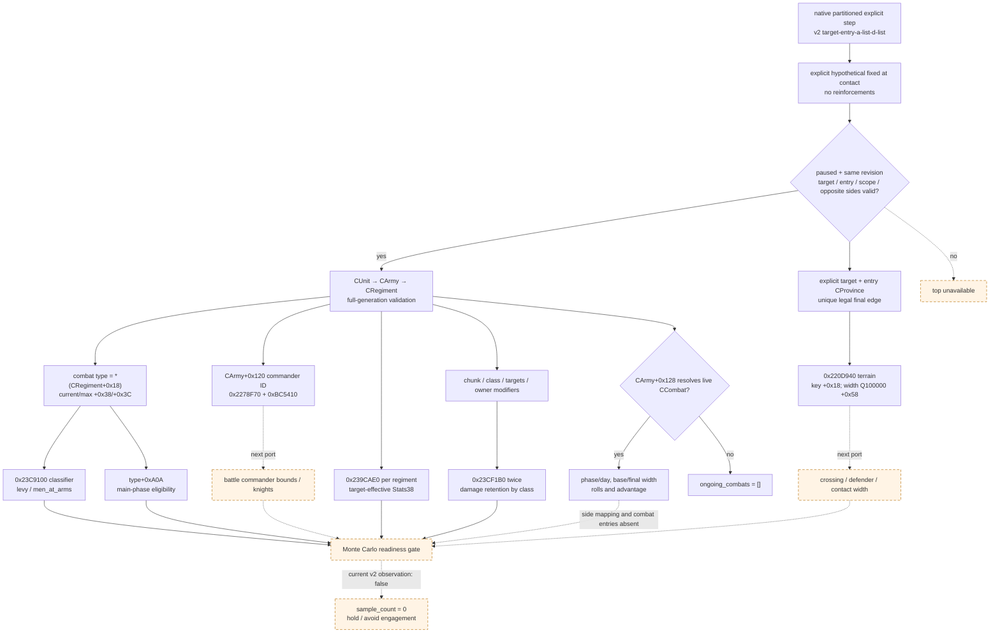

### 第一个有意义 Monte Carlo 的最小 gate 与 fixture

v2 字段的消费权限先固定如下，防止“已观测”被误写成“可直接抽样”：

| v2 字段 | 可以进入 Monte Carlo 的用途 | 当前只能作边界/诊断的部分 |
|---|---|---|
| explicit partitioned ArmyIDs、per-regiment current/max | 在 `explicit_hypothetical_fixed_at_contact_no_reinforcements` 条件下冻结单敌与两敌合流的不同初始 participant census | 不能外推为当前路线上的动态 join/leave/ETA；真实动态问题另需 route-timing port |
| `kind` / `fights_in_main_phase` / `maa_type_key` | 以原生 bucket 冻结 levy/MAA 与主阶段参战集合，并在 loaded-rules manifest 中选择对应 type 规则 | type base stat 不能替代 live effective four stats；key 缺失不能覆盖原生二条件 classifier |
| target-effective `Stats38` 四维 | 作为该 target Province 下的原生 damage/toughness/pursuit/screen 输入 | 它闭合输入，不闭合 damage→casualty transition；不能单独产生胜率 |
| chunk/class/targets 与双向 counter retention | 对 fixed side 调用原生 counter wrapper并修正 MAA damage；mixed owner 取该 side 显式 request order 首军 owner | v2 条件顺序不是实际 arrival/stored order；真实接战 parity 另需对应 order 观测 |
| terrain key、width multiplier | 作为 contact width 与 terrain modifier 的一个 exact operand | 没有 crossing/role/participant totals 时不能自行算 absolute width/advantage |
| commander CharacterID | 绑定后续 battle-side commander/traits/state | `generic_advantage_points` 只作一致性边界，不能当 effective roll 或 resolved advantage |
| live CCombat phase/day/width/roll/advantage | ongoing-resume 输入的 exact raw state | side mapping、entries/casualties 未闭合前仍不能独立恢复战斗 |
| army `ai_base_power_raw` / diagnostic share | 选择高风险 scenario、禁止漏掉合流敌军 | 永不进入 damage/casualty transition，也不填 `win_probability` |

第一项可以称为“有意义战斗抽样”的目标不是 bare-soldier 比例，而是
`fixed-contact-core-v2`：在显式“contact 后不增援”的实验政策下冻结双方 participant set；每个 regiment 有 reliable kind/type、current、
`fights_in_main_phase`、live effective damage/toughness/pursuit/screen 和 counter chunks；两侧有 battle commander
effective roll bounds、knights；encounter 有 terrain、crossing、defender/holding、base/final width；模拟器已有原生
damage→soft/hard casualty、pursuit 与 fixed-point golden trace。phase-event selector/schedule/核心 RNG 虽已闭合，
loaded effect 状态转移、AI retreat policy 与 battle-end/retreat simulator/original-trace fixture 未闭合时，它仍最多标
`bounded_core_only`，planner 不得用它授权主动攻击。

第一个 fixture 应是 `combat_input_precontact_fixed_contact`，分两层断言：

1. object-graph fixture 由独立 expected bytes 构造两支 army、至少一个 valid MAA type、一个 absent type、commander
   与 hills Province；断言 full-generation、type-key SSO/heap 两种布局、Q100000 terrain multiplier、null-object、
   unavailable-not-zero 和 stable ordering。
2. original-trace fixture `equal_levies_fixed_contact` 从原程序逐日 trace 提取同一 frozen encounter 的 width、roll、
   outgoing damage、soft/hard casualty 与 pursuit expected；再加 `mixed_maa_counter`、`river_defender` 和
   `knight_effectiveness` 只完成 input/original numeric gates；还必须通过 loaded phase-event effect 与
   battle-end/retreat fixtures 才能打开 `monte_carlo_ready=true`。expected 禁止由待测模拟器自生成。

即使本口成功返回 target-effective 四维与 counter，当前仍必须输出 `monte_carlo_ready=false`。v2 已能把
`input_observation_ready` 与 transition readiness 分开；当前四项 simulator ledger 同步为：

1. `damage_to_casualty_allocation` — **[static-confirmed] 原生公式与 golden trace 已闭合**：
   `0x23CE080..0x23CEA01 → 0x23DB230/0x23DB660/0x23CDF70 → 0x239C840`，包含 toughness division、
   soft/hard split、逐 entry frozen share、stored-order remainder 与 ledger。剩余是 simulator 实现和 exact fixture，
   不是再猜公式。
2. `pursuit_transition` — **[static-confirmed] 原生公式与 golden trace 已闭合**：
   `0x230A2A0..0x230A58A → 0x23CD2E0 → 0x23CC3D0/0x23CC5D0/0x23CC830/
   0x23CCA00 → 0x23CD660`，包含 winner/retreater 方向、四个 define、三日分摊、screen/floor、modifier 与余数；
   剩余同样是 simulator/fixture 落地。
3. `phase_event_rng_and_effects` — **[static-confirmed] selector/schedule/PRNG 与 stock candidate 顶层 transition
   table 已闭合；loaded evaluator/original trace 未闭合**：`0x2E1C570` weighted selector、`0x23C8750` 五日排程、
   `0x23C9900` effect ordinal seed、`0x356A0A0→0x356B770` draw31 与 main-day draw order已有 exact vectors；
   [combat-phase-events.md](combat-phase-events.md) 冻结 13-row load order、normalized AST schema、
   wound/maim/death/prowess 转移与 additional golden vectors。下一步是实际 playset manifest、
   `0x334C510/0x337B210` differential evaluator、effect-local enemy-knight 抽样及死亡 participant 同日 recompute
   original trace；仍不能把事件简化成独立 coin flip。
4. `battle_end_and_retreat_transition` — **[static-confirmed core；simulator/original fixture pending]**：
   `0x2309E80 → 0x230A010` 的 winner/route transition、`0x2308250` manual/AI 共用资格校验、
   `0x2309070` route apply、side `+0xC0/+0xC1/+0xC2`、`CCombat+0x700` force-win、
   `0x230A590(false) → 0x230AF10` 的 winner→loser result envelopes 与两次 RNG draw、以及 teardown
   `0x230A590(true)` 的 no-normal-envelope 分支均已闭合。详见
   [battle-simulation.md](battle-simulation.md#受控撤退与战斗结束原生-transition)。剩余门是 simulator 实现、
   original-trace vectors、loaded result effects，以及 AI 在可撤退 tick 是否发命令的 policy；不能把“共用 validator”
   误写成“已闭合 AI 何时撤退”。

dynamic reinforcement/leave/third-party 与 same-day arrival 是另一个 `dynamic_route_timeline` 输入/transition port，
不属于 v2 的 `explicit_hypothetical_fixed_at_contact_no_reinforcements` readiness gate；但在它闭合前，fixed-contact 结果不得外推成
真实路线战斗。上述四项的 simulator/fixture 或剩余状态转移任一未闭合时，`fixed-contact-core-v2` 仍只是完整输入
观测与已验证的确定性子步骤，不是可供 planner 使用的完整 Monte Carlo engine。

### Monte Carlo 完整输入目标 schema（非当前 v2 observation 可返回）

```json
{
  "schema_version": 1,
  "status": "available",
  "source": {
    "game_version": "1.19.0.6",
    "executable_sha256": "...",
    "loaded_combat_rules_sha256": "...",
    "snapshot_id": "native:N",
    "revision": 0,
    "date_raw": 0,
    "paused": true
  },
  "encounter": {
    "province_id": 1,
    "terrain_key": "hills",
    "combat_width_multiplier": { "raw": 80000, "scale": 100000 },
    "adjacency_kind": "none",
    "participant_policy": "explicit_hypothetical_fixed_at_contact_no_reinforcements"
  },
  "sides": [
    {
      "side": "player",
      "is_attacker": true,
      "army_ids": [1],
      "commander": {
        "character_id": 1,
        "martial": 0,
        "prowess": 0,
        "min_roll": 0,
        "max_roll": 10,
        "base_advantage": { "raw": 0, "scale": 100000 }
      },
      "supply_state": "supplied",
      "recently_disembarked_raw": 0,
      "debt_effect_key": null,
      "regiments": [
        {
          "input_index": 0,
          "kind": "levy",
          "maa_type_key": null,
          "archetype_key": null,
          "current_soldiers": 100,
          "maximum_soldiers": 100,
          "fights_in_main_phase": true,
          "is_event_troops": false,
          "effective_damage": { "raw": 1000000, "scale": 100000 },
          "effective_toughness": { "raw": 1000000, "scale": 100000 },
          "effective_pursuit": { "raw": 0, "scale": 100000 },
          "effective_screen": { "raw": 0, "scale": 100000 },
          "counters": []
        }
      ],
      "knights": []
    }
  ],
  "ongoing_combat": null,
  "phase_event_model": {
    "status": "exact",
    "rules_sha256": "..."
  },
  "completeness": {
    "all_required_inputs_observable": true,
    "unknown_fields": []
  },
  "input_sha256": "sha256-of-canonical-json-without-this-field"
}
```

契约要求：

1. [counter-policy] 只能在 paused 同一 revision 内解析全部 full-generation Army/Character/Province 关系；
   任一对象消失、generation 不符、数组越界或 subdomain 不可读，整个查询返回 `status=unavailable`。
2. [counter-policy] `effective_*` 必须来自已闭合的原版聚合调用链，不能让进程外代码从少量 raw modifier 猜总和。
3. [counter-policy] v2 pre-contact scenario 必须冻结 attacker/defender、final-edge entry→target adjacency、terrain 和调用者显式参与
   军队集合，并保留 `explicit_hypothetical_fixed_at_contact_no_reinforcements` 标签。它是 conditional scenario；因此 route ETA
   不阻塞 `input_observation_ready`。只有输出声称覆盖当前世界的真实动态战斗时，才必须另取可能增援及 ETA，且不能
   把它们悄悄排除。
4. [counter-policy] ongoing combat 另需 `phase`、phase/day offset、当前 roll、advantage、current fighting men、
   hard/soft casualties、still-fighting、已入场/待入场 participant 及其 ETA。未开始战斗时这些值必须是 `null`，
   不能伪造零。
5. [counter-policy] 如果 phase events 尚未达到原版 parity，可以生成明确标记的研究性
   `bounded_core_only` 结果，但 planner 必须把它视为 unavailable；不得用其下界授权主动接战。

### 输出 schema 草案

```json
{
  "schema_version": 1,
  "status": "available",
  "model_fidelity": "exact-native-parity",
  "input_sha256": "...",
  "simulator_build": "...",
  "native_ai_prediction_ratio": {
    "status": "unavailable",
    "value": null
  },
  "monte_carlo": {
    "prng": "exact-engine-rng-or-explicit-independent-sampler",
    "seed_u64": "123456789",
    "sample_count": 100000,
    "player_wins": 0,
    "player_losses": 0,
    "no_resolution": 0,
    "player_win_probability": 0.0,
    "player_win_wilson95": [0.0, 0.0]
  },
  "outcomes": {
    "battle_days": { "mean": 0.0, "p10": 0, "p50": 0, "p90": 0 },
    "player_hard_casualties": { "mean": 0.0, "p10": 0, "p50": 0, "p90": 0 },
    "enemy_hard_casualties": { "mean": 0.0, "p10": 0, "p50": 0, "p90": 0 },
    "player_stack_wipe_probability": 0.0,
    "commander_or_knight_death_probability": 0.0
  }
}
```

- [counter-policy] 默认固定 `100000` 个样本并记录 64-bit seed；相同 canonical input、simulator build、seed 和
  sample count 必须逐字节复现同一摘要。若原版 RNG 尚未闭合，输出必须写明使用独立 sampler，不能称为对当前
  CK3 时间线的唯一确定预言。
- [counter-policy] 95% Wilson 区间只描述 Monte Carlo 抽样误差，不包含模型错误。`model_fidelity` 不是
  `exact-native-parity` 时，区间不能包装成“可信的原版胜率”。
- [counter-policy] 策略至少使用胜率区间下界、stack-wipe 尾险、玩家/关键人物损失尾险和未建模增援共同判定；
  不能只看点估计。

## 数据流与 fail-closed 门

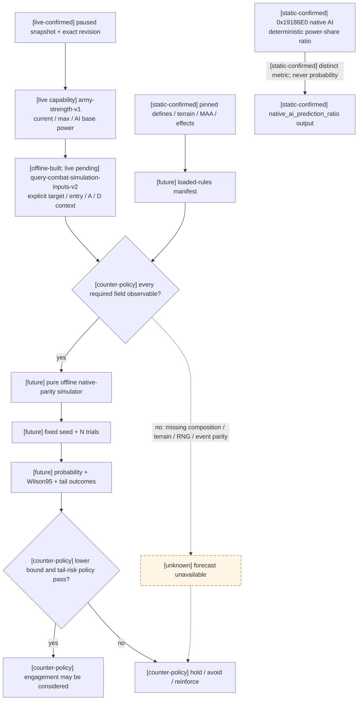

## 离线 fixture 设计

建议目录：`ck3_autonomous_player/native_bridge/tests/fixtures/combat/`。所有 expected 值必须来自已审计的原程序
trace 或逐指令闭合结果，不能用自编模拟器生成自己的“真值”。

1. `input_generation_and_atomicity`：valid/stale CUnit、CArmy、CCombat、Character、Province generation；任一
   必需链接失效时整个 input unavailable，且未知不变成零。
2. `equal_levies_main_round`：纯 levy、无 modifier、无 terrain bonus 的单轮输入；锁定 combat width、damage、
   soft/hard casualty、fixed-point rounding 的原生 golden trace。
3. `commander_roll_bounds`：默认 `0..10` 以及 min/max modifier 后的边界、3 日重掷节拍和同日求值顺序。
4. `terrain_and_adjacency`：hills/mountains/wetlands 加 river/strait；锁定 combat width、advantage、retreat loss
   与 hard casualty modifier。
5. `maa_counter_allocation`：单兵种、一对多、多对一、混合 depleted regiment；锁定 chunk、counter cap、分配
   次序与定点舍入。
6. `knight_effectiveness`：不同 prowess、knight effectiveness 与伤病；锁定每名 knight 的有效 damage/toughness
   及死亡后从 side strength 移除的时点。
7. `pursuit_and_screen`：双方 pursuit/screen 高低组合；锁定 pursuit 三日、minimum damage、soft→hard 转换。
8. `phase_event_rng`：先用本文 golden vector 锁定 selector、五日 schedule、ordinal seed 与 main-day draw order；
   再对 commander/knight none/wound/maim/death 的 loaded trigger/weight/effect 和后续战力变化作 original trace。
   第二层未通过前不得宣称完整胜率。
9. `ongoing_combat_resume`：maneuver/main/pursuit 各阶段快照继续模拟，与原程序后续逐日 trace 对齐。
10. `reinforcement_join`：同日与跨日到达、多个 owner/army、退场/撤退；它是
    `dynamic_route_timeline` fixture，不阻塞 explicit hypothetical-contact v2 input readiness，但未闭合时不得外推动态胜率。
11. `monte_carlo_reproducibility`：固定 input hash、simulator build、seed、N 的摘要逐字节一致；改变任一 provenance
    字段必须生成新 forecast ID。

## 战略可赢性与止损的最小追加指标

单场胜率不等于战争可赢。要让宣战、继续战争、白和、投降与止损决策可审计，snapshot 至少还需：

| 指标组 | 最小字段 | 当前状态 |
|---|---|---|
| 双方已动员战力 | 每个 war side 的 raised army composition/effective power、位置、路线、补给、到达各 objective 的 ETA | ArmyID/owner/位置/路线与 current/max/AI base-power aggregate 已发布并 live-confirmed；per-regiment composition/effective/context 仍缺失 |
| 双方可动员储备 | current/max levy、MAA、horde/event troops、补员速度、raise point 与完整动员时间 | 缺失 |
| 盟军 | 已参战 participant、尚可召盟友、各自承诺/可用军力、是否已被其它战争牵制、加入 ETA | 只能按当前 war participant 分类已出现的 CUnit；其它缺失 |
| 财政续航 | treasury、monthly income、raised maintenance、reinforcement cost、debt tier/advantage penalty、可雇佣 mercenary/holy order 与货币 | 缺失 |
| 战争分构成 | total、battle、occupation、objective ticking、prisoner/war-leader 分、单战 battle cap 与剩余可得分 | 只有 `player_relative_war_score` total |
| 战争目标 | targeted titles、objective Provinces、occupation、fort/garrison/siege/assault、ticking controller | 前半部分已支持；ticking 与完整 score breakdown 缺失 |
| 接战矩阵 | 所有可能接触的 player × hostile/allied reinforcement scenario 的 exact forecast、terrain、ETA 与尾险 | 缺失 |
| 战争终止 | enforce/surrender/white-peace 当前 native validation、AI acceptance score/阈值/冷却、强制胜利条件 | enforce command 存在；决策与 acceptance 未发布 |
| 宣战成本/收益 | CB cost 各货币、目标价值、盟友调用成本、预期占领/战斗损失、战后 truce/派系/财政机会成本 | declaration choices 只含 CB key/config/claimant/titles；成本与收益缺失 |
| 止损预算 | 最大可接受 hard casualties、stack-wipe、关键 commander/knight/玩家死亡或被俘概率、gold runway 与时间上限 | 缺失 |

在这些指标未闭合时，可以继续执行确定性低风险目标和一日观察，但不能把“当前战争分为正”或“可见兵数较多”
当作战争最终可赢、继续消耗合理或单场接战安全的证明。

## Commander / knight 的 exact-build 只读契约

本节只绑定页首 CK3 `1.19.0.6` 与 EXE SHA。它关闭的是 combat-context 的角色输入口，不代表阶段事件 RNG
已经闭合。

### Battle commander 与 roll bounds

- [static-confirmed] raised army commander 是 `CArmy+0x120` full CharacterID；live side builder
  `0x19DD750` 遍历 `CCombatSide+0x10` 的 CArmyID array 并读取同一字段。必须经 Character storage
  `base+0x570C130` resolve，并以 `CCharacter+0x18` 回读完整 ID；fallback/null object 不得发布为角色。
- [static-confirmed] `int32 0x23CBFA0(CCombatSide* side, CTerrainType* terrain)` 从 `side+0x74` 取 battle
  commander，调用 `0x26172C0(CCharacter*)` 取得 modifier object，再用
  `0x20AB950(aggregator+0x68,int64*out,index)` 读取四个 signed Q100000 值。精确 endpoints 是：

  ```text
  effective_min = int32[base+0x570ED7C]
                + trunc_toward_zero(modifier[0x108] / 100000)
                + trunc_toward_zero(modifier[uint16(terrain+0x76E)] / 100000)
  effective_max = int32[base+0x570ED80]
                + trunc_toward_zero(modifier[0x109] / 100000)
                + trunc_toward_zero(modifier[uint16(terrain+0x770)] / 100000)
  ```

  stock defaults 为 `0/10`。helper 随后在两个 endpoints 之间 inclusive 抽样，并直接消费 global random
  `0x356A0A0`；因此 paused MCP **不得调用 `0x23CBFA0`**，只按上述只读链发布 bounds。无 commander 时原生
  null-object validity 分支产生 `0/0`；generation invalid、modifier getter 失败或 int32 overflow 则整个角色
  subdomain unavailable，不能填零。

### 真正的 knight list 与有效贡献

- [static-confirmed] `CCombatSideKnightListBuilder` 的 ordered/every vfunc `0x19F4580/0x19F4670` 都调用
  `0x19DD670`。后者遍历 `CCombatSide+0x40`、count `+0x4C`、stride `0x60`，以 entry `+0x08` full
  CRegimentID 经 storage `base+0x57BF4C8` / `CRegiment+0x10` 回读，再取
  `CRegiment+0x148` full CharacterID；`-1` 才表示没有 knight。pre-contact 对显式 participant army 的
  `CArmy+0x38/+0x44` regiment array 重走同一字段，不能从 owner set 或 contribution ledger 猜骑士。
- [static-confirmed] script link core `0x19DA780` 证明 membership postcondition：Character scope 经
  `Character+0x1B0 -> +0xF8` 取得其 full CRegimentID，generation resolve 后读 `CRegiment+0x140` ArmyID。
  query 不直接调用 script-scope builder，而镜像 full-generation 链，并要求其 ArmyID 等于 source participant
  army。重复 CharacterID、重复 source regiment、跨军 membership 或 stale generation 都使整个 knight
  subdomain unavailable。
- [static-confirmed] canonical stats evaluator `0x239CAE0(CRegiment*,Stats38*out,CProvince* target)` 在 knight
  branch 调 `0x28FDBC0(out,CCharacter*)`。后者读 `int32 CCharacter+0xE8` effective prowess，令
  `p=max(1,prowess)`；`0x2613480(Character*)` 返回 effectiveness context，
  `0x28FD990(int64*out,context,0)` 返回 signed Q100000 knight effectiveness。最终：

  ```text
  effective_damage_raw    = p * effectiveness_raw * int32[base+0x570EDF8]  # stock 50
  effective_toughness_raw = p * effectiveness_raw * int32[base+0x570EDFC]  # stock 10
  ```

  live entry 的同值在 `+0x40/+0x48`。稳定输出顺序固定为
  `(army_id,source_regiment_id,character_id)`；不得用 container 地址排序。

```json
{
  "commander": {
    "character_id": 42,
    "battle_context": {
      "source_target_province_id": 20,
      "effective_min_roll": -1,
      "effective_max_roll": 11
    }
  },
  "knights": {
    "status": "available",
    "members": [
      {
        "character_id": 77,
        "source_regiment_id": 16777231,
        "army_id": 16777218,
        "participant_army_membership_verified": true,
        "prowess": 12,
        "knight_effectiveness_raw": 150000,
        "effective_damage_raw": 90000000,
        "effective_toughness_raw": 18000000,
        "scale": 100000
      }
    ]
  }
}
```

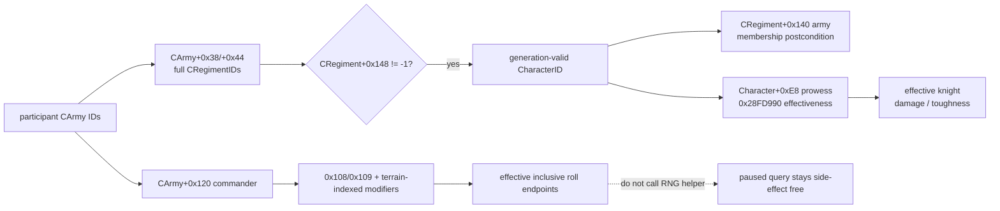

最小 fixtures：default commander 必须给 `0..10`，absent commander 给 `0..0`；modifier raw
`(+150000,-250000)` 组合必须按逐项向零截断得到 `-1`，不能先求和；prowess `12`、effectiveness `150000`
必须得到 damage `90000000`、toughness `18000000`。prowess `0` 必须按 `p=1` 计算。stale CharacterID、跨军
knight 与重复 knight 均必须原子拒绝。

## Contact geography、攻守、holding 与战宽契约

### origin→target adjacency 与 side role

- [static-confirmed] contact constructor `0x2209C45..0x2209D0F` 从 moving `CArmy+0x124` resolve CUnit，读
  `CUnit+0x20` origin Province 与 `+0x30` target Province；origin map node `Province+0x08` 的 adjacency
  array 在 `+0x50`、count `+0x5C`、stride `0x30`。匹配 `entry+0x04 == target ProvinceID` 后，
  `int32 entry+0x00` 是 native kind。该 scan 是 inline leaf，没有可安全单独调用的 classifier；paused query
  镜像上述只读字段，绝不能调用会构造 CCombat 的 contact path。
- [static-confirmed] kind 映射由 singleton initializer `0x2D7952D..0x2D796A2` 与 parser 共同闭合：
  `0=normal`、`1=strait`（`adjacencies.csv` 原 token 为 `sea`）、`2=river`、`3=river_large`、
  `4=impassable`、`5/6=none`。API 发布 `none/strait/river/large_river`；v2 要求 entry 与 target 互异，遇到
  `4/5/6` 或找不到 edge 必须拒绝 scenario，不能把内部 default `0` 冒充 normal。
- [static-confirmed] `CCombat+0x20` side0 是 attacker，`+0x368` side1 是 defender。证据不是 UI 左右：
  singleton `+0xF88[kind]` 用格式串 `attacker_%s` 并由 `0x2209A5C` 以 side index `0` 施加；
  `+0xFB8[kind]` 用 `defender_%s` 并由 `0x2209ACA` 以 index `1` 施加。river 分支还先检查 side0 commander
  modifier `0x197 no_water_crossing_penalty`，再把 defender effect 给 side1。

已废止 v1 正是试图从 unordered armies 的 current origin/move target 推断攻守与入场边，导致没有预先下 move 时
production query 不可达。v2 不再做这种推断：调用者显式提供一个所有 attacker 共用的 hypothetical final-edge
`attacker_entry_province_id`、target 与有序 A/D partition；native 只解析这两个 Province 并要求 entry→target 唯一合法。
军队的 `current_province_id` 可为 null，也不参与 admission；该合同因此能在下令前读取，但不声称所有军队真实会从
同一 entry、同一日到达。

### holding defender

- [static-confirmed] `0x2304D10(CCombat*)` 取 side1 首军 `CCombat+0x378`，沿
  `CArmy+0x124 -> CUnit+0x174` 得 defender owner Character，再以 `CCombat+0x6B8` target 调
  `bool 0x2900BB0(CCharacter* defender_owner,CProvince* target)`。true 时写 `CCombat+0x6FE=1`，并把
  singleton `+0xF28`（exact key `holding_defender_advantage`）作为 defender effect。
- [static-confirmed] `0x2900BB0` 只读调用 `0x220C3F0(target,CharacterID*out)`：优先取
  `CProvince+0x744` holder，`-1` 时沿 `Province+0x740` title fallback 得 holder；full-generation resolve 后调用
  `0x2900710(defender_owner,province_holder)` 关系谓词。该链无写入、无 RNG，可在 paused snapshot 验证
  defender owner/target generation 后直接调用。live CCombat 则直接读 `+0x6FE`。
- [static-confirmed] **真实 native contact** 的 mixed-owner“首军”顺序已由 builder 闭合，不是 MCP request
  order，也不是每个 owner 分别求 holding：`0x2209450` 按 target `CProvince+0x748` 的 full CUnitID array、count
  `+0x754` 原 stored order 扫描合格对手；每项先 generation-resolve CUnit，再沿 `CUnit+0x178` resolve CArmy，
  并按扫描顺序 append 到 `Vector<CArmy*> opponents`。`0x2209939` 的 exact call 是：

  ```cpp
  CCombat* create_contact_combat(
      CCombatStorage* storage,
      CArmy* initiating_army,
      Vector<CArmy*>* opponents,
      bool initiator_is_attacker,
      CProvince* target,
      int32_t adjacency_kind);
  // RVA 0x27FB7C0; allocates and calls CCombat ctor RVA 0x2303CF0
  ```

  ctor 在 `initiator_is_attacker=true` 时先用 `0x23044F0` 把 initiating army 加入 side0，再按 opponents stored
  order 用 `0x23043F0` 加入 side1。两 wrapper 最终调用
  `0x23C9100(CCombatSide*,CArmy*)`；它只在 side `+0x10/count+0x1C` 尚无该 full CArmyID 时 append。因此
  side1 `+0x10` 的首项就是 target Province stored order 中第一个通过原版 contact filter 的 opponent army。
- [static-confirmed] `CCombatSide+0x70` 的 `side_primary_participant` 与 holding source 独立走到同一选择：
  `0x23C9361..0x23C93E7` 从 side `+0x10` 首军 resolve CUnit owner 写入 `+0x70`；后续添加其它 owner 时，
  `0x23C9600` 只要确认当前 primary owner 仍拥有 side 内至少一军便保留它。holding 仍直接读取首军，不调用
  primary helper，但首次 contact 两者相同。

paused v2 hypothetical query **不读取 target 当前驻军表来重排 participant**。调用者冻结有序的
`scenario.defender_army_ids`，native 按该 request order 构造条件 side，并取数组首军 owner 调一次
`0x2900BB0`；mixed owner 本身不是失败条件。数组中每个 ID 仍必须通过 same-revision scope、opposite-coalition、
full-generation CUnit→CArmy→owner 回读，重复、越界或 identity drift 令对应严格域 unavailable。合同字面值
`defender_insertion_order_policy=explicit_request_order_hypothetical` 是关键证据边界：它回答一个 fixed participant
counterfactual，不声称复刻真实 arrival/Province stored order。若输出声称预测真实自动接战，则另需投影原生 contact
filter 后的完整 opponents set 与 order；不能用 v2 request order 代替，也不能悄悄忽略同省第三军。

### base / final contact width

- [static-confirmed] `0x23CB840(CCombatSide*)` 分别汇总 side 的 `+0x28/count+0x34` 与
  `+0x40/count+0x4C` 两个 `0x60`-byte entry arrays，各 entry `+0x18` 是 current soldiers Q100000，写总和
  `side+0x98`。pre-contact synthetic side 只纳入 full-generation、identity initialized 且 current>0 的 selected regiments；
  stale/重复 regiment 或超出显式 participant set 都整体失败。
- [static-confirmed] mutating helper `0x2305580(CCombat*)` 证明以下逐步截断；paused query 镜像公式，不能调用它。
  `fp_mul(a,b)=trunc_toward_zero(a*b/100000)`，`fp_div` 同样逐步向零：

  ```text
  average_raw = fp_div(side0_sum_raw + side1_sum_raw, 200000)
  base_raw = fp_mul(average_raw, int64[base+0x570EDB8])
  candidate_base = trunc_toward_zero(base_raw / 100000)
  base = max(previous_base, max(1, candidate_base))
  final_raw = fp_mul(base * 100000, terrain_width_multiplier_raw)
  final = max(int32[base+0x570ED84], trunc_toward_zero(final_raw / 100000))
  ```

  stock `BASE_WIDTH_RATIO=1`（raw `100000`），`MINIMUM_COMBAT_WIDTH=100`。首次 pre-contact 的
  `previous_base=0`；live 直接读取 `CCombat+0x6C0/+0x6C4`，不重算并破坏 max-history。

```json
{
  "target_province": {
    "crossing": { "status": "available", "kind": "river", "unavailable_reason": null },
    "defender_context": {
      "status": "available",
      "defender_side": "enemy",
      "holding_defender_status": "available",
      "holding_defender": true,
      "holding_unavailable_reason": null,
      "unavailable_reason": null
    },
    "precontact_width": { "status": "available", "base": 900, "final": 720 }
  }
}
```

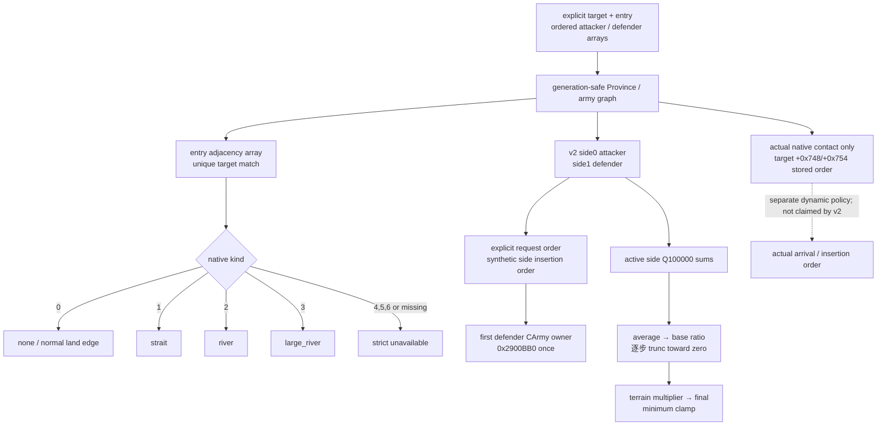

固定 fixture vectors：native kinds `0/1/2/3` 分别 PASS 为 `none/strait/river/large_river`；duplicate/missing edge 与
`4/5/6` 仍 REJECT。mixed defender owners 必须 PASS，并用当前 Province unit order
`[army_B,army_A]` + request defenders `[army_A,army_B]` 断言 v2 holding/counter owner 是 `army_A`，证明条件查询保留
request order、且不依赖当前驻军排序；`current_province_id=null` 也不得影响 admission。重复 ID、side/coalition drift
或 generation drift 令严格输入 unavailable。
另以原版 builder trace 固定 actual-contact 首军为 `army_B`，但该 trace 不是 v2 wire 的期望值。width 用 attacker
`1000`、defender `800`、terrain `80000`，必须得到 base `900`、final `720`；若 terrain 使结果低于 `100`，
必须 clamp 到 `100`。holding relation true/false 各一例，live fixture 还要断言 `CCombat+0x6FE` 与 wrapper 一致。

## 未闭合清单

- [live-confirmed] ArmyComposition current/max callback、CArmy regiment container、CRegiment full ID、identity
  predicate 与 AI base-power aggregate 已由 production `army-strength-v1` adapter/MCP 在 paused revision `4`
  实机验收；回归仍需 exact-build hash 与 fixture gate。
- [static-confirmed] regiment combat kind 已由 `0x23C9100` 闭合为 `levy|men_at_arms`，主阶段资格为
  `*(CRegiment+0x18)+0xA0A`；knight 是独立 Character participant，不属于 regiment kind。更细 archetype/event
  subtype 与 production paused acceptance 仍待后续按需闭合。
- [live-confirmed] Province terrain、显式 final-edge 的 river/large-river/strait、attacker/defender、mixed-owner
  首 defender/holding 与首次 contact width ABI 已闭合；v2 production adapter/offline fixture 与五个 paused live
  scenario 均已通过。v2 首 defender 来自 request order；原版真实 contact 的 Province stored order 已另行闭合，
  两者不得混写。
- [static-confirmed] battle commander roll bounds、knight identity/membership/prowess/effectiveness 与有效
  damage/toughness ABI 已闭合；supply、debt、recently-disembarked、holding/faith/terrain/adjacency 的原生
  constructor selector、跨 side 顺序与逐来源 accumulator 已闭合为 v3 source-ledger ABI；`0x2307CB0` 的
  commander/side dynamic decomposition、zero-roll local shell 与 original-total equality contract 也已静态闭合。
  production native reader、完整 fixture/serializer 与 capability/MCP 已发布；paused-live equality 仍待验收，
  不能用 generic advantage 替代，也不能把 132/132 observation readiness 升格为 transition fidelity。
- [static-confirmed] CCombat 两侧 base、phase/day、roll、advantage、**winner** 与 roll cadence 布局，以及每日
  phase dispatcher 已闭合；v2 对 generation-valid live CCombat 已发布 raw context，完整 side entry resume 仍待下一口。
- [static-confirmed] main casualty、pursuit 与 battle-end/manual-retreat/force-result 核心 transition 已闭合；simulator
  与 original-trace fixture 尚未落地。CombatSide 完整 ongoing-resume entry 仍待下一口，AI 何时选择撤退仍是 policy 缺口。
- [static-confirmed] AI combat prediction helper RVA `0x19186E0` 的输入 ABI、direct xrefs、敌方 `1.1` 修正和
  `P_eval / (P_eval + P_opp)` 主公式；详见 [combat-prediction.md](combat-prediction.md)。
- [unknown] AI predictor 的 mode/flag/lane 完整业务语义、paused worker 只读线程边界，以及当前 bridge 未发布的
  encounter participant 输入。
- [static-confirmed] 首次 contact 战宽、counter、main damage/casualty、pursuit、manual retreat validator/application、
  force-win 与 result-envelope 顺序已闭合；在 simulator/original traces 与 loaded effects 完成前仍未达到 exact-native parity。
- [static-confirmed] `0x356B770` 核心 RNG、roll/phase-event 条件消费次序、weighted selection 与 effect seed 已闭合；
  [unknown] loaded script effect 对伤/残/死、participant 移除和下一日 side state 的完整反馈。
- [unknown] 多军中途加入、离开、第三方敌对关系与同日到达的 dynamic participant policy；它不属于
  `explicit_hypothetical_fixed_at_contact_no_reinforcements` v2 的 input-readiness gate。
