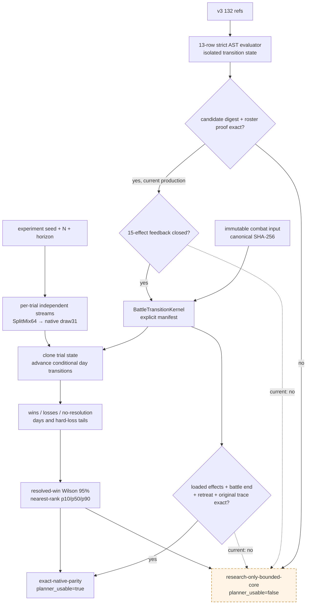
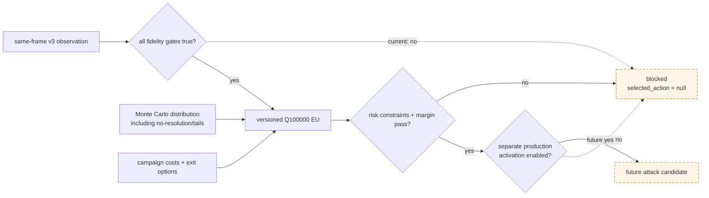
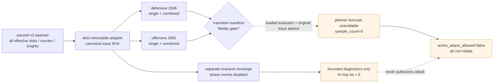
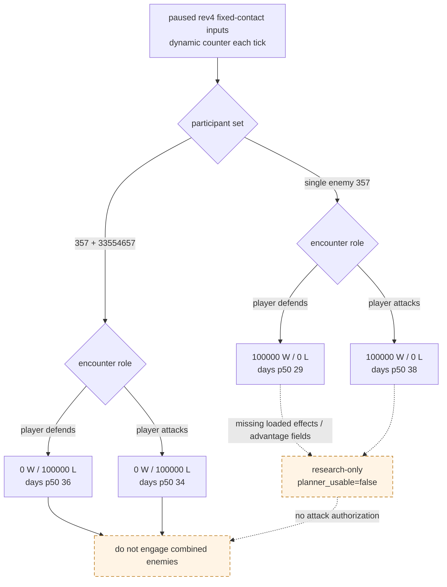

# CK3 1.19.0.6 战斗模拟器纯函数 core

## 结论与边界

本文只绑定 CK3 `1.19.0.6`，`ck3.exe` SHA-256
`2D00FF3101EF70B566F2FCBAE292F09263199C80E9DC8F139B82D7D96F83DB86`。原生公式、RVA 与证据链的权威来源仍是
[battle-simulation.md](battle-simulation.md)、[combat-phase-events.md](combat-phase-events.md) 和
[combat-simulation-inputs.md](combat-simulation-inputs.md)。本文只记录这些已闭合规则在进程外 Python 中的实现合同，
不提升任何逆向结论的证据等级。

- [implementation-confirmed] 纯函数模块是
  `ck3_autonomous_player/src/xar_autoplayer/simulation/combat_core.py`；它不读取 CK3、不调用 native bridge、
  不消费 paused snapshot，也不接 planner/MCP。
- [implementation-confirmed] 当前已实现 signed Q100000 向零截断、主阶段 damage→soft/hard casualty、底层 component
  stored-order 分摊、三日 pursuit、`avalanche32/draw31`、phase weighted selection/effect seed 与 main-day
  commander-roll 消费顺序；MAA counter 不再冻结首次向量，而在每个 outgoing tick 用 depleted current/chunk
  双向重算。
- [implementation-confirmed] battle-end/retreat 核心已新增：第 `14/15` 日边界、allow-early/disallow 优先级、
  skip-pursuit、force-winner 的 phase-sensitive 映射、non-retreat clear，以及 normal/teardown finalizer envelope
  顺序均有独立 golden。mixed-owner partial retreat 的数值 helper 已静态闭合，但 AI 在何 tick 选择哪位 owner
  仍是 policy 缺口，尚未进入 fixed-contact kernel。
- [implementation-confirmed] 受管 episode 的 loaded-playset proof 与 13-row strict AST evaluator/state-transition kernel 已独立落地；
  evaluator 覆盖 688 nodes，并写回 trait/wound/maim/death/detach/known commander advantage removal。它尚未接入逐日
  `BattleTransitionKernel`；v3 candidate-source equality 已由逐 payload digest+roster proof 闭合，15 类 side effect 的
  battle-horizon feedback、死亡后同日 contribution/commander replacement 刷新与 exact-build original trace fixture 仍未闭合。
  因此当前 manifest 固定
  `fidelity_gate=false`、`planner_usable=false`；即使研究 kernel 产生了 `wins/losses/no_resolution`，也不能把它
  当成当前战局的原版胜率。

## 不可绕过的 transition manifest

完整逐日状态机不以回调默认值或“永不撤退”假设补洞，而由显式 `BattleTransitionKernel` 注入。每个 kernel 必须
给出 immutable `TransitionFidelityManifest`：

| gate | 当前状态 | 打开条件 |
|---|---:|---|
| loaded phase effects | false | playset proof、candidate-source input proof 与 13/13/13 structural AST 已完成；仍需 15-effect feedback、逐日接入及 original trace |
| battle-end core | true | winner、phase2/3、normal/teardown envelope draw order 已落地；loaded envelope effect 仍随 manifest gate |
| retreat / forced-result core | true | day14/15、allow/disallow、skip-pursuit、force mapping 与 tick order已落地 |
| exact original fixture | absent | 独立于待测模拟器生成的 exact-build trace SHA-256 |

只有四项同时满足，manifest 才能把输出标成 `exact-native-parity`。当前常量
`CURRENT_BOUNDED_CORE_MANIFEST` 明确列出缺口；不允许由调用方覆盖 `planner_usable`。

[implementation-confirmed] stock 13-row phase-event manifest 已有严格 immutable loader
`xar_autoplayer.simulation.phase_event_manifest`。loader 固定 canonical SHA-256
`91EDCEEDC634C5ACDCFAC8B02F53FE74C4E7A2E1768AAFC12CD0D976E874F2AC`，验证 exact build、全局/分类 load order、
normalized AST opcode、transition dependencies 与 source hash，并把递归 AST 冻结为只读 mapping/tuple。这个接口只解决
“机器可消费 manifest”合同；静态 manifest 的三个 completeness 位仍保留 false，调用 `require_evaluator_ready()` 必须失败，
不能因为 JSON 已存在就打开 fidelity gate。运行期 v3 payload 另由 `phase_event_evaluator` 对 132 refs 做 13/13/13 strict audit，
当前只得到 `structural_ready=true`。native candidate source-vector equality 已由本次 production payload 的 strict proof 闭合；由于
15-effect battle-horizon feedback 尚未闭合，
`ast_evaluator_ready=false`；这不会修改静态 manifest，`original_trace_ready` 也继续为 false。

独立 sampler 估计同规则分布，不声称复现当前 CK3 timeline。trial stream 由记录的 64-bit experiment seed 和
trial ordinal 经固定 SplitMix64 派生，再在战斗内部按原生 `draw31` 和条件消费顺序推进；相同 input hash、build、
seed、`N` 与 kernel 必须得到逐字段相同摘要。

## 策略接线所需的最终字段与 EU 合同（未启用）

[implementation-confirmed] 自动接战不能只读取一个 `win_probability`。独立模块
[`combat_decision_contract.py`](../../ck3_autonomous_player/src/xar_autoplayer/simulation/combat_decision_contract.py)
已冻结 `combat-entry-eu-v1` 的 94 个 required path，canonical SHA-256 为
`A737A10FCC2B1393B8F2A50F3D6170C6881FCC1745E970356F1C3975D65EA43C`。它要求下列字段绑定在同一
episode/frame；当前只做 typed validation 与 fail-closed assessment，不计算 EU、不启用任何 move/attack：

| 组 | 必需字段 |
|---|---|
| encounter identity | `snapshot_id/revision/native_revision/episode_run_id`、target/entry、两侧 ordered ArmyID、WarID/side |
| fidelity | `loaded_playset_verified`、`ast_evaluator_ready`、`original_trace_ready`、`transition_fidelity_gate`、`monte_carlo_ready`、`planner_usable`、`active_attack_allowed` |
| experiment | simulator version/hash、input hash、seed、trial count、horizon、wins/losses/no-resolution |
| distribution | win/loss/no-resolution Q100000 probability、resolved-win Wilson interval、battle-day 与双方 hard-loss p10/p50/p90 |
| character tails | commander/knight wound、maim、death、detach/capture 的逐侧概率与 one-life catastrophic probability |
| campaign feedback | battle warscore、objective/siege tempo、reinforcement/route、supply/attrition、replacement gold/time、exit-option value |
| utility policy | 每个 component 的 versioned signed Q100000 coefficient、risk constraint、uncertainty penalty、opportunity-cost baseline |
| output | `eu_attack_raw/eu_avoid_raw/eu_wait_reinforce_raw`、margin、dominant risk、missing fields、decision status、selected action |

每个 trial 先用版本化 component vector 求 `utility_outcome_raw`，再逐 outcome 做 signed Q100000 乘法并向零截断：
`EU(action)=Σ p(outcome|action)×utility(outcome)−uncertainty_penalty−opportunity_cost`。禁止把 resolved-win conditional
probability 当 unconditional win probability，也禁止丢掉 `no_resolution`、character tail 或 confidence interval。只有全部 identity
相等、七个 readiness 位均为 true、概率分割精确为 Q100000、trial accounting 完整、utility coefficients/hash 已冻结，且
`EU(attack)` 在风险约束内严格高于所有非攻击 alternative 与最小 margin，输出才可能是 attack；否则固定
`decision_status=blocked`、`selected_action=null`。合同还要求 per-trial component-vector SHA，防止只拿汇总胜率反推效用。
当前 AST/original trace gate 为 false，且独立 production activation 常量固定 false；测试同时覆盖字段全齐且 90% unconditional
win 的合成输入，结果仍为 `blocked_not_activated`、三个 EU 值为 null、零自动攻击。

## 已落地子步骤与 golden vectors

测试文件为 `ck3_autonomous_player/tests/unit/test_combat_simulation_core.py`。expected 数值直接冻结自逆向文档中的
独立 golden vectors，不由被测实现生成：

| 子步骤 | 固定断言 |
|---|---|
| main levy / MAA | total `1127200 / 1430769`；hard `456516 / 579461`；soft `670684 / 851308` |
| backing components | `[3,5] → [0,4]`、`[2,5] → [0,2]`；fractional raw 不回填 |
| attribution | 两轮累计 `[601534,434441]`，比真实 hard `1035977` 少 `2` raw |
| pursuit day 1 | toughness `1400000000`；pursuit/screen `225000000/200000000`；总 hard `2261666` |
| pursuit allocation | levy stored-order hard `791584/565416`，`1` raw remainder 进入第一项；MAA `904666` |
| RNG | `update_seed=42 → counter 0x6DA1654D`；首 draw `0x226BC740`；effect ordinals 与文档三向量一致 |
| experiment summary | immutable seed/N 复现；`wins/losses/no_resolution`、resolved Wilson 95%、days/loss p10/p50/p90 |
| battle end / retreat | day14 false/day15 true；allow-early 只越过 day gate；disallow 优先；phase2 不可 retreat |
| force / finalizer | phase0/1 force 同步写 winner；phase2 保留既有 winner；normal W→L 两 draw，teardown 零 draw |
| main winner tick | 只在下一 main tick 开头判胜；forced 优先，再查 side0、再查 side1；同 tick 双灭在下一 tick 判 side1 胜 |
| dynamic counter | 五份 paused live fixture 的双方 13-class 初始重算逐元素等于 native vector；后续每 tick 从 depleted current 重算 |

三日 pursuit 每日都重新计算 current routed toughness/screen，并复用 phase 开始时冻结的 levy/MAA initial soft pool；
测试另断言三次 tick、soft 减量与累计 hard 守恒，防止把 day-1 结果简单乘三。

## 数据与数值合同

1. 所有战斗量使用 signed raw Q100000；`fixed_mul/fixed_div` 每一步单独向零截断，禁止合并成一次浮点运算。
2. main casualty 对 levy 与 MAA 保留不同乘除顺序；双方 outgoing damage 必须先各自冻结，再由上层 kernel 同日施加。
3. `0x239C840` component helper 保留原生 stored order、int64 pre-product wrap、整数 soldier setter 和不回填余数。
4. pursuit 固定 winner 为 pursuer、另一侧为 retreater；stock day `1/2/3` 各执行一次 casualty tick。
5. phase selection 的 candidate 顺序必须是 loaded database order；有至少一条 trigger-valid row 时恰消费一次 selection
   draw，总正权重为零也不能撤销消费。
6. main tick 先刷新 totals 并按 forced→side0 depleted→side1 depleted 判胜；只有双方仍存活才消费 phase/roll RNG 与
   施加双向 damage，damage 后不复判。下一 tick 双方都为零时因 side0-first 得到 side1 winner。
7. 每个 outgoing 都按当前 entry current 除以原生 stack 得到 depleted chunk，再重算 opposing pressure、own chunks 与
   13-class retention；不能冻结 pre-contact retention。当前 live row 的初始 chunk 可精确反解 stock stack `10/50/100`，
   并由 native 已发布 retention 独立互证。
8. main day 全局 draw 顺序固定为 side0 phase fire、side1 phase fire、条件 side0 roll、条件 side1 roll。
9. Wilson 区间只覆盖有限样本误差。只要 manifest fidelity gate 为 false，区间与 quantile 都保持研究输出，不能
   授权主动接战或替代 native paused input readiness。

## paused revision 4 的真实 v2 输入验收

[live-confirmed] 2026-08-25 paused `date_raw=53175816`、snapshot `native:3`、revision `4` 已冻结为五份完整
per-regiment fixture，目录是 `ck3_autonomous_player/tests/fixtures/combat/`。immutable adapter 位于
`xar_autoplayer.simulation.combat_input`；它重新验证 exact build、participant order、角色/兵团 identity、Q100000、
target、counter class、knight membership 与 completeness，再生成 canonical input SHA-256。测试不读取本机
driver history，因此后续回归不依赖正在运行的 CK3。

| 条件场景 | target / 攻守 | participant current / main | width base/final | holding | input SHA-256 前 12 位 |
|---|---|---:|---:|---:|---|
| 敌 `357` 攻玩家 | `2596`；玩家守 | player `1482/1472` vs enemy `1801/1783` | `1641/1312` | false | `c072deaa0007` |
| 两敌合攻玩家 | `2596`；玩家守 | player `1482/1472` vs enemy `2812/2784` | `2147/1717` | false | `c8ec6946e7b2` |
| 玩家攻 `357` | `2581`；玩家攻 | player `1482/1472` vs enemy `1801/1783` | `1641/1312` | true（敌） | `fb1c0c72b7a` |
| 玩家攻两敌 | `2581`；玩家攻 | player `1482/1472` vs enemy `2812/2784` | `2147/1717` | true（敌） | `9d65d471dc1e` |

共同输入：terrain `hills`、width multiplier `80000`、crossing `none`。玩家军有 `38` regiments、`12`
knights（prowess sum `85`）、commander generic advantage `35`、roll `0..10`；`357` 为 `23` regiments、`6`
knights（`64`）、generic `14`；`33554657` 为 `22` regiments、`7` knights（`72`）、generic `28`。
generic advantage 仍不等于完整 resolved encounter advantage，adapter 只保存它，不把它直接塞进 damage multiplier。

[implementation-confirmed] 四个决策场景都已实跑 adapter/readiness gate：`input_observation_ready=true`，但当前
transition manifest 仍 false，所以统一输出 `forecast_status=unavailable`、`sample_count=0`、
`planner_usable=false`、`active_attack_allowed=false`。这是“输入已读全、模型最后一门未闭合”，不再是缺四维、
骑士或渡河字段；也不会用人数比或 generic advantage 伪造胜率。

## phase-events-disabled 研究包络：四场 N=100000

[implementation-confirmed] 为先验证数值管线而运行了显式非 planner 的研究 kernel：stock phase events 全部禁用，
不执行主动/partial retreat；battle-end 自动 retreat、三日 pursuit 与 finalizer 仍按已闭合 transition。每个 outgoing
逐日重算 counter，winner 只在下一 main tick 开头判断。完整机器报告冻结在
`ck3_autonomous_player/tests/fixtures/combat/research/rev4_phase_events_disabled_n100000_seed_c0319a06.json`：

- experiment seed `0xC0319A06`（`3224476166`），每场 `N=100000`，horizon `120`，ProcessPool `24` workers；
- report code SHA-256 `dcff2d27a4d8e26596b0ae1580020c0de12c1b313b287e047a0b6b4e06d1c0db`；
  transition manifest SHA-256 `3e7ac5a732faa8ccfa3bbef8266a2334b82ea0485afb43263dacf29cb6b771c2`；
- 四场共 `400000` trial，均在 horizon 内 resolved，`no_resolution=0`；Wilson 是 resolved conditional win 的
  有限样本区间，不覆盖模型缺项。

| 条件场景 | W / L / NR | resolved win / Wilson 95% | days p10 / p50 / p90 | 玩家 hard-loss raw p10 / p50 / p90 |
|---|---:|---:|---:|---:|
| 敌 `357` 攻玩家 | `100000 / 0 / 0` | `1.0 / [0.9999615869, 1]` | `27 / 29 / 30` | `17784511 / 18901640 / 20102278` |
| 两敌合攻玩家 | `0 / 100000 / 0` | `0.0 / [0, 0.0000384131]` | `36 / 36 / 37` | `45198897 / 45198914 / 45198932` |
| 玩家攻 `357` | `100000 / 0 / 0` | `1.0 / [0.9999615869, 1]` | `36 / 38 / 41` | `23961250 / 25814489 / 27840514` |
| 玩家攻两敌 | `0 / 100000 / 0` | `0.0 / [0, 0.0000384131]` | `34 / 34 / 35` | `45198930 / 45198943 / 45198958` |

这里的 `hard-loss raw / 100000` 才是永久损失士兵等价值；不能把 raw 直接当人数。本包络强烈区分“单独对
`357`”与“两敌合流”，足以支持**继续禁止攻击合流敌军**这一保守门，却不证明单敌真实战斗必胜。缺项仍包括 supply、
recently disembarked、debt（RE 已确认 tier 可到 `-100`）、unreformed faith、未闭合动态 helper `0x2307CB0`、完整
resolved advantage、hard-casualty modifiers `0x18C/0x18D/0x19F`、pursuit modifiers `0x105/0x18B`、loaded phase
effects、mixed-owner AI partial-retreat policy 与 original trace。已知 advantage constructor 顺序是
supply side0/1 → holding defender → recently-disembarked first army side0/1 → debt side0/1 → unreformed faith
side0/1；研究 kernel 只建模 generic commander、stock terrain/holding/crossing 与 roll。

[implementation-confirmed] `test_combat_research_report_contract.py` 不重跑 400000 trials，而是重算 code-files aggregate
SHA、transition-manifest SHA、四份 fixture file/canonical input SHA，并冻结四场 counts 与 days/hard-loss quantiles；
任何后续源码、输入或报告漂移都会直接失败。`fidelity_gate/planner_usable/active_attack_allowed` 也固定为 false。

## 下一项接入

RE 后续闭合 transition 时，把现有 `phase_event_evaluator` 接入一个实现 `BattleTransitionKernel` 的 exact kernel，并提交独立
original-trace fixture；不修改数值 primitive 的 golden expected。当前最短顺序是：同日 participant/contribution/commander
replacement 与 effect draw trace → mixed-owner AI retreat policy → exact fixture SHA → 才允许 planner/strategy 消费。
