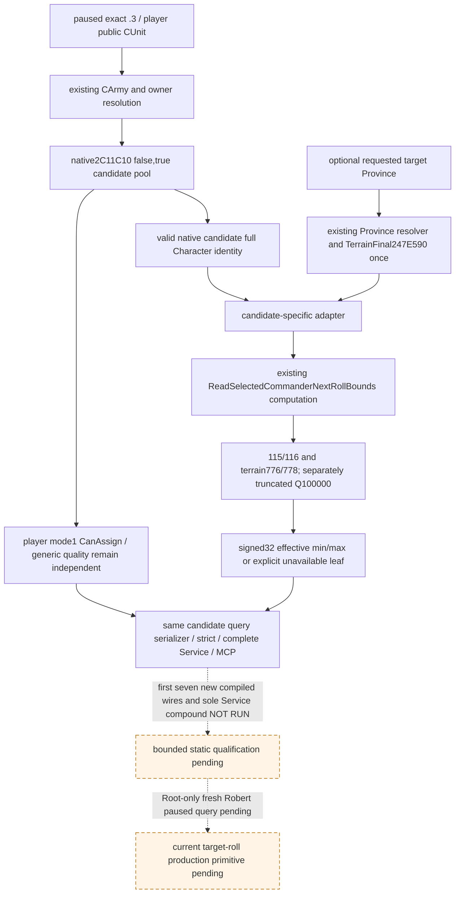

# Commander candidates: current target-specific roll bounds (1.20.0.3)

An optional `target_province_id` candidate extension is implemented in the existing
commander MCP. The new reader publishes each native
manual candidate's **current** effective dice endpoints for that target, while
keeping its final `can_assign`, native base quality and generic advantage
independent. Native, transport, strict projection, Service/MCP and focused fixture
source are integrated; first build, fixture, Service/MCP and
paused game qualification remain **NOT RUN**. Readiness is **research / source
ready implementation candidate**, with no new static-ready or live promotion.

The exact game is CK3 **1.20.0.3 / Steam25652598**, EXE SHA-256
`94B55397ABB687A3DCD436805A5D885E6BE90FA6C693FEB44A9E3BBEEADE02A6`.
The source-first plan and Mermaid were sealed before implementation at
`Z:/ck3_mod_rewrite_process_assets/g2-parallel-20261006/battle-commander/` in
`SOURCE-TREE.md`, `native-plan.json`, `GETTER-API-FIXTURE-PLAN.md` and
`IMPLEMENTATION-OWNERS-AND-FIRST-SCENES.json`. Candidate baseline is
`df87fd8562120b901413793ded4680b7b4dabd8e`. The implementation is adopted in the
Root-created independent `commander-bounds` tree on
`be06a134b9a5472275e08ea452a8e3542b192fb8`; its cherry-pick commit and file list are
in `ROOT-INTEGRATED-DELIVERY.json` in the external package directory. Root retains
joint integration, formal build/qualification, deployment, runtime and publication
ownership.

## Native source and concrete published gap

The original candidate query only takes a public CUnit and emits its current
assignment, native manual candidate pool, mode1 final eligibility and generic
quality. Existing combat v2 reads `CArmy+120` current assignments; battle control
reads actual `CCombatSide+74`. Neither publishes an unassigned candidate's target
dice endpoints. The new leaf is `candidates[].target_roll_bounds` in the same MCP.

The new candidate-named adapter reuses the existing selected-roll computation;
its output labels the candidate observation explicitly. It does not claim that
the candidate was assigned or actually selected for a battle side. The actual
selected DTO and its public semantics remain unchanged. A candidate's sentinel
`-1` cannot use the actual-selected absent-commander `0..0` branch.

The existing helper separately divides each effective signed Q100000 term by
100000 toward zero, then adds the loaded base endpoint. The minimum uses loaded
`5C699BC`, generic115 and the terrain-selected enum at776; maximum uses loaded
`5C699B8`, generic116 and the enum at778. Values are copied unchanged, including
zero, negative and reversed endpoints; no dice, RNG, assignment executor,
Character army-link write or combat construction is performed.

The source and already qualified helper are reused from [effective combat
inputs](commander-effective-combat-inputs-12003.md), [native candidate
qualification](commander-candidates-and-assignment-12003.md) and
[side selection](combat-side-commander-selection-12003.md). Existing source hashes
come from the prior `combat-commander-traits/native-commander/EVIDENCE-PINS-v2.json`;
no EXE, metadata, body, scanner or hash was run again. Completed trait/tail/helper
numeric packages and selected-roll focused qualifications were not retested.

## Same-MCP contract

`ck3_query_army_commander_candidates_v1(army_id, expected_revision=None,
target_province_id=None)` keeps the original no-target step and wire. A target
request uses `query-army-commander-candidates-v1-for-army-N-at-province-P` and its
dedicated capability, through the existing owner-thread command mailbox and
paused frame checks. Public CUnit, internal CArmy and Character identities retain
their existing separate namespaces and full-ID validation.

A target request adds its positive signed32 `target_province_id` header and each
candidate's optional `target_roll_bounds` object:

| Field | Meaning |
| --- | --- |
| `status` | `available` or `unavailable` for the independent target leaf |
| `source` | `native_current_candidate_target_roll_context` |
| `source_target_province_id` | The exact requested ProvinceID |
| `effective_min_roll`, `effective_max_roll` | Signed32 native endpoints, or null on failure |
| `unavailable_reason` | null on success, otherwise the concrete native helper/target read reason |

Read all valid native candidate identities, including current final-ineligible
rows; observation availability does not change their `can_assign`. Target
failure and one modifier failure preserve the existing pool, its order,
eligibility and quality. A complete empty native pool retains the requested
target header with an empty candidate array. No new whole-query readiness gate
is imposed. The planner must use real final eligibility when choosing an
assignment and may independently inspect the available target leaf.

Missing leaf/header remain absent for legacy results, and explicit null is
retained. A present non-null object must bind to the requested target and native
frame. The strict normalizer preserves both independent signed endpoints and
adds no min/max ordering or selection policy.

## First qualification and remaining boundary

Seven new native whole-query scenes are prepared: equal generic qualities with
different target ranges; separate negative fractional truncation; legal zero
and negative endpoints; unresolved target preserving the pool; one failed
modifier row alongside an available row; complete empty target request; legacy
no-target omission. The native fixture invokes the actual original candidate
reader, new target adapter, existing endpoint helper and production whole-query
serializer. Its callbacks, paused scope and memory are explicitly synthetic.

The sole new Service compound will consume those original seven whole wires
through the production native driver, protocol-state ingestion, complete
Service and registered MCP. Only transport, advertised capabilities and a
synthetic paused scope are supplied by the harness. A separate labeled derived
variant of the legacy wire tests explicit-null compatibility. No native row is
replaced. All first executions remain NOT RUN; omission of the required native
wire environment yields an explicit skip/NOT RUN and must not be counted GREEN.

Root's new formal fixture target is `xar_ck3_12003_commander_target_roll_test`;
its CTest is `xar_ck3_12003_commander_target_roll`. The complete Service compound
is `CommanderCandidateTargetRollServiceTests.test_whole_native_query_registered_mcp_compound`.
The target is defined in the owned `native_bridge/cmake/commander_target_rolls_12003.cmake`
fragment; the shared CMake file adds its include and the production runtime source.
No existing cases or broad suites were executed while preparing this candidate.
The root implementation delivery records the exact files and first invocation.

This input unlocks target-specific candidate dice-range comparison. It does not
close native full encounter score0x2589E10, post-assignment Character+1B8 inputs,
coalition insertion/tie order, phase effects, reinforcement, future dates or
full forecast/MC. First new paused primitive, actual assignment/selected-side
change and battle material results each require their own Root evidence. Robert
29829 remains the sole authorized original ordinary-campaign live entry.

Report integration fields are in external `OCT6-W41-INTEGRATION-FIELDS.json` and
`ROOT-INTEGRATED-DELIVERY.json`; the earlier implementation-only deliveries are
preserved. Child new EXE reads, hashes, imports, tests, builds, native execution,
game/SDK/Steam/pipe/process management, pushes and new game days are all zero.
The independent source tree receives one English commit after one diff check;
all FIRST execution and static-ready/live promotion remain pending Root evidence.
