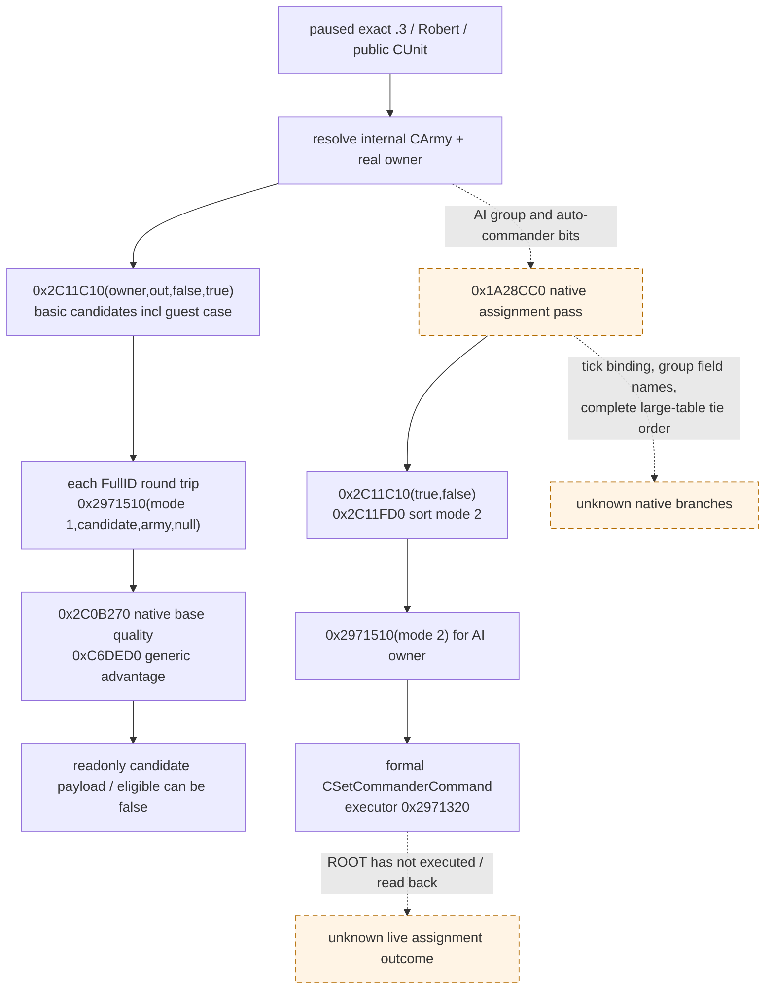

# CK3 1.20.0.3 将领候选、原生排序与正式任命资格

2026-10-03 研究，状态 `research / exact static-confirmed`。本包不启动 CK3、不连接 SDK、不发送命令。当前 Robert 军队 `83886367` 的将领实际缺席是 ROOT 已取得的独立生产输入；本文没有自行读取名单，也不把合法候选或任命结果写成 live。

构建为 CK3 **1.20.0.3 / Steam 25652598**；安装目录 `Z:/SteamLibrary/steamapps/common/Crusader Kings III`，EXE SHA-256 `94B55397ABB687A3DCD436805A5D885E6BE90FA6C693FEB44A9E3BBEEADE02A6`。地址均为 image-relative RVA。外置可复核产物 `Z:/ck3_mod_rewrite_process_assets/g2-resume-20261003/commander-native-candidates/` 保存解码器、逐指令字节与 SHA、stock 摘录和 ABI 回执。只使用该实际安装目录，不沿仓库旧 stock 副本外推。

## 现有接口与必要增量

现有 `ck3_query_combat_simulation_inputs` 及 actor-army-role 口只读**已经任命**的 `CArmy+0x120` full CharacterID，复核 `GetArmyCommander 0x24E9ED0`，并复用 `GetCommanderAdvantage 0xC6DED0(character,-1,false)`。这不是可任命候选枚举。没有现有候选名单 MCP 或任命动作可直接复用；适当增量是同一军队上下文中的只读 candidate collection + 正式任命资格，不另造人物候选假名单。

## 原版脚本规则

`common/scripted_rules/00_rules.txt` SHA `C7BA2AE71E4461E88C6D5C86D8FC15FA7CCC73EDAE1E28FB3B65F0E362C4560F`，1–13 行：`can_command_troops` 决定显示候选，`can_command_troops_now` 决定当前资格并允许解释当前不可用原因。两者 root 是候选，`scope:army_owner` 是实际军队所有者。

`common/scripted_triggers/00_war_and_peace_triggers.txt` SHA `CBE25F04D61A2F2899E29B15CD6AEFFD1FFC33154655C965FD441F3727183545`：619–636 基础要求存活、成年、非无能、非人质；本人可带本人军队，否则经性别战斗者规则；AI 所有者另要求候选 AI、最高头衔低于 hegemony。640–670 当前要求存活、成年、未监禁、未旅行，相同性别／本人分支；AI 所有者要求候选 AI；已有活动、觐见变量、冥想／圣祠／请愿／主持宫廷标志和严格被巡视状态可拒绝。**基础与当前分开求值，不能以一条替代另一条。**

原生规则入口 `bool 0x1D63180(bool basic, int32 candidate_full_id, int32 army_owner_full_id, reason_collector*)`：候选根由 `0x9F9E20` 建立，owner 作为 kind-4 作用域注册；加载规则数据库 `0x1D65660()->+0xEF0`，`basic=true` 取首个 `0xD0` 槽，`false` 取下一个；reason null 调 `0x372DF30`，非空调 `0x372E4F0`。原版规则会随实际 playset 求值，不手抄触发器决定最终资格。

## 无窗口候选集合

```cpp
void CollectCommanderCandidates( // 0x2C11C10
    CCharacter* army_owner,       // RCX
    NativePointerVector* out,    // RDX; +0 data, +8 capacity, +0xC count, +0x10 allocator
    bool filter_now,             // R8B
    bool allow_guests);          // R9B
```

GUI 列表 `CPotentialCommanderCharacterList` 更新 `0x1483260` 从 Army→Unit→实际所有者出发，调用 `(owner,out,false,true)`；**此 receiver 只用于确认语义，不在 headless 查询中建立 GUI。** 原生军队 AI `0x1A28CC0` 在 `0x1A293B3` 调 `(owner,out,true,false)`。因此原生AI集合优先读目前可用且不需先招募的候选；玩家列表可以保留暂不可用候选并单独发布其最终资格。

集合按以下真实入口遍历并以指针去重：owner 自身；`0x28CBCD0(owner)` 的 `landed+0x138` ID 列表，逐一解析其对象+0x2C→对象+0x128 的 Character，并追加该角色的 court 列表；`0x28CBD50(owner)` 的 `landed+0x150` ID 列表，逐一解析对象+0x28→对象+0x128 的 Character，并追加其 court；owner 自己的 `landed+0xA8` CharacterID court 列表；owner `landed+0x218` relation ID 列表的 relation+0x20 Character。两个 landed 列表的具体语义名称尚未单独映射，故保留原生入口与字段，不猜成两种固定封臣关系。

入列 helper `0x2C11820(out,candidate,owner,filter_now,allow_guest)`：先去重，要求 Character tag/full ID、无 dead component `+0x1D0`、原生 character-state getter `0x289E9F0>=3`；通过 membership `0x2C12170(candidate,owner_id,allow_guest && !filter_now)`；通过 basic rule `0x1D63180(true,...)`；`filter_now=true` 时额外通过 `0x2C129A0(candidate,owner_id,true,null)`。成功 append 仅写 caller-owned vector。

`0x2C12170` 是军队 owner / employment / mercenary / holy-order membership 判断，**不是 scripted basic rule**。它允许本人，检查 `0x28BFC70` / `0x28C0180` 的所属关系，在 allow_guest 分支可接受 owner 的相关来客；其余检查有效 mercenary 公司雇主或 holy order 的 owner FullID。不得只因为人物在一个 save/court 清单中就把它标成可任命。

## 正式最终资格与任命入口

```cpp
bool CanSetCommander( // 0x2971510, formal command predicate
    int mode,             // ECX: player/manual=1; native AI=2
    CCharacter* candidate,// RDX
    CArmy* army,           // R8; internal CArmy, not public CUnit
    NativeString* reason);// R9; null allowed by actual AI callsite
```

检查候选与 Army 的 tag/full ID→从 Army+0x124 解析 Unit→Unit+0x174 实际 owner，检查 owner 有效；`0x29716C0(army,reason)` 要求 Unit+0x170 <= 0（大于零拒绝，暂保留字段语义）；`0x29675F0(owner,mode)` 区分玩家所有权与 AI controller；再查候选无 dead component、state>=3、membership(false)、基础规则、当前规则 `0x2C129A0(...,true,null)`。`mode=2` 要求 owner AI state，**Robert 玩家查询必须使用 mode=1**；mode=2 不得用作玩家任命的唯一 readiness。

`0x2C129A0(candidate,owner_id,true,reason_string)` 对当前候选另拒绝已处于特定 army action、当前其他 army assignment、禁止状态的 relation，随后调用 `0x1D63180(false,...)`。未知枚举名字不影响调用原生 final boolean，但不得伪造逐条已知原因。此调用不执行任命。

`CSetCommanderCommand` primary vtable `0x476A418`，validation slot `+0x30` 为 `0x2971480`，从 48-byte 包 `+0x20 mode / +0x24 candidate FullID / +0x28 CArmy FullID` 解析实际 receiver后尾调用 final predicate。执行 secondary vtable `0x476A4B0` 的 `+0x08` 为 **`0x2971320`，这是写状态的 executor，不得在只读查询中调用。** 它会先解除候选原来军队，再 `0x24DFA10(army,candidate_id)`，最后 `0x24E8120` 刷新军队；只能在后续正式 typed command 路径使用并独立读回结果。本包没有新建、clone 或提交该包。

## 原生 AI 配将和质量

原生 AI `0x1A28CC0`：若无相关军队组返回；玩家自动配将 bit 可跳过整轮，另一个 bit 决定是否保留玩家将领；遍历所属 CUnit/CArmy，跳过不属 owner、已有应保留将领的部队。按当前有效 regiment soldier sum × `max(group+0x24,1)` 构造军队价值，并降序排列；精确全部 group 字段名尚未查明，不能简单称作“最大的军队优先”全量复刻。

然后收集 `(true,false)` 当前候选，必要时移除玩家人物，`0x2C11FD0(owner,vector,2)` 原生排序；依次将第 i 位候选与第 i 位军队配对，`0x2971510(2,candidate,army,null)` 成功才创建 mode-2 `CSetCommanderCommand` 并提交。候选失配时并未在该循环重试所有其他军队；我方可先做确定的单军 final-eligible 最优选择，质量差距记账。

排序 mode 2 comparator `0x2C17C90`：若 owner `0x28B16B0(owner,1)`（indexed skill getter，读 `Character+0xDC`）达到全局 `*(image+0x54504B8)+4` 阈值则 owner 优先；否则比较 `0x2C17B20({flags_ptr},candidate)` 分数降序（严格 `>`，同分原顺序保留于已闭合小表稳定插入分支；大表完整 merge 同分尚未逐分支冻结）。mode 2 的 flags 只有 `2`，不会取 bit-2 的 siege-quality附加值；当前可直接复用 **`int32 0x2C0B270(candidate)`**，读 `Character+0xDC` 与 modifier `0x19B` 的 Q100000 截零整值之和。这与现有 commander advantage 的基础两项相同；`0xC6DED0` 仍是包含上下文的独立 final getter，不能把两个值互换。modifier名称和 global owner阈值名称保持未知。

只读最小质量字段：候选 full ID、原生 generic advantage `0xC6DED0(candidate,-1,false)`、上述 native AI base quality `0x2C0B270`、当前军队 mode-1 final boolean。可复用已有 `ReadCommanderRollContext` 与目标地形取得 roll endpoints，作为后续按目标选择的增量；本包不要求此项作为基本名单完成前置。



## 下一项施工与边界

先复用已有 CUnit→CArmy、generation round-trip、paused binding 和 caller-owned native vector 生命周期；同一只读軍队查询新增集合、mode-1 final资格与两个原生质量值。当前基础树已落盘，允许 observer 实现施工。没有 SDK/list result 时保持 `research/static-ready`，没有正式 command+独立 CArmy+0x120/原将领状态读回时不能宣称任命完成。本包无新增游戏日、无军队输入、无 G2 或战斗胜利信用。
