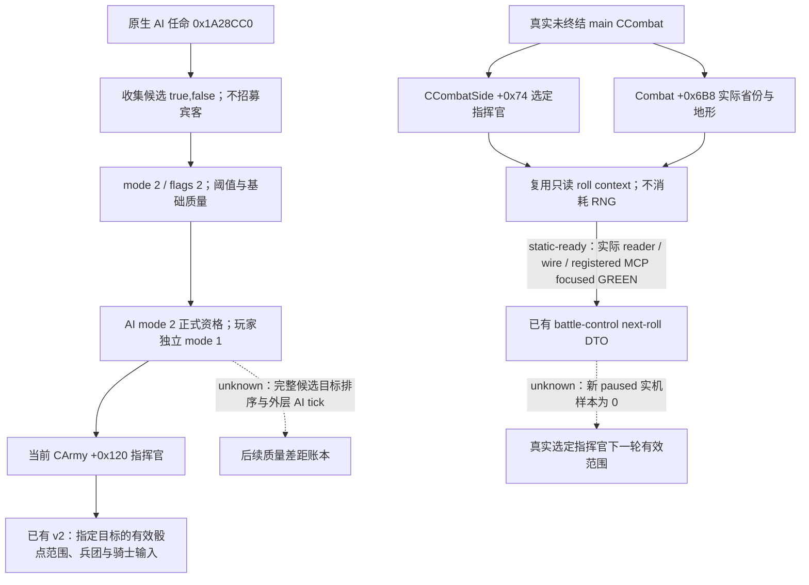

# 指挥官、骑士与兵士的有效战斗输入（CK3 1.20.0.3）

本专题把当前可用的最终输入与真实战斗选定指挥官输入放在一起。原生研究已落盘；本次新 reader 与注册 MCP consumer 的 focused 场景均 GREEN，能力为 **static-ready**，新增实机样本、游戏动作和推进天数均为 **0**。当前围城继续执行，本专题不增加玩法门禁。

精确构建为 CK3 **1.20.0.3 / Steam build 25652598**，EXE SHA-256 `94B55397ABB687A3DCD436805A5D885E6BE90FA6C693FEB44A9E3BBEEADE02A6`。原版数据来自实际安装 `Z:/SteamLibrary/steamapps/common/Crusader Kings III/game`。施工前冻结的原生树、证据分层与查询设计位于 `Z:/ck3_mod_rewrite_process_assets/g2-resume-20261003/combat-commander-traits/native-commander/` 的 `NATIVE-TREE.md`、`native-plan.json`、`native-tree-frozen-sources.graph.md`、`EVIDENCE-PINS-v2.json`；最终 plan 引用 `evidence/plan-source-*` 冻结副本，首版 `native-tree.graph.md` 保留为历史。该 plan 的既有检查仅证明结构与文件绑定一致，不等价于语义或实机验收。本专题直接复用，不重新扫描 EXE 或重复检查。

## 原生决策树与角色边界

原生 AI 任命 pass `0x1A28CC0` 对军队组求值，经 `0x2C11C10(owner,true,false)` 收集当前非宾客候选，以 mode 2 / flags 2 按 owner 阈值及 `0x2C0B270` 的基础质量排序，再检查 mode 2 的正式任命资格。玩家使用独立 mode 1 资格；罗贝尔既有任命闭环已经 GREEN。flags 2 没有选中 `0x2C17B20` 的 bit 2 可选围城质量分支，因此不能仅凭 military_engineer 名称声称其自动排在通用质量前面。外层精确 tick、军队组权重名称与完整大表同分顺序仍未闭合。

`CArmy +0x120` 是某支军队当前任命者；`CCombatSide +0x74` 是战斗一侧已经选定的指挥官。后者不是逐军队候选表，也不能由军队任命者列表推算。未来接战角色与原生参与者插入顺序由路径工作包补齐；明确假设参与者的 v2 查询仍保留其假设标签。

## 有效修正与原版特质声明

已有 `ReadCommanderRollContext` 在目标地形上读取 modifier aggregator：分别把 Q100000 的 generic modifier `0x115/0x116` 与地形在 `+0x776/+0x778` 指定的 modifier 截断成整数，再与加载中的基础端点槽 `0x5C699BC/0x5C699B8` 相加。通用优势另由 `0xC6DED0(character,-1,false)` 读取。读取的是当前有效结果，会包含实际 XP、文化和 rite 条件；特质文件中的声明不能替代这些值，也不需调用随机掷点函数。

| 已安装原版声明 | 声明的作用 | 使用边界 |
|---|---|---|
| rough/open terrain expert；forest/desert/jungle 专家 | 对声明中的对应地形提供优势；基础声明为 +2 | 目标地形与当前有效条件必须匹配，不能机械加到 generic advantage |
| reckless；cautious_leader | 基础 min/max 分别 −2/+3、+2/−1 | 以返回的有效端点为准，保留条件修正 |
| flexible_leader | enemy_terrain_advantage = −0.2 | 不替代当前 phase 的实际地形贡献 |
| forder；strategist | 声明 no_water_crossing_penalty | phase constructor 读取攻击方有效 flag `0x1A4`；特质图标不证明实际绕过河流惩罚 |
| military_engineer | 基础 siege_phase_time = −0.1，XP 档位 33/66/100 | phase timer 与 daily work 分开，缩短阶段时间不等于同比增加每日围城工作 |
| aggressive_attacker；unyielding_defender | 当前安装中的旧 +10 优势行已注释，活跃基础声明影响 hard casualties | 不沿用旧版特质名称启发式 |

完整声明、条件与冻结片段保留在原生证据目录。围城阶段 getter `0x251E7A0` 使用实际 `CArmy +0x120` 角色和有效 modifier `0x11D`；daily-work getter `0x251F170` 是另一条路径。它们的新来源拆分属于后续观测入口，不阻断当前围城。

## 已有查询能够发布什么

| 现有 MCP | 已有观测 | 边界 |
|---|---|---|
| `ck3_query_army_commander_candidates_v1(army_id, expected_revision)` | 当前任命身份、玩家 mode 1 最终资格、候选原生基础质量与 generic advantage | 没有目标省份参数，不能比较未任命候选的目标骰点范围；既有 GREEN 结果无需重复采集 |
| `ck3_query_army_strengths(army_ids, expected_revision)` | 当前/最大人数与原生 AI base power | 不包含完整目标、克制或胜率上下文；已知 GREEN 前态按需复用 |
| `ck3_query_combat_simulation_inputs(target, entry, ordered attackers, ordered defenders, expected_revision)` | 当前任命者的目标有效骰点范围；兵团身份、兵种、原生主战资格、目标最终属性与克制；骑士成员、武勇及最终效果 | 明确假设接触、固定参与者；`input_observation_ready` 不代表胜率模拟完成 |
| `ck3_query_battle_control_snapshot_v1(subject_army_id, expected_revision)` | 真实战斗 stored entry 的 fighting 人数、soft/hard 伤亡、伤害/坚韧/追击/掩护与 entry strength | 与 v2 重新求值的省份上下文分开；本次选定 next-roll bounds 为 static-ready，新 live 待采 |
| `ck3_query_current_battle_knight_v1(...)` | 真实 CombatID 中已绑定角色、兵团与军队的骑士当前战斗数值 | 需要实际战斗与同帧配对，不作为围城中的 precontact 查询 |

Exact .3 adapter 复用已核对的 `.2` producer：兵种 key、levy/men_at_arms 与 `fights_in_main_phase` 来自原生兵团；`0x26344C0` 在指定省份重算最终属性。骑士路径验证角色↔兵团↔军队，使用 `0x28BFC70`、`0x2C06B00` 读取最终效果，并与兵团最终 damage/toughness 互证。最终 class counter retention 来自原生 resolution，不能从兵种名称猜测。

骑士成员已经指向 `regiments` 内的兵团，人数与伤害只计一次；普通主战贡献按原生 `fights_in_main_phase` 排除围城兵种。precontact 的 `current_soldiers` 包含 soft casualties，不能替代后续阶段的 `current_fighting_raw`。`effectiveness_components=unavailable` 表示来源归因缺失；若 final effectiveness 与最终属性可用，就保留这些独立有效输入，不增加额外门禁。

## 既有实机证据与最小下一次采集

既有 v34 叶片 `Z:/ck3_mod_rewrite_process_assets/g2-resume-20261003/war-battle-phase/actual-battle-discovery-v34-02/004-ck3_query_combat_simulation_inputs.json`，SHA-256 `64c8c2b67b3aec4a2a4ca3a87bf400fa0c5acd2e95a192b9e2fc0caa108c77a0`，是罗贝尔对 rebels 的明确假设接触。该时点罗贝尔为 public CUnit **83886367** / CArmy **50331794**、owner **29829**，当时尚无指挥官，合法目标骰点范围为 **0..0**；40 个兵团、14 名骑士、武勇合计 120、final effectiveness **175000/100000** 已观测。此处沿用 **production-live primitive**，不把旧无指挥官端点冒充任命后罗贝尔的结果。

当前已任命的罗贝尔仍以 public CUnit 83886367 / CArmy 50331794 在 2604 围城。最有价值的新样本是一次 fresh v2 返回的任命后目标上下文。复用 `battle-terrain-actual/future-engagement/composition/compose_calls.py` 的新 `ROOT-FRESH-STAGE-B-CALLS.json`：目标、由 fresh preview 最后一条边得到的入口和双方有序 public CUnit 数组原样传入；分别保留共享 active war 的场景。旧入口 2634 不作为未来常量。此假设不能证明罗贝尔实际未来接战一侧，也不能把 `query_actual_contact_scope(...2640)` 伪装成已经从 2604 抵达。

回执须独立发布 owner 29829、public ID 83886367、CArmy 50331794、`commander.status=available/character_id=29829`，以及 `battle_context.status=available`、匹配目标省份与整数端点。保留查询帧、episode、native revision 与文件哈希；ACK 或 transport GREEN 不代替上述结果。名单/强度查询只是已有前态依赖，未出现新变化时无需再采。

参数类型、字段和 Root 现有只读 capture 约定见 `combat-commander-traits/recipe/V2-TARGET-CONTEXT-RECIPE.json`；贡献字段与旧实机汇总见 `knights-maa/OBSERVABILITY-FIELDS.json`、`MINIMUM-RECIPE.json`。本专题合成不再运行这些旧采集。

## 本次选定 next-roll bounds 施工边界

补齐现有 `selected_commander_next_roll_bounds` DTO 的最小 reader 已获 Root 授权：导出并复用同一只读 context helper，在既有 battle-control 双采样中使用真实省份和 `CCombatSide +0x74` 选定身份。只有 **未终结 main phase** 才属于该输入的适用时点；其他阶段与 finalized 状态明确保持不适用。合法 selected identity `-1` 表示缺席，可得 **0..0**；读取失败属于 unavailable，不能当成零。非缺席角色的整数端点也须原样保留，不能仅凭零值反推身份缺席。

生产投影涉及六个源码路径及既有 CMake/CTest executable 的新增分支。实际原生 reader/wire 的 **6 个 focused case GREEN**：8 个真实 TU，`/O2 /W4 /WX /permissive-`，`--selected-roll-only`，compile/run exit 均为 0，总耗时 **8.6518686 秒**。回执为 `combat-commander-traits/native-commander/fixture/RESULT.json`；native wire 38578 字节，SHA-256 `e421a011dbde4495f274cf552ad06b5ee13c22d342ea7254b4d569ef3a46396e`，测试 EXE 378880 字节，SHA-256 `ad71bccdfe787b65d3aba858001b8ae0e57200ac4e0d8a7d7122180105910feb`。

注册 MCP consumer 的 **6 个场景单次 GREEN**，以 `-B -O` 运行，耗时 **3.0 秒**。回执为 `combat-commander-traits/knights-maa/ROLL-BOUNDS-REGISTERED-MCP-RESULT.json`，SHA-256 `58bfe344c6a09924fda141b8d7af6f26bae076aae7bf0105b453e5be56ada42d`。这两层证明能力 **static-ready**；两侧完整 resume 仍 unavailable，不称 `fixture-live` 或完整战斗模拟。未运行旧矩阵或整个 DLL 构建，未产生新 paused live。

首轮 harness 链接 RED 保留在 `native-commander/fixture/RESULT-retained-1791029705386879700.json`，该 attempt 尚未运行场景。修复只用 focused macro 给未调用的旧 1.19.0.6 endpoint 提供 unavailable 链接 stub，没有替换实际 `.2/.3` reader；最终 GREEN 不覆盖或删除首轮失败。

本次口仍是现有 `ck3_query_battle_control_snapshot_v1(subject_army_id, expected_revision)`，要求同帧暂停范围内的**玩家可控军队已经 in_combat**。新 bounds 的 live 采集须等待罗贝尔真实进入适用 main 战斗。外方 transition 的 current observation 使用独立 `AttachBattleCurrentObservationV1` 路径，不发布本次新 bounds，因此不能用 foreign transition 查询验收此补口。既有外方战斗观测仍保留原 primitive 范围，不记罗贝尔战果。

## 当前 readiness 与后续入口

- 原生树与 exact-build 输入研究：**research** 已落盘，复用既有一致性检查。
- 既有 v2 兵团/骑士贡献输入：沿用 **production-live primitive**；本次新增当前上下文样本 **0**。
- 既有玩家指挥官任命：沿用原专题的 GREEN 闭环，未重复执行。
- 任命后罗贝尔的目标骰点范围：fresh v2 实机待采，不记新 live。
- 真实 main 选定指挥官 next-roll bounds：**static-ready**，原生与注册 MCP 的各 6 个 focused 场景 GREEN；罗贝尔真实接战后的新 paused live 待采。
- 全候选目标排序、命名特质的完整来源归因、动态援军与完整战斗模拟：仍为后续质量差距；不阻挡可用最终输入或当前围城。既有 `monte_carlo_ready=false` 保留，未完成伤亡分配、追击、结束/撤退与 phase RNG/effects 不宣称胜率。

父专题：[指挥官候选与任命](commander-candidates-and-assignment-12003.md)、[战斗模拟输入](combat-simulation-inputs.md)、[1.20.0.3 战斗 readiness](battle-readiness-1.20.0.3-2026-10-03.md)。报告汇总入口为 `docs/autonomous-agent-progress/`，本包只提供可合并字段；不修改共享报告或 Git。
