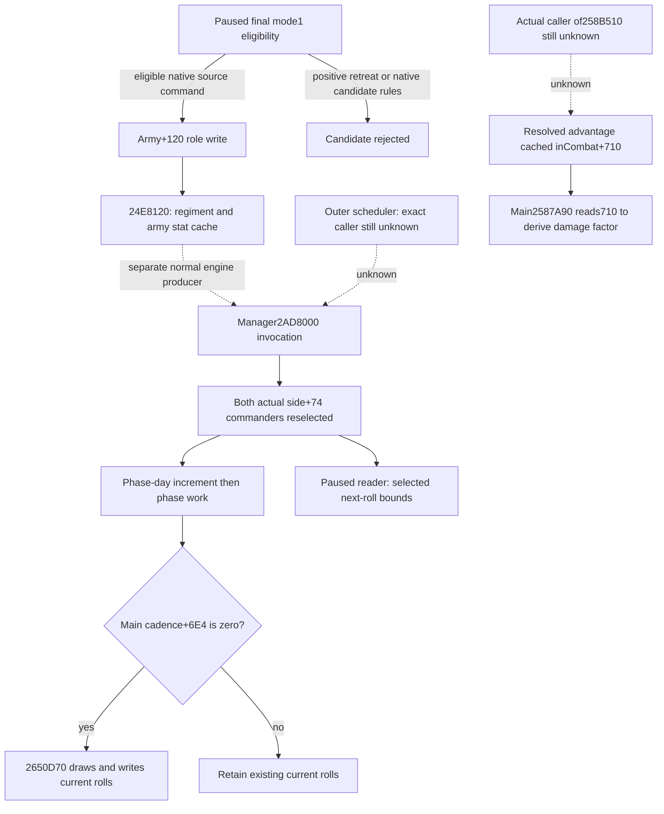

# 战中换将资格、角色转移与生效时序（1.20.0.3）

研究于 2026-10-03 开始，2026-10-04（Asia/Shanghai）收口；真实完成/补录时刻见同包 `REPORT-FIELDS.json`。本专题是 `research`：既有任命 primitive 与 selected next-roll bounds 的 GREEN 直接复用，本次新 actual、动作、native 执行与测试均为 **0**。原生静态边已冻结；它们不构成战中换将的实机完成声明。

游戏版本固定为 **1.20.0.3 / Steam build 25652598**，EXE SHA-256 为 `94B55397ABB687A3DCD436805A5D885E6BE90FA6C693FEB44A9E3BBEEADE02A6`。身份复用既有 exact pin，没有再扫或重哈希整个 EXE。旧证据与源文档从 `Z:/g38` 只读冻结，初始 HEAD 为 `56d8031cc211ff9be2ceb13bd66e722da6233947`；后补公开签名单独记录文件 hash，不能把移动中的源码当作同一帧证据。

外置包为 `Z:/ck3_mod_rewrite_process_assets/g2-resume-20261003/combat-commander-quality-v46/in-battle-assignment/`，包括 `SOURCE-FREEZE.json`、`SOURCE-SUPPLEMENT.json`、稳定 `evidence/`、`native-plan.json`、`native-tree.graph.md`、`NATIVE-PLAN-CHECK.json`、`IN-BATTLE-READONLY-CALLS.json`、`NEXT-CONTEXT-RECIPE.json` 和报告字段。完整 coalition 排序由 [实际战斗选将专题](commander-effective-combat-inputs-12003.md) 及同阶段 `side-selection/` 研究维护；本专题只解释资格、角色写入和消费时序。

## 正式 mode 1：战斗状态本身没有直接禁令

`CanSetCommander 0x2971510..0x29716BC` 的完整冻结体先检验角色、军队、所有者及 membership/loaded rules，再调用候选当前状态规则。目标军队 gate `0x29716C0` 检查关联 `CUnit+0x170`：**大于 0 的 retreat raw 拒绝任命**。完整 gate 不读取 `in_combat` 或 combat phase。这闭合的是“没有直接战中禁止分支”；特定候选仍必须由当前帧正式 `CanAssign(..., mode=1)` 返回资格，不能把所有战中候选概括为合法。

候选当前规则 `0x2C129A0` 在第三参数为 true 时检查 `Character+0x1B8/+0xF4` 的现存 CArmy 绑定，仍绑定有效军队会拒绝；`+0xF8` action 的 `+0x44==1` 也有拒绝分支，该枚举此处保持 raw。因而 executor 中存在“先解除旧军队，再设新军队”的分支，**不证明当前指挥官可以绕过正式 gate 直接转移**。

已任命 Robert 29829 请求再次指挥原军队时，现有 provider 先返回 `already_assigned`，不新建命令。这也解释既有 R15 结果中 current Robert 已任命、其候选 `can_assign=false` 的组合。需要任命新军队 `167772189` 时，先读该军队现有候选；公开参数要求非负有效角色 ID，不存在本包可调用的“传 -1 解除角色”入口。

现有 [候选与资格研究](commander-candidates-and-assignment-12003.md)、[玩家原生命令](commander-player-assignment-12003.md)、[任命 provider](army-commander-assignment-provider-12003.md) 已有独立军队 readback 的 production-live primitive。本次没有重跑这条 GREEN 链。

## 命令立即写军队角色，军队缓存与实际战斗选将分开

executor `0x2971320` 的有效旧军队转移分支调用 `0x28CC110` 解除旧角色，再对旧军队调用 `0x24E8120`。目标军队调用 `0x24DFA10`，在 **`0x24DFACC` 写 `CArmy+0x120 = newFullCharacterID`**，并建立新角色关系，随后 tail-call `0x24E8120`。

本次窄取 `0x24E8120..0x24E8206` 与两项直接 callee，闭合其主要效果：

- `0x2633340..0x2633AE0` 遍历有效 Regiment 子项，更新 ArmyReg 人数/strength 与十分量 stat caches。
- `0x24E11B0..0x24E1E9F` 聚合 `ArmyReg+0xF0..0x138` 等值、施加角色/所有者修正，返回 80B；调用者将五个 16B 写入 `CArmy+0x130..0x170`。
- `0x24E1368` 的 `+0x128` 读取对象是此前检验 magic `0x41725267` 的 **ArmyReg**，不能误写成读取 CArmy combat link。

这些完整直接体没有直接调用 side selector、写实际 `side+0x74` 或调用 `0x258B510`。它们的 loaded modifier evaluator callbacks 保持具体未解语义，不冒充完整回调图。已证实任命到军队角色的写入与缓存刷新，也已证实实际战斗选将另有 producer。

## 实际重选先于 phase work；当前骰点只在 cadence 归零重掷

侧选将函数 `0x264D790` 消费 `side+0x10` 的 Army 列表与各 `Army+0x120`。0/1 候选短路；多候选通过 `0x2589E10(character, side/context)` 排序后取首项。它与候选 query 的 generic/AI-base 分数不是一个尺度。

实际 constructor 在 `0x247A8C2/0x247A8E4` 初选并写双方 commander。另一个实际管理器 producer 的 chained `.pdata` 已从 `0x2AD8047` 反向闭合到 **`0x2AD8000`**，完整逻辑体至 `0x2AD81EE`。它遍历 manager `+0x20/+0x2C` 的 Combat generation ID；每个有效 Combat 的顺序是：

1. 设 `Combat+0x705=1`，两次调用 `0x264D790`。
2. 写 `Combat+0x94/+0x3DC`，即两侧 `side+0x74`，并写对应本地 side context `+8`。
3. 增加 `Combat+0x6B4` 的 phase-day，再依据 phase `+0x6B0` 调 `0x258CA60`（phase 2）或 `0x258C640`（phase 0/1 的适用分支）。
4. 清 `Combat+0x705`，处理结束等状态。

这证明 **每次该 producer 被调用时，重选发生在 phase work 前**。本次没有解码其外层调度 caller，所以不声称暂停状态立即重选，也不由函数名称推定固定一天的调用频率。当前 paused reader 读取缓存，不能驱动此 producer。

主战函数 `0x258C640..0x258C7C7` 刷新 strength/event rows 后检查 `Combat+0x6E4`。仅当 cadence 为 **0** 时，才经 `0x2650D70(side, currentProvinceTerrain)` 抽取并写入 `+0x6D0/+0x6D4`；之后推进取模 cadence。否则继续保留既存 current roll。

因此换将后的 actual selected ID/next-roll bounds、当前已掷 roll，可能体现不同消费时点。selected bounds reader 基于当帧 **实际 side+0x74** 和目标 terrain/modifiers，不消耗 RNG；新 commander 不能追溯改写已经掷出的 roll。该 public bounds 只适用于玩家可控、已接战军队的非 finalized main scope；当前 Robert 行军帧不适用。



## Resolved advantage 的写入体已知，实际 caller 时点保持具体缺口

`0x258B510..0x258B5A5` 的完整 writer 已冻结：刷新双方 strength/accolade cache `0x2650A80` 与目标 context `0x2651070`，两次读取 dynamic `0x258A470`，最终写：

`Combat+0x710 = cachedBase(+0x6C8) + side0Dynamic - side1Dynamic`。

主战已窄取的直接路径没有直接调用该 writer：`0x26505E0..0x2650665` 是完整 133B leaf，汇总有序 0x60B records 至 `side+0x98/+0xA0`，无 call；`0x264F080..0x264F0E3` 调 `0x26509C0`、按 event rows 调 `0x264EA10`，tail-call `0x264E680`。这些 event callee 与其他实际 `0x258B510` caller 的调度仍待研究。`0x2587A90..0x2587C5C` 只读既存 `+0x710` 并写 damage multiplier `+0x6D8`，不能称为优势重算。

临时 precontact v2 shell 显式构造并 resolve 新 context，所得优势用于给定 ordered participants/target 的条件比较；它不证明实际 Combat+710 已刷新。actual query 发布的 `resolved_advantage_raw` 可直接回答当前缓存值。剩余 caller 缺口不阻断现有实际观测，也不新增出兵或接战门禁。

## 质量比较和最小新采样

Robert 既有 generic **34** 仅是历史当帧 `0xC6DED0(character,-1,false)` 结果。同帧候选 generic 用相同 getter，可以进行同尺度比较；`native_ai_base_quality`、coalition contextual `0x2589E10` 与 actual resolved advantage 不能直接混作一项。特质/martial/modifier、军队/骑士/军团组成、reinforcement/ordered participants、target/terrain/holding/side role 或 phase/cadence 变化后，应取得新的上下文，不复用旧 34 或旧 hypothetical selected。

当前 Root 提供的 R22 基线是 Robert 29829、army `83886367` 在 2616 移动往 2640，2259 soldiers；新军队 `167772189` gathering，存档日 4025/raw date `53240928`，PID 28944 最小化；**没有实际玩家战斗**。这些是 Root 已有状态，本包未重复采样。

只有出现实际玩家接战并需要新 commander decision 时，既有 tools 的最小只读组合是：

```json
{
  "ck3_query_army_commander_candidates_v1": {"army_id": 83886367},
  "ck3_query_battle_control_snapshot_v1": {"subject_army_id": 83886367}
}
```

Root 现有 readonly capture runner 每次先取 fresh snapshot，并注入 **各自当前 `expected_revision`**；public army 参数是 full-generation CUnitID，不能把 internal CArmyID 填入。此组合是可复用/可选 recipe，不要求为 known GREEN 身份与强度再采样。

若正式候选合法并由 Root 执行既有 `ck3_assign_army_commander_v1`，它已经有独立 Army commander readback。随后一条 actual battle-control query 读取实际 selected commander、next bounds、current rolls、phase-day/cadence、base/resolved raw。需要识别刷新时，再在 Root 正常游戏推进后取一条 paused snapshot，以 **实际 date/phase-day/cadence** 变化作为发生了处理的观测；不能用 ACK、等待固定天数或再次调用 getter代替真实状态。

保持同一实际 CombatID、subject native CArmyID 与 side/participants 解释差异；生命周期变化则建立新 context。没有实际 Combat 时 query 不适用，Root 继续原本行军/接战任务。foreign transition-current-observation 属于另一条 `AttachBattleCurrentObservationV1` 路径，不发布本次 selected next bounds；不能拿 foreign 查询替代 public 玩家接战样本。

验证只有 native research plan 的文件结构与 hash 检查：首次重复 JSON/TXT evidence stem 导致 harness RED，保留失败 plan；修复列表 ID 后一次成功 render，保留 `1 RED + 1 GREEN`。它不验证 native 语义正确性，也不构成 live。另两次 leaf/pdata helper 假设失败与一次源文件名失败均已保留，修复限于提取器，没有能力 RED、原生测试或游戏动作。

剩余交付是 Root 真实玩家 main 接战时采集实际换将/selected/context 结果，以及未来按具体入口闭合 outer scheduler/advantage-writer caller。没有 new live 时不升级 readiness；本包不声称整场 resume、胜率或完整战斗循环完成。
