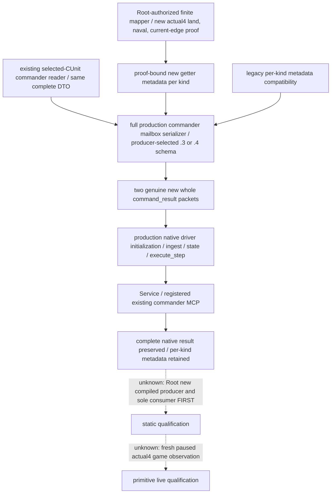

# Commander movement getter metadata — CK3 1.20.0.4

Actual work: 2026-10-07, Asia/Shanghai, ISO2026-W41. Source-first plan frozen before consumer implementation at `Z:/ck3_mod_rewrite_process_assets/g2-parallel-20261007/battle-commander-build25734779/movement-actual4-consumer/consumer-docs/SOURCE-FIRST-PLAN.md`. Adopted source is `C:/codex-ck3-background/parallel-integrations-20261007/commander-movement-metadata-12004`, base `caa4adc3d1278e324cf4ec19774028e9b9138e28`, containing the actual4 Core/CK3_12004 migration and874 commander package. The sampler ef/487 package is not a dependency of this work. Fresh movement3 local proof and the two native producer scenes are frozen. The sole consumer and topic are written source candidates; all new FIRST is **NOT RUN**.

Root identifies the current executable as CK3 **1.20.0.4 / Steam25734779**,101040248 bytes, SHA-256 `98702f88a547cde2eaf29a85f93b85f68ee4cf8148336a4f7afaeb75319dd518`. Authority is the installed-build `BUILD-FREEZE.json` at `Z:/ck3_mod_rewrite/artifacts/migrations/2026-10-07/installed-build/`, with later actual ASCII version proof at `Z:/ck3_mod_rewrite_process_assets/g2-background-20261007/upstream-build-migration/global-pe-diff/NEW-PE-METADATA.json`; its sibling `ROOT-DELIVERY.json` and `COMPACT-PE-DIFF-SUMMARY.json` record actual text/rdata changes. Initial named version metadata null remains historical. These identity records do not by themselves prove movement getter bodies or permit RVA inference. This child reads source only and does not read/hash an executable.

The published input is the current selected public CUnit's native land, naval and current-edge movement totals, signed Q100000. It is independent of candidate commander quality and final eligibility. Actual Army commander assignment, combat-selected commander identity and prospective candidate identity retain their separate roles; migration does not change any of them. Existing rate raw zero remains a value; unavailable raw remains null. This package changes metadata provenance and its accepted per-kind choices, with no new movement calculation or ranking policy.

Before this package, `ck3_12003_commander_mailbox.cpp:104..107` serialized literal old getter RVAs, while `army_commander_candidates.py` required those old values per kind. Publishing mapped actual4 functions with old provenance would misidentify the getters, and corrected metadata would fail the old strict consumer. The implementation supplies a native actual4 serializer/profile selection and accepts each proof-bound per-kind value alongside its legacy value. Parent/entry owner owns the existing reader/binder/DTO/serializer and normalizer hooks; this child owns only a new whole consumer and this topic.

| Kind | Existing legacy metadata | New actual4 metadata |
| --- | --- | --- |
| `land` | `0x24AA940` | `0x24AA920` |
| `naval` | `0x24AAC00` | `0x24AABE0` |
| `current_edge` | `0x24AB5C0` | `0x24AB5A0` |

The exact source receipt is `Z:/ck3_mod_rewrite_process_assets/g2-parallel-20261007/battle-commander-build25734779/movement-actual4-consumer/VERIFIED-LOCAL-RVA-TUPLES.json`, sourced from sibling `mapping-first01/FAMILY-MAP.json`. It records complete instruction-span normalized equality for land703 bytes across three declared fragments, naval409 bytes and current-edge260 bytes. Full decode, local control topology and ordered relative/RIP edge shapes are equal. Parent reports1632 bytes across four actual native reads, without hashing. This proves these local getter mappings; it does not qualify transitive callees, family ABI, compiled consumption or live execution. The addresses come from those bounded reads and local mapping, not an assumed global delta.

Legacy schema tags `ck3_12003_army_commander_candidates_v1` and `ck3_12003_army_current_movement_speed_v1` remain accepted alongside `ck3_12004_army_commander_candidates_v1` and `ck3_12004_army_current_movement_speed_v1`. The adopted `army_family_12004_identity.py` declares these explicit variants. Each genuine scene checks its producer-selected tag and intended per-kind metadata. The source string remains `native_selected_cunit_movement_rates`, as does `current_movement_speed.{land,naval,current_edge}.native_getter_rva`. The MCP remains `ck3_query_army_commander_candidates_v1` with `{army_id, expected_revision, target_province_id}` and only `army_id` required. There is no new DTO/MCP parameter or global readiness gate.

The focused producer emits exactly two native scenes, `01-actual4-movement.json` and `02-legacy-movement.json`, using the actual selected-CUnit reader and full production commander serializer, then wraps the complete output as `command_result`. Both scenes serialize the same complete DTO through their genuine native profile selection. Scene1 uses .4 tags and the new triplet; scene2 uses .3 tags and the legacy triplet. No Python rewrite supplies compatibility metadata.

The new public header is `xar_bridge/ck3_12004_commander_mailbox.hpp`. Its entry is `xar::ck3_12004::SerializeArmyCommanderCandidates12004(const ck3_12003::ArmyCommanderCandidatesSnapshot&, ck3_12003::CommanderCandidatesReadResult, uint64_t query_sequence, uint64_t snapshot_revision, int32_t date_raw, std::string_view step)`. The existing six-argument `xar::ck3_12003::SerializeArmyCommanderCandidates` remains the legacy entry. The native entry owner supplies this shared hook and the focused producer.

The minimal compiled recipe follows the existing current-martial CMake pattern: one NEW fixture TU, `include`, `cxx_std_20`, Parent's actual4 configuration, linked once to `xar_ck3_12002_runtime` and `user32`. The adopted runtime contains the actual4 adapter/core/profile and shared commander reader/serializer. Do not add private copies of those shared source TUs to that linked fixture. The target is `xar_ck3_12004_commander_movement_metadata_test`, with CTest name `xar_ck3_12004_commander_movement_metadata`. Its producer receives a single output-directory argument. Root owns this focused compile/run; this package does not invoke the old19-case movement target or its registered consumer.

The frozen synthetic setup uses public CUnit `83886367`, native CArmy `50331794`, owner/player `29829`, date `53236608`, native revision `11`, query sequence `7` and current province `2669`. The actual assigned commander is `30000`, with current total martial `17`, skill index `1` and source_character_id `30000`. Its source is `native_current_assigned_commander_total_skill_cache`. The sole candidate `30001` is independently available and assignable, with native_ai_base_quality `125`, generic_advantage_points `0` and siege_phase_time_modifier_raw `0`. The actual commander is distinct from the prospective candidate. There is no requested target or candidate target-roll leaf.

The native route is `complete_empty`, source count `0`. Land raw `125000` and naval raw `250000` are independently available at scale `100000`; each native fixture callback runs once. Current-edge retains the selected profile's metadata but has status `not_applicable`, raw `null` and reason `empty_route`, so its callback count is `0`. These are explicit synthetic fixture values and getter counts, not game measurements. The two profile selections preserve all other body fields.

The written method is `CommanderMovementMetadataServiceTests.test_whole_native_query_registered_mcp_compound` in `ck3_autonomous_player/tests/test_commander_movement_metadata_service_12004.py`. It consumes only the two genuine native whole envelopes. It uses real production driver initialization, frame ingest and state, command execution/history, Service and registered MCP. Only transport endpoint/capability advertisement and the paused player frame are synthetic. Assigning transport request_id is correlation; no native result row, metadata value or payload signature is changed. No derived payload, row replacement, re-signing or hash operation is used.

The sole method checks complete native body equality, actual4 per-kind metadata, legacy compatibility, the hardcoded current/candidate identities and values above, route/rate status, query/frame identities and unchanged registered query parameters. It also compares the two scenes' complete roles, candidate rows, movement context and nonmetadata rate fields. Assertion projections do not modify either original wire. Its receipt retains original wire paths and exact loaded source paths. Source import paths point to the adopted actual4 tree and its tools/workshop dependencies. Genuine native packets are required; absent packet-directory input reports NOT RUN. No handwritten Python packet substitutes for a compiled producer.

Root sets `XAR_COMMANDER_MOVEMENT_METADATA_NATIVE_DIR` to the focused native output and `XAR_COMMANDER_MOVEMENT_METADATA_PROJECTION_ROOT` to the adopted tree. The optional `XAR_COMMANDER_MOVEMENT_METADATA_SERVICE_REPORT` overrides `commander-movement-metadata-service-compound-result.json` under that output. Invoke only this new method with Root's dependency-complete Python using `-B -X utf8`; detailed recipe is `consumer-docs/PROOF-BOUND-CONSUMER-RECIPE.md` under the external directory below.

Current source-quality status is **source implementation candidate with fresh local getter mapping and a frozen whole producer contract**. The new producer, sole consumer, native/live and complete-loop qualifications are all NOT RUN at child handoff. A Root GREEN can qualify static whole consumption; fresh paused actual4 game observation remains a separate qualification. This child performs no imports, tests, builds, native/game/SDK/process actions, hash, Git mutation or shared source changes. Parent/Root own focused FIRST, integration, daily/weekly report merge and commit/push. External source/API ledger, recipe, delivery and Oct7/W41 fields are under `Z:/ck3_mod_rewrite_process_assets/g2-parallel-20261007/battle-commander-build25734779/movement-actual4-consumer/consumer-docs/`.
