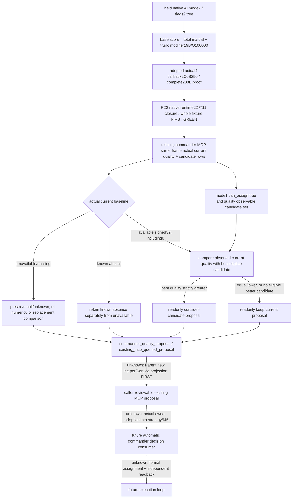

# Readonly commander native-quality proposal — CK3 1.20.0.4

Source-first work: 2026-10-07, Asia/Shanghai, ISO2026-W41. Owned tree is C:/codex-ck3-background/parallel-integrations-20261007/commander-quality-proposal, base `7a0474f359d6251e4f0b125ee74e2a617e8c2e96`. This document is sealed before Parent authors the new proposal helper. It records an input-led counter-policy; no strategy, assignment, game or SDK execution is performed here.

The existing source census found no formal commander chooser: quality is observed in bridge queries, while strategy.py and the M5 formal collector do not consume it. This package therefore introduces a readonly proposal; it does not fix a reproduced37→25 replacement bug or complete a formal planner. Its independent value is an existing queried MCP result that a caller can review. No plan_turn/M5 automatic consumer or assignment execution is added.

The original native source is [commander-candidates-and-assignment-12003.md](commander-candidates-and-assignment-12003.md):59..61 and the graph/source ledger in [current-assigned-commander-native-base-quality-12004.md](current-assigned-commander-native-base-quality-12004.md). Native mode2/flags2 reaches base scorer2C0B270 through scorer2C17B20 and comparator2C17C90; owner threshold priority is separate, and flags2 do not take the mask4 siege score. Base quality includes total martial and the effective modifier19B term. Player final assignment qualification remains the existing independent mode1 predicate.

The adopted actual4 getter is2C0B250, complete208B, old range2C0B270..2C0B340 and new2C0B250..2C0B320. The source proof is `Z:/ck3_mod_rewrite_process_assets/g2-background-20261007/upstream-build-migration/army-family-12004/commander-supply/support-first01/support_2C0B270-DETAIL.json`; source pins are `native_bridge/research/commander12003_source_pins.json:378..400` and the actual4 support ledger. These held proofs are reused, not reread as binary or requalified. Native quality is not generic advantage, martial alone, prowess, trait count or win probability.

Root recorded R22 FIRST GREEN for four genuine whole native query packets and the sole registered Service consumer on the unique nativeRuntime22/711 build-closure line. The existing receipt is `Z:/ck3_mod_rewrite_process_assets/g2-parallel-20261007/commander-quality-first/freshFIRST-r22/ROOT-DELIVERY.json`; its new native/consumer evidence is `native-first01/NATIVE-FIRST.json` and `consumer-first01/current-commander-native-ai-base-quality-service-result.json` under that directory. Native FIRST was one invocation/62 checks/four packets, and consumer FIRST was one method/four whole occurrences. Root classifies this as static-ready fixture qualification, with synthetic raw storage/paused frame, paused_live_validation=false and new_g2_live_credit=0. This package reads that small receipt once and reuses its results, without rerunning qualification or reading native bytes. R22 does not qualify a fresh paused current-role scalar, the new proposal, automatic consumption or assignment.

| Input | Exact source and role | Use in this proposal |
| --- | --- | --- |
| Current identity/status | Actual CArmy+120, existing FullCharacterID resolution and GetArmyCommander agreement | Current is independent of candidate membership and CombatSide selected identity |
| Current native base quality | current_commander.current_native_ai_base_quality, source native_current_assigned_commander_ai_base_quality | Use only its observed signed32 value; legal0 is a value, null remains unavailable/missing |
| Candidate quality | Original candidate row native_ai_base_quality with quality_observable | Compare the same native score; do not substitute generic advantage |
| Candidate final eligibility | available/final_eligibility_observable/can_assign, existing player mode1 | Only original observable can_assign=true rows can be a replacement candidate |
| Same query frame | Existing Army/owner/date/revision/query_sequence and snapshot | Proposal derives from this returned query; no new read or native DTO change |
| Current candidate finalfalse | Independent current-role observation plus a possibly false pool row | False does not invalidate keeping an already observed current commander |

The counter-policy is deliberately smaller than the original army-group allocation. It scans original observed eligible candidate rows for greatest native base quality, retaining their incoming order on ties. When current quality is available, a candidate must be strictly better to support a consider-candidate proposal; equality/lower supports keep-current. Current37 versus best eligible25 keeps current. A legally observed current0 versus best25 permits a better-candidate proposal. These37/25 and0/25 values are source/fixture examples, not newly observed R22 role values, and neither proposal executes a role change.

Unavailable or legacy-missing current quality stays null/unknown; the helper must not compare a fabricated0. Known current absence remains a distinct reason/scope from unavailable identity or unread quality. The readonly result can expose the observed best eligible candidate alongside that absence, without pretending a numeric current baseline or an executed assignment. Candidate can_assign=false is excluded from replacement selection but does not erase the independent actual current role or its value.

Parent's new source helper is `commander_quality_formal_proposal_v1.py`, API `propose_commander_quality_v1(candidates, *, snapshot, query_sequence)`. Existing Service.query_army_commander_candidates_v1 adds the top-level `commander_quality_proposal` projection after the existing native normalization. Native DTO/body, original candidate/current fields, MCP identity and parameters stay unchanged; no new route/capability is created. The result identifies scope `existing_mcp_queried_proposal`, read_only=true, automatic_consumption=false and assignment_executed=false. The helper's name does not grant formalplanner completeness.

Unadopted native inputs and replacement entries remain explicit:

- Full native army-group matching, owner martial threshold priority, outer scheduling and complete large-table tie behavior are not copied into this single-Army proposal.
- Target-specific roll inputs, selected-side/contextual advantage, siege score and named trait effects remain independent existing observations. This proposal ranks only the source-proved generic native base score, not complete battle utility.
- Automatic adoption belongs to the real owner of plan_m5_wartime_query_only and the strategy prewar commander choice. Those owners must incorporate the proposal into their actual decision path in a subsequent package; this one does not claim they already consume it.
- Formal assignment and independent Army+120 readback remain a later execution entry. An available proposal or ACK is not assignment, gameplay/G2 progress or a completed observe-decide-act-verify loop.

Readiness at source-first seal: existing R22 quality query plumbing retains its static-ready GREEN fixture scope; fresh paused live scalar is still unqualified. The new helper/Service projection is not yet authored or qualified by this child. The target for this package is caller-reviewable existing MCP readonly proposal reachability. No new CK3/SDK/input/process query, injector/UI, import/test/build, hash, EXE/native body read, old FIRST rerun, shared report or Git operation is performed. Parent/Root own helper/integration/qualification, reports and push. External source/API/report fields are under `Z:/ck3_mod_rewrite_process_assets/g2-parallel-20261007/commander-quality-proposal/native-ledger/`.

Parent qualification on 2026-10-07: the helper and existing Service hook are now authored against source base `7a0474f359d6251e4f0b125ee74e2a617e8c2e96`. The unique new method `CurrentCommanderQualityFormalProposalTests.test_registered_mcp_whole_wire_formal_proposals` passed once, exit 0, with all four original R22 whole native packets unchanged. It traverses actual protocol state ingestion, Driver, registered MCP query, Service normalization and the new proposal helper; only transport correlation and the enclosing synthetic paused scope are fixtures. Receipt: `Z:/ck3_mod_rewrite_process_assets/g2-parallel-20261007/commander-quality-proposal/FIRST/consumer-first01/consumer-launch-result.json`; the adjacent `commander-quality-formal-proposal-service-result.json` records the original wire paths, actual source module paths and four outcomes.

The outcomes retain current quality 37 over eligible candidate 25, preserve legal current quality 0 and propose the better eligible 25, leave unavailable current quality and gain null without a step, and exclude a final-ineligible candidate row without losing the independent current baseline. Each occurrence performs one native query and zero assignment commands. The better-candidate result contains only the existing canonical assignment step string. This is static-ready query-only proposal qualification: no native producer replay, old test invocation, build, game/SDK/input/UI/process query, binary read or hash was performed. Neither `plan_turn` nor M5 consumes this projection automatically; formal planner integration, actual assignment and fresh paused/live qualification remain open at the concrete entries above.
