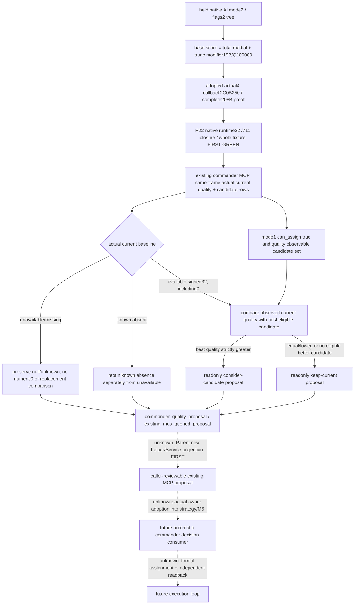
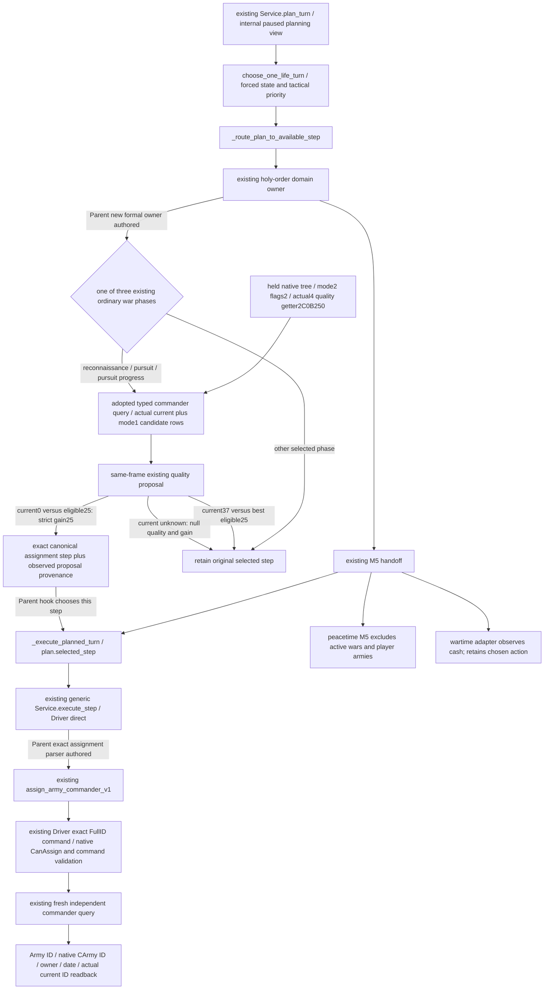
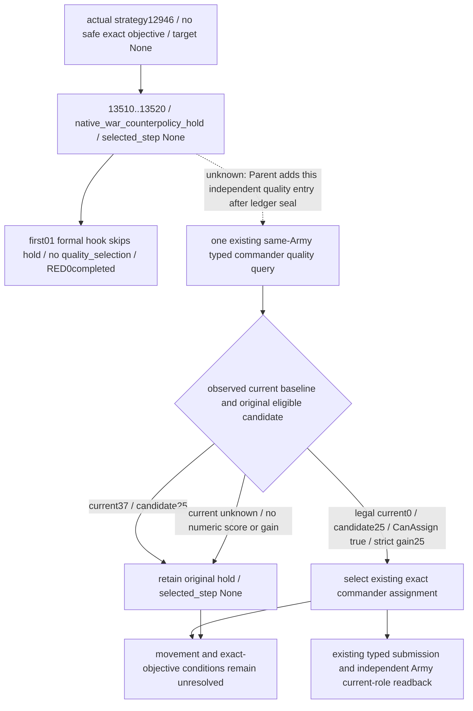

# Readonly commander native-quality proposal — CK3 1.20.0.4

Source-first work: 2026-10-07, Asia/Shanghai, ISO2026-W41. Owned tree is C:/codex-ck3-background/parallel-integrations-20261007/commander-quality-proposal, base `7a0474f359d6251e4f0b125ee74e2a617e8c2e96`. This document is sealed before Parent authors the new proposal helper. It records an input-led counter-policy; no strategy, assignment, game or SDK execution is performed here.

The existing source census found no formal commander chooser: quality is observed in bridge queries, while strategy.py and the M5 formal collector do not consume it. This package therefore introduces a readonly proposal; it does not fix a reproduced37→25 replacement bug or complete a formal planner. Its independent value is an existing queried MCP result that a caller can review. No plan_turn/M5 automatic consumer or assignment execution is added.

The original native source is [commander-candidates-and-assignment-12003.md](commander-candidates-and-assignment-12003.md):59..61 and the graph/source ledger in [current-assigned-commander-native-base-quality-12004.md](current-assigned-commander-native-base-quality-12004.md). Native mode2/flags2 reaches base scorer2C0B270 through scorer2C17B20 and comparator2C17C90; owner threshold priority is separate, and flags2 do not take the mask4 siege score. Base quality includes total martial and the effective modifier19B term. Player final assignment qualification remains the existing independent mode1 predicate.

The adopted actual4 getter is2C0B250, complete208B, old range2C0B270..2C0B340 and new2C0B250..2C0B320. The source proof is `Z:/ck3_mod_rewrite_process_assets/g2-background-20261007/upstream-build-migration/army-family-12004/commander-supply/support-first01/support_2C0B270-DETAIL.json`; source pins are `native_bridge/research/commander12003_source_pins.json:378..400` and the actual4 support ledger. These held proofs are reused, not reread as binary or requalified. Native quality is not generic advantage, martial alone, prowess, trait count or win probability.

Root recorded R22 FIRST GREEN for four genuine whole native query packets and the sole registered Service consumer on the unique nativeRuntime22/711 build-closure line. The existing receipt is `Z:/ck3_mod_rewrite_process_assets/g2-parallel-20261007/commander-quality-first/freshFIRST-r22/ROOT-DELIVERY.json`; its new native/consumer evidence is `native-first01/NATIVE-FIRST.json` and `consumer-first01/current-commander-native-ai-base-quality-service-result.json` under that directory. Native FIRST was one invocation/62 checks/four packets, and consumer FIRST was one method/four whole occurrences. Root classifies this as static-ready fixture qualification, with synthetic raw storage/paused frame, paused_live_validation=false and new_g2_live_credit=0. This package reads that small receipt once and reuses its results, without rerunning qualification or reading native bytes. R22 does not qualify a fresh paused current-role scalar, the new proposal, automatic consumption or assignment.

| Input | Exact source and role | Use in this proposal |
| --- | --- | --- |
| Current identity/status | Actual CArmy+120, existing FullCharacterID resolution and GetArmyCommander agreement | Current is independent of candidate membership and CombatSide selected identity |
| Current native base quality | current_commander.current_native_ai_base_quality, source native_current_assigned_commander_ai_base_quality | Use only its observed signed32 value; legal0 is a value, null remains unavailable/missing |
| Candidate quality | Original candidate row native_ai_base_quality with quality_observable | Compare the same native score; do not substitute generic advantage |
| Candidate final eligibility | available/final_eligibility_observable/can_assign, existing player mode1 | Only original observable can_assign=true rows can be a replacement candidate |
| Same query frame | Existing Army/owner/date/revision/query_sequence and snapshot | Proposal derives from this returned query; no new read or native DTO change |
| Current candidate finalfalse | Independent current-role observation plus a possibly false pool row | False does not invalidate keeping an already observed current commander |

The counter-policy is deliberately smaller than the original army-group allocation. It scans original observed eligible candidate rows for greatest native base quality, retaining their incoming order on ties. When current quality is available, a candidate must be strictly better to support a consider-candidate proposal; equality/lower supports keep-current. Current37 versus best eligible25 keeps current. A legally observed current0 versus best25 permits a better-candidate proposal. These37/25 and0/25 values are source/fixture examples, not newly observed R22 role values, and neither proposal executes a role change.

Unavailable or legacy-missing current quality stays null/unknown; the helper must not compare a fabricated0. Known current absence remains a distinct reason/scope from unavailable identity or unread quality. The readonly result can expose the observed best eligible candidate alongside that absence, without pretending a numeric current baseline or an executed assignment. Candidate can_assign=false is excluded from replacement selection but does not erase the independent actual current role or its value.

Parent's new source helper is `commander_quality_formal_proposal_v1.py`, API `propose_commander_quality_v1(candidates, *, snapshot, query_sequence)`. Existing Service.query_army_commander_candidates_v1 adds the top-level `commander_quality_proposal` projection after the existing native normalization. Native DTO/body, original candidate/current fields, MCP identity and parameters stay unchanged; no new route/capability is created. The result identifies scope `existing_mcp_queried_proposal`, read_only=true, automatic_consumption=false and assignment_executed=false. The helper's name does not grant formalplanner completeness.

Unadopted native inputs and replacement entries remain explicit:

- Full native army-group matching, owner martial threshold priority, outer scheduling and complete large-table tie behavior are not copied into this single-Army proposal.
- Target-specific roll inputs, selected-side/contextual advantage, siege score and named trait effects remain independent existing observations. This proposal ranks only the source-proved generic native base score, not complete battle utility.
- Automatic adoption belongs to the real owner of plan_m5_wartime_query_only and the strategy prewar commander choice. Those owners must incorporate the proposal into their actual decision path in a subsequent package; this one does not claim they already consume it.
- Formal assignment and independent Army+120 readback remain a later execution entry. An available proposal or ACK is not assignment, gameplay/G2 progress or a completed observe-decide-act-verify loop.

Readiness at source-first seal: existing R22 quality query plumbing retains its static-ready GREEN fixture scope; fresh paused live scalar is still unqualified. The new helper/Service projection is not yet authored or qualified by this child. The target for this package is caller-reviewable existing MCP readonly proposal reachability. No new CK3/SDK/input/process query, injector/UI, import/test/build, hash, EXE/native body read, old FIRST rerun, shared report or Git operation is performed. Parent/Root own helper/integration/qualification, reports and push. External source/API/report fields are under `Z:/ck3_mod_rewrite_process_assets/g2-parallel-20261007/commander-quality-proposal/native-ledger/`.

Parent qualification on 2026-10-07: the helper and existing Service hook are now authored against source base `7a0474f359d6251e4f0b125ee74e2a617e8c2e96`. The unique new method `CurrentCommanderQualityFormalProposalTests.test_registered_mcp_whole_wire_formal_proposals` passed once, exit 0, with all four original R22 whole native packets unchanged. It traverses actual protocol state ingestion, Driver, registered MCP query, Service normalization and the new proposal helper; only transport correlation and the enclosing synthetic paused scope are fixtures. Receipt: `Z:/ck3_mod_rewrite_process_assets/g2-parallel-20261007/commander-quality-proposal/FIRST/consumer-first01/consumer-launch-result.json`; the adjacent `commander-quality-formal-proposal-service-result.json` records the original wire paths, actual source module paths and four outcomes.

The outcomes retain current quality 37 over eligible candidate 25, preserve legal current quality 0 and propose the better eligible 25, leave unavailable current quality and gain null without a step, and exclude a final-ineligible candidate row without losing the independent current baseline. Each occurrence performs one native query and zero assignment commands. The better-candidate result contains only the existing canonical assignment step string. This is static-ready query-only proposal qualification: no native producer replay, old test invocation, build, game/SDK/input/UI/process query, binary read or hash was performed. Neither `plan_turn` nor M5 consumes this projection automatically; formal planner integration, actual assignment and fresh paused/live qualification remain open at the concrete entries above.
## Source-first formal turn entry ledger — 2026-10-07

This subsequent package uses the owned tree `C:/codex-ck3-background/parallel-integrations-20261007/commander-quality-m5`, exact adopted base `ae003bece794acb7eed977a3a017555bab303394`. The earlier query-only milestone above remains a historical fact. The current source was read without imports or execution: strategy.py and the M5 collector/dispatcher/selector still have no reference to the commander-quality helper, native base-quality field or commander assignment. The existing readonly query projection is adopted; automatic turn consumption is not yet implemented at this ledger seal.

The actual turn entry is `bridge/service.py:1009`: `plan_turn` obtains a planning snapshot and history, invokes `choose_one_life_turn` at 1090, and routes the chosen `plan.selected_step` at 1180. Initial lifestyle focus retains its earlier return at 1276–1285. The holy-order owner runs at 1286–1291; 1292 begins the M5 handoff. This point is the minimal commander domain insertion entry. It adds no new MCP route, capability, placeholder action or driver flag.

M5's current “formal proposal” is a mapping contract, not a `FormalProposal` class or a `chosen_action` field. `m5_formal_proposal_collector.py:58` defines only war, council, building, marriage, diplomacy and lifestyle domains. `collect_m5_formal_proposals` begins at 92 and hands proposals to `M5FrameDispatcher.choose_observed`; its result at 220–237 has an analytic reservation, `selected_step=None` and `formal_action_ready=False`. The actual formal routes at 578–697 select building, marriage or gift owner steps. Service's M5 branch at 1335–1362 excludes active wars and player armies from the peacetime collector. The wartime adapter at `m5_formal_proposal_collector.py:253` only annotates construction/war-cash observation and keeps the existing selected action. These are concrete reasons to place a small commander preparation owner before that handoff; this package does not pretend it adds a complete joint M5 utility model.

| Required input or operation | Current production pin | Minimal formal use |
| --- | --- | --- |
| Actual assigned role and native score | Adopted `current_commander.current_native_ai_base_quality`; held actual4 getter2C0B250/full208B proof above | Keep actual Army+120 current identity separate from pool membership, owner and selected CombatSide |
| Native replacement candidate | `commander_quality_formal_proposal_v1.py:38` eligible rows; :78–94 strict gain and exact step | Available, final eligibility observable, CanAssign=true and quality observable; no synthetic candidate values |
| Player army scope | `bridge/army_commander_candidates.py:71` | Exactly one matching current `player_armies` row with `controllable=true`; use public full CUnit ID |
| Typed query and frame | `bridge/service.py:4336` | Existing paused query, expected public revision and native revision/date binding; attach its original proposal/source frame |
| Selected action | `bridge/service.py:2644` | Existing `plan.selected_step` is the chosen action; :2685 retains `before_submit` interception |
| Exact assignment execution | `bridge/native_driver.py:9252` | Existing parser, paused snapshot, source revision, controllable player army and typed capability; no N-placeholder expansion |
| Independent verification | `bridge/service.py:4417` and `bridge/army_commander_assignment.py:94` | Submit then fresh typed query; compare actual Army/nativeArmy/owner/date/current commander, not ACK or requested ID alone |

Parent's frozen narrow priority seam admits only three existing actual war phases: `native_war_reconnaissance` with its `life-advance` baseline (`strategy.py:13788`), `native_war_pursuit` with its already selected normal move (:13745), and `native_war_pursuit_progress` with its normal march/occupation advance (:13640/:13685). The progress variant at :11540 has the same explicit `pursuit.army_id` at :11543–11545. Pursuit and progress use the original `plan.pursuit.army_id`; reconnaissance chooses the first controllable Army in the original published order. One turn performs at most one existing typed commander query. Existing commander scope and CanAssign remain authoritative; no new flag, capability or gate is added. Full native army-group allocation remains a quality gap.

Every other phase retains its original selected action. White-peace response waiting (:7147) and battle identity materialization (:9005) also use `life-advance`, so that string alone does not admit commander preparation. Terminal/events, pending interaction/receipt, emergency retreat or movement, forecast reads, holy-order actions, a selected stationary sentinel and postwar disband (:13805) keep their owning priority. Ordinary nonwar reachability is not claimed: in the current Service's `choose_one_life_turn` path, residual player armies already lead to postwar disband before an ordinary nonwar opportunity. The three phase names refer to the final selected baseline after existing strategy forecast/sentinel substitutions, not to a discarded earlier plan.

For an admitted frame, reuse the existing typed query and proposal. Observed current37 versus best eligible25 leaves the baseline untouched. Legal current0 versus eligible25 has gain25 and can choose the existing exact assignment step. Missing/unavailable current quality has no numeric score or gain and retains the baseline. A current pool row with CanAssign=false still does not erase an available independent current-role baseline. Native pool order remains the candidate tie order. The existing helper's known-absence result is distinct from zero; it does not establish an observed current baseline for the strict-gain case.

Assignment already has a typed verified facade, but the generic turn path currently bypasses it: `_execute_planned_turn` falls through at `bridge/service.py:2961` to `execute_step`, which delegates directly to Driver at :3395. Parent's minimal routing recipe is to recognize only the existing canonical assignment parser in Service.execute_step and invoke `Service.assign_army_commander_v1`. Change that typed facade's internal raw submission at :4444 to `driver.execute_step` so it cannot recurse through the new Service dispatch. Keep its existing fresh independent query at :4478 and verification at :4490–4499. This makes both a selected turn and the existing generic MCP step use the already implemented verification path.

The existing assignment facade accepts Army ID, requested commander full ID and `expected_revision`; it does not take a caller `action_id`, risk enum or generic state enum. Its existing action identity is the exact canonical step `assign-army-commander-v1-army-<FullID>-to-character-<FullID>` (`bridge/army_commander_assignment.py:15`). Native Driver generates the protocol request ID at `bridge/native_driver.py:10935`. Relevant state limits are its existing paused/revision/player-control checks and native final CanAssign/command validity, not a new risk-policy gate. Typed assignment normalization at `bridge/army_commander_assignment.py:34` distinguishes rejected/unavailable/submitted/already_assigned and retains verification pending. Do not claim a new durable formal action-ID framework or automatic success from these existing identifiers.

The new Parent owner is `commander_quality_formal_consumer_v1.py`, API `plan_commander_quality_formal_v1(service, *, planned, snapshot, bridge_capabilities)`. It reuses `propose_commander_quality_v1` through the typed query; the readonly query result keeps its existing scope even when a separate formal owner chooses its exact eligible step.

Parent authored the new consumer and Service import/call after this source-first ledger seal. The actual hook runs after holy_order and before M5; the generic Service exact assignment parser now routes to the typed facade after the existing H2743 route checks. The typed facade's raw submit uses `driver.execute_step`, and its independent fresh query/readback remains. This authoring update is supplied by Parent; this child did not reread, execute or qualify the new hooks. The existing `auto_turn` route is source-connected as well: `auto_turn`/`_execute_planned_turn` uses its unchanged generic `self.execute_step` branch, so an exact chosen commander assignment reaches the same verified facade rather than bypassing it.

Readiness for this increment is source-first sealed with Parent implementation authored; the new sole-method qualification is pending at delivery. Parent's planned fixture traverses registered plan_turn and the zero-case registered execute route, then stops before ACK. It cannot qualify completed assignment or independent verification. The previously adopted query-only GREEN stays within its own static fixture scope. No CK3/SDK/process/UI/EXE/native body, test/import/build/hash, old FIRST or Git operation was used here. Child changes are this owned topic appendix and the exclusive external ledger at `Z:/ck3_mod_rewrite_process_assets/g2-parallel-20261007/commander-quality-m5/entry-ledger/`; Parent owns hooks and Root owns later qualification, reports and adoption. Full execution into an independently observed assigned role remains necessary before any automatic-loop or live G2 claim.
## FIRST first01 source cause and independent quality entry

The first new formal-consumer invocation returned RED with zero completed occurrences on the missing `quality_selection` KeyError. Preserve the original attempt at `Z:/ck3_mod_rewrite_process_assets/g2-parallel-20261007/commander-quality-m5/FIRST/consumer-first01/consumer-launch-result.json`, its `commander-quality-m5-formal-consumer-result.json` and stdout/stderr beside them. The first report did not save the actual planned object; hold/None below is the static source diagnosis, not a preserved first01 raw plan. This failure is a harness/planner admission failure, not a demonstrated native base-quality getter failure. No result from the failed attempt is replaced, and no earlier GREEN qualification is replayed.

Parent's actual source diagnosis is `strategy.py:12946`: when no safe exact objective is selected, `target_province_id` becomes None. The earlier return at :13510–13520 yields `native_war_counterpolicy_hold` with `selected_step=None`; it precedes reconnaissance at :13791. Therefore an empty-enemy/no-fallback genuine input reaches this hold rather than the originally expected reconnaissance phase. This source cause is provided by Parent's bounded source read; this child does not reread native bodies or execute the fixture.

The minimum new valuable branch is exactly `native_war_counterpolicy_hold` with `selected_step=None`. It may query the same current controllable player Army and independently improve an already observed commander by strict native base-quality comparison. Use the existing player-army scope, actual Army+120 current identity and original mode1 observable CanAssign candidate. No enemy, movement target, exact objective or native quality is fabricated to make the fixture reach another phase. Current37 versus candidate25 and unknown current quality retain the original hold unchanged. Legal current0 versus eligible25 can select the existing canonical assignment step; selecting an assignment does not clear, approve or manufacture movement/objective inputs.

The other phase priorities and single-query-per-turn rule remain. This adds a fourth explicit entry to the previous three ordinary war phases; it does not make arbitrary `selected_step=None` plans eligible, remove a war hold, add a safety gate or claim complete M5 joint utility. Native army-group allocation and full tactical commander utility remain the recorded quality gaps.

The retry fixture must record its actual planned object before accessing `quality_selection`, including the expected pre-hook baseline `native_war_counterpolicy_hold` / None, then consume the same four original native wires. Current37/unknown keep that baseline; the zero case selects the eligible25 assignment and reaches the existing registered execution route. Preserve the first RED receipt/stdout/stderr; its planned object was not recorded. Retry only the same sole new method, and keep the intended transport stop before ACK. This source-first amendment is authored before Parent adds the branch. It supplies no completed assignment, independently verified assigned-role outcome, paused live or G2 credit. Child test/import/build/native/game/SDK/process/UI/hash/EXE/Git operations remain zero.

## Formal consumer qualification - 2026-10-07

The new sole method `CommanderQualityM5FormalConsumerTests.test_registered_plan_turn_quality_and_assignment_transport_compound` now qualifies the actual registered `ck3_plan_turn` path through the Service commander owner and existing M5 handoff. Its original R22 whole packets are reused unchanged from `Z:/ck3_mod_rewrite_process_assets/g2-parallel-20261007/commander-quality-first/freshFIRST-r22/native`. The native producer, old query-only method and old proposal method were not replayed. Native layout, native translation units and CMake are unchanged.

Three necessary invocation attempts remain separately preserved under `Z:/ck3_mod_rewrite_process_assets/g2-parallel-20261007/commander-quality-m5/FIRST/`. `consumer-first01` is RED, exit 1, with zero completed occurrences; its source admission gap and unsaved planned object are described above. `consumer-first02` is RED, exit 1, but already completed the current37/outside-pool occurrence: real planning retained `native_war_counterpolicy_hold` and `selected_step=None` over the eligible25 candidate. Its zero case also selected the existing canonical assignment and reached the real typed Service facade and native-revision11 Driver transport. The harness expected a returned error result, while the installed MCP server actually propagated `ToolError`; that expectation was the failure. No successful assignment result was fabricated.

`consumer-first03` is GREEN, exit 0, elapsed 3.4717103000730276 seconds; unittest reports one method in 3.132 seconds. It executes and reads only the three remaining packets, explicitly skipping `quality-current-outside-pool.json` before packet loading, Driver creation or planning. Aggregate qualification is the one sealed GREEN occurrence from first02 plus these three new occurrences, not four repeated executions in first03. The preserved first02/first03 reports record the source of the reused occurrence and the skip list. Production hook and routing code did not change after first02.

The remaining scopes add only the synthetic fixture `episode_run_id` needed by M5's existing enclosing observed-frame contract. The original R22 packet bodies, commander comparison inputs and production comparison path are unchanged. The reused current37 occurrence retains its first02 scope without that identity; its M5 enclosing identity is explicitly not revalidated. This qualification therefore does not claim four occurrences under one new identical M5 frame.

The new zero occurrence preserves observed current quality0 and chooses eligible quality25 with gain25. Registered `ck3_execute_step` then reaches the existing typed `assign_army_commander_v1` facade, exact FullID Driver validation and one native-revision11 assignment transport request. The synthetic endpoint stops at that boundary; the test expects the actual `mcp.server.mcpserver.exceptions.ToolError` and records its type, text and cause. There is no ACK, native command execution or fresh assigned-role readback. Unavailable current quality retains the real hold with null score/gain; the candidate-comparison packet preserves the independent current37 baseline even though its pool row is final-ineligible, and retains the hold over eligible25.

The formal selection now consumes the existing readonly proposal and may choose its canonical assignment. The original nested queried proposal remains readonly with `automatic_consumption=False`; the separate formal selection records `automatic_consumption=True` and `assignment_executed=False`. This provides a static-ready functional formal turn consumer. The fixture qualifies the explicit hold branch; the three ordinary-war entries and unchanged `auto_turn` connection are source-connected and were not separately invoked. Full M5 joint utility/budget allocation, tactical battle utility, native army-group allocation, actual assignment plus independent verification, and fresh paused/live G2 qualification remain open. No CK3, SDK, injection, UI, process query, game input, EXE read, hash, native capture, compile or link occurred in this package.
