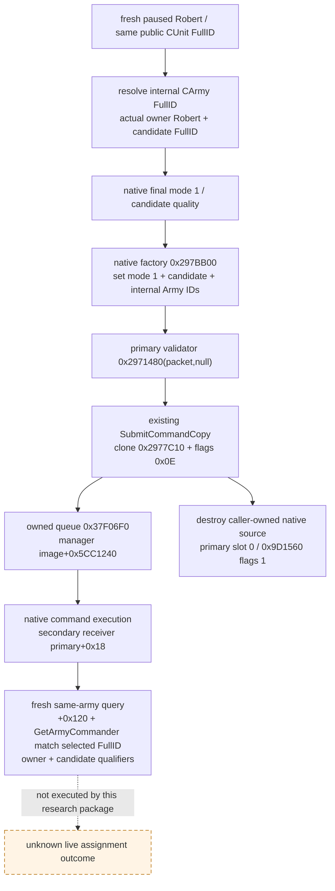

# CK3 1.20.0.3 玩家正式将领任命命令

2026-10-03，状态 `research / exact static-confirmed`；这是原生命令施工输入，不是 live 任命结果。构建为 CK3 1.20.0.3 / Steam 25652598，安装 EXE SHA-256 `94B55397ABB687A3DCD436805A5D885E6BE90FA6C693FEB44A9E3BBEEADE02A6`。以下地址全部为 image-relative RVA。本包不启动游戏、不连接 SDK、不执行 command、不编辑共享 Git。

依赖 [候选与最终资格原生树](commander-candidates-and-assignment-12003.md)。不重新枚举候选或猜测质量。真实输入是 ROOT 先前取得的 Robert 军队 `83886367` commander absent；在同一军队上观察到 mode-1 eligible candidate 后即可施工窄 `assignCommander`。

## 玩家入口与所有权

原生玩家 GUI handler `0x1483040` 构造 `CSetCommanderCommand`，填写 mode `1`、候选 full CharacterID、内部 full CArmyID，调用 primary vtable `+0x40` clone，随后以 channel flags **`0x0E`** 进入 embedded manager `image+0x5CC1240` 的 locked queue `0x37F06F0`。不需要创建 GUI 或执行 ScriptGUI。

原生 default factory `void* 0x297BB00()`（无参数）使用 native allocator `0x4223BB4` 分配 **48 bytes**，返回 primary pointer。69-byte factory SHA `53869570741A82B4EDA69180D86D243514513AF84F2DF618F94E66D8C19CD36E`。它初始化：

| primary offset | 内容 |
| --- | --- |
| `+0x00` | primary vtable `image+0x476A418` |
| `+0x08` | byte 0 |
| `+0x0C / +0x10 / +0x14` | dword 0 |
| `+0x18` | secondary vtable `image+0x476A4B0` |
| `+0x20` | mode 0，玩家 leaf 改为 1 |
| `+0x24` | candidate FullCharacterID -1，leaf 填当前候选 full ID |
| `+0x28` | FullCArmyID -1，leaf 填从实际 public CUnit 解析出的内部 full ID |

padding `+0x09..0x0B / +0x2C..0x2F` 没有语义；不得读取其随机值作为状态。实际 GUI 也使用同布局的 caller-owned stack source。既有生产 `ck3_12002::SubmitCommandCopy` 已闭合 clone 与队列的所有权，因此 factory-owned source → `SubmitCommandCopy(..., source, 0x0E)` → finally `DestroyOwnedCommand(source)` 可复用现有传输，不造第二套 queue。

**克隆不是直接返回 command 指针。** Primary vtable `+0x40 = 0x2977C10` 的 ABI 是 `void** Clone(const void* source RCX, void** return_storage RDX)`；返回 `RAX=RDX`，并把 native allocated 48-byte clone 存入 `*RDX`。130-byte SHA `08085D67B09A3A9CA7CD0368DFFAD5A959FE1440AD99B549420C45D69F9BBA92`。调用者把 owning pointer 从返回 wrapper 移出，再传给 queue。

`bool 0x37F06F0(void* manager RCX, void** owned_command RDX, uint32 flags R8D)` 是正式 owned queue。它在接受时移走并清零 owning pointer，在拒绝时销毁并清零；AL 只证明是否进入队列，不能证明 commander 已改变。cleanup 只对残留 owning pointer 调 native primary deleting destructor，不调用 secondary method。

Primary vtable `+0x00 = 0x9D1560`：`void* Delete(void* primary RCX,uint32 flags EDX)`；flags bit 0 为 1 时调用 native sized delete `0x4223F64(primary,0x30)`。43-byte SHA `B366E6937D2ABABA61AAC02C64B2AE8373DB5D2CAE01E0119C700A11F27C9235`。本命令没有嵌入动态资源需要额外析构。Secondary vtable `+0x00 = 0x29677A0` 是另一 interface method，不能当作 destructor。

## 包级 validator 与正式执行

Primary vtable `+0x30 = 0x2971480` 的 callable ABI：

```cpp
bool ValidateSetCommander(const void* full_primary_packet, // RCX
                          NativeString* reason);          // RDX; nullptr legal
```

它先保存 reason 到 R11，按 `packet+0x24 / +0x28` 解析候选、Army，并做 full-ID generation 对照，再尾调用 `0x2971510(mode,candidate,army,reason)`。138-byte wrapper SHA `E0C9C49147FE163E0778246155A728E12840893D74D818C569F1B04211E3B17F`。`reason=nullptr` 原样传到已闭合 formal predicate，wrapper 不解引用 reason；formal gate 对无 reason 的拒绝分支返回 false。原生 generic consumer `0x37F2540` 在 `0x37F2ADE..0x37F2AE6` 明确执行 `mov rax,[rdi]; xor edx,edx; mov rcx,rdi; call [rax+0x30]`，直接证明 full primary pointer 与空 reason 是生产验证路径；第二个 consumer `0x37F630D` 也使用同样清零 RDX。consumer 的 `0xAAC` 字节 SHA `0D903A7F682C0905E50A17E71B501951FAC3082E19BF7D3E41F8AA653443D1B9`。不得传 primary+0x18 给 validator。

最终 predicate `0x2971510(1,candidate,CArmy,nullptr)` 保持相同玩家 mode-1 规则：实际 Army→Unit→owner、owner 属于原生 played-character 集合、Army action gate、候选生存与结构状态、membership、loaded basic/now rule。`0x29675F0(owner,1)` 调 `0x2BAA710(owner FullCharacterID)`，后者查 `image+0x5C68C50 -> +0xA0` 的 ID vector `+0x22358/count+0x22364`；这不是单独证明当前本地 actor 必然是 Robert，leaf 仍复用当前 actor/actual owner Robert 的观察。构造后可以用 packet validator 再取同一正式判断；仅当它为 true 时 submit 一次。

Secondary vtable `+0x08 = 0x2971320` executor 的 RCX 是 **primary+0x18**；读取 secondary+0x0C/+0x10 正好对应 primary+0x24 candidate / +0x28 Army。此处没有自动 adjustor。Executor 可能先解除候选旧军队，随后调用 `0x24DFA10(army,candidateFullID)` 与 `0x24E8120(army)`；正式命令传输负责执行，provider 不直接调 executor 或写 `CArmy+0x120`。

## 同军队验证与能力边界

Public army ID 对应 `CUnit`，不能直接把它当作包的 CArmy ID。必须从当次 `CUnit+0x178` 解析并检查内部 CArmy full ID / tag；该 Army 的 `+0x124` back-reference 再解析 public CUnit，并取 `CUnit+0x174` actual owner，确认 Robert 当前控制。候选用当帧 full CharacterID round trip，保存 mode-1 final资格与原生质量值；质量不重新猜测。

submit ACK 后重新捕获 paused snapshot，通过相同 public army full ID 重新解析当帧 CArmy；独立读取 **`CArmy+0x120 == selected candidate FullCharacterID`**，并复核 `GetArmyCommander 0x24E9ED0(CArmy)` 返回 Character+0x18 为同一 full ID。再次读 actual owner、Army full ID 与 candidate 的有效身份；记录 fresh candidate final-eligible qualifier，其结果是当前规则状态，不能用 queue ACK 代替。只有独立 commander 读回匹配才可报告已任命；失败或仍 absent 都保留实际结果。

`0x24DFA10` 的具体写入证据为 `0x24DFACC mov [CArmy+0x120], candidateFullID`，后续原生 candidate 更新不由桥直接模拟。该函数 352-byte SHA `C40AD1B8CCD087DA7A45F4BCC11C287672C1BCEDBB8C01DC719BED08F1C249C7`。正式 query getter `0x24E9ED0` 读取 Army+0x120 并检查解析对象 full ID，给独立读回提供另一路一致性观察。



本包的 provider 施工输入已经闭合。实际候选名单、native queue 接受、正式任命结果和战斗收益均由 ROOT 的后续 paused artifact 分别证明，不能由本静态研究包代领。
