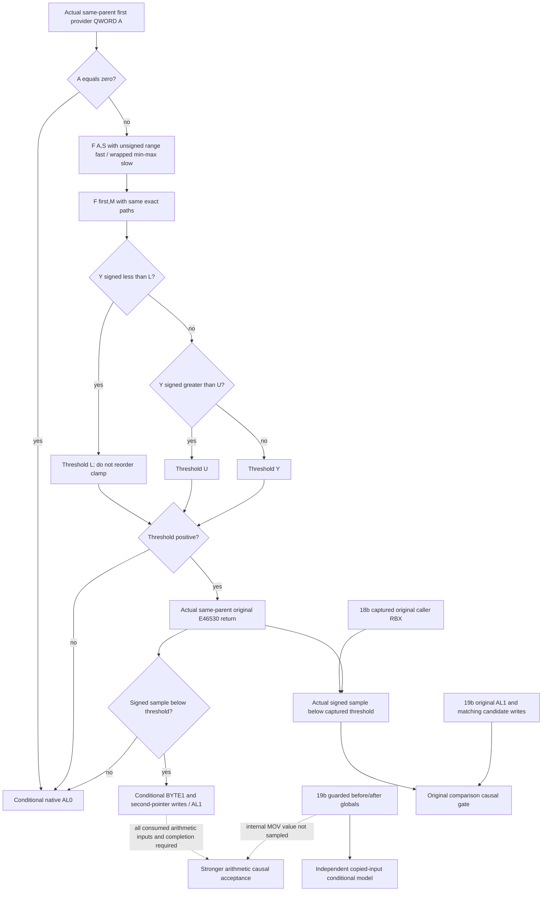

# Actual4 conception pair: copied threshold conditional consumer

Tree frozen 2026-10-10 before this new pure leaf. Exact build is CK3
1.20.0.4 / Steam25734779, retained EXE SHA-256
`98702F88A547CDE2EAF29A85F93B85F68EE4CF8148336A4F7AFAEB75319DD518`.
Only the retained actual `[2929B40,2929DD8)` **664-byte** body is used.
The prior pending-slot qualification is not replayed.

Source: [whole-body receipt](D:/codex-ck3-background-spill/m7-natural-pregnancy-consumer-20261010/manager-owner/CONCEPTION-CONSUMER-CLOSED-RECEIPT.json),
[retained middle instructions](D:/codex-ck3-background-spill/m7-natural-pregnancy-consumer-20261010/manager-owner/ACTUAL-SCALAR-CONSUMER-DETAIL.txt)
and [retained prefix/suffix instructions](D:/codex-ck3-background-spill/m7-natural-pregnancy-consumer-20261010/manager-owner/CONCEPTION-CONSUMER-NEW273-DECODE.txt).
The independent original-comparison input is qualified by18b's
[retained threshold ABI proof](D:/codex-ck3-background-spill/native71-continuation-20261010/continuation-18b/THRESHOLD-ABI.json).
The old middle's locally decoded `2929B9E add` is not an instruction: the
whole-body receipt resolves those bytes as the preceding JNE displacement.
This consumer starts only at the actual first provider-result load `2929C30`;
it does not recreate the prior Character/fertility/status/trait gates.

## Source-closed arithmetic and branches

Let A be the **first signed QWORD** at the original provider's callerout
(`2929C30`), S the signed loaded QWORD at `5C69EC8` (`2929C3E`), and M the
original entry R9 preserved at `2929B53`. A==0 returns native AL0 before any
arithmetic; a negative nonzero A is not rejected here.

Both stages use the same exact source function F(x,y):

1. Unsigned 64-bit `(x + 0xB504F333)` and `(y + 0xB504F333)` are each
   compared with `0x16A09E666`. Both passing selects the fast path. LEA/add
   and comparisons retain their native 64-bit wrap/unsigned meaning.
2. Fast path: low64 signed-product bits, then signed truncating division by
   **100000**. The actual reciprocal is `0x29F16B11C6D1E109`, signed-high
   product, SAR14 and sign correction. Its scalar result is C++ signed
   division by positive100000; there is no floating-point conversion.
3. Slow path chooses signed `maximum` and `minimum`. Let q=trunc(maximum/100000)
   and r=maximum-q*100000. The two IMUL results are independently low64-wrapped:
   p=wrap(r*minimum) and t=wrap(q*minimum). The result is
   **wrap(trunc(p/100000)+t)**. Replacing this with a 128-bit product divided
   once is incorrect. Fast/slow paths select arithmetic, not eligibility.

The first result is F(A,S) (`2929CE8`); the second is F(first,M)
(`2929D62`). The clamp loads **signed QWORD** L=`5C69F00` and U=`5C69F10`.
Their exact define-key names are unknown and stay labeled by actual slot.
If Y<L, threshold=L without testing U. Otherwise threshold is U when Y>U,
and Y otherwise. L/U are never reordered, even for an inverted pair.
Threshold<=0 returns AL0 before the sample call. For a positive threshold,
the actually returned signed RAX from the original `E46530` child is compared
with it at `2929D99`: sample>=threshold returns AL0; sample<threshold reaches
BYTE1 to first.extended+3E8 and the second Character pointer QWORD to
first.extended+3F0, then AL1. The consumer calls neither original.

## Parent and missing-input contract

Every supplied QWORD shares the same parent key: shared13 `clock_identity`,
19b `parent_scope_id=before_event.sequence`, parent `process_clock`, thread,
first/second Character pointers and full DWORD IDs, sample receiver, and
Root's current source pin. The executable SHA is separately exact-admitted.
Missing raw values and mismatched keys are unavailable; neither is zero.
The raw sample is supplied by18b, which owns exact caller return `2929D99`,
original lower0/upper10000000 and its independent causal sample readiness.
45b owns the actual provider first QWORD at caller return `2929C30`, mode3
and fifthnull. The caller ignores the provider's returned RAX pointer; a
different RAX/outptr is a diagnostic, not an extra qualification gate.

19b entry/exit scalar/clamp reads are **raw independent copies**, not direct
samples of the internal MOV values. Equality of bookends does not change
that fact. They may feed the conditional model with
`actual_original_value=false`; they cannot grant the stronger arithmetic
causal acceptance. The
same applies to17b/55 software pair projections. Original R9, provider first
QWORD and sample may have actual original-value provenance when their
owners genuinely captured that invocation.

The result separates the conditional model, native parent AL observation,
candidate-write observations and stronger arithmetic `accepted_causal`.
The latter requires a
known accepted conditional branch, every required input marked genuinely
consumed-original, exact same-parent keys, and independent original-once
completion with AL1 plus matching candidate-byte/target writes. No missing
sample or unsampled internal scalar can grant it. An unavailable result is
not a rejection; a known rejection does not require a sample that the native
branch would not call.

The smaller `original_compare_causal` plane is independent of provider and
scalar-model availability.18b's source-bound entry thunk copies caller RBX
to its observer's fourth parameter; the original helper does not consume
incoming R9 and saves/restores RBX. Thus a qualified positive
`threshold_at_sample` is exactly the signed operand used after that original
return at2929D99. The consumer requires actual same-parent sample and
captured-threshold provenance, sample<threshold, and19b original-once AL1
with stable first extended pointer and matching BYTE1/second-pointer facts.
It evaluates this plane before any conditional-model early return. Unsampled
global bookends remain unsampled, and no provider/model requirement blocks
this independently observed native gate. Missing or mismatched sample,
threshold, completion or write facts cannot grant it. The actual comparison
does not infer full arithmetic inputs, future draws or monthly scheduling.

The19 new owned copied-input cases include fast arithmetic, independently
wrapped slow products, negative and zero branches, clamp order, missing
inputs, full-ID generation joins and both causal planes. Central10's fresh
19b/18b/45b compound calls `VerifyConceptionThreshold12004ConnectedCases()`
once; this leaf has no standalone test entry point or native-call seam.

The owned header/source and focused fixture remain external D candidates.
Root19/18/45 and central10 own one new connected compound; no individual
old arithmetic/pending/sample fixture is replayed here. Readiness at tree
freeze was **SOURCE_NOTRUN**. No native execution, future draw, inferred
monthly clock, pregnancy/birth/succession or M7/G2 credit is supplied.

Final qualification 2026-10-10: central10's single fresh19b/18b/45b connected
compound compiled and ran once with exits0, including these19 new cases.
[Exact receipt](D:/codex-ck3-background-spill/native71-continuation-20261010/continuation-10/m7-natural-pair-connected01/RESULT.json)
pins the unchanged header, consumer and cases. Both independent comparison
and arithmetic noncausal boundaries passed in the same owned fixture scope.
This is **FIXTURE_GREEN_DEFENDER_PENDING**, with no live credit: the separate
permanent-exclusion request needs administrator readback and attempted no Add.
Production consumer target is `xar_ck3_12002_runtime`; the connected cases
remain only in19's unique compound. No old20 qualification was rerun.
