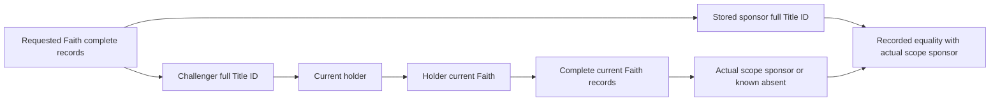

# Current Faith challenger/sponsor graph query

The C3 reader exposes the complete native `religious_head_challenger` records for
1–8 explicitly selected full Faith IDs. The provider is read-only and private.
CK3 is bound to **1.20.0.3**, EXE SHA-256
`94b55397abb687a3dcd436805a5d885e6be90fa6c693feb44a9e3bbeeade02a6`.

The default MCP inventory remains 21. `--confucian-readonly-tools` retains its
existing 23 tools. `--confucian-challenger-tools` includes those two reads and
`ck3_query_profile_confucian_challenger_graph_v1`, for 24 tools. The new native
flag `XAR_CK3_ENABLE_CONFUCIAN_CHALLENGER_GRAPH_PRIVATE_QUERY_V1` defaults OFF.
The driver has a separate default-false `allow_private_confucian_challenger_queries`.

The tool takes strict positive uint64 `expected_revision` and a unique array
`faith_full_ids`, length 1–8, of uint32 full identities excluding `UINT32_MAX`.
Faith 0 and nonzero generations remain valid. The production encoder sends only
canonical `expected_snapshot_revision` and the exact selectors to native code.
The request and result remain bound to the paused actor, date, PID, connection
generation and both public and native revisions. Reads grant no business credit.

The source-qualified Faith array is at `+0xC0`, signed count at `+0xCC`, stride
8: challenger full Title ID at `+0`, stored sponsor full Title ID at `+4`.
The role of `+0xC8` remains unknown and the reader neither reads nor infers it.
Count bounds are explicit (4096 per Faith, 64 captured Faiths, 32768 captured
records). Invalid counts, duplicate challenger IDs, partial reads or changed
collections return unavailable with `faiths=null`; no truncation is reported as
complete. Known empty collections retain count 0 and two empty arrays.

The registered pair and active `challenger_sponsor` scope are separate facts:

Self-sponsors and repeated sponsors across different challengers are preserved.
Every present Title has actual full generation identity, native class, holder,
holder current Faith, four bool properties and complete laws. Absent sponsor
references remain observed absence with null Title/holder/property/law values.
Two complete passes close native collections, Title graphs and leaf values.
The paused main-thread mailbox independently closes the published frame.
Mod markers and saved owner-Faith variables remain null and require checkpoint
evidence; selecting a Faith does not authenticate saved ownership.

Source-only qualification comes from the preserved packages under
`C:/workspace/ck3_lyd_runtime_20261004/`:

- `c3-native-challenger-graph-addon-20261006-001`, originally an uncompiled draft.
- `i3b-current-faith-challenger-sponsor-abi-contract-sourceonly-20261006-001`,
  INDEX SHA `3dffb1d4ee1fa0e100ea26b12f577841317ebdcae4d6e702282bad768ceadfb1`.
- `c3-resume-native24-20261006-002`, the resumed implementation, minimal patch,
  actual focused compiler/fixture/Python receipts and preserved failures.

The resumed focused build links the new production reader and fixture against
the actual clean master runtime library at
`C:/lyd13-native-clean-20261006-003/xar_ck3_12002_runtime.lib`, after checking
that the used shared reader/layout sources have identical bytes. The test
executes the production parser, reader and serializer; Python also checks the
native JSON outputs and native checks a real production-encoded request.
The initial partial DLL build was stopped at the root operator's request to
avoid concurrent compilation. A subsequent focused compile exposed a malformed
raw-string literal in the old draft fixture; failed inputs and logs remain.
The corrected focused compilation and tests passed. The final candidate was
rebased to master `768fd56e6f078c8fc6b1cc669cad71fb2594e3a2`, retaining the
new remote CMake includes and runtime fields, then focused checks used the actual
runtime library compiled from that same clean HEAD. The older focused run
against runtime002 is historical: its original library-binding caption wrongly
named 768, and an appended correction identifies its actual source as
`6be9e727b105bc72e623d92328d61bb74e0d43d6`; its original receipts remain.
Defender WMI registration
failed independently, so the successful compile is not an exclusion receipt.

These are offline fixture results. The new mailbox/router/bridge path still
requires compilation in the integrated 11-flag DLL, and an actual paused C3
session still requires fresh graph reads, saved owner-Faith proof, the actual
I3b-created Title and independent postcondition/reload evidence. No game was
started, DLL installed or C3 business acceptance claimed by this source task.
