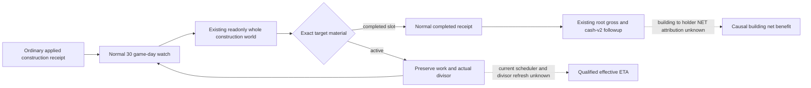

# Construction remaining work, completion watch and income inputs — 1.20.0.4

Status: **research input closure**, recorded 2026-10-09. Native48 has two
ordinary submit/material pairs in one process, both still in progress. This
page adds no live query, build, test, ETA, completion or G2 credit. The recorded
zero divisor does not demonstrate a reader failure or a stalled construction.

## Exact source and cached native evidence

The inspected producer is the immutable Native48 root source
`Z:/gbs-runtime48-construction-latch-root-source`, compiled source
`dd302e80ed5eb6513a3bea1f9ea39c6abd305f5f`. Its actual4 reader is
`ck3_autonomous_player/native_bridge/src/ck3_12004_construction.cpp`.
The consumer inspection uses the qualified recovery source
`Z:/gbs-r82-pending-recovery-hot-root-source` at
`61819ef19d2cdc35da185fbc8d071c7f3ea3fafd`. These locators identify this
inspection; they do not substitute for the current Native51 deployment pin.

The current reader uses `Province + 0x620` for the construction slots:

| Field | Offset from slots | Existing wire observation |
| --- | --- | --- |
| Active definition | `+0x68` | Active building type |
| Selected slot | `+0x70` | Exact slot index |
| Remaining work | `+0x80` | `native_remaining_work_raw` |
| Initiator | `+0xD8` | Initiating CharacterID |
| Progress divisor | `+0xE0` | `native_progress_divisor_raw` |

The reader also publishes completed slot inventory and province aggregate
monthly income from `Province + 0x718`. A successfully read signed integer zero
is preserved. The older `+0x88/+0xE8/+0x720` layout belongs to historical
builds and must not be substituted for this actual4 provider.

Cached exact-build mapping is under
`Z:/ck3_mod_rewrite_process_assets/g2-parallel-20261007/adopted-lifestyle-building-faction-12004/building/native-map01/`.
`FAMILY-MAP.json` marks both following spans
`complete_instruction_span_normalized_equal`, with complete decoding and
matching ordered edges/local topology. The underlying ordinal candidates are
not independently a full callee or scheduler proof.

| Cache detail | Actual4 instruction span | Observed operation |
| --- | --- | --- |
| `building-active-material-writer-DETAIL.json` | `0x24678E5..0x2467914` | Reads signed `CBuildingType + 0x58`, multiplies by `100000`, writes slots `+0x80` at `0x2467907` |
| `building-active-work-divisor-DETAIL.json` | `0x2467D00..0x2467D5E` | Reads slots `+0xE0`; positive divisor subtracts `floor(10000000000 / divisor)` from `+0x80` per invocation; nonpositive divisor writes work zero when this routine executes |

The 94-byte progress prefix does **not** close the current scheduler cadence,
the divisor-refresh writer or the completion tail. A paused sample with
remaining work `109500000` and divisor `0` therefore supplies neither a valid
effective ETA nor evidence that the nonpositive branch has executed.
`109500000 / 100000 = 1095` recovers an authored initial-work quantity, not a
guaranteed 1095 game-day completion time. No substitute divisor is justified.

The historical [zero-divisor paired readback](construction-r0256-zero-divisor-readback-2026-09-27.md)
observed work decreasing by `333333` over three ordinary game days while both
paused samples were zero. That older-build observation is useful evidence
against interpreting every paused zero as stalled or immediate completion;
it does not qualify an actual4 rate or cadence.

## Existing next observations

No new native field is needed to observe natural completion. The existing
`construction_formal_consumer.py` watches applied/prior receipts every
`30 * 24 = 720` raw date hours; a changed process or regressed native/date frame
first causes an independent material recheck. The current receipt's
`completion_last_check_date_raw` determines the next warm watch. Do not reset
or synthesize that date from this research page.

For Root's next already scheduled material stage, the existing readonly MCP
`ck3_query_domain_construction_world_private_v1` accepts
`{"expected_revision": <current public revision>}` and returns all active
constructions, completed slots and source proof in one world packet. Preserve
the actual PID/creation time, actor, native/public revision, raw date and query
proof with these exact pending/applied target tuples:

| Original request | Target | Initial material date | Initial work / divisor |
| --- | --- | --- | --- |
| `construction-submit-ab2ae25236204694a55e5d2a207b47a5` | `2106/2644/604/slot2` | `53288616` | `109500000 / 0` |
| `construction-submit-3397aa302b51493ca9fa7d19bfb5f0cc` | `2143/2619/604/slot4` | `53288640` | `109500000 / 0` |

Those initial dates would give warm watch thresholds `53289336` and
`53289360` only if the current ledger still retains them as its last check.
The R83 cold recheck and its saved ledger remain authoritative. Ordinary
planning should continue to schedule material receipts; this page does not
ask for repeated paused probes or forced day advances.

A later same-target work difference is a measured interval outcome. A
positive divisor alone gives a per-invocation decrement, not daily ETA until
the actual4 invocation cadence and refresh lifetime are closed. For natural
completion, consume the existing exact completed-slot material and absence
of the corresponding active construction through the normal receipt path;
an ACK or zero work is not completed-slot proof.

## Income evidence remains separate

The existing [completed NET following consumer](construction-completed-net-following-12004.md)
already attaches `post_cash_v2` when a completed receipt is missing gross
income **or** its post-cash packet. It preserves the original start receipt,
native cost and `pre_cash_v2`. The normal completed followup can therefore
capture current gross income, complete expenses, NET and province aggregate
without a new factory or schema.

An observed province or holder income difference is an aggregate change.
It is not by itself the realized yield of this building: other modifiers,
transactions and constructions can change in the interval. The existing
`construction_economic_outcome_v1.py` deliberately leaves
`building_attribution_ready`, `net_benefit_ready` and
`m5_realized_value_ready` false. The next causal source gap is the existing
`2479F50(owner, 3)` tail into `Province + 0x718` and holder NET, as recorded in
[construction economic consumers](construction-economic-consumers-12004.md).
Only work on that bounded source edge is warranted if a later decision needs
building-specific realized net benefit; the paused zero does not require a
new reader or gate.

The [Native48 latch lifecycle evidence](r81-second-construction-native-latch-12004.md)
remains **production-live primitive**. Its two in-progress material pairs do
not establish natural completion, income attribution or a complete M4/OODA.
The original construction-start/material contract and the later NW-ECON
completion/benefit objective remain distinct; this source inspection awards
no additional milestone.
