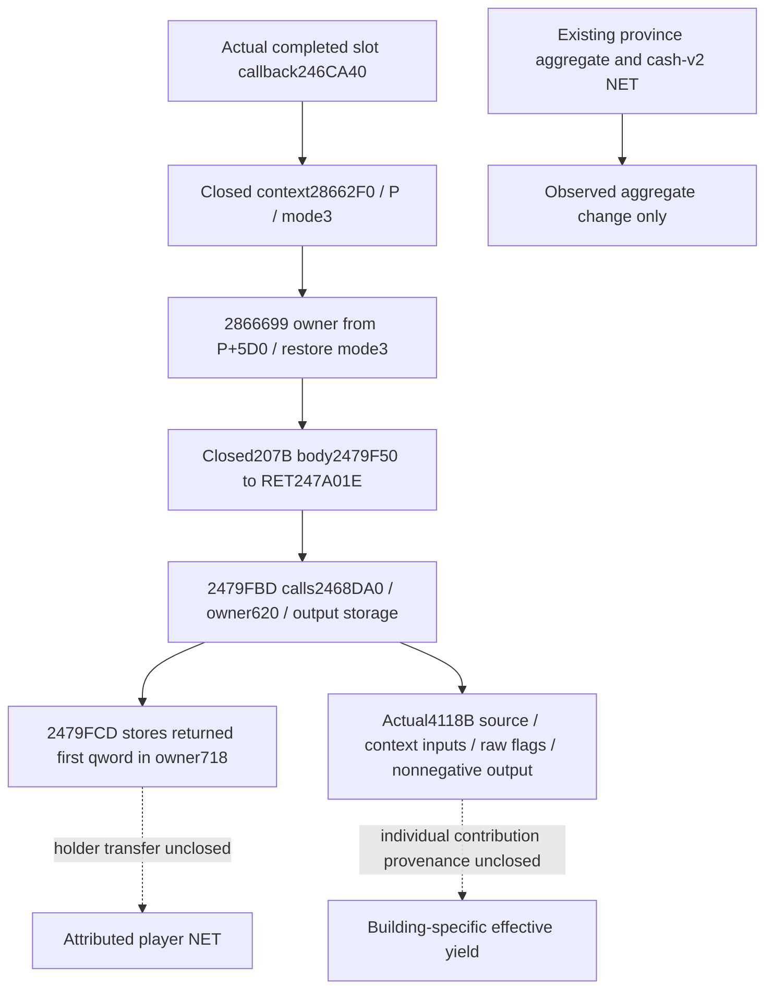

# Construction benefit: reached owner mode3 input — CK3 1.20.0.4

Status: **research**, recorded 2026-10-09. This package identifies the smallest
remaining source entrance needed to investigate building-specific realized
income. It adds no policy, readiness gate, production field, M4 credit or test.

Exact native identity remains CK3 **1.20.0.4**, Steam **25734779**, retained
EXE SHA-256
`98702F88A547CDE2EAF29A85F93B85F68EE4CF8148336A4F7AFAEB75319DD518`.
The inspected producer source is
`Z:/gbs-runtime48-construction-latch-root-source` at
`dd302e80ed5eb6513a3bea1f9ea39c6abd305f5f`; this is an inspection locator,
not a replacement for Root's newer deployment pin. No EXE or binary payload
was read or hashed by this package.

## Existing inputs and the missing independent value

The current construction reader has these distinct sources:

| Source | Already observed meaning | Missing meaning |
| --- | --- | --- |
| `ck3_12004_construction.cpp:404` / `Province+0x718` | Current province income aggregate | One building's effective contribution and holder transfer |
| `ck3_12002_construction_authored_income.hpp` / 19 canonical keys | Authored unconditional province `monthly_income` | Conditional/contextual effects and realized player tax |
| `construction_economic_value_v1.py` | Target authored value minus known old-slot authored value | Guaranteed marginal yield or causal realized NET |
| `ck3_12004_construction_held.cpp:212` / `Title+0x128` | Actual player ownership match | Income distribution, holder tax or receipt |
| Existing cash-v2 sources | Actor gross, complete expenses and true NET | Per-building attribution |

The Python authored-value reader explicitly omits conditional extra effects.
Its five additional occupant entries describe old-slot authored comparisons;
they are not additional effective-income observations. Native final-cost
evaluation returns a ten-resource purchase cost, not a benefit value.

The existing economic outcome classifier correctly preserves aggregate
before/post observations while leaving `building_attribution_ready`,
`net_benefit_ready` and `m5_realized_value_ready` false. Neither a positive
aggregate NET difference nor a positive authored delta proves one building's
actual yield. The useful missing input is a context-qualified contribution
of the particular definition, including applicable modifiers, and its
actual transfer into the player's income. No current source field supplies
that value, so adding a Python formula or a placeholder native field would
not close it.

## Reused reached source and finite next body

The [construction economic source tree](construction-economic-consumers-12004.md)
already closes the completed-slot callback and its mode3 context through
actual `28662F0..286669E`. Its exact exit at `2866699` restores the stack and
tail-jumps to **`2479F50`**, with RCX equal to the owner from `P+0x5D0` and
EDX equal to the preserved mode **3** (`P = holdingF0+0x28`). The original
mode enters the closed callback edge `246CBEE -> 28662F0`.

No explicit building definition, numerical income output or Province+0x718
write has been established in that calling contract. The reached owner may
still carry relevant contextual inputs; its target body must be inspected
before assigning benefit or transfer semantics.

One exact lookup in the retained `OLD-RUNTIME-FUNCTIONS.json` and
`NEW-RUNTIME-FUNCTIONS.json` under the central `function-match-core` cache
finds these entry intervals:

| Image | Held runtime row | Range / bytes |
| --- | --- | --- |
| `.3` | `[38248304, 38248511, 85059696]` | `[2479F70,247A03F)` / **207** |
| `.4` | `[38248272, 38248479, 85059936]` | `[2479F50,247A01F)` / **207** |

The two concrete tail targets identify the proposed entries independently;
the identical length or ordinal alone is not semantic proof. A nonrecursive
named-range lookup in the five existing central cache directories found no
range covering either target. That lookup read filenames only, with zero
binary payload reads. No broader ownership or reverse-engineering census
was performed.

Root's single proposed next capture is therefore **414 bytes / two range
reads**, exactly one held runtime interval per frozen image. A complete
function return is not preasserted: chained code, callees and other intervals
remain outside this first capture. The goal is to record concrete reads,
writes, branch conditions and return/tail operands, then determine whether
they expose a useful independent benefit input. It is not an invitation to
expand a generic modifier or holder-tax tree.

Prepared Root-only artifacts are under
`Z:/ck3_mod_rewrite_process_assets/g2-background-20261009/construction-benefit-owner-mode3-source/`:

- `OWNER-MODE3-REACHED-ENTRY-MANIFEST.json`: the exact old/current entries,
  held runtime rows and 207-byte bounds.
- `ROOT-READ-ARGV.json`: the original central finite mapper invocation,
  output `owner-mode3-root-first01/`. Root subsequently executed this once;
  this package did not execute it.

## Root actual207B result: aggregate publisher is now closed

Root reported the unique paired capture **GREEN**, 414 bytes / two new range
reads (`tool4e819c`). The retained `owner-mode3-root-first01/FAMILY-MAP.json`
has one `complete_instruction_span_normalized_equal` row, complete old/current
decodes, matching ordered edges and local topology. This lane consumed only
its generated text DETAIL, with no further binary or executable reads.

The actual body now closes through normal `RET247A01E`:

| Actual operation | Concrete effect | Semantic boundary |
| --- | --- | --- |
| `2479F5F..2479F6C` | Preserve mode; if mode bit1 is set, call `2478EE0(owner)` | Mode3 reaches this helper; its effects remain unexpanded |
| `2479F71..2479F87` | Save old raw32 `owner+0x850`; call `2479C20(owner,0)`; store EAX to `+0x850`; set `+0x858` to `0xFFFFFFFF` | Units and cache identity remain unknown |
| `2479F91..2479F9D` | If old `+0x850 > 0` and mode bit0 is set, call `2479EA0(owner)` | No holder-tax semantics are assigned |
| `2479FA2..2479FBD` | Call `2468DA0` with RCX=`owner+0x620`, RDX=stack output address, R8D=0, R9D=0 and fifth argument0 | This is the precise reached producer of the next stored value |
| `2479FCA..2479FCD` | Read the first qword at returned RAX and store it to `owner+0x718` | Direct writer of the aggregate field consumed by the existing province income getter |
| `2479FD4..2479FE3` | Call distinct `246A050(owner+0x620, same output address, R8D=0)`; store its returned first qword to `owner+0x720` | A separate output; do not relabel it as the `+0x718` income field |
| `2479FEA..247A009` | Nonzero mode plus nonnull global receiver calls its virtual `+0xA0`, with EDX=`0x2DAC`, R8D=`owner+0x10`, R9D=0 | Operation/event semantics remain unknown |
| `247A00F..247A01E` | Restore registers and stack; return | Complete terminal path within the captured interval |

Thus the completed-slot callback's mode3 path **does reach the aggregate
`+0x718` write**. The new source closes that data flow; it does not add a new
independent numerical observation, since the bridge already reads this
aggregate. It neither supplies an individual definition's effective yield
nor closes the contribution's transfer into holder NET. No new production
field or policy change is warranted by the publisher alone.

## Single useful successor: the existing718 producer

The only proposed successor is the actual `2479FBD -> 2468DA0` call whose
returned first qword feeds `+0x718`. Its concrete old counterpart is
`2479FDD -> 2468DC0`, directly recorded in Root's paired source DETAIL.
One exact held runtime-row lookup bounds each entry:

| Image | Held runtime row | Entry interval |
| --- | --- | --- |
| `.3` | `[38178240,38182358,86293900]` | `[2468DC0,2469DD6)` /4118 bytes |
| `.4` | `[38178208,38182326,86294144]` | `[2468DA0,2469DB6)` /4118 bytes |

The five existing central cache directories have no named range covering
either entry. A Root-only manifest therefore proposes this **one** held
runtime interval per image, **8236 bytes / two reads**, so the concrete entry
can be interpreted once without repeated short prefix captures. Full
function coverage beyond the one interval is not preasserted. The other
`+0x850` helpers, separate `+0x720` producer and virtual call are excluded.

`PROVINCE718-PRODUCER-MANIFEST.json` and
`ROOT-PROVINCE718-READ-ARGV.json` in the same external folder were prepared
without execution by this lane. Root subsequently executed that sole source
capture; its actual result and boundaries follow below.

## Root actual4118B result: contextual aggregate, no individual yield

Root's unique capture (`tool16c6c0`, exit0) read 8236 paired bytes in two
range reads. `province718-producer-root-first01/FAMILY-MAP.json` reports
**`instruction_span_partial_or_concrete_operand_delta`**. Both spans decode
completely and their ordered-edge shape/local topology match, but normalized
code is **not equal**. No old-version semantic equivalence is claimed. This
section analyzes the actual4 instructions themselves.

The actual interval contains 976 instructions. Its normal epilogue returns
at **`2469D76`**. Code after that return is not automatically a neighboring
function: `24693F4` explicitly branches to `2469D77`, whose global-state
guard calls `4223A84`/`4223A24` and rejoins `24693FA` at `2469DB0`. The last
byte at `2469DB5` is `int3` padding. The reached post-return block remains
part of this source control-flow account; its helper semantics are unexpanded.

The publisher's actual call supplies slots=`owner+0x620`, output pointer,
third raw flag0, fourth raw flag0 and fifth pointer0. The concrete inputs and
operations in that actual path are:

| Actual instructions | Concrete input or operation | Meaning still unclosed |
| --- | --- | --- |
| `2468DD8..2468E0D` | Read slots `+0xF0` context, its `+0x848` object, context `+0x30` collection; obtain `2467660(slots)`; preserve optional fifth pointer | Object identities beyond this calling contract |
| `2468E1D..2468F60` | Numeric `0xA2/0xA5`, and comparisons selecting `0xA3/0xA4` and `0xA6/0xA7`, through `2C4D530` / `2C82340` | Numeric keys' names and units; no authored-key substitution |
| `2468F77..2468FCE` | Retain the `28BE0B0` result; obtain numeric `0x1E9` and context `+0x20 -> +0xB8 -> word+0x78E` inputs through `2C23340` | Conditional contribution provenance |
| `2468FD3..2469017` | Search the context `+0x848` object's `+0x310/count+0x31C` stride16 list for slots' first pointer; add matched entry `+8` | Entry semantics; no per-building definition is exposed |
| `246905F..2469124` | Call `2C39B80` using context `+0x848`; adjust an accumulated factor by returned qword minus100000 | Factor's game meaning |
| `2469146..246921B` | Binary-search numeric `0x3F` in collection `+0x68/count+0x74`, then read corresponding qword from `+0xD0` array; missing key yields zero | Source-specific modifier provenance and key name |
| `246921B..2469272` | Add numeric `0x46` and `0x1EA` values from `2C4D530` | Names/units remain unknown |
| `2469343..24699C7` | Native predicate `2C25010`; resolved-ID fields `+0x130/+0x12C`, slots `+0x108`, fourth flag and `28B9300` value select contextual branches | Branch meanings are not renamed as tax/occupation/ownership policy |
| `24699EA..2469C18` | Further factor from `2C399C0(context+0x848, global input)`; `2B9CBA0` receives the earlier `2467660` result and optional fifth pointer | Holder transfer or individual contribution is not proved |
| `2469C18..2469D60` | Combine signed intermediate values with 100000-based arithmetic; clamp a negative final result to zero; store one qword through the original output pointer and return that pointer in RAX | This is the aggregate producer output, not a per-definition result |

The third raw flag1 has an earlier result path at `2469275..2469334`; the
publisher supplies0 and uses the longer contextual path. Multiple detail
branches require a nonnull fifth pointer and write records reached through
`242C020`; the publisher supplies null. These raw distinctions are recorded
without inventing a query mode, input enum name or new ABI.

The limited existing ledger/source lookup did not provide a typed mapping
for `0x3F`, `0x46`, `0x1EA`, `0xA2..0xA7` or `0x1E9`. Their names and units
remain unknown. In particular, the 19 authored `monthly_income` keys cannot
be assigned to these numeric IDs by resemblance. The 100000 arithmetic
does not independently establish the scale or holder-tax meaning of the
published province aggregate.

The useful closure is now concrete: completed-slot mode3 processing reaches
the contextual aggregate producer, which returns the first qword stored at
`owner+0x718`. It does **not** expose a building definition argument or an
independently attributed building-income result. Reading the same total
again, or applying the authored delta to an unnamed aggregate factor, would
not fill that missing input.

No additional capture, production field or policy is proposed from this
result. Individual contribution provenance and the relation to holder NET
remain a **quality gap**, while the existing ordinary natural-completion
receipt and cash-v2/NET followup continue unchanged. They can observe actual
completed material and financial outcomes without granting causal attribution.
The gap is not an additional M4 prerequisite or readiness gate, and this
source closure grants no benefit, M4 or G2 credit.
