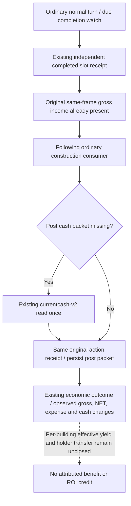

# Completed construction NET observation on the ordinary following turn

2026-10-08 / 2026-W41. Source parent is SDK
`dd4459fe0d38951ebdbc899a66c6a1c6608b2409`. Exact native identity remains
CK3 1.20.0.4 / Steam 25734779 / EXE SHA
`98702F88A547CDE2EAF29A85F93B85F68EE4CF8148336A4F7AFAEB75319DD518`.
Status: **SOURCE_NOTRUN**. Root owns the unique connected FIRST0 and adoption.

The existing [construction tree](domain-construction-ai.md),
[actual4 construction port](building-adopted-mcp-migration-12004.md) and
[economic consumer source](construction-economic-consumers-12004.md) already
provide independent active/completed slot material and current cash-v2.
Current cash uses gross `2BCA940`, complete expense `2BCB160` with context
`28BFD80`, current military `2C13F60` and all-raised `2C152B0`; the qualified v2
semantics make NET equal gross minus complete expense. No new native input,
query, C++ translation unit, flag or schema is needed.

## Concrete ordinary data-path gap

The normal completion watch reads a same-frame campaign root before the
independent completed-slot receipt. The receipt therefore commonly contains
`observed_player_monthly_gold_income_raw` and its original observation date.
It retains `pre_cash_v2` from the original native quote but does not yet contain
`post_cash_v2`.

`plan_construction_private` previously attached a post cash packet only when
the completed receipt's gross-income field was absent. A normal receipt with
gross already present skipped that branch. The economic classifier could
continue showing `post_completion_cash_v2_unavailable` even though the required
current cash observation already exists. A later quote's cash read did not
write the earlier completed receipt, and the standalone read-only MCP query
does not persist its returned material object. An older completed receipt in
`applied_prior` also lacked priority for that post packet.

The minimum fix considers a completed receipt due for economic observation
when either its gross field or its post cash packet is absent. It uses the
existing once-per-plan cash read and existing completed-receipt writer. An
existing gross value and observation date are retained; only a missing gross
field receives the new current value. The original action, start material,
pre cash packet and native paid cost remain intact, and an older action is
updated in its matching prior row without replacing a newer active action.
No additional construction expenditure is projected for this paid action.

The original M4 material window accepts independent applied construction
start material separately from completion and economic yield. This fix
improves observed outcomes; it does not change M4 requirements, create a
building action, or declare the window complete. Root's supplied saved6010
date53288568 is inside `[53286144,53303664]` with 629 game days remaining.
The current quiet-route quote/submit path is already qualified and remains
the ordinary entry. A new actual legal quote and original independent action
material are still needed. Historical quotes cannot be reused as spending
terms, and aggregate NET change does not attribute income to one building.

## Unique new Root check

`test_construction_completed_net_following_service_first0.py` contains one
compound. It starts with a controlled original in-progress receipt, runs the
registered ordinary completion turn through the real Service and slot
transport, then consumes the resulting gross-populated completed receipt on
the following normal plan through the real current-cash transport and durable
writer. The next plan observes the same economic result without another cash
read. A second leg checks a completed prior action beside a newer active one.
It checks an observed NET delta and independently paid native debit while
retaining false attribution/benefit flags. No old construction, quiet-route or
performance FIRST is rerun. Game, process and underlying idle choice are
explicit synthetic seams; this grants no live M4 credit.

Root's normal inbox template is provided externally. The source worker made
zero project imports, test runs, native builds, SDK/Game calls, EXE reads or
hashes and did not modify the shared progress reports.
