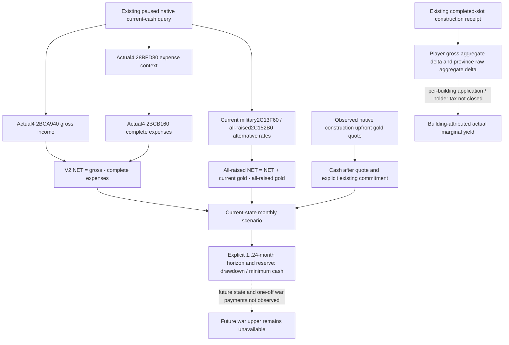
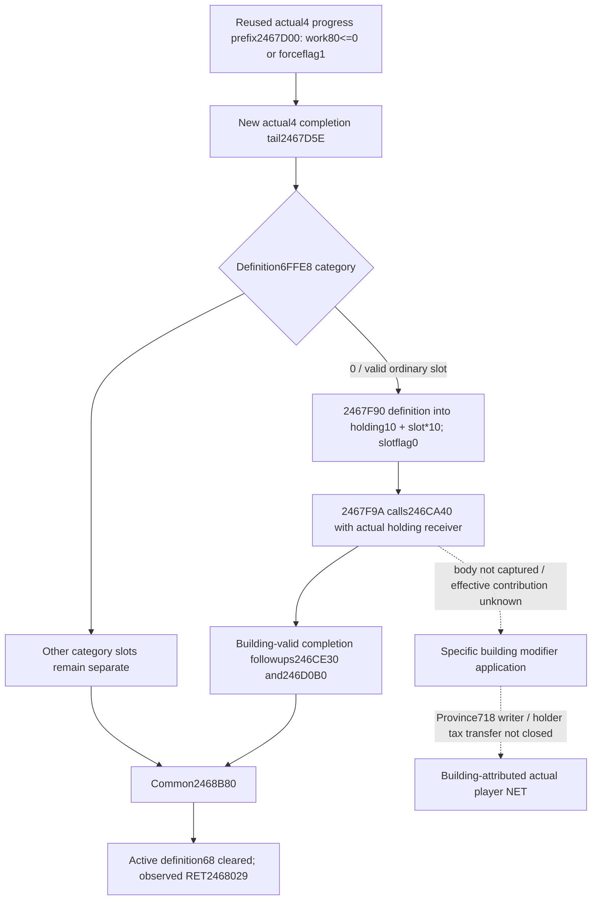

# Construction income outcomes and monthly cash scenarios — CK3 1.20.0.4

This package consumes existing sources at frozen root
`23c3c4bc7fdf261f46174d35db12732808523463`. Exact native identity is CK3
**1.20.0.4**, Steam **25734779**, EXE SHA-256
`98702F88A547CDE2EAF29A85F93B85F68EE4CF8148336A4F7AFAEB75319DD518`.
It adds no native callback or image reads. New Python consumers are
**SOURCE_PREPARED / NOTRUN** until Root performs their first focused checks and
registered query consumption. The existing `.4` construction query retains its
separate production-live primitive qualification.

## Existing actual construction input

The owner-reviewed small receipt is
`Z:/ck3_mod_rewrite_process_assets/g2-background-20261007/upstream-build-migration/construction-native-campaign-frame-fix/ACTUAL-RETRY02-OWNER-REVIEW.json`.
This package reads that metadata once and does not reopen the original query,
driver, save or native command result. Actual paused Robert29829, native4,
date53288256 observes 989 definitions, 512 final legality checks, 69 legal
native-cost samples, 8 owned baronies and 26 completed building rows. Its
selected empty slot at barony2103 / Province2635 / slot3 is
`cereal_fields_01`, type604, native gold cost14250000 /100000, with gold
83556691 /100000. Its authored direct monthly increment50 /100 is a
definition value. No building action, completion of that choice, or actual
marginal income is credited. Coverage remains bounded and the actual one-war,
one-army frame has unassessed shared/future war commitments.

## Native input tree before policy

The [adopted construction migration](building-adopted-mcp-migration-12004.md)
closes current final legality `2C77D30`, ten-resource final cost `2C247A0`,
completed/active state under Province+620 and the named monthly-income getter
`2B41FB0..2B4200A` reading signed64 Province+718. That last field is a province
aggregate with unclosed scale and holder-tax relationship. The selector's
19-key table describes unconditional authored income; it does not invoke a
per-building effective-yield evaluator.

Actual `.4` cash operands already reside in
`native_bridge/include/xar_bridge/ck3_12004_war_cash_claim_terms.hpp` and its
implementation. They reuse the existing reader/serializer DTO, with actual
`.4` binding and the `.4` v2 marker:

| Input | Actual `.4` source | Meaning |
| --- | --- | --- |
| Monthly income | `2BCA940` | Signed personal gold gross income/month /100000 |
| Expense context | `28BFD80` | Native context passed to the complete expense call |
| Complete monthly expense | `2BCB160` | Signed gold/month, including military expense |
| Current military expense | `2C13F60` | Actor-global ten-resource rate, gold slot0 |
| All-raised military expense | `2C152B0` | Alternative actor-global rate, gold slot0 |

`campaign_root.player_monthly_gold_income` publishes the income side. It must
not be treated as NET. The historical correction is retained in
[current cash sources](war-cash-current-resources-12003.md): only
`monthly_income_semantics.version=ck3-1.20.0.4-native-income-minus-total-expenses-v2`
certifies `NET = gross - complete expenses`. The existing cash normalizer
checks this identity, exact build, month/personal-gold scope and availability.
Its historical unmarked packets remain readable for archival purposes; the
new budget consumer explicitly requires v2. `.3` R0168 is historical source
and live evidence for that build, not `.4` live qualification.



## Smallest monthly consumer

`bridge/construction_monthly_budget_v1.py` accepts the existing normalized
current-cash response and explicit caller policy: the native one-time
construction gold quote, known existing gold commitment, reserve, and
1..24-month horizon. It returns two separate unchanged-state scenarios:

```text
current monthly rate = v2 NET
all-raised monthly rate = NET + current military gold - all-raised military gold
cash after immediate spend = treasury - quote - existing commitment
drawdown reservation = max(0, -scenario rate) * horizon months
scenario ending cash = cash after immediate spend + scenario rate * horizon months
minimum scenario cash = min(cash after immediate spend, scenario ending cash)
```

Military is already in NET. Current/all-raised are alternatives, counted once
across all wars; slot6 treasury is not personal gold. Positive monthly income
does not enlarge the cash available for an immediate purchase. No authored
building gain is added to future cash. The all-raised scenario varies military
rate while keeping the observed nonmilitary expense and income unchanged; it
is explicitly a scenario, never a future-cost upper bound or proof of actual
payments. Missing input is partial with its actual reason, not zero.

The finite query wrapper calls the existing
`driver.query_war_cash_current_resources_private_v1` once and projects that
single receipt. It sends no action, starts no loop and performs no second
cash or construction query. Root can register it using the same conditional
`allow_private_war_cash_query` block as the existing current-cash tool:

```python
from .construction_monthly_budget_v1 import query_construction_monthly_budget_private_v1

@server.tool(annotations=read_only_tool)
def ck3_query_construction_monthly_budget_private_v1(
    expected_revision: int, construction_gold_cost_raw: int,
    reserve_gold_raw: int, existing_commitment_gold_raw: int,
    horizon_months: int,
) -> dict[str, object]:
    return query_construction_monthly_budget_private_v1(
        driver, expected_revision=expected_revision,
        construction_gold_cost_raw=construction_gold_cost_raw,
        reserve_gold_raw=reserve_gold_raw,
        existing_commitment_gold_raw=existing_commitment_gold_raw,
        horizon_months=horizon_months,
    )
```

That registration is a concrete Root hook recipe, not a claim that this branch
has edited the shared MCP server or installed a new tool. A future formal
construction selector may use the current-state reserve result after binding
its already observed candidate to the same paused cash receipt. The existing
wartime spend hold and M5 sourced future-upper/risk requirements remain in
force as capability gaps, not revoked domain restrictions. Scenario math
alone does not release those requirements.

The helper labels the upfront cost `caller_supplied_gold_quote`: it does not
read or verify the construction candidate itself. Root's formal hook must
match the existing candidate's `gold_before_raw` and source actor/revision/date
to the cash receipt before treating this scenario as that candidate's budget.

## Construction outcome consumption

`construction_economic_outcome_v1.py` projects the already durable receipt into
pending, active or independently completed material and computes signed
player-gross and province aggregate changes from their real baselines. Its
formal hook adds `construction_economic_outcome` alongside the consumed
receipt. It neither repeats an observation nor changes watch deadlines,
candidate ranking or action selection.

Post income must be observed at or after the recorded completion date. Zero
and negative aggregate changes are valid observations. A missing pre-submit
baseline cannot be repaired by a fresh current query. The existing root-query
then receipt route can supply missing post-player income; the existing due
receipt watch can retry unreadable province income. Progress/divisor values
never imply completion. The projection keeps authored increment, observed
aggregate change, and unobserved building-attributed marginal benefit separate.
Neither aggregate enters M5 as realized ROI or NET.

## Remaining useful source work and verification boundary

Actual building yield next requires the Province+718 write/recompute chain,
one building's unconditional/conditional province modifier application and
its holder-tax transfer. Their `.4` source RVAs are not closed by the existing
90-byte getter; locating those bounded producers is the concrete next native
work package. A prospective MAA purchase likewise lacks type/count/player
incremental recurring maintenance, despite the existing final upfront quote.
Current actor totals cannot fill that missing new-regiment rate with zero.

Root owns the first focused Python checks, in-memory registered MCP
consumption and any already scheduled actual paused cash query. This branch
runs no tests, project imports, builds, EXE reads, game, SDK or Steam calls.
It adds zero saved days, no `.4` cash live credit, no new construction action
and no NW-ECON/G2-M4 completion. `open_kaishek` preverification is
not-applicable to this Python projection: it adds no Paradox script or native
finite-runtime semantics; the pending focused Python tests cover the actual
arithmetic and receipt classifications.

## 2026-10-07 first checks and bounded completion source

Root's first focused check of source `f81bb50c5622d09bacf99eb2b093f5e44fc5ceee`
passed all 14 tests once (`economy-RESULT.json`, pytest exit 0), without game or
SDK calls. This qualifies those Python semantics, not a registered-tool query,
actual `.4` cash value, or building yield. The original 14 need no repeat solely
because of this append.

Root then authorized a finite completion-source extension. The sole mapper
read 1432 new bytes in 4 reads: each image's 708-byte completion tail and 8-byte
return probe. Both pairs decoded completely with equal normalized instruction
spans and concrete member operands. The already held 94-byte progress prefix,
Province+718 getter, definitions and modifier ledger were reused. There was
no callee capture, xref scan, whole EXE read/hash, game, build or test.

Evidence is under
`Z:/ck3_mod_rewrite_process_assets/g2-parallel-20261007/economy-yield/`:
`COMPLETION-TAIL-APPROVED-MANIFEST.json`,
`completion-tail-first01/FAMILY-MAP.json` and its two detail records. The tail
is actual `.3` `[2467D7E,2468042)` and `.4` `[2467D5E,2468022)`; those starts
are explicit completion branch targets in the previously captured prefixes.
The 8-byte probes observe actual successful returns, `.3` RET 2468049 and
`.4` RET 2468029. No global RVA shift is used as source proof.

For the ordinary category 0 branch, actual `.4` uses definition+6FFE8,
requires slot in `[0,count1C)`, computes `holding+10 + slot*10`, writes the
definition at 2467F90 and clears the slot byte+8 at 2467F93. The call immediately
after this write is 2467F9A→**246CA40**, with RCX=the holding construction state;
the actual `.3` counterpart is 246CA60. Other categories write their separate
slots, so the ordinary built-slot meaning must not be extended to all
category values. Building-valid followups receive the same definition,
holding+F0 and initiator+D8 at 246CE30 and 246D0B0. The paths then converge at
2467FDD→**2468B80** (`.3` 2468BA0), clear active definition+68 at 246801A and
return. These are actual reached source edges, not executed callbacks.

The immediately post-slot 246CA40 is now the precise smallest next candidate
for effective effect/recalculation source. Its body and semantic identity
remain unobserved. The common 2468B80 is separate; neither has been relabeled
as an income getter or equated by name with historical 1.19 recalculation.
Only a separately approved finite one-callee plan may capture either body.



## Existing consumer: actual before/post financial observation

The same `construction_economic_outcome_v1` now accepts optional existing
`pre_cash_v2` and `post_cash_v2` observations. It classifies an actual completed
construction alongside gross-income, complete-expense and true-NET monthly
rate changes, and the actual personal-gold stock difference. These are
deliberately two dates; the output preserves both source frames and actual
elapsed game hours rather than pretending they were one paused frame.

The pre packet must come from the receipt's actual pre-submit date; the post
packet must be at or after its independently observed completion. Both use
the same actual actor and exact `.3` or `.4` v2 identity. The native cash
reader/normalizer already supplies all these fields, so no native source or
new query is required. Missing baseline cannot be repaired through a current
reading. The current formal hook can consume packets already attached to
the receipt; supplying them never triggers a second read here.

An optional cash residual adds back only the construction debit proved by the
original verified start receipt's before/after treasury and action ID. Without
that independent debit proof, the raw stock difference remains observed but
the residual stays unavailable. The residual is not construction payback:
other real transactions during the interval remain unallocated. Positive NET
change with unchanged gross can reflect reduced expenses, and neither a
positive NET change nor positive residual proves a building-exclusive gain.
`building_attribution_ready`, `net_benefit_ready` and realized M5 value remain
false. This is the smallest useful actual-financial classifier while the
specific modifier/holder-tax source remains open.

The sole new semantic test uses unchanged gross, changed complete expenses,
an independently proved one-time debit, and interval cash movement. It is
**NOTRUN** in this lane; Root runs only that new case. It does not replay the
already GREEN 14 or claim a real completed Robert sample.
