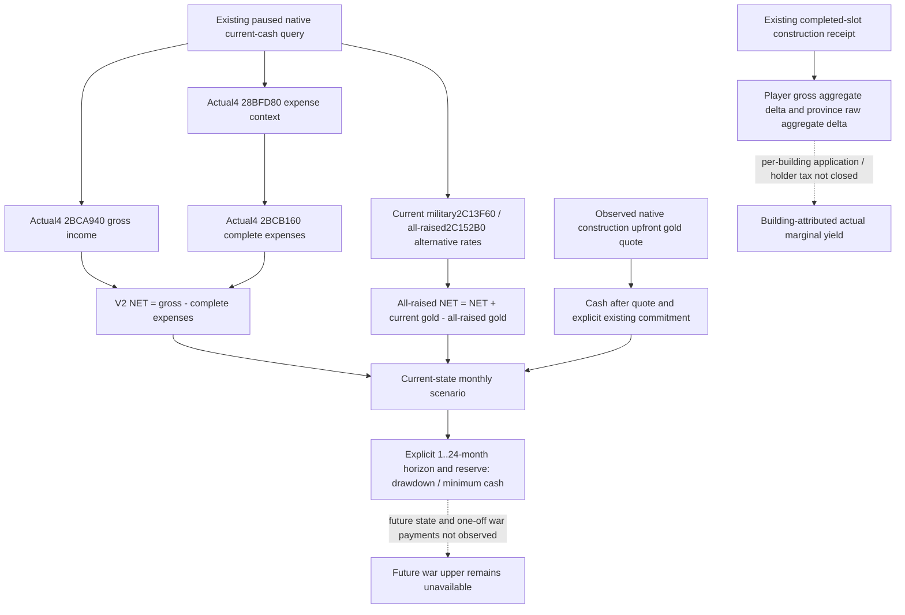
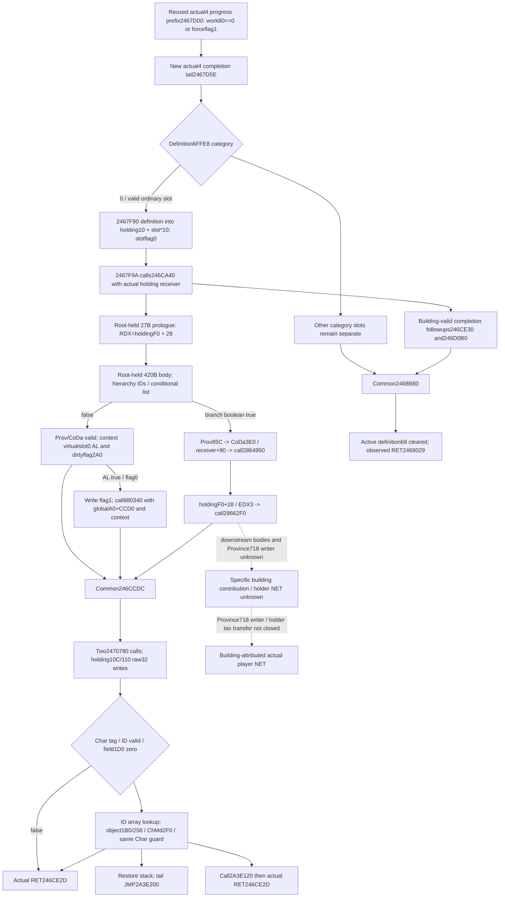
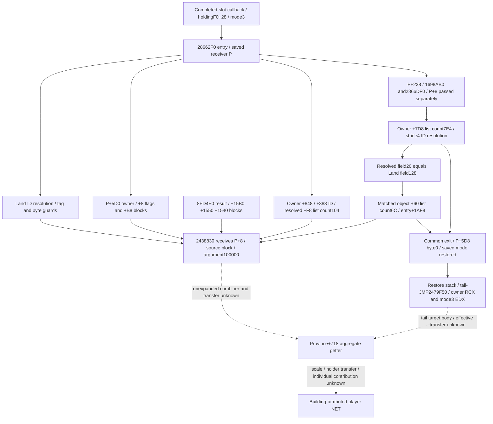
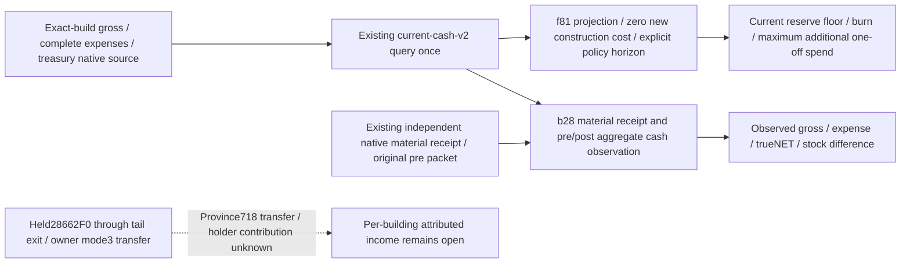
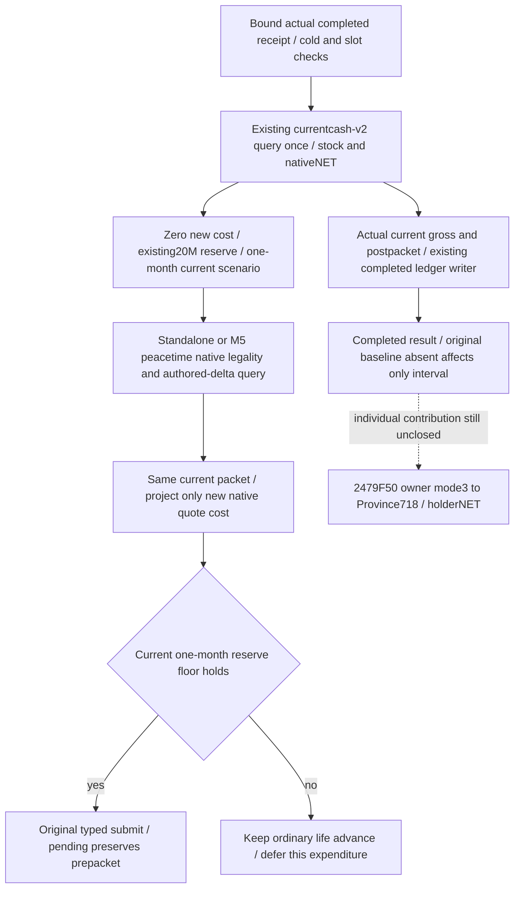

# Construction income outcomes and monthly cash scenarios — CK3 1.20.0.4

This package consumes existing sources at frozen root
`23c3c4bc7fdf261f46174d35db12732808523463`. Exact native identity is CK3
**1.20.0.4**, Steam **25734779**, EXE SHA-256
`98702F88A547CDE2EAF29A85F93B85F68EE4CF8148336A4F7AFAEB75319DD518`.
It adds no native callback or image reads. New Python consumers are
**SOURCE_PREPARED / NOTRUN** until Root performs their first focused checks and
registered query consumption. The existing `.4` construction query retains its
separate production-live primitive qualification.

## Existing actual construction input

The owner-reviewed small receipt is
`Z:/ck3_mod_rewrite_process_assets/g2-background-20261007/upstream-build-migration/construction-native-campaign-frame-fix/ACTUAL-RETRY02-OWNER-REVIEW.json`.
This package reads that metadata once and does not reopen the original query,
driver, save or native command result. Actual paused Robert29829, native4,
date53288256 observes 989 definitions, 512 final legality checks, 69 legal
native-cost samples, 8 owned baronies and 26 completed building rows. Its
selected empty slot at barony2103 / Province2635 / slot3 is
`cereal_fields_01`, type604, native gold cost14250000 /100000, with gold
83556691 /100000. Its authored direct monthly increment50 /100 is a
definition value. No building action, completion of that choice, or actual
marginal income is credited. Coverage remains bounded and the actual one-war,
one-army frame has unassessed shared/future war commitments.

## Native input tree before policy

The [adopted construction migration](building-adopted-mcp-migration-12004.md)
closes current final legality `2C77D30`, ten-resource final cost `2C247A0`,
completed/active state under Province+620 and the named monthly-income getter
`2B41FB0..2B4200A` reading signed64 Province+718. That last field is a province
aggregate with unclosed scale and holder-tax relationship. The selector's
19-key table describes unconditional authored income; it does not invoke a
per-building effective-yield evaluator.

Actual `.4` cash operands already reside in
`native_bridge/include/xar_bridge/ck3_12004_war_cash_claim_terms.hpp` and its
implementation. They reuse the existing reader/serializer DTO, with actual
`.4` binding and the `.4` v2 marker:

| Input | Actual `.4` source | Meaning |
| --- | --- | --- |
| Monthly income | `2BCA940` | Signed personal gold gross income/month /100000 |
| Expense context | `28BFD80` | Native context passed to the complete expense call |
| Complete monthly expense | `2BCB160` | Signed gold/month, including military expense |
| Current military expense | `2C13F60` | Actor-global ten-resource rate, gold slot0 |
| All-raised military expense | `2C152B0` | Alternative actor-global rate, gold slot0 |

`campaign_root.player_monthly_gold_income` publishes the income side. It must
not be treated as NET. The historical correction is retained in
[current cash sources](war-cash-current-resources-12003.md): only
`monthly_income_semantics.version=ck3-1.20.0.4-native-income-minus-total-expenses-v2`
certifies `NET = gross - complete expenses`. The existing cash normalizer
checks this identity, exact build, month/personal-gold scope and availability.
Its historical unmarked packets remain readable for archival purposes; the
new budget consumer explicitly requires v2. `.3` R0168 is historical source
and live evidence for that build, not `.4` live qualification.



## Smallest monthly consumer

`bridge/construction_monthly_budget_v1.py` accepts the existing normalized
current-cash response and explicit caller policy: the native one-time
construction gold quote, known existing gold commitment, reserve, and
1..24-month horizon. It returns two separate unchanged-state scenarios:

```text
current monthly rate = v2 NET
all-raised monthly rate = NET + current military gold - all-raised military gold
cash after immediate spend = treasury - quote - existing commitment
drawdown reservation = max(0, -scenario rate) * horizon months
scenario ending cash = cash after immediate spend + scenario rate * horizon months
minimum scenario cash = min(cash after immediate spend, scenario ending cash)
```

Military is already in NET. Current/all-raised are alternatives, counted once
across all wars; slot6 treasury is not personal gold. Positive monthly income
does not enlarge the cash available for an immediate purchase. No authored
building gain is added to future cash. The all-raised scenario varies military
rate while keeping the observed nonmilitary expense and income unchanged; it
is explicitly a scenario, never a future-cost upper bound or proof of actual
payments. Missing input is partial with its actual reason, not zero.

The finite query wrapper calls the existing
`driver.query_war_cash_current_resources_private_v1` once and projects that
single receipt. It sends no action, starts no loop and performs no second
cash or construction query. Root can register it using the same conditional
`allow_private_war_cash_query` block as the existing current-cash tool:

```python
from .construction_monthly_budget_v1 import query_construction_monthly_budget_private_v1

@server.tool(annotations=read_only_tool)
def ck3_query_construction_monthly_budget_private_v1(
    expected_revision: int, construction_gold_cost_raw: int,
    reserve_gold_raw: int, existing_commitment_gold_raw: int,
    horizon_months: int,
) -> dict[str, object]:
    return query_construction_monthly_budget_private_v1(
        driver, expected_revision=expected_revision,
        construction_gold_cost_raw=construction_gold_cost_raw,
        reserve_gold_raw=reserve_gold_raw,
        existing_commitment_gold_raw=existing_commitment_gold_raw,
        horizon_months=horizon_months,
    )
```

That registration is a concrete Root hook recipe, not a claim that this branch
has edited the shared MCP server or installed a new tool. A future formal
construction selector may use the current-state reserve result after binding
its already observed candidate to the same paused cash receipt. The existing
wartime spend hold and M5 sourced future-upper/risk requirements remain in
force as capability gaps, not revoked domain restrictions. Scenario math
alone does not release those requirements.

The helper labels the upfront cost `caller_supplied_gold_quote`: it does not
read or verify the construction candidate itself. Root's formal hook must
match the existing candidate's `gold_before_raw` and source actor/revision/date
to the cash receipt before treating this scenario as that candidate's budget.

## Construction outcome consumption

`construction_economic_outcome_v1.py` projects the already durable receipt into
pending, active or independently completed material and computes signed
player-gross and province aggregate changes from their real baselines. Its
formal hook adds `construction_economic_outcome` alongside the consumed
receipt. It neither repeats an observation nor changes watch deadlines,
candidate ranking or action selection.

Post income must be observed at or after the recorded completion date. Zero
and negative aggregate changes are valid observations. A missing pre-submit
baseline cannot be repaired by a fresh current query. The existing root-query
then receipt route can supply missing post-player income; the existing due
receipt watch can retry unreadable province income. Progress/divisor values
never imply completion. The projection keeps authored increment, observed
aggregate change, and unobserved building-attributed marginal benefit separate.
Neither aggregate enters M5 as realized ROI or NET.

## Remaining useful source work and verification boundary

Actual building yield next requires the Province+718 write/recompute chain,
one building's unconditional/conditional province modifier application and
its holder-tax transfer. Their `.4` source RVAs are not closed by the existing
90-byte getter; locating those bounded producers is the concrete next native
work package. A prospective MAA purchase likewise lacks type/count/player
incremental recurring maintenance, despite the existing final upfront quote.
Current actor totals cannot fill that missing new-regiment rate with zero.

Root owns the first focused Python checks, in-memory registered MCP
consumption and any already scheduled actual paused cash query. This branch
runs no tests, project imports, builds, EXE reads, game, SDK or Steam calls.
It adds zero saved days, no `.4` cash live credit, no new construction action
and no NW-ECON/G2-M4 completion. `open_kaishek` preverification is
not-applicable to this Python projection: it adds no Paradox script or native
finite-runtime semantics; the pending focused Python tests cover the actual
arithmetic and receipt classifications.

## 2026-10-07 first checks and bounded completion source

Root's first focused check of source `f81bb50c5622d09bacf99eb2b093f5e44fc5ceee`
passed all 14 tests once (`economy-RESULT.json`, pytest exit 0), without game or
SDK calls. This qualifies those Python semantics, not a registered-tool query,
actual `.4` cash value, or building yield. The original 14 need no repeat solely
because of this append.

Root then authorized a finite completion-source extension. The sole mapper
read 1432 new bytes in 4 reads: each image's 708-byte completion tail and 8-byte
return probe. Both pairs decoded completely with equal normalized instruction
spans and concrete member operands. The already held 94-byte progress prefix,
Province+718 getter, definitions and modifier ledger were reused. There was
no callee capture, xref scan, whole EXE read/hash, game, build or test.

Evidence is under
`Z:/ck3_mod_rewrite_process_assets/g2-parallel-20261007/economy-yield/`:
`COMPLETION-TAIL-APPROVED-MANIFEST.json`,
`completion-tail-first01/FAMILY-MAP.json` and its two detail records. The tail
is actual `.3` `[2467D7E,2468042)` and `.4` `[2467D5E,2468022)`; those starts
are explicit completion branch targets in the previously captured prefixes.
The 8-byte probes observe actual successful returns, `.3` RET 2468049 and
`.4` RET 2468029. No global RVA shift is used as source proof.

For the ordinary category 0 branch, actual `.4` uses definition+6FFE8,
requires slot in `[0,count1C)`, computes `holding+10 + slot*10`, writes the
definition at 2467F90 and clears the slot byte+8 at 2467F93. The call immediately
after this write is 2467F9A→**246CA40**, with RCX=the holding construction state;
the actual `.3` counterpart is 246CA60. Other categories write their separate
slots, so the ordinary built-slot meaning must not be extended to all
category values. Building-valid followups receive the same definition,
holding+F0 and initiator+D8 at 246CE30 and 246D0B0. The paths then converge at
2467FDD→**2468B80** (`.3` 2468BA0), clear active definition+68 at 246801A and
return. These are actual reached source edges, not executed callbacks.

The immediately post-slot 246CA40 is now the precise smallest next candidate
for effective effect/recalculation source. Its body and semantic identity
remain unobserved. The common 2468B80 is separate; neither has been relabeled
as an income getter or equated by name with historical 1.19 recalculation.
Only a separately approved finite one-callee plan may capture either body.



## Existing consumer: actual before/post financial observation

The same `construction_economic_outcome_v1` now accepts optional existing
`pre_cash_v2` and `post_cash_v2` observations. It classifies an actual completed
construction alongside gross-income, complete-expense and true-NET monthly
rate changes, and the actual personal-gold stock difference. These are
deliberately two dates; the output preserves both source frames and actual
elapsed game hours rather than pretending they were one paused frame.

The pre packet must come from the receipt's actual pre-submit date; the post
packet must be at or after its independently observed completion. Both use
the same actual actor and exact `.3` or `.4` v2 identity. The native cash
reader/normalizer already supplies all these fields, so no native source or
new query is required. Missing baseline cannot be repaired through a current
reading. The current formal hook can consume packets already attached to
the receipt; supplying them never triggers a second read here.

An optional cash residual adds back only the construction debit proved by the
original verified start receipt's before/after treasury and action ID. Without
that independent debit proof, the raw stock difference remains observed but
the residual stays unavailable. The residual is not construction payback:
other real transactions during the interval remain unallocated. Positive NET
change with unchanged gross can reflect reduced expenses, and neither a
positive NET change nor positive residual proves a building-exclusive gain.
`building_attribution_ready`, `net_benefit_ready` and realized M5 value remain
false. This is the smallest useful actual-financial classifier while the
specific modifier/holder-tax source remains open.

The sole new semantic test uses unchanged gross, changed complete expenses,
an independently proved one-time debit, and interval cash movement. Root
reported this one new case **GREEN**, on source
`b28a1e7af392e4fbc3ed4de7d694c3e2331acb0b`, alongside the retained original
14. This lane did not run or repeat them. No real completed Robert cash
interval is claimed by those controlled inputs.

## Root-held post-slot prologue and the next finite body interval

Root centrally captured exactly 54 bytes in two reads after explicit plan
approval: `.3 [246CA60,246CA7B)` and `.4 [246CA40,246CA5B)`. The instruction
spans decode completely and normalize equal. This result closes a **27-byte
runtime interval**, not the whole function: it pushes registers, subtracts
stack space, loads RDX from holding+F0, loads RAX from actual RIP target
5C68C50, adds 28 to RDX and falls through at 246CA5B. There is no CALL or RET
in this held interval and no Province+718 write. The initial plan's phrase
"complete wrapper" was a hypothesis corrected by this actual source result.

The result and detail are under
`Z:/ck3_mod_rewrite_process_assets/g2-parallel-20261007/economy-yield/completion-post-slot-root-first01/`.
Only this generated detail was reviewed here; no further executable bytes,
PE metadata, symbols or hashes were read by this lane. The corresponding
existing runtime-table rows identify the immediately adjacent continuation:
old `[246CA7B,246CC1F)` and actual `[246CA5B,246CBFF)`, each 420 bytes. A
separate proposal limited the next source read to these two contiguous
intervals, 840 fresh bytes total. Root explicitly approved and centrally
executed it once at 06:18:50–06:18:51 UTC on October 7. Both 420-byte spans
decode completely and normalize equal. The actual body reaches:

- 246CA71→2A3E020 with the prior holding+F0/+28 input and an indirect global
  receiver, then 246CA79→2467540 and 246CA84→2BAA6F0. The latter return is
  consumed as the branch boolean; their semantic identities remain unknown.
- The owner-like object+738 ID, two hierarchy+108 IDs, then a +110/count11C
  four-byte ID list. On the true branch, each resolved ID is passed to
  230F8E0; the result is checked for `Prov` tag at+85C, then +848 supplies
  an object checked for `CoDa` tag at+3E0. Actual 246CBC2 calls2864950 with
  that object's+90 receiver. No callee body was captured.
- Actual 246CBEE calls28662F0 with RCX=`holdingF0+28`, EDX=3 and then jumps
  to 246CCDC. These source operands are concrete; the numeric mode and
  operation semantics are not renamed as an income recalculation.

The false branch enters 246CBF8 and that 420-byte interval ends after its
first instruction at246CBFF. Root then explicitly approved and centrally
captured the contiguous 632-byte pair once: old `[246CC1F,246CD5B)` and
actual `[246CBFF,246CD3B)`, each316 bytes, complete decode/normalized equal.
This closes the false branch's actual deferred path: after the same Prov/CoDa
checks, the CoDa+90 context's virtual slot0 must return AL=true and its
byte+2A0 must be zero before it writes that byte1 and calls880340 with the
context pointer and global+A0+CCD0 receiver. Failed guards skip that enqueue.

Both paths converge at246CCDC. Two calls2470780 use holding RCX and the two
stack function-object code targets2465C80 and1F12FB0; EAX is written into
holding+10C and+110. These are concrete raw32 cached fields, without a
proven tax/income unit or callback semantics. This interval then checks the
2467540-returned object's `Char` tag+1C and branches246CD35→246CE25; it
ends at246CD3B. The earlier 632-byte proposal's return closure was therefore
not yet satisfied by that fragment alone.

Root's final approved pair reads only the held remaining runtime interval:
old `[246CD5B,246CE4E)` and actual `[246CD3B,246CE2E)`, each243 bytes,
486 total in two reads. It also decodes completely and normalizes equal.
The actual callback now has two proven terminal paths: normal RET246CE2D
(`.3`246CE4D) and a stack-restored tail jump2A3E200 (`.3`2A3E220), whose
target body remains uncaptured. The final branch requires Char+18 ID != -1
and Char+1D0 == 0. It calls880430 with global+A0's +22358/count22364 ID
array and the ID, then uses Char+1B0→+258, same-Char pointer+8 and `ChMd`
tag+2F0 guards. One guarded path tail-jumps2A3E200; the other calls2A3E120
(`.3`2A3E140) before the normal RET. Failed/null/invalid guards return at
that normal epilogue. No expanded callee or caller was captured.

The reached callback's full source is thus held across four central pairs:
actual `[246CA40,246CE2E)` and old `[246CA60,246CE4E)`, 1006 bytes per
image / 2012 bytes total. This closes its actual control flow and direct
mutations, not a per-building income getter. There is no Province+718 write,
building-attributed gold output or holder true-NET formula in these held
bytes. The direct 28662F0 holding+F0/+28, mode3 edge is the separately
authorized source entrance documented below; the callback closure does not
itself establish that context's contribution/recalculation semantics.

Final evidence folders under the same external economy-yield directory are
`completion-post-slot-return-tail-root-first01/` and
`completion-post-slot-holder-exit-root-first01/`, with `FAMILY-MAP.json` and
the owned detail records. Each capture ran centrally once, exited0 and
retained both exact images. Only generated finite details and held interval
rows were read by this lane. No live callback execution, new test, symbol
scan, PE/pdata reparse or source expansion is claimed.

## Source-only adapter for the current shared Root hooks

The two small source-ready utilities now live in the existing
`construction_economic_outcome_v1.py`:
`prepare_construction_cash_fields_v1` and
`completed_construction_cash_fields_v1`. They reuse the already GREEN f81
projection/b28 classifier and copy the observed packets. No new arithmetic,
query or action is added. The reviewable integration aliases are in
`Z:/ck3_mod_rewrite_process_assets/g2-parallel-20261007/economy-yield/ROOT-SHARED-HOOK-ADAPTER.py`.
It calls the existing f81 projection and b28 classifier, with no independent
arithmetic, query or action. Root can use an existing normalized current-cash
query from the same paused pre-submit interval; collect it **before** the
construction quote/action path so this adapter does not insert a query
between the authoritative quote and native send. Root's source coupling is:

- Use the actual construction query's `candidate.stock_gold_cost_raw` as the
  projection's cost. Keep the caller-supplied cost basis; reserve, existing
  commitments and 1–24 months are explicit Root policy inputs.
- Preserve the existing cash-v2 packet only when its actor/date and exact
  version/SHA are the quote's paused actor/date and exact build, and its
  observed treasury matches `candidate.gold_before_raw`. These observations
  retain their own query/revision metadata; do not invent a shared revision.
- Add `prepare_construction_cash_fields_v1(...)` output to the durable pending
  payload at `domain_construction_private_transport_v1.py`'s pending creation
  (`pre_date_raw`, `actor_character_id`, native quote and action ID already
  exist there). Its `pre_cash_v2` comes directly from the f81 projection's
  `source_cash_resources`, with no second read.
- The first material receipt is a freshly constructed dictionary. Copy
  `pre_cash_v2` and `construction_monthly_budget` from pending before the
  existing ledger writer persists it. Later completion rechecks already
  merge the original pending/applied dictionary and preserve `start_receipt`;
  preserve these two fields through the same path.
- After the independent native completed-slot receipt, use the current
  normalized cash-v2 observation to call `completed_construction_cash_fields_v1`
  and persist its enriched `receipt` through the existing ledger writer.
  The formal consumer's existing outcome hook then consumes the attached
  pre/post packets. A start ACK, active row, zero remaining work or current
  query without the original baseline cannot supply a completed interval.

This is source ready for Root integration, with no shared driver/server file
edited here and no new test repetition. Root still owns registration,
paused actual `.4` finance collection and real receipt sampling. A projected
reserve floor is a current-state scenario and does not by itself admit a
war/construction action or claim an attributed building benefit.

Root adopted the same-cash utility commit
`43c8d69c2acc2bf701e3378ac16fa309247ed5b9` as `79faa931`; this updates the
source availability, not the live finance/sample boundary. The callback
source above also demonstrates that completed-slot and later aggregate
finance are distinct observations: a queued context/cached-field update
cannot be substituted for an actual cash-v2 rate reading. The existing
classifier keeps the observed monthly NET difference separate from an
attributed building benefit. No new cash-outcome rule or test replay is
needed merely to record this source closure.

## Unique mode3 entrance and a finite same-cash outcome query

The next authorized research entrance is only the held actual
246CBEE→28662F0 edge with RCX=`holdingF0+28`, EDX=3. The closed 1006-byte
callback is retained without another review. A nonrecursive named-range
lookup in the central mapper's five existing cache directories found no
old/actual cache covering this new entry, with zero payload reads. Existing
runtime rows bound the paired entry interval to old `[2866310,286659A)` and
actual `[28662F0,286657A)`, each 650 bytes. Root centrally executed
`PROVINCE-CONTEXT-MODE3-PROPOSED-MANIFEST.json` once on 2026-10-07
07:54:49–07:54:50 UTC: 1300 fresh bytes / two reads, exit0, one
`complete_instruction_span_normalized_equal` row. The retained result is
`province-context-mode3-root-first01/FAMILY-MAP.json` and its owned DETAIL
under the same external economy-yield directory. This lane consumed only
that finite generated cache; no additional source, callee or caller was read.

The actual entry saves mode3 and retains the supplied receiver in R15. Let
`P = holdingF0+28`. The following operands are source facts, rather than
names inferred from the numerical offsets:

| Actual instruction / branch | Concrete input or destination passed | Source boundary |
| --- | --- | --- |
| 2866304→2866280; 2866315–2866349 | Call with the entry receiver, then use RCX+5D0→+738 to resolve an ID; fallback global object | The first helper body and its RCX post-call convention are unclosed |
| 2866350–28663F0 | Resolved `Land` tag+14, ID+10 and byte+1D8 guard; call2866BF0(P, Land) | Calls under the Land branch; byte guards are not renamed as tax semantics |
| 286638C–2866397 | `8FD4E0` result+15B0→+40 to `2438830(P+8, input, 100000)` | Input block and call arguments are held; combiner body is unexpanded |
| 286639C–28663C8 | `P+5D0`→+8 object bytes+18/+1B gate `8FD4E0` result+1550→+40 to the same P+8 destination | Both flags must be nonzero |
| 28663CD–28663E5 | That +8 object→+B8→+230 to the same destination / argument100000 | This is a source block pointer, not a proved income rate |
| 28663F5–286644B | Call2866870(P), then the same +18/+1B guard supplies global result+1540→+40; +B8→+70 supplies another input | No direct member write is visible outside the unexpanded callees |
| 2866450–286647F | Call2481290(P+5D0), result+40 to 2438830; call2491D60(P+8, (P+5D0)+608) | Actual owner backpointer and separate source block |
| 2866484–2866501 | `P+5D0`→+848→+388 ID resolution; resolved/fallback object list+F8/count104, stride8 entries to 2438830(P+8, entry,100000) | The finite list traversal is held; entry semantics remain unclosed |
| 286650A–2866531 | Call28666A0(P); call1698AB0(P+238); call2866DF0(owner, R9=P+238, fifth argument=P+8) | Two distinct context destinations are passed; helper mutations are not yet established |
| 2866536–286657A | Owner+7D8/count7E4, stride4 list; zero/empty branch to286667A | The interval stops while setting up this list, before its body or return |

Repeated calls sharing P+8 and argument100000 are consistent with an
aggregate input combiner, but that meaning is an inference; 100000 here does
not establish a gold unit. The captured interval stores mode3 but does not
yet show its consumption. It contains neither a direct Province+718 write
nor the holder gross/expense/NET formula, and ends before the function's
return. If holdingF0 is the Province pointer, P+8 is Province+30 and P+238
is Province+260 by arithmetic; neither is Province+718. The downstream
transfer between these contexts and the already held Province+718 getter
remains the specific missing source relationship. No new ABI yield field or
per-building benefit is published from these unresolved operands.

Root explicitly authorized and centrally captured the same-function
continuation once at 08:18:07–08:18:08 UTC: actual `[286657A,286669E)` /
old `[286659A,28666BE)`, 292 bytes each / 584 bytes in two reads, exit0 and
one `complete_instruction_span_normalized_equal` row. Existing adjacent
runtime rows bounded a 256-byte continuation and the 36-byte common interval
already reached by the paired forward branches. The retained artifact is
`province-context-mode3-continuation-root-first01/FAMILY-MAP.json` and its
owned DETAIL. No downstream callee body was included.

The owner+7D8/count7E4 four-byte ID loop now closes. Each ID resolves to an
object through one global registry (fallback object retained), whose field+20
must equal field+128 on the owner+738-resolved Land object (its own registry
fallback is retained). Only a match traverses that first object's pointer
list+60/count6C, stride8. Actual2866620–2866633 passes each entry+1AF8 into
`2438830(P+8, input,100000)`. It then advances the outer ID pointer by4 and
loops. These operands do not yet establish the entries as individual
buildings or the source block as gold income.

The common actual286667A–286669E exit restores the saved mode into EDX,
explicitly writes byte `P+5D8=0`, restores nonvolatile registers and stack,
then tail-jumps at2866699 to2479F50 (old2479F70). RCX is the owner from
`P+5D0`, loaded either before the empty-list branch or after loop completion;
EDX is the saved mode3 supplied by the completed-slot callback. Thus the
same function is held through its concrete stack-restored tail exit:
actual `[28662F0,286669E)` / old `[2866310,28666BE)`, 942 bytes per image,
1884 paired bytes across two approved central captures. It does not end in
a RET, and the tail target body remains unexpanded. This closes the mode
transfer and the one direct context-byte mutation, without changing the
unproved Province+718/holder-NET relationship. The concrete remaining source
edge is now `2479F50(owner,3)`; no blind follow-up capture is authorized here.



The independent financial query uses only the already closed cash input
tree: exact `.4` gross2BCA940, complete expense2BCB160 with context28BFD80,
treasury, and the existing normalized cash-v2 NET=gross−complete expenses.
It does not depend on mode3 semantics or a per-building prediction:



`query_construction_cash_outcome_private_v1` is a small leaf in the same
outcome module. It calls the existing f81 budget query exactly once with
new construction cost0, then passes that projection's **same**
`source_cash_resources` to the adopted completed-receipt utility/b28
classifier. The zero is an explicit new-spend projection: an independently
verified construction debit is already in actual treasury and is not
deducted again. Caller-provided reserve, commitments and 1–24 months retain
their current-state assumptions. A missing original financial baseline
leaves interval attribution unavailable while the current cash floor can
still support an independent visible decision.

Root's shared adapter can supply the existing
`plan.construction_receipt_consumed` as `material_receipt` and the current
public revision, then preserve the returned `material_receipt` through the
existing ledger writer. Registration uses the already authorized private
war-cash permission and read-only tool annotation, for example
`ck3_query_construction_cash_outcome_private_v1`; no new registration or
driver file is edited here. The leaf performs no construction query,
native action, budget arithmetic or per-building benefit calculation.
Source is ready for Root integration; this new query leaf is **NOTRUN** in
this lane and does not inherit a live-sample claim from the retained 15
GREEN controlled cases. Its financial inputs and arithmetic reuse those
qualified consumers instead of retesting them.

The reviewable `ROOT-SAME-CASH-REGISTRATION.patch` is now external under the
same economy-yield directory, with exactly two shared-file hunks for Root:
`bridge/native_driver.py` and `bridge/mcp_server.py`. The driver reads
`read_construction_ledger(self.state_dir)["applied"]` when durable state is
configured, then sends that actual material receipt into the leaf. With no
applied receipt it supplies an empty interval input, while the independent
current-cash scenarios remain available. The MCP tool takes only current
revision and explicit reserve/commitment/horizon inputs; it does not accept
a caller-authored receipt. Registration sits under the existing
`allow_private_war_cash_query` condition and uses the existing read-only
annotation. It neither writes the ledger nor reissues a construction query.
The original `pre_cash_v2` remains absent until the production start path
has actually saved it; registration cannot invent that baseline. Root still
owns applying these two hunks and the pre-submit receipt-field preservation
described above.

There is no new native ABI, opcode, DLL export, CMake source or compile input.
Root integration needs leaf commit1b49, the already adopted f81/b28/43c8
modules and these two Python registration hunks. Existing `.4` v2 native
cash reader/serializer inputs remain unchanged. The source patch is
**NOTRUN/unapplied** in this lane; retained15 arithmetic/classifier cases do
not qualify a fresh full-wire MCP observation or the new ledger connection.

Root's supplied current baseline is source14f/runtime19,
G2H9638/date53288448/saved6005. That is coordination context supplied by
Root, not a new live observation by this leaf. Root owns all SDK/build/live
calls, and mod live acceptance retains priority over these source tasks.

## Formal chooser consumes current cash after an actual completed receipt

Root reported the new registered-MCP compound case GREEN and pushed
`34083516`; the single new case and retained15 cases are not repeated here.
The candidate worktree was based on Root `6a098708`. Its concrete
production gap was visible in `construction_formal_consumer.py`: the
completed branch consumed only the old pure receipt projection, still
requested the public root or stopped when completed gross was missing, and
the new-action branch called only the construction observer before selecting
submit. `domain_construction_private_transport_v1._candidate` considered
only current gold minus quoted stock cost and the existing20M reserve. The
monthly NET input from the already closed native cash tree was unused.

The same missing input also occurs in the actual M5 selected-building path:
`plan_m5_formal_query_only` obtains the construction quote through
`query_m5_peacetime_proposal_sources_v1` and directly routes a selected
building to typed submit. It does not call the standalone chooser for a
released receipt. The M5 collector therefore needs its own pre-quote cash
read, followed by the same pure quote-budget function used by the standalone
chooser. Its existing analytic domain selection and non-building routes
remain their current owners; only the selected building's current-month
spend is delayed when it does not retain the existing reserve.

The minimum policy consumes those already researched inputs. The existing
formal-construction authorization admits the same read-only private cash
query. The observer runs once before a new authoritative construction quote,
using the existing20M reserve, zero unspent construction commitments and an
explicit one-month constant-current-state scenario. The zero means that
previous applied construction costs are already in the observed treasury.
An original cash baseline is required only for an interval classification;
its absence does not invalidate a ready current cash scenario.

For a genuinely completed, already bound material receipt missing its old
gross read, the same observed native gross and post cash packet can be
attached through the existing ledger writer. This clears only that missing
observation; cold-process, active/pending and completed-slot requirements
continue through their existing paths. The actual current cash packet is
then reused for a newly selected native quote. Only that quote's cost is
projected once, using `prepare_construction_cash_fields_v1`. The same packet
and budget are retained with pending and the first material receipt so a
future completed interval has an actual original baseline. No new query is
inserted after the authoritative construction quote.



This is a minimum current-cash spending policy, not the native AI's complete
budget planner or a future-war upper bound. The existing native legality,
positive authored increment ranking and prewar opportunity rules supply the
candidate; current/all-raised finance stays an observed scenario. No
per-building realized yield is inferred, and no army/commander policy or
native header/CMake input changes. The specific actual realized-income
dependency remains the held `2479F50(owner,3)` tail edge and its transfer to
Province+718/holder NET.

The new offline compound case is
`tests/unit/test_construction_cash_formal_decision_v1.py`. It uses the real
NativeHeadlessGameplayDriver current-cash query and durable applied ledger,
the actual M5 peacetime source producer, dispatcher and selected-building
branch, and the standalone completed-receipt route. Controlled existing
production wire fixtures quote the same native-legal15M building against
50M observed treasury after a previous paid30M building. With gross450K,
expenses380K admit submit; expenses20.45M defer the new quote while the
zero-new-cost current budget remains ready. Both routes lack an original
cash baseline and remain unable to attribute an individual building's NET
yield. The standalone route additionally fills a genuinely completed
receipt's missing gross observation. Each decision requests cash once,
then construction once, and sends no construction action. This is one new
compound test. Root ran its first case once on the actual joint source
`c5ebc8ffbd25a59f98e2552f86c1f6da28455cad` in `Z:/gb0`, with GREEN exit0,
one passed case and four decision legs. Root reported pytest3.20s; the
launch receipt records2026-10-07T10:51:08.077007Z through10:51:12.131398Z.
The retained15 and registered-MCP GREEN cases were not rerun.

| Source/evidence | Exact identity | Qualification boundary |
|---|---|---|
| Candidate authoring basis | Root `6a098708` | Source input to the isolated worktree; not the source head of this first run |
| Candidate policy | `bda9ce0cd4c838b5508d0d7fa34f543487e99780` | Authored source and compound; this lane performed only the cached diff check |
| Root policy adoption | `544124fd` | Root adopted the candidate before composing its joint source |
| Actual first-run source | `c5ebc8ffbd25a59f98e2552f86c1f6da28455cad` | Offline GREEN1/1, four legs through actual standalone and M5 construction routes with controlled wire fixtures |
| First-run launch receipt | `Z:/ck3_mod_rewrite_process_assets/g2-parallel-20261007/economy-yield/formal-cash-decision-root-first01/ROOT-LAUNCH-RESULT.json` | Read and reused small metadata only; no repeated tests, source capture or raw observations reread |
| Detailed observations | `Z:/ck3_mod_rewrite_process_assets/g2-parallel-20261007/economy-yield/formal-cash-decision-root-first01/FORMAL-CASH-DECISION-OBSERVATIONS.json` | Root's existing four-leg result; retained by reference |

This qualifies the current-cash-to-native-quote decision on the tested joint
Python source. It adds no C++ ABI compilation result, SDK/game run,
production-live construction, Robert payment or completed-building yield.

No new valid Robert construction has been shown by this source change.
M4 remains false; resuming the ordinary campaign and observing a genuinely
available legal quote is the live execution entrance. Fixtures do not
authorize invented real quotes or payments.
