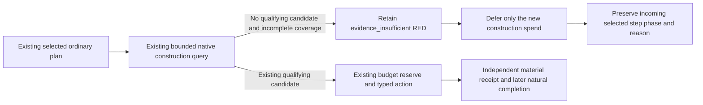

# Incomplete construction coverage must preserve the ordinary plan

Status: source-ready / NOTRUN, 2026-10-10. Root owns the focused FIRST and any
same-process SDK adoption. This package changes one Python consumer; Native60,
the native candidate producer, schemas, actual ledgers and material receipts are
unchanged.

## Actual failure and source binding

Native60 R85 normal turn 37 returned `blocked` from
`2026-10-09T19:48:05.409991+00:00` to
`2026-10-09T19:49:13.154827+00:00`, with public revision 20 and snapshot
`native:21`. Its selected step was null and its reason was
`construction positive-income coverage incomplete; preserve RED`.

The retained response is
`D:/codex-ck3-background-spill/g2-live-20261010-r85-retry02/r0084-person-readonly-sdk-hot01/operator/gameplay-responses/100-r85-native60-sustained-root01-000037-normal.json`.
The running SDK source was `e997280d50560fcccd1a1c22234467f8d56e06b8`.
This isolated patch starts at qualified source
`5705d9cbabdf88f5d9d1dae50f0d70818bff9e5f`.

The saved plan also names baseline `move-army-218104048-to-2606`, but records
deferred phase `native_war_general_battle_projected_contact_query` and required
step `query-projected-contact-scope-v1-218104048-to-2606-from-8756`. The patch
preserves the plan entering the construction consumer. It does not force that
baseline move or remove its existing projected-contact requirement.

## Cause and smallest functional change

The existing [native construction tree](domain-construction-ai.md) and
[quote coverage contract](ck3-1.20.0.2-construction-quote-coverage.md) were reviewed
before changing the consumer. The producer first accepts an existing qualifying
candidate. With no such candidate and incomplete positive-income coverage it
returns `evidence_insufficient`, rather than claiming all affordable construction
is absent. The native bounded coverage and the 19-key economic policy retain
their documented limits.

`plan_construction_private` turned that construction-specific uncertainty into a
global ordinary-plan stop: it replaced `selected_step` with null and overwrote
the reason, including during prewar arbitration. A further read of the same
bounded incomplete quote could therefore starve ordinary time and war progress.

The revised branch leaves the existing selected step, phase and reason intact
and attaches the unchanged `construction_private_query`. Prewar arbitration
uses its existing `positive_income_coverage_incomplete` observation while also
retaining its incoming step. The query remains RED; it supplies no construction
candidate, affordability conclusion, completed building, income attribution or
M4 credit. Pending and applied receipt handling is unchanged, and no actual
ledger is edited or construction resubmitted by this patch.

The dated NW-ECON-R0225 entry remains a record of the old policy. R85 supplies
the observed functional failure that justifies superseding its ordinary-clock
and prewar blocking behavior; it does not justify declaring coverage complete.

## Unique connected reproduction for Root

The new focused node is
`tests/unit/test_construction_formal_private_consumer.py::ConstructionFormalConsumerTests::test_incomplete_construction_world_preserves_and_executes_normal_advance`.
It uses the existing whole native query producer and transport, the actual
consumer and `GameplayBridgeService.auto_turn`, then a controlled ordinary
advance backend. It verifies retained step/phase/reason, unchanged incomplete
and truncated query evidence, one query, zero construction actions, one ordinary
day and byte-identical temporary construction ledger. The fixture uses an
ordinary entering plan after a deferred movement opportunity; it does not force
an army move. Three existing test expectations are minimally updated because
they asserted the superseded global block.

Author-side tests, project imports, builds, hashes, Game/SDK/process operations
and live ledger writes are all zero. The single focused FIRST is pending Root
execution. Source readiness is not runtime qualification or new G2 credit.
