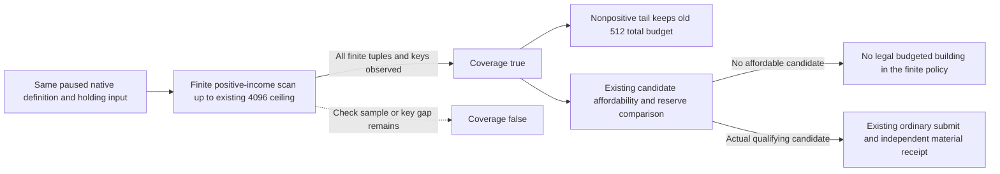

# R85 positive-income construction observation budget

Status: source-ready / NOTRUN, 2026-10-10. This is a bounded native observation
improvement following the separately qualified ordinary-plan recovery
`cff83a869f836a1fa53f16f2e69efa1913622569`. Root alone compiles, runs the unique
fixture and qualifies any new paused native build.

Integration must cherry-pick only this package's delta onto Root's current
qualified Native63 child, preserving Native61/62/63 capabilities and object
lineage. Native60 is the failure evidence, not the next binary parent.

## Actual missing input

The retained Native60 R85 normal37 response is
`D:/codex-ck3-background-spill/g2-live-20261010-r85-retry02/r0084-person-readonly-sdk-hot01/operator/gameplay-responses/100-r85-native60-sustained-root01-000037-normal.json`.
Its query world is `source_available`, failure `none`, snapshot revision 21,
date raw `53289024`, actor `29829`, with 989 verified definitions, eight held
barony/province rows and four active construction rows. The collector used all
512 allowed final-legality checks, produced 21 legal native cost samples, and
published `checks_truncated=true` / `positive_income_coverage_complete=false`.

The observed legal keys are `cereal_fields_01` (3 samples),
`common_tradeport_01` (4), `pastures_01` (10) and `hill_farms_01` (4).
The first three cost `14250000` raw; hill farms cost `9500000`. Player gold is
`26667022` raw at scale `100000`; the unchanged `20000000` reserve leaves
`6667022`. None of these observed quotes is affordable under that reserve.
This is a real absence of a qualifying candidate in the observed subset, not
evidence that every finite positive-income option was checked or that an
unobserved option would be affordable.

The actual wire does not contain the complete slot counts, a scan cursor or
individual failed canonical keys. It cannot identify the exact first omitted
tuple or exclude an additional key-classification failure. The source input
is concrete: the actual4 mailbox always requests 512 checks; its collector
visits each positive definition across every held province and slot before
scanning the other definitions. The native income table contains 19 known
positive tier-one keys. Eight holdings with five slots would require 760 such
checks, already more than 512; that distribution is a synthetic reproduction,
not a claim about the exact R85 slot counts.

## Minimal functional source change

Only `src/ck3_12004_construction_mailbox.cpp` and
`src/ck3_12004_construction.cpp` change. The mailbox uses the reader's existing
4096 admitted check ceiling for its positive-income phase. The collector keeps
the nonpositive registry tail at the former 512 total-check allowance. It does
not spend a new 4096-check pass on the other 970 definitions. The existing 512
legal-sample limit, native final legality, same paused frame, native cost,
canonical-key classification and authored economic policy remain in force.

`positive_income_coverage_complete` becomes true only after the real finite
positive scan finishes and all definition keys were classified. A failed key
read, exhausted 4096 checks or exhausted 512 legal samples still leaves it
false. No wire/DTO/header layout changes are introduced. In particular the
existing `cost_ready` / `construction_action_ready` fields are not fabricated
from coverage; the ordinary candidate consumer still requires actual affordable
native costs and positive authored increment.

The [existing construction tree and dated R85 correction](domain-construction-ai.md)
and [finite quote coverage contract](ck3-1.20.0.2-construction-quote-coverage.md)
are the source-policy inputs. This package changes observation allocation,
not the native AI value model, target ranking or income attribution.

## Unique fixture and later Root observation

`tests/ck3_12004_construction_positive_coverage_budget_test.cpp` calls the actual4
production reader with synthetic memory/callbacks. Its eight holdings and forty
slots make the old 512 request stop during the positive phase. The revised
4096 request observes all 760 positive tuples and 456 legal costs, including the
last positive option, without evaluating a nonpositive tail tuple. Costs and
observed completed occupants remain exact. The fixture is authored only and
has not been compiled or run by the author.

After Root qualifies and adopts the new native objects, the existing read-only
`ck3_query_domain_construction_world_private_v1` with the actual current public
`expected_revision` can show fresh coverage, legal keys/costs, active progress
and completed occupants. No ledger reset, replay, new MCP or manual submission
is needed. If fresh complete coverage still has no affordable candidate, normal
time and the existing natural completion/income watches remain the next useful
work; coverage alone does not complete M4, attribute tax income or grant G2
credit. Construction material and useful benefit predicates remain independent.
