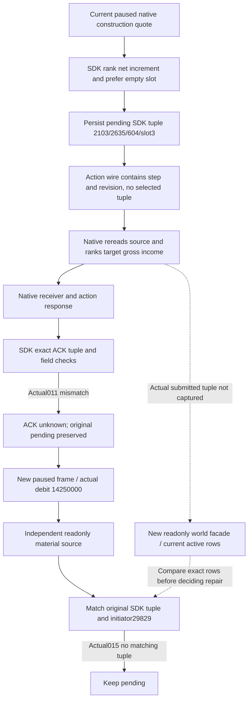

# R80 construction selector and ACK source gap

2026-10-09 / 2026-W41. This is a finite source and saved-artifact diagnosis of
an actual ordinary construction failure. CK3 is **1.20.0.4**, Steam build
**25734779**, EXE SHA
`98702F88A547CDE2EAF29A85F93B85F68EE4CF8148336A4F7AFAEB75319DD518`.
Native42 production source is `c928804c8afd61b6ded61c52b191b329e754d2da`;
the current SDK is `dac47ba428d524ff201c7aeff295c58243cfa820`. Native42's
qualified source metadata retains `45ce8134`, whose Python-only person fix
does not change this construction route.

Related retained trees are [native construction AI](domain-construction-ai.md),
[actual4 adopted MCP migration](building-adopted-mcp-migration-12004.md),
[ordinary construction entry](m4-normal-construction-cli-12004.md) and
[completed NET observation](construction-completed-net-following-12004.md).
This topic changes no policy, gate, action ledger, production code or prior
qualification result. Root owns the new readonly observation and any subsequent
repair. The failure's exact ACK predicate and actual submitted tuple are still
**unclosed** at this recording point.

## Actual R80 observations

`011-r80-ordinary-auto05.json` returned `construction ACK unknown; preserve
pending action` after **84.308791 s**. Request
`construction-submit-2a5fc47149894289884cc306ea68b1cf` was actor **29829**, public
revision **3**, native revision **2**, date **53288568**, proof **236885**.
The pending candidate is barony **2103**, Province **2635**, building type
**604**, slot **3**, key `cereal_fields_01`; it is recorded as an observed empty
slot with authored income increment **50 hundredths**. Its native quote is
**14,250,000** raw gold, before-gold **83,667,022**.

The subsequent `013-r80-after-unknown-read-snapshot.json` has native revision
**3**, public revision **4**, the same date, alive and paused, and gold
**69,417,022**. Root observed an exact **14,250,000** debit. This proves the
cash changed by the quoted amount; it does not identify which construction
slot changed.

The independent `015-r80-ordinary-construction-receipt-auto.json` returned
`construction material not yet observed; keep pending` after **32.816301 s**
(18:59:43.905183–19:00:16.721484 UTC). The refreshed small ledger still retains
the original candidate and `action_state_unknown`; `applied` is null, with no
raw ACK or last material-world body. No submit was replayed by this diagnosis.

Actual012 saved diagnostics are connected, paused and main-mailbox ready:
started/completed requests **18/18**, executor exception **0**, native Snapshot
cached. These observations and the actual gold debit contradict treating this
case as a proven failure to dispatch. They do not establish a completed
construction or its economic yield.

## Exact source and object contract

The finite construction call chain is current c928 in Native42's actual
mixed lineage:

| Owner | Actual object / initial41 receipt |
| --- | --- |
| Native candidate | `n41p0009.obj` / `compile-009.json` |
| Main runtime | `n41p0011.obj` / `compile-011.json` |
| Actual4 native submit binding | `n41p0253.obj` / `compile-253.json` |
| Bridge dispatch | `n41p0285.obj` / `compile-285.json` |
| Shared construction serializer | `n41p0323.obj` / `compile-323.json` |
| QueryMailboxEnvelope | `n41p0393.obj` / `compile-393.json` |
| Actual4 construction mailbox | `n41p0415.obj` / `compile-415.json` |

These objects are under `Z:/g2-native41-build01/attempt01/o/` and their raw
compiler receipts under its `logs/`. Actual compile011/285/323/415 enable both
`XAR_CK3_ENABLE_G2_PLAYER_CONSTRUCTION_VIEW_PROBE_PRIVATE_V1=1` and
`XAR_CK3_ENABLE_G2_PLAYER_WORLD_BUILDING_ACTION_PRIVATE_V1=1`.
The Native42 three ABI objects are `attempt02/o/n42p001.obj` through `003.obj`
under `Z:/g2-native42-mailbox-abi-build01/`: Bridge and Runtime main mailbox,
plus Runtime nonwar writer, all current c928/current headers. No missing action
flag or stale actual4 construction dispatch/serializer object is established
by this bounded route check. This is not a new 730-owner census.

### Native and SDK choose by different rules

`player_world_building_action_candidate_v1.cpp:83–99` in the actual native
source ranks:

```
(-target authored gross income, cost,
 barony_title_id, province_id, building_type_id, slot_index)
```

`bridge/domain_construction_private_transport_v1.py:143–173` in the SDK ranks:

```
(-target authored income increment over the observed old slot, cost,
 prefer observed empty slot,
 barony_title_id, province_id, building_type_id, slot_index)
```

The SDK excludes an unknown old-slot income and a nonpositive increment.
The native selector only requires positive target gross income and an idle
holding; it does not use old-slot income or the SDK's empty-slot tie break.
For two candidates with equal target income and price, an earlier occupied
slot can therefore beat the SDK's empty slot. This is a source-contract
difference, not yet the measured actual tuple of request011.

The action `_send` transmits only protocol, request identity, step and expected
native revision. It does **not** transmit the SDK candidate tuple. Actual4
`ck3_12004_construction_mailbox.cpp:77–88` reads fresh world inputs and invokes
the native selector again, then submits that native candidate.



## ACK boundary and lost body

SDK transport `_send:97–111` waits for a matching `command_result` and checks
type, protocol, request ID, `ok=true` and a result mapping. Only then does the
caller reach `submit_construction_private:506–520`, which checks accepted,
`pending_receipt`, `applied=false`, `advertised=false`, production native path,
validator/materializer/receiver calls each **1**, positive command sequence,
new proof, actor, tuple, cost and pre-gold.

The literal `construction ACK unknown` therefore proves `_send` returned a
matching command-result body and an exact ACK/result predicate failed. A wait
or transport exception takes the different `construction native submit
uncertain` path. The 84-second total request duration is not evidence that the
ACK wait itself timed out.

The shared native serializer emits these ACK fields as ordinary JSON integers;
they do not use the person-carrier Q64 decimal-string normalizer. Its actual
object is c928. `NativeDriver.state.wait_for_command_result:1234–1242` pops the
transient raw frame, and this construction `_send` does not record it. The
saved history row9723 is the pre-send pending, so the exact failed predicate
cannot be reconstructed from it. The one-line driver state is **579,994,072 B**;
the useful history evidence is a bounded UUID snippet, not a full historical
export or review.

There is a separate unresolved native ACK source entrance in
`ck3_12004_construction_submit_binding.cpp:72–97,263–271`: it reads command
manager `+0x3EC` before `queue_owned_command`, then requires a nonzero retained
sequence for `pending_receipt`. No saved sequence/ACK proves this branch caused
request011. It must not be changed or called a root cause from the cash debit
alone.

## Existing readonly path and next minimal repair entrance

The correct native readonly step is `g2_player_construction_view_probe_v1`.
`private-query-player-world-building-view-v1` is not implemented. Generic
`ck3_execute_step` routes through Service to the native primitive, which
requires an advertised `action_steps` entry. Saved012 hello capabilities have
no construction/world-building item, and the SDK does not register this
private step as a generic action. The existing province-income helper is
deliberately not registered as MCP and returns only a scalar.

The existing transport can already supply the needed frame:

```python
query_construction_private(
    service.driver,
    expected_revision=4,
    material_receipt=True,
)
```

It reuses existing material-frame admission, returns `material_source`, the
complete `world`, native request ID, proof and source frame, and does not select
or submit an action. An independent owner is preparing the same-construction
MCP readonly facade plus minimal transport logging of the original ACK/query
body before predicates discard it. No new native factory or admission gate
is required. Root owns its unique FIRST and current native3/public4 observation.

The next actual check is current `active_constructions` for the expected
barony2103/province2635/type604, including actual slot and initiator29829, and
any other active tuple initiated on this same paused date. A different tuple
would close whether the proven selector difference caused this failure.

If that cause is confirmed, the minimum execution-contract repair starts at
the existing candidate selector and existing private construction request
binding: ordinary quote, intent and native submission must choose the same
candidate under the documented increment/old-slot semantics. Do not replace
the pending tuple with another tuple or label the old action successful before
its actual material evidence is reconciled. The choice between aligning the
native selector and binding an explicit quoted tuple belongs to the repair
owner after this observation; no new request schema or policy was authored in
this document. No extra full-build, old FIRST or code audit is needed to make
the readonly observation.

## Evidence and scope

The saved operator evidence is under
`Z:/ck3_mod_rewrite_process_assets/g2-background-20261008/managed-full-h9715-r80-abi42restore01/operator/gameplay-responses/`:
011 submit, 012 diagnostics, 013 snapshot and 015 independent receipt. The
pending ledger is under
`Z:/ck3_mod_rewrite_process_assets/g2-background-20261008/g2-robert-mainline-12004-full-h9715-r80-abi42restore01/state/construction-formal-pending-v1.json`.
Actual Native42 lineage and commands are in
`Z:/ck3_mod_rewrite_process_assets/g2-background-20261007/upstream-build-migration/entry-live-fix42/`.
The compact JSON/Markdown ledger is in
`Z:/ck3_mod_rewrite_process_assets/g2-background-20261009/r80-construction-ack-source-diagnosis/`.

This work is research/source-only with actual failure inputs. Production
source changes, compiler/link/FIRST/test/hash/Game/SDK calls and G2 capability
credit are **0**. No R78 causation is asserted. Root owns report/index adoption,
live data, commit integration and push.
