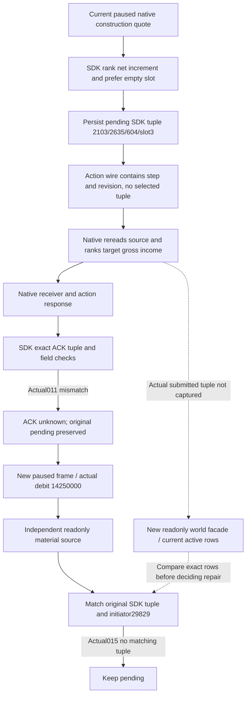
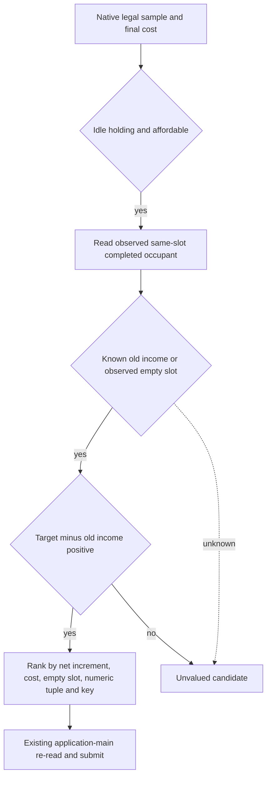

# R80 construction selector and ACK source gap

2026-10-09 / 2026-W41. This is a finite source and saved-artifact diagnosis of
an actual ordinary construction failure. CK3 is **1.20.0.4**, Steam build
**25734779**, EXE SHA
`98702F88A547CDE2EAF29A85F93B85F68EE4CF8148336A4F7AFAEB75319DD518`.
Native42 production source is `c928804c8afd61b6ded61c52b191b329e754d2da`;
the current SDK is `dac47ba428d524ff201c7aeff295c58243cfa820`. Native42's
qualified source metadata retains `45ce8134`, whose Python-only person fix
does not change this construction route.

Related retained trees are [native construction AI](domain-construction-ai.md),
[actual4 adopted MCP migration](building-adopted-mcp-migration-12004.md),
[ordinary construction entry](m4-normal-construction-cli-12004.md) and
[completed NET observation](construction-completed-net-following-12004.md).
This topic changes no policy, gate, action ledger, production code or prior
qualification result. Root owns the new readonly observation and any subsequent
repair. The failure's exact ACK predicate and actual submitted tuple are still
**unclosed** at this recording point.

## Actual R80 observations

`011-r80-ordinary-auto05.json` returned `construction ACK unknown; preserve
pending action` after **84.308791 s**. Request
`construction-submit-2a5fc47149894289884cc306ea68b1cf` was actor **29829**, public
revision **3**, native revision **2**, date **53288568**, proof **236885**.
The pending candidate is barony **2103**, Province **2635**, building type
**604**, slot **3**, key `cereal_fields_01`; it is recorded as an observed empty
slot with authored income increment **50 hundredths**. Its native quote is
**14,250,000** raw gold, before-gold **83,667,022**.

The subsequent `013-r80-after-unknown-read-snapshot.json` has native revision
**3**, public revision **4**, the same date, alive and paused, and gold
**69,417,022**. Root observed an exact **14,250,000** debit. This proves the
cash changed by the quoted amount; it does not identify which construction
slot changed.

The independent `015-r80-ordinary-construction-receipt-auto.json` returned
`construction material not yet observed; keep pending` after **32.816301 s**
(18:59:43.905183–19:00:16.721484 UTC). The refreshed small ledger still retains
the original candidate and `action_state_unknown`; `applied` is null, with no
raw ACK or last material-world body. No submit was replayed by this diagnosis.

Actual012 saved diagnostics are connected, paused and main-mailbox ready:
started/completed requests **18/18**, executor exception **0**, native Snapshot
cached. These observations and the actual gold debit contradict treating this
case as a proven failure to dispatch. They do not establish a completed
construction or its economic yield.

## Exact source and object contract

The finite construction call chain is current c928 in Native42's actual
mixed lineage:

| Owner | Actual object / initial41 receipt |
| --- | --- |
| Native candidate | `n41p0009.obj` / `compile-009.json` |
| Main runtime | `n41p0011.obj` / `compile-011.json` |
| Actual4 native submit binding | `n41p0253.obj` / `compile-253.json` |
| Bridge dispatch | `n41p0285.obj` / `compile-285.json` |
| Shared construction serializer | `n41p0323.obj` / `compile-323.json` |
| QueryMailboxEnvelope | `n41p0393.obj` / `compile-393.json` |
| Actual4 construction mailbox | `n41p0415.obj` / `compile-415.json` |

These objects are under `Z:/g2-native41-build01/attempt01/o/` and their raw
compiler receipts under its `logs/`. Actual compile011/285/323/415 enable both
`XAR_CK3_ENABLE_G2_PLAYER_CONSTRUCTION_VIEW_PROBE_PRIVATE_V1=1` and
`XAR_CK3_ENABLE_G2_PLAYER_WORLD_BUILDING_ACTION_PRIVATE_V1=1`.
The Native42 three ABI objects are `attempt02/o/n42p001.obj` through `003.obj`
under `Z:/g2-native42-mailbox-abi-build01/`: Bridge and Runtime main mailbox,
plus Runtime nonwar writer, all current c928/current headers. No missing action
flag or stale actual4 construction dispatch/serializer object is established
by this bounded route check. This is not a new 730-owner census.

### Native and SDK choose by different rules

`player_world_building_action_candidate_v1.cpp:83–99` in the actual native
source ranks:

```
(-target authored gross income, cost,
 barony_title_id, province_id, building_type_id, slot_index)
```

`bridge/domain_construction_private_transport_v1.py:143–173` in the SDK ranks:

```
(-target authored income increment over the observed old slot, cost,
 prefer observed empty slot,
 barony_title_id, province_id, building_type_id, slot_index)
```

The SDK excludes an unknown old-slot income and a nonpositive increment.
The native selector only requires positive target gross income and an idle
holding; it does not use old-slot income or the SDK's empty-slot tie break.
For two candidates with equal target income and price, an earlier occupied
slot can therefore beat the SDK's empty slot. This is a source-contract
difference, not yet the measured actual tuple of request011.

The action `_send` transmits only protocol, request identity, step and expected
native revision. It does **not** transmit the SDK candidate tuple. Actual4
`ck3_12004_construction_mailbox.cpp:77–88` reads fresh world inputs and invokes
the native selector again, then submits that native candidate.



## ACK boundary and lost body

SDK transport `_send:97–111` waits for a matching `command_result` and checks
type, protocol, request ID, `ok=true` and a result mapping. Only then does the
caller reach `submit_construction_private:506–520`, which checks accepted,
`pending_receipt`, `applied=false`, `advertised=false`, production native path,
validator/materializer/receiver calls each **1**, positive command sequence,
new proof, actor, tuple, cost and pre-gold.

The literal `construction ACK unknown` therefore proves `_send` returned a
matching command-result body and an exact ACK/result predicate failed. A wait
or transport exception takes the different `construction native submit
uncertain` path. The 84-second total request duration is not evidence that the
ACK wait itself timed out.

The shared native serializer emits these ACK fields as ordinary JSON integers;
they do not use the person-carrier Q64 decimal-string normalizer. Its actual
object is c928. `NativeDriver.state.wait_for_command_result:1234–1242` pops the
transient raw frame, and this construction `_send` does not record it. The
saved history row9723 is the pre-send pending, so the exact failed predicate
cannot be reconstructed from it. The one-line driver state is **579,994,072 B**;
the useful history evidence is a bounded UUID snippet, not a full historical
export or review.

There is a separate unresolved native ACK source entrance in
`ck3_12004_construction_submit_binding.cpp:72–97,263–271`: it reads command
manager `+0x3EC` before `queue_owned_command`, then requires a nonzero retained
sequence for `pending_receipt`. No saved sequence/ACK proves this branch caused
request011. It must not be changed or called a root cause from the cash debit
alone.

## Existing readonly path and next minimal repair entrance

The correct native readonly step is `g2_player_construction_view_probe_v1`.
`private-query-player-world-building-view-v1` is not implemented. Generic
`ck3_execute_step` routes through Service to the native primitive, which
requires an advertised `action_steps` entry. Saved012 hello capabilities have
no construction/world-building item, and the SDK does not register this
private step as a generic action. The existing province-income helper is
deliberately not registered as MCP and returns only a scalar.

The existing transport can already supply the needed frame:

```python
query_construction_private(
    service.driver,
    expected_revision=4,
    material_receipt=True,
)
```

It reuses existing material-frame admission, returns `material_source`, the
complete `world`, native request ID, proof and source frame, and does not select
or submit an action. An independent owner is preparing the same-construction
MCP readonly facade plus minimal transport logging of the original ACK/query
body before predicates discard it. No new native factory or admission gate
is required. Root owns its unique FIRST and current native3/public4 observation.

The next actual check is current `active_constructions` for the expected
barony2103/province2635/type604, including actual slot and initiator29829, and
any other active tuple initiated on this same paused date. A different tuple
would close whether the proven selector difference caused this failure.

If that cause is confirmed, the minimum execution-contract repair starts at
the existing candidate selector and existing private construction request
binding: ordinary quote, intent and native submission must choose the same
candidate under the documented increment/old-slot semantics. Do not replace
the pending tuple with another tuple or label the old action successful before
its actual material evidence is reconciled. The choice between aligning the
native selector and binding an explicit quoted tuple belongs to the repair
owner after this observation; no new request schema or policy was authored in
this document. No extra full-build, old FIRST or code audit is needed to make
the readonly observation.

## Evidence and scope

The saved operator evidence is under
`Z:/ck3_mod_rewrite_process_assets/g2-background-20261008/managed-full-h9715-r80-abi42restore01/operator/gameplay-responses/`:
011 submit, 012 diagnostics, 013 snapshot and 015 independent receipt. The
pending ledger is under
`Z:/ck3_mod_rewrite_process_assets/g2-background-20261008/g2-robert-mainline-12004-full-h9715-r80-abi42restore01/state/construction-formal-pending-v1.json`.
Actual Native42 lineage and commands are in
`Z:/ck3_mod_rewrite_process_assets/g2-background-20261007/upstream-build-migration/entry-live-fix42/`.
The compact JSON/Markdown ledger is in
`Z:/ck3_mod_rewrite_process_assets/g2-background-20261009/r80-construction-ack-source-diagnosis/`.

This work is research/source-only with actual failure inputs. Production
source changes, compiler/link/FIRST/test/hash/Game/SDK calls and G2 capability
credit are **0**. No R78 causation is asserted. Root owns report/index adoption,
live data, commit integration and push.

## R80 actual readonly world, 2026-10-09 03:52 CST

Root adopted the minimal readonly facade as `a3bff501a130872447e415f3240e13a1bf6aa2e1` and switched only the Python SDK to the full frozen source `Z:/gbs-r80-sdk-hot02-source`. The local inbox control is `{"exit_client": true}`; the first attempt incorrectly sent it as an MCP tool, received `Unknown tool`, and is retained. The corrected request closed old exec session 6380 with actual exit code 0. No CK3 restart or restore occurred.

The new SDK observed 214 registered tools once and passed all 13 paused checks on the same minimized Game 65280 / Robert 29829 / original episode. Native revision 4 maps to public revision 2 in this new SDK; public counters must be obtained from its actual snapshot. This qualifies the new readonly facade on Native42 and does not repeat the accepted 1.20.0.4 migration.

The actual `ck3_query_domain_construction_world_private_v1(expected_revision=2)` response completed at 2026-10-08T19:52:38.732345Z. It returned an active construction at **barony 2103 / province 2635 / type 596 / slot 1 / initiator 29829**, remaining work 182500000. The other seven returned holdings had no active construction. The unchanged pending intent expects **type 604 / slot 3** on that same barony and province. Gold is 69417022, exactly 14250000 below its pre-action value. The date remains 53288568, and native proof epoch is 668665.

The mismatch is now an actual observed result, consistent with the documented competing selectors. It is not a transport-timeout diagnosis. Preserve the original pending tuple and both failed ordinary attempts; do not resubmit the action, inherit the originally quoted empty-slot/net-income values for type 596, or count this as a completed M4. The repair owner is aligning future native candidate selection and preparing an explicit reconciliation of the observed mismatch in the existing receipt path. Construction completion and actual income benefit still require later observations.

Actual qualification and the complete query are in `Z:/ck3_mod_rewrite_process_assets/g2-background-20261009/r80-sdk-hot02/operator/ROOT-R80-HOT02-PAUSED-SNAPSHOT-QUALIFIED.json` and `gameplay-responses/002-r80-actual-construction-world-hot02.json`; the thin actual/pending join is `ROOT-002-ACTUAL-CONSTRUCTION-WORLD-SUMMARY.json` in that operator directory. Scope: **production-live primitive** for the readonly world only; new saved days, SAVE and completed G2 gates remain zero.
The original diagnosis above was research/source-only before the readonly
world existed. Its failed attempts remain original evidence. The subsequent
recovery source below is NOTRUN; Root owns qualification and live adoption.

## Actual hot02 material and normal receipt recovery

Root's saved readonly world at
`Z:/ck3_mod_rewrite_process_assets/g2-background-20261009/r80-sdk-hot02/operator/gameplay-responses/002-r80-actual-construction-world-hot02.json`
is an 88,507-byte capture, read once for the necessary source inputs. It binds
native **4**, public **2**, actor **29829**, date **53288568** and proof **668665**.
Its one active row is **2103 / 2635 / type596 / slot1**, initiated by **29829**,
with remaining work **182500000**, divisor **0** and province income **86200**.
The other seven holdings are inactive. Gold is **69417022**, exactly the
original **83667022 - 14250000** debit. The original pending remains
**type604 / slot3**, `cereal_fields_01`; it has not been rewritten or resubmitted.

The same current world observes completed slot1 **type597 / farm_estates_02**.
No current legal row contains type596, and the active holding has no new legal
quotes. The current observation therefore does not identify type596's key,
original native quote or net income increment. In particular, it cannot inherit
the original empty slot3 or quoted **50 hundredths** increment. The source
gross/net ranking disagreement and the observed differing tuple explain the
missing original-tuple material receipt. The exact original ACK predicate
remains unclosed because its body was discarded; an ACK timeout is not proven.

The minimal Python recovery uses the existing ordinary receipt and existing
readonly world. A unique different active tuple in the quoted holding, the
same initiator, same action date and exact quoted debit classify
`observed_mismatched_construction`. Existing frame, actor and proof admission
remain in use. The receipt retains the complete `original_pending` and its
unchanged `candidate`; `observed_material_tuple` and `observed_material_row`
carry actual type596/slot1 separately. Clearing the unresolved queue does not
declare the requested construction successful: `postcondition_verified` and
`requested_postcondition_verified` are false, while
`material_postcondition_verified` only means the actual construction is
observed. A later cold/monthly read follows the actual tuple and keeps this
classification. The ordinary loop accepts this explicit recovery outcome and
continues its following turn without another native submit.

The economic consumer reports the mismatch phase, null authored increment and
no completed requested construction; it does not award M4/G2 capability credit.
Existing new-spend admission still requires an ordinary `applied` receipt, so
this recovery alone does not release another construction through the old
selector. Future native ranking alignment is a separate source commit.
For future genuine ACK failures, the actual returned submit body is retained
in the existing pending record before the exact ACK predicate runs. This does
not recreate the lost R80 ACK or add a general logging/WAL mechanism.

The sole new Root-only qualification node is
`test_r80_construction_mismatch_registered_consumer.py::test_registered_r80_saved_material_mismatch_recovers_without_resubmit`.
It reads private copies of the saved world and pending, uses real normal MCP,
Service, transport, ledger and economic consumer, and supplies only outer
endpoint/process/baseline fixture seams. It calls registered `ck3_auto_turn`
then `ck3_plan_turn`, verifies both intent and material, null economic increment,
cleared unresolved queue and zero native submit. It does not rerun old GREEN
fixtures or claim native/live qualification. Worker test/import/build/hash,
Game/SDK calls and G2 credit remain **0**; Root owns the unique FIRST and reports.

## Separate future selector alignment

The actual mismatch justifies replacing the native gross-income comparison
with the existing SDK comparison. The separate source patch values the same
completed occupant by barony/province/slot, requires a known old income, and
uses **target income minus old income**. Empty slots are known zero only when
the native completed inventory is observed. Known `military_camps_01 = 0`
remains distinct from an unknown old key. Equal net increment and native cost
prefer an observed empty slot, followed by the same tuple/key tie break as the
SDK. The existing nineteen target keys remain unchanged; five additional old
occupant keys live in a separate lookup and do not become target candidates.



No request fields, DTO layout, public header or native action capability are
added. The required changed production body is
`player_world_building_action_candidate_v1.cpp`; its current actual Bridge
object is `Z:/g2-native41-build01/attempt01/o/n41p0009.obj` with the qualified
`logs/compile-009.json` command. The private income header also has a direct
definition-source include, but its existing nineteen-key target table and
existing lookup are unchanged. The added inline old-occupant helper is consumed
only by the changed selector. A new narrow fixture checks gross/net divergence,
empty-slot ties and known zero versus unknown occupant through the production
selector. Root owns its first compilation/execution. This source change does
not qualify another live construction or retrofit the original request.

## Root qualification and saved R81 construction (2026-10-09)

Native46 was qualified on frozen integrated source
`088fed39e0ceda7b28c2b0ee2113db4ce61fa58a`. The actual incremental build
compiled one changed Bridge selector and one fixture, retained the other
732 production owners, and reused the Runtime45 archive. The first narrow
fixture passed its three scenes/four selector calls in 0.2362854 seconds;
no previous whole-command or MCP consumer qualification was rerun.
The canonical receipt is
`Z:/ck3_mod_rewrite_process_assets/g2-background-20261007/upstream-build-migration/entry-live-fix46/ROOT-PARENT-RUNTIME-INCREMENTAL-DLL.json`.
The resulting DLL is 13,395,968 bytes, SHA-256
`c614155a8c0861400092a3654e0355cbcf82567a2c58228d2946a4329abbdf97`.

R80 ended after its managed six-hour limit, with a proven process-tree cleanup.
Its mismatched construction was never saved. R81 therefore restored the actual
H9715/saved6010 baseline, without importing the unsaved 596/slot1 material.
The new Game PID 175696 passed all thirteen paused-frame checks, including
minimized-window ownership, at 2026-10-09T04:40:27.317992Z.

The normal registered planner then selected `cereal_fields_01`, tuple
`barony2103/province2635/type604/slot3`, for Robert 29829. Native46's actual
ACK named that same tuple. The independent next normal turn returned
`status=applied` and `postcondition_verified=true`, native revision 2 to 3,
with gold 83,667,022 to 69,417,022 (scale 100,000), exactly the 142.5-gold
quote. The two actual calls took 81.359977 and 84.393063 seconds. The current
construction is in progress, with remaining-work raw 109,500,000 and divisor 0;
actual completed income delta remains null. This qualifies the corrected
selection/submit/independent-start-observation primitive, not completed M4
income or an entire construction lifecycle.

The normal SAVE completed at 2026-10-09T04:51:43.078245Z: H9725,
date raw 53,288,568, still 6,010 saved normal days, 104,646,820 bytes,
SHA-256 `df39abc8b770e99786eb87fb9fb3e559742541f4bbe5c9ebb685c2930f4ba4d1`.
The original ten streams, opaque prisoner-release supplement, and this
SAVE's opaque construction ledger were frozen together. Save and complete
Driver hashes were not recomputed; only the changed small marriage ledger
received a new pin. The original ten-stream format remains unchanged.

Evidence root:
`Z:/ck3_mod_rewrite_process_assets/g2-background-20261009/managed-full-h9715-saved6010-r81-native46restore01/operator/`:
`ROOT-COLD-H9715-PAUSED-SNAPSHOT-QUALIFIED.json`,
`gameplay-responses/006-r81-normal-turn05.json`,
`gameplay-responses/007-r81-normal-construction-receipt01.json`, and
`gameplay-responses/009-r81-construction-saved6010.json`.
The recoverable saved packet is
`Z:/ck3_mod_rewrite_process_assets/g2-background-20261009/normal-r81-h9725-saved6010-construction-freeze01/RECOVERY-INPUT-PACKET.json`.
G2 remains 5/8, NW2 2/4, natural successions zero; no new game day or completed
building is credited by these same-date actions.