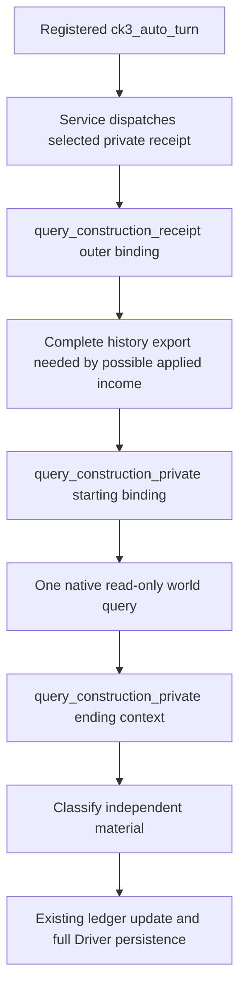

# Construction material query omits duplicate history exports

## Observed production hotspot

Root qualified the preceding compact-rebind and Army-context changes once:
`Z:/g2-driver-compact-first01` was GREEN in 5.037871 seconds and
`Z:/g2-army-history-first01` was GREEN in 3.0057937 seconds. Their compatible
Native48 hot SDK, `61819ef19d2cdc35da185fbc8d071c7f3ea3fafd`, passed all thirteen
same-game paused checks. This source package is based on that SDK commit and
has no Native49 route strategy dependency.

The subsequent actual ordinary auto-turn selected
`private-query-player-construction-receipt-v1`. Root's retained
`002-r82-hot01-normal-unapplied-recovery.json` recorded
2026-10-09T10:36:47.370 through 10:38:32.493 UTC, 105.122584 seconds. Its result
was `not_applied_after_restore`, with false material success and no new submit.
An independent world-material query took 25.052563 seconds. The author did not
read actual Driver state, save bytes or the original large responses.

## Exact source chain

Before this change, all three bindings called `driver.take_snapshot()` with
its public default. Each call reaches `_history_snapshot`, a deep copy of the
complete native command history. Neither internal context in
`query_construction_private` reads `native_command_history`: they bind the
paused actor, frame, date, episode and exact build and compare the ending
identity against the same material query.

The outer receipt frame is different. On the applied branch,
`same_frame_construction_income(starting, history)` actually reads its history
to recover the same-frame public root income. This package retains that export
and the resulting economic observation semantics. It removes only the two
world-query context copies.

The source also establishes a remaining synchronous write:
`_record_command(RECEIPT_STEP, ...)` reaches `_persist_driver_state` because
`private-query-player-construction-receipt-v1` is outside the existing deferred
`query-*` rule. That write already uses compact JSON. Its timing was not
measured separately, and this package leaves its complete durable history and
existing barrier unchanged.

## Minimal implementation

`domain_construction_private_transport_v1.py` adds a private query-frame helper
using the existing `take_snapshot_without_native_command_history` when the
driver supports it, with the old snapshot fallback for other existing drivers.
`_binding` retains its history-including default. Only
`query_construction_private` requests the omitted-history binding and uses the
same query helper for its ending frame.

No public default or DTO changes. No pending record, seed, full history, ledger
format, native action, version binding, timeout or policy changes. Native48 and
the current hot SDK remain untouched by source delivery. Source inspection
establishes three full-history copies becoming one per receipt and two becoming
zero per direct world query on NativeHeadless Driver; it does not establish a
measured live speedup.

## Sole connected compound, NOT RUN

The sole new node is:

`tests/unit/test_construction_receipt_query_context_history.py::test_registered_receipts_omit_only_query_context_history_and_keep_durable_income`

Root supplies the same saved small world and construction-ledger captures via
`XAR_R82_CONSTRUCTION_WORLD_CAPTURE` and
`XAR_R82_CONSTRUCTION_LEDGER_CAPTURE`. Optional
`XAR_CONSTRUCTION_QUERY_CONTEXT_FIRST_OUTPUT` records its one result.

The compound uses registered `ck3_auto_turn`, actual Service receipt dispatch,
the real construction transport and real NativeHeadless Driver snapshot,
history and persistence code. Selected plans, semantic frame, endpoint and
process identity are explicit synthetic seams. It resolves the saved unknown
second intent without resubmission, then rechecks the old applied construction
using the unchanged saved world. A synthetic same-frame root income entry
proves the outer history consumer still returns its value.

It checks one history export and one existing durable full-history write per
receipt, zero inner query exports, two read-only requests and no native submit,
both material classifications, the retained pending intent and first receipt,
all eight preexisting history rows and both added complete durable rows, and
the public default's detached complete history. Neither the old test nor a
native producer is rerun.

Author verification is one `git diff --check` only. Tests, game, live SDK,
native build, native producer and actual Driver/save reads or hashes: zero.
Readiness is source-ready; Root owns the single FIRST and later live timing.
