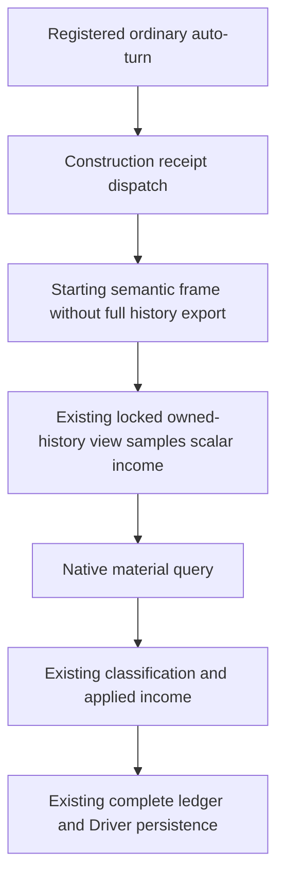

# Construction receipt samples starting income through its owned history view

## Actual need and source boundary

Root observed repeated ordinary query/auto-turn responses around 88 MB and
construction observations around 106-141 seconds. The preceding three copy
fixes were deployed on R83's compatible SDK `bf5`; a speedup has not yet been
measured. This package inspects current Root source
`0e354f3dca6e0426e0aee2661f9bfd298722bde2`. It does not open the actual roughly
885 MB Driver, saves, full old logs or original large responses.

The prior [construction query context change](construction-receipt-query-context-history-12004.md)
removed the inner material query's two complete-history exports. One remained:
`query_construction_receipt` acquired its outer `_binding` through the default
snapshot, cloning all history solely so the later applied branch could call
`same_frame_construction_income(starting, history)`.

That helper scans rows in reverse for one successful current-frame campaign
root query, matching native revision, date and actor. Its return is a Boolean
and an integer-or-null income; it does not mutate or return the history.
`NativeHeadlessGameplayDriver._with_internal_planning_view` already runs a
read-only callback under the history lock and copies only its returned small
projection. This is the existing production mechanism used by the planner.

## Minimal change

Only `query_construction_receipt` changes. When the existing owned-history view
is available, its starting binding omits history and samples the scalar income
immediately through that view, **before** the native material query. The applied
branch uses that captured scalar. Drivers without the view retain the original
history-including binding and read the scalar from its detached history.

Sampling before the material query preserves the original starting-frame
behavior: a later same-frame root observation arriving during the query does
not replace the receipt's earlier income. NativeHeadless receipt history exports
become zero. All history remains in the Driver, and the existing complete
synchronous write after classification remains unchanged. Public default
snapshots, registered results, pending records, seed, native requests, tuple
selection and economic classification are unchanged.

The Army observer response's full business body is retained. Its size alone
does not justify removing observations or changing public semantics. This
package makes no additional Army-response or native modification, and does not
attribute the remaining construction latency to a measured cause.

## Sole new Root FIRST, NOT RUN

`tests/unit/test_construction_receipt_scalar_history_view.py::test_registered_receipts_sample_starting_income_without_full_history_export`
is the one new compound. It reuses only helpers and the saved small captures
from the preceding connected consumer. Required environment variables are
`XAR_R82_CONSTRUCTION_WORLD_CAPTURE` and
`XAR_R82_CONSTRUCTION_LEDGER_CAPTURE`; optional
`XAR_CONSTRUCTION_RECEIPT_SCALAR_FIRST_OUTPUT` records its result.

Registered auto-turn, real Service dispatch, construction transport and actual
NativeHeadless Driver snapshot/history/persistence execute. Selected plans,
semantic frame, endpoint/process identity and one later same-frame root query
are explicit synthetic seams. The saved unknown intent is first classified
not applied without resubmission, and the old applied building is then rechecked.

The compound checks zero complete-history exports during both receipts, two
locked scalar reads, two native read-only queries and two unchanged complete
durable writes. The second material query records a newer same-frame root
income through the production `_record_command`; the receipt must still return
the original income sampled before that query. All eight original history rows,
both receipt rows and the later root row remain in the eleven-row durable state.
The public default still returns detached complete history.

No old test, native producer, game, live SDK, build, benchmark or actual Driver
read/hash was executed by the author. Source status is source-ready; the one
Root FIRST and subsequent measured ordinary outcome remain pending.
