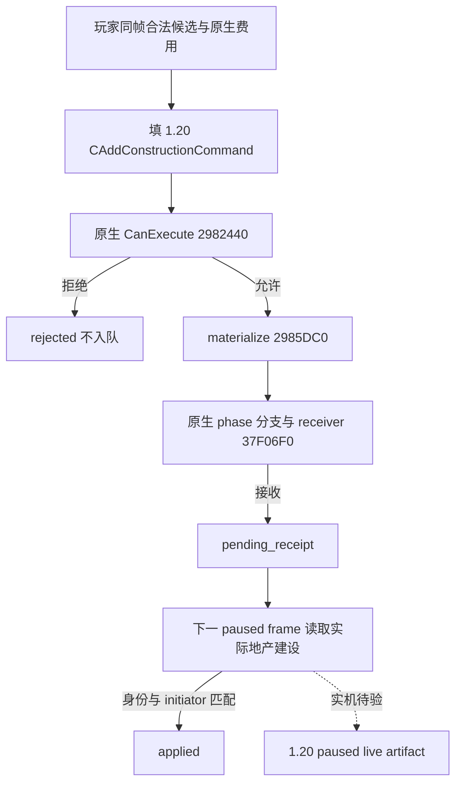

# CK3 1.20.0.2 已有地产建筑命令绑定

状态：`static-ready`。本专题只迁移玩家已有地产的 `CAddConstructionCommand`，用于交接文档中的经济建筑主线。冻结 EXE 为 1.20.0.2，101,039,736 字节，SHA-256 `AE1BA6FF060BA603842F6F4A2DED0AF4B7D3666B3DD271F75FB01B0DA8E81B2D`。本次没有启动游戏、连接 pipe、访问桌面或操作存档。

实现位于 [ck3_12002_construction_submit_binding.hpp](../../ck3_autonomous_player/native_bridge/research/ck3_12002_construction_submit_binding.hpp)、对应 `.cpp` 和 [ABI 合同](../../ck3_autonomous_player/native_bridge/research/ck3_12002_construction_submit_binding_abi.json)。命名空间为 `xar::ck3_12002`，重用旧版引入的无指针 DTO，不调用旧版 native binder。已有 shared runtime 的 `SubmitPlayerWorldBuildingDirectActionV1` 仍写入 1.19.0.6 vtable；1.20 调用者必须选本专题的新函数。

| 原生节点 | 1.20.0.2 RVA / 布局 | 冻结证据 |
|---|---|---|
| 玩家建筑命令 RTTI | `CAddConstructionCommand`，TypeDescriptor `0x5A12568` | 主 COL `0x4E1F398`，secondary COL `0x4E1F410`，后者 this adjustment 为 `0x18` |
| 主 / secondary vtable | `0x476C540` / `0x476C5D8` | 主 `+0x30` 为 CanExecute；主 `+0x40` 为 materializer；secondary `+8` 为 Execute |
| 命令实体 | `0x30` 字节 | `+0x20` CharacterID，`+0x24` ProvinceID，`+0x28` slot，`+0x2C` BuildingTypeID |
| CanExecute | `0x2982440` | 同步 CharacterID 最终对象检查，读取四个命令字段，在 `0x29824C1` 调用最终合法性 |
| 最终合法性 | `0x2C77D50` | 参数 actor / ProvinceID / BuildingType / slot / true / null tooltip；读取原生 Province 类型标记与地产结构 |
| materializer | `0x2985DC0` | 分配 `0x30` 字节，复制命令头和四个字段，返回持有堆命令的 wrapper |
| 全局提交 wrapper | `0x37EBC40` | `module+0x5CC14D0 & 0xFD` 非零走销毁分支；否则调用 receiver |
| receiver / singleton | `0x37F06F0` / `0x5CC1240` | flags=`7`；将 `receiver+0x3EC` 序号写入 `command+0x0C`，移动所有权并清零 transfer holder |
| 实际队列插入 | `0x880340` | receiver 的 locked / direct 两条边分别为 `0x37F07AF` / `0x37F07C8` |
| 执行 | `0x29822C0`，secondary this | `0x29823D9 → 0x24677D0` 启动地产建设，`0x29823FC → 0x2C247C0` 算原生费用，`0x298241E → 0x310D5D0` 扣资源 |

原生 AI 的提交现场为 `0x1A7FF67..0x1A80011`：填栈命令 → `0x2982440` → vtable materializer → flags 7 全局 wrapper。本专题的 native backend 保留 wrapper 中已有的 phase flag 分支，用直接 receiver 的返回值记录 ACK。命令接收只进入 `pending_receipt`；后续更新的 paused proof epoch 必须重新读到匹配玩家、Province、建筑、slot、initiator 的 active construction，才进入 `applied`。不会直接调用 Execute 或自行修改资源与地产字段。



旧 DEV19 资料里的 `new_holding` 标签需要修正。旧版冻结 EXE（SHA `2D00FF3101EF70B566F2FCBAE292F09263199C80E9DC8F139B82D7D96F83DB86`）的 vtable `0x4333128`，COL `0x4978EA8`、TypeDescriptor `0x54D2F70`，也明确是 `CBuildDomicileBuildingCommand`。对应迁移现场 `0x1A8001D..0x1A800F8` 实际写入新版 vtable `0x4771128`；RTTI 为同一类，TypeDescriptor `0x5A173F0`、COL `0x4E27A60`。其 `0x2A38B30` 合法性入口检查 `Domi` 对象与 `GDbO` 建筑定义。它建设的是 domicile 建筑，不能用作普通省份新地产入口。因此本 binder 的 `validate_holding=null`，普通新地产没有被声明为已支持。

验证：独立 MSVC `/std:c++20 /W4 /WX`，`/Od` 和 `/O2` 均通过。测试覆盖新 vtable / 四字段、单次提交、原生验证拒绝、receiver 拒绝后的 leftover 回收、ACK 后需新帧实际状态、gold-only 候选与 paused frame 绑定。离线 verifier 校验 18 个 exact span、13 条直接调用、3 个 RTTI 对象；这些只是 `static-ready` 证据，不能代替实机素材。

```text
python ck3_autonomous_player/native_bridge/research/run_ck3_12002_construction_submit_binding_tests.py --build-root <Z-drive-build-dir>
python ck3_autonomous_player/native_bridge/research/verify_ck3_12002_construction_submit_binding.py --ck3-executable <frozen-1.20.0.2-exe> --output <result-json>
```

下一次实机只需从同帧玩家生产来源选择一个原生允许且有储备的农田类候选，经新 submit 接收后读取 fresh active queue、initiator、progress 与实际 gold 差值；随后等待完成，验证 completed slot 和实际经济结果。原生树和上层策略仍由 [domain-construction-ai.md](domain-construction-ai.md) 及经济迁移专题维护。
