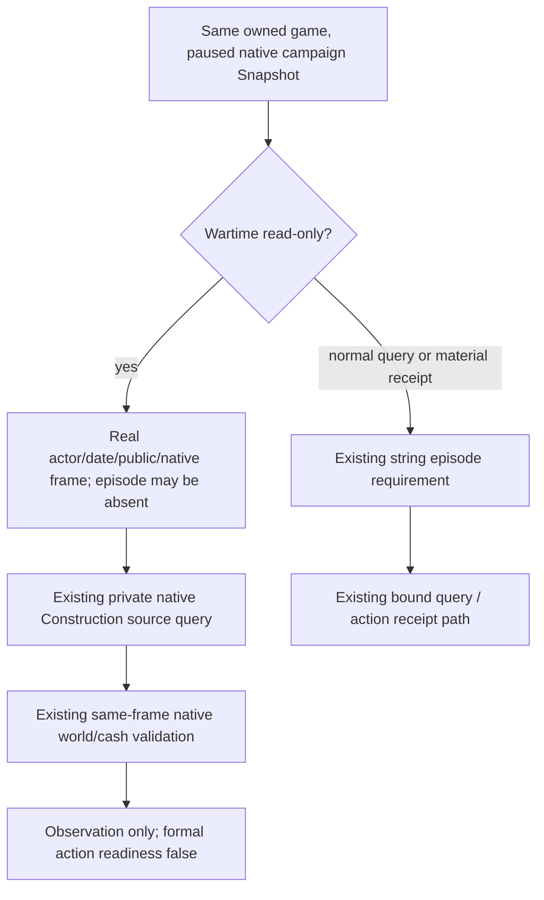

# Construction wartime observation from the native campaign projection

On 2026-10-07, Root's existing private Construction source sampler reconnected
the already owned 1.20.0.4 game PID160236 after the retained SDK exited normally.
The same Robert29829 game remained paused at H9613/date53288256. Both small
before/after frames had snapshot `native:3`, public revision2, native revision3,
map ready, living Robert, and the exact ready 1.20.0.4 adapter. They had no
`episode_run_id`: the diagnostic Driver used `episode_projection="native_campaign"`.

The attempt failed in Python `_binding`, before `_send`, with
`BridgeUnavailableError: construction trial lacks a stable admitted paused actor frame`.
Its receipt's `native_query_count:1` counted entering the production helper. It
does not prove one native query was sent. The source order proves this attempt
stopped before construction request creation/send. Preserve the original RED:

- `Z:/ck3_mod_rewrite_process_assets/g2-background-20261007/upstream-build-migration/managed-full-h9613-entry02/private-construction01/ROOT-PRIVATE-CONSTRUCTION-RESULT.json`
- `Z:/ck3_mod_rewrite_process_assets/g2-background-20261007/upstream-build-migration/managed-full-h9613-entry02/private-construction01/01-before-frame.json`
- `Z:/ck3_mod_rewrite_process_assets/g2-background-20261007/upstream-build-migration/managed-full-h9613-entry02/private-construction01/03-after-frame.json`

Committed source baseline `4692ec404020ceb3badb323bfacc8cb8a695ae58` explains
the mismatch. `NativeHeadlessGameplayDriver.take_snapshot`2692–2719 uses the
same semantic projection as `take_internal_semantic_snapshot`2650–2661.
`_with_one_life_episode`4143–4147 intentionally returns the native campaign
frame without binding or exposing a one-life episode. Switching to the public
snapshot therefore cannot supply that field. An empty `one_life` scratch would
create a new auxiliary random episode at4159–4169; it cannot stand in for the
original managed campaign episode. No existing public Driver method injects the
original episode identity without loading the retained lifecycle state.

The wartime Construction operation is a read-only source observation. It does
not write the pending action ledger, submit a building, or grant spend readiness.
The minimal leaf change allows an absent episode only in that existing
`wartime_observation=True` path and carries its actual absence as
`source_frame.episode_run_id=null`. The before/after episode comparison still
uses the observed value. Normal query, submit and material receipt still require
a string episode binding. Paused/map/actor/revision/date, exact build identity,
native world actor/date/revision, cash and legality observations keep their
existing semantics. `formal_action_ready=false` remains the wartime result.

The shared exact-build helper already accepts the actual 1.20.0.4 SHA; this RED
was not an old build literal or C++ Entry42 failure. This patch neither adds a
native route nor edits the bridge. It fills an existing native campaign
read-only usage gap without inventing an ordinary campaign lineage or changing
the native Snapshot body.

Qualification at delivery is source-ready / NOTRUN. Root owns the next fresh
same-game native query and preserves this pre-send RED. No helper execution,
production module import, test/build, game/SDK operation, EXE access, save read,
or large Driver body read was performed by this source owner. This patch adds
zero days and does not close migration or G2 readiness.
