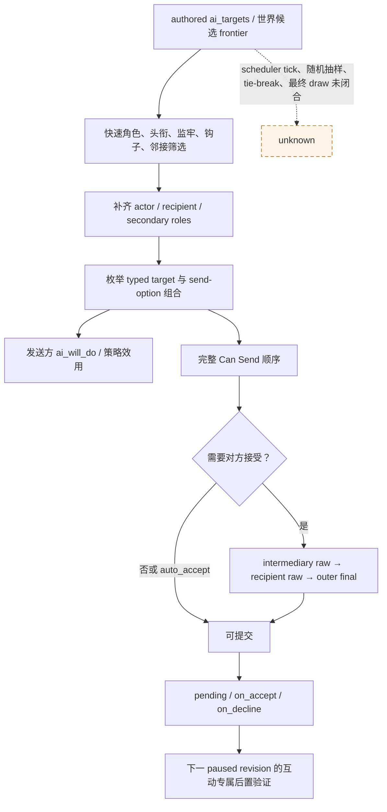
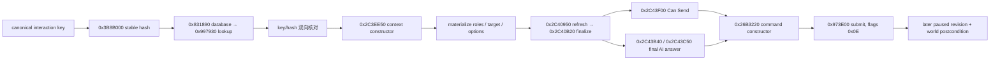

# CK3 1.19.0.6 核心外交提案原生树

## 结论与边界

本专题冻结自动玩家在婚姻、盟约和议和之外最先需要的角色互动链：发现候选、构造完整角色/目标/选项上下文、执行原生最终合法性和接受度判定、提交命令，再以世界状态验证结局。现有通用人物互动研究已经证明这些能力共享同一条原生管线；本轮新增的是把这条管线投影到日常游玩真正需要的 11 个交互，并把中国玩法的朝贡与天朝专用交互列入后续施工账本。

状态为 **static-confirmed；observer、action 和 production live 均未完成**。本轮没有启动 CK3，没有提高自动游玩 readiness。JSON 合同见
[`core_diplomatic_proposals_v1_contract.json`](../../ck3_autonomous_player/native_bridge/research/core_diplomatic_proposals_v1_contract.json)，离线校验器见
[`verify_core_diplomatic_proposals_v1_contract.py`](../../ck3_autonomous_player/native_bridge/research/verify_core_diplomatic_proposals_v1_contract.py)。

研究冻结于 CK3 `1.19.0.6`：

| 证据 | 大小 | SHA-256 |
|---|---:|---|
| `binaries/ck3.exe` | 95,206,008 | `2D00FF3101EF70B566F2FCBAE292F09263199C80E9DC8F139B82D7D96F83DB86` |
| `_character_interactions.info` | 27,227 | `F360C05B72CD2B0D87885E570FA55E70E41089DEFB4675BE5A82E390940D5D10` |
| `00_gift.txt` | 18,222 | `119226E06725B6C7199785F2A5C49BB6BDEDB095F0DFBAD829371FA771DCB118` |
| `00_courtier_and_guest_interactions.txt` | 26,253 | `43FF1139F42F1AC8928B3C0035EB04308B2E7AC438927CAB9B91AE93C3C87BAF` |
| `00_education_interactions.txt` | 93,188 | `841CC160D73DD5C24519D3160FBA0D6098873904A736FDEB0B27781AF7393474` |
| `00_character_interactions.txt` | 62,741 | `FDB0C52F8A3C0D03C0974D4F0916831B38BE47841C7DF1215FB44BDE0BB05D89` |
| `00_perk_interactions.txt` | 35,037 | `7ADB726166D91A92315B467E004601AAB73239488A49C07F7D20BC88A37E11DC` |
| `00_prison_interactions.txt` | 201,766 | `3E05C94CDCE4D42CCE8256D2D79CD78FEB1C9D5B79DAA64AA8243AA0C658F22B` |
| `00_grant_titles_interaction.txt` | 55,250 | `A506859B5260D6E923FB26922C6247CEC6FE62699FDE1D101EBBBB3B3524FE9D` |
| `00_vassal_interactions.txt` | 89,993 | `1249CAC40138D48210A07245746C4A6683C5F58F3141C04A20DB2C00B6375BF8` |
| `00_tributary_interactions.txt` | 148,926 | `CF783E658F91D0D2EAA532663B6137CE640B1039F00478B53E7F92E104B15DF0` |
| `10_tgp_interactions.txt` | 266,725 | `D081DD47F856C4F62313BDD1512177BCA049EADCE224F274A8E635F851576822` |

本专题不覆盖婚姻/订婚、缔盟/参战、宣战/停战。宗教继续按所有者要求暂缓；其他交互中出现的信仰修正只作为原生最终合法性/接受度的 opaque reason，不自行重写 faith/doctrine/tenet 逻辑。

## 原版主动互动树

`_character_interactions.info` 把发送方效用与接收方接受度分开：`ai_will_do` 决定 AI 是否主动采取互动，`ai_accept` 决定收到提案后是否接受。`ai_targets` 是原版 AI 的候选来源，并不等于玩家界面可见角色全集。例如 `invite_to_court_interaction` 没有 authored `ai_targets`，却仍是玩家高价值动作，所以自动玩家需要独立、有限且可声明完整性的世界候选 frontier，随后逐候选调用原生最终判定。



原版作者在 `_character_interactions.info:679-692` 明确给出 Can Send 的有序合同：

1. 所需 target 与 secondary actor/recipient 已设置；
2. 外交距离；
3. `special_interaction` 的 special shown；
4. `is_shown`；
5. 对方没有正在考虑同一互动；
6. `is_valid_showing_failures_only`；
7. `has_valid_target_showing_failures_only`；
8. `can_send`；
9. `is_valid`；
10. `has_valid_target`；
11. `special_interaction` 的 special can-send；
12. 若需要 AI 接受，则原生最终回答必须允许发送。

`can_be_picked` 和 `can_be_picked_title` 只是第一阶段列表过滤，不属于最终 Can Send；多角色第二次选择会运行一次忽略 AI 接受度的完整 Can Send。observer 必须分别报告“候选过滤通过”和“最终可发送”，不能合成一个布尔值。

## exact-build 原生调用链

| 入口 | exact span `[begin,end)` | SHA-256 | 作用 |
|---|---:|---|---|
| filter predicate | `0xF92800..0xF92899` | `88FEFEC095338B31FC88E8C79636C0478BC4A1FFE3DD67D0EADC70AE672A653D` | 空 filter 放行；否则检查 definition tags/fallback string；三段连续 `.pdata` |
| valid-interaction count | `0xF928A0..0xF929EF` | `8D336933449C72096C0752F1857C5CFC01C3DFA6A6BD148AE8B8205B8E5428D2` | 遍历 loaded definition registry 并统计某 recipient 的 menu-available 定义 |
| category items wrapper | `0xF976F0..0xF97748` | `7A249DE8DF35B461C7CB56F74EF14EB00FC3B2988BA70F3539EEFE8DB297EBF2` | 暴露菜单 category rows 的 GUI wrapper |
| item type | `0xF983B0..0xF983E5` | `74F4EB912A6AA8EAA2E6A0B663A47FB3ACF952847C538C77902A7C198E5AE81A` | `item+0x18 == 0` 为 character interaction |
| item definition | `0xF987F0..0xF98825` | `A2AEF0AE886D5C5901FA6FFFDC9B71DB9DEFD0BE397680EFE64D110810352D1D` | 返回 `item+0x08` definition pointer |
| database getter | `0x831890..0x8318E7` | `954B26681465C4A72A0CC660025958E61ED1A367257F2167437401BF6CF532C2` | 取得 loaded interaction database |
| stable key hash | `0x3B8B000..0x3B8B087` | `E42410BF40CBE818FED8B771988E102AE129BCE08CD7F975EB7A1EB2E5CD70DD` | canonical key 的稳定哈希 |
| loaded lookup | `0x997930..0x997A6A` | `D2CF41A720A93596E4E9B545B5B994C4068EF881E2BBCF28E6A12C29C800B060` | 以哈希查找定义；仍须 key 字符串 round-trip |
| context constructor | `0x2C3EE50..0x2C3EFF9` | `A9CDB9706153581B01B24ADAD38204703CC4AF0CBA2F381EB4E49C064E9CE83A` | 构造普通 actor-recipient context |
| refresh | `0x2C40950..0x2C40B1A` | `0EE2C4AE8FDC72029333637814581FAD5E325D87627A1589FAC0D23A05018CF2` | 把选项与角色投影入 scope；三段连续 `.pdata` |
| finalize | `0x2C40B20..0x2C40BFE` | `1A6393A2BF0D6B5AEA4BB71CA261B63147336CCFBE42F5BA9EA7A09AB5472661` | 冻结 option/target/context |
| outer answer | `0x2C43B40..0x2C43C43` | `4612EB20D719EDF889097B6FE45313CBCB90A2EE6686CA6F8174EF7B5647C7A7` | 合并 intermediary 与 recipient 最终状态 |
| inner answer | `0x2C43C50..0x2C43EF6` | `2918AF12BBAD6B34049B74FA3F892D6368098EAD4AFD7A41195AC72FC4274012` | 中间人/接收人分支 |
| Can Send | `0x2C43F00..0x2C44070` | `3B9A75EC79B4C93DE7C1E3F9D45ADA2518048611EFCF7C0475F243C93086ED54` | mode 0 的发送合法性验证 |
| intermediary raw | `0x2C44220..0x2C44315` | `81E6487D6D76AEE82A3D5B0462C4B138E16DEFF1DB4AD19F4402E07FDFE4192F` | 中间人原始接受度 |
| recipient raw | `0x2C44320..0x2C4440B` | `745E0C0F6FC5283A340F5C55881C972E51D5DE5E24644D3D0F16AD917F5EE91F` | 接收人原始接受度 |
| UI validate/send | `0xFE5190..0xFE5211` | `E9395FFF0F765D7FC29B6EFC914F3B06E1081C9E684BFC477ED9ABC8C0BEA217` | 原版确认窗的验证/发送接缝 |
| command constructor | `0x26B3220..0x26B32C4` | `9FF7B4F35955FD90765E33428CCD92EAFE913A2C46B22D05BC910C8F465E8FB0` | 构造 `CSendCharacterInteractionCommand` |
| submit | `0x973E00..0x973E6C` | `DE559EA4ADE7CC7BA5AD44612C15B28FD66B59FC69F4B1BF6C52431E750537F8` | 以 gameplay command 提交 |



进程内 ordinal 只可作诊断证据；跨帧和跨进程 identity 必须使用 canonical key + stable hash。命令 submission ACK 只证明进入命令通道，不证明接受、效果执行或状态改变。

机会发现已有两个可施工入口。`0xF928A0` 从 database `+0x68` pointer vector / `+0x74` count 遍历定义，跳过 definition `+0x2A4C != 0`，应用 filter 后构造 redirect context，再以 menu availability 前置链计数。它只返回数量，不能冒充候选 row observer；其中调用的 `0x2C41550` 也不等于最终 `0x2C43F00` Can Send。

被动菜单 rows 的静态布局为：window `+0x140` category array，category stride `0x78`；item definition 在 `+0x08`，当前 clickable validity 在 `+0x14`，type 在 `+0x18`。但菜单 window locator/lifetime 以及两个同名 `GetInteractions` wrapper 中 GUI 实际绑定哪一个仍未闭合。第一实现不应等待这条 GUI seam，应先用已有 realm、faction、court、prisoner 等有限 observer 给出的 recipient 做“已知定义 + 已知目标”预览。

## 第一批价值排序

| 优先级 | 互动 | 机会来源 | 接受度 | 最小成功后置条件 |
|---|---|---|---|---|
| P0 | `gift_interaction` | 关系、领主、邻国、同僚与封臣 | AI auto-accept；仍读取原生分数/原因 | 玩家金币按原生 gift value 减少，目标获得 `gift_opinion` |
| P0 | `recruit_guest_interaction` | 本廷可招募 guests | auto-accept；hook/influence 可替代费用路径 | 目标成为玩家廷臣，所选金币/influence/hook 已对账 |
| P0 | `invite_to_court_interaction` | 世界 frontier；定义无 `ai_targets` | base -50，hook 可强制接受 | 目标进入宫廷且五年 cooldown 存在，选项费用已对账 |
| P0 | `offer_vassalization_interaction` | 相邻低阶独立统治者 | 大型 authored tree，必须调用 outer final | 首批只开放普通 feudal/clan；目标直属领主变为玩家且义务一致 |
| P0 | `demand_payment_interaction` | 有可用 hook 的目标 | auto-accept | hook 被消费，目标向玩家转移原版计算的金币 |
| P1 | `educate_child_interaction` | child/guardian 双角色组合 | auto-accept，authored base 100 | 精确 guardian/ward 关系或 typed travel transition |
| P1 | `offer_ward_interaction` | ward/guardian 双角色组合 | 原生关系、宫廷、旅行、hook 接受度 | 精确组合建立关系；拒绝时临时 offer flags 被清理 |
| P1 | `offer_guardianship_interaction` | guardian/ward 双角色组合 | authored base -50；strong hook 可 auto | 精确组合建立关系或进入 typed travel transition |
| P1 | `grant_titles_interaction` | domain title list | hard-coded special，auto-accept | 每个 selected title holder 变为目标；重读连带领主/独立变化 |
| P1 | `grant_vassal_interaction` | actor vassal secondary role | 目标需要/愿收封臣时 auto | 精确封臣直属领主变为目标，主头衔/holder 不漂移 |
| P1 | `ransom_interaction` | prisoners + payer redirect | 受付款项、关系、宿敌、恐惧影响 | 精确囚犯获释，所选 gold/favor/influence/herd/hook 对账 |

`grant_titles`、`grant_vassal`、`ransom` 和教育三角色/四角色组合不能直接复用普通两角色构造器。它们进入独立 special action allowlist 之前，必须闭合 exact constructor、typed payload、所有权和后置验证。

## 中国玩法的紧邻工作

朝贡不是边角功能。中国区域完整游玩需要在通用 P0 后立即补一组 P1：

| 互动 | 原版定义 | 关键结果 |
|---|---:|---|
| `demand_tributary_interaction` | `00_tributary_interactions.txt:801-1389` | 接受时启动朝贡关系；接受/拒绝都写入原版 demand opinion cooldown |
| `cease_paying_tribute_interaction` | `:1398-1941` | auto-accept 并结束朝贡关系；重读声望、正统性、好感和停战后果 |
| `offer_tributary_status_interaction` | `:4321-5178` | 选择 low/normal/high obligation；旧宗主可能介入 |
| `reassert_tributary_interaction` | `:5184-6048` | 多个 typed obligation、hook、dread、piety 选项并写近期执行 cooldown |

observer 需要增加 opaque `subject_kind=tributary`、`suzerain`/`top_suzerain` 稳定 identity、neighbor、原版 obligation option 与 opinion/variable cooldown。策略使用原生最终合法性和接受度；Mandala/faith 的内部修正只透传 reason。`exact_tribute_player_interaction` 是 AI 发给玩家的反向提案，需要 pending inbound decision handler，不能伪装成玩家主动 command。

天朝专用人物互动排在朝贡之后的 P2，包括 mentoring、家族成员仕途转换、送子考试、派系 movement 切换、影响功名仕途与御史查密。它们分别依赖 mentee/merit/trait option、career override、考试 cooldown、situation participant group、career score 以及 scheme target。三种隐藏的国库转账应在另一个动作专题统一成 `amount ∈ {10,50,500}`，底层仍映射三个原版 ID。

## 下一最小接口合同

### P0 `query-core-diplomatic-candidate-frontier-v1`

绑定当前 paused player snapshot，返回 generation-safe 稳定 CharacterID：直属封臣、廷臣/guest、囚犯、可用 hook 目标、children/wards/guardian 候选和相邻独立统治者。每个 collection 独立给出 `complete` 与 typed unavailable reason；结果不宣称复现 stock AI 的随机样本。

### P0 `query-core-character-interaction-proposals-v1`

输入 allowlisted canonical interaction key、同帧有限候选 ID、可选 secondary roles/target/options。输出必须包含：

- canonical key/hash 与完整 generation-bearing roles；
- shown、candidate-filter、final-valid、Can Send 及 typed failure；
- canonical target 和 selected option identities；
- 通用十槽 cost vector；
- auto-accept、intermediary raw、recipient raw 与 outer final status；
- interaction-specific postcondition descriptor；
- same-frame completeness/readiness。

读取必须在 application-main、paused、同一 finalized context 上双采样。某个 special payload 或 opaque 输入不可读时只让该 row `unavailable`，不能把空数组或零分伪装成可用。

### P1 `send-core-character-interaction-v1`

第一 allowlist 为 gift、recruit guest、invite to court、普通 feudal/clan offer vassalization 和 demand payment。动作只接受刚刚取得的同帧 proposal preview；actor、recipient、target/options 必须完全一致且 `can_send=true`。成功标准是下一 paused revision 的互动专属世界状态，submission ACK 不能单独判成功。

朝贡扩展复用同一 preview，再增加 typed suzerain/obligation/cooldown；教育、grant titles、grant vassal 和 ransom 各有专属 action，因为它们的角色形状和 special payload 不同。

## 尚未闭合

- 原版 AI interaction scheduler 的 exact tick 顺序、随机候选抽样、tie-break 与最终概率 draw；
- 不打开 GUI 的通用玩家可见候选 enumerator；
- 所有 send-option flag 从数值到 canonical string 的稳定解析；
- 通用 effect-description typed rows 和完整结果预览；
- grant titles、grant vassal、ransom 的 special payload constructor/ownership；
- 朝贡 obligation payload 和 suzerain/top-suzerain observer 所有权；
- 天朝 career、examination、movement participant 与 mentoring scheme 的 typed payload；
- 任一首批 outbound proposal 的 production paused 提交与后置验证。

后续仍需覆盖高风险治理互动（imprison、revoke title、retract vassal、modify vassal contract）、blackmail/sway、release/execute prisoner 和 designate heir。它们因 coercive 风险或 typed secret/scheme/contract/prisoner/succession payload 后移，不能在完整游玩报告中视为已完成。

## 离线复验

```powershell
py -B ck3_autonomous_player/native_bridge/research/verify_core_diplomatic_proposals_v1_contract.py --game-root "<CK3 安装根目录>"
py -B -O ck3_autonomous_player/native_bridge/research/verify_core_diplomatic_proposals_v1_contract.py --game-root "<CK3 安装根目录>"
```

校验器验证 executable/source 大小与 SHA、exact `.pdata` 区间与字节哈希、共享 anchor RVA、所有 interaction 顶层块的精确行号和关键 token，并固定本轮不得声称 live/readiness。它只读文件，不启动或 attach CK3。
