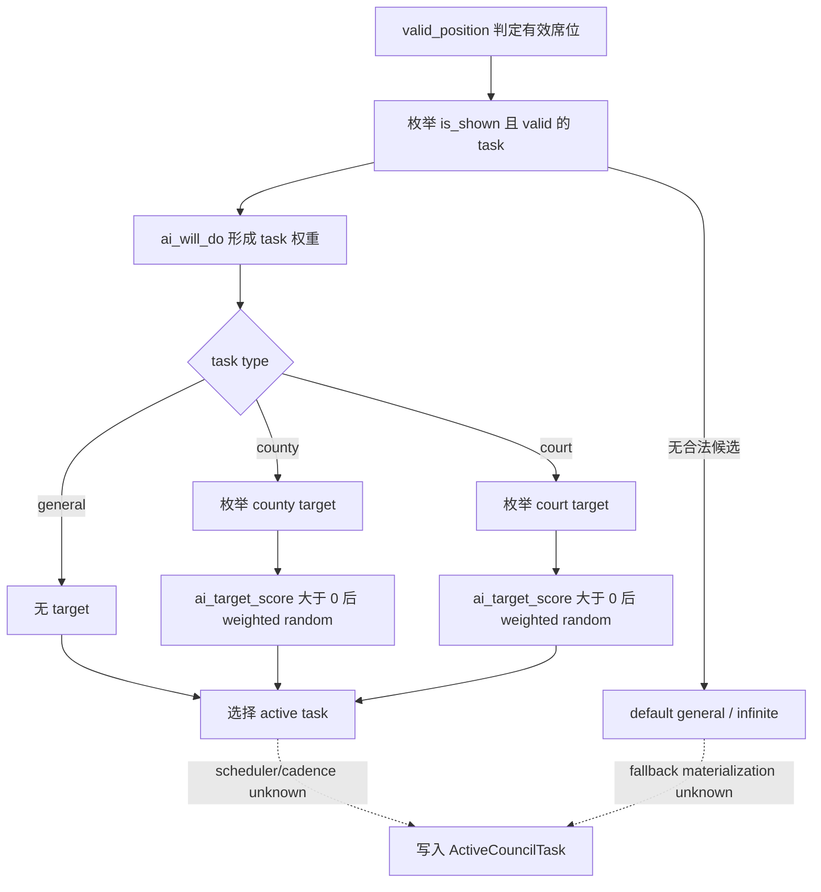
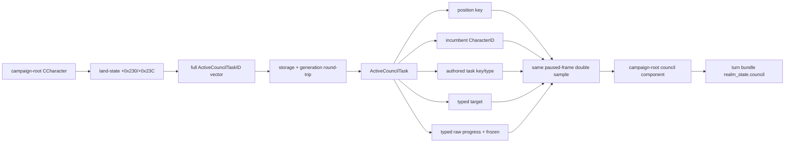

# CK3 1.19.0.6 内阁观测与发展任务原生入口

## 状态与施工范围

- **[production-live]** `campaign-root-context-v1` 已实现并在新轮次 R639 验证当前统治者内阁的只读 typed observation：动态枚举全部已物化 active position，并为标准 landed、非 nomadic 范围补齐五个核心席位的可证空缺。独立/vassal 两个封建场景各观测到 6 个 occupied task，且 turn bundle 同帧投影一致。
- 目标是把 `campaign-root-context-v1` 与 `xar.ck3.turn-bundle/v1` 中当前 unavailable 的 council 输入变成同一 paused frame 的 typed observation。它不实现任命、换任务、发展策略或其它内阁动作。
- M1 首次 live gate 要求的两个当前封建统治者场景已完成。游牧 kurultai、天朝 ministry 和 vizier 变体进入同一可扩展 schema，但不能由本次封建 production artifact 冒充已经覆盖。
- 宫廷司祭只作为 opaque council position/task 被观察。信仰、教义、教义条目、宗教热情、改宗和宗教改革继续遵守 owner-deferred 边界。

## Exact-build 冻结

| 资产 | 精确值 |
|---|---|
| CK3 build | `1.19.0.6` |
| `binaries/ck3.exe` 大小 | `95,206,008` bytes |
| `binaries/ck3.exe` SHA-256 | `2D00FF3101EF70B566F2FCBAE292F09263199C80E9DC8F139B82D7D96F83DB86` |
| `launcher/launcher-settings.json` SHA-256 | `23085950A98A8A85059B6E5AEA87F8B8A5D2698AB5633C21CEE1FC5019691368` |

下述 RVA 均以这份 EXE 的模块基址为零点。EXE、build 或原版 council 数据变化后，地址、对象布局和 position/task vocabulary 一律失效，必须先重新定位再升级证据等级。

## 原版定义提供的稳定 vocabulary

### Position key

原版 `game/common/council_positions/` 在该 build 定义了 15 个稳定 key：

| 族 | position key | 生效边界 |
|---|---|---|
| 常规 | `councillor_chancellor`、`councillor_steward`、`councillor_marshal`、`councillor_spymaster`、`councillor_court_chaplain` | 常规统治者席位，具体有效性仍由各 position 的 `valid_position` 决定 |
| 配偶 / 摄政型 | `councillor_spouse`、`councillor_vizier` | 配偶为自动填充；vizier 要求 `may_appoint_viziers` government flag |
| 游牧 | `councillor_kurultai_1` 至 `councillor_kurultai_4` | `government_is_nomadic` |
| 天朝 ministry | `minister_personnel`、`minister_justice`、`minister_works`、`minister_grand_marshal` | `tgp_has_access_to_ministry_trigger` |

因此不能把“内阁”硬编码成固定五席，也不能用 GUI 当前可见行数定义完整性。当前 reader 从玩家 land-state 的动态 active-task 向量发布全部已物化 position key；五个核心 key 只用于补出该有效范围内的空缺行。未物化的 spouse、vizier、kurultai、ministry 或 modded 辅助席位空缺不宣称已完整覆盖。

### Task type 与 progress kind

`game/common/council_tasks/_council_tasks.info` 直接定义：

- task type 只有 `general`、`county`、`court`；
- progress kind 只有 `infinite`、`percentage`、`value`；
- county task 的 typed scope 是目标 county 与其 capital province；
- court task 的 typed scope 是 `target_character`；
- `default_task` 只能是 `general + infinite`；
- `ai_target_score` 中权重大于零的目标进入 weighted random，`ai_will_do` 决定任务权重。

五个常规席位覆盖了 M1 所需的代表性形状：默认 general/infinite、steward 的 county/value `task_develop_county`、county/percentage 任务，以及 spymaster 的 court/percentage `task_find_secrets`。配偶、vizier、kurultai 与 ministry 另有各自 key，不能从常规五席外推其实机覆盖。

## 已闭合的 native 读取入口

### Character + position key -> ActiveCouncilTask

**[static-confirmed]** reflection 名 `GetCouncillorPosition` 的 canonical string 位于 RVA `0x430D258`。两个注册点分别位于 `0x4E3323` 和 `0x4E34A3`，注册函数范围为 `0x4E32B0..0x4E3428` 与 `0x4E3430..0x4E35B4`；对应 callback/thunk 为 `0x2435C00..0x2435C8B` 与 `0x2435C90..0x2435D35`，最终都到达 core `0x23F7800`。

`0x23F7800(CCharacter*, position_key)` 的已证行为是：

1. 以稳定 position key 查询 compiled council-position database；
2. 经 `0x2666CD0` 取得带 generation 的完整 `ActiveCouncilTask` ID；
3. 通过 storage pointer `module+0x570C778` 解引用；
4. 以对象 `+0x10` 的完整 ID 做 generation round-trip 校验；
5. 失败时走 `module+0x570C6D8` 的 canonical fallback pointer。

这条角色根对象路径是首个 production reader 的推荐入口。它复用 campaign-root 已经验证的 `CCharacter*` 根和同帧事务，不依赖 `CouncilWindow`、屏幕可见性、OCR 或焦点状态。

| 精确切片 | 长度 | SHA-256 |
|---|---:|---|
| core `0x23F7800..0x23F792D` | 302 | `A1635EE0E875A0D93B24894B88E71CDC86B60849ECA938C3B2877014D0FDF1F7` |
| thunk `0x2435C00..0x2435C8B` | 140 | `88D799FCD8E0CE9E4B1EEFD19A9D78824F66060D0CC9409DFBFE1C50C2FFB9DC` |
| thunk `0x2435C90..0x2435D35` | 166 | `4B29E80B8F2E02933508AEF467BA99E4CFB007C96E8A9FFB819D0F777E1C5E9C` |
| registration `0x4E32B0..0x4E3428` | 377 | `084A2DC06E381D34C4C726EABD4FEFBE0942B9226AFA1BC6FC2B940459257BEB` |
| registration `0x4E3430..0x4E35B4` | 389 | `9418521840D9B267426BDC69F731A2F8029E488AFAB4B90B9A37A4A7D176DFD8` |

### ActiveCouncilTask 动态集合与布局

**[static-confirmed]** `0x2666CD0` 直接遍历 `CCharacter+0x1B8` land-state 的 `+0x230` ID 数据和 `+0x23C` 数量。每个元素是 full-generation `ActiveCouncilTaskID`，经 `module+0x570C778` storage 解引用并以对象 `+0x10` round-trip；失败 fallback 是 `module+0x570C6D8`。因此 production reader 无需调用 GUI，也无需冻结 15-key allowlist：动态向量就是该角色所有已物化 active position 的事实源。

| 对象 | 偏移 | 语义 |
|---|---:|---|
| land-state | `+0x230/+0x23C` | active-task ID data/count |
| `ActiveCouncilTask` | `+0x10` | full-generation task ID |
| `ActiveCouncilTask` | `+0x18` | `CouncilTaskType*` |
| `ActiveCouncilTask` | `+0x20` | 非 value progress 的 raw current Q100000 |
| `ActiveCouncilTask` | `+0x35` | frozen byte |
| `ActiveCouncilTask` scopes | `+0x38/+0x3C` | incumbent / council-owner CharacterID |
| `ActiveCouncilTask` scopes | `+0x40/+0x48` | typed target tag / full ID |
| `CouncilTaskType` | `+0x18` | 稳定 authored task key，MSVC `std::string` |
| `CouncilTaskType` | `+0x38` | `CouncilPositionType*` |
| `CouncilTaskType` | `+0x40/+0x4C` | task-type / progress-kind enum |
| `CouncilPositionType` | `+0x18` | 稳定 position key，MSVC `std::string` |

`ActiveCouncilTask.GetCouncillor` 的 registration `0x4CEDD0..0x4CEFBA` 到 wrapper `0x23BC2F0`，再到 leaf `0xA711F0`；leaf 直接读 `task+0x38`，wrapper 随后用 Character storage 做 generation 校验。`GetTaskType` registration `0x4CE820..0x4CEA0C` 到 thunk `0x23BC030` 和 leaf `0xAA2330`，leaf 直接返回 `task+0x18`。validator `0x23BA9D0` 又以 `taskType+0x18` 作为 authored key，并验证 `task+0x3C` 是 incumbent 的 immediate liege，也就是 council owner。

| 精确切片 | 长度 | SHA-256 |
|---|---:|---|
| dynamic scan `0x2666CD0..0x2666E0C` | 316 | `E386DB4C0D6E816CF72A82F44C61D3438BCC689C247DB59EF8D447178E5DDEBB` |
| `GetCouncillor` registration `0x4CEDD0..0x4CEFBA` | 490 | `3B4B6420030E0294A3FC3691E47866A44E692A3F46AFA4BA3384241CE5EE8CEC` |
| incumbent wrapper `0x23BC2F0..0x23BC352` | 98 | `25F0239708FE4ECCA45CC22AE1CCADA99510402E6CE0A2E217584B8C2D5B888A` |
| incumbent leaf `0xA711F0..0xA711F9` | 9 | `1AF11F60D6173AAC65266C116B11C7F6E82FEC74F8AAC6974ADEBD657ABB0FD0` |
| `GetTaskType` registration `0x4CE820..0x4CEA0C` | 492 | `C6C1FDCA12B5AC6E532B600F825B64446F9F5F3F87A904609A0632BE5A87947C` |
| task-type thunk / leaf | 5 / 5 | `3683F137B736168AB28ECDB5BA1EF48071827BA55062056EA0580738D852F7B3` / `0C6B8858E139E1A255688DFC8B1FCA61C89CCEA689E8DA8BCD4276A9918F1DBE` |
| owner/key validator `0x23BA9D0..0x23BABA0` | 464 | `B09B2952F63E29621504B4B3CC333AF2C20A5F9521D737052834A285D3654497` |

### Typed target 与 progress

**[static-confirmed]** target core `0x23BA450` 按 `CouncilTaskType+0x40` 分支：`general=0` 无 target；`county=1` 要求 scope tag `8`，把 `task+0x48` 当 ProvinceID 并通过 `game_data+0x140/+0x14C` province array；`court=2` 要求 tag `4`，把 `task+0x48` 当 full-generation CharacterID 并经 Character storage round-trip。

`GetProgressFloat` core `0x23BAC10` 与 `GetProgressMaxFloat` core `0x23BAC50` 证明 progress-kind enum 为 `infinite=0`、`percentage=1`、`value=2`。两个 UI getter 都按 Q100000 缩放；percentage 的 maximum raw 固定为 `10,000,000`。value current/max 调用只读 evaluator `0x2D650A0` / `0x2D65390`，参数为 `CouncilTaskType*`、调用者的 `int64` 输出和 `task+0x38` scopes。

| 精确切片 | 长度 | SHA-256 |
|---|---:|---|
| county dispatch `0x23BA450..0x23BA4B4` | 100 | `D132CBD9FEC317C0FE88437D1AC1E232E90483CD3FF42FBAD1F08C4DDF9612DD` |
| court target `0x23BA4C0..0x23BA514` | 84 | `A35A4A73FF93C7B818D433558AD2F288016575AC2B2E3398DC779B1A1A97FA7E` |
| frozen leaf `0x23BABA0..0x23BABA5` | 5 | `F47DCC5FDF6BF192F97D4CF14EAA998DF0232935D7CB09617D8AC18A2AE90B29` |
| current/max core | 63 / 79 | `2227E60C4BCA908F5D4F46859C837CD1445CE50284A02C020E19E040F00225D6` / `AA79313B8F07F7E6652BC91EFD5D9B47B4A75B36B3A50508B2E812DD0D8282D0` |
| value current evaluator `0x2D650A0..0x2D65390` | 752 | `4A555E79AEC9F4A4448B66E618A05A15A851111D29D76D64420284B7DB44D60E` |
| value max evaluator `0x2D65390..0x2D65683` | 755 | `D12BA93AA4CBFC6382DECBCA92B4BEED8CB02754CEE821D2B441A0320AF56ABF` |

`GetETA` 返回 formatter/localization string，不进入 machine ABI。以后如需 ETA，应从 typed raw progress 与另行闭合的 rate 计算。

### GUI 只作 reflection 佐证

**[static-confirmed]** 原版 `window_council.gui` 使用 `CouncilWindow.GetCouncillor(position_key)`、`GuiCouncilPosition.GetActiveCouncilTask`，随后读取 `GetCouncillor`、`GetTaskTypeOrDefault`、`GetTaskTarget`、progress 和 frozen。GUI 的 target/ETA 面向显示文本；production reader 不实例化 `CouncilWindow`，也不依赖画面、OCR 或焦点。

## 原版任务选择树

下图描述 exact-build authored AI 数据。runtime scheduler 与切换 cadence 仍是后续策略研究的 unknown，不阻塞当前只读 observation。

## 已实现的 native 数据流

## 已实现合同与诚实边界

`campaign-root-context-v1` 现在发布：`status`、`coverage_key`、owner、按 unsigned UTF-8 byte order 排序的 positions、`auxiliary_vacancies_complete` 与 typed unavailable reason。每个 occupied row 发布 incumbent、task key/type、typed target、frozen 和 typed progress；vacant row 的这些字段全部为 `null`。

- 在 `standard_landed_non_nomadic_core_v1` 范围内，动态向量的全部已物化辅助席位都会发布；五个标准核心席位若未物化，则补成可证空缺行。
- `auxiliary_vacancies_complete=false` 是固定诚实边界：当前实现无法由动态向量证明未物化的 spouse、vizier、ministry、modded 辅助席位是空缺还是不适用。
- landless adventurer、nomadic、celestial government 或无 primary landed title 时，council component 返回 `outside_standard_landed_non_nomadic_core_scope`，`council_ready=false`；其余 campaign-root 字段仍可 available，顶层 `readiness.ready` 不被这个范围外组件拖成 false。R676 在天朝角色 `32904` 的真实暂停帧证明 celestial ministry 不能按标准五席内阁布局读取；该范围修正只跳过未承诺的内阁组件，不放宽继承、头衔、健康、经济等同帧字段。
- 任一 active-task generation mismatch、重复 position key、owner 不符、task/target 类型不符、非法 target identity、结构读取失败或双样本漂移都会让完整 campaign-root 返回 typed unavailable；不发布部分旧值。
- `general` target 为 `null`；`infinite` current/maximum 为 `null`；county target 发布 ProvinceID，court target 发布 CharacterID。
- `GetETA`、GUI tooltip、main skill、powerful-vassal 标志不进入 M1 最小合同。

聚焦 native fixture 已覆盖动态辅助 position、两个核心空缺、general/infinite、county/value、court/percentage，以及 target tag mismatch、ActiveCouncilTask generation mismatch 与 value-progress 双样本漂移。

## 仍需闭合的边

| 状态 | 缺口 | 下一项精确工作 |
|---|---|---|
| **[production-live]** | current-feudal 实机值 | 新轮次 R639 两场景均为 `available`，五核心席位完整且各有一个 occupied spouse 辅助 row；turn bundle 投影一致 |
| **[production-live, spouse only]** | dynamic auxiliary occupied row | R639 两场景自然观测 spouse；vizier/ministry/kurultai 仍随对应政府场景补证 |
| **[static/live pending]** | auxiliary vacancy completeness | 后续按具体 government 冻结 effective-position 原生集合；在此之前保持 `auxiliary_vacancies_complete=false` |
| **[unknown]** | runtime scheduler/cadence | 仅影响后续任务切换 counter-policy；继续保留在原生树虚线分支 |
| **[owner-deferred]** | 通用宗教内阁策略 | 宫廷司祭当前只作 opaque position/task；不借此扩展 faith/doctrine 树 |

`task_develop_county` 现在解锁“当前 steward 在何处发展、进度多少”的可见输入。是否切换任务、如何挑县和何时换人仍需先闭合 scheduler/候选行为，再设计 counter-policy。

## 实现与静态验收

原生实现位于 `campaign_root_context_v1.hpp/.cpp` 与 serializer；exact-build 布局、RVA 和逐切片 SHA-256 冻结在 `native_bridge/research/campaign_root_context_v1_abi.json`，source contract 位于对应 `research/fixtures/`。2026-09-13 使用既有 MSVC x64 Release 构建完成以下有界验证：

- `xar_ck3_campaign_root_context_v1_test.exe`：GREEN，覆盖 reader、serializer、动态/空缺 position、typed target/progress、generation failure 和 same-frame drift；
- `xar_ck3_campaign_root_context_v1_source_contract_test.exe`：GREEN，确认 compiled binding、只读源码边界、ABI 与 fixture 字段一致；
- `xar_ck3_bridge.dll`：Release 增量编译及链接成功。

这些结果把能力提升到 `static-ready`，不能替代 production paused live artifact。

新轮次 R639 随后以 fresh Release DLL 完成既定双场景 production paused gate。独立 ruler `29829` 与 vassal ruler `36108` 均发布
五个核心席位和一个 occupied spouse row，两个场景的 `council_ready`、turn-bundle `realm_council_ready` 及全 bundle readiness
均为 true。Artifact SHA-256 为 `CFF681146A344AE18FDEB36C20BDAEAFC2A30344023CC7827E9A77006C3530DB`；这把当前封建范围提升为
`production-live`，但不外推 auxiliary vacancy completeness 或其它 government 变体。

## 静态证据账本

| 文件 | SHA-256 | 用途 |
|---|---|---|
| `game/common/council_positions/_council_positions.info` | `3018B801E7FE01AAD8D8B2F78FA691DA4E6924737F4430F0ED19757F03D67B29` | position schema |
| `game/common/council_positions/00_council_positions.txt` | `8D667AFE296D987F2E849A5C55B17EF9A98E73B9E73E925898EA2986B3155909` | 常规、spouse、vizier、kurultai positions |
| `game/common/council_positions/01_ministry_positions.txt` | `891B6B129BE55D4BA4678A83B93A240BA53B3705C618C02B116F99C1A2E75272` | ministry positions |
| `game/common/council_tasks/_council_tasks.info` | `CA9BC5D06ADC414ED8A28B47E4D3BDACDBB30093E94FBD33FE1A80FE518B8A2A` | task type/progress/scope/AI authored contract |
| `game/common/council_tasks/00_chancellor_tasks.txt` | `503E04F591067DE14E8EC50D435717100BFC0BD678A032E7BF4052CB4FBF9A84` | chancellor tasks |
| `game/common/council_tasks/00_steward_tasks.txt` | `B3087378E04D0CDF7B1C1BEBF97FD17E36D8684DDD157D4FB0647B1D5681FC4B` | steward/development tasks |
| `game/common/council_tasks/00_marshal_tasks.txt` | `F0CB7FC6732DF1EF5F87AC26C5042F66CBE33F2501E15E4A3B7295E2921F94B9` | marshal tasks |
| `game/common/council_tasks/00_spymaster_tasks.txt` | `EBE10909D2618AE9B6360C738397F6304C6D61FA597DBA16232772C05B4E0613` | spymaster tasks |
| `game/common/council_tasks/00_court_chaplain_tasks.txt` | `FEC88B59DEE0187CBDED653B84731E14B8F64E445A11FF3CCFD52D7CBEC73089` | chaplain tasks |
| `game/common/council_tasks/00_spouse_tasks.txt` | `661F7E9867DE29132A73BFDCD12C497BCD3473C7782208EAF69DFA86A5AC4088` | spouse tasks |
| `game/common/council_tasks/00_vizier_tasks.txt` | `9B27DCD494F93ED0A451E1EA5CF6C78C99912AD750E5F4CF2453A321A7A57DF6` | vizier tasks |
| `game/common/council_tasks/00_kurultai_tasks.txt` | `CAFEEDBC72C11829CC15B1770992A0EA689ECF5A595EA7CF895998A26C07630F` | kurultai tasks |
| `game/common/council_tasks/01_ministry_tasks.txt` | `E34EFD72DE1175990B71A32B62D1EC98858A304E817FCC487E985EFC1AAB5E42` | ministry tasks |
| `game/gui/window_council.gui` | `AC142DC4D4F18EEEB241C7B9DBDE1F737DF8D0D7114FF4CA845DC3E9A230BAAE` | council reflection consumer |
| `game/gui/shared/value_breakdown.gui` | `46CF546F9A0DB824E5CE38FAC1B11593672962E3F3793B62E559435FB9D71525` | progress/max/ETA display consumer |
| `game/gui/shared/misc_components.gui` | `6FBD971001D40C23E79033EDDC0E53F32FE814DE056F6F2E67131ECF056196A1` | direct `GetPlayer.GetCouncillorPosition` consumer |

这里的 `game/...` 都是 `Crusader Kings III/game/...` 下的 exact-build 原版文件。固定 GUI 场景或既有 `opening_smoke.py` 只能证明特定画面流程，不能证明 native council completeness，因此不列作本专题的状态证据。
